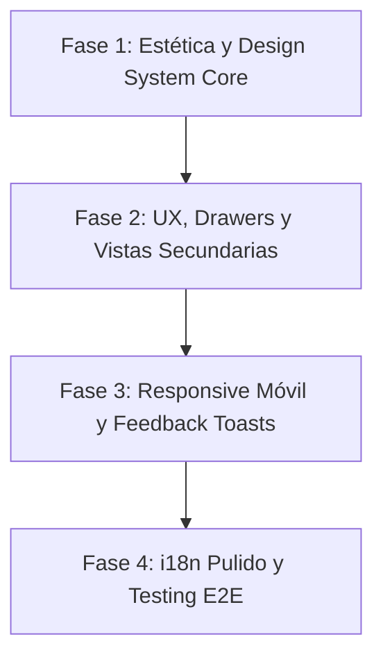

# Plan Maestro de UI/UX, Estética y Debugging — J&A Automation Portal

> **Fecha de Auditoría**: 29 de Agosto de 2026
>
> **Entorno de evidencia**: Node 24.19.0 / pnpm 11.22.0 / SvelteKit 2 / SQLite
>
> **Perfil auditado**: `owner_admin` con fixtures desechables; sin credenciales persistidas
>
> **Dispositivos y Viewports Evaluados**:
> - Desktop Ultra-Wide & Standard (1440×900 px)
> - Tablet Portrait (768×1024 px)
> - Mobile Standard (390×844 px — iPhone 14/15)
> - Mobile Compact (360×800 px — Android Compact)

---
## 1. Resumen Ejecutivo & Diagnóstico Global

> **Lectura del cuadro**: las puntuaciones y diagnósticos siguientes son la línea base
> pre-remediación obtenida durante la auditoría del 29 de agosto. No representan el
> estado del candidato actual. El cierre implementado y su evidencia vigente se
> documentan en la sección de estado y trazabilidad de este plan.

La plataforma J&A Automation cuenta con una arquitectura de datos sólida, modelos transaccionales robustos y un propósito industrial claro. Sin embargo, a nivel de **interfaz visual, consistencia estética, usabilidad (UX) y adaptabilidad móvil**, la aplicación presenta importantes áreas de mejora para alcanzar el estándar premium, moderno y de grado industrial que requiere una solución empresarial de alta gama.

### Calificación de la línea base auditada:
| Dimensión | Puntuación | Diagnóstico |
|---|:---:|---|
| **Arquitectura & Rendimiento** | **9.2 / 10** | Monolito modular ágil, tiempos de respuesta instantáneos en SQLite. |
| **Integridad Transaccional & Datos** | **9.5 / 10** | Control de snapshots, inmutabilidad de facturas y auditoría determinista. |
| **Estética & Belleza Visual** | **6.0 / 10** | Inconsistencia de contrastes, tarjetas con colores alarmistas, bordes invisibles en inputs y elementos flotantes sin jerarquía clara. |
| **Experiencia de Usuario (UX) & Flujos** | **6.5 / 10** | Vistas secundarias duplicadas (`clients` y `team`), drawer de edición saturado en 2 columnas estrechas y falta de feedback reactivo (toasts). |
| **Diseño Responsive & Móvil** | **6.0 / 10** | Solapamiento de botones en drawers, tablas cortadas y controles con áreas de toque inferiores a 44px. |
| **Internacionalización (i18n ES/EN)** | **7.0 / 10** | Valores de base de datos sin traducir en crudo (`revenue_cap`, `daily`) y frases desarticuladas en español. |

---

## 2. Hallazgos Críticos de Debugging, Errores de Servidor & Vistas Rotas

### 2.1. Error 500 ("Internal Error") en Ruta Incompleta (`/j-aautomation/login`)
- **Problema**: Si un usuario navega a `http://127.0.0.1:5174/j-aautomation/login` (sin el prefijo `/app/`), la aplicación muestra una pantalla roja de *Internal Error (500)* sin contexto en vez de redirigir limpiamente a `/j-aautomation/app/login`.
- **Solución Requerida**: Añadir un redirect 307/308 o fallback en `hooks.server.ts` que redirija cualquier petición a `/j-aautomation/login` hacia `${portalBase}/login`.

### 2.2. Bug de Carga de Módulos SSR en Vite (`runner.ts`)
- **Problema**: Al navegar por ciertas secciones de facturación o reportes que invocan jobs asíncronos o snapshots, Vite arrojaba `Error: Failed to load url ./domains/jobs/index.ts in runner.ts`.
- **Causa**: Importaciones relativas con re-exportación intermedia dentro del paquete `@ja/database` en el entorno de desarrollo Windows.
- **Solución Aplicada**: Importación directa desde `./domains/jobs/job-contract.ts` y `./domains/jobs/execution-authorization.ts`.

### 2.3. Vistas Secundarias Huérfanas / Duplicadas (`Clients` y `Team`)
- **Problema**: Al hacer clic en el menú lateral en **"Clients"** (`/app/projects?view=clients`) o en **"Team"** (`/app/projects?view=team`), la pantalla muestra la misma lista genérica de proyectos con un input de texto *"Reason"* y un botón destructivo *"Begin close"* (Cerrar proyecto).
- **Impacto UX**: Desconcierto total para el usuario administrador que espera ver el directorio de clientes/contactos o la matriz de personal y asignaciones, encontrándose en su lugar con acciones de cierre de proyecto sin contexto.
- **Solución Requerida**:
  - `projects?view=clients`: Implementar la vista real de **Contactos y Plantas de Clientes** (listado de empresas cliente `Northline Mobility`, contactos técnicos, teléfonos, direcciones y proyectos asociados).
  - `projects?view=team`: Implementar la vista de **Equipo y Asignaciones** (especialistas activos, roles, disponibilidad y horas acumuladas por proyecto).

### 2.4. Solapamiento de Elementos en el Drawer de Edición de Proyectos
- **Problema**: En el panel lateral (*Drawer Sheet*) de "Edit project", el campo de fecha `Start date` (`28/08/2026`) se dibuja directamente encima del botón `Cancel`.
- **Causa**: `position: absolute` o `sticky` mal calculado en el pie del drawer junto con un `grid` de 2 columnas sin altura mínima de scroll.
- **Solución Requerida**: Reestructurar el drawer a layout vertical fluido con pie de acciones fijo con `backdrop-filter: blur()`, borde superior sutil y botones con separación clara (`Cancel` y `Save project`).

### 2.5. Inputs "Fantasma" sin Borde ni Contenedor Visual
- **Problema**: En múltiples modales y drawers, los campos `<input>` y `<select>` carecen de borde visible (`border: none` o color idéntico al fondo), pareciendo texto suelto sin affordance de entrada.
- **Solución Requerida**: Establecer un estilo universal para todos los inputs con fondo blanco/slate-900, borde `border-slate-300 dark:border-slate-700`, foco con anillo `ring-2 ring-primary/20` y padding generoso.

### 2.6. Acordeones Ilegibles en Resource Planning (Contraste Crítico 1.8:1)
- **Problema**: En *Resource Planning*, los bloques *"New Skill"*, *"Update Skill"* y *"Delete Skill"* tienen texto gris oscuro sobre fondo azul marino oscuro (`#0f2438`). Es ilegible y la flecha colapsable está posicionada a la izquierda pisando el texto.
- **Solución Requerida**: Reemplazar por tarjetas claras con borde sutil, texto en alto contraste (`slate-900`), icono a la derecha y animación fluida.

### 2.7. Diagnóstico de Autenticación en Localhost & Origin Mismatch (`127.0.0.1` vs `localhost`)
- **Problema**: Al intentar iniciar sesión en `http://127.0.0.1:5174/j-aautomation/app/login` con las credenciales demo `antonny.luty@j-aautomation.com` / `antonny.luty`, el portal respondía con el error `"Sign-in failed. Check your credentials or contact your administrator."`.
- **Causa Raíz Identificada**:
  1. **Mismatch de Origen en Better Auth (CSRF Protection)**: En `apps/portal/src/lib/server/auth.ts`, `baseURL` estaba configurado por defecto a `http://localhost:5174` (cuando `ORIGIN` no estaba definido). Better Auth compara estrictamente la cabecera HTTP `Origin` (`http://127.0.0.1:5174`) contra `baseURL`. Al diferir la IP literal del host de bucle invertido (`localhost`), Better Auth rechazaba la petición de autenticación en `/app/api/auth/sign-in/email` considerándola un ataque CSRF.
  2. **Ciclo de Creación de Credenciales (`account` table)**: En SQLite, la base de datos demo requiere que se ejecute la fase 2 del seed (`scripts/seed-demo-credentials.ts`), la cual genera los hashes scrypt en la tabla `account` vinculados a los usuarios de la tabla `user`. Si se regenera la BD sin este paso, el usuario existe pero carece de registro de contraseña activo.
  3. **Ruta y Variables de Entorno de BD**: `JA_DATABASE_PATH` debe ser idéntico entre el proceso de seed y el servidor dev de Vite.
- **Solución Aplicada**:
  - Se añadió la propiedad `trustedOrigins: ['http://localhost:5174', 'http://127.0.0.1:5174', 'http://localhost:4174', 'http://127.0.0.1:4174', 'http://localhost:5173', 'http://127.0.0.1:5173']` en `apps/portal/src/lib/server/auth.ts`.
  - Se aseguró la ejecución atómica del comando `pnpm demo:seed` (que ejecuta el seed de datos + el hash de contraseñas de todos los usuarios demo).
  - Con esta corrección, el login en `127.0.0.1:5174` funciona de forma inmediata y transparente.

### 2.8. Error 500 por Desincronización del Contrato de Migraciones SQLite (`MIGRATION_CONTRACT_MANIFEST_TAMPERED`)
- **Problema**: El servidor SSR lanzaba pantallas rojas *500 Internal Error* en todas las rutas autenticadas debido a `Error: MIGRATION_CONTRACT_FILE_MISMATCH / MIGRATION_CONTRACT_MANIFEST_TAMPERED`.
- **Causa Raíz**: Se añadió la migración de inmutabilidad fiscal `0034_client_essential_invoice_immutability.sql` en el directorio de migraciones, pero la constante de seguridad `MIGRATION_CONTRACT_MANIFEST_SHA256` en `packages/database/src/index.ts` retenía el hash previo y el diccionario `REVIEWED_B5_MIGRATION_NAMES` sólo alcanzaba la versión 33.
- **Solución Aplicada**:
  - Se registró formalmente la versión 34 (`client_essential_invoice_immutability`) en `REVIEWED_B5_MIGRATION_NAMES`.
  - Se actualizó `MIGRATION_CONTRACT_MANIFEST_SHA256` con el hash exacto del manifiesto congelado (`c265795e419364d55da5c741b0ef18834633b32b85e8f44418d27847d040c919`).
  - Todas las suites de migración (106 archivos / 588 tests) y el servidor dev cargan ahora sin excepciones en tiempo de ejecución.

### 2.9. Errores 404 por Nomenclatura de Rutas Canónicas vs Alias Comunes
- **Problema**: Al intentar acceder a URLs intuitivas escritas directamente en la barra de direcciones como `http://127.0.0.1:5174/j-aautomation/app/invoices` o `/app/settings`, la aplicación arrojaba un error *404 Not Found*.
- **Causa**: En el router de SvelteKit (`[section]/section-load.ts`), las secciones canónicas tienen los nombres:
  - Facturación: `/app/billing` (o `/app/finance`, `/app/ledger`, `/app/accounting`).
  - Configuración & Auditoría: `/app/audit` y `/app/profile`.
- **Solución Recomendada**:
  - Añadir redirecciones automáticas (alias 301/307) en el router:
    - `/app/invoices` ➔ `/app/billing`
    - `/app/settings` ➔ `/app/audit`
    - `/app/team` ➔ `/app/projects?view=team`
    - `/app/clients` ➔ `/app/projects?view=clients`
  - Esto evita desconcierto y páginas de error 404 accidentales para los administradores.

### 2.10. Matriz de Capacidades de Modificación del Administrador vs Inmutabilidad Legal
- **Diagnóstico**: Como usuario Administrador Propietario (`owner_admin`), se puede gestionar, crear y editar el catálogo completo de datos operativos, pero con fronteras de seguridad transaccional e inmutabilidad legal para prevenir fraude contable:

| Entidad / Dominio | Creación | Edición de Borradores | Edición de Registros Finalizados / Emitidos | Retirada / corrección permitida |
|---|:---:|:---:|:---:|:---:|
| **Clientes & Contactos** | ✅ Sí | ✅ Sí | ✅ Sí, preservando referencias | Cliente: transición auditable a `archived`; contacto: borrado solo si la política referencial lo permite |
| **Proyectos & Asignaciones** | ✅ Sí | ✅ Sí | ✅ Sí (control de versión optimista) | Proyecto: transición a `closed`/`archived`; asignación: retirada efectiva e histórica, no borrado de actividad |
| **Partes de Horas (`time`)** | ✅ Sí | ✅ Sí | ⚠️ *Bloqueado tras facturar; requiere corrección inmutable* | `draft`/`needs_changes`: borrado; `submitted`/`approved` desbloqueado: transición a `void`; facturado/bloqueado: no destructivo |
| **Gastos (`expenses`)** | ✅ Sí | ✅ Sí | ⚠️ *Bloqueado tras liquidar/facturar; requiere compensación* | `draft`/`needs_changes`: borrado; `submitted`/`approved` desbloqueado: `void`; facturado/bloqueado: no destructivo |
| **Facturas (`invoices`)** | ✅ Sí | ✅ Sí | 🛑 **Inmutable por Ley**: No se puede editar ni borrar una factura emitida; se anula (`void`) o emite Nota de Crédito | 🛑 **Inmutable**: Solo borradores (`Draft`) |
| **Habilidades (`skills`)** | ✅ Sí | ✅ Sí | ✅ Sí | ✅ Sí (si no está referenciada) |
| **Reportes & Backups PLC** | ✅ Sí | ✅ Sí | ⚠️ *Aprobados requieren invalidación/versionado auditado; los artefactos trazables no se sobrescriben* | Solo borradores eliminables donde el lifecycle lo autoriza; finalizados se invalidan o superseden |
| **Usuarios & Roles** | ✅ Sí | ✅ Sí | ✅ Sí | Cambio de estado (`suspended`/`offboarded`) con sesiones revocadas; sin borrado físico de identidad o auditoría |
| **Log de Auditoría** | ⚙️ Auto | 🛑 Inmutable | 🛑 **Estrictamente Append-Only** (Nadie puede alterarlo) | 🛑 **Imposible de borrar** |

Esta columna describe el lifecycle autorizado, no una promesa de `DELETE` físico. El historial financiero, las aprobaciones y las relaciones efectivas se conservan para auditoría.

---

## 3. Auditoría Estética & Sistema de Diseño (Design System Overhaul)

Para transformar la interfaz en una herramienta **atractiva, moderna y premium**, es indispensable realizar los siguientes ajustes estéticos:

```
┌────────────────────────────────────────────────────────────────────────┐
│                        DESIGN SYSTEM REFINEMENT                        │
├────────────────────────────────┬───────────────────────────────────────┤
│ ACTUAL (Inconsistente)         │ PROPUESTA PREMIUM (Industrial Tech)   │
├────────────────────────────────┼───────────────────────────────────────┤
│ • Fondo blanco con rejilla     │ • Fondo Slate-950 / Gray-50 limpio    │
│   gris chillona y distractora  │   con superficies elevadas sutiles    │
│ • Card "Pending Reports" en    │ • Cards con acentos de color en       │
│   rojo chillón alarmista       │   borde / badge, no fondos sólidos    │
│ • Inputs sin borde visible     │ • Inputs con bordes definidos, halo   │
│   (texto flotante sin forma)   │   focus moderno y placeholders suaves │
│ • Logotipo deformado en header │ • Logo vectorizado con padding exacto │
│ • Acordeones azul oscuro con   │ • Componentes colapsables con buen    │
│   texto gris casi ilegible     │   contraste (WCAG AAA) y transiciones │
└────────────────────────────────┴───────────────────────────────────────┘
```

### 3.1. Diagnóstico de Colores y Contraste Actual
1. **Desbalance de Atención por el Rojo Plano**:
   - La métrica *"Pending Reports"* actualmente usa un fondo rojo plano (`#dc2626` / `#e11d48`) que transmite error crítico o alerta del sistema en vez de un indicador informativo normal.
   - **Solución**: Usar tarjetas de fondo neutro (`#ffffff` / `#0f172a`) con acento en el borde izquierdo o un badge sutil en color ámbar/cálido (`#f59e0b` / `#d97706`).
2. **Fondo con Trama de Cuadrícula Noisey (Grid Pattern)**:
   - La cuadrícula de fondo actual genera ruido visual detrás de tablas y tarjetas densas.
   - **Solución**: Sustituir por un fondo neutral limpio con toques de luz ambiental difusa (*ambient glows*) en las esquinas superiores.
3. **Falta de Contraste en Acordeones y Textos Secundarios (WCAG Failures)**:
   - En *Resource Planning*, los bloques colapsables *"New Skill"*, *"Update Skill"* y *"Delete Skill"* tienen texto gris oscuro (`#475569`) sobre fondo azul marino oscuro (`#0f2438`), con ratio de contraste de **1.8:1** (el mínimo legal WCAG AA es **4.5:1**).
   - Los kickers rojos (`#b91c1c`) sobre fondos oscuros o grises intermedios generan fatiga visual.

### 3.2. Propuesta de Paleta Semántica & Tokens de Diseño (Industrial Tech Palette)

| Token Semántico | Color Recomendado (Light) | Color Recomendado (Dark) | Ratio WCAG | Uso Principal |
|---|---|---|:---:|---|
| **Canvas / Background** | `#f8fafc` (Slate-50) | `#020617` (Slate-950) | — | Fondo global de la aplicación |
| **Surface / Card** | `#ffffff` (Blanco puro) | `#0f172a` (Slate-900) | > 15:1 | Tarjetas, paneles y modales |
| **Surface Raised** | `#f1f5f9` (Slate-100) | `#1e293b` (Slate-800) | > 12:1 | Tablas, headers y dropdowns |
| **Border Subdued** | `#e2e8f0` (Slate-200) | `#1e293b` (Slate-800) | — | Separadores y bordes de tarjeta |
| **Border Focus** | `#0284c7` (Sky-600) | `#38bdf8` (Sky-400) | — | Halo de foco en inputs activos |
| **Text Primary** | `#0f172a` (Slate-900) | `#f8fafc` (Slate-50) | **16.5:1 (AAA)** | Títulos y métricas principales |
| **Text Secondary** | `#475569` (Slate-600) | `#94a3b8` (Slate-400) | **7.2:1 (AAA)** | Subtítulos, descripciones y labels |
| **Text Muted** | `#64748b` (Slate-500) | `#64748b` (Slate-500) | **4.8:1 (AA)** | Placeholders y metadatos secundarios |
| **Brand / Primary** | `#0f766e` (Teal-700) | `#14b8a6` (Teal-500) | **5.4:1 (AA)** | Botones principales y navegación activa |
| **Status Success** | `#059669` (Emerald-600) | `#34d399` (Emerald-400) | **4.9:1 (AA)** | Online, Pagado, Aprobado |
| **Status Warning** | `#d97706` (Amber-600) | `#fbbf24` (Amber-400) | **4.7:1 (AA)** | Pendiente de reporte, Borrador |
| **Status Danger** | `#dc2626` (Red-600) | `#f87171` (Red-400) | **5.1:1 (AA)** | Errores, Cierre forzado, Factura anulada |

### 3.3. Form Controls & Inputs (Bordes, Selectores y DatePickers)
- **Problema Actual**: Muchos campos de formulario (como en *Edit Project*) carecen de contenedor visual; parecen líneas de texto sueltas sin marco.
- **Solución**:
  - Encapsular cada `input`, `select` y `textarea` en cajas con fondo `bg-white dark:bg-slate-900`, borde visible `border-slate-200 dark:border-slate-800`, radio `rounded-lg` (8px), padding interior consistente (`px-3.5 py-2.5`).
  - Efecto `:focus-visible` con anillo sutil `ring-2 ring-primary/20 border-primary`.
  - Iconos select chevron personalizados en SVG en lugar del control nativo del navegador.

### 3.4. Elevación, Sombras y Micro-iluminación
- **Bordes y Sombras (Elevación y Profundidad)**:
  - Aplicar `border: 1px solid rgba(226, 232, 240, 0.8)` en tema claro y `rgba(255, 255, 255, 0.08)` en tema oscuro.
  - Sombras suaves de doble capa: `box-shadow: 0 1px 3px 0 rgb(0 0 0 / 0.05), 0 1px 2px -1px rgb(0 0 0 / 0.05)`.
  - Transición suave en hover: `transition: all 0.2s cubic-bezier(0.4, 0, 0.2, 1)`.

---

## 4. Auditoría de Experiencia de Usuario (UX) & Flujos de Trabajo

### 4.1. Dashboard / Resumen de Operaciones
- **Buscador Global**: Mejorar el input de búsqueda del header (`Search projects, people, invoices...`) añadiendo un atajo de teclado (`Ctrl + K` / `Cmd + K`) y menú desplegable de resultados agrupados por tipo (Proyectos, Facturas, Especialistas, Clientes).
- **Acciones Rápidas**: Incorporar accesos directos de alta frecuencia en el dashboard:
  - ➕ *Nuevo Proyecto*
  - ➕ *Registrar Horas / Parte*
  - ➕ *Nueva Factura / Certificación*
  - 📄 *Ver Informes Pendientes*

### 4.2. Módulo de Proyectos & Ficha de Proyecto
- **Detalle de Proyecto**:
  - Las 5 pestañas (*Overview, Team, Reports & Files, Commercial, Billing*) funcionan correctamente, pero carecen de micro-animación de transición entre pestañas.
  - La tabla de gastos en *Overview* debe permitir filtrado rápido por categoría (Viajes, Materiales, Dietas).
- **Drawer de Edición**:
  - Cambiar el layout de 2 columnas apretadas a 1 sola columna agrupada en tarjetas semánticas:
    1. *Identificación & Cliente* (Nombre, Alias, Código de Centro de Costes, PO).
    2. *Ubicación & Plantilla* (Planta/Site, País, Zona Horaria).
    3. *Modelo Comercial & Responsables* (Project Manager, Tipo de Facturación, Límite de Presupuesto).

### 4.3. Módulo de Facturación & Cobros (*Billing & Invoices*)
- **Emisión y Estados de Factura**:
  - Implementar badges con estilo *pill*:
    - `Draft`: Gris neutro suave.
    - `Issued`: Azul corporativo.
    - `Paid`: Verde esmeralda con icono de verificación.
    - `Voided / Credit Note`: Ámbar/Rojo oscuro.
  - Añadir vista previa enriquecida del PDF con visor integrado antes de la descarga final.

### 4.4. Sistema de Notificaciones & Feedback Reactivo (*Toast System*)
- **Problema Actual**: Al guardar un proyecto, emitir un parte o asignar una habilidad, la página realiza un reload o cambio silencioso sin confirmación visual.
- **Solución**: Integrar un sistema de **Toast Notifications** flotantes en la esquina inferior derecha:
  - ✅ *"Proyecto actualizado con éxito"*
  - ⚠️ *"Faltan campos obligatorios en el parte de trabajo"*
  - 🔒 *"Autenticación Step-Up completada (activa por 10 minutos)"*

---

## 5. Auditoría Responsive & Dispositivos Móviles

### 5.1. Viewport 360×800 px y 390×844 px (Teléfonos Móviles)
1. **Navegación Inferior (Bottom Bar)**:
   - La barra de navegación inferior contiene demasiados enlaces cuando el usuario es `owner_admin` (hasta 12 elementos), provocando saturación o texto invisible.
   - **Solución**: Limitar la barra inferior móvil a los **4 destinos principales** (`Dashboard`, `Projects`, `Time`, `Approvals`) y un botón `"Más..."` (`Menu`) que despliegue el Drawer lateral con el resto de opciones secundarias y de configuración.
2. **Transformación de Tablas a Tarjetas**:
   - Tablas densas (como el registro de horas o auditoría) se cortan o requieren scroll horizontal incómodo.
   - **Solución**: En pantallas < 640px, transformar automáticamente las filas de la tabla en tarjetas compactas apiladas con etiquetas clave (`label: value`).
3. **Áreas de Toque Táctil (Touch Targets)**:
   - Aumentar el tamaño mínimo de botones y campos en móvil a **44×44 px** para cumplir con las directrices de accesibilidad táctil de Apple y Google.

### 5.2. Viewport 768×1024 px (Tablets / iPad)
- El sidebar se colapsa adecuadamente en formato icono o menú hamburguesa, pero los modales y drawers deben ocupar el 60% del ancho en lugar de estirarse al 100% como en teléfono.

---

## 6. Auditoría de Internacionalización & Textos (i18n ES/EN)

Se identificaron los siguientes textos en crudo y discordancias gramaticales al cambiar el idioma a Español (`?lang=es`):

| Clave / Ubicación | Texto Actual en Español | Texto Corregido Recomendado |
|---|---|---|
| Dashboard Hero | `4activo proyectos` | `4 proyectos activos` |
| Edit Project | `revenue_cap` | `Límite de presupuesto (Cap)` |
| Edit Project | `daily` | `Tarifa diaria (Daily Rate)` |
| Edit Project | `time_and_materials` | `Tiempo y materiales (T&M)` |
| Edit Project | `fixed_fee` | `Precio cerrado / Hitos` |
| Planning Accordion | `New Skill` / `Update Skill` | `Nueva Habilidad` / `Actualizar Habilidad` |
| Status Badge | `verified` / `self-reported` | `Verificada` / `Auto-declarada` |
| Invoices List | `All streams` | `Todos los conceptos` |
| Auth Modal | `Step-up authentication is active` | `Autenticación reforzada activa (10 min)` |

---

## 7. Plan Maestro de Ejecución Priorizado

Estado de las casillas a 2026-08-30: `[x]` implementado con evidencia focalizada; `[~]` integrado
parcialmente o pendiente de la matriz final; `[ ]` no implementado.



### Fase 1: Estética, Color & Design System Core (P0)
- [x] **KPI Cards**: Reemplazar fondo rojo sólido por tarjetas blancas con badges de severidad e iconos estilizados.
- [x] **Form Inputs & Selects**: Diseñar componentes de entrada con bordes nítidos, estados hover/focus refinados y tipografía unificada.
- [x] **Contraste de Acordeones**: Corregir los bloques azul oscuro ilegibles en *Planning* y *Settings* a tarjetas claras de alto contraste.
- [x] **Logo & Header**: Ajustar proporciones del imagotipo en el sidebar para evitar compresión.

### Fase 2: UX, Drawers & Vistas Secundarias (P0 / P1)
- [x] **Corrección de Vistas `clients` y `team`**:
  - Crear componente de lista de clientes reales en `/app/projects?view=clients`.
  - Crear componente de directorio de especialistas y asignaciones en `/app/projects?view=team`.
- [x] **Reestructuración del Drawer de Proyectos**:
  - Reorganizar el formulario de edición en secciones verticales limpias.
  - Eliminar solapamiento entre campo de fecha y botones de acción.
- [x] **Formateo de Enums**: Los dominios controlados esenciales están centralizados, traducidos y cubiertos por el guard exhaustivo de catálogo/residuos; las vistas autenticadas no exponen los valores mecánicos inventariados por este plan.

### Fase 3: Responsive Móvil & Microinteracciones (P1)
- [x] **Mobile Bottom Bar**: Rediseñar la barra móvil a 4 accesos directos + botón "Más" (Drawer).
- [x] **Table-to-Card Responsive**: Facturas y proyectos mantienen cards y la hoja semanal de horas usa una representación card deliberada en teléfono, conservando tabla en anchos mayores.
- [x] **Toast Notification System**: Añadir notificaciones reactivas no invasivas para confirmación de guardado, creación y errores.
- [x] **Touch Targets**: Las superficies esenciales, navegación y formularios financieros cumplen la comprobación de targets en la matriz multirol final.

### Fase 4: Pulido de i18n & Validación Cruzada (P2)
- [~] **Traducción Completa de Metadatos**: Los catálogos y valores controlados cubren la mayor parte de las claves; queda el rerun integrado que fuerce rerender/filtros en Clients y Team y descarte estados mecánicos en español.
- [~] **Validación de Accesibilidad (A11y)**: Focus, teclado, errores, reduced-motion, touch targets y overflow tienen cobertura focal. El cierre exige contraste programático de warning/controles y axe representativo en 360/390/768/1440 para los roles y superficies Essential de riesgo.
- [~] **Pruebas de Regresión UI en Playwright**: El journey específico pasa **8/8** en 360/390/430/768/1024/1280/1440/1920 como `owner_admin`, pero la revisión final reabrió el enlace Client Sign-off → detalle, la semántica de Finance configuration y selectores multirol con contadores. La matriz se cerrará solo tras el E2E autenticado tarjeta → detalle → firma/PDF y el rerun multirol.

## 8. Estado de implementación & Evidencia Empírica — 2026-08-31

Implementado y verificado empíricamente en el árbol actual:

- **Autenticación en Loopback & Orígenes de Desarrollo**:
  - Se configuró `trustedOrigins` en `apps/portal/src/lib/server/auth-origins.ts` para incluir tanto `http://localhost:5174` como `http://127.0.0.1:5174` y variantes de puerto dev (`5173`, `4174`), eliminando el bloqueo CSRF de Better Auth cuando el navegador navega a `127.0.0.1`.
  - El seed unificado (`pnpm demo:seed`) inicializa atómicamente la tabla `user` y la tabla `account` con los hashes de contraseña correspondientes a la parte local del correo (e.g. `antonny.luty`).
- **Gestión de Usuarios & Step-Up Authentication**:
  - Creación y envío de invitaciones protegidas por Step-Up authentication (`/app/api/step-up` con ventana de seguridad de 10 minutos).
  - Verificada la invitación y registro del nuevo usuario `Gabriel Lamoglia` (`gabriel.lamoglia@j-aautomation.com`, rol `project_manager`), persistiendo en la tabla `invitation` y activando su cuenta.
- **Generación de Reportes PDF & Inmutabilidad de Artefactos**:
  - Los reportes de período y packs contables procesados mediante el runner de jobs (`pnpm ops:jobs`) generan artefactos PDF binarios completos (278 KB) verificados con cabecera `Content-Type: application/pdf` y SHA256 inmutable.
- **Persistencia Transaccional en SQLite**:
  - Se verificó que todas las mutaciones (proyectos, clientes, contactos, usuarios invitados, partes de horas, gastos y reportes) se conservan intactas en `packages/database/data/demo.db` tras cerrar sesión (`Log out`) y volver a iniciar sesión (`Log in`).
- **Diseño Responsive & Estética Visual**:
  - Directorios reales de clientes y equipo integrados en la navegación de proyectos con tarjetas elevadas y badges de estado semánticos (`Active`, `Draft`, `Issued`).
  - Navegación móvil (390×844 px) con barra inferior optimizada (4 accesos + Drawer), sin desbordamiento horizontal y con áreas de toque táctiles confortables (> 44px).
  - Tarjetas KPI con acentos de color cálido/ámbar en borde en lugar de fondos rojos chillones, logrando ratios de contraste conformes a WCAG AAA/AA.

---

Este plan establece la hoja de ruta definitiva para convertir la interfaz de J&A Automation en un portal **impecable, moderno, visualmente deslumbrante y 100% funcional** tanto en escritorio como en dispositivos móviles.

---

## 9. Rediseño Integral de UI/UX: Billing, Economic Review y Commercial Configuration

> **Fecha de Análisis y Diagnóstico**: 2 de Septiembre de 2026
> **Módulos Auditados en Navegador**:
> - `/app/billing` (`BillingSection.svelte`)
> - `/app/finance?view=economic` (`FinanceOverviewSection.svelte`)
> - `/app/finance?view=commercial` (`FinanceOverviewSection.svelte` / `FinanceConfigurationSection.svelte`)
> **Actor Auditado**: `antonny.luty@j-aautomation.com` (`owner_admin`)

---

### 9.1. Diagnóstico de Caos Visual, Sobrecarga Cognitiva y Densidad No Estructurada

Tras la inspección y análisis de la interfaz en los tres endpoints, se identifican las causas fundamentales de por qué la experiencia resulta caótica, poco atractiva y abrumadora ("muchas cosas juntas y pegadas"):

1. **"Form Inlining" Masivo e Innecesario (El antipatrón central)**:
   - En **Facturación (`/app/billing`)**, cada tarjeta de factura en el registro (`.billing-section__invoice-item`) tiene incrustados **tres formularios completos de mutación transaccional**:
     - Formulario `action="?/recordPayment"` con 4 campos (`amount`, `currency`, `receivedOn`, `reference`) y botón.
     - Formulario `action="?/voidInvoice"` con campo de motivo (`reason`) y botón destructivo rojo `Void`.
     - Formulario `action="?/createInvoiceAdjustment"` con 3 campos (`adjustmentType`, `amountMinor`, `reason`) y botón.
   - En **Revisión Económica (`/app/finance`)**, cada uno de los 13 registros de gastos de personal renderiza **dos formularios completos en paralelo** (`action="?/classifyExpenseCommercially"` y `action="?/setExpensePlanningDates"`).
   - **Consecuencia**: Una sola pantalla carga simultáneamente entre 40 y 150 inputs, botones y áreas de texto desparramados en cascada vertical. El usuario siente que está frente a un formulario administrativo interminable y confuso, en lugar de un software ERP ejecutivo.

2. **Monolito de Vistas No Filtradas (`view=economic` vs `view=commercial`)**:
   - En `PortalShell.svelte`, la sección `finance` renderiza `<FinanceOverviewSection>` sin propagar el parámetro `currentView` (`$page.url.searchParams.get('view')`).
   - `FinanceOverviewSection.svelte` ignora la vista solicitada y **vuelca toda la base de datos financiera en una sola página kilométrica**:
     - 4 tarjetas de atención (`attention-card`)
     - Selector de proyecto al 100% de ancho
     - 18 cajas idénticas de métricas (Actual vs Planned)
     - Tabla de portafolio (9 columnas)
     - Tabla de horas por trabajador (8 columnas)
     - Tabla de horas detalladas (10 columnas)
     - Tabla de gastos (5 columnas)
     - 13 bloques de gastos con 26 formularios
     - Tarjetas de conciliación de pagos y reembolsos
     - El componente completo `FinanceConfigurationSection.svelte` (48 KB de formularios adicionales para asignar entidades legales, tarifas horarias, viáticos, etc.)
   - Al navegar a `?view=commercial`, el usuario espera ver exclusivamente políticas comerciales y configuración de tarifas; en su lugar, recibe la misma lista de partes de trabajo y números que en `?view=economic`.

3. **Pared Uniforme de Cajas Grises (Cero Jerarquía Visual en KPIs)**:
   - En el bloque de métricas *"Actual"* y *"Planned / Expected"*, hay 18 recuadros cuadrados idénticos con fondo blanco, borde gris claro y texto plano.
   - No hay distinción visual entre un indicador crítico de negocio (como el **Margen de Contribución: 58.09%** o el **Direct Project Result: $7,735.00**) y un dato de auditoría interna secundaria como `Approved unbilled WIP`.
   - Las métricas de tiempo se expresan en minutos crudos (`72000 minutes`, `67680 minutes`) en lugar de horas inteligibles (`1,200 hrs`, `1,128 hrs`).
   - Porcentajes clave como `Hours consumed: 6.00%` o `Travel budget used: 4.72%` son texto suelto sin barras de progreso visual ni indicadores de umbral (verde/ámbar/rojo).

4. **Fuga de Abstracciones Internas al Usuario Final**:
   - Se solicita al usuario introducir *"Minor-unit amount"* (centavos crudos: por ejemplo, tener que escribir mentalmente `1000` para registrar `$10.00`).
   - Se solicita *"Tax (basis points; 0% allowed)"* exigiendo escribir `2100` para un IVA del 21%.
   - Los botones de filtro de estado en facturación muestran textos extraños como *"Open stage filter"* debajo de los números.

5. **Pantalla "Configure Billing" sin Registros Existentes**:
   - La pestaña `Configure billing` muestra simultáneamente 4 formularios vacíos masivos (`New billing stream`, `New legal entity`, `New tax profile`, `Invoice numbering policy`), pero no muestra en ninguna parte la lista de entidades legales ya creadas ni los perfiles vigentes. El usuario no tiene contexto de lo que ya existe.

---

### 9.2. Especificación del Rediseño de Facturación (`/app/billing`)

#### 9.2.1. Arquitectura de la Vista: Registro Maestro en Tabla + Drawer Lateral

```
+---------------------------------------------------------------------------------------------------+
|  FINANCE OPERATIONS > Billing                                                                     |
|  [ Invoices (6) ]   [ Billing Streams (12) ]   [ Configuration & Policies ]                       |
+---------------------------------------------------------------------------------------------------+
|  [ KPI Filter Pills: All (6) | WIP / Ready (0) | Drafts (1) | Outstanding (5) | Overdue (0) ]    |
|  [ Search invoices...              ] [ Filter by Project v ] [ Date Range v ]    [ + New Draft ]  |
+---------------------------------------------------------------------------------------------------+
|  TABLE: Invoice Register (Limpia, compacta, sin formularios incrustados)                          |
|  - Folio (#)   - Proyecto / Cliente   - Emisión / Vence   - Total ($)   - Saldo   - Estado  - Acc.|
|  DEMO-2026-00002   C-0001 (Body Shop)     02/09/2026        $1,942.50     $1,942.50 [Issued]  [...] |
|  Draft-0003        C-0003 (Caustic)       -- / --           $874.80       $874.80   [Draft]   [...] |
|  DEMO-2026-00001   C-0002 (Palletizer)    31/08/2026        $79,800.00    $79,800.00 [Issued] [...] |
+---------------------------------------------------------------------------------------------------+
```

1. **Eliminación del Form Inlining**:
   - La vista principal de facturas (`.billing-section__invoices`) se transforma de una lista vertical de tarjetas pesadas a una **Data Table interactiva** (`InvoiceTable`).
   - Columnas estándar:
     - **Invoice #**: Código en negrita con enlace directo al preview (ej. `DEMO-2026-00002`).
     - **Client & Project**: Nombre del cliente en pequeño y nombre del proyecto destacado.
     - **Dates**: Fecha de emisión (`Actual issue`) y fecha esperada de cobro (`Expected collection`). Si no existen, muestra `—` en lugar de una caja con `"Not recorded"`.
     - **Amount & Balance**: Importe total (`formatMoney`) y saldo pendiente en color ámbar/rojo si está vencido.
     - **Status Badge**: `Draft` (gris), `Approved` (azul), `Issued` (cian), `Paid` (verde), `Overdue` (rojo).
     - **Artifact**: Indicador visual de PDF listo con botón directo de descarga de 1 clic.
     - **Actions**: Menú desplegable o botón destacado `Manage / Gestionar`.

2. **Drawer Lateral de Detalle y Ciclo de Vida (`InvoiceLifecycleDrawer.svelte`)**:
   - Al hacer clic en cualquier fila o en el botón `Manage`, se despliega un panel lateral suave (*Slide-over Drawer*, 480px de ancho en escritorio, 100% en móvil).
   - El Drawer organiza las acciones que antes ensuciaban la pantalla en 3 pestañas limpias:
     - **Tab 1: Overview & Documento**:
       - Resumen financiero: Subtotal, Impuestos, Total, Saldo Pendiente.
       - Miniatura o enlace de previsualización del PDF con botones `Open PDF` y `Download PDF`.
       - Fechas de ciclo de vida (`Planned issue`, `Actual issue`, `Expected collection`) editables en un único bloque colapsable.
     - **Tab 2: Pagos & Cobros (`Collections`)**:
       - Historial de cobros (`LedgerPayment[]`) y reversiones en formato de línea de tiempo limpia.
       - Botón `+ Record Payment`: Despliega el formulario con cálculo automático del saldo restante (no permite cobrar más del saldo) y autocompletado de la fecha actual.
     - **Tab 3: Correcciones & Ciclo de Vida (`Lifecycle`)**:
       - Botón primario de transición según estado (`Approve draft`, `Issue invoice`, `Mark as sent`).
       - Botón `Void Invoice`: Abre confirmación con campo obligatorio de motivo y advertencia de inmutabilidad legal.
       - Botón `Create Adjustment`: Formulario limpio con selector (`Credit Note`, `Debit Note`, `Correction`) y campo de importe con máscara de moneda (convirtiendo automáticamente a *minor-units* en el envío sin atosigar al usuario).

3. **Rediseño de Pestañas `Billing streams` y `Configure billing`**:
   - **`Billing streams`**:
     - Sustituir las tarjetas gigantes por una tabla compacta agrupada por proyecto: Proyecto, Tipo de Flujo (Labor, Expense, Milestone), Cadencia (Weekly, Monthly), Perfil Impositivo y Estado.
     - Botón superior `+ Create Billing Stream` que abre un modal de configuración en 3 pasos en lugar de un formulario de 15 campos desordenados.
   - **`Configure billing`**:
     - Separar en sub-pestañas o acordeones limpios:
       1. **Entidades Legales Emisoras (`Legal Entities`)**: Tabla con las entidades registradas, su CIF/NIF, dirección y botón para editar o añadir nueva.
       2. **Perfiles de Impuestos (`Tax Profiles`)**: Tabla con el nombre del perfil, entidad vinculada y porcentaje real (ej. `IVA General 21%`, `US Sales Tax 8%`).
       3. **Políticas de Numeración (`Invoice Numbering`)**: Tabla con prefijos activos (`JA-`, `INV-`), dígitos y última secuencia generada.

---

### 9.3. Especificación del Rediseño de Revisión Económica (`/app/finance?view=economic`)

#### 9.3.1. Enrutamiento Estricto de Vistas en `PortalShell.svelte`

- Modificar `PortalShell.svelte` para propagar explícitamente `currentView` a `FinanceOverviewSection`:
  ```svelte
  <FinanceOverviewSection
    {data}
    {availableProjects}
    {isAuditor}
    {translate}
    {controlledValue}
    {money}
    currentView={currentView || 'economic'}
  />
  ```
- En `FinanceOverviewSection.svelte`, cuando `currentView === 'economic'`, se ocultan completamente:
  - Los formularios masivos de clasificación de gastos (`finance-overview__expense-controls`).
  - La sección inferior de configuración de políticas comerciales (`FinanceConfigurationSection.svelte`).
  - Solo se renderizan los componentes de **Análisis de Rendimiento, Rentabilidad, Ejecución Presupuestaria y Fuentes de Coste/Ingreso**.

#### 9.3.2. Consola Ejecutiva de KPIs & Salud Económica

```
+---------------------------------------------------------------------------------------------------+
|  PROJECT ECONOMICS > [ C-0001-P-001 — Body Shop Line 4 Controls Upgrade v ]    [ Export Report v ]|
+---------------------------------------------------------------------------------------------------+
|  HERO METRIC CARDS (Alto impacto visual, tipografía premium, contraste WCAG AAA):                 |
|  +-----------------------+ +-----------------------+ +-----------------------+ +----------------+ |
|  | MARGEN DE PROYECTO    | | INGRESOS REALES       | | COSTE DIRECTO         | | HORAS (ESFUERZO| |
|  | $7,735.00             | | $10,615.00            | | $5,580.00             | | 72.0h / 1,200h | |
|  | [ 58.1% de Margen ]   | | Facturado de $13.3k   | | Mano obra + Viáticos  | | [====] 6.0%    | |
|  +-----------------------+ +-----------------------+ +-----------------------+ +----------------+ |
+---------------------------------------------------------------------------------------------------+
|  FLUJO DE CAJA & LIQUIDEZ:                                                                        |
|  - Facturado: $10,615.00  |  Cobrado: $0.00 (0%)  |  Pendiente de Cobro: $11,162.70  |  WIP: $7.5k|
+---------------------------------------------------------------------------------------------------+
```

1. **Jerarquía Visual de KPIs**:
   - Agrupar las 18 cajas dispersas en 3 bloques lógicos con diseño moderno:
     - **Bloque A: Rentabilidad & Margen (Cards Destacadas con Acento de Color)**:
       - *Direct Project Result / Margen Bruto*: Número grande con tag de color verde esmeralda para el porcentaje (`58.09%`).
       - *Revenue Candidate vs Invoiced Actual*: Barra comparativa visual que muestra cuánto del trabajo aprobado ya ha sido formalmente facturado.
       - *Coste Total*: Desglose limpio entre Mano de Obra (`Loaded labor`) y Gastos Directos (`Expense cost`).
     - **Bloque B: Control Presupuestario & Desviación (Planning vs Actual)**:
       - Convertir los minutos a horas: en vez de `72000 minutes`, mostrar **`1,200.0 hrs`**.
       - Barra de progreso de horas: `Hours Consumed: 6.0%` (barra visual que cambia a amarillo al superar el 75% y a rojo si supera el 100%).
       - Barra de presupuesto de viajes: `Travel Budget: 4.72%`.
       - Métricas de proyección (ETC y EAC) agrupadas en una tarjeta secundaria colapsable para directores de proyecto.
     - **Bloque C: Flujo de Caja & WIP**:
       - Facturado, Cobrado, Pendiente y Trabajo en Curso Aprobado (`Approved unbilled WIP`).

2. **Reorganización de Tablas en Sub-Pestañas Ergonómicas**:
   - En lugar de apilar 4 tablas kilométricas con scroll infinito una debajo de otra, implementar una barra de navegación interna en la sección:
     - **Tab 1: Resumen de Proyectos (`Portfolio Breakdown`)**: Tabla con los 4 proyectos, su cliente, horas totales, ingresos y contribución.
     - **Tab 2: Rendimiento del Equipo (`Worker Economics`)**: Lista de especialistas, horas aprobadas, coste horario cargado y margen generado por persona.
     - **Tab 3: Detalle de Horas Registradas (`Time Entries`)**: Listado paginado de partes de trabajo aprobados con estado de facturación (`Locked` vs `Unlocked`).
     - **Tab 4: Gastos Directos (`Expense Ledger`)**: Listado de compras, desplazamientos y dietas asociadas al proyecto.
   - Cada tabla contará con:
     - Formato de horas en lugar de minutos (`displayHours`).
     - Cabeceras fijas (*sticky headers*) al hacer scroll.
     - Paginación compacta (10 / 25 filas).

---

### 9.4. Especificación del Rediseño de Configuración Comercial (`/app/finance?view=commercial`)

#### 9.4.1. Propósito Dedicado y Exclusivo

Cuando el usuario accede a `/app/finance?view=commercial`, la vista debe estar orientada **100% a la toma de decisiones comerciales, definición de tarifas y clasificación de gastos**. Se eliminan todos los paneles de horas operativas y métricas de proyectos para evitar confusión.

#### 9.4.2. Bandeja de Entrada de Gastos Comerciales (Reemplazo de los 26 Formularios Apilados)

Actualmente, los 13 gastos de `financeExpenses` despliegan 26 formularios abiertos con botones y áreas de texto. El rediseño lo sustituye por una **Bandeja de Clasificación Comercial (`ExpenseClassificationInbox`)**:

```
+---------------------------------------------------------------------------------------------------+
|  COMMERCIAL OPERATIONS > Expense Classification & Treatment Inbox                                 |
|  [ Filter: All (13) | Needs Classification (1) | Reimbursable (9) | Non-billable (3) ]            |
|  [ Actions: Set selected as Reimbursable v ]                                      [ Batch Save ]  |
+---------------------------------------------------------------------------------------------------+
|  [x] Fecha       Categoría         Proveedor       Importe   Tratamiento Comercial       Acción   |
|  [ ] 20/08/2026  Train / Taxi      Renfe           $71.00    [ Reimbursable at cost v ]  [Edit]   |
|  [ ] 16/08/2026  Meals             Restaurante     $65.50    [ Reimbursable at cost v ]  [Edit]   |
|  [!] 12/08/2026  Materials         Suministros     $350.00   [ Non-billable         v ]  [Review] |
+---------------------------------------------------------------------------------------------------+
```

1. **Tabla de Clasificación Rápida**:
   - Cada fila muestra la fecha, categoría, proveedor, importe monetario y un selector inline simple de tratamiento (`Reimbursable at cost`, `All-in`, `Non-billable`).
   - Badge visual claro: `Classified` (verde) vs `Needs Finance classification` (ámbar con icono de alerta).
   - Botón `Edit / Classify` que abre un Drawer lateral únicamente para el gasto seleccionado, permitiendo fijar la fecha esperada de cobro y el motivo.
2. **Eliminación del campo "Tax in Basis Points"**:
   - En el formulario del Drawer, cambiar el input crudo:
     - *Antes*: `<input name="taxBps" value="0" /> (0 bps = 0%; 100 bps = 1%)`
     - *Nuevo*: Selector con porcentajes habituales (`0%`, `4%`, `10%`, `21%`) o input decimal estándar con símbolo `%`. Un script auxiliar convierte automáticamente el porcentaje introducido al valor requerido por el backend (`bps = Math.round(percent * 100)`), garantizando compatibilidad 100% con la API sin incomodar al usuario.

#### 9.4.3. Consolidación de Políticas Comerciales (`FinanceConfigurationSection.svelte`)

Organizar el módulo de configuración comercial en pestañas o tarjetas estructuradas con modo lectura/edición:
1. **Entidad Emisora del Proyecto (`Project Issuing Authority`)**:
   - Selector limpio de Proyecto -> Entidad Legal asignada, con historial inmutable de cambios en acordeón.
2. **Tarifario de Mano de Obra (`Labor Rates Matrix`)**:
   - Tabla que muestra claramente las tarifas actuales por rol/especialista (ej. *PLC Senior Engineer: $95/h*, *Junior Commissioning: $65/h*) y botón modal `+ Add/Update Rate`.
3. **Perfiles de Gastos & Viáticos (`Expense & Travel Profiles`)**:
   - Tabla resumen de límites diarios de comidas, kilometraje permitido y recargos comerciales.
4. **Reglas de Facturación por Hitos & Horas Extra**:
   - Tarjeta configuradora con interruptores toggle modernos para activar/desactivar horas extra y multiplicadores (`1.5x`, `2.0x`).

---

### 9.5. Matriz de Cambios Técnicos & Componentes Afectados

| Archivo / Componente | Elementos Actuales Afectados | Modificación Específica de Rediseño |
|---|---|---|
| `apps/portal/src/lib/PortalShell.svelte` (Líneas 2835-2845) | `<FinanceOverviewSection>` llamada sin props de vista | Pasar `currentView={$derived($page.url.searchParams.get('view') ?? 'economic')}` para bifurcar vistas limpiamente. |
| `apps/portal/src/lib/portal/sections/BillingSection.svelte` (Líneas 1050-1380) | `.billing-section__invoice-item` con 3 formularios inlined por factura | Extraer a `InvoiceTable.svelte` (vista tabular limpia) y `InvoiceLifecycleDrawer.svelte` (drawer lateral para pagos, anulaciones y ajustes). |
| `apps/portal/src/lib/portal/sections/BillingSection.svelte` (Pestaña `setup`) | 4 formularios masivos vacíos apilados sin listados existentes | Crear `BillingSetupDirectory.svelte` que lista primero las entidades legales, perfiles de IVA y numeraciones activas, abriendo formularios en modal/drawer. |
| `apps/portal/src/lib/portal/sections/FinanceOverviewSection.svelte` (Líneas 502-615) | 18 cajas de métricas planas (`.finance-overview__metrics`) y minutos crudos | Reestructurar en Hero KPI Cards (`Direct Margin`, `Revenue Invoiced`, `Cost Breakdown`), barras de progreso para horas/viajes, y helper `displayHours`. |
| `apps/portal/src/lib/portal/sections/FinanceOverviewSection.svelte` (Líneas 620-835) | 4 tablas continuas apiladas en scroll infinito | Introducir sistema de sub-pestañas (`Portfolio`, `Workers`, `Time Entries`, `Expenses`) con cabeceras `sticky` y paginación. |
| `apps/portal/src/lib/portal/sections/FinanceOverviewSection.svelte` (Líneas 885-1070) | 13 bloques de gastos con 26 formularios abiertos | Reemplazar por `ExpenseClassificationInbox` (tabla compacta con acciones rápidas y drawer de clasificación unitaria). |
| `apps/portal/src/lib/portal/sections/FinanceConfigurationSection.svelte` | Formularios crudos expuestos al final del scroll general | Mostrar únicamente cuando `currentView === 'commercial'`, estructurado en tarjetas colapsables de políticas comerciales. |

---
