# Auditor · BBS financial and audit review

Read-only financial evidence, immutable history, source reconciliation and authorized handoffs

## Before practising · live and training access

The company portal https://j-aautomation.com/j-aautomation/app is LIVE. A link to it never enters a simulation. For practice obtain a separately provisioned training URL, your own account, the permitted fictional project and dates, a visible environment identifier and the trainer’s reset procedure. Without those, use this guide as a read-only demonstration and enter only authorized genuine work.

Original BBS operational examples and some historical unpaid settlements were saved on the live deployment; their original exports were downloaded there. Later fictional issuance, payment, acceptance, correction and readiness exercises used isolated copies or separate synthetic portfolios. Each chapter identifies its dataset and checkpoint. A later screenshot does not change an earlier saved workbook or issued master.

A role, project membership, review permission, supplier authorization and dated crew delegation are separate. Use your own credentials. Inspect another person’s permitted operational record without signing in as them. Ordinary workers and project managers do not receive customer prices, internal cost, margins or another worker’s compensation.

### Verify the result

- Confirm your displayed identity, the environment, project number and work dates before saving. For training/reset or lost access contact admin@j-aautomation.com; send the route, role, project/record reference, time and visible error. Keep passwords, activation links, recovery codes and cookies private.

### If you get stuck

- For an empty project selector, ask the Owner to check account status and assignment/authorization coverage. Do not create a duplicate project or borrow another account.

## Access · activate the invitation and sign in

Go here: Your trusted invitation → Activate your account → Return to sign in → Profile

### Do the task

1. Check the portal address and named account against the invitation provided by the Owner. There is no public sign-up. For an already provisioned account, use the sign-in method supplied to you; do not attempt to activate someone else’s invitation.
2. For a single-use activation link, open Activate your account. Enter Full name and choose a Password of at least 12 characters, then Activate account. Wait for Account activated. You can sign in now. Do not repeatedly submit while Activating… is displayed.
3. Choose Return to sign in. Enter your account Email and Password and select Continue to workspace. If you previously enabled MFA, complete Verify your identity with the current Six-digit code and Verify and continue. Use a recovery code only through the offered Use a recovery code control.
4. Open Profile and verify the own-account name/email/role in Account security. Check the navigation and assigned project. A newly activated account can have zero assignments; activation alone does not grant project access or supplier/chief authority.

### Verify the result

- The activation success message precedes the separate sign-in. The illustrated new Worker signed in and reached their own Profile; no assignment or financial permission was implied.

### If you get stuck

- An expired or already used link displays This invitation could not be activated. It may have expired or already been used. If activation already succeeded, return to sign in. Otherwise request a new invitation from the Owner; reloading does not renew the old link.
- For offline, temporarily unavailable or rate-limited activation, retain the entered name/password privately, restore connectivity or wait for the displayed retry interval, then retry. An unconfirmed response is not proof of an active account.
- For an incorrect password, inactive account or lost access, contact admin@j-aautomation.com from your verified account/contact channel. Supply identity and the visible error; never send the password. This guide does not promise a public password-reset form. The initial Owner is provisioned by the platform operator; an existing Owner provisions the remaining team.

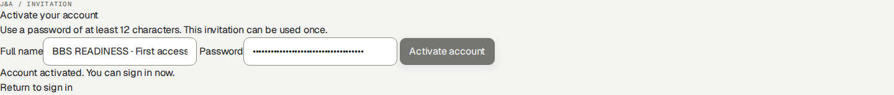

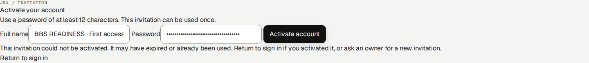

## Trainer setup · prepare a normal cycle before exceptions

Ask the trainer to provide the following checkpoint sheet before reproducing a lesson. Reusing a shared historical BBS period does not reset it. A production URL is never a training switch.

| Checkpoint | Required starting condition |
| --- | --- |
| Identity and environment | Own correctly provisioned role/profile; isolated URL and visible environment identity. |
| Project and dates | Exact project number, timezone and unused eligible lesson dates; membership and relevant grants cover both current access and the work date. |
| Source state | Named source IDs and durations/amounts; ordinary starting drafts/submissions; no unrelated correction already open. |
| Financial/evidence locks | List issued/closed periods, finalized settlements and signed report versions. Teach ordinary correction on an unlocked scope first. |
| Expected outcome | Saved state, source count, actual total and appropriate own/customer/internal output. Include the receiving role and result. |
| Reset | Operator restores the prepared database AND private documents together to the named checkpoint while training is stopped. Trainees do not delete financial history to reset a lesson. |

### Verify the result

- The new normal Worker/Chief lesson uses BBS READINESS · normal work cycle (C-0050-P-2026100601) with initially unfinalized October work. Original BBS locked-period examples are exceptions. External/Supplier/PM October 13–19 and Finance October 26 demonstrations are separately labelled; Accounting can use a separate clean synthetic portfolio.

## Review authority · who receives each source

Review is determined by the actual source, base role and current dated grants. Chief delegation alone grants recording, not approval. A Worker with Can review checked does not become a Project Manager or Finance user. Send a factual correction reason with every return.

| Source / recorder | Operational reviewer and prerequisite | Next handoff |
| --- | --- | --- |
| Internal own or chief-delegated time | Owner or Finance; assigned PM with current active Can review membership for this project. | Owner/Finance records commercial Billable or Non-billable review separately. |
| External/supplier time, including coordinator own time | Authorized Owner. Supplier authorization/recorder provenance keeps these sources outside the ordinary PM time queue. | Finance review follows Owner approval. |
| Own/delegated expenses | Owner or Finance; assigned PM with current project review grant. Check factual purchase, payer and evidence. | Owner/Finance classifies customer recovery and worker reimbursement separately. |
| Daily and Technical reports, including supplier profiles | Owner or Finance; assigned PM with current project review grant and permitted project scope. | Owner/Finance prepares the customer period report and version-bound acceptance where required. |
| PM’s own work | Route it to another authorized reviewer for an independent factual check. Do not infer a universal self-review prohibition solely from a job title. | Personal reports/pay outputs remain own scope; financial treatment belongs to Owner/Finance. |

### If you get stuck

- If the intended source is absent, check source type, state, dates, assignment/review grant and supplier authorization before searching another queue. A review-enabled Worker Chief variant is not exposed by the current role model; Owner must provision the genuinely permitted reviewer role and grant. Never use a colleague’s credentials to bypass this boundary.

## Start with an individual Auditor account

Go here: Sign in → Finance Overview

Context: Worked example · actual newly activated Auditor account in the isolated BBS role lab. Desktop, tablet and phone navigation were inspected; this role has read-only financial access.

The platform role is auditor_read_only. The Owner creates and activates your individual account. Audit work does not require sharing Owner or Finance credentials.

Use C-0050-P-20261005 — BBS · Ejemplo de manual for this worked review. The native invoices and simulated receipt/payment history are isolated training evidence, not proof of production sales, banking, accountant approval or real customer acceptance.

Normal Auditor navigation contains Finance Overview, Economic Review, Collections / Ledger, Accounting, Profile and Audit. It omits the Finance write workflow. Some authorized read destinations can be reached through linked records rather than a menu item.

### Do the task

1. Verify the active account/language and choose the BBS project in financial views.
2. Open the navigation menu or More on mobile to locate secondary workspaces, then close it to read the page.
3. Record the project/date/currency scope for every comparison.

### Verify the result

- The account remains Auditor and business action controls are absent. Profile changes concern your own account, not business financial records.

### If you get stuck

- Missing access or a wrong role requires the Owner. Do not request a shared elevated login or assume a hidden menu makes direct write actions permissible.

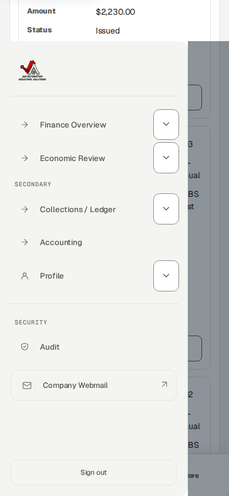

## Reconcile a work plan with actual source hours

Go here: Economic Review → select BBS → Source records → Time entries

Context: Worked example · separate isolated BBS assignment lab · synthetic October 20, 2026 · authenticated Auditor browser session after operational approval

Project membership permits dated access; a published planning assignment is an operational reference. Expected working hours are a separate dated schedule. None of these creates actual time, Finance review, an invoice, a compensation settlement or a payment.

The isolated October 20 exercise published eight planned hours to each of three internal workers. Their separately saved and operationally approved sources contain six hours for Technician 1, seven for Technician 2 recorded by the delegated Chief, and eight for the Chief: 21 actual hours, not the 24 planned hours. This synthetic exercise is outside the original October 1–5 financial checkpoint.

The weekly timesheet compares Actual against the effective Expected schedule. Difference is Actual minus Expected; Needs note flags a mismatch and can coexist with an Approved source. It does not mean a finalized payment or a failed operational approval. A missing expected figure is not assumed to be zero.

There is no dedicated worker-goal acceptance or completion workflow. Daily/Technical reports describe completed tasks, problems and next steps. Project milestones and commercial budgets have separate lifecycles; meeting a hours target is not evidence that a milestone is approved.

In this screenshot, client revenue and billable hours remain zero because this new operational exercise has not completed Finance billability review. Zero here is not an agreed zero customer rate. A source-row compensation projection is not a finalized settlement balance; review fixed-period agreements at their applicable settlement scope.

### Do the task

1. Select C-0050-P-20261005 · BBS · Ejemplo de manual. Open Source records → Time entries.
2. Use Search: Source records to enter 2026-10-20. Read the filtered count, individual worker, actual hours, source state and billing state; the broader Time source records count still describes the full selected project.
3. Confirm the three Approved operational sources show six, seven and eight hours. Follow the exact source link when investigating a discrepancy; do not substitute planned hours for recorded time.
4. Keep worker expected-hours targets separate from client daily minimums, full-day/full-week billing units and contractual worker compensation.

### Verify the result

- All three rows are Approved and Unlocked; the source screenshot was taken before additional Finance classification. The application retains 21 hours of actual work and does not manufacture the missing three planned hours.
- Auditor access is read-only. Report discrepancies to the Owner/Finance rather than editing plans, approving time or changing financial rules.

### If you get stuck

- For incorrect actual work, request the state-appropriate operational correction. For an incorrect plan or expected schedule, ask the Owner or authorized Project Manager. These are different records.
- Supplier time follows the J&A Owner operational-review handoff, whereas an authorized Project Manager may review the supplier Daily report. A missing supplier time item in the ordinary PM queue does not justify duplicate entry.

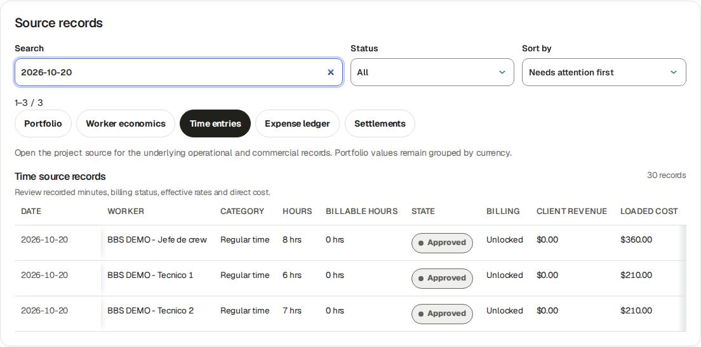

## Read the economic position without confusing cash

Go here: Finance Overview → Economic Review → BBS

Context: Reference procedure · checked against current source; not yet executed in this role lab

Actual time, approved time, billable time, WIP, issued invoices, collected cash and receivable are separate measures. Contribution reflects the calculation scope and cost basis; it is not a complete statutory profit figure.

Worker compensation is an entitlement calculation; internal loaded labor cost is an economic basis. They may overlap, so do not add both twice. Settled, planned payment and actually paid are separate.

The original BBS baseline 1–5 October has 42.5 actual hours, USD 4,672 issued, USD 682 net collected, USD 3,990 receivable, USD 1,750 direct cost and USD 2,922 contribution. Later 6 October role exercises and audit timestamps are explicitly separate; use the actual chosen period rather than forcing these baseline totals.

### Do the task

1. Select BBS and the intended period. Read the visible currency and current scope.
2. Follow an amount into Source records; compare approved operational date, commercial rule, invoice issue date and payment effective date.
3. Read budget/forecast/expected dates as planning and compare them only to the relevant actual basis.

### Verify the result

- A missing/blank value is not presumed zero. A period excluding old costs can show a high contribution without proving whole-project profit.

### If you get stuck

- For a discrepancy retain the exact filters, source IDs and visible values. Ask Finance to explain the basis; an Auditor does not correct commercial terms or post balancing records.

## Inspect a numbered native invoice and its sources

Go here: Collections / Ledger → invoice link; direct Billing read view

Context: Worked examples · AU01–AU02 · actual Auditor read the full BBS register and complete normal-invoice source table; originals and native issued artifacts preserved.

The original three issued BBS training invoices remain JA-DEMO--2026-000001 USD 2,230, 000002 USD 182 and 000003 USD 2,260, totaling USD 4,672. Separate practice documents are the prior USD 1 debit 000004, normal source-based USD 600 invoice 000005 and its −USD 1 credit 000006. The historical double separator is preserved.

The complete register columns are Invoice, Client, Project (cost center/PO), Dates, Amount, Balance (receivable / credit), Status, PDF and Actions. Scroll horizontally on a small screen or read the responsive card; a viewport showing only amount/status is incomplete evidence. Dates show issue/planned and collection context, not necessarily work dates.

Invoice lifecycle, native PDF readiness and cash state are independent. An issued invoice is an immutable snapshot; linked adjustments are new documents. The upper native Invoice · PDF panel can be Ready while optional language output is Not generated yet.

### Do the task

1. Open Collections / Ledger and follow an invoice, or the authorized direct Billing read view. Filter Project to BBS and retain invoice ID, number, issuer, client/project/cost center, cut, currency/tax and face amount.
2. Read all register columns. Follow the normal invoice and compare its entire one-line table with its source: Actual recorded 1 h, Qty 1 day, Unit price USD 600 and total USD 600.
3. Open the exact Time source to verify October 26, Technician 1, operational approval, Finance Billable and unchanged actual duration. Reconcile against the dated full-day rule, not a later/current hourly assumption.
4. Use the native Ready PDF download where authorized and compare its stored master with the register. Retain sensitive issuer/bank/contact data privately; public evidence can show the native state and complete source table.

### Verify the result

- The normal source ID is 01a11177-53be-76f2-9eef-023d5e7d3624; invoice ID 01a1117c-ec5d-750b-be30-47caa07cb3db. Read-only corroboration records source version 4 allocated USD 600 against dated daily rule 01a10cb5-5d0e-71e9-b76c-299609468e00 effective October 5. Rule/link IDs may require an authorized support evidence extract; they are not all printed in the UI.
- The new November 1 USD 610/day agreement does not change the October issued USD 600 line. Plans, actual duration, billing quantity and worker obligation are different records.

### If you get stuck

- Report a mismatch with exact invoice/source/version/rule IDs, scope and expected formula. Auditor does not edit sources, approve, issue, void or alter stored financial artifacts.

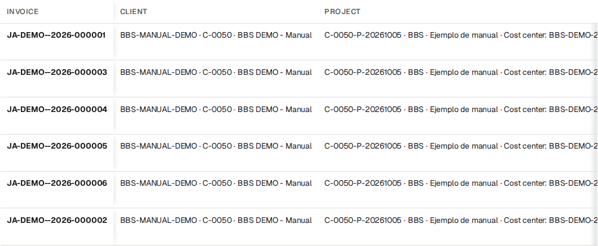

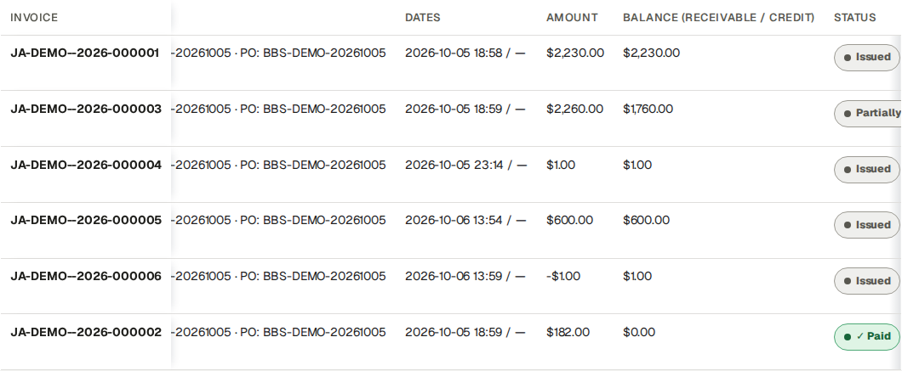

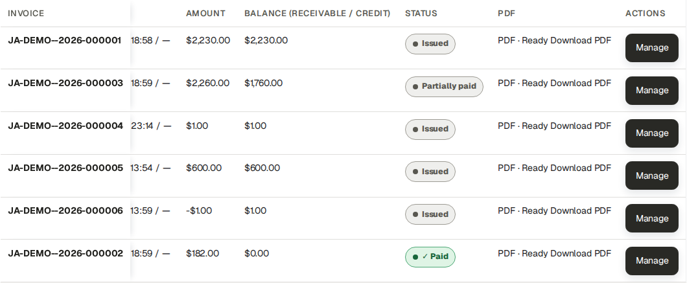

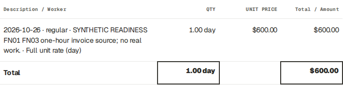

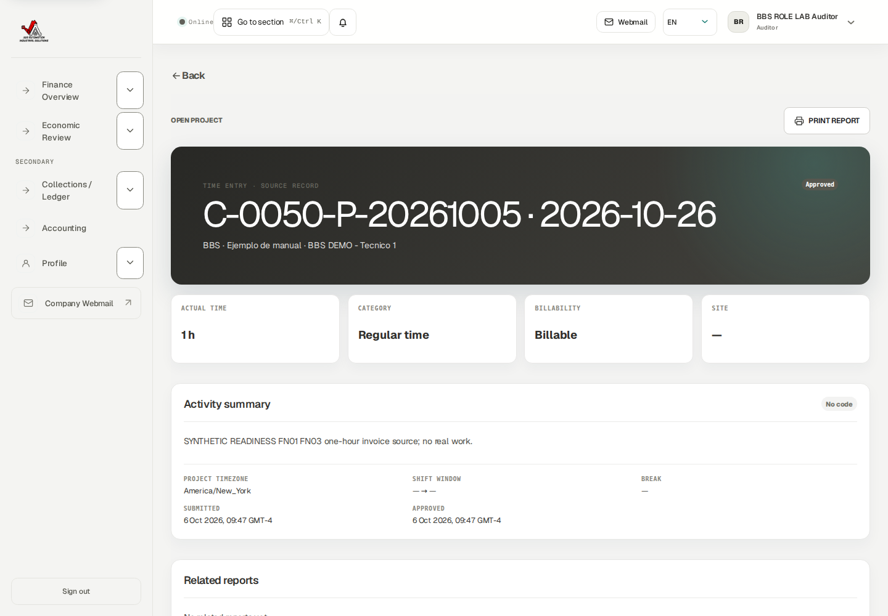

## Reconcile collections and their reversals

Go here: Collections / Ledger

Context: Worked example · AU03 · actual read-only comparison after Finance posted a credit, receipt and cash reversal; all are isolated synthetic evidence.

Invoice 000005 has USD 600 face amount. Its synthetic USD 1 receipt reduced invoice outstanding to USD 599; the full USD 1 reversal restores net cash USD 0 and outstanding USD 600. Credit invoice 000006 remains −USD 1 with a USD 1 available credit balance. Cash reversal did not cancel that credit or allocate it to the original invoice.

At the captured BBS cut, gross receivable is USD 4,591, credit balance USD 1, customer net outstanding USD 4,590 and net collections USD 682. The USD 600 invoice’s own outstanding remains USD 600. Later authorized records can change aggregate views; retain the capture date and scope rather than asserting these are permanent totals.

### Do the task

1. Select the exact BBS project/customer/currency scope in Collections / Ledger. Read invoice face amount, remaining receivable and separate credit balances.
2. Open the selected invoice’s collection history and compare gross receipts minus reversals to net collected. Follow the original payment/reference and each reversal amount/date/reason.
3. Compare customer gross receivable minus available credits to customer net outstanding. Do not silently subtract a credit from another invoice’s individual remaining amount.
4. Record any discrepancy in a finding with invoice/payment/reversal/credit IDs, date/currency scope and the differing measures.

### Verify the result

- A receipt is not profit; an invoice is not bank evidence; a reversal is not a refund. Original documents, cash events and linked credit history remain preserved.

### If you get stuck

- Ask Finance for an authorized allocation/refund procedure if needed. Auditor has no cash posting or reversal controls.

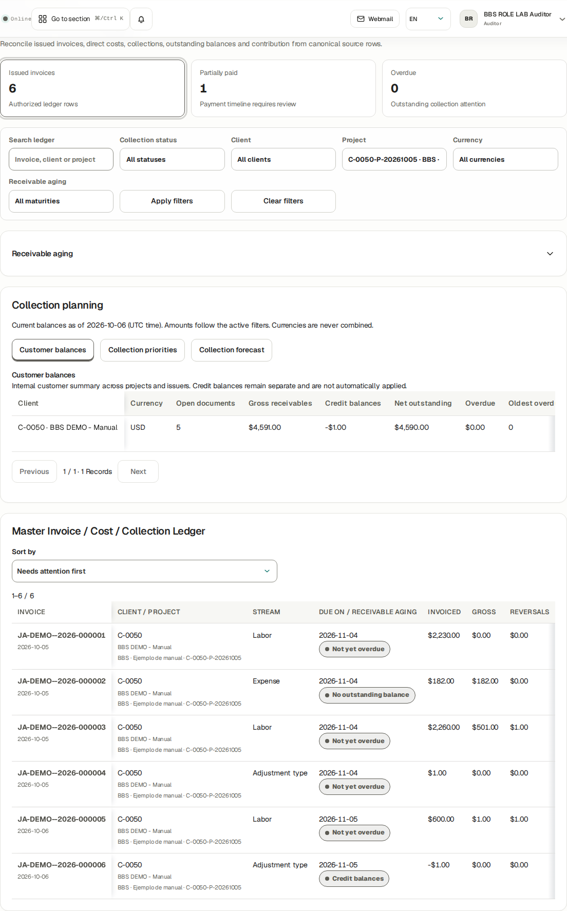

## Inspect compensation and reimbursement privately

Go here: Economic Review → Source records → Settlements → Compensation settlements / Worker reimbursement queue

Context: Worked example · actual Auditor inspected BBS compensation settlements and reimbursement history in Economic Review. Payment, finalization and reimbursement forms were absent.

Authorized audit financial views can include sensitive worker compensation, payee/payment references, expense reimbursement and internal costs. Keep these with the authorized financial/audit audience; never attach them to a customer-facing report.

Customer invoice cadence does not determine worker payment frequency. A worker settlement period, expected payment date and actual paid event are independent selections. There is no automatic worker payroll cadence setting in this release.

A finalized obligation and paid cash have separate history. The existing USD 720 reviewed settlement remains USD 720 after a USD 1 payment and its reversal. A new Custom approved adjustment compensation rule is not an automatic amendment/unlock of that final snapshot. A mistaken full expense reimbursement has no ordinary partial/backdate/reversal control in this UI; route the exact record and actual timestamp to Finance/Owner support.

### Do the task

1. Select BBS and open Settlements. Check worker/project/period, Reviewed settlement, Actual paid and Remaining.
2. Read source duration as hours/minutes and money with its currency. For a fixed-period rule, zero source duration does not by itself invalidate an agreed fixed amount.
3. Inspect actual payment and reversal event references; compare the current remaining obligation.
4. Below Settlements, read Worker reimbursement queue and distinguish receipt purchase, payer, worker reimbursement and customer recovery.

### Verify the result

- Finalized obligation is distinct from transfer evidence. Company-paid purchases do not automatically create worker reimbursement. Auditor sees reviewable evidence, not finalize/pay/reimburse controls.

### If you get stuck

- Give Finance the exact settlement/expense/payment ID and mismatch. Protect unrelated personnel information and use the smallest necessary restricted extract.

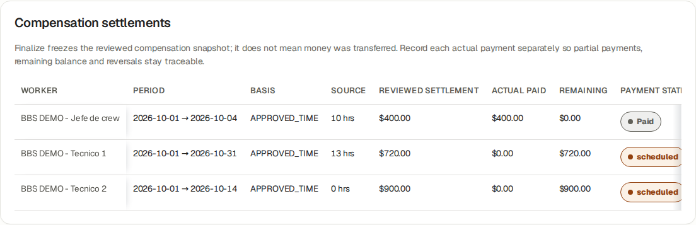

## Review a preserved Accounting cut and its artifacts

Go here: Accounting → Accounting Pack register

Context: Worked examples · AU04 · actual Auditor read a populated BBS October 1–6 pack and downloaded all five Ready formats; separately read/downloaded Finance’s finalized synthetic portfolio cut.

A pack is an authorized portfolio cut, with exact dates/version and independent artifact states; it can contain multiple projects/issuers/currencies. The BBS October 1–6 pack is populated and has Ready PDF, XLSX, Invoice CSV, Expense CSV and JSON. Finance retained its unresolved advisories; it is not finalized.

The separate all-synthetic October 1–6 portfolio pack was generated, reviewed with zero advisories and finalized by Finance. Auditor verified final and successfully downloaded all five native formats. This separate success does not repair or replace BBS history.

Invoice inclusion follows issue dates. Frozen older source links can accompany included invoices as evidence without moving the historical operational costs to the new issue-date cut. A zero reconciliation count alone does not prove every operational source/receipt is complete.

### Do the task

1. Open Accounting → Accounting Pack register. Locate the exact period/version and read current/stale/final independently from each output’s Ready/Queued/Failed state.
2. Download PDF, XLSX, Invoice CSV, Expense CSV and JSON only when their authenticated Ready links are available. Verify their filenames, cut, currency and content; retain sensitive outputs privately.
3. Reconcile included invoices/cash/source references with the frozen cut and identify outside-period operational costs or omitted sources. Request Finance’s review notes where needed.
4. Retain the historical final version. Request a new reviewed version from Finance for later source corrections; do not treat it as an editable live workbook.

### Verify the result

- Auditor has no Generate pack, Review before finalizing or Finalize reviewed version controls. The Ready count may be zero after a pack becomes final even though all five final downloads remain Ready.

### If you get stuck

- Retain pack ID, period/version, artifact type/state and the exact error for Finance/Owner/support. No private-storage bypass or shared elevated session is required.

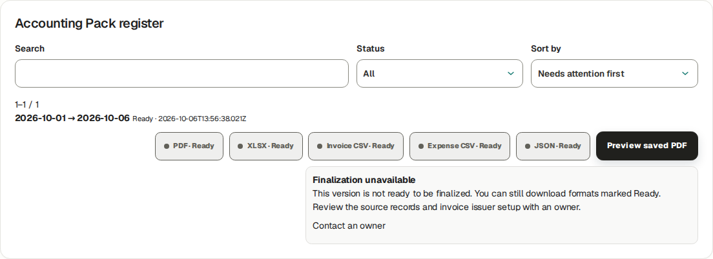

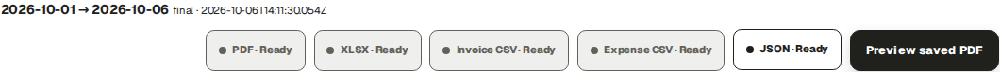

## Trace who changed what and when

Go here: Audit

Context: Worked example · AU05 · actual Auditor opened native time Finance-review, invoice issue and receipt audit details; exact chain and reversal ledger were corroborated read-only.

Audit shows append-only events with action, entity type/ID, UTC timestamp, Actor ID and View details. Business & security omits job-service lifecycle; Job service and All activity provide the other views. Older events / Latest events page through history; the current Audit page does not expose a dedicated actor/project/date filter form.

The tested chain is source create → submit → operational approval → Finance review → invoice draft creation → approve → issue → payment record. Owner performed the on-behalf source actions; the synthetic Finance actor performed billability and financial actions. The duplicate time.create audit rows refer to one source ID and do not mean duplicate hours.

Invoice cash reversal is preserved in its immutable reversal ledger with actor and reference. This release does not emit an ordinary audit_event row for that reversal. Correlate the ledger rather than inventing a missing Audit action. Audit UI prints Actor ID; ask Owner for a restricted ID-to-account crosswalk when a resolved identity is necessary.

### Do the task

1. Use the appropriate Audit view, then Older events until the relevant UTC range. Open View details for the exact entity ID and compare its action payload with the source/document.
2. Trace source 01a11177-53be-76f2-9eef-023d5e7d3624 to invoice 01a1117c-ec5d-750b-be30-47caa07cb3db and payment 01a11184-3d1c-7608-b5cc-a240af9f46f0. Verify amount/currency, action sequence and actor authority.
3. Follow reversal 01a11184-db1f-77f3-860b-abf58cf2c4b1 in the native immutable cash ledger; preserve both receipt and reversal. Resolve actor IDs through an authorized Owner/account evidence crosswalk, never guess a name.
4. Write a finding as: scope/cut and currency; expected invariant; observed difference; invoice/source/version/rule/payment/reversal IDs; UTC actor/action evidence; impact; requested Owner/Finance action; retest evidence and status.

### Verify the result

- Synthetic Finance actor ID 01a10e34-4faa-74fe-8b88-636b879e852b resolves to BBS ROLE LAB Finance. Owner-session identity remains restricted in public evidence. A missing Audit row does not justify deletion, duplicate cash or invented events.

### If you get stuck

- For missing/inconsistent evidence preserve the exact IDs and native ledger/capture; request authorized support reconciliation. Auditor reports findings and does not repair business records.

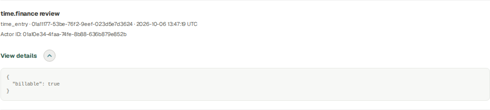

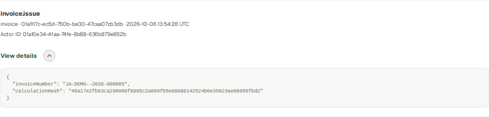

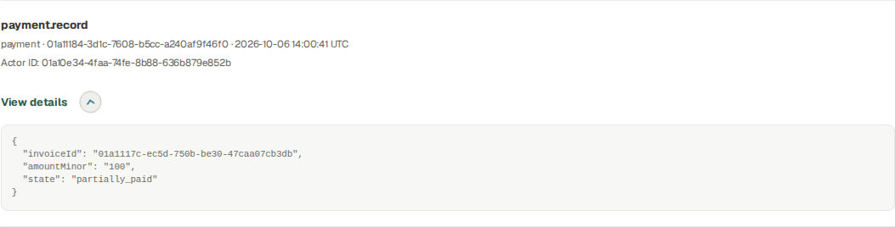

## Read the appropriate report and private output

Go here: Direct Reports read view → BBS → Daily / Technical · PLC

Context: Worked example · actual Auditor read approved fictional BBS Daily reports in both missing-PDF and Ready states. Generate/Retry were absent; Refresh remained. The Ready English report offered Download, and its authorized native GET returned 200 with a verified hash. Auditor did not generate the artifact. Customer period detail was retested at 1440 and 390 pixels after the bounded read fix: no approval, follow-up or signed-copy capture forms.

Customer-facing period reports/sign-off, internal financial reports, invoices and Accounting Packs have different audiences and purposes. Operational report approval is separate from customer acceptance against an exact report/PDF snapshot.

A customer document must not expose worker compensation, internal cost or company margin. An internal finance/audit output can expose these only to its authorized audience. Private downloads require authorization on every request.

The Auditor session verified Reports read-only and an approved fictional Daily source. Its PDF was not generated. An export request was denied by the read-only boundary; an Owner/authorized creator must prepare a missing artifact. The final interface omits the unsupported Generate/Retry actions for Auditor.

A different approved BBS External Technician Daily report already had an English PDF prepared by its authorized creator. Auditor’s Ready view kept Download and Refresh while Generate/Retry remained absent. Its authenticated download returned 200, 306,944 bytes. Reading or downloading did not change the operational record or artifact.

Supported authorized read destinations include Finance Overview, Economic Review, Collections / Ledger, Accounting and Audit from navigation, plus linked Billing/invoice, Time/Expense details and Reports read views. A menu omission does not add write permission. Customer period detail authorization permits Auditor snapshot/PDF reads; an incidental reviewer-follow-up check was corrected so it no longer blocks that read. Auditor receives no approval, follow-up or signed-copy capture controls.

### Do the task

1. Open /j-aautomation/app/reports?view=daily in the same signed-in portal, select BBS, apply filters and open the exact report. The normal Auditor menu has no Reports item. For Technical / PLC select its report type. Verify project, date, type, version and audience.
2. Open only Ready artifacts. A quarantined or failed uploaded file is not verified evidence.
3. If acceptance is relevant, check the evidence state, signer information and exact associated snapshot/PDF; distinguish synthetic training acceptance from a real signature.
4. Keep the original downloaded file and its source/version reference in the restricted audit record.
5. Follow native record links with your own session. For customer reports verify the safe audience, exact version/hash and canonical PDF readiness; protect internal report/financial output audiences. For denied unavailable routes retain the route/record and ask Owner/support rather than borrowing a session.

### Verify the result

- Downloading does not create customer acceptance. Underlying content changes can require invalidation/replacement rather than silently reusing an old signed snapshot.

### If you get stuck

- A missing/denied report route is a scope handoff to Owner/support. Do not substitute an internal finance file for a missing customer document or claim an unobserved signature.
- If a report says Not generated yet, request its artifact from the Owner/authorized report creator. Refresh only after it is genuinely Ready; this guide does not claim an Auditor-generated Daily PDF.

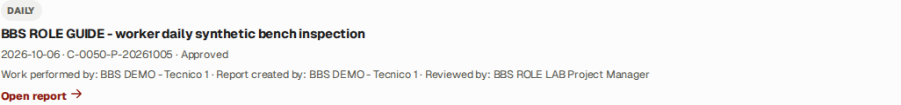

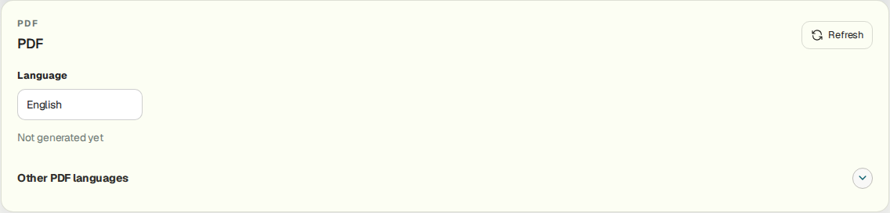

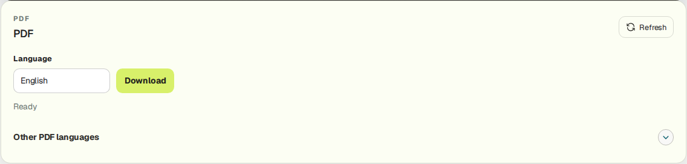

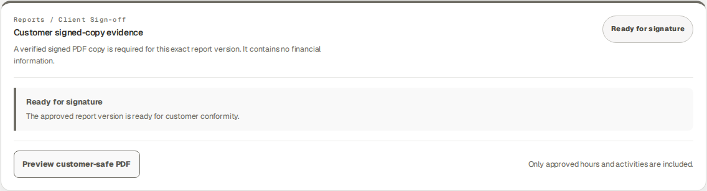

## Verify read-only boundaries and hand off a finding

Go here: Finance views; Audit; authorized denied-action example

Context: Worked example · actual Auditor opening Approvals received Access restricted. A valid controlled invoice-adjustment write returned Svelte action failure 403 / BILLING_READ_ONLY_ROLE, inside HTTP 200; invoice and adjustment counts were unchanged.

Auditor may inspect authorized financial/audit evidence and download permitted artifacts. The role does not approve sources, change rates, create/approve/issue/void invoices, record/reverse business payments, reimburse expenses, generate/finalize packs or close billing periods.

Read-only is enforced on the server as well as by omitted controls. A copied direct Finance write action is not a supported Auditor workflow. The controlled training boundary test must not create a financial event.

### Do the task

1. Check that business write controls are absent from the Auditor financial views.
2. Use the documented controlled denied-action evidence in this guide; ordinary readers do not need to submit technical requests to use the platform.
3. For a finding, record role, project/date/currency, object ID, current state, expected evidence and observed discrepancy.
4. Hand the finding to Finance or Owner with the minimum restricted supporting material.

### Verify the result

- The controlled denial returns forbidden and leaves native financial rows unchanged. Audit authority does not expand account/admin or record-write authority.

### If you get stuck

- If a business write control appears unexpectedly, stop that action and report the exact page/control. Do not use elevated credentials to test a suspected boundary in production.

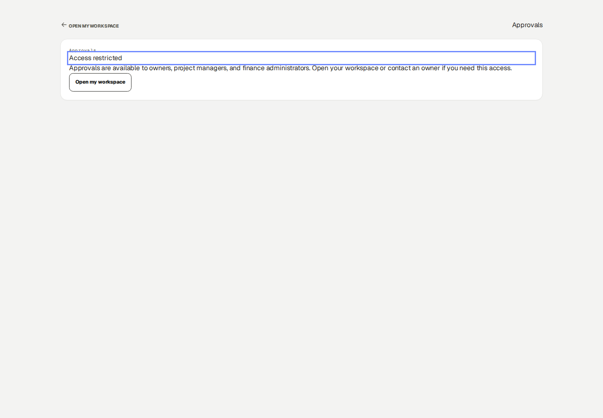

## Complete the review and protect its evidence

Go here: Profile; Notifications; Help

Context: Reference procedure · checked against current source; not yet executed in this role lab

Keep a clear distinction between tested observations, source-checked reference procedures and unavailable external evidence. This training guide proves only the role/session/scope explicitly shown in its evidence manifest.

Your own Profile and optional account security preferences do not grant business write permissions. Notification-read state is personal inbox state, not an approval of its referenced transaction.

### Do the task

1. Confirm each finding’s final project/period/version and its responsible handoff.
2. Use Profile for personal account preferences and Help for the relevant manual/support destination.
3. Close private files and sign out on shared equipment; retain financial evidence only in approved restricted storage.

### Verify the result

- The report states exact observed limits: no external mail, bank transfer, genuine accountant approval or real customer signature was demonstrated.

### If you get stuck

- Ask the workspace administrator about account problems or access scope; ask Finance/Owner about financial corrections. Preserve original evidence rather than editing it to match a conclusion.

## Recovery · sources, obligations and immutable history

Use the role’s worked correction lesson and the current record controls. A new purchase is different from a correction to an existing purchase. A payment reversal records a cash-entry correction; it does not amend a finalized compensation entitlement or unlock its time sources.

| State | Supported next action |
| --- | --- |
| Ordinary Draft | Use Edit/Save draft where present; attach the actual receipt/evidence before Submit. Inspect each saved draft after weekly table entry. |
| Submitted | Read current state and reviewer handoff. Do not create another source merely because review is pending. |
| Needs changes | Read the reason. Time uses Create corrected draft where available, then submit/review the linked replacement. A returned Daily/Technical report instead offers Edit and Save changes on the same report, then Submit for review; follow the exact role lesson. |
| Rejected | Inspect the reason and contact reviewer/Owner. The time detail does not offer the same linked-correction route as Needs changes; do not assume that route exists. |
| Approved, unlocked | Use the offered linked correction, preserving the original. Re-review the replacement and refresh affected unissued drafts/report versions through their supported controls. |
| Issued, financially locked or finalized compensation | Stop source editing. Send source ID/project/date, original/correct values, reason, affected invoice/settlement and payment references to Owner/Finance. If no authorized amendment control exists, escalate to platform support. |

### If you get stuck

- Finalized compensation has no ordinary Amend settlement or Unfinalize control in this release. Finance records the request and reconciles the preserved original obligation and actual payments; support must return a documented authorized financial resolution, resulting obligation/reference and explicit source-lock outcome. Until then the source remains blocked. A bank transfer, cash reversal or direct database edit is not an amendment procedure.

## Security · verify your own device and recovery options

Go here: Profile → Account security; Profile → Add availability

### Do the task

1. Check Account security identifies YOUR account even when an authorized workforce profile inspection shows another worker above it. Enroll only your own device. MFA is optional in this release.
2. For a passkey, enter Device name and choose Register passkey on the approved secure portal. Complete your device’s creation confirmation. Verify Passkey registered for this account, the registered count and named device row. Cancelled/failed registration is not enrollment.
3. To retire your own lost/obsolete passkey, first confirm you retain another working sign-in method. Select Revoke on the exact device and verify Passkey revoked and removal of its row. If you cannot sign in, use the verified support route rather than another person’s session.
4. For an authenticator, choose Enable MFA. Keep the setup URI and one-time recovery codes private in the approved password manager. Add the URI to your authenticator, enter its current six-digit Authenticator code and choose Verify MFA. Verify Enabled and Disable MFA appear; enabling without verification is not completed enrollment.
5. At a later MFA sign-in use Six-digit code → Verify and continue. If the authenticator is unavailable, choose Use a recovery code and enter one unused stored code. If neither method is available, contact admin@j-aautomation.com for identity-verified recovery. Do not send recovery codes or the setup URI to support.
6. To remove optional MFA while signed in, choose Disable MFA and verify Not enabled/Enable MFA. Confirm the intended own account before doing so. A successful settings change is separate from recovering a lost account.
7. Where Add availability is offered, fill Starts, Ends, Availability and Note using the displayed time basis, then Save availability. Verify the saved interval/status/note in the list; use Edit availability on that row and save the changed values. Availability is not project membership, a published shift or actual hours.

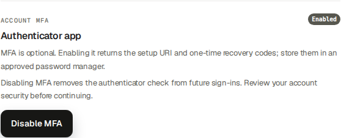

## Verification · current coverage and historical evidence

English readiness edition: 6 October 2026, based on repository abc12c0961b2 with the recorded readiness fixes. The publication receipt identifies the final commit and deployment. This edition teaches the permitted ordinary cycle and supported handoffs; it does not certify every contract, device or external service.

The current evidence lives in docs/evidence/bbs-readiness-20261006. Its correction register maps all 72 suite findings to tasks, browser evidence or precise reference/support boundaries. Role manifests identify source IDs, state transitions and downloaded artifacts. Historical 5 October outputs remain historical; new screenshots do not rewrite their totals or private bytes.

Recipient activation, actual authenticator verification and own passkey registration/revocation were exercised on a separate isolated recipient. The same account controls are shared, but enrollment was not repeated for every role or physical device. Offline/expired-link and lost-device paths remain precise references where not separately executed.

Weekly submission was exercised with one ordinary draft and one eligible linked correction for Worker, Chief, External Technician and Supplier Coordinator: two selected drafts became two Submitted sources and zero remaining drafts. This does not guarantee that locked, withdrawn, out-of-scope or ineligible corrections will submit.

A final Accounting cut succeeded in a separate clean Finance portfolio; an Auditor read and downloaded its outputs. Original BBS issuer-history and source-reconciliation blockers remain documented. Email transport, real bank movement, accountant approval and genuine customer acceptance are outside the synthetic tests.

### Verify the result

- For a task described as reference, follow the exact named controls and prerequisites; do not infer that an illustrated outcome was executed. For support-only recovery, preserve the blocked source and obtain the documented receiving result before proceeding. Out-of-role financial information is intentionally excluded from operational guides.
