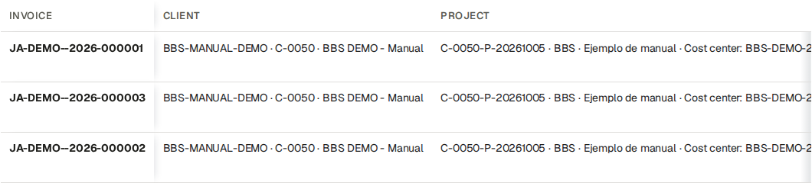
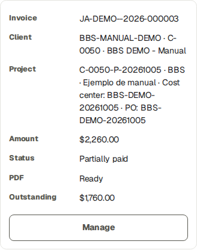
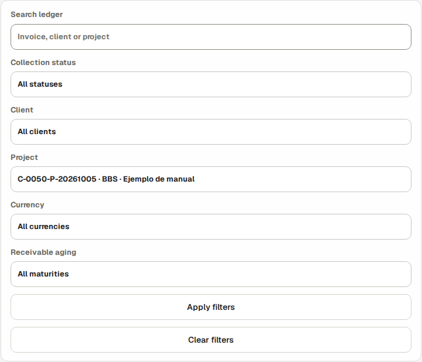
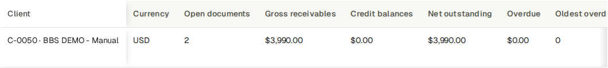
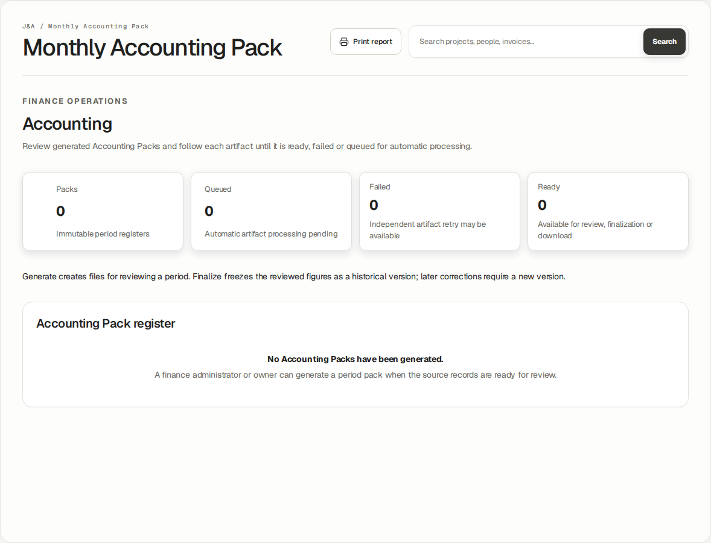
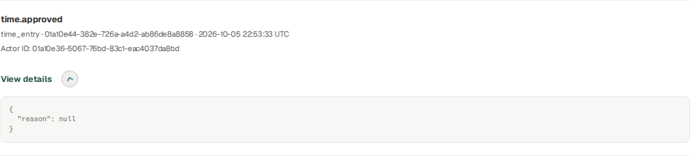

# Auditor · BBS financial and audit review

Read-only financial evidence, immutable history, source reconciliation and authorized handoffs

## Before you practise · access and scope

This English guide uses BBS · Ejemplo de manual, project C-0050-P-20261005. The screenshots were taken using the stated role in an isolated database running the application. Training entries, payments, approvals and documents are fictional. They do not prove a real bank transfer, accountant approval or customer acceptance.

The company portal at https://j-aautomation.com/j-aautomation/app is LIVE. Training uses a separate URL and database. Before practising, obtain the isolated URL, your own role account and permitted exercises from the company administrator; verify the BBS project number. Without isolated access, treat these screenshots as read-only demonstrations and perform only authorized real work.

Use your own credentials. Do not borrow an Owner, Finance or colleague account. A platform role, project assignment, review permission, supplier authorization and dated crew delegation are separate requirements. Changing one does not automatically grant the others.

Select English in the workspace language control to follow the labels used here. Some saved BBS record names remain in their original language. On a phone open the navigation drawer to see full workspace names. Recheck the selected project and date range after every navigation.

The eight Worker test accounts in the private credentials document use the same Worker workflow. Crew chief is a dated delegation attached to a Worker account. Supplier Coordinator and External Technician are restricted profiles attached to Worker accounts. This guide never includes account passwords.

Each screenshot is an exercise checkpoint. Later fictional role entries and financial events are additional to the original October 1–5 workbook totals. Reopening the project or selecting the same dates does not restore that checkpoint. Read captions before comparing amounts or states.

### Verify the result

- Confirm your displayed account, role or supplier profile, the project number and the dates before saving.
- For training access, scope or reset help, contact the company administrator at admin@j-aautomation.com. Include the role, route, project number, time and visible error; omit passwords, cookies and private customer or worker documents.

### If you get stuck

- An empty project selector often means missing or expired assignment or authorization. Ask the Owner to check coverage for the date you are entering; do not create a duplicate project.
- A form shown in a screenshot can depend on role, source state or effective date. Use the documented role handoff when a control is absent.

## Start with an individual Auditor account

Go here: Sign in → Finance Overview

Context: Worked example · actual newly activated Auditor account in the isolated BBS role lab. Desktop, tablet and phone navigation were inspected; this role has read-only financial access.

The platform role is auditor_read_only. The Owner creates and activates your individual account. Audit work does not require sharing Owner or Finance credentials.

Use C-0050-P-20261005 — BBS · Ejemplo de manual for this worked review. The native invoices and simulated receipt/payment history are isolated training evidence, not proof of production sales, banking, accountant approval or real customer acceptance.

Normal Auditor navigation contains Finance Overview, Economic Review, Collections / Ledger, Accounting, Profile and Audit. It omits the Finance write workflow. Some authorized read destinations can be reached through linked records rather than a menu item.

### Do the task

1. Verify the active account/language and choose the BBS project in financial views.
2. Open the navigation menu or More on mobile to locate secondary workspaces, then close it to read the page.
3. Record the project/date/currency scope for every comparison.

### Verify the result

- The account remains Auditor and business action controls are absent. Profile changes concern your own account, not business financial records.

### If you get stuck

- Missing access or a wrong role requires the Owner. Do not request a shared elevated login or assume a hidden menu makes direct write actions permissible.

## Read the economic position without confusing cash

Go here: Finance Overview → Economic Review → BBS

Context: Reference procedure · checked against current source; not yet executed in this role lab

Actual time, approved time, billable time, WIP, issued invoices, collected cash and receivable are separate measures. Contribution reflects the calculation scope and cost basis; it is not a complete statutory profit figure.

Worker compensation is an entitlement calculation; internal loaded labor cost is an economic basis. They may overlap, so do not add both twice. Settled, planned payment and actually paid are separate.

The original BBS baseline 1–5 October has 42.5 actual hours, USD 4,672 issued, USD 682 net collected, USD 3,990 receivable, USD 1,750 direct cost and USD 2,922 contribution. Later 6 October role exercises and audit timestamps are explicitly separate; use the actual chosen period rather than forcing these baseline totals.

### Do the task

1. Select BBS and the intended period. Read the visible currency and current scope.
2. Follow an amount into Source records; compare approved operational date, commercial rule, invoice issue date and payment effective date.
3. Read budget/forecast/expected dates as planning and compare them only to the relevant actual basis.

### Verify the result

- A missing/blank value is not presumed zero. A period excluding old costs can show a high contribution without proving whole-project profit.

### If you get stuck

- For a discrepancy retain the exact filters, source IDs and visible values. Ask Finance to explain the basis; an Auditor does not correct commercial terms or post balancing records.

## Inspect a numbered native invoice and its sources

Go here: Collections / Ledger → invoice link; direct Billing read view

Context: Worked example · actual Auditor opened the BBS Billing register and native issued PDF page. All three original invoice PDF downloads returned 200 with their preserved SHA-256 hashes. No invoice writes are allowed.

The original BBS final invoice annex has three application-issued training numbers: JA-DEMO--2026-000001 labor USD 2,230; 000002 expense USD 182; 000003 mixed labor USD 2,260. The double separator is historical training numbering and is preserved.

Issued documents are immutable financial snapshots. A credit/debit/correction is a new linked document, and void retains the original number/native master. Draft/approved previews are not final confirmed invoices.

Read the upper Invoice · PDF panel for native issued-master readiness. A separate optional language-output panel can be Not generated yet without changing the final issued invoice or its native master.

### Do the task

1. Open Collections / Ledger and follow the invoice link, or use the documented Billing read view. The normal Auditor menu has no Billing entry. Check number, issuer, customer/project/cost center, service dates, currency, tax and total.
2. Check the visible lifecycle state separately from PDF Ready/Queued/Failed.
3. Download the authorized Ready native PDF and compare its number/amount to the register.
4. Inspect linked adjustment and source references without treating them as a rewrite of the original face amount.

### Verify the result

- The PDF is the stored issued master, not a regenerated draft. A collected-state change does not change its native bytes. Audit access does not permit editing, approval, issue or void.

### If you get stuck

- A denied/unavailable artifact requires an authorized support investigation. Retain the ID/state/error; do not bypass private storage or obtain another user’s URL/session.

## Reconcile collections and their reversals

Go here: Collections / Ledger

Context: Worked example · actual Auditor inspected Collections / Ledger filters and BBS customer balances. No Record payment or Reverse payment forms were offered. Later synthetic role events are separate from this historical snapshot.

The ledger reports received money and append-only reversal history. Gross receipt minus reversals equals net collection; invoice total minus net gives its remaining receivable. An invoice credit is a separate commercial document, not a cash receipt.

Training payment references explicitly identify simulated ledger entries. A recorded event is not independent bank evidence. A reversal corrects the recorded receipt; the application does not perform a refund transfer.

### Do the task

1. Use Search ledger, Collection status, Client, Project, Currency and Receivable aging to isolate the BBS invoice, then Apply filters. The inspected ledger does not offer a separate receipt-date filter.
2. Open its collection/payment history. Match amount, effective/received date, reference and linked reversal to each event.
3. Calculate gross, reversals, net and outstanding for that document.
4. Compare the same issue/collection period with the project and Accounting outputs.

### Verify the result

- Original receipt and reversal both remain present. An invoice with partial collection still has a balance. No Record payment or Reverse payment business control is available to Auditor.

### If you get stuck

- Ask Finance to investigate an error using the specific event ID/reference. Do not request deletion of the original event or infer a bank refund from a reversal state.

## Inspect compensation and reimbursement privately

Go here: Economic Review → Source records → Settlements → Compensation settlements / Worker reimbursement queue

Context: Worked example · actual Auditor inspected BBS compensation settlements and reimbursement history in Economic Review. Payment, finalization and reimbursement forms were absent.

Authorized audit financial views can include sensitive worker compensation, payee/payment references, expense reimbursement and internal costs. Keep these with the authorized financial/audit audience; never attach them to a customer-facing report.

Customer invoice cadence does not determine worker payment frequency. A worker settlement period, expected payment date and actual paid event are independent selections. There is no automatic worker payroll cadence setting in this release.

### Do the task

1. Select BBS and open Settlements. Check worker/project/period, Reviewed settlement, Actual paid and Remaining.
2. Read source duration as hours/minutes and money with its currency. For a fixed-period rule, zero source duration does not by itself invalidate an agreed fixed amount.
3. Inspect actual payment and reversal event references; compare the current remaining obligation.
4. Below Settlements, read Worker reimbursement queue and distinguish receipt purchase, payer, worker reimbursement and customer recovery.

### Verify the result

- Finalized obligation is distinct from transfer evidence. Company-paid purchases do not automatically create worker reimbursement. Auditor sees reviewable evidence, not finalize/pay/reimburse controls.

### If you get stuck

- Give Finance the exact settlement/expense/payment ID and mismatch. Protect unrelated personnel information and use the smallest necessary restricted extract.

## Review a preserved Accounting cut and its artifacts

Go here: Accounting → Accounting Pack register

Context: Worked example · actual Auditor opened the Accounting register in the original copied BBS environment: no packs exist. Generate/Finalize controls were absent. Successful ready/finalized Accounting is a separately labelled Owner training reference, not an Auditor-created pack.

A pack is a portfolio cut; it can include multiple projects/legal entities/currencies. It is not the same scope as a project workbook. Read its dates and version before reconciling.

Invoice values follow issue dates. Validated frozen older source links accompany included invoices as evidence, while old operational labor/expense costs stay in their original period. A document void by the cut is excluded; one voided later can remain in an earlier historical cut.

The original BBS October 1–5 portfolio has an archived-issuer effective-date gap. The successful zero-advisory October Accounting demonstration in the Owner guide is a separate all-synthetic portfolio. An Auditor must not infer that it repaired BBS history.

### Do the task

1. Locate the exact period/version. Distinguish queued/Ready/Failed artifacts, current/stale and final historical version.
2. Download only the authorized Ready PDF, XLSX, Invoice CSV, Expense CSV and JSON controls actually present.
3. Inspect reconciliation, pending/unclassified/missing-document advisories and changes since generation where exposed by the read view.
4. Compare included figures to exact source rows and acknowledge any omitted or outside-period operational evidence.

### Verify the result

- Reconciliation 0 does not prove all operational work/evidence is complete. Final history remains preserved; later corrections require a new reviewed version by Finance. Auditor cannot Generate pack or Finalize reviewed version.

### If you get stuck

- For a historical issuer/source mismatch retain the pack ID, period and error. Ask Finance/Owner/support for the legitimate resolution; never alter dates, remove source links or fabricate approval.

## Trace who changed what and when

Go here: Audit

Context: Worked example · actual Auditor used Business & security and inspected one BBS fictional time approval event and its details. The event is later role practice, not evidence of the original October 1–5 hours.

Audit is the append-only evidence workspace available to Owner and Auditor. Finance does not receive this menu/workspace merely because it may change financial data.

Use actor/action/object/time and correlation evidence to distinguish creation, approval, issue, payment, reversal and correction. A successful account login or reading a notification is not business approval.

### Do the task

1. Open Audit. Choose Business & security for business/security events, Job service for background lifecycle, or All activity. Each page shows up to 50 events; use Older events and Latest events to traverse history.
2. Locate the exact object/event on the loaded page and expand its View details disclosure. Read action, entity type/ID, Actor ID, UTC timestamp and event details. Global Search workspace is separate from the audit event list.
3. Compare the event with the referenced current record and preserved original/correction chain. The audit list has no project/actor/date-entry filter form in this release.
4. Provide a restricted event/source extract with exact IDs to the responsible reviewer if an inconsistency needs explanation.

### Verify the result

- A final state has supporting events and relevant source versions. Audit rows are history, not editable current configuration.

### If you get stuck

- An absent event can reflect filters/scope or a failed action rather than a completed change. Inspect the exact returned state before concluding that history is missing. Auditor does not purge or overwrite events.

## Read the appropriate report and private output

Go here: Direct Reports read view → BBS → Daily / Technical · PLC

Context: Worked example · actual Auditor read approved fictional BBS Daily reports in both missing-PDF and Ready states. Generate/Retry were absent; Refresh remained. The Ready English report offered Download, and its authorized native GET returned 200 with a verified hash. Auditor did not generate the artifact.

Customer-facing period reports/sign-off, internal financial reports, invoices and Accounting Packs have different audiences and purposes. Operational report approval is separate from customer acceptance against an exact report/PDF snapshot.

A customer document must not expose worker compensation, internal cost or company margin. An internal finance/audit output can expose these only to its authorized audience. Private downloads require authorization on every request.

The Auditor session verified Reports read-only and an approved fictional Daily source. Its PDF was not generated. An export request was denied by the read-only boundary; an Owner/authorized creator must prepare a missing artifact. The final interface omits the unsupported Generate/Retry actions for Auditor.

A different approved BBS External Technician Daily report already had an English PDF prepared by its authorized creator. Auditor’s Ready view kept Download and Refresh while Generate/Retry remained absent. Its authenticated download returned 200, 306,944 bytes. Reading or downloading did not change the operational record or artifact.

### Do the task

1. Open /j-aautomation/app/reports?view=daily in the same signed-in portal, select BBS, apply filters and open the exact report. The normal Auditor menu has no Reports item. For Technical / PLC select its report type. Verify project, date, type, version and audience.
2. Open only Ready artifacts. A quarantined or failed uploaded file is not verified evidence.
3. If acceptance is relevant, check the evidence state, signer information and exact associated snapshot/PDF; distinguish synthetic training acceptance from a real signature.
4. Keep the original downloaded file and its source/version reference in the restricted audit record.

### Verify the result

- Downloading does not create customer acceptance. Underlying content changes can require invalidation/replacement rather than silently reusing an old signed snapshot.

### If you get stuck

- A missing/denied report route is a scope handoff to Owner/support. Do not substitute an internal finance file for a missing customer document or claim an unobserved signature.
- If a report says Not generated yet, request its artifact from the Owner/authorized report creator. Refresh only after it is genuinely Ready; this guide does not claim an Auditor-generated Daily PDF.

## Verify read-only boundaries and hand off a finding

Go here: Finance views; Audit; authorized denied-action example

Context: Worked example · actual Auditor opening Approvals received Access restricted. A valid controlled invoice-adjustment write returned Svelte action failure 403 / BILLING_READ_ONLY_ROLE, inside HTTP 200; invoice and adjustment counts were unchanged.

Auditor may inspect authorized financial/audit evidence and download permitted artifacts. The role does not approve sources, change rates, create/approve/issue/void invoices, record/reverse business payments, reimburse expenses, generate/finalize packs or close billing periods.

Read-only is enforced on the server as well as by omitted controls. A copied direct Finance write action is not a supported Auditor workflow. The controlled training boundary test must not create a financial event.

### Do the task

1. Check that business write controls are absent from the Auditor financial views.
2. Use the documented controlled denied-action evidence in this guide; ordinary readers do not need to submit technical requests to use the platform.
3. For a finding, record role, project/date/currency, object ID, current state, expected evidence and observed discrepancy.
4. Hand the finding to Finance or Owner with the minimum restricted supporting material.

### Verify the result

- The controlled denial returns forbidden and leaves native financial rows unchanged. Audit authority does not expand account/admin or record-write authority.

### If you get stuck

- If a business write control appears unexpectedly, stop that action and report the exact page/control. Do not use elevated credentials to test a suspected boundary in production.

## Complete the review and protect its evidence

Go here: Profile; Notifications; Help

Context: Reference procedure · checked against current source; not yet executed in this role lab

Keep a clear distinction between tested observations, source-checked reference procedures and unavailable external evidence. This training guide proves only the role/session/scope explicitly shown in its evidence manifest.

Your own Profile and optional account security preferences do not grant business write permissions. Notification-read state is personal inbox state, not an approval of its referenced transaction.

### Do the task

1. Confirm each finding’s final project/period/version and its responsible handoff.
2. Use Profile for personal account preferences and Help for the relevant manual/support destination.
3. Close private files and sign out on shared equipment; retain financial evidence only in approved restricted storage.

### Verify the result

- The report states exact observed limits: no external mail, bank transfer, genuine accountant approval or real customer signature was demonstrated.

### If you get stuck

- Ask the workspace administrator about account problems or access scope; ask Finance/Owner about financial corrections. Preserve original evidence rather than editing it to match a conclusion.
