# Chief · BBS crew operations

Dated delegation, team hours, shared receipts, corrections and own Worker responsibilities

## Before practising · live and training access

The company portal https://j-aautomation.com/j-aautomation/app is LIVE. A link to it never enters a simulation. For practice obtain a separately provisioned training URL, your own account, the permitted fictional project and dates, a visible environment identifier and the trainer’s reset procedure. Without those, use this guide as a read-only demonstration and enter only authorized genuine work.

Original BBS examples include historical live-deployment records. Later training exercises used isolated copies. Each chapter identifies its dataset and checkpoint. Follow the dates and saved states shown for that exercise.

A role, project membership, review permission, supplier authorization and dated crew delegation are separate. Use your own credentials and follow the tasks assigned to your role. Check the selected project and person before recording work.

### Verify the result

- Confirm your displayed identity, the environment, project number and work dates before saving. For training/reset or lost access contact admin@j-aautomation.com; send the route, role, project/record reference, time and visible error. Keep passwords, activation links, recovery codes and cookies private.

### If you get stuck

- For an empty project selector, ask the Owner to check account status and assignment/authorization coverage. Do not create a duplicate project or borrow another account.

## Access · activate the invitation and sign in

Go here: Your trusted invitation → Activate your account → Return to sign in → Profile

### Do the task

1. Check the portal address and named account against the invitation provided by the Owner. There is no public sign-up. For an already provisioned account, use the sign-in method supplied to you; do not attempt to activate someone else’s invitation.
2. For a single-use activation link, open Activate your account. Enter Full name and choose a Password of at least 12 characters, then Activate account. Wait for Account activated. You can sign in now. Do not repeatedly submit while Activating… is displayed.
3. Choose Return to sign in. Enter your account Email and Password and select Continue to workspace. If you previously enabled MFA, complete Verify your identity with the current Six-digit code and Verify and continue. Use a recovery code only through the offered Use a recovery code control.
4. Open Profile and verify the own-account name/email/role in Account security. Check the navigation and assigned project. A newly activated account can have zero assignments; activation alone does not grant project access or supplier/chief authority.

### Verify the result

- The activation success message precedes the separate sign-in. Verify your own Profile and assigned projects after signing in.

### If you get stuck

- An expired or already used link displays This invitation could not be activated. It may have expired or already been used. If activation already succeeded, return to sign in. Otherwise request a new invitation from the Owner; reloading does not renew the old link.
- For offline, temporarily unavailable or rate-limited activation, retain the entered name/password privately, restore connectivity or wait for the displayed retry interval, then retry. An unconfirmed response is not proof of an active account.
- For an incorrect password, inactive account or lost access, contact admin@j-aautomation.com from your verified account/contact channel. Supply identity and the visible error; never send the password. This guide does not promise a public password-reset form. The initial Owner is provisioned by the platform operator; an existing Owner provisions the remaining team.

## Practice setup · your account and starting records

Obtain your own training account, isolated environment, authorized project and lesson dates from the trainer. Confirm the named starting records and expected result before saving. Ask the trainer to restore the checkpoint when needed.

| Checkpoint | Required starting condition |
| --- | --- |
| Identity and environment | Own correctly provisioned role/profile; isolated URL and visible environment identity. |
| Project and dates | Exact project number, timezone and unused eligible lesson dates; membership and relevant grants cover both current access and the work date. |
| Source state | Named source IDs and durations/amounts; ordinary starting drafts/submissions; no unrelated correction already open. |
| Expected outcome | Expected saved state, source count, actual total and permitted output; named receiving reviewer where needed. |

### Verify the result

- Confirm that the visible starting records match this lesson. If they differ or an action is unavailable, stop and ask the trainer for the correct checkpoint.

## Review authority · who receives each source

Review is determined by the source, base role and current dated grants. Chief delegation grants recording, not approval. A Worker with Can review checked does not become a Project Manager. Send a factual reason with every requested correction.

| Source / recorder | Operational reviewer and prerequisite | Next handoff |
| --- | --- | --- |
| Internal own or chief-delegated time | Owner or Finance; assigned PM with current active Can review membership for this project. | Submit the checked work to the authorized reviewer and verify the resulting state. |
| External/supplier time, including coordinator own time | Authorized Owner. Supplier authorization/recorder provenance keeps these sources outside the ordinary PM time queue. | Verify the resulting review state. |
| Own/delegated expenses | Owner or Finance; assigned PM with current project review grant. Check factual purchase, payer and evidence. | Verify the expense review state. Direct reimbursement questions to the Owner. |
| Daily and Technical reports, including supplier profiles | Owner or Finance; assigned PM with current project review grant and permitted project scope. | Owner/Finance prepares the customer period report and version-bound acceptance where required. |
| PM’s own work | Route it to another authorized reviewer for an independent factual check. Do not infer a universal self-review prohibition solely from a job title. | Use the appropriate personal output and verify the review state. |

### If you get stuck

- If the intended source is absent, check source type, state, dates, assignment/review grant and supplier authorization before searching another queue. A review-enabled Worker Chief variant is not exposed by the current role model; Owner must provision the genuinely permitted reviewer role and grant. Never use a colleague’s credentials to bypass this boundary.

## Understand Chief authority before recording crew work

Go here: Sign in → Crew hours

Context: Isolated BBS role lab · genuine Chief Worker account · dated October 1–31 delegation

Chief is an ordinary Worker account with dated person/project delegation. Account access, project assignment and crew delegation are separate. The readiness example uses C-0050-P-2026100601 with an entry-only Chief and Worker 2 assigned October 1–31. Worker 1 has a separate October 1–8 assignment/grant for the October 7 two-person receipt exercise. Both people’s project assignments and the delegation must cover today as well as the selected work date.

Before practising obtain an operator training URL, own account, visible environment identity, permitted scope and reset instructions. No shared training credentials are provided. Live company links remain live company services. Every illustrated mutation here is fictional and isolated.

Crew hours handles delegated operational entry. Time, Expenses, Reports and My Pay still handle your own Worker records. The illustrated entry-only delegation does not grant approval permission; requests outside this authorized workspace were denied.

For account access and recovery, use the common Access (access), Security (security), Review authority (review-authority) and Practice setup (trainer-setup) sections. Those controls are shared across roles; a job title does not grant access.

### Do the task

1. Confirm your own Chief account and the isolated environment. Open Crew hours.
2. Select Project and Work date, then Show project. Check that intended members are offered for this date.

### Verify the result

- The actual new-project crew list offered Worker 1 and Worker 2 for October 7 after the required current and work-date coverage was granted. A future-only October 9 grant did not offer that worker today.

### If you get stuck

- Ask the Owner to correct expired/missing delegation or assignment. Do not select another account to gain access.

## Save the same actual hours for multiple crew members

Go here: Crew hours → Log team hours

Context: Isolated readiness lab · genuine entry-only Chief · two delegated workers · October 7, 2026

Same hours for each selected member applies the full duration to each person. This exercise saved 0.5-hour Travel for Worker 1 and 0.5-hour Travel for Worker 2: two separate 30-minute sources, one hour total. These are distinct from Worker 2’s own regular-work correction.

The activity is explicitly synthetic shared crew travel. Each saved row retains its own person, date and ID; the Chief’s own time remains separate.

### Do the task

1. Choose Project and Work date → Show project. Check that current delegation and both assignment date ranges cover the people and selected date.
2. Tick only the actual Team members. Choose Same hours for each selected member, enter Hours per member, Time category and factual Work performed.
3. Leave Submit for approval now off; use the full Save 2 people button. Inspect the two saved Draft sources before adding a receipt.
4. After verifying each source and the single receipt/allocation, use each intended row’s Submit action and confirm Submitted; the permitted reviewer acts separately.

### Verify the result

- Native readiness result: separate 30-minute Travel Draft sources for two people. The receipt exercise follows those specific eligible sources; it does not add the Chief’s own time.

### If you get stuck

- If one person/time is wrong, correct that draft through its permitted row controls before submitting. Do not save another batch while trying to locate the first one.

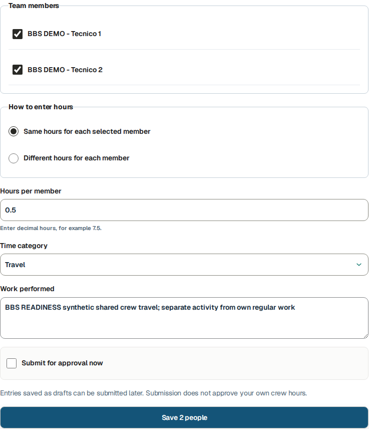

## Use different actual hours and submit deliberately

Go here: Crew hours → Different hours for each member

Context: Isolated BBS role lab · genuine Chief Worker account · dated October 1–31 delegation

The October 15 exercise entered 0.5 h for Worker 1 and 1 h for Worker 2, category Travel. Individual hours reflect each person’s actual activity. Checking Submit for approval now combines save and submission; it does not approve the work.

### Do the task

1. Select the authorized members and Different hours for each member. Enter each worker’s hours, category and shared factual Work performed.
2. Review the selected date/member names and tick Submit for approval now only when ready. Use Save 2 people.
3. Inspect both resulting rows and their states. The PM approved Worker 1’s 0.5 h and returned Worker 2’s 1 h for 0.75 h correction.

### Verify the result

- Separate 30 minute and 60 minute sources were saved as Submitted. Their later review outcomes are independent.

### If you get stuck

- An absent member or blocked date requires Owner delegation/assignment review. An unsent row can be corrected through its current controls; reviewed history requires the proper linked process.

## Record one crew expense with its actual payer

Go here: Crew hours → Add expense for [worker]

Context: Isolated readiness lab · actual Chief-entered single USD 20 receipt · October 7, 2026

Record one purchase with its actual attributed worker, payer and related hours. The tested Add expense for Worker 2 link preselected the readiness project, October 7 date and Worker 2’s 0.5-hour Travel source. The receipt explicitly says synthetic training only.

Record expense for, Who paid and later allocation are distinct. Here one USD 20 meal expense was recorded for Worker 2, paid by Worker, then split 10+10 across two valid shifts. The allocation does not create another purchase.

### Do the task

1. From the intended saved crew row choose Add expense for that worker. Check Record expense for, Project, Date and Related logged hours.
2. Select Meals, attach the one receipt and enter Amount 20, Currency USD, Who paid Worker, Vendor and factual Description. Use Save draft, then reopen the exact saved expense.
3. Allocate the receipt only after its facts and linked source are accurate. Inspect the saved split, use the expense detail Submit, and verify Submitted before handing it to the permitted reviewer.

### Verify the result

- One current USD 20 Meals expense carries the actual synthetic receipt and initial Worker 2 source; the two allocations total that one purchase.

### If you get stuck

- Before allocation, an incorrect Chief-entered expense Draft can offer Withdraw crew expense draft with a reason. The native test retained the incorrect receipt as Withdrawn. Uploading its identical file again was blocked as existing private content; no new expense was saved. Ask the Owner to resolve the original receipt rather than evading duplicate protection. A separate, distinct synthetic Meals purchase was used for the allocation exercise. Once allocated, protected changes need the Owner/reviewer handoff.

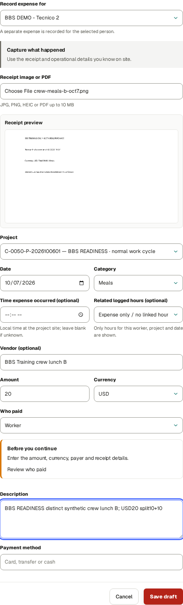

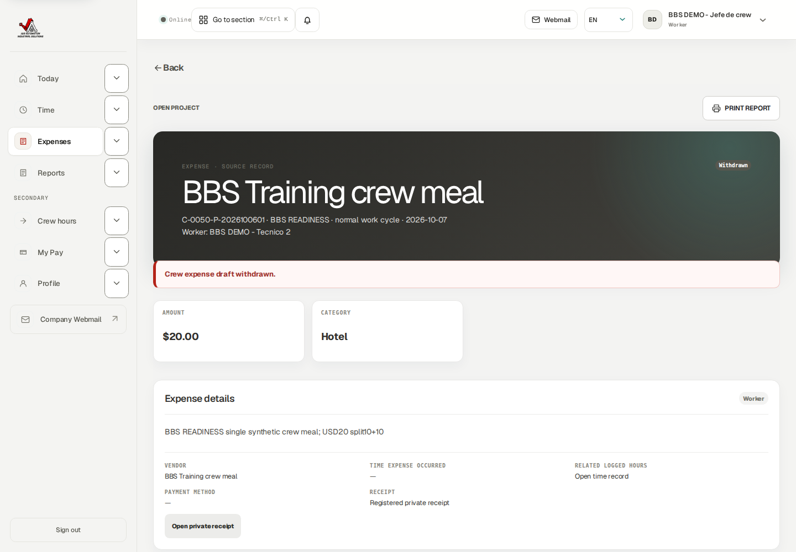

## Split one receipt across worked sources

Go here: Crew hours → Allocate one crew receipt

Context: Isolated readiness lab · actual single-receipt allocation and state limits

First save the two actual crew time sources, then save one Chief-entered receipt expense linked to one of them. In this exercise the expense and shifts belong to the same readiness project and October 7 date.

Select at least two eligible time rows for different workers, including the expense’s originally linked Worker 2 shift and the attributed/payer worker. Enter a positive amount for each. The preview must show the amounts exactly match the one USD 20 receipt: 10 + 10 = 20.

After Save receipt allocation, inspect the saved group and one expense. This deployed flow provides no Unallocate control. An allocated receipt is protected from ordinary changes to amount, person, project/date, linked shift and receipt file. A mistaken saved split requires the Owner/reviewer support handoff; do not create another full expense or change hours to force the split.

### Do the task

1. In Allocate one crew receipt choose Receipt expense after the single expense is saved.
2. Select the eligible Worker 1 and Worker 2 shifts; include the initial linked Worker 2 source. Enter Amount for each worker 10 and confirm Amounts match the receipt.
3. Use Save receipt allocation. Reopen the saved allocation and expense, verify USD 10 + USD 10 = USD 20, then Submit the expense and intended time rows for review.
4. If the saved split is wrong, stop at the protected allocation and give the Owner/reviewer the expense ID, allocation ID, both source IDs, receipt amount and intended split.

### Verify the result

- The actual native saved allocation totals USD20 across two USD10 rows. After separate native Submit actions, the independent Owner approved the receipt and both crew time sources. Exact IDs/states are in the readiness manifest. Allocation alone does not prove reimbursement or bank payment.

### If you get stuck

- Allocated receipts can lock draft edit actions. Investigate the existing allocation/expense with the reviewer rather than making duplicate expenses or altering hours to force a split.

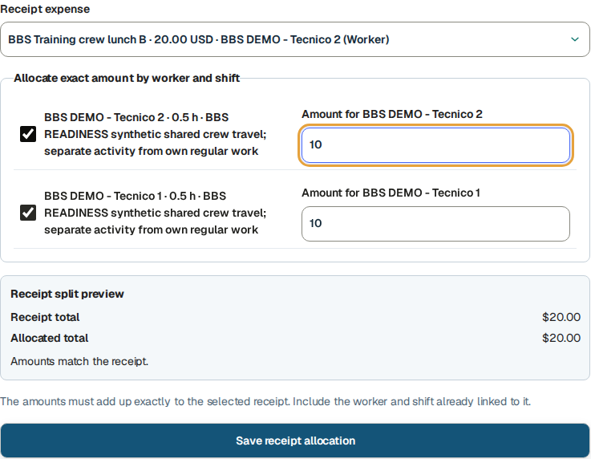

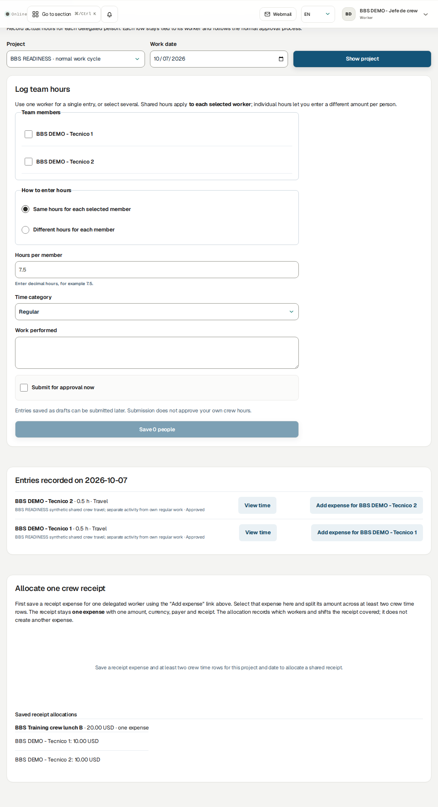

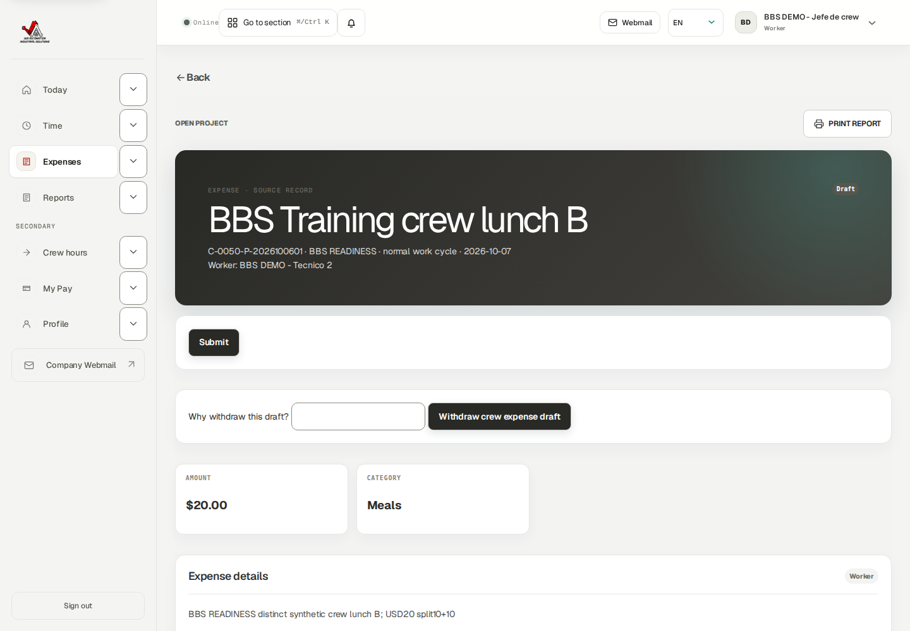

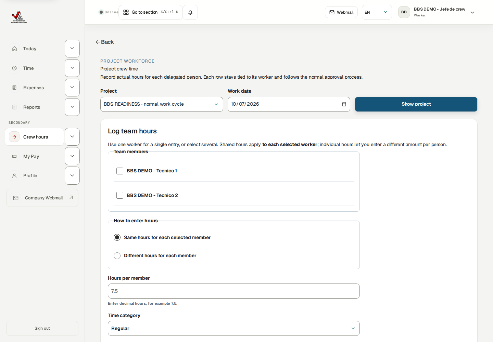

## Hand operational work to the permitted reviewer

Go here: Crew hours → submitted sources; reviewer → Approvals

Context: Isolated BBS role lab · genuine Chief Worker account · dated October 1–31 delegation

The tested entry-only Chief uses an ordinary Worker account with dated delegation. The Owner independently reviewed the new two crew sources and one allocated receipt. The designated contact handles subsequent reimbursement questions.

Submission, operational approval, reimbursement and payment are separate stages. A Chief should not assume a submitted row is approved or paid.

This is an entry-only Chief course. The Chief records and submits delegated operational work; the authorized reviewer independently decides its review state. Chief delegation does not enable Approvals. See Review authority · who receives each source (review-authority).

### Do the task

1. Inspect each member’s source state after submission. Send the PM record IDs, work date and any material evidence or safety concern.
2. Read a returned reason on the actual source. Correct through the permitted linked flow; do not silently overwrite history.
3. Send your own reimbursement questions to the designated contact. For a locked crew source, send the Owner its ID, project, work date, requested correction and reason.

### Verify the result

- Read source states after every action. The new own weekly sources and report/receipt exercises have explicit IDs and current states in the readiness manifest; earlier PM-approved records remain historical examples.

### If you get stuck

- If Approvals is denied, ask the Owner who has review permission. Never borrow the reviewer’s account.

## Record and submit your own Chief hours separately

Go here: Time → Log time; Submit this week

Context: Isolated readiness lab · actual Chief own ordinary and linked correction weekly submission

Your own Time records remain separate from delegated crew rows. The readiness test returned a one-hour Chief source for a correction to 0.75 hour, withdrew an incorrect 0.9-hour correction with a reason, and recreated the accurate linked 0.75-hour draft.

A separate 0.25-hour own draft and the active linked 0.75-hour correction both submitted through the Chief’s own displayed October 5–11 week. Two drafts became Submitted and zero remained. That count does not include delegated people’s crew rows.

### Do the task

1. Use your own Time → Log time → Save draft for your actual personal work. Read a returned own source’s reason separately from crew corrections.
2. For a wrong unsubmitted linked correction, use Why withdraw this draft? → Withdraw correction draft, then recreate from the original with accurate values. Linked time drafts have no unrestricted Edit control after creation.
3. Choose Week of → Open week. Inspect ordinary and correction sources, then Submit all week drafts.
4. Open each exact source and confirm Submitted plus zero remaining own drafts. Independent operational review is still required.

### Verify the result

- Actual Chief own weekly result: ordinary 15-minute source plus linked 45-minute correction Submitted, original 60-minute source Needs changes, incorrect withdrawn 54-minute draft retained in history.

### If you get stuck

- Check the own draft count before submitting a week. For linked or locked sources use exact record controls and the designated contact.

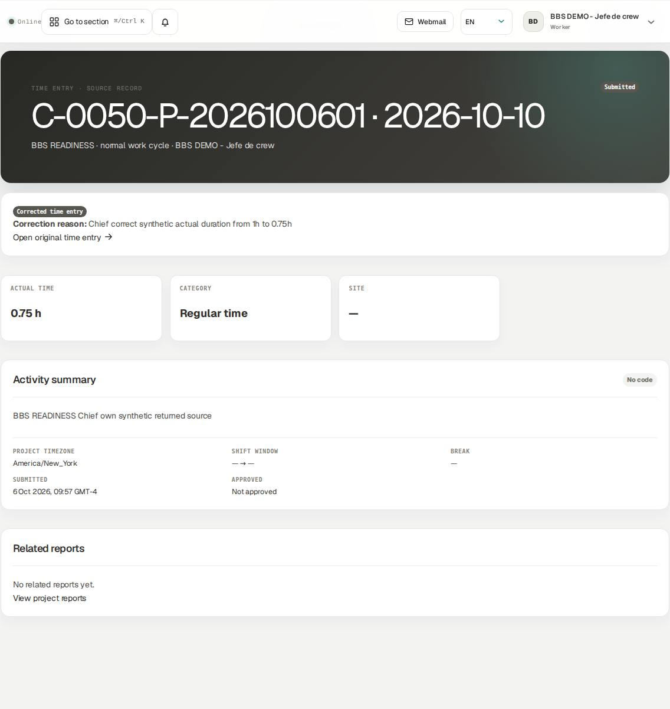

## Correct a delegated returned entry

Go here: Crew hours → View time → Create corrected draft

Context: Isolated BBS role lab · genuine Chief Worker account · dated October 1–31 delegation

The Project Manager returned Worker 2’s one-hour Travel source with a reason requesting 0.75 actual hour. The dated delegation covered that source and work date, and Create corrected draft was available. The Chief created and submitted the linked replacement; the reviewer then approved it.

### Do the task

1. Open the returned crew source using View time. Read Needs changes and the reviewer’s reason.
2. In Create corrected draft enter Reason, Work date, Time category, Actual hours 0.75 and factual Work performed. Create the correction.
3. Inspect the new Draft and original link. Use Submit for approval now on this crew correction detail.
4. After PM review, refresh the selected date and inspect the Approved replacement.

### Verify the result

- The original 1 h remains Needs changes; the linked 45 minute 0.75 h replacement is Approved. Worker 1’s 0.5 h remains separately Approved.

### If you get stuck

- If the correction action is unavailable or the source is locked, preserve the source and send the Owner its ID, project, work date, requested correction and reason. Do not duplicate the entry or change its date/person to work around the restriction. The Chief does not review its own correction.

## Write a Chief daily handover report

Go here: Reports → New daily report

Context: Isolated readiness lab · own Chief authored report · synthetic October 12, 2026

Chief reporting uses the Chief’s own author account. The native own Daily form has no arbitrary-worker selector. Delegated time entry does not imply report author impersonation.

Write factual crew coordination/conditions, with member source IDs when needed. A Daily report does not replace each actual timesheet or prove customer acceptance.

The own readiness Draft’s source PDF was generated in English, checked Ready with Refresh and downloaded as a readable native file before Submit for review. Language selects English, Spanish or Portuguese; the output remains scoped to this own authored operational report.

The Owner actually returned the readiness Daily report. The Chief edited its next-day handover with Save changes and resubmitted the same report ID. Return recovery is a versioned edit of an ordinary source; it is not the Approved-source linked correction flow.

### Do the task

1. Select Project, Work date and Site / shift; fill Shift summary and Tasks completed. Include actual problems/actions, downtime, standby, open items, next day plan and safety flag where applicable.
2. Use Save daily report. Inspect the Draft, then Submit for review.
3. Confirm Submitted and the permitted reviewer’s later state.

### Verify the result

- Actual own Daily Draft → Ready PDF → native Download → Submitted was tested. A draft PDF and report submission do not establish customer acceptance.

### If you get stuck

- Ordinary Draft and Needs changes reports can be edited with the offered Save changes control and resubmitted as the same versioned source. An eligible Approved report may offer a linked correction; the created correction is not freely editable. If the source is locked, send its ID, project, work date, requested correction and reason to the Owner or reviewer.

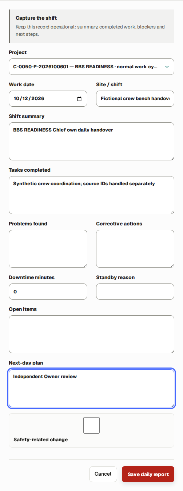

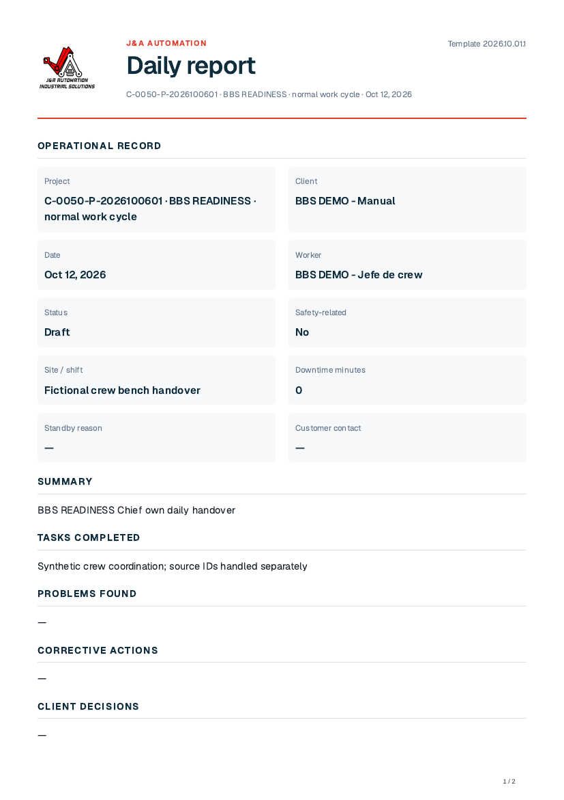

## Document your technical findings and validation

Go here: Reports → New technical report

Context: Isolated readiness lab · own Chief authored report · synthetic October 12, 2026

The Chief’s Technical report is its own authored evidence, separate from crew hours. This worked system is explicitly a fictional bench; no live PLC change occurred.

Capture equipment identifiers, Problem / symptom, Diagnosis / root cause, Change performed, production impact, validation/result, open risk and rollback. Safety/change authorization remains governed by real responsible-person procedures.

The own readiness Draft’s source PDF was generated in English, checked Ready with Refresh and downloaded as a readable native file before Submit for review. Language selects English, Spanish or Portuguese; the output remains scoped to this own authored operational report.

### Do the task

1. Open New technical report and identify Project, Work date and System / machine; fill applicable machine/platform/version fields and factual technical narrative.
2. Use Save PLC report, inspect the Draft, then Submit for review.
3. Check review state and hand genuine risks/open work to the responsible PM/technical reviewer.

### Verify the result

- Actual own Technical Draft → Ready PDF → native Download → Submitted was tested. A draft PDF and report submission do not establish customer acceptance.

### If you get stuck

- Ordinary Draft and Needs changes reports can be edited with the offered Save changes control and resubmitted as the same versioned source. An eligible Approved report may offer a linked correction; the created correction is not freely editable. If the source is locked, send its ID, project, work date, requested correction and reason to the Owner or reviewer.

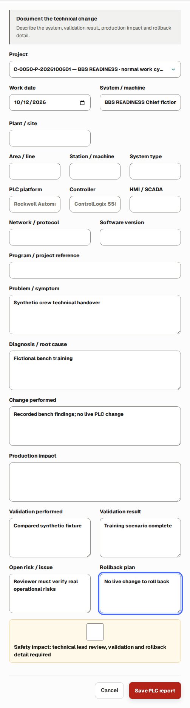

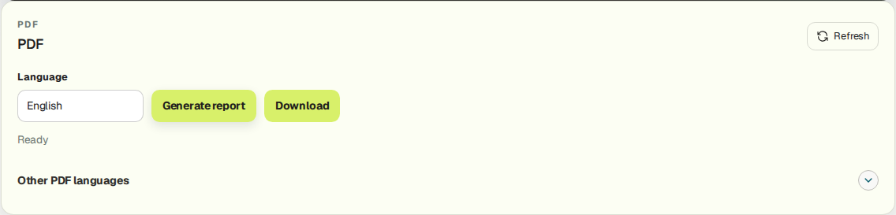

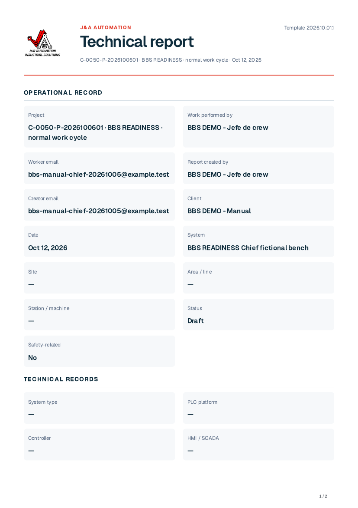

## Read only your own pay and reimbursements

Go here: My Pay → Apply period

Context: Isolated BBS role lab · genuine Chief Worker account · dated October 1–31 delegation

My Pay identifies your own account. Check the historical October 1–4 period and its included actual activity before reading the settlement and reimbursement states. Copied training payment records have no claim to a real bank transfer.

Expected date, reviewed amount, paid and remaining are different fields. Your source estimates follow your dated compensation rules. Crew receipt allocations do not determine your compensation.

The native own Chief October 1–6 statement was generated and both PDF and CSV downloaded Ready. It contains 735 approved minutes for this Chief. These historical synthetic records do not claim a real bank transfer.

### Do the task

1. Set From and Through, then Apply period. Confirm the displayed dates before requesting a statement.
2. Read your own approved/pending estimates and reviewed settlement/payment fields separately.
3. In Worker statement choose Generate report. While preparing, use Check statement status if offered or allow status to refresh. Download PDF and CSV independently only when Ready. Open both files and confirm identity, date range and own activity.

### Verify the result

- Confirm your own account and selected period before reading My Pay. A split receipt does not prove reimbursement.

### If you get stuck

- Send missing-rule, settlement and reimbursement questions to Finance with your own source and period.

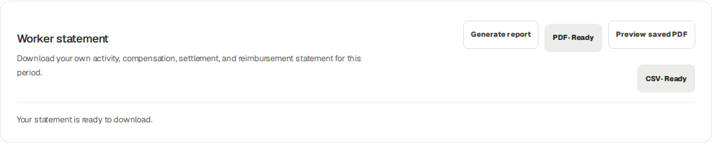

## Read your own plan and distinguish crew authority

Go here: Today → Upcoming assignments; Crew hours → Project / Work date

Context: Isolated BBS planning lab · synthetic October 20, 2026 work · genuine role sessions · no production hours

The Owner/PM publishes a work plan to assigned people. Selecting the Chief and both technicians creates an individual published planning row for each person. Your Today agenda shows your own plan; dated crew delegation does not turn it into a combined crew agenda.

In this connected isolated example, October 20 is planned for 08:00–16:00 UTC with eight planned hours per person. Publication initially created zero actual time. The Owner separately configured an expected weekday schedule of 480 minutes from October 19.

Project membership, work planning and crew delegation are separate dated controls. Both the Chief and managed worker need project coverage for the work date, and the delegation must cover that date. Receiving a plan does not grant permission to record another worker’s hours.

There are no Accept, Reject or Mark completed goal buttons on the assignment cards. Use Activity summary and Daily/Technical reports to describe completed tasks, remaining work, problems and handover.

### Do the task

1. Open Today → Upcoming assignments and read your own project, date, UTC times, site and Planned hours.
2. Ask the Owner/PM to correct a wrong or missing published plan; the Chief does not edit it from Today.
3. Open Crew hours, select Project and Work date, and click Show project. Confirm that the intended technicians appear under Team members before entering any hours.
4. Agree who records each person’s actual work. A technician should inspect an existing Chief-recorded source instead of duplicating it.

### Verify the result

- Planning creates no actual hours.
- Chief authority remains limited to dated delegated operational entry and the Owner’s explicit grants.

### If you get stuck

- No published assignment for today can coexist with valid project membership. Use accurate authorized actual records and ask for the missing plan to be published if needed.
- If Crew hours says no active delegated workers, ask the Owner to check the selected work date, both project assignments and the dated delegation. A future plan is not a replacement for those permissions.

## Complete one shared plan with different individual actual hours

Go here: Crew hours → Log team hours; Time → Log time; reviewer → Approvals

Context: Isolated BBS planning lab · synthetic October 20, 2026 work · genuine role sessions · no production hours

The eight-hour plan was the same for all three people, but actual work differed. Technician 1 personally recorded six hours. The Chief recorded seven for Technician 2 through Crew hours, then eight Chief hours separately through its own Time form.

This exercise demonstrates a handoff, not automatic plan completion: actual sources are saved, checked, submitted and independently reviewed. All three synthetic October 20 records were approved by the genuine Project Manager account in the isolated copy.

### Do the task

1. Confirm Technician 1 has already recorded their six-hour source. Do not select that technician in the Chief form for the same work.
2. In Crew hours, choose October 20 and the BBS project. Select only Technician 2, enter seven Hours per member and an accurate Work performed summary, then Save 1 person. Selecting one member is supported.
3. Inspect Entries recorded on October 20. The row must belong to Technician 2, show seven hours and Draft. Click Submit after checking the details.
4. Open your own Time → Log time, select the same project and work date, enter eight actual hours and your own Activity summary, then Save draft.
5. Check your displayed week and Submit all week drafts. This submits your own Chief drafts, not a second copy of the delegated technician’s source.
6. The Owner/PM opens Approvals and reviews the three internal-worker sources. Return to Crew hours to verify the seven-hour row says Approved; each worker checks their own Time view.

### Verify the result

- Final source totals are Technician 1 six hours, Technician 2 seven hours and Chief eight hours; exactly one source per person.
- The seven-hour source retains Technician 2 as worker and the Chief as delegated recorder. Chief’s own Time contains eight hours, not fifteen.
- Submission is a handoff for review. Chief delegation itself does not grant permission to approve these sources.

### If you get stuck

- If the wrong person or duration is selected, fix the draft before submission. After submission use the returned/correction workflow described in the correction chapter.
- If a duplicate warning appears, inspect existing personal and crew sources rather than treating the published plan as permission to save another identical entry.

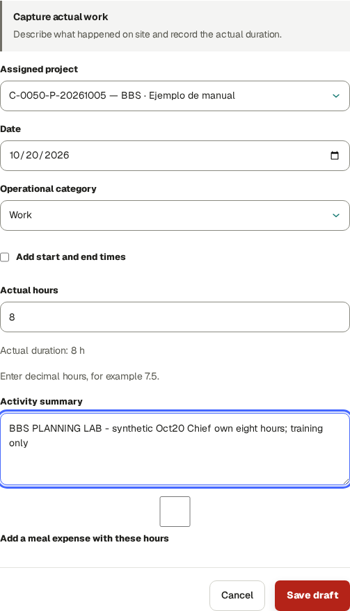

## Reconcile your own weekly target without changing actual work

Go here: Time → Week of → Open week

Context: Isolated BBS planning lab · synthetic October 20, 2026 work · genuine role sessions · no production hours

Expected comes from the effective working schedule and dated project coverage, not from adding published plans or crew sources. In this example, Monday–Friday target 480 minutes each and Saturday/Sunday target zero.

The Chief’s own October 20 row is Actual 8.00h, Expected 8.00h and Difference 0.00h, with Approved status. Technician 1’s personal view is 6/8/−2 and Technician 2’s is 7/8/−1; their weekly comparison rows show Needs note after operational approval.

Needs note flags an approved duration different from the daily expectation. It does not mean the source was returned, and it did not prevent approval. No dedicated Add note or Clear Needs note action was present in the tested controls. Explain differences in the source summary and reports; the comparison can continue to show Needs note.

The weekly total includes scheduled days with no actual records, including future training dates. Check the specific day when reconciling a finished shift. Do not copy a target into fictitious hours or add delegated colleagues’ hours to your own totals.

### Do the task

1. Open your own Time page, enter the week containing the work date and click Open week.
2. Read Actual, Expected, Difference and Status on the day’s row. Difference is actual minus expected.
3. Inspect the source’s own approval state separately from the weekly comparison.
4. On a phone, the labelled daily card replaces the wide table. Open day entries locates the actual sources for that date.

### Verify the result

- Your eight-hour source remains eight actual hours even though you also recorded a colleague’s seven-hour source.
- An unknown expectation displays a dash. The application requires unambiguous effective membership/schedule coverage before showing a target.

### If you get stuck

- Ask the Owner to review assignment dates, effective schedule and any ambiguous multiple-project allocation when Expected is missing or incorrect.
- Keep crew handovers focused on the work performed, dates, source records and next actions.

## Operate crew controls on a phone or tablet

Go here: Crew hours → Project / Work date

Context: Isolated BBS role lab · genuine Chief Worker account · dated October 1–31 delegation

Phone/tablet views preserve the same dated delegation checks. Use More or the navigation drawer for destinations outside the bottom bar. Intentional internal table scrolling is different from page-level overflow.

### Do the task

1. Choose Project and Work date before selecting members. On narrow screens review the chosen names and individual durations carefully.
2. Scroll to the saved crew rows or allocation section after saving; verify the result before repeating an action.

### Verify the result

- Crew views were checked at 1440, 768 and 390 pixels with no page-level horizontal overflow.

### If you get stuck

- If a control is clipped, report the width and precise action with a safe screenshot. Do not re-save the same batch to compensate for a hidden result.

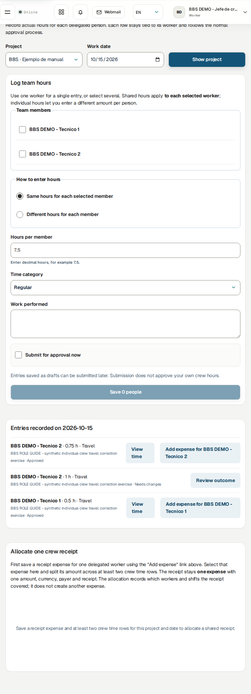

## Manage your own profile and ask for support

Go here: Profile; Notifications; Help

Context: Reference procedure · current controls/source checked; mutations not exercised in this role lab

Profile expertise and availability affect planning, not delegation/review permission or actual hours. Security belongs to your individual account: passkey Device name/Register passkey and authenticator setup/recovery should be kept private. These changes were not performed in the Chief lab.

Notifications can lead to returned sources or pending work; marking read does not approve them. Help’s verified contact is admin@j-aautomation.com. Live portal/webmail links are live services. No support message was sent.

### Do the task

1. Maintain genuine own expertise/availability using offered Profile controls. Ask the Owner for crew delegation, account status or review permission changes.
2. Follow a notification to its current record and inspect state before acting.
3. Send support the environment, role, project/record ID, date, intended action and exact message. Exclude passwords and recovery material.

### Verify the result

- Requests outside the Chief’s authorized workspace returned 403. Delegation is not approval authority.

### If you get stuck

- If a crew member disappears, check the selected date and Owner-grant coverage. For a locked source, send the Owner its ID, project, work date, requested correction and reason; do not substitute credentials or duplicate history.

## Verify the crew handover

Go here: Crew hours → Reports → own Time → reviewer handoff

Context: Isolated BBS role lab · genuine Chief Worker account · dated October 1–31 delegation

Use a single handover list for the selected workday; crew recording, your own work and independent review remain separate.

The October 6 readiness audit adds explicit native-browser outcomes and state-specific limits. Per-ID status and source IDs are recorded under docs/evidence/bbs-readiness-20261006/worker-chief. Earlier planning/role-lab screenshots retain their original historical scope; they are not the state of the new readiness sources.

### Do the task

1. Confirm environment/account/project/date and delegated member coverage.
2. Save each member’s actual duration/category once; inspect shared per person versus individual amounts.
3. Record each purchase once; allocate one shared receipt only across valid linked shifts and verify the sum.
4. Submit intended crew rows and your own Time/report drafts.
5. Read review returns and create linked corrections only where offered. Send locked source IDs, project, work date, requested correction and reason to the Owner.
6. Confirm current member states and own report states; tell PM which sources remain Submitted/open and which risks remain unresolved.

### Verify the result

- Lab passes: shared/individual native crew entry, separate Submitted sources, one receipt allocated 10+10, delegated correction 1→0.75 Approved after independent review, own weekly submission and own Daily/Technical review, denied unauthorized actions and responsive views.
- Readiness native results: own ordinary and current linked time correction Submitted together, count2→0; two crew shifts and one single allocated receipt independently Owner Approved; own Daily/Technical Ready PDF downloads before submission, returned Daily edit/resubmit, and own statement PDF/CSV downloads. See the per-ID audit for exact current states.

### If you get stuck

- This course covers an entry-only delegated Chief. Customer acceptance, own profile/security changes and live bank/email delivery were not performed in the Chief lab. Wrong unallocated crew receipts were withdrawn natively; an incorrect saved allocation requires the documented Owner/reviewer handoff.

## Recovery · correct a source or request help

Use your role’s worked correction lesson and the controls offered on the current record. Preserve the original. A new purchase is different from correcting an existing purchase.

| State | Supported next action |
| --- | --- |
| Ordinary Draft | Use Edit/Save draft where present; attach the actual receipt/evidence before Submit. Inspect each saved draft after weekly table entry. |
| Submitted | Read current state and reviewer handoff. Do not create another source merely because review is pending. |
| Needs changes | Read the reason. Time uses Create corrected draft where available, then submit/review the linked replacement. A returned Daily/Technical report instead offers Edit and Save changes on the same report, then Submit for review; follow the exact role lesson. |
| Rejected | Inspect the reason and contact reviewer/Owner. The time detail does not offer the same linked-correction route as Needs changes; do not assume that route exists. |
| Approved, correction available | Use the offered linked correction and review every value before creating it. Submit the replacement for the authorized reviewer and verify its resulting state. |
| Locked or correction unavailable | Send the source ID, project, work date, visible state, requested correction and reason to the designated administrator. Do not create a duplicate. Wait for instructions before changing the record. |

### If you get stuck

- If an action is unavailable to your account, return to your workspace and contact the designated administrator with the record reference and requested action. Do not change dates or people to work around a restriction.

## Security · verify your own device and recovery options

Go here: Profile → Account security; Profile → Add availability

### Do the task

1. Check Account security identifies YOUR account even when an authorized workforce profile inspection shows another worker above it. Enroll only your own device. MFA is optional in this release.
2. For a passkey, enter Device name and choose Register passkey on the approved secure portal. Complete your device’s creation confirmation. Verify Passkey registered for this account, the registered count and named device row. Cancelled/failed registration is not enrollment.
3. To retire your own lost/obsolete passkey, first confirm you retain another working sign-in method. Select Revoke on the exact device and verify Passkey revoked and removal of its row. If you cannot sign in, use the verified support route rather than another person’s session.
4. For an authenticator, choose Enable MFA. Keep the setup URI and one-time recovery codes private in the approved password manager. Add the URI to your authenticator, enter its current six-digit Authenticator code and choose Verify MFA. Verify Enabled and Disable MFA appear; enabling without verification is not completed enrollment.
5. At a later MFA sign-in use Six-digit code → Verify and continue. If the authenticator is unavailable, choose Use a recovery code and enter one unused stored code. If neither method is available, contact admin@j-aautomation.com for identity-verified recovery. Do not send recovery codes or the setup URI to support.
6. To remove optional MFA while signed in, choose Disable MFA and verify Not enabled/Enable MFA. Confirm the intended own account before doing so. A successful settings change is separate from recovering a lost account.
7. Where Add availability is offered, fill Starts, Ends, Availability and Note using the displayed time basis, then Save availability. Verify the saved interval/status/note in the list; use Edit availability on that row and save the changed values. Availability is not project membership, a published shift or actual hours.

## Completion check · your permitted role cycle

Use the worked lessons for your own role. Historical examples retain their stated dates and states. A procedure labelled reference was checked against the controls; its outcome was not necessarily executed in the illustrated session.

### Verify the result

- Confirm your identity, project and dates. Verify the saved and submitted source, its review state, supported correction or administrator handoff and each permitted Ready output. Submission, review and download are separate checkpoints.
