# Chief · BBS crew operations

Dated delegation, team hours, shared receipts, corrections and own Worker responsibilities

## Before you practise · access and scope

This English guide uses BBS · Ejemplo de manual, project C-0050-P-20261005. The screenshots were taken using the stated role in an isolated database running the application. Training entries, payments, approvals and documents are fictional. They do not prove a real bank transfer, accountant approval or customer acceptance.

The company portal at https://j-aautomation.com/j-aautomation/app is LIVE. Training uses a separate URL and database. Before practising, obtain the isolated URL, your own role account and permitted exercises from the company administrator; verify the BBS project number. Without isolated access, treat these screenshots as read-only demonstrations and perform only authorized real work.

Use your own credentials. Do not borrow an Owner, Finance or colleague account. A platform role, project assignment, review permission, supplier authorization and dated crew delegation are separate requirements. Changing one does not automatically grant the others.

Select English in the workspace language control to follow the labels used here. Some saved BBS record names remain in their original language. On a phone open the navigation drawer to see full workspace names. Recheck the selected project and date range after every navigation.

The eight Worker test accounts in the private credentials document use the same Worker workflow. Crew chief is a dated delegation attached to a Worker account. Supplier Coordinator and External Technician are restricted profiles attached to Worker accounts. This guide never includes account passwords.

Each screenshot is an exercise checkpoint. Later fictional role entries and financial events are additional to the original October 1–5 workbook totals. Reopening the project or selecting the same dates does not restore that checkpoint. Read captions before comparing amounts or states.

The assignment and expected-hours supplement uses a separate isolated October 20–23 synthetic exercise. Project access, a published work plan and a dated working-hours target are separate records. Workers record actual work and report progress independently; a plan never creates actual hours or a payment.

### Verify the result

- Confirm your displayed account, role or supplier profile, the project number and the dates before saving.
- For training access, scope or reset help, contact the company administrator at admin@j-aautomation.com. Include the role, route, project number, time and visible error; omit passwords, cookies and private customer or worker documents.

### If you get stuck

- An empty project selector often means missing or expired assignment or authorization. Ask the Owner to check coverage for the date you are entering; do not create a duplicate project.
- A form shown in a screenshot can depend on role, source state or effective date. Use the documented role handoff when a control is absent.

## Understand Chief authority before recording crew work

Go here: Sign in → Crew hours

Context: Isolated BBS role lab · genuine Chief Worker account · dated October 1–31 delegation

Chief is an ordinary Worker account with dated person/project delegation. Account role, project assignment, crew-chief delegation and Can review permission are separate. In this BBS example the Chief may record for Worker 1 and Worker 2 during October 1–31; assignment review permission is off.

Before practising obtain an operator training URL, own account, visible environment identity, permitted scope and reset instructions. No shared training credentials are provided. Live company links remain live company services. Every illustrated mutation here is fictional and isolated.

Crew hours handles delegated operational entry. Time, Expenses, Reports and My Pay still handle your own Worker records. Delegation does not reveal crew compensation or grant Finance access; Chief authenticated Approvals and Finance requests returned 403.

### Do the task

1. Confirm your own Chief account and the isolated environment. Open Crew hours.
2. Select Project and Work date, then Show project. Check that intended members are offered for this date.

### Verify the result

- The delegated crew list is date-specific. The October 1–31 grant covers the worked October 6 and 15 examples.

### If you get stuck

- Ask the Owner to correct expired/missing delegation or assignment. Do not select another account to gain access.

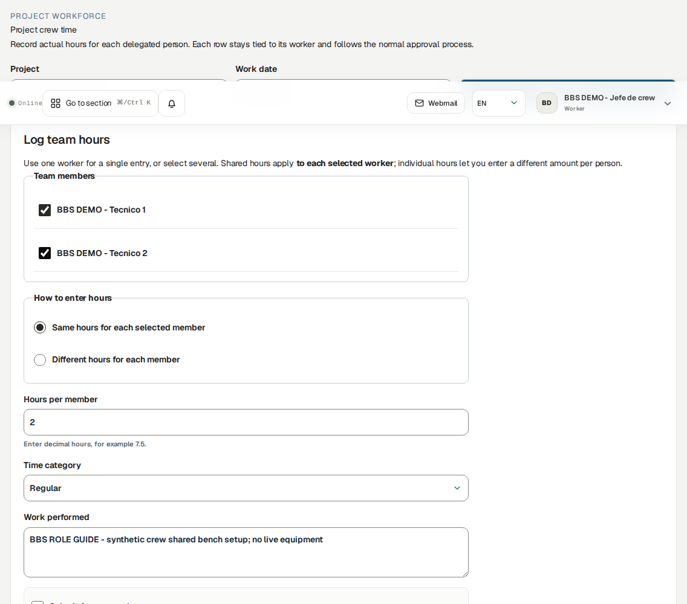

## Read your own plan and distinguish crew authority

Go here: Today → Upcoming assignments; Crew hours → Project / Work date

Context: Isolated BBS planning lab · synthetic October 20, 2026 work · genuine role sessions · no production hours

The Owner/PM publishes a work plan to assigned people. Selecting the Chief and both technicians creates an individual published planning row for each person. Your Today agenda shows your own plan; dated crew delegation does not turn it into a combined crew agenda.

In this connected isolated example, October 20 is planned for 08:00–16:00 UTC with eight planned hours per person. Publication initially created zero actual time. The Owner separately configured an expected weekday schedule of 480 minutes from October 19.

Project membership, work planning and crew delegation are separate dated controls. Both the Chief and managed worker need project coverage for the work date, and the delegation must cover that date. Receiving a plan does not grant permission to record another worker’s hours.

There are no Accept, Reject or Mark completed goal buttons on the assignment cards. Use Activity summary and Daily/Technical reports to describe completed tasks, remaining work, problems and handover.

### Do the task

1. Open Today → Upcoming assignments and read your own project, date, UTC times, site and Planned hours.
2. Ask the Owner/PM to correct a wrong or missing published plan; the Chief does not edit it from Today.
3. Open Crew hours, select Project and Work date, and click Show project. Confirm that the intended technicians appear under Team members before entering any hours.
4. Agree who records each person’s actual work. A technician should inspect an existing Chief-recorded source instead of duplicating it.

### Verify the result

- Planning creates neither actual hours nor compensation settlements or client invoice lines.
- Chief authority remains limited to dated delegated operational entry. It does not grant Approvals, Finance, client rates, project cost/margin or access to colleagues’ pay.

### If you get stuck

- No published assignment for today can coexist with valid project membership. Use accurate authorized actual records and ask for the missing plan to be published if needed.
- If Crew hours says no active delegated workers, ask the Owner to check the selected work date, both project assignments and the dated delegation. A future plan is not a replacement for those permissions.

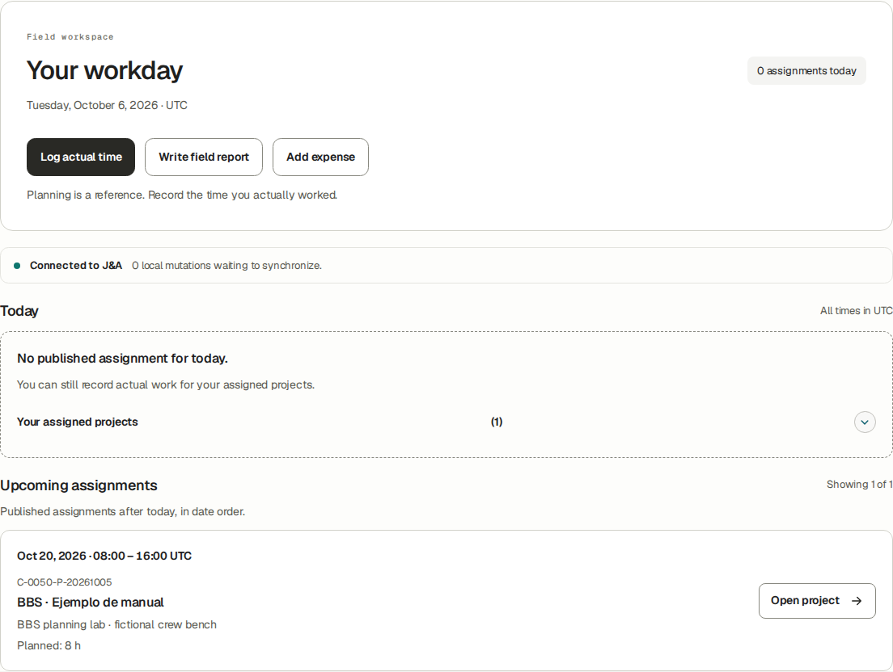

## Save the same actual hours for multiple crew members

Go here: Crew hours → Log team hours

Context: Isolated BBS role lab · genuine Chief Worker account · dated October 1–31 delegation

Same hours for each selected member means the full duration applies to each person. Two selected workers at 2 h creates two 2 h sources, total 4 actual hours; it does not split a shared 2 h total.

The October 6 bench setup is explicit simulated activity with no live equipment changes. Each saved row retains its worker and source ID.

### Do the task

1. Select Project and Work date and Show project. Tick only the authorized Team members who actually worked.
2. Choose Same hours for each selected member. Enter Hours per member 2, category and Work performed.
3. Leave Submit for approval now off to inspect the saved drafts; use Save 2 people. Inspect each 2 h row.
4. Use each intended row’s Submit action and confirm Submitted.

### Verify the result

- Two separate 2 h sources were saved and submitted; both remain awaiting operational review in this packet. Chief did not approve them.

### If you get stuck

- If one person/time is wrong, correct that draft through its permitted row controls before submitting. Do not save another batch while trying to locate the first one.

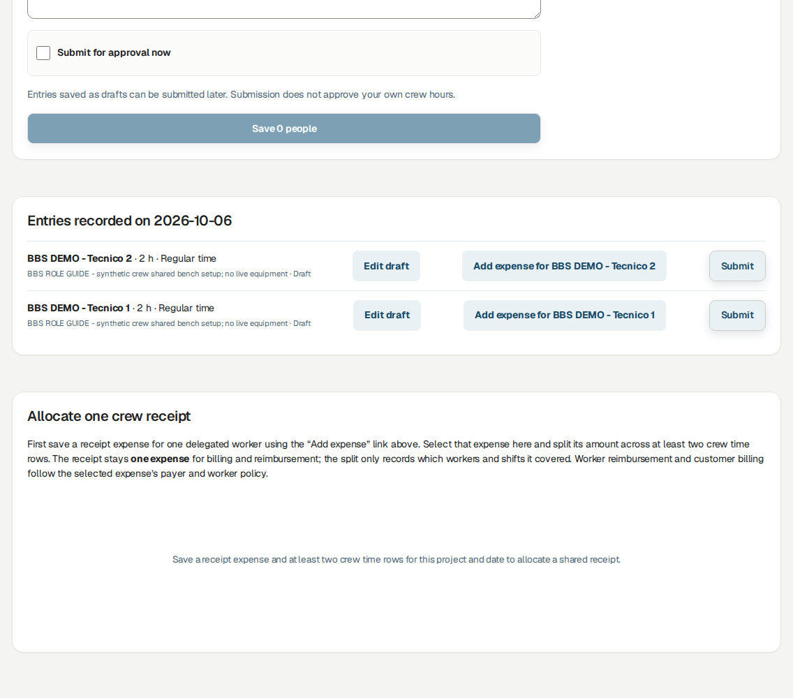

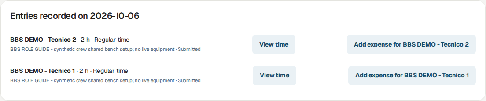

## Use different actual hours and submit deliberately

Go here: Crew hours → Different hours for each member

Context: Isolated BBS role lab · genuine Chief Worker account · dated October 1–31 delegation

The October 15 exercise entered 0.5 h for Worker 1 and 1 h for Worker 2, category Travel. Individual hours reflect each person’s actual activity. Checking Submit for approval now combines save and submission; it does not approve the work.

### Do the task

1. Select the authorized members and Different hours for each member. Enter each worker’s hours, category and shared factual Work performed.
2. Review the selected date/member names and tick Submit for approval now only when ready. Use Save 2 people.
3. Inspect both resulting rows and their states. The PM approved Worker 1’s 0.5 h and returned Worker 2’s 1 h for 0.75 h correction.

### Verify the result

- Separate 30 minute and 60 minute sources were saved as Submitted. Their later review outcomes are independent.

### If you get stuck

- An absent member or blocked date requires Owner delegation/assignment review. An unsent row can be corrected through its current controls; reviewed history requires the proper linked process.

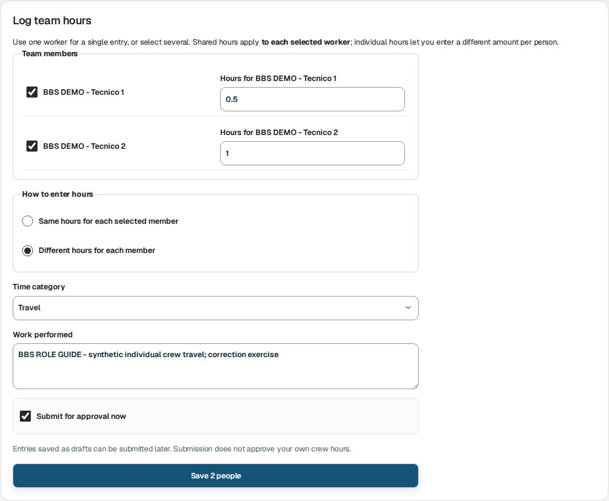

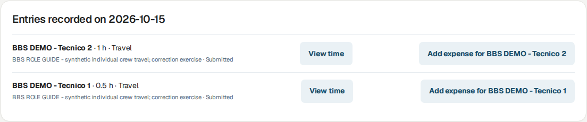

## Complete one shared plan with different individual actual hours

Go here: Crew hours → Log team hours; Time → Log time; reviewer → Approvals

Context: Isolated BBS planning lab · synthetic October 20, 2026 work · genuine role sessions · no production hours

The eight-hour plan was the same for all three people, but actual work differed. Technician 1 personally recorded six hours. The Chief recorded seven for Technician 2 through Crew hours, then eight Chief hours separately through its own Time form.

This exercise demonstrates a handoff, not automatic plan completion: actual sources are saved, checked, submitted and independently reviewed. All three synthetic October 20 records were approved by the genuine Project Manager account in the isolated copy.

### Do the task

1. Confirm Technician 1 has already recorded their six-hour source. Do not select that technician in the Chief form for the same work.
2. In Crew hours, choose October 20 and the BBS project. Select only Technician 2, enter seven Hours per member and an accurate Work performed summary, then Save 1 person. Selecting one member is supported.
3. Inspect Entries recorded on October 20. The row must belong to Technician 2, show seven hours and Draft. Click Submit after checking the details.
4. Open your own Time → Log time, select the same project and work date, enter eight actual hours and your own Activity summary, then Save draft.
5. Check your displayed week and Submit all week drafts. This submits your own Chief drafts, not a second copy of the delegated technician’s source.
6. The Owner/PM opens Approvals and reviews the three internal-worker sources. Return to Crew hours to verify the seven-hour row says Approved; each worker checks their own Time view.

### Verify the result

- Final source totals are Technician 1 six hours, Technician 2 seven hours and Chief eight hours; exactly one source per person.
- The seven-hour source retains Technician 2 as worker and the Chief as delegated recorder. Chief’s own Time contains eight hours, not fifteen.
- Submission is a handoff for review. Chief delegation itself does not grant permission to approve these sources.

### If you get stuck

- If the wrong person or duration is selected, fix the draft before submission. After submission use the returned/correction workflow described in the correction chapter.
- If a duplicate warning appears, inspect existing personal and crew sources rather than treating the published plan as permission to save another identical entry.

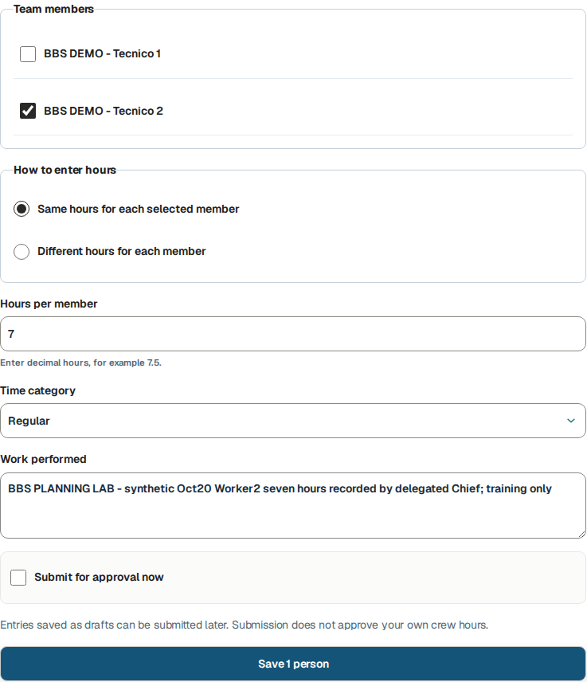

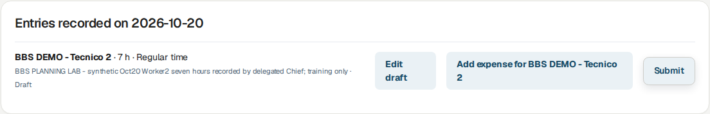

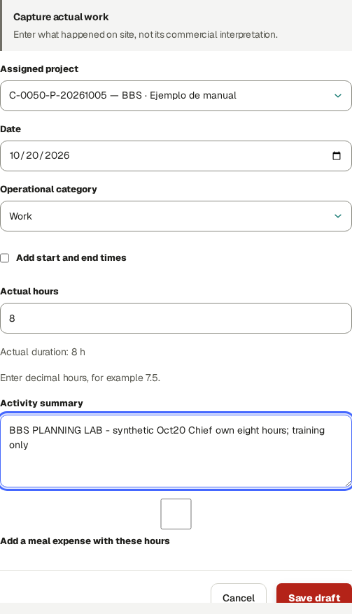

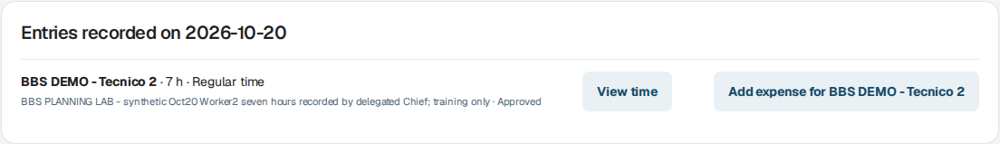

## Correct a delegated returned entry

Go here: Crew hours → View time → Create corrected draft

Context: Isolated BBS role lab · genuine Chief Worker account · dated October 1–31 delegation

The genuine PM returned Worker 2’s 1 h travel source with a 0.75 h reason. The delegated Chief could create and submit a linked replacement because the October 15 period was outside that worker’s finalized October 1–14 settlement. Delegation is still checked for the source/date.

### Do the task

1. Open the returned crew source using View time. Read Needs changes and the reviewer’s reason.
2. In Create corrected draft enter Reason, Work date, Time category, Actual hours 0.75 and factual Work performed. Create the correction.
3. Inspect the new Draft and original link. Use Submit for approval now on this crew correction detail.
4. After PM review, refresh the selected date and inspect the Approved replacement.

### Verify the result

- The original 1 h remains Needs changes; the linked 45 minute 0.75 h replacement is Approved. Worker 1’s 0.5 h remains separately Approved.

### If you get stuck

- A settled/paid compensation guard requires Finance’s explicit adjustment; do not duplicate a crew entry or change its date/person to evade it. The Chief does not gain self-approval by creating a correction.

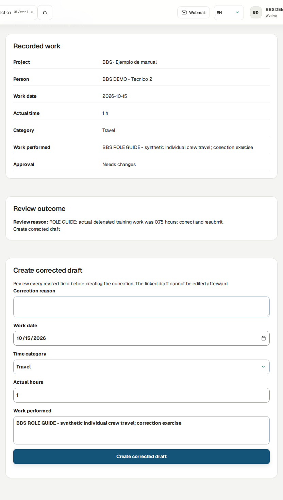

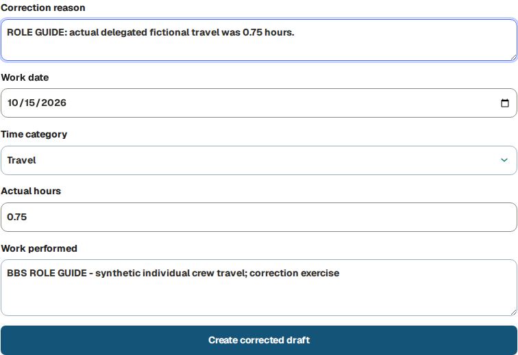

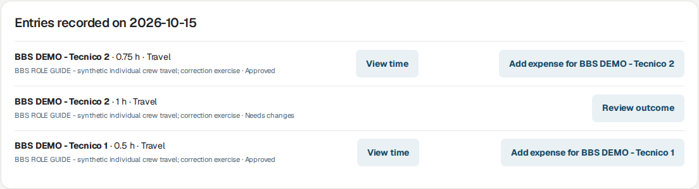

## Record one crew expense with its actual payer

Go here: Crew hours → Add expense for [worker]

Context: Isolated BBS role lab · genuine Chief Worker account · dated October 1–31 delegation

The Chief recorded one explicitly synthetic USD 20 meal receipt for Worker 2, paid by Worker. The link preselects the delegated worker/source. Record expense for is restricted to the Chief and authorized delegates; it does not grant arbitrary person access.

Expense owner, payer and later allocation are distinct. A Chief can record delegated operational facts without seeing another worker’s reimbursement details. No real purchase or transfer occurred.

### Do the task

1. From the intended crew row choose Add expense for that worker. Check Record expense for, Project, Date and related hours.
2. Attach the single receipt and fill Category, Amount 20, Currency USD, Who paid and factual Description. Save draft.
3. Open the saved detail and inspect the source/receipt/payer. Use Submit only after the receipt allocation and facts are verified.

### Verify the result

- Exactly one USD 20 expense was saved. Genuine PM operational approval followed submission. Finance classification/payment is a separate handoff.

### If you get stuck

- Use permitted draft/correction controls for wrong values. Do not create a separate full 20 expense for every crew member.

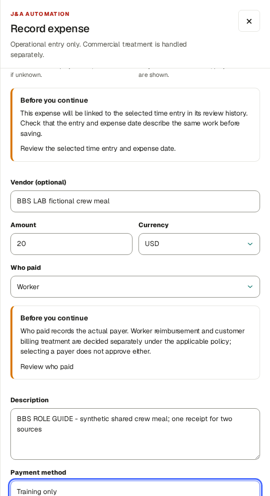

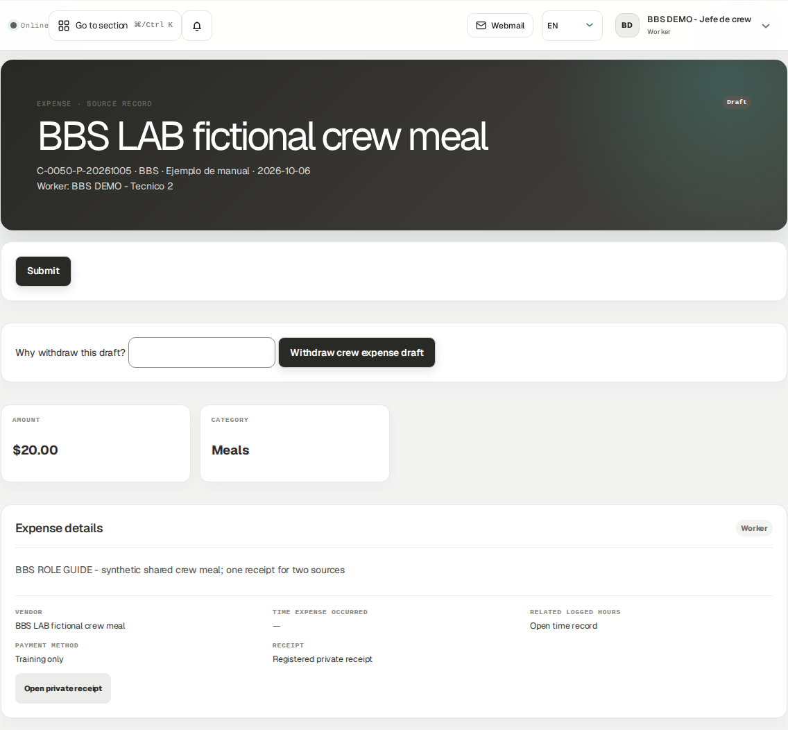

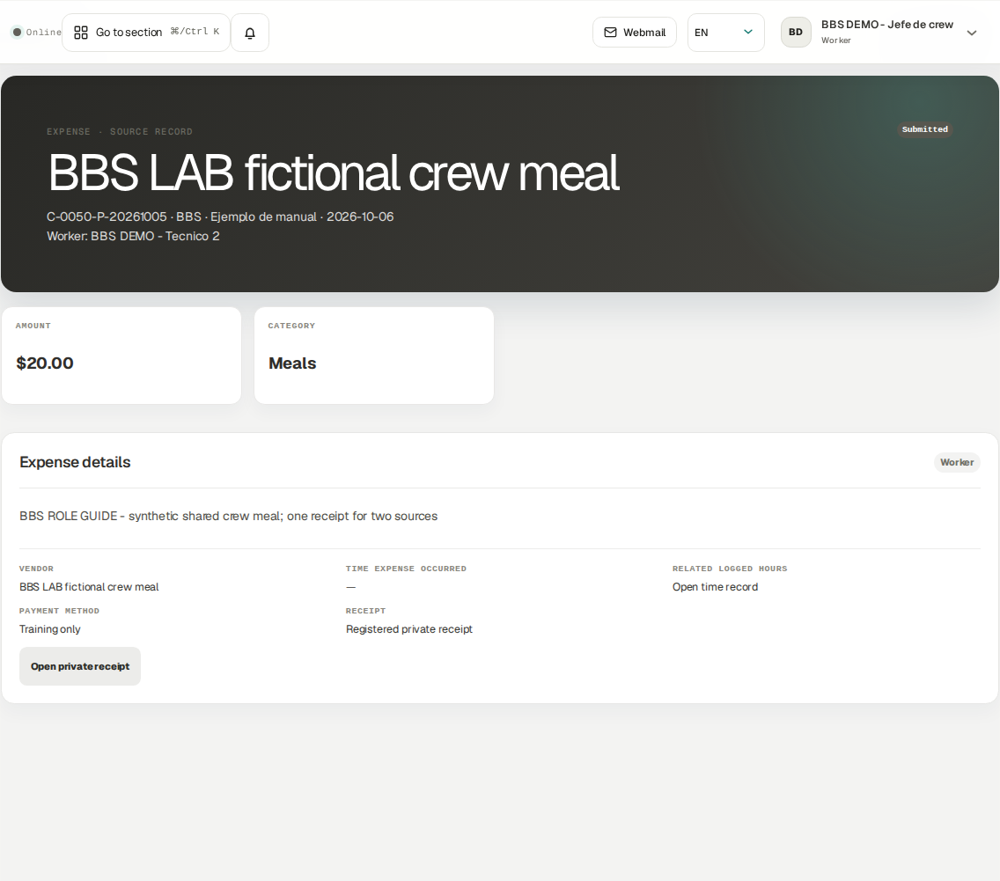

## Split one receipt across worked sources

Go here: Crew hours → Allocate one crew receipt

Context: Isolated BBS role lab · genuine Chief Worker account · dated October 1–31 delegation

Allocation distributes a single purchase across source shifts; it does not multiply the purchase, choose new reimbursement recipients or create invoices. The USD 20 receipt was split 10+10 across the two October 6 crew sources.

The selected set must include at least two valid crew time sources and the expense’s initially related shift. The allocation sum must match the one receipt amount.

### Do the task

1. Select the saved Receipt expense and the related crew time entries.
2. Enter Amount for worker 10 for each of the two selected sources, then Save receipt allocation.
3. Refresh Allocate one crew receipt and inspect the saved split and expense total.

### Verify the result

- One expense USD 20 remains; allocations USD 10+USD 10 sum 20. The originally linked Worker 2 shift is included.

### If you get stuck

- Allocated receipts can lock draft edit actions. Investigate the existing allocation/expense with the reviewer rather than making duplicate expenses or altering hours to force a split.

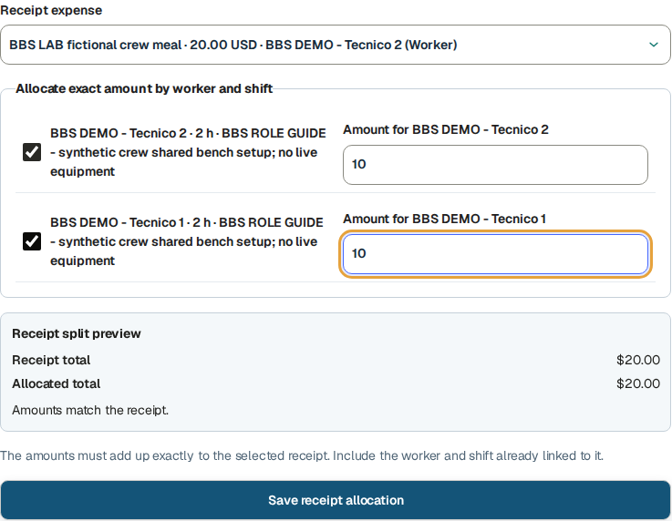

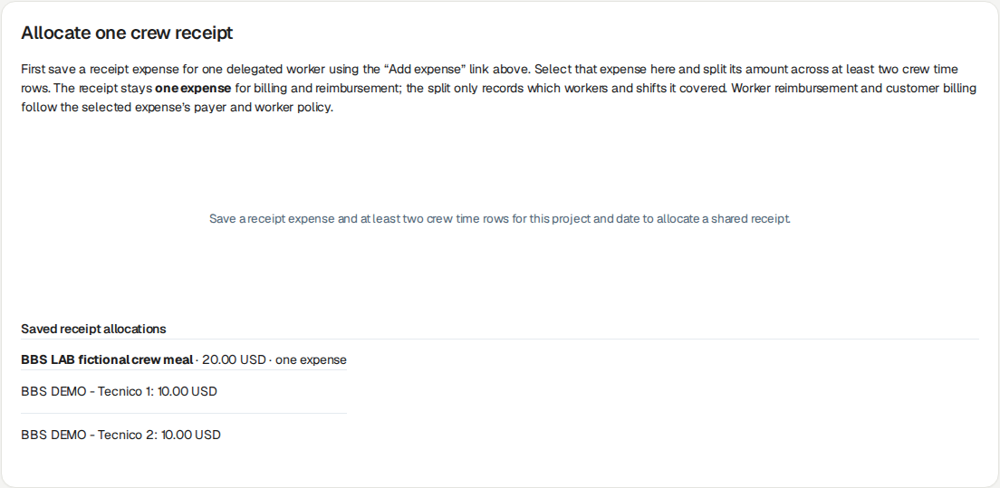

## Hand operational work to the permitted reviewer

Go here: Crew hours → submitted sources; reviewer → Approvals

Context: Isolated BBS role lab · genuine Chief Worker account · dated October 1–31 delegation

The Chief’s delegation permits the exercised recording/correction operations, but this Chief has no review permission. The genuine assigned PM reviewed the sources using its own account. Finance then reviews financial treatment where applicable.

Operational approval, billability, customer invoicing, worker settlement, reimbursement and cash payment are separate stages. A Chief should not assume a submitted row is paid or invoice-ready.

### Do the task

1. Inspect each member’s source state after submission. Send the PM record IDs, work date and any material evidence or safety concern.
2. Read a returned reason on the actual source. Correct through the permitted linked flow; do not silently overwrite history.
3. Hand financial policy/settlement issues to Finance/Owner.

### Verify the result

- Worker 2 corrections and Worker 1 Oct 15 travel are Approved. The two October 6 shared 2 h crew rows remain Submitted in this evidence packet.

### If you get stuck

- If Approvals is denied, ask the Owner who has review permission. Never borrow the reviewer’s account.

## Record and submit your own Chief hours separately

Go here: Time → Log time; Submit this week

Context: Isolated BBS role lab · genuine Chief Worker account · dated October 1–31 delegation

The Chief’s own actual work belongs in its own Worker Time workspace. Crew entries for delegates do not include the Chief’s duration. The exercise saved 0.25 h own handover on October 6.

This ordinary own draft was submitted using the native Submit this week flow. Bulk submission concerns your own selected-week drafts; it is not a universal batch submission of everyone’s crew records.

### Do the task

1. Open Time, choose Log time and record your own project/date/actual hours/activity. Save draft and inspect the row.
2. Open Submit this week, select the week beginning October 5, inspect its one draft and choose Submit all week drafts.
3. Open the source and confirm Submitted; the genuine PM subsequently approved it.

### Verify the result

- One own 15 minute Chief source progressed Draft→Submitted→Approved. Delegated member durations are separate.

### If you get stuck

- Check the own draft count before submitting a week. For linked or financially guarded sources use exact record controls and Finance handoff.

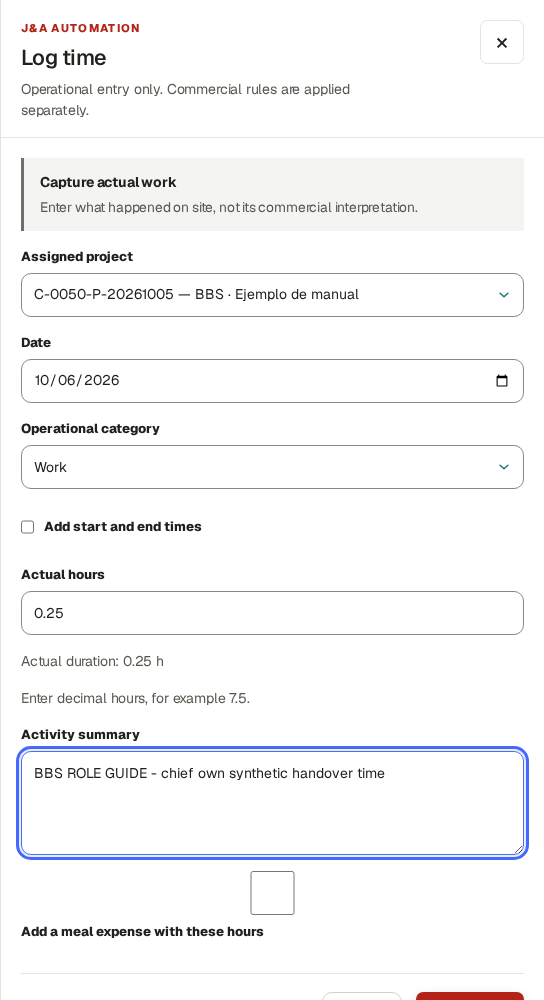

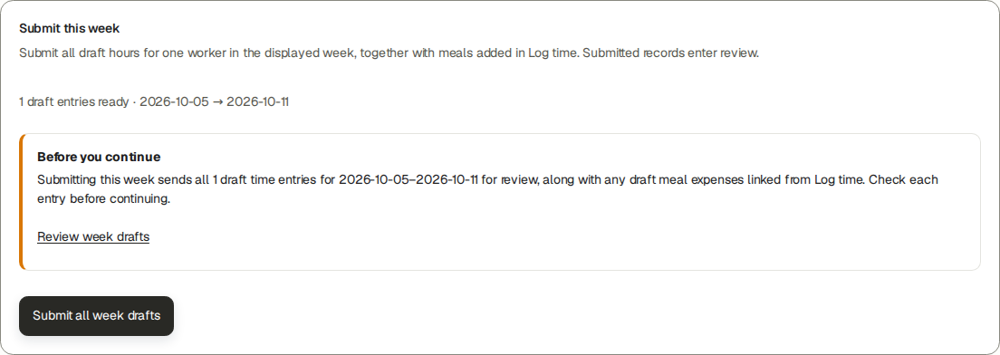

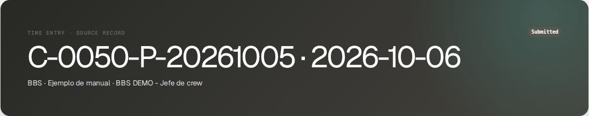

## Reconcile your own weekly target without changing actual work

Go here: Time → Week of → Open week

Context: Isolated BBS planning lab · synthetic October 20, 2026 work · genuine role sessions · no production hours

Expected comes from the effective working schedule and dated project coverage, not from adding published plans or crew sources. In this example, Monday–Friday target 480 minutes each and Saturday/Sunday target zero.

The Chief’s own October 20 row is Actual 8.00h, Expected 8.00h and Difference 0.00h, with Approved status. Technician 1’s personal view is 6/8/−2 and Technician 2’s is 7/8/−1; their weekly comparison rows show Needs note after operational approval.

Needs note flags an approved duration different from the daily expectation. It does not mean the source was returned, and it did not prevent approval. No dedicated Add note or Clear Needs note action was present in the tested controls. Explain differences in the source summary and reports; the comparison can continue to show Needs note.

The weekly total includes scheduled days with no actual records, including future training dates. Check the specific day when reconciling a finished shift. Do not copy a target into fictitious hours or add delegated colleagues’ hours to your own totals.

### Do the task

1. Open your own Time page, enter the week containing the work date and click Open week.
2. Read Actual, Expected, Difference and Status on the day’s row. Difference is actual minus expected.
3. Inspect your source’s own approval state separately. Crew delegation does not entitle you to inspect colleagues’ compensation while checking their operational hours.
4. On a phone, the labelled daily card replaces the wide table. Open day entries locates the actual sources for that date.

### Verify the result

- Your eight-hour source remains eight actual hours even though you also recorded a colleague’s seven-hour source.
- An unknown expectation displays a dash. The application requires unambiguous effective membership/schedule coverage before showing a target.

### If you get stuck

- Ask the Owner to review assignment dates, effective schedule and any ambiguous multiple-project allocation when Expected is missing or incorrect.
- Keep reports operational. Do not include client billing rates, internal costs, margins or colleagues’ compensation in crew handover documents.

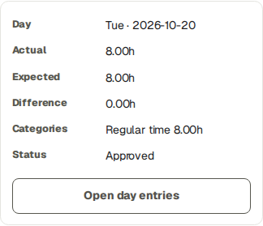

## Write a Chief daily handover report

Go here: Reports → New daily report

Context: Isolated BBS role lab · genuine Chief Worker account · dated October 1–31 delegation

Chief reporting uses the Chief’s own author account. The native own Daily form has no arbitrary-worker selector. Delegated time entry does not imply report author impersonation.

Write factual crew coordination/conditions, with member source IDs when needed. A Daily report does not replace each actual timesheet or prove customer acceptance.

### Do the task

1. Select Project, Work date and Site / shift; fill Shift summary and Tasks completed. Include actual problems/actions, downtime, standby, open items, next day plan and safety flag where applicable.
2. Use Save daily report. Inspect the Draft, then Submit for review.
3. Confirm Submitted and the permitted reviewer’s later state.

### Verify the result

- Chief own fictional crew-handover report was saved, submitted and operationally approved by the genuine PM.

### If you get stuck

- Use draft edits before submission. For later corrections, preserve approved history and follow the offered report correction or reviewer handoff.

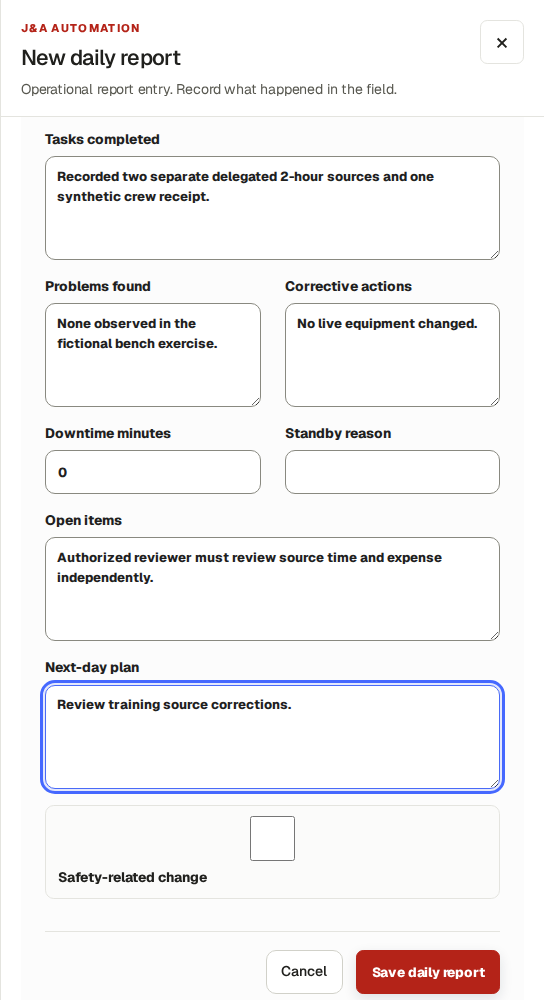

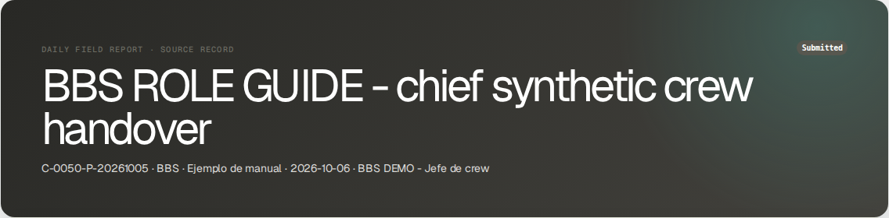

## Document your technical findings and validation

Go here: Reports → New technical report

Context: Isolated BBS role lab · genuine Chief Worker account · dated October 1–31 delegation

The Chief’s Technical report is its own authored evidence, separate from crew hours and customer billing. This worked system is explicitly a fictional bench; no live PLC change occurred.

Capture equipment identifiers, Problem / symptom, Diagnosis / root cause, Change performed, production impact, validation/result, open risk and rollback. Safety/change authorization remains governed by real responsible-person procedures.

### Do the task

1. Open New technical report and identify Project, Work date and System / machine; fill applicable machine/platform/version fields and factual technical narrative.
2. Use Save PLC report, inspect the Draft, then Submit for review.
3. Check review state and hand genuine risks/open work to the responsible PM/technical reviewer.

### Verify the result

- Chief own Technical source progressed Draft→Submitted→Approved through genuine PM review.

### If you get stuck

- Do not use a report submission as permission to modify live equipment or fabricate successful validation. Attachment/PDF generation for this own report was not exercised here.

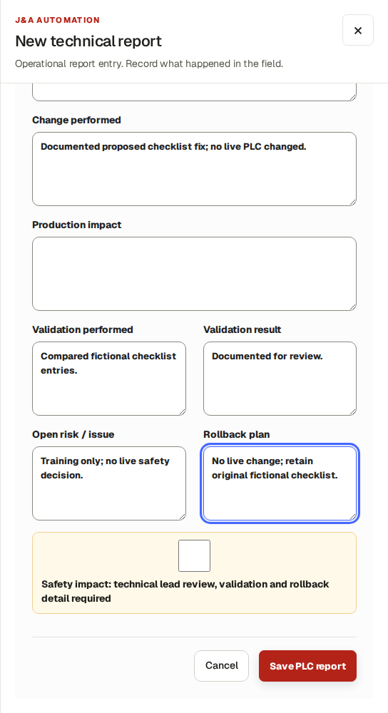

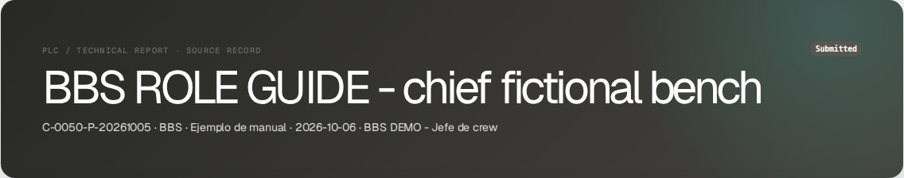

## Read only your own pay and reimbursements

Go here: My Pay → Apply period

Context: Isolated BBS role lab · genuine Chief Worker account · dated October 1–31 delegation

The Chief sees its own compensation, not crew members’ agreements/payments. The historical October 1–4 snapshot shows 10 actual hours, USD 400 approved compensation and USD 20 approved reimbursement; copied training payment records have no claim to a real bank transfer.

Customer daily/weekly/hourly units and invoice cadence do not dictate worker settlement or payment cadence. Expected date, reviewed amount, paid and remaining are different fields. Source estimates follow dated worker rules, not crew receipt allocations.

### Do the task

1. Select your intended From / Through dates and Apply period.
2. Read approved/pending estimates separately, then the reviewed settlement’s own period, planned date and paid/remaining values.
3. Use Worker statement generation only for your own account and wait for ready artifacts before downloading.

### Verify the result

- Crew hour delegation does not expose Worker 1/2 private pay. A split receipt does not create compensation or prove reimbursement.

### If you get stuck

- Send missing-rule/settlement/reimbursement questions to Finance with your own source/period. Do not infer another person’s pay from recorded hours.

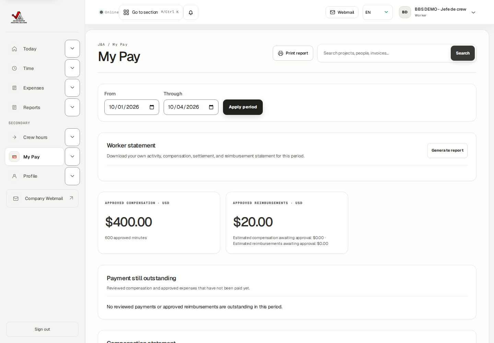

## Operate crew controls on a phone or tablet

Go here: Crew hours → Project / Work date

Context: Isolated BBS role lab · genuine Chief Worker account · dated October 1–31 delegation

Phone/tablet views preserve the same dated delegation checks. Use More or the navigation drawer for destinations outside the bottom bar. Intentional internal table scrolling is different from page-level overflow.

### Do the task

1. Choose Project and Work date before selecting members. On narrow screens review the chosen names and individual durations carefully.
2. Scroll to the saved crew rows or allocation section after saving; verify the result before repeating an action.

### Verify the result

- Crew views were checked at 1440, 768 and 390 pixels with no page-level horizontal overflow.

### If you get stuck

- If a control is clipped, report the width and precise action with a safe screenshot. Do not re-save the same batch to compensate for a hidden result.

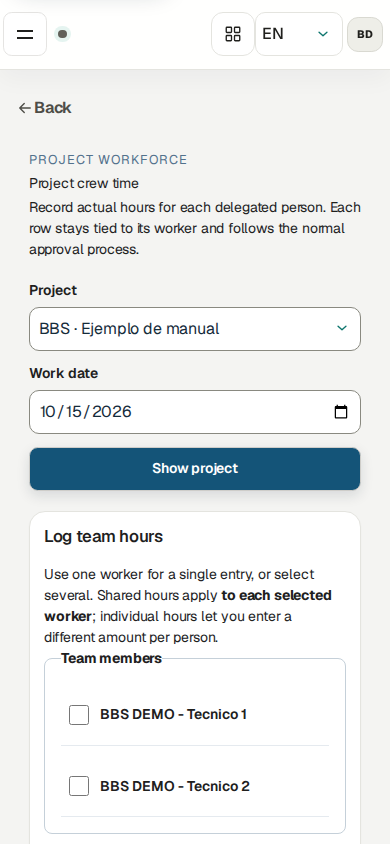

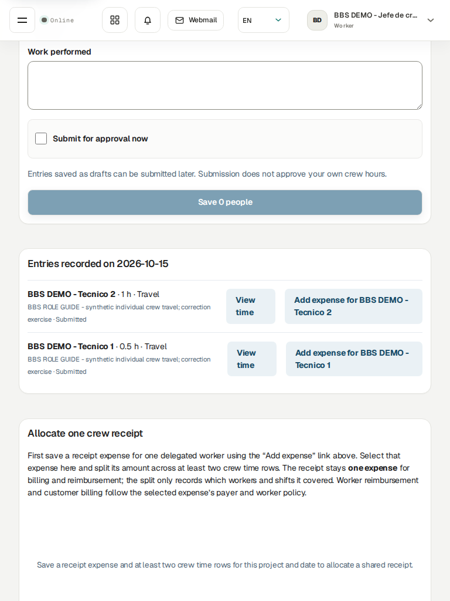

## Manage your own profile and ask for support

Go here: Profile; Notifications; Help

Context: Reference procedure · current controls/source checked; mutations not exercised in this role lab

Profile expertise and availability affect planning, not delegation/review permission or actual hours. Security belongs to your individual account: passkey Device name/Register passkey and authenticator setup/recovery should be kept private. These changes were not performed in the Chief lab.

Notifications can lead to returned sources or pending work; marking read does not approve them. Help’s verified contact is admin@j-aautomation.com. Live portal/webmail links are live services. No support message was sent.

### Do the task

1. Maintain genuine own expertise/availability using offered Profile controls. Ask the Owner for crew delegation, account status or review permission changes.
2. Follow a notification to its current record and inspect state before acting.
3. Send support the environment, role, project/record ID, date, intended action and exact message. Exclude credentials/private pay.

### Verify the result

- Chief GET Finance and Approvals returned 403. Delegation is not financial or approval authority.

### If you get stuck

- If a crew member disappears, check selected date and Owner-grant coverage. If a source is settlement locked, hand it to Finance; do not substitute credentials or duplicate history.

## Verify the crew handover

Go here: Crew hours → Reports → own Time → reviewer handoff

Context: Isolated BBS role lab · genuine Chief Worker account · dated October 1–31 delegation

Use a single handover list for the selected workday; crew recording, your own work and financial review remain separate.

### Do the task

1. Confirm environment/account/project/date and delegated member coverage.
2. Save each member’s actual duration/category once; inspect shared per person versus individual amounts.
3. Record each purchase once; allocate one shared receipt only across valid linked shifts and verify the sum.
4. Submit intended crew rows and your own Time/report drafts.
5. Read review returns and create linked corrections where allowed. Send settlement guards to Finance.
6. Confirm current member states and own report states; tell PM which sources remain Submitted/open and which risks remain unresolved.

### Verify the result

- Lab passes: shared/individual native crew entry, separate Submitted sources, single receipt 20 allocation 10+10, delegated correction 1→0.75 PM Approved, own weekly time Submit and own Daily/Technical PM Approved, denied Approvals/Finance and responsive views.

### If you get stuck

- Reference-only: delegation/account setup, review-enabled Chief actions, draft withdrawal, report attachment/PDF/customer acceptance, own security/profile mutations, bank/email delivery and actual payroll. The illustrated Chief had no review permission.

## What was verified and what remains a reference

Go here: Verification appendix

Context: Isolated BBS role lab · actual browser outcomes and explicit limits

Native authenticated browser records, synthetic receipt fixtures and SHA-256 capture manifests are maintained with the guide. Account secrets are excluded. Original billed October 2–5 history and finalized worker settlements were preserved.

Actual saved/submitted/returned/approved states are distinguished from controls merely inspected. The Owner/PM/Finance handoffs used their own genuine role sessions. This evidence does not claim real bank transfers, live equipment changes or production transactions.

### Do the task

1. Chief used an ordinary Worker account with dated October 1–31 grants for Worker 1/2.
2. Shared two-hour-per-person entries saved as separate drafts and submitted; both remain awaiting operational review.
3. Different 0.5-hour/1-hour Travel entries saved and submitted; PM approved the first and returned the second.
4. Delegated 1-hour source corrected to 0.75 hour through a linked replacement, submitted and PM approved.
5. One USD 20 receipt allocated 10+10 across two crew sources, submitted and PM approved.
6. Chief own Daily and Technical reports saved, submitted and PM approved.
7. Chief own 0.25-hour source saved, submitted through its own weekly flow and PM approved.
8. Own My Pay historical training snapshot inspected; no crew private compensation exposed.
9. Approvals and Finance denied; desktop/tablet/phone Crew pages fit their viewports.
10. Additional connected planning lab: original Chief and both technicians received individual eight-hour October 20 plans. Technician 1 authored six actual hours, Chief authored seven delegated hours for Technician 2 and eight personal hours; all three were independently PM approved, with exactly one source each.
11. Additional expected-hours comparison: Chief’s own weekly day showed 8/8/0 Approved; technicians’ own views showed 6/8/−2 and 7/8/−1 Needs note while underlying sources remained Approved. Dated crew recorder attribution and individual totals were confirmed.
12. Additional native role/privacy tests: Worker Finance and Chief Approvals returned expected 403; no client prices, internal costing, margins or colleagues’ compensation appeared in the new operational captures.

### Verify the result

- See the adjacent task checklist and role capture manifest for source IDs, screen widths, artifact integrity and expected permission denials.

### If you get stuck

- Reference-only or unperformed here: Account/delegation changes; Review-enabled Chief approval actions; Draft withdrawal; Report attachment/PDF/customer acceptance; Profile/security changes; Actual bank/email delivery.
