# External Technician · BBS field operations

Authorized own work, expenses, reports, corrections and supplier operational evidence

## Before practising · live and training access

The company portal https://j-aautomation.com/j-aautomation/app is LIVE. A link to it never enters a simulation. For practice obtain a separately provisioned training URL, your own account, the permitted fictional project and dates, a visible environment identifier and the trainer’s reset procedure. Without those, use this guide as a read-only demonstration and enter only authorized genuine work.

Original BBS examples include historical live-deployment records. Later training exercises used isolated copies. Each chapter identifies its dataset and checkpoint. Follow the dates and saved states shown for that exercise.

A role, project membership, review permission, supplier authorization and dated crew delegation are separate. Use your own credentials and follow the tasks assigned to your role. Check the selected project and person before recording work.

### Verify the result

- Confirm your displayed identity, the environment, project number and work dates before saving. For training/reset or lost access contact admin@j-aautomation.com; send the route, role, project/record reference, time and visible error. Keep passwords, activation links, recovery codes and cookies private.

### If you get stuck

- For an empty project selector, ask the Owner to check account status and assignment/authorization coverage. Do not create a duplicate project or borrow another account.

## Access · activate the invitation and sign in

Go here: Your trusted invitation → Activate your account → Return to sign in → Profile

### Do the task

1. Check the portal address and named account against the invitation provided by the Owner. There is no public sign-up. For an already provisioned account, use the sign-in method supplied to you; do not attempt to activate someone else’s invitation.
2. For a single-use activation link, open Activate your account. Enter Full name and choose a Password of at least 12 characters, then Activate account. Wait for Account activated. You can sign in now. Do not repeatedly submit while Activating… is displayed.
3. Choose Return to sign in. Enter your account Email and Password and select Continue to workspace. If you previously enabled MFA, complete Verify your identity with the current Six-digit code and Verify and continue. Use a recovery code only through the offered Use a recovery code control.
4. Open Profile and verify the own-account name/email/role in Account security. Check the navigation and assigned project. A newly activated account can have zero assignments; activation alone does not grant project access or supplier/chief authority.

### Verify the result

- The activation success message precedes the separate sign-in. Verify your own Profile and assigned projects after signing in.

### If you get stuck

- An expired or already used link displays This invitation could not be activated. It may have expired or already been used. If activation already succeeded, return to sign in. Otherwise request a new invitation from the Owner; reloading does not renew the old link.
- For offline, temporarily unavailable or rate-limited activation, retain the entered name/password privately, restore connectivity or wait for the displayed retry interval, then retry. An unconfirmed response is not proof of an active account.
- For an incorrect password, inactive account or lost access, contact admin@j-aautomation.com from your verified account/contact channel. Supply identity and the visible error; never send the password. This guide does not promise a public password-reset form. The initial Owner is provisioned by the platform operator; an existing Owner provisions the remaining team.

## Practice setup · your account and starting records

Obtain your own training account, isolated environment, authorized project and lesson dates from the trainer. Confirm the named starting records and expected result before saving. Ask the trainer to restore the checkpoint when needed.

| Checkpoint | Required starting condition |
| --- | --- |
| Identity and environment | Own correctly provisioned role/profile; isolated URL and visible environment identity. |
| Project and dates | Exact project number, timezone and unused eligible lesson dates; membership and relevant grants cover both current access and the work date. |
| Source state | Named source IDs and durations/amounts; ordinary starting drafts/submissions; no unrelated correction already open. |
| Expected outcome | Expected saved state, source count, actual total and permitted output; named receiving reviewer where needed. |

### Verify the result

- Confirm that the visible starting records match this lesson. If they differ or an action is unavailable, stop and ask the trainer for the correct checkpoint.

## Review authority · who receives each source

Review is determined by the source, base role and current dated grants. Chief delegation grants recording, not approval. A Worker with Can review checked does not become a Project Manager. Send a factual reason with every requested correction.

| Source / recorder | Operational reviewer and prerequisite | Next handoff |
| --- | --- | --- |
| Internal own or chief-delegated time | Owner or Finance; assigned PM with current active Can review membership for this project. | Submit the checked work to the authorized reviewer and verify the resulting state. |
| External/supplier time, including coordinator own time | Authorized Owner. Supplier authorization/recorder provenance keeps these sources outside the ordinary PM time queue. | Verify the resulting review state. |
| Own/delegated expenses | Owner or Finance; assigned PM with current project review grant. Check factual purchase, payer and evidence. | Verify the expense review state. Direct reimbursement questions to the Owner. |
| Daily and Technical reports, including supplier profiles | Owner or Finance; assigned PM with current project review grant and permitted project scope. | Owner/Finance prepares the customer period report and version-bound acceptance where required. |
| PM’s own work | Route it to another authorized reviewer for an independent factual check. Do not infer a universal self-review prohibition solely from a job title. | Use the appropriate personal output and verify the review state. |

### If you get stuck

- If the intended source is absent, check source type, state, dates, assignment/review grant and supplier authorization before searching another queue. A review-enabled Worker Chief variant is not exposed by the current role model; Owner must provision the genuinely permitted reviewer role and grant. Never use a colleague’s credentials to bypass this boundary.

## Start with authorized supplier access

Go here: Sign in → Time

Context: Isolated BBS supplier role lab · genuine External Technician account · fictional October 2026 records

Use the individual External Technician account created or invited by the Owner. There is no public sign-up. Account activity, supplier association, supplier project authorization and your project assignment must all cover the work date. A supplier coordinator is a different role and may record team work; that does not let you see another technician’s sources.

This course uses BBS ROLE LAB External Technician in the isolated C-0050-P-20261005 · BBS · Ejemplo de manual project. New work is fictional, outside the original billed October 2–5 history. The supplier authorization covers October 5–31. No live dispatch, purchase, equipment change or bank transfer occurred.

Before practising obtain an operator-provided training URL, own account, visible environment identifier, permitted scope and reset instructions. No shared training credentials are supplied. Live company portal or webmail links open live services, never this isolated demonstration.

### Do the task

1. Sign in with your own account and verify environment, account and language.
2. Use Time for your own hours, Expenses for your own operational purchases, Reports for your own Daily/Technical facts and Operational report for your allowed activity summary.
3. Use Profile and Help for own workforce/security settings and guidance.

### Verify the result

- Your assigned BBS project is available. Use the operational workspaces shown in your own navigation.

### If you get stuck

- Ask the Owner/coordinator to investigate account, supplier authorization or assignment dates when the intended project is absent. Do not borrow an account or create duplicate work.

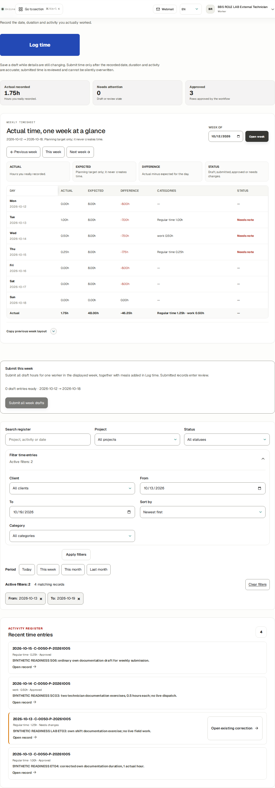

## First shift: save actual time, then submit

Go here: Time → Log time

Context: Native isolated BBS role exercise · C-0050-P-20261005 · synthetic October 2026 work only

Begin with your own assigned project and actual work. Published plans and expected hours are planning information; neither creates time. The October 13 example records fictional documentation work, not a real dispatch.

A draft remains editable. Submit only after checking project, work date, duration and activity. Submission sends supplier time to Owner review and locks ordinary editing. See Review authority · who receives each source (review-authority) and Recovery · correct a source or request help (recovery-matrix).

### Do the task

1. Open Time and choose Log time. Select BBS, Work date 2026-10-13, Category Regular time, Duration in hours 1.25 and a precise synthetic activity summary.
2. Check any site, shift or break fields against the actual work. Choose Save draft and wait for the saved result; a Saving label is a transient state.
3. Open the saved source, confirm 1.25 h and Draft, then choose Submit. Verify Submitted on that source.

### Verify the result

- Native Save draft and Submit succeeded. Original source 01a11176-38c3-713d-92a2-e4f5ab3d9240 was later returned for correction; its current state is Needs changes.

### If you get stuck

- If save fails, correct the visible validation error and verify whether a source was created before retrying. Never create a duplicate to replace a submitted source.

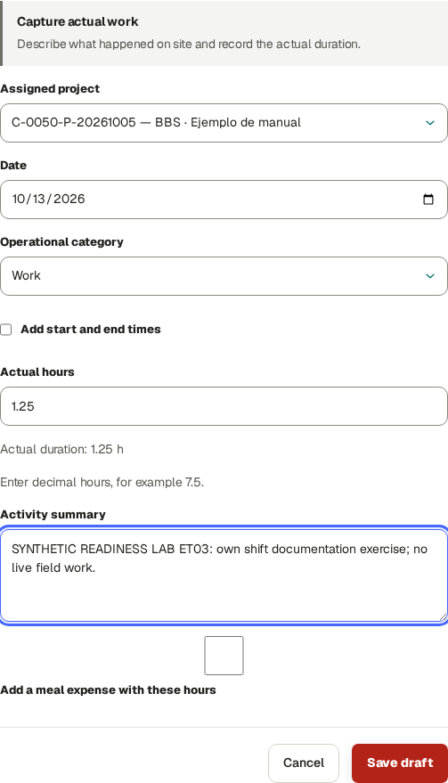

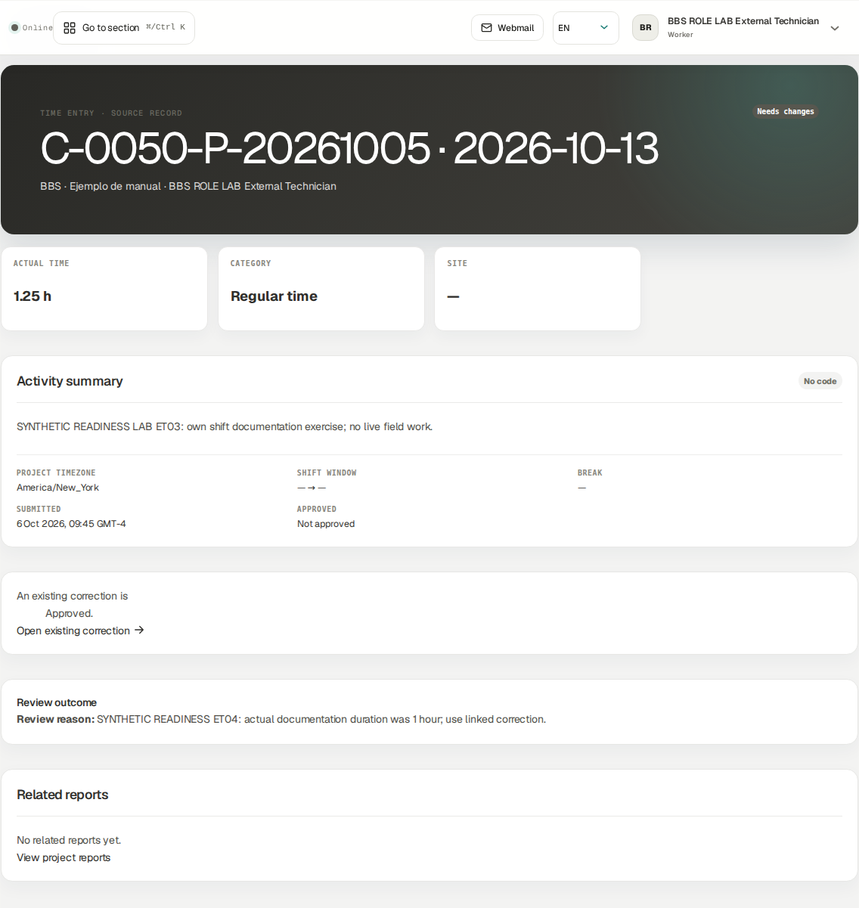

## Correct returned time and verify Owner approval

Go here: Time → returned source → Create corrected draft

Context: Native isolated BBS role exercise · C-0050-P-20261005 · synthetic October 2026 work only

Needs changes preserves the submitted source and reviewer reason. A correction creates a linked replacement; it does not silently overwrite approved or submitted history.

The October 13 original records 1.25 h. Owner requested one actual hour; the replacement records 1 h. The original remains Needs changes and the replacement is Approved.

### Do the task

1. Open the returned source and read the reason. Choose Create corrected draft.
2. Confirm date, category and actual duration; write the corrected activity and Reason for correction. Choose Create correction draft.
3. Check the linked draft and original link. Submit individually or include the eligible draft in Submit this week. After Owner review, reopen the replacement and verify Approved and its approved timestamp.

### Verify the result

- Correction 01a1117a-6cef-7576-900b-329b43e9ecb0 is Approved; the saved linked original remains visible. The isolated audit also verified Owner as the recorded approver. The source screen shows the approval timestamp, rather than a reviewer-name field.

### If you get stuck

- If a reason remains unclear, ask the Owner/coordinator before submitting. An explanation does not itself change review state.

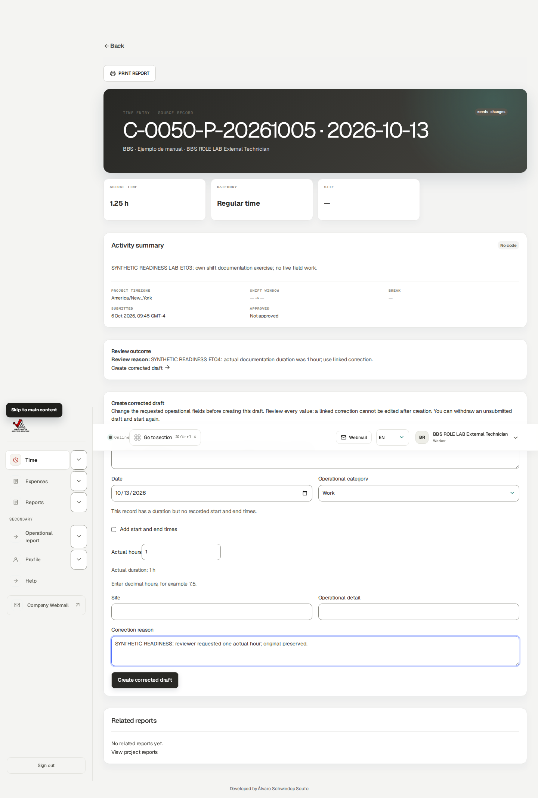

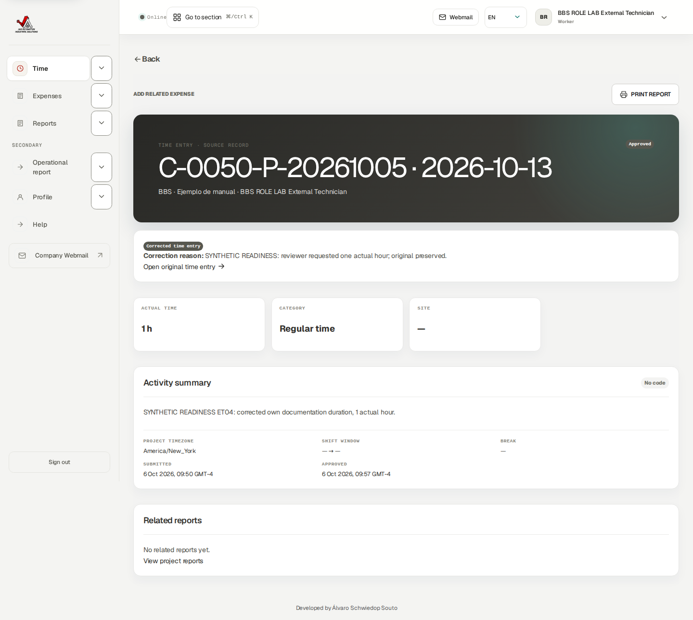

## Review a week and submit eligible drafts

Go here: Time → Weekly timesheet

Context: Native isolated BBS role exercise · C-0050-P-20261005 · synthetic October 2026 work only

Actual is saved work. Expected is a planning target. Difference is actual minus expected. Needs note can remain on approved days whose actual hours differ from the target: October 13 shows actual 1 h, expected 8 h and difference −7 h.

There is no weekly control that promises to clear Needs note. Record a truthful explanation in the source activity or correction reason where appropriate; that text may not remove the calculated indicator.

Copy previous week layout prepares draft structure; it never proves that copied work occurred. This copy action was source-checked, not executed in this exercise.

### Do the task

1. Open week 2026-10-12 and inspect dates, actual, expected, difference and source states.
2. Before Submit this week, identify every eligible draft and its actual work. The native October 12–18 exercise included ordinary draft 01a1117a-ab69-72fe-9fe3-d618ef3ac078 and linked correction draft 01a1117a-6cef-7576-900b-329b43e9ecb0, both version 1.
3. Choose Submit this week. Verify success and reopen both sources: each became Submitted. Owner subsequently approved both. The returned original stayed Needs changes and an already approved October 14 row was excluded.

### Verify the result

- Native eligibility count was 2 and both exact source IDs changed state successfully; count alone was not treated as proof.

### If you get stuck

- Do not manufacture eight hours to match Expected. Resolve actual source errors with a linked correction; explain a genuine short day truthfully.

## Record an own purchase with its private receipt

Go here: Expenses → Record expense

Context: Isolated BBS supplier role lab · genuine External Technician account · fictional October 2026 records

The worked expense is explicitly synthetic USD 8 tools/consumables on October 7, Worker payer. The receipt states no real purchase or payment. Record your actual purchase facts accurately; reimbursement is a later separate step.

The actual form accepts JPG/PNG/HEIC/PDF receipt evidence up to 10 MB. Preserve the original currency and payer. A registered upload is not a universal assertion that an antivirus scan completed.

### Do the task

1. Choose Record expense. Attach Receipt image or PDF; select Project, Date and Category. Enter Vendor, Amount 8, Currency USD, Who paid Worker and factual Description; fill applicable time/related-hours/payment context.
2. Use Save draft and open the saved expense. Check the registered receipt and purchase fields.
3. Use Submit. Genuine PM operationally approved this expense. Open private receipt now succeeds through your own authorized account.

### Verify the result

- One USD 8 expense and one receipt exist. No reimbursement payment is claimed for this External exercise.

### If you get stuck

- If receipt access or scan processing fails, report the document/expense ID and exact status. Do not create another expense while checking the first. Reviewed expense corrections follow the current permitted correction/handoff process.

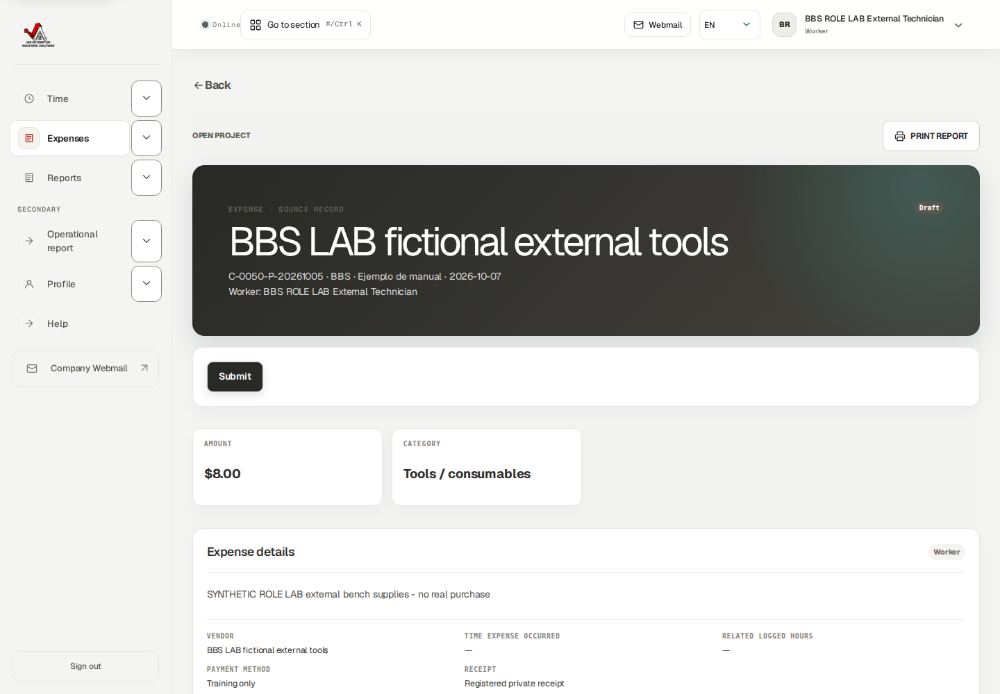

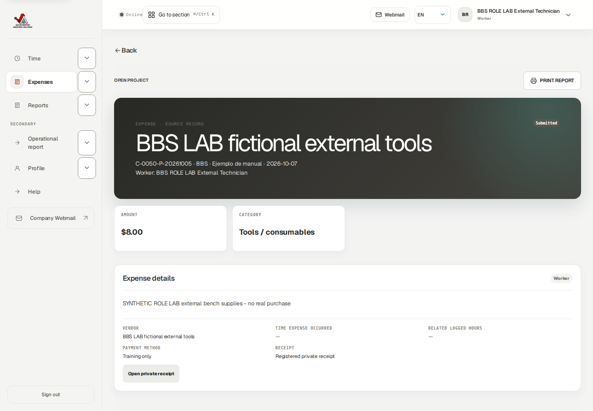

## Write and submit your own daily field report

Go here: Reports → New daily report

Context: Isolated BBS supplier role lab · genuine External Technician account · fictional October 2026 records

Daily reports record operational facts, not timesheet hours, supplier payment or customer acceptance. This report’s author is the genuine External Technician account. Its fictional summary says no live equipment.

Fields include Project, Work date, Site / shift, Shift summary, Tasks completed, Problems found, Corrective actions, Downtime minutes, Standby reason, Open items, Next day plan and safety impact. Include genuine problems and next steps; do not invent a successful outcome.

### Do the task

1. Choose New daily report and fill the actual work date/project and factual summary/tasks. Fill relevant operational exceptions and next steps.
2. Use Save daily report. Open the Draft and inspect saved contents. Autosaving or saving edits does not submit.
3. Use Submit for review. Confirm Submitted and the permitted reviewer’s later state.

### Verify the result

- Own Daily progressed Draft→Submitted→Approved through genuine PM review. It did not add hours or record a customer signature.

### If you get stuck

- Edit only through offered unsent-draft controls. For returned/approved content, preserve history and use a supported correction or reviewer handoff.

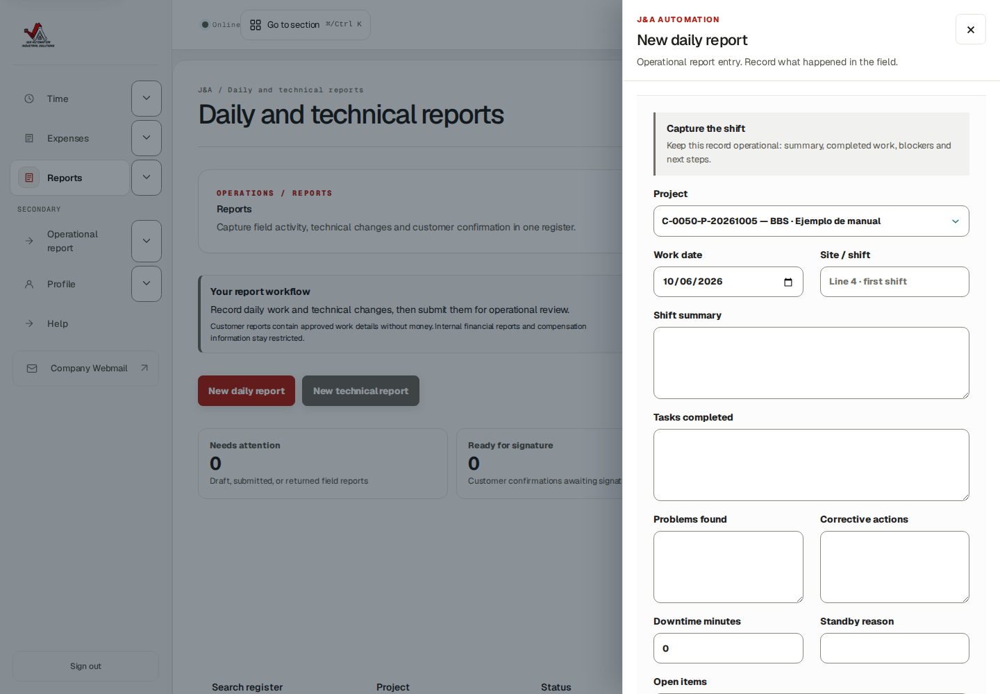

## Save technical facts and private evidence before submission

Go here: Reports → New report → Technical / PLC

Context: Native isolated BBS role exercise · C-0050-P-20261005 · synthetic October 2026 work only

Record system identity, observed issue, diagnosis, change, validation result, production impact, open risks and rollback. The October 19 example is an offline synthetic documentation bench; it claims no live PLC change.

Private evidence is a separate saved attachment. Scan status describes processing; Storage Saved and Scan Not scanned do not mean a clean security scan.

### Do the task

1. Choose Technical / PLC, your BBS project and Report date 2026-10-19. Complete the technical fields and choose Save PLC report.
2. In private evidence select Evidence type Technical attachment, choose File and enter Notes explaining the evidence and scope. Choose Upload private evidence.
3. Before Submit verify the listed filename, attachment version, size, hash, Storage Saved and scan status. In this exercise upload preceded submission.
4. Submit the saved report. Reopen the exact source after PM review and check Approved, work author, report creator, reviewer and source version.

### Verify the result

- Native report 01a11186-932c-7459-84fb-791179b96c66 reached Approved v3. Its attachment was registered at v2 before Submit. Evidence types available in this Technical form also include PLC backup · before and PLC backup · after.

### If you get stuck

- If an upload fails, verify whether metadata exists before retrying. Keep backups and customer evidence private; never infer scan success from an upload success.

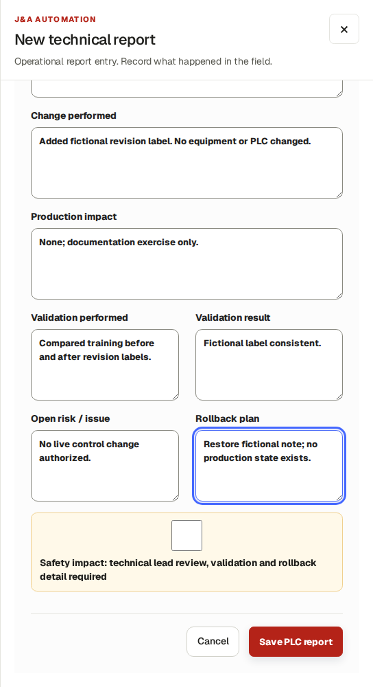

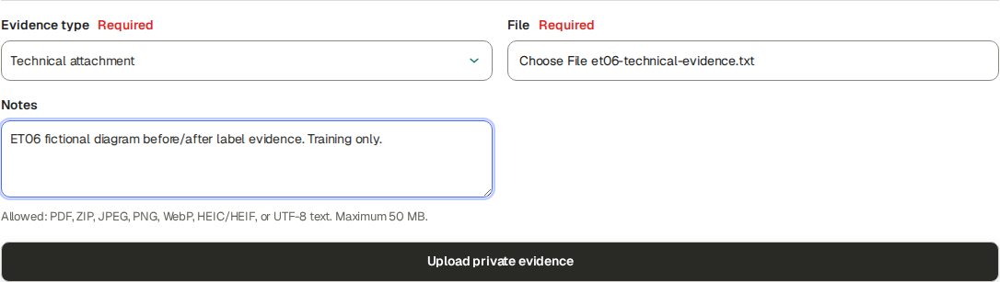

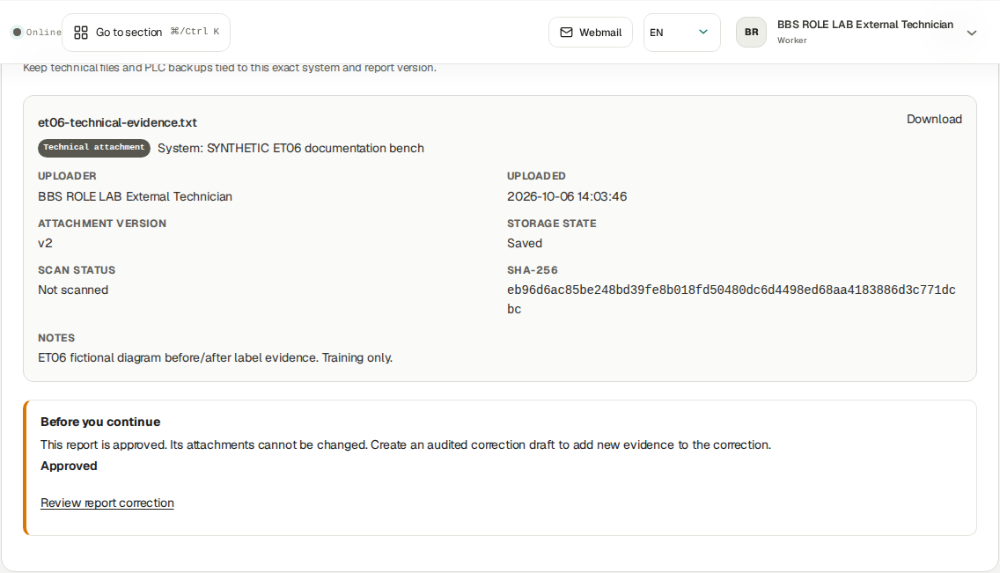

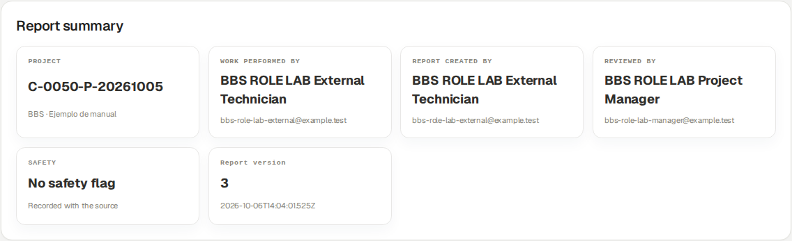

## Generate, check and download the saved report version

Go here: Own Daily / Technical source → PDF

Context: Native isolated BBS role exercise · C-0050-P-20261005 · synthetic October 2026 work only

The native preview reflects saved source data. A generated PDF is tied to source version and language; it does not approve the source or certify customer acceptance.

### Do the task

1. Open your saved report and inspect its native preview. Select English, Spanish or Portuguese, then choose Generate report.
2. Queued means the artifact is being prepared. Use Refresh until the exact version/language becomes Ready; do not treat Queued as downloadable completion.
3. Choose Download on the Ready variant. Check project, report date, author, version, language and technical facts against the source.

### Verify the result

- October 19 Technical source v3 was generated in English, became Ready and was downloaded natively as Technical-report-C-0050-P-20261005-2026-10-19-SYNTHETIC-ET06-documentation-bench-v3-en-US.pdf.

### If you get stuck

- If a PDF is stale after a source change, generate the new saved version and compare its identity. Preserve prior version history.

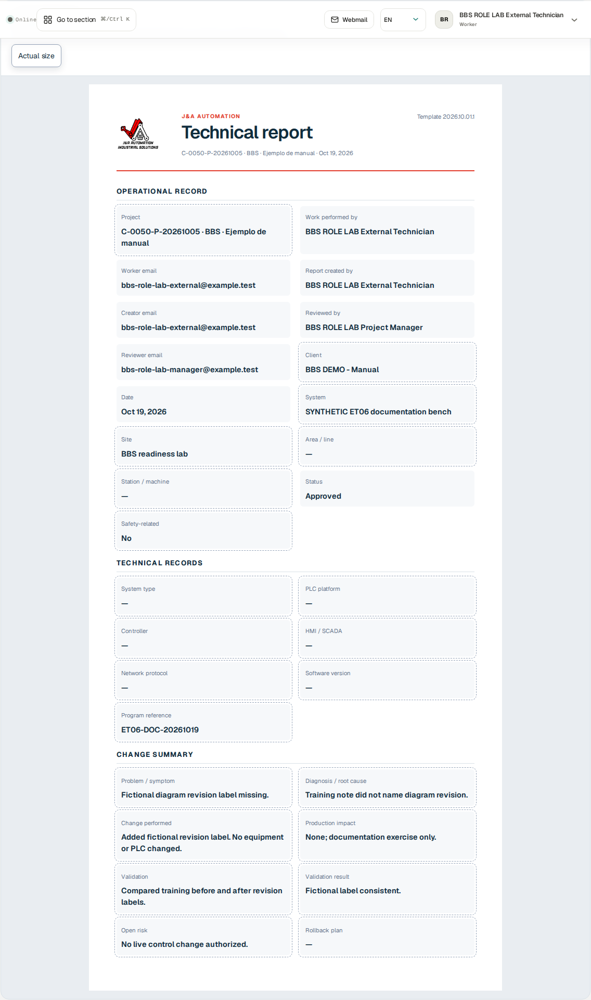

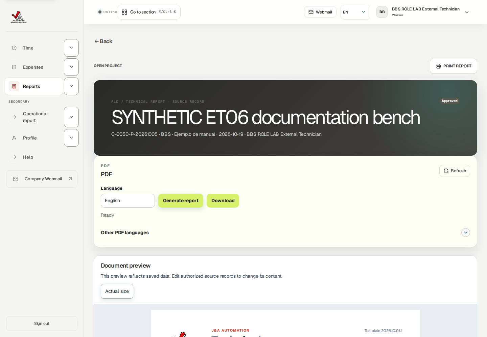

## Reconcile an exact period with its native CSV

Go here: Operational report → date filters → Download CSV

Context: Native isolated BBS role exercise · C-0050-P-20261005 · synthetic October 2026 work only

The earlier 2.75 h total is a historical October 6–7 checkpoint, not the current full-month total. Later October records were added. Use exact dates to reproduce it.

The final October 6–7 export contains two Approved rows: 120 minutes on October 6, source 01a10e4b-c33e-7033-a065-d3980b92c94d, and the 45-minute October 7 correction 01a10e53-31a7-7509-86a4-7a134a731e6c. Total 165 minutes = 2.75 h. The returned 60-minute original is not counted as approved work.

### Do the task

1. Open Operational report, select BBS and filter From 2026-10-06 to To 2026-10-07.
2. Check technician, dates, duration, State and Recorded by. Choose Download CSV and compare the two exported rows with the filtered screen.
3. For later work choose a new date range and describe its actual total; never carry the historical 2.75 h forward.

### Verify the result

- Native final CSV external-final-oct06-07.csv has two Approved rows and nine operational columns.

### If you get stuck

- If screen and CSV differ, check filters and source states before escalating. Keep both the historical checkpoint and later export identity.

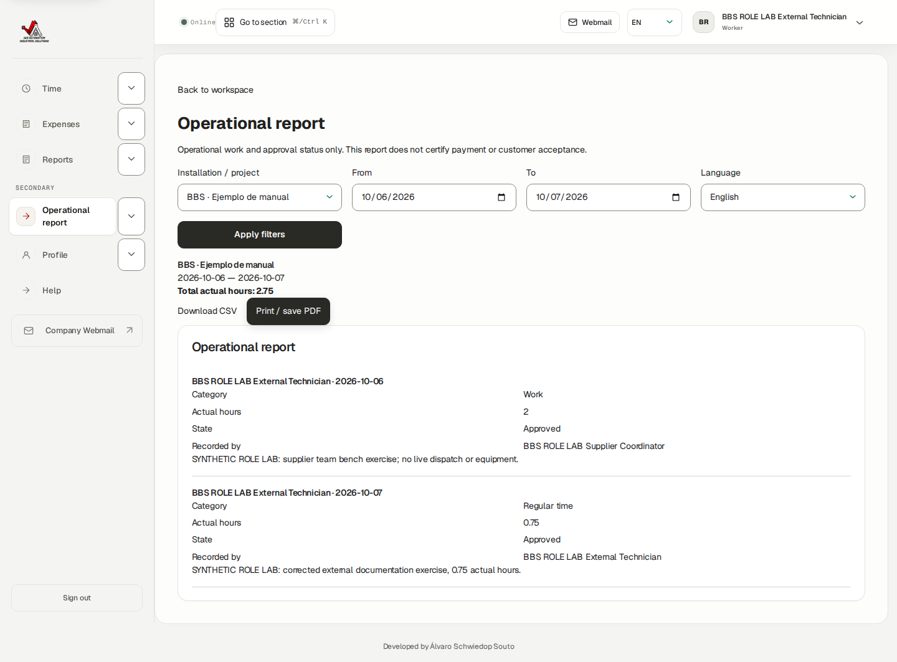

## Use narrow screens and check saved results

Go here: Time; Expenses; Reports; Operational report

Context: Isolated BBS supplier role lab · genuine External Technician account · fictional October 2026 records

Use role navigation and narrow-screen menu controls. Review account/project/date/member fields carefully before saving. A table’s internal horizontal-scroll hint is different from page-level overflow.

### Do the task

1. On a phone open the required workspace through navigation and apply the intended scope.
2. After saving or submitting, reopen the existing source to verify its result rather than repeating the action.

### Verify the result

- Operational report checked at 390 and 768 pixels: page width of the scrollable page matches viewport width; native two-source report retained. Desktop 1440 was also inspected.

### If you get stuck

- Report clipped controls with a safe screenshot, width, environment and exact action. Never save duplicate records to compensate for a hidden result.

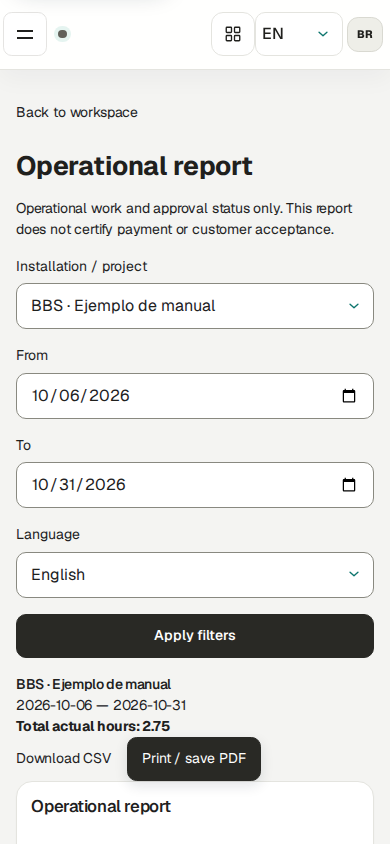

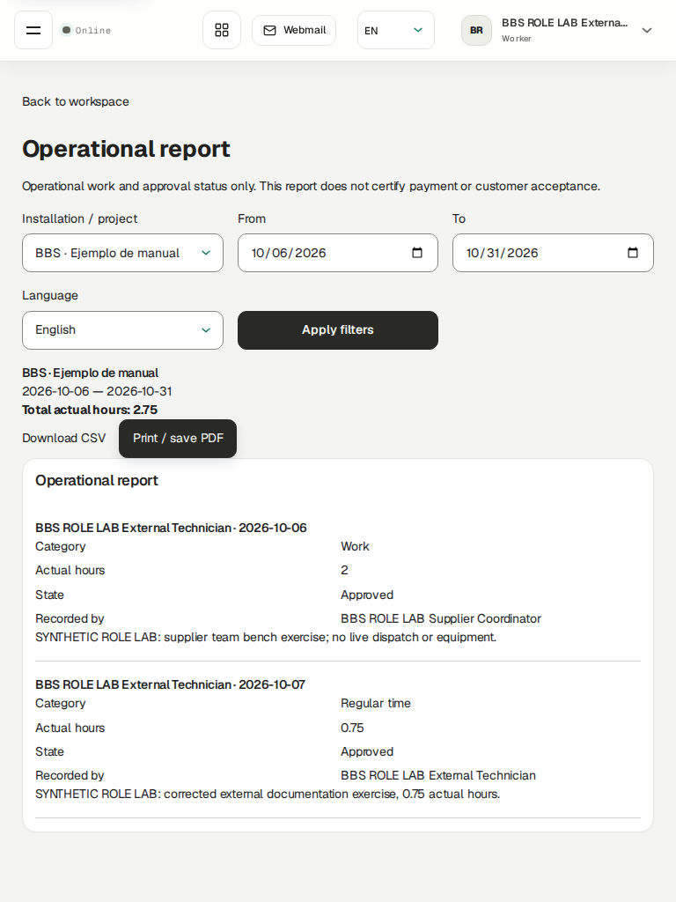

## Maintain your workforce profile and individual security

Go here: Profile → Expertise and availability; Account security

Context: Reference procedure · current own-role controls/source checked; mutations not exercised

Expertise and availability are planning inputs, distinct from supplier authorization/project assignment. The own profile was inspected natively; no security or profile mutations occurred here. A generic workforce-profile Worker label does not change the supplier access profile.

Add expertise offers expertise/proficiency. Add availability opens dated UTC availability windows. Passkey registration uses Device name and Register passkey. Authenticator setup/recovery material is sensitive; never include it in report evidence.

For invitation and sign-in use Access · activate the invitation and sign in (access). For MFA, devices and recovery use Security · verify your own device and recovery options (security).

### Do the task

1. Check your own expertise and UTC calendar. Use offered own-profile controls only for genuine information.
2. For an authorized account-security change use your own device/authenticator prompts and verify completion before signing out. Store recovery codes in an approved password manager.

### Verify the result

- Skills/availability do not grant review or supplier-administration permission. Security success is not claimed from read-only controls.

### If you get stuck

- Ask the Owner/coordinator for authorization/assignment changes and Owner/support for access recovery. Do not share credentials.

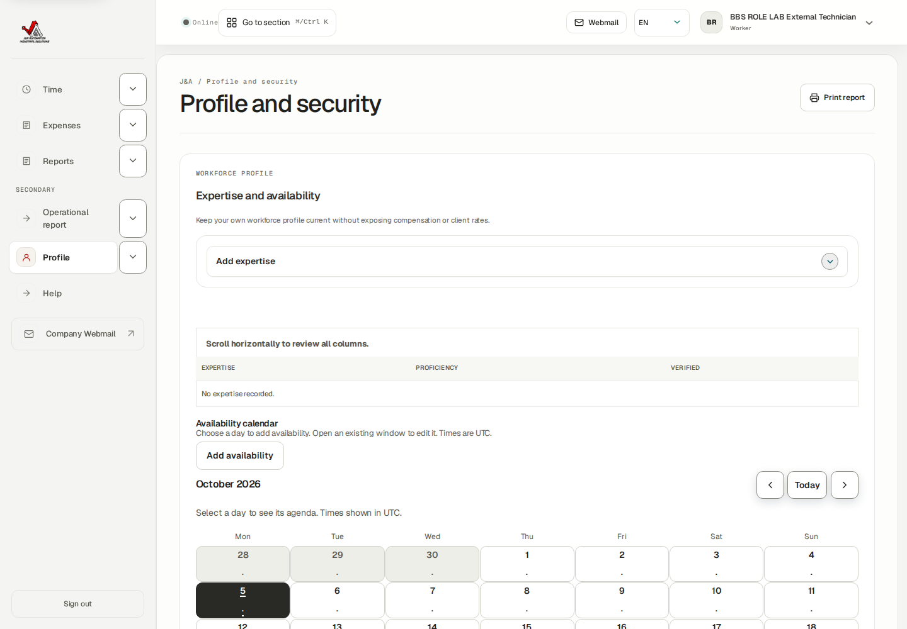

## Use Help and hand problems to the correct role

Go here: Help

Context: Isolated BBS supplier role lab · genuine External Technician account · fictional October 2026 records

Help’s invitation lesson distinguishes mailbox-linked access and a single-use external invitation; there is no public signup. Use the External Technician role course and its included access, security and recovery sections.

The verified support contact is admin@j-aautomation.com. Live company portal/webmail links are live services. No email was sent in this exercise. For questions outside your operational workspace, contact your supplier coordinator or the designated J&A contact.

### Do the task

1. Read the External technician starting path and normal-day guidance in Help.
2. Send actual source errors to the operational reviewer; supplier authorization and account questions to Owner/coordinator; reimbursement questions to your designated contact.
3. Include environment, role, project/record ID, date, intended action and exact message. Use safe screenshots without session cookies/passwords/recovery codes.

### Verify the result

- Requests outside the authorized workspace were denied. Unrelated report/receipt requests returned 404 after the own-output route fix.

### If you get stuck

- Do not use another account to work around denial or publish private receipt links. Marking/reading a notification, where offered, is not approval or acceptance.

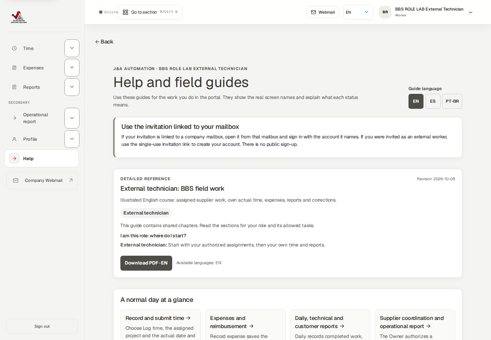

## Planning appendix · assignment dates and expected targets

Go here: Sign in → Time → Week of → Open week

Context: Isolated BBS planning lab · real role browser sessions · fictional October 22–23, 2026 work · no production changes

Project membership gives dated access to record work; a published plan describes intended work; Expected in the weekly timesheet comes from the effective working schedule. These are three separate records. None creates actual hours or approval automatically.

The Owner published a two-hour October 22 assignment for this External Technician. Publishing succeeded, but this restricted profile has no Today agenda or Planning calendar. Sign-in/root opens Time; navigation contains Time, Expenses, Reports, Operational report, Profile and Help. Direct Today and Planning links show Access restricted. This is the current profile limitation, not proof of an absent project assignment.

The effective schedule sets eight expected weekday hours. Our technician separately saved and submitted two fictional actual hours on October 22. The weekly row therefore shows Actual 2.00h, Expected 8.00h and Difference −6.00h, even though the published plan is two hours. The later coordinator-recorded October 23 hour contributes another one hour to the weekly total.

After Owner approval, the weekly status reads Needs note because actual differs from expected; the underlying source remains Approved. It is a schedule-variance prompt, not a rejection, payment state or instruction to invent six missing hours. Ask the Owner how to explain the genuine difference.

### Do the task

1. Sign in with your own External Technician account and confirm the training environment. Open Time; verify BBS is available in Assigned project before entering work.
2. For this exercise set Week of to 2026-10-19 and choose Open week. Inspect the October 22 daily row and open its day entries to inspect the actual source separately.
3. If the Owner tells you a plan was published, obtain the operational time/site instructions through the approved coordinator or Owner communication channel. This profile cannot inspect or accept the internal agenda card.
4. Record only work actually performed through Log time → Save draft → individual Submit. Check the source becomes Submitted, then Approved after authorized J&A Owner review.
5. Compare Actual, Expected and Difference. The eight-hour schedule target is not changed by a two-hour plan or by submission.

### Verify the result

- Native own two-hour save/submission and subsequent Owner approval succeeded. The Owner-created plan remained a separate published record.
- External Operational report on October 23 totals only the technician’s own one hour; coordinator’s team report totals two hours. Another technician’s known source returned Access restricted.
- The operational workspace shows the assigned project, actual records and authorized planning context.

### If you get stuck

- If BBS is missing, send the Owner/coordinator your intended project and work date. They must check active account, supplier association, supplier authorization and dated project assignment. Do not borrow a login or duplicate sources.
- If Planning or Today is unavailable, return to Time. Creating another assignment or repeatedly requesting the denied page does not add the restricted agenda feature.
- An unavailable Expected value is displayed as — when a usable effective schedule/unique assignment cannot be determined. Ask the Owner to investigate scope and dates; do not treat it as zero actual work.

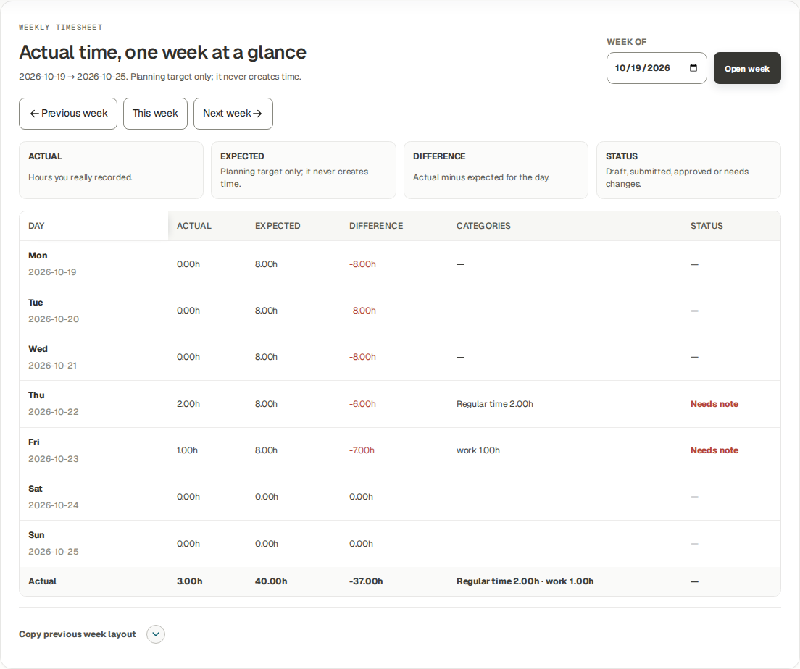

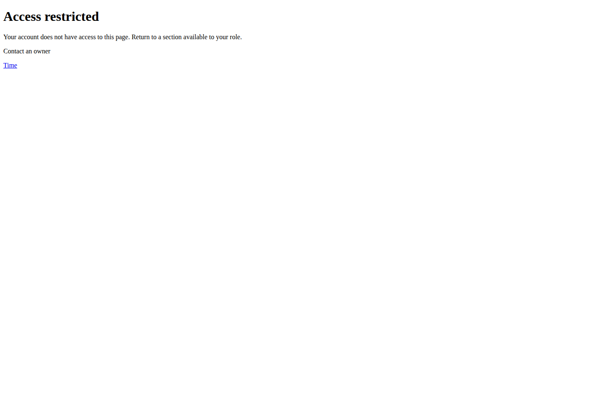

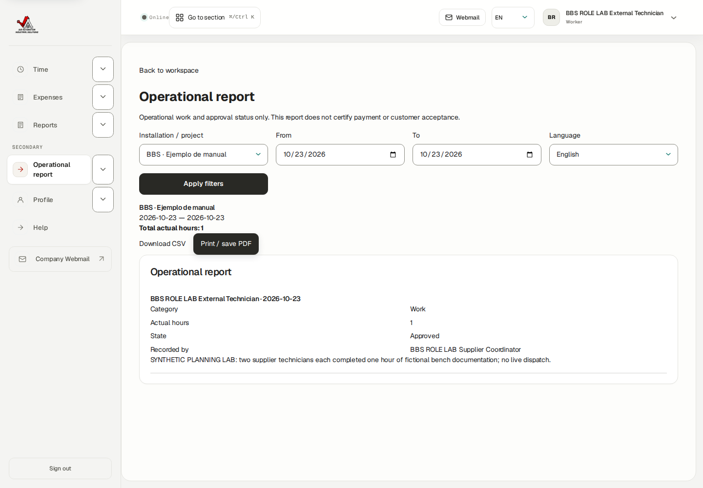

## Describe completed work, open goals and the next shift

Go here: Reports → New daily report → Save daily report → Submit for review

Context: Isolated BBS planning lab · real role browser sessions · fictional October 22–23, 2026 work · no production changes

There is no separate worker-goal screen with Accept, Reject or Mark completed buttons. Use operational Daily report fields to describe completed work, unresolved items and intended next steps. A next-day plan is narrative context; it does not publish a shift, create actual time or guarantee a task was done.

The October 22 synthetic report describes a fictional wiring-list review under Tasks completed, a diagram requiring clarification under Open items and a conditional follow-up under Next-day plan. It was saved, submitted and operationally approved by the genuine Project Manager. No customer acceptance, equipment change or payment is asserted.

Time and Daily reports have separate handoffs in this supplier profile. Submitted supplier time is reviewed by an authorized J&A Owner; the ordinary Project Manager Time queue excludes supplier hours. The Project Manager successfully reviewed this Daily report in the Reports queue.

### Do the task

1. Open Reports and choose New daily report. Select BBS and Work date 2026-10-22; provide Site / shift and Shift summary.
2. Fill Tasks completed with what happened, Open items with remaining questions and Next-day plan with proposed work. Keep operational narratives focused on the work, evidence and next action.
3. Choose Save daily report, reopen the new source and inspect the saved fields and Work performed by / Report created by attribution.
4. Choose Submit for review. Saving alone leaves a draft. After reviewer action refresh and verify Approved.
5. When the plan or facts change, coordinate with the Owner and use the supported linked correction for a reviewed report. Do not overwrite approved history or invent a task-completion control.

### Verify the result

- Native save → Submit for review → PM Approve report completed. The approved report retains Tasks completed, Open items and Next-day plan.
- The separate two-hour actual source is Owner Approved. Narrative tasks did not create or alter its duration.

### If you get stuck

- If a time reviewer cannot find supplier hours in the PM queue, hand the exact project, work date and source ID to an authorized J&A Owner; do not submit duplicate time.
- Approval is operational review. Customer sign-off remains a separate workflow for the designated authorized role.

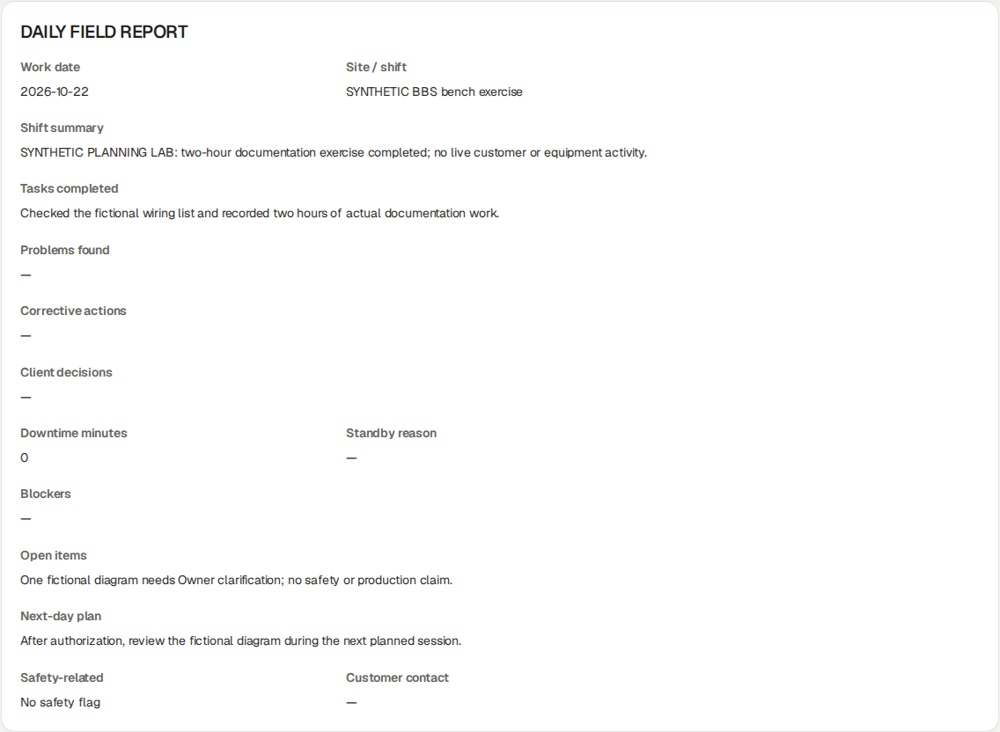

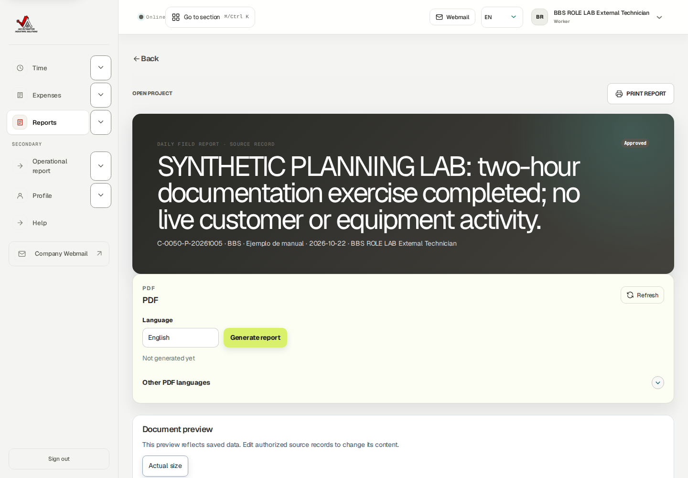

## Complete the technician handoff

Go here: Time → Expenses → Reports → Operational report

Context: Isolated BBS supplier role lab · genuine External Technician account · fictional October 2026 records

Use this task checklist for genuine authorized work in your own account. Saved, submitted and approved are separate states.

### Do the task

1. Verify own account/environment/project/date authorization.
2. Record actual hours once; inspect and submit. Read returned reasons and use linked corrections.
3. Record each purchase once with actual payer/currency/private evidence; submit for operational review.
4. Save and submit required Daily/Technical facts; hand risks/open work to PM.
5. Check review states and current own operational totals; download permitted output only when Ready.
6. Give reviewer/coordinator source IDs and unresolved issues; never claim customer acceptance/pay from operational approval.

### Verify the result

- Native coverage includes saved first-shift time, linked correction and Owner approval, ordinary plus correction weekly submission with exact IDs, private Technical upload before Submit, PM Technical approval, Ready English PDF download and exact filtered historical CSV. See Completion check · your permitted role cycle (verification).

### If you get stuck

- Layout copying, browser print completion and new customer acceptance remain reference-only. Use the shared access/security chapters for their verified procedures.

## Recovery · correct a source or request help

Use your role’s worked correction lesson and the controls offered on the current record. Preserve the original. A new purchase is different from correcting an existing purchase.

| State | Supported next action |
| --- | --- |
| Ordinary Draft | Use Edit/Save draft where present; attach the actual receipt/evidence before Submit. Inspect each saved draft after weekly table entry. |
| Submitted | Read current state and reviewer handoff. Do not create another source merely because review is pending. |
| Needs changes | Read the reason. Time uses Create corrected draft where available, then submit/review the linked replacement. A returned Daily/Technical report instead offers Edit and Save changes on the same report, then Submit for review; follow the exact role lesson. |
| Rejected | Inspect the reason and contact reviewer/Owner. The time detail does not offer the same linked-correction route as Needs changes; do not assume that route exists. |
| Approved, correction available | Use the offered linked correction and review every value before creating it. Submit the replacement for the authorized reviewer and verify its resulting state. |
| Locked or correction unavailable | Send the source ID, project, work date, visible state, requested correction and reason to the designated administrator. Do not create a duplicate. Wait for instructions before changing the record. |

### If you get stuck

- If an action is unavailable to your account, return to your workspace and contact the designated administrator with the record reference and requested action. Do not change dates or people to work around a restriction.

## Security · verify your own device and recovery options

Go here: Profile → Account security; Profile → Add availability

### Do the task

1. Check Account security identifies YOUR account even when an authorized workforce profile inspection shows another worker above it. Enroll only your own device. MFA is optional in this release.
2. For a passkey, enter Device name and choose Register passkey on the approved secure portal. Complete your device’s creation confirmation. Verify Passkey registered for this account, the registered count and named device row. Cancelled/failed registration is not enrollment.
3. To retire your own lost/obsolete passkey, first confirm you retain another working sign-in method. Select Revoke on the exact device and verify Passkey revoked and removal of its row. If you cannot sign in, use the verified support route rather than another person’s session.
4. For an authenticator, choose Enable MFA. Keep the setup URI and one-time recovery codes private in the approved password manager. Add the URI to your authenticator, enter its current six-digit Authenticator code and choose Verify MFA. Verify Enabled and Disable MFA appear; enabling without verification is not completed enrollment.
5. At a later MFA sign-in use Six-digit code → Verify and continue. If the authenticator is unavailable, choose Use a recovery code and enter one unused stored code. If neither method is available, contact admin@j-aautomation.com for identity-verified recovery. Do not send recovery codes or the setup URI to support.
6. To remove optional MFA while signed in, choose Disable MFA and verify Not enabled/Enable MFA. Confirm the intended own account before doing so. A successful settings change is separate from recovering a lost account.
7. Where Add availability is offered, fill Starts, Ends, Availability and Note using the displayed time basis, then Save availability. Verify the saved interval/status/note in the list; use Edit availability on that row and save the changed values. Availability is not project membership, a published shift or actual hours.

## Completion check · your permitted role cycle

Use the worked lessons for your own role. Historical examples retain their stated dates and states. A procedure labelled reference was checked against the controls; its outcome was not necessarily executed in the illustrated session.

### Verify the result

- Confirm your identity, project and dates. Verify the saved and submitted source, its review state, supported correction or administrator handoff and each permitted Ready output. Submission, review and download are separate checkpoints.
