# External Technician · BBS field operations

Authorized own work, expenses, reports, corrections and supplier operational evidence

## Before you practise · access and scope

This English guide uses BBS · Ejemplo de manual, project C-0050-P-20261005. The screenshots were taken using the stated role in an isolated database running the application. Training entries, payments, approvals and documents are fictional. They do not prove a real bank transfer, accountant approval or customer acceptance.

The company portal at https://j-aautomation.com/j-aautomation/app is LIVE. Training uses a separate URL and database. Before practising, obtain the isolated URL, your own role account and permitted exercises from the company administrator; verify the BBS project number. Without isolated access, treat these screenshots as read-only demonstrations and perform only authorized real work.

Use your own credentials. Do not borrow an Owner, Finance or colleague account. A platform role, project assignment, review permission, supplier authorization and dated crew delegation are separate requirements. Changing one does not automatically grant the others.

Select English in the workspace language control to follow the labels used here. Some saved BBS record names remain in their original language. On a phone open the navigation drawer to see full workspace names. Recheck the selected project and date range after every navigation.

The eight Worker test accounts in the private credentials document use the same Worker workflow. Crew chief is a dated delegation attached to a Worker account. Supplier Coordinator and External Technician are restricted profiles attached to Worker accounts. This guide never includes account passwords.

Each screenshot is an exercise checkpoint. Later fictional role entries and financial events are additional to the original October 1–5 workbook totals. Reopening the project or selecting the same dates does not restore that checkpoint. Read captions before comparing amounts or states.

The assignment and expected-hours supplement uses a separate isolated October 20–23 synthetic exercise. Project access, a published work plan and a dated working-hours target are separate records. Workers record actual work and report progress independently; a plan never creates actual hours or a payment.

### Verify the result

- Confirm your displayed account, role or supplier profile, the project number and the dates before saving.
- For training access, scope or reset help, contact the company administrator at admin@j-aautomation.com. Include the role, route, project number, time and visible error; omit passwords, cookies and private customer or worker documents.

### If you get stuck

- An empty project selector often means missing or expired assignment or authorization. Ask the Owner to check coverage for the date you are entering; do not create a duplicate project.
- A form shown in a screenshot can depend on role, source state or effective date. Use the documented role handoff when a control is absent.

## Start with authorized supplier access

Go here: Sign in → Time

Context: Isolated BBS supplier role lab · genuine External Technician account · fictional October 2026 records

Use the individual External Technician account created or invited by the Owner. There is no public sign-up. Account activity, supplier association, supplier project authorization and your project assignment must all cover the work date. A supplier coordinator is a different role and may record team work; that does not let you see another technician’s sources.

This course uses BBS ROLE LAB External Technician in the isolated C-0050-P-20261005 · BBS · Ejemplo de manual project. New work is fictional, outside the original billed October 2–5 history. The supplier authorization covers October 5–31. No live dispatch, purchase, equipment change or bank transfer occurred.

Before practising obtain an operator-provided training URL, own account, visible environment identifier, permitted scope and reset instructions. No shared training credentials are supplied. Live company portal or webmail links open live services, never this isolated demonstration.

### Do the task

1. Sign in with your own account and verify environment, account and language.
2. Use Time for your own hours, Expenses for your own operational purchases, Reports for your own Daily/Technical facts and Operational report for your allowed activity summary.
3. Use Profile and Help for own workforce/security settings and guidance.

### Verify the result

- Your assigned BBS project is available. Finance, Billing, My Pay and supplier team administration are outside this role.

### If you get stuck

- Ask the Owner/coordinator to investigate account, supplier authorization or assignment dates when the intended project is absent. Do not borrow an account or create duplicate work.

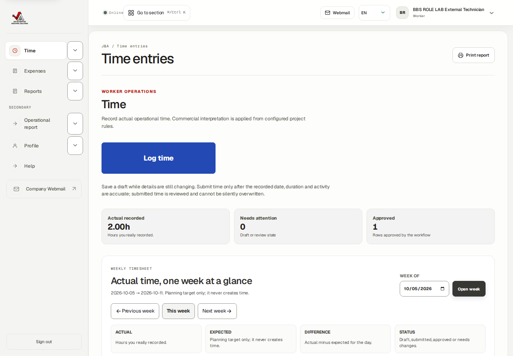

## Understand assignment access, published plans and expected hours

Go here: Sign in → Time → Week of → Open week

Context: Isolated BBS planning lab · real role browser sessions · fictional October 22–23, 2026 work · no production records or financial changes

Project membership gives dated access to record work; a published plan describes intended work; Expected in the weekly timesheet comes from the effective working schedule. These are three separate records. None creates actual hours, approval, customer charges or pay automatically.

The Owner published a two-hour October 22 assignment for this External Technician. Publishing succeeded, but this restricted profile has no Today agenda or Planning calendar. Sign-in/root opens Time; navigation contains Time, Expenses, Reports, Operational report, Profile and Help. Direct Today and Planning links show Access restricted. This is the current profile limitation, not proof of an absent project assignment.

The effective schedule sets eight expected weekday hours. Our technician separately saved and submitted two fictional actual hours on October 22. The weekly row therefore shows Actual 2.00h, Expected 8.00h and Difference −6.00h, even though the published plan is two hours. The later coordinator-recorded October 23 hour contributes another one hour to the weekly total.

After Owner approval, the weekly status reads Needs note because actual differs from expected; the underlying source remains Approved. It is a schedule-variance prompt, not a rejection, payment state or instruction to invent six missing hours. Ask the Owner how to explain the genuine difference.

### Do the task

1. Sign in with your own External Technician account and confirm the training environment. Open Time; verify BBS is available in Assigned project before entering work.
2. For this exercise set Week of to 2026-10-19 and choose Open week. Inspect the October 22 daily row and open its day entries to inspect the actual source separately.
3. If the Owner tells you a plan was published, obtain the operational time/site instructions through the approved coordinator or Owner communication channel. This profile cannot inspect or accept the internal agenda card.
4. Record only work actually performed through Log time → Save draft → individual Submit. Check the source becomes Submitted, then Approved after authorized J&A Owner review.
5. Compare Actual, Expected and Difference. The eight-hour schedule target is not changed by a two-hour plan or by submission.

### Verify the result

- Native own two-hour save/submission and subsequent Owner approval succeeded. The Owner-created plan remained a separate published record.
- External Operational report on October 23 totals only the technician’s own one hour; coordinator’s team report totals two hours. Another technician’s known source returned Access restricted.
- Client rates, company cost, margin, supplier payment and colleagues’ compensation are outside this operational workspace.

### If you get stuck

- If BBS is missing, send the Owner/coordinator your intended project and work date. They must check active account, supplier association, supplier authorization and dated project assignment. Do not borrow a login or duplicate sources.
- If Planning or Today is unavailable, return to Time. Creating another assignment or repeatedly requesting the denied page does not add the restricted agenda feature.
- An unavailable Expected value is displayed as — when a usable effective schedule/unique assignment cannot be determined. Ask the Owner to investigate scope and dates; do not treat it as zero actual work.

## Describe completed work, open goals and the next shift

Go here: Reports → New daily report → Save daily report → Submit for review

Context: Isolated BBS planning lab · real role browser sessions · fictional October 22–23, 2026 work · no production records or financial changes

There is no separate worker-goal screen with Accept, Reject or Mark completed buttons. Use operational Daily report fields to describe completed work, unresolved items and intended next steps. A next-day plan is narrative context; it does not publish a shift, create actual time or guarantee a task was done.

The October 22 synthetic report describes a fictional wiring-list review under Tasks completed, a diagram requiring clarification under Open items and a conditional follow-up under Next-day plan. It was saved, submitted and operationally approved by the genuine Project Manager. No customer acceptance, equipment change or payment is asserted.

Time and Daily reports have separate handoffs in this supplier profile. Submitted supplier time is reviewed by an authorized J&A Owner; the ordinary Project Manager Time queue excludes supplier hours. The Project Manager successfully reviewed this Daily report in the Reports queue.

### Do the task

1. Open Reports and choose New daily report. Select BBS and Work date 2026-10-22; provide Site / shift and Shift summary.
2. Fill Tasks completed with what happened, Open items with remaining questions and Next-day plan with proposed work. Keep private rates, costs, pay and client-commercial arrangements out of operational narratives.
3. Choose Save daily report, reopen the new source and inspect the saved fields and Work performed by / Report created by attribution.
4. Choose Submit for review. Saving alone leaves a draft. After reviewer action refresh and verify Approved.
5. When the plan or facts change, coordinate with the Owner and use the supported linked correction for a reviewed report. Do not overwrite approved history or invent a task-completion control.

### Verify the result

- Native save → Submit for review → PM Approve report completed. The approved report retains Tasks completed, Open items and Next-day plan.
- The separate two-hour actual source is Owner Approved. Narrative tasks did not create or alter its duration.

### If you get stuck

- If a time reviewer cannot find supplier hours in the PM queue, hand the exact project, work date and source ID to an authorized J&A Owner; do not submit duplicate time.
- Approval is operational review. Continue the separate customer sign-off or financial process only through an authorized role.

## Save your own actual time and submit it

Go here: Time → Log time

Context: Isolated BBS supplier role lab · genuine External Technician account · fictional October 2026 records

Actual hours describe work performed, independently of supplier plans or invoices. The exercise saved one hour on October 7 for fictional documentation work. Decimal 0.75 hour means 45 minutes; it is not 75 minutes.

Operational category describes activity. Choosing Overtime does not set a premium. Start/end times and meal expense are optional separate inputs; do not invent clock times from a duration.

### Do the task

1. Choose Log time. Select Assigned project and Date, then Operational category, Actual hours and Activity summary.
2. Use Save draft. Open the saved source and verify account, project, date, duration and activity.
3. Use individual Submit and confirm Submitted. Saving alone is not submission or approval.

### Verify the result

- One native one-hour own source was saved and submitted. It retained its own ID and history.

### If you get stuck

- If Save seems uncertain, reload the filtered register and locate the existing row before trying again. Edit an unsent ordinary draft only through the current permitted controls.

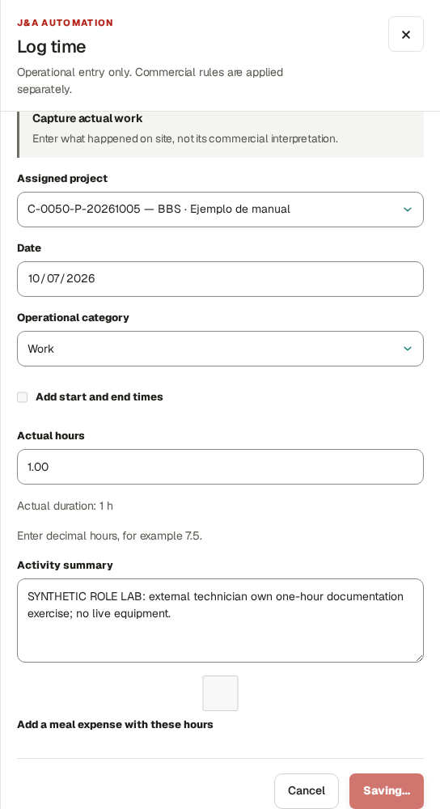

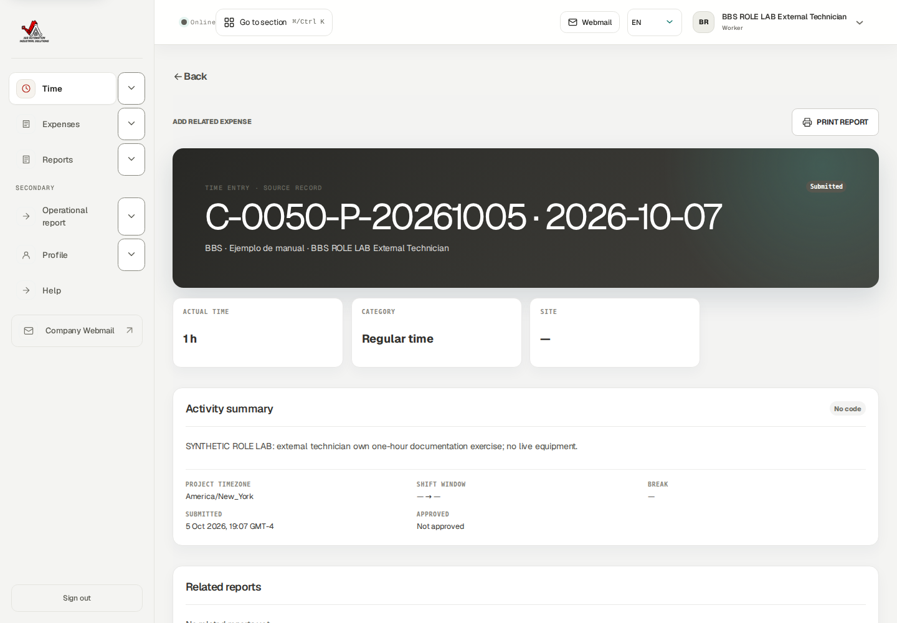

## Correct returned time through a linked replacement

Go here: Time → Needs changes source → Create corrected draft

Context: Isolated BBS supplier role lab · genuine External Technician account · fictional October 2026 records

The Owner returned the one-hour source because actual duration was 0.75 hour. The technician created a linked correction rather than another unrelated time row. The original one-hour Needs changes record remains preserved.

Review every value before creating a correction: linked correction drafts do not offer unrestricted editing after creation. An unsubmitted Withdraw correction draft control requires a reason; withdrawal was inspected, not exercised.

### Do the task

1. Open the original source and read the reviewer’s reason. Use Create corrected draft.
2. Review project/date/category/activity, enter Actual hours 0.75 and a concrete Correction reason; create the draft.
3. Open the linked Draft, inspect its original link and use individual Submit.
4. After reviewer approval inspect the current operational report/register rather than adding the old and replacement hours.

### Verify the result

- Own corrected 45 minute source is Approved; original 60 minute source remains Needs changes. With coordinator-recorded 2 hours, current activity totals 165 minutes=2.75 hours.

### If you get stuck

- A settled, invoiced or otherwise locked source may require Finance/Owner adjustment. Send the original ID and intended factual change; never shift dates or create duplicate work to evade a guard.

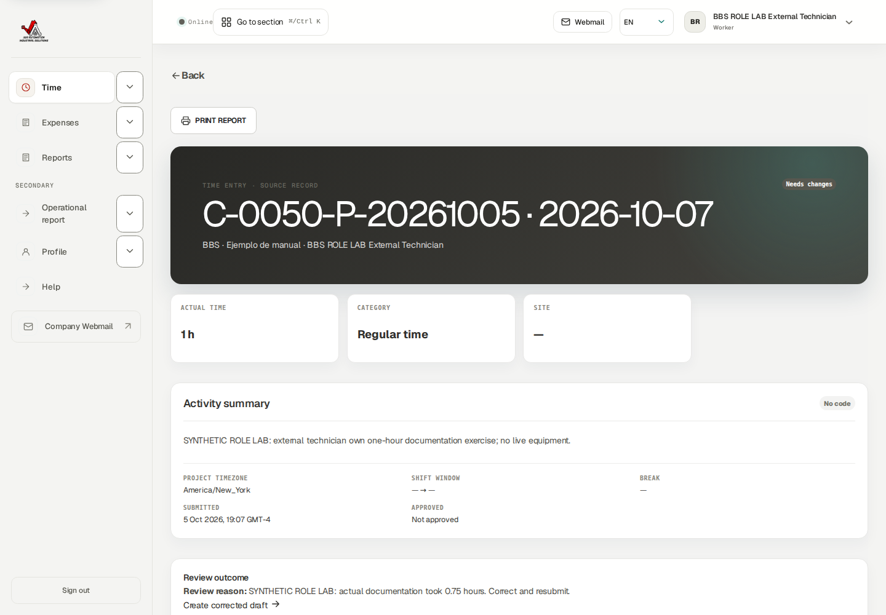

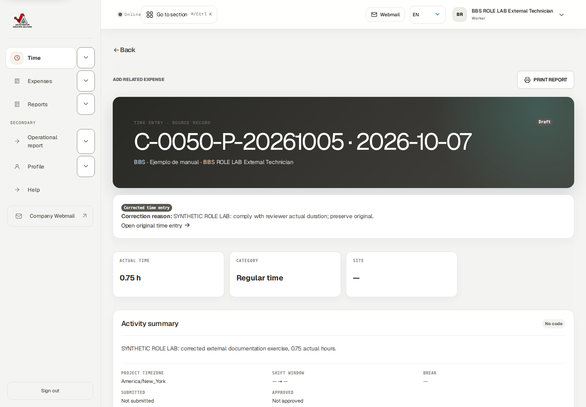

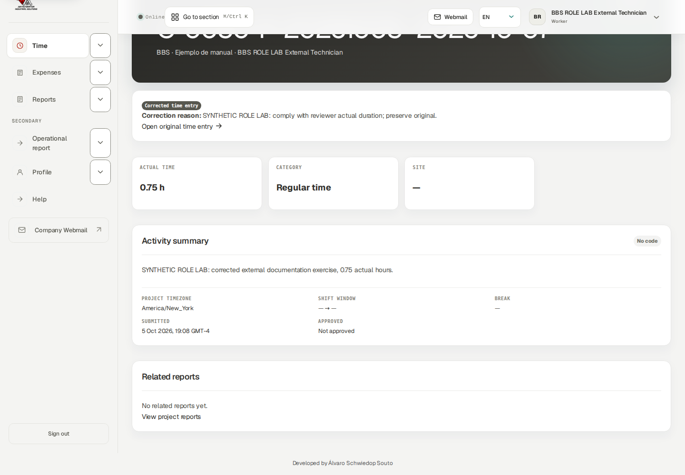

## Review weekly tools without copying fictitious work

Go here: Time → Enter a week in a table; Submit this week

Context: Reference procedure · current own-role controls/source checked; mutations not exercised

Weekly tools save your own daily drafts for actual work. Blank days are skipped. Review existing entries first to avoid duplicates. A copied previous-week layout carries zero hours and does not create evidence that work happened again.

Copy previous week layout: choose the destination Week of, inspect displayed Previous week / This week, then Add this week’s layout. These are displayed periods, not editable Source/Destination fields. Weekly draft submission can include eligible linked corrections; this course used individual correction Submit to inspect the original link.

### Do the task

1. For a genuine workweek open Enter a week in a table, select Week of/project and fill worked days, then Save daily drafts.
2. Review saved records. Under Submit this week inspect the own-week draft count before Submit all week drafts.
3. For a linked correction use individual detail Submit when you need to inspect its history carefully.

### Verify the result

- Draft, Submitted and Approved remain distinct. A zero-hour copied layout still needs genuine actual work.

### If you get stuck

- Resolve the exact blocked/changed record. Do not keep submitting the entire week to force a guarded correction.

## Record an own purchase with its private receipt

Go here: Expenses → Record expense

Context: Isolated BBS supplier role lab · genuine External Technician account · fictional October 2026 records

The worked expense is explicitly synthetic USD 8 tools/consumables on October 7, Worker payer. The receipt states no real purchase or payment. Your purchase facts are visible to you; Finance classification, customer recovery and reimbursement are later distinct decisions.

The actual form accepts JPG/PNG/HEIC/PDF receipt evidence up to 10 MB. Preserve the original currency and payer. A registered upload is not a universal assertion that an antivirus scan completed.

### Do the task

1. Choose Record expense. Attach Receipt image or PDF; select Project, Date and Category. Enter Vendor, Amount 8, Currency USD, Who paid Worker and factual Description; fill applicable time/related-hours/payment context.
2. Use Save draft and open the saved expense. Check the registered receipt and purchase fields.
3. Use Submit. Genuine PM operationally approved this expense. Open private receipt now succeeds through your own authorized account.

### Verify the result

- One USD 8 expense and one receipt exist. No Finance review, reimbursement payment or client invoice is claimed for this External exercise.

### If you get stuck

- If receipt access or scan processing fails, report the document/expense ID and exact status. Do not create another expense while checking the first. Reviewed expense corrections follow the current permitted correction/handoff process.

## Write and submit your own daily field report

Go here: Reports → New daily report

Context: Isolated BBS supplier role lab · genuine External Technician account · fictional October 2026 records

Daily reports record operational facts, not timesheet hours, supplier payment or customer acceptance. This report’s author is the genuine External Technician account. Its fictional summary says no live equipment.

Fields include Project, Work date, Site / shift, Shift summary, Tasks completed, Problems found, Corrective actions, Downtime minutes, Standby reason, Open items, Next day plan and safety impact. Include genuine problems and next steps; do not invent a successful outcome.

### Do the task

1. Choose New daily report and fill the actual work date/project and factual summary/tasks. Fill relevant operational exceptions and next steps.
2. Use Save daily report. Open the Draft and inspect saved contents. Autosaving or saving edits does not submit.
3. Use Submit for review. Confirm Submitted and the permitted reviewer’s later state.

### Verify the result

- Own Daily progressed Draft→Submitted→Approved through genuine PM review. It did not add hours or record a customer signature.

### If you get stuck

- Edit only through offered unsent-draft controls. For returned/approved content, preserve history and use a supported correction or reviewer handoff.

## Document technical facts and validation

Go here: Reports → New technical report

Context: Isolated BBS supplier role lab · genuine External Technician account · fictional October 2026 records

The exercised system is a fictional bench. No PLC program changed and no live validation is claimed. A technical report is evidence, not authorization to modify equipment or substitute for safety/change-control requirements.

Identify System / machine and applicable Plant / site, Area / line, Station / machine, System type, PLC platform, Controller, HMI / SCADA, Network / protocol, Software version and Program / project reference. Record Problem / symptom, Diagnosis / root cause, Change performed, production impact, validation/result, open risk and rollback.

### Do the task

1. Choose New technical report. Select Project and Work date, identify equipment and enter readable factual diagnosis/change/validation/risk fields.
2. Use Save PLC report. Open the Draft and inspect the source.
3. Use Submit for review and inspect the permitted reviewer’s later state.

### Verify the result

- Own Technical source saved, submitted and genuinely PM Approved. Native readable preview access was rechecked after a route-admission fix.

### If you get stuck

- A real unresolved hazard/validation need belongs with the responsible technical lead/PM. Do not fabricate clean validation to complete a form.

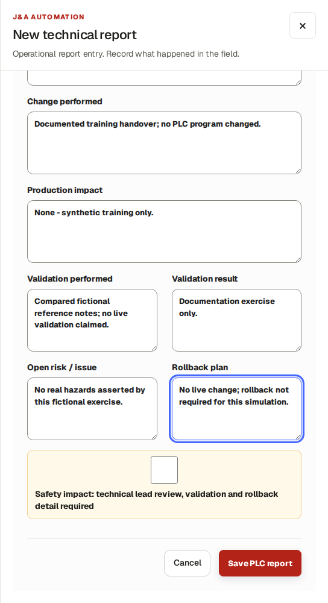

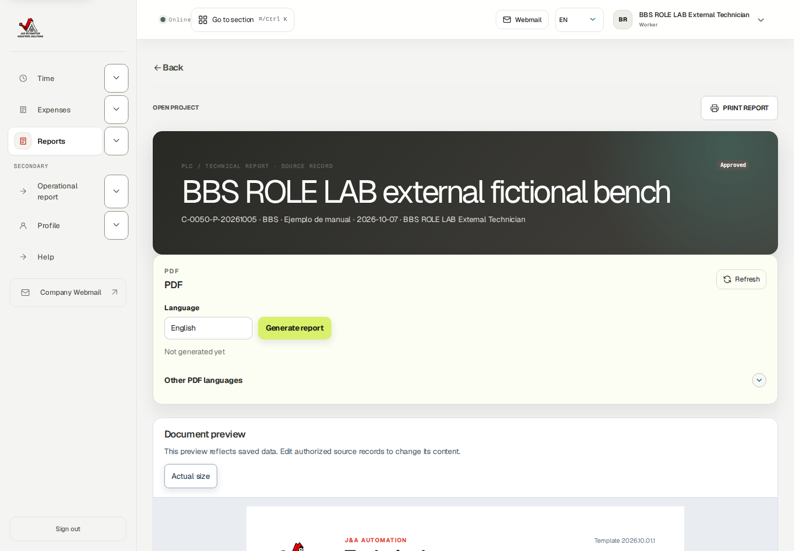

## Generate a ready own report PDF and preserve version meaning

Go here: Reports → own report detail → Generate report

Context: Isolated BBS supplier role lab · genuine External Technician account · fictional October 2026 records

The own Daily was approved before this output example. Choose the report language and Generate report; generation is asynchronous. Queued is not a downloaded file. Refresh/check its state and use Download only when Ready.

Initial testing discovered that the role route list blocked own previews and receipts even though their own record pages offered links. A bounded route fix retained existing session and exact object-scope checks. Rebuilt runtime checks confirmed own Daily/Technical previews and own receipt 200 while unrelated report/receipt 404 and financial routes 403 remained protected. The earlier 403 evidence is preserved as history, not the final operating result.

Private report evidence can be uploaded through Evidence type, File and Notes using the permitted draft controls. Offered types/limits are displayed; this role exercise did not upload report attachments. A Daily/Technical PDF is separate from reviewed customer period acceptance or supplier billing.

### Do the task

1. On the own approved Daily choose English and Generate report. Wait for Queued processing.
2. Refresh until Ready and use Download / Download English. Open the native PDF and verify author/project/date/content.
3. Before report submission, use permitted private evidence controls for authorized attachments; never include unrelated people’s financial/private records.

### Verify the result

- Native English Daily reached Ready and the own download succeeded. Own preview and receipt access works; unrelated source evidence remains inaccessible.

### If you get stuck

- If Queued never completes, ask support to inspect the artifact using report ID/language/status. If preview/receipt denied, report exact URL/status; never use another account or fabricate a screenshot.

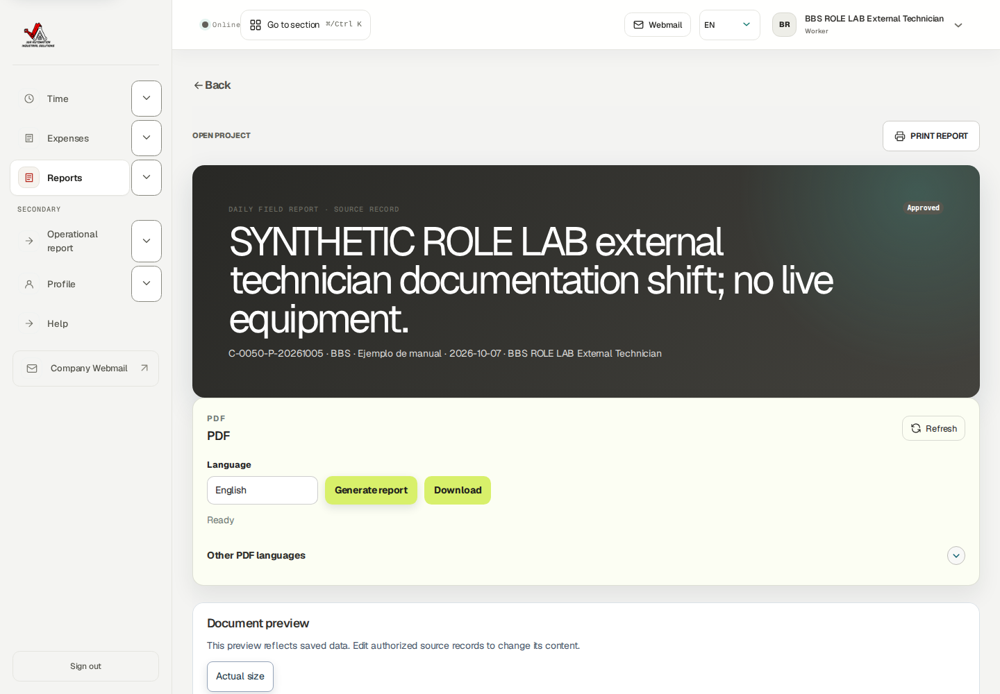

## Reconcile and download your own operational activity

Go here: Operational report → Apply filters

Context: Isolated BBS supplier role lab · genuine External Technician account · fictional October 2026 records

This report contains operational work and approval status only. It does not certify supplier payment, compensation or customer acceptance. The technician sees its own coordinator-recorded work and its own corrected work, with Recorded by identifying the actor.

For October 6–31, current activity is 2 hrecorded by the supplier coordinator plus 0.75 hrecorded/corrected by the technician, total 2.75 h. The superseded 1 h source is not counted again. The CSV’s nine columns describe project, technician, date, category, actual hours/minutes, activity, state and recorder; it contains no pay/rates.

### Do the task

1. Select Installation / project, From, To and Language; use Apply filters. Check the displayed date range and person before interpreting totals.
2. Inspect each current source’s duration, state and Recorded by.
3. Use Download CSV and open the native output. Print / save PDF uses the browser’s print flow; no separately generated operational PDF was saved in this lab.

### Verify the result

- Own operational CSV downloaded successfully: two rows, 120+45 minutes=165 minutes, 2.75 h, only this technician.

### If you get stuck

- If empty, check filters and authorization dates before assuming work is missing. Reconcile source states/corrections; do not add rows to match a planned total.

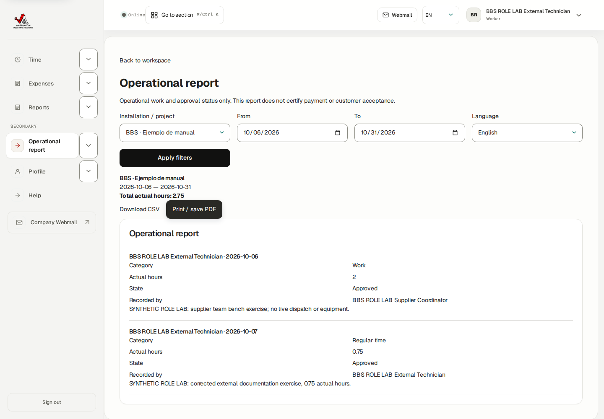

## Use narrow screens and check saved results

Go here: Time; Expenses; Reports; Operational report

Context: Isolated BBS supplier role lab · genuine External Technician account · fictional October 2026 records

Use role navigation and narrow-screen menu controls. Review account/project/date/member fields carefully before saving. A table’s internal horizontal-scroll hint is different from page-level overflow.

### Do the task

1. On a phone open the required workspace through navigation and apply the intended scope.
2. After saving or submitting, reopen the existing source to verify its result rather than repeating the action.

### Verify the result

- Operational report checked at 390 and 768 pixels: page width of the scrollable page matches viewport width; native two-source report retained. Desktop 1440 was also inspected.

### If you get stuck

- Report clipped controls with a safe screenshot, width, environment and exact action. Never save duplicate records to compensate for a hidden result.

## Maintain your workforce profile and individual security

Go here: Profile → Expertise and availability; Account security

Context: Reference procedure · current own-role controls/source checked; mutations not exercised

Expertise and availability are planning inputs, distinct from supplier authorization/project assignment. The own profile was inspected natively; no security or profile mutations occurred here. A generic workforce-profile Worker label does not grant internal Worker financial workspaces.

Add expertise offers expertise/proficiency. Add availability opens dated UTC availability windows. Passkey registration uses Device name and Register passkey. Authenticator setup/recovery material is sensitive; never include it in report evidence.

### Do the task

1. Check your own expertise and UTC calendar. Use offered own-profile controls only for genuine information.
2. For an authorized account-security change use your own device/authenticator prompts and verify completion before signing out. Store recovery codes in an approved password manager.

### Verify the result

- Skills/availability do not grant review, supplier administration, private-pay or billing rights. Security success is not claimed from read-only controls.

### If you get stuck

- Ask the Owner/coordinator for authorization/assignment changes and Owner/support for access recovery. Do not share credentials.

## Use Help and hand problems to the correct role

Go here: Help

Context: Isolated BBS supplier role lab · genuine External Technician account · fictional October 2026 records

Help’s invitation lesson distinguishes mailbox-linked access and a single-use external invitation; there is no public signup. Supplier operations guidance has different paths for technician/coordinator.

The verified support contact is admin@j-aautomation.com. Live company portal/webmail links are live services. No email was sent in this exercise. External Technician has no My Pay workspace: supplier commercial/payment questions belong to the coordinator/Finance using their authorized process.

### Do the task

1. Read the External technician starting path and normal-day guidance in Help.
2. Send actual source errors to the operational reviewer; supplier authorization/account questions to Owner/coordinator; financial issues to coordinator/Finance.
3. Include environment, role, project/record ID, date, intended action and exact message. Use safe screenshots without session cookies/passwords/recovery codes.

### Verify the result

- My Pay, Finance, Billing, supplier team and another Worker’s time returned 403. Unrelated report/receipt returned 404 after the own-output route fix.

### If you get stuck

- Do not use another account to work around denial or publish private receipt links. Marking/reading a notification, where offered, is not approval or acceptance.

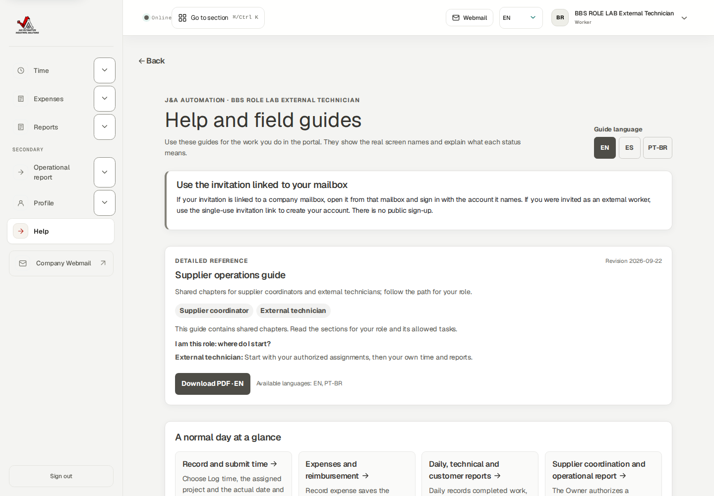

## Complete the technician handoff

Go here: Time → Expenses → Reports → Operational report

Context: Isolated BBS supplier role lab · genuine External Technician account · fictional October 2026 records

Use this task checklist for genuine authorized work in your own account. Saved, submitted, approved, financially reviewed and paid are separate states.

### Do the task

1. Verify own account/environment/project/date authorization.
2. Record actual hours once; inspect and submit. Read returned reasons and use linked corrections.
3. Record each purchase once with actual payer/currency/private evidence; submit for operational review.
4. Save and submit required Daily/Technical facts; hand risks/open work to PM.
5. Check review states and current own operational totals; download permitted output only when Ready.
6. Give reviewer/coordinator source IDs and unresolved issues; never claim customer acceptance/pay from operational approval.

### Verify the result

- Verified: own time 1→0.75 linked correction approved; coordinator 2 h separately visible; own expense 8 USD with receipt approved; own Daily/Technical submitted+approved; own Daily Ready PDF download; own operational CSV; own preview/receipt positive and unrelated/private financial denial; phone/tablet fit.

### If you get stuck

- Reference-only: onboarding/reset, weekly table/layout copy/bulk mutations, report attachments, profile/security changes, browser print PDF completion, customer acceptance, real bank/email delivery.
