# Finance · BBS operating cycle

Financial review, customer billing, collections, worker obligations, exports and closing

## Before you practise · access and scope

This English guide uses BBS · Ejemplo de manual, project C-0050-P-20261005. The screenshots were taken using the stated role in an isolated database running the application. Training entries, payments, approvals and documents are fictional. They do not prove a real bank transfer, accountant approval or customer acceptance.

The company portal at https://j-aautomation.com/j-aautomation/app is LIVE. Training uses a separate URL and database. Before practising, obtain the isolated URL, your own role account and permitted exercises from the company administrator; verify the BBS project number. Without isolated access, treat these screenshots as read-only demonstrations and perform only authorized real work.

Use your own credentials. Do not borrow an Owner, Finance or colleague account. A platform role, project assignment, review permission, supplier authorization and dated crew delegation are separate requirements. Changing one does not automatically grant the others.

Select English in the workspace language control to follow the labels used here. Some saved BBS record names remain in their original language. On a phone open the navigation drawer to see full workspace names. Recheck the selected project and date range after every navigation.

The eight Worker test accounts in the private credentials document use the same Worker workflow. Crew chief is a dated delegation attached to a Worker account. Supplier Coordinator and External Technician are restricted profiles attached to Worker accounts. This guide never includes account passwords.

Each screenshot is an exercise checkpoint. Later fictional role entries and financial events are additional to the original October 1–5 workbook totals. Reopening the project or selecting the same dates does not restore that checkpoint. Read captions before comparing amounts or states.

### Verify the result

- Confirm your displayed account, role or supplier profile, the project number and the dates before saving.
- For training access, scope or reset help, contact the company administrator at admin@j-aautomation.com. Include the role, route, project number, time and visible error; omit passwords, cookies and private customer or worker documents.

### If you get stuck

- An empty project selector often means missing or expired assignment or authorization. Ask the Owner to check coverage for the date you are entering; do not create a duplicate project.
- A form shown in a screenshot can depend on role, source state or effective date. Use the documented role handoff when a control is absent.

## Start with your Finance account

Go here: Sign in → Finance Overview

Context: Worked example · actual Finance account in the isolated BBS role lab; navigation and phone drawer verified. Later role practice is separate from the original October 1–5 checkpoint.

Use the individual Finance account issued by the Owner. The platform role is finance_admin. Sign in with your own credentials; the Owner is responsible for creating and activating access. The worked project is C-0050-P-20261005 — BBS · Ejemplo de manual. Original BBS Mexico and Junkers are outside this exercise.

Practice only in a separately authorized training environment. The native issued training invoices, numbering approval fixture and simulated money records are not production transactions. New 6 October role exercises are separate from the original 1–5 October calculation examples.

Finance Overview is the starting control view; Economic Review provides source records and settlements; Commercial Configuration holds dated commercial treatment; Billing creates and manages customer documents; Collections / Ledger records receipts and reversals; Accounting creates a portfolio period pack. Notifications, Profile and Help support your own account.

### Do the task

1. Check the active account and language. Select the BBS project before a project-specific action.
2. On a phone, open the navigation menu or More for destinations outside the bottom bar. Close the drawer to work in the page.
3. Follow an amount or alert into its underlying source rather than treating every displayed total as the same financial measure.

### Verify the result

- The project selector and heading agree. You see Finance navigation, not Owner administration or Audit.

### If you get stuck

- An absent project, inactive account or permission error requires an Owner/support handoff. Do not borrow another person’s account.

## Know your authority and the Owner handoffs

Go here: Billing → Configure billing; Projects → project → Billing

Context: Reference procedure · checked against current source; not yet executed in this role lab

Finance may review billability and expense treatment, maintain permitted commercial rules and billing streams, create/review customer invoices, issue an approved invoice under an existing numbering policy, record collections and worker-side payments, and generate/review/finalize Accounting Packs. Every operation is still checked on the server against a live account and the applicable record.

Owner-only tasks include legal invoice issuer/numbering policy setup and voiding an issued invoice. Finance does not gain Owner account management or the Audit workspace. A source-linked draft can also require Owner intervention to discard. Client billing units, worker pay calculation and internal cost basis are independent.

The original three issued BBS documents total USD 4,672: opening labor 2,230, expenses 182 and mixed hourly/daily/weekly labor 2,260. Preserve their numbered native PDFs. Practice adjustments are new linked documents; they never replace the original face amount.

### Do the task

1. Before invoice work, ask the Owner to confirm issuer/date coverage, the approved numbering policy, project assignments, dated person terms and required reporting/acceptance.
2. Review the real approved contract before choosing hourly, daily, weekly, all-in or capped treatment.
3. Hand the Owner the exact blocked invoice/stream/person ID, intended dates and visible message when Owner authority is required.

### Verify the result

- No invented accountant approval date, customer signature or bank transfer enters a real record. Issuing is separate from delivering or collecting.

### If you get stuck

- If no approved numbering policy exists, stop issuance and ask the Owner/accountant for prefix, digits, effective date and genuine approval timestamp. A proposed convention is not approval.

## Review actual work after operational approval

Go here: Approvals → Finance review

Context: Reference procedure · checked against current source; not yet executed in this role lab

A worker submits operational facts. An Owner, permitted project reviewer or delegated chief handles the applicable operational review. Finance review begins only after operational approval; it determines financial eligibility without changing actual hours.

Use Search Finance review to isolate the BBS record by worker/date/project. An empty queue demonstrates that nothing matching needs Finance review; it is not proof that a particular missing source was approved or paid.

### Do the task

1. Open the exact operationally approved time record. Check project, person, work date, actual duration, category, current version and any correction link.
2. In the Finance review row select Billable or Non-billable according to the contract, then use its Finance review action.
3. Reopen the relevant Economic Review source and verify its reviewed billability. Repeat independently for each source.

### Verify the result

- Actual hours remain unchanged. Only the intended financial treatment changes. A returned, submitted or active correction record must first complete its operational workflow.

### If you get stuck

- If the source is absent, inspect operational state, person/project scope, search filters, dated rules, correction state and existing invoice links. Ask the operational reviewer to correct the real source; never duplicate it to make billing work.

## Classify an expense before Finance review

Go here: Approvals → Finance review → Classify expense in Finance

Context: Worked example · actual Finance account classified the new fictional October 6 USD 12 worker expense using saved at-cost policy, then recorded Finance review. No purchase or reimbursement transfer occurred.

Purchase amount, payer, worker reimbursement, company direct cost and customer recovery are separate. The original BBS expenses demonstrate USD 230 spent, USD 180 reimbursable and USD 182 charged to the client.

Check the receipt, currency, worker-paid versus company-paid payer, work date and project before classifying. A document in quarantine or awaiting a scan is not a usable verified receipt. Customer billability alone does not prove worker reimbursement.

The role exercise expense is ROLE GUIDE synthetic bench supplies - no real purchase, dated October 6. Finance retained the saved Reimburse at cost / Bill at cost policy: USD 12 reimbursement and USD 12 customer recovery, 0% tax. It is additional practice and is not part of the original USD 230 expense checkpoint.

### Do the task

1. Open Classify expense in Finance for the exact expense. Review existing expense and reimbursement policy/date coverage.
2. Choose the offered commercial treatment and reimbursement classification using the approved agreement; enter only supported verified project-currency values. Save the classification.
3. Return to Approvals, inspect the classified expense and complete Finance review.
4. Verify the source’s customer recovery, company cost, reimbursement obligation and review state separately in Economic Review.

### Verify the result

- The purchase amount and operational evidence remain intact. Reimbursement and customer recovery are not both assumed equal to the receipt.

### If you get stuck

- An unclassified expense cannot bypass Finance review. If foreign-currency projection is missing, use the exact expense/currency message to request a supported verified remedy; do not invent an exchange rate or change the purchase currency.

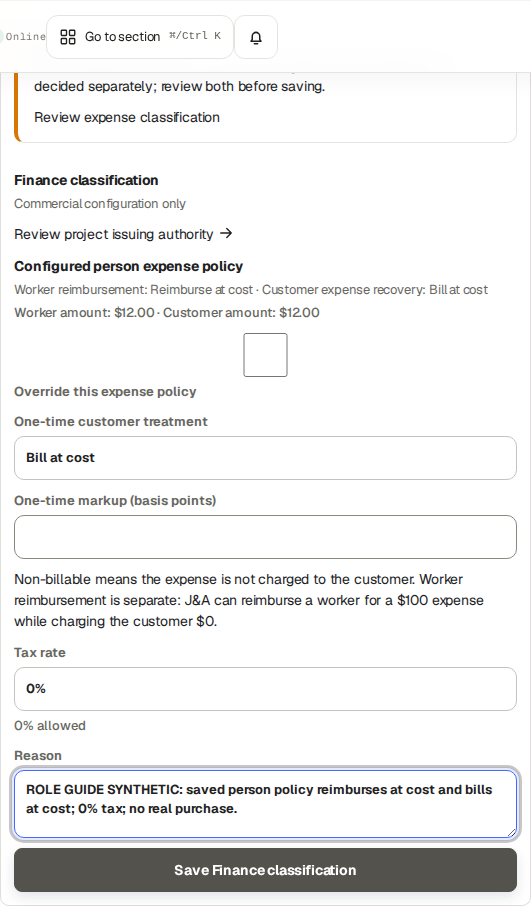

## Check dated agreements and independent pay rules

Go here: Commercial Configuration; Projects → BBS → Billing → Review each person

Context: Reference procedure · checked against current source; not yet executed in this role lab

Project defaults and saved person overrides determine financial treatment on their effective dates. Customer hourly/day/week rates do not set the worker’s pay. Internal loaded hourly cost is a further independent economic basis.

Worker compensation can use Hourly, Daily, Fixed per billing period, fixed project or percentage methods according to the actual rule. Fixed per billing period is a calculation method, not automatic weekly payroll. There is no saved automatic weekly/monthly worker payment cadence in this release.

### Do the task

1. Select the same BBS project and person. Review the current saved rule, effective date, currency and any earlier agreement covering the work.
2. When authorized to change a future agreement, enter the exact contract values and effective date, then save the appropriate form. Copying values into a draft form alone does not persist them.
3. Reopen the saved rule and check its date coverage before finance review or settlement.

### Verify the result

- Earlier approved work keeps its applicable historical terms. A later agreement does not silently rewrite an issued invoice or finalized settlement.

### If you get stuck

- Missing, conflicting or expired terms require a reviewed dated agreement. Do not choose an arbitrary rate until a calculation happens to look right. Owner issuer revisions/numbering are a separate handoff.

## Create and review a billing stream

Go here: Billing → Billing streams → Configure billing

Context: Worked example · actual Finance account inspected the saved BBS Labor and Expense streams, their effective dates and distinct Manual/Weekly/Monthly cadences. Adding/changing streams and automatic draft execution are source-checked reference procedures; no stream configuration was changed.

A stream separates the customer document flow from worker settlement and expense reimbursement. Labor, Expense and permitted mixed streams have a customer invoice cadence, issuer, currency, effective dates and tax/reporting settings.

The original BBS opening Labor stream uses a manual partial-week period. Copy its verified starting state only when inspecting the saved example; do not create a duplicate invoice for sources already issued.

### Do the task

1. Select the client/project and inspect existing streams before adding one.
2. Use Configure billing. Choose Project, Legal entity, Stream type, Cadence, Currency and Effective from plus the actual offered period/tax/report fields.
3. Review the configuration summary, save the stream, then reopen Manage stream to verify the persisted values.
4. For an automatic cadence, inspect the expected proposed period and ready sources; automatic processing does not waive reporting, acceptance or finance checks.

### Verify the result

- Stream dates and issuer coverage include the intended work and issue date. Invoice cadence remains independent of worker payment periods.

### If you get stuck

- Finance can maintain permitted stream settings. Owner must resolve unavailable issuer/numbering authority. Do not switch issuer merely to evade an uncovered historical period.

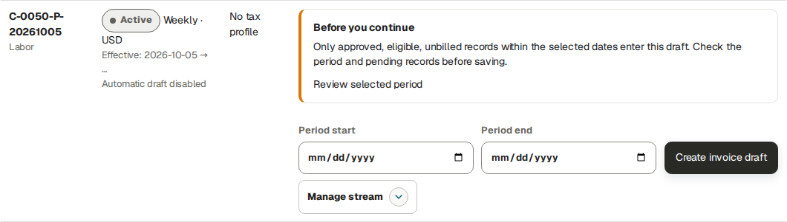

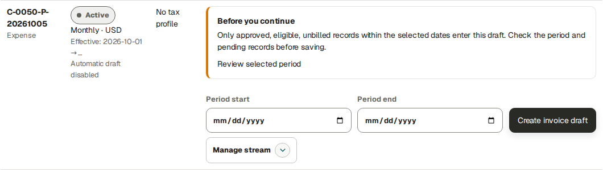

## Create and review the customer invoice draft

Go here: Billing → Invoices → Create invoice

Context: Reference procedure · checked against current source; not yet executed in this role lab

A draft reserves or calculates eligible sources but has no final invoice number. Its preview honestly identifies it as a draft. A draft PDF is never a confirmed invoice.

The create wizard reviews project, stream, period, eligible sources, commercial calculation, client/issuer information, reporting and financial totals. Exact labels and blocked checks are the working instructions; do not continue through an unresolved requirement.

### Do the task

1. Select BBS and the correct Labor or Expense stream. Enter the intended Period start/end and output language.
2. Review each numbered wizard stage. Match source IDs, actual hours, customer units, expense treatment, tax and total to the agreement.
3. Create the draft once, then open Manage for the saved document.
4. Use Edit draft for permitted document/stream fields, save, and reread totals. Shared issuer/stream edits may affect more than the current draft.

### Verify the result

- The saved period/stream and eligible source rows are correct. Existing issued source links do not count a second time.

### If you get stuck

- If Create returns an existing invoice for that stream/period, inspect that existing document. Late work is not silently appended to an issued PDF. A new stream on an all-in project may inherit the full fixed fee; it is not an automatic hourly recovery route.

## Approve, issue and download a final invoice

Go here: Billing → Invoices → Manage → Approve → Issue invoice

Context: Worked example · actual Finance account approved and issued the fictional USD 1 debit under the existing Owner-configured synthetic numbering fixture. Native artifact processing reached Ready; authorized final PDF download returned 200. Recalculate and source-linked draft editing are source-checked reference procedures, not executed in this role lab.

Approval and issuance are different states. Under an existing approved Owner numbering policy, authorized Finance can issue the reviewed approved document. Issuance allocates the number and preserves a historical financial snapshot.

Before issuance, compare customer/project identifiers, cost center, issuer, currency, issue/due/service dates, eligible source treatment, tax and total. A draft preview is an aid to this review, not evidence of issuance.

The actual Finance-issued training debit is JA-DEMO--2026-000004, USD 1.00. Its issue date is October 5 in the server’s UTC view, during the October 6 local role exercise. This new document is excluded from the original three-invoice worked totals.

Use the upper Invoice · PDF panel’s Ready/Open PDF/Download PDF controls for the native issued master. An optional lower language-output panel can say Not generated yet while this master is already Ready; that is not a draft state or permission to rewrite the issued master.

### Do the task

1. On the reviewed draft click Approve. Verify approved state.
2. If an approved unissued calculation needs refresh, enter a genuine Recalculation reason and use Recalculate and review draft. Recheck the resulting draft before approving again.
3. Select the offered report language and click Issue invoice once. Wait for the final artifact to become Ready.
4. Open the invoice PDF and download through its authorized control. Verify number, issued state, total and native PDF.

### Verify the result

- The document has a real application-assigned training number and final Ready PDF. Its PDF does not show Draft invoice or Draft preview. Ready is distinct from queued/failed.

### If you get stuck

- Finance cannot invent numbering approval or void an issued invoice. Escalate a blocked issuer/numbering check to the Owner. Preserve an issued master; use a new authorized adjustment/correction instead of editing history.

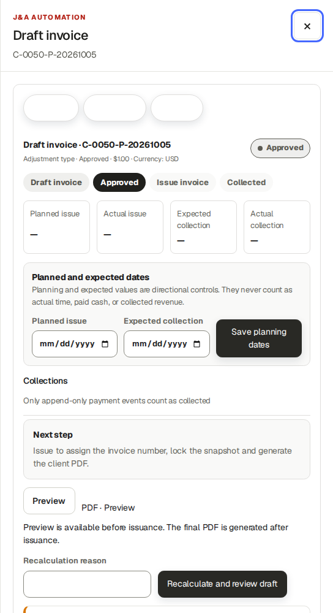

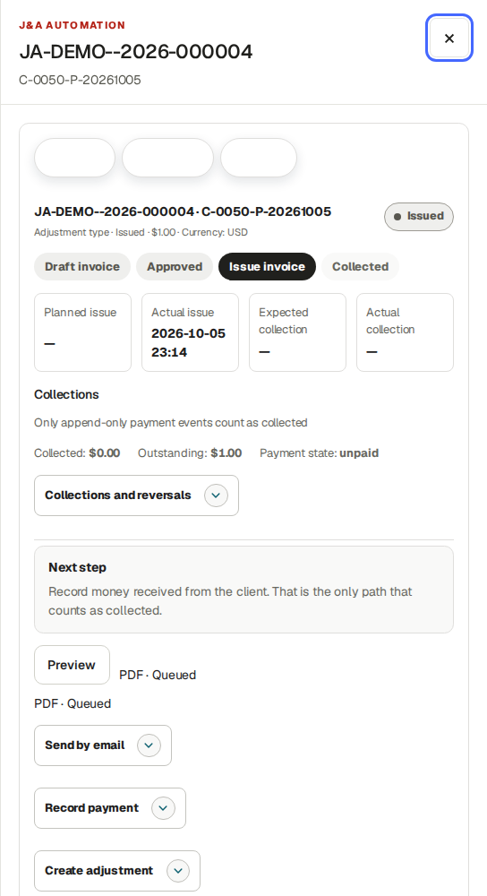

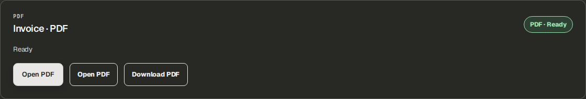

## Deliver an invoice and inspect the real result

Go here: Billing → Invoices → Manage → Send by email; More actions → Mark sent

Context: Reference procedure · checked against current source; not yet executed in this role lab

Downloading does not send a document. Mark sent records manual delivery; it does not invoke email. Use that control only after genuine delivery. Send by email requires an explicit recipient and Yes consent.

Training email is disabled. A previous bounded synthetic test verified queuing and failed automatic retry before network delivery. This guide does not claim customer email, SMTP acceptance or inbox arrival.

### Do the task

1. After reviewing the native final PDF, open Send by email. Enter the verified Invoice recipient email.
2. Choose No to decline, or Yes only when delivery is authorized and correctly configured. Inspect the per-recipient result.
3. Distinguish Queued, delivery error/automatic retry pending and SMTP acceptance from actual inbox confirmation.
4. While an invoice still shows Issued and More actions → Mark sent is offered, use it only after verified delivery by another channel. A partially paid/paid record may omit that manual action; do not invent a dispatch event or claim the absent control sent an email.

### Verify the result

- The recipient, consent and delivery state match what happened. A repeated identical invoice/recipient/PDF command is idempotent. Collection remains a separate process.

### If you get stuck

- The Owner panel has no manual Retry button here. A configured worker retries transient failures. Ask the administrator to investigate mail configuration or uncertain/terminal delivery before initiating another send. Training fixtures never prove real delivery.

## Record a collection and correct it with a reversal

Go here: Billing → Invoices → Manage → Record payment; Collections / Ledger

Context: Worked example · actual Finance account recorded a synthetic USD 1 receipt on the mixed invoice, then reversed that exact receipt. No bank transfer occurred. Net collection and receivable returned to USD 500 and USD 1,760; both events remain in history.

Record only verified money received in real operation. Training receipt/reversal entries are explicitly simulated; the application does not move bank funds.

The ledger preserves Gross, Reversals, Net and Outstanding. A reversal corrects the posted ledger receipt and is not itself a bank refund. The original payment remains in history.

The USD 2,260 mixed invoice starts with USD 500 net collected and USD 1,760 remaining. Recording the USD 1 practice receipt gives USD 501 collected / USD 1,759 remaining. Reverse only the BBS ROLE GUIDE SYNTHETIC receipt for USD 1, effective October 5, reason Entry correction. Net amounts return to USD 500 / USD 1,760. The separate USD 1 debit still adds its own receivable; reversing a collection does not cancel an adjustment.

### Do the task

1. Open the intended numbered invoice and Record payment. Enter Amount, verify Currency, choose Received on and provide Payment reference.
2. Save, then verify the collection entry and remaining receivable in Collections / Ledger and the invoice detail.
3. To correct the specific receipt, open Collections and reversals and enter Reversal amount, Effective date, Reason code and Reason. Click Reverse payment.
4. Reopen and reconcile gross receipt minus reversals equals net; invoice total minus net equals outstanding.

### Verify the result

- Partial collection leaves a balance. The original invoice face/PDF remains unchanged. A repeated money command must not double count.

### If you get stuck

- An overpayment/over-reversal, incorrect currency or invalid effective date is a blocking check. Inspect existing events before retrying; preserve the posted original and use the supported reversal for an error.

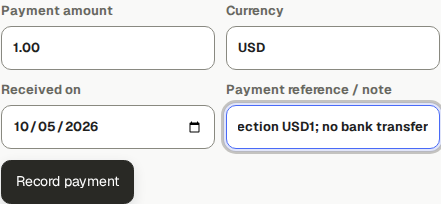

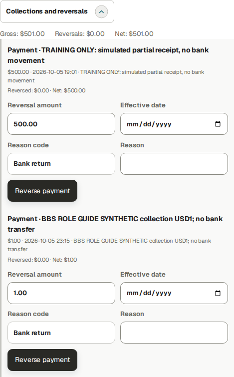

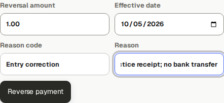

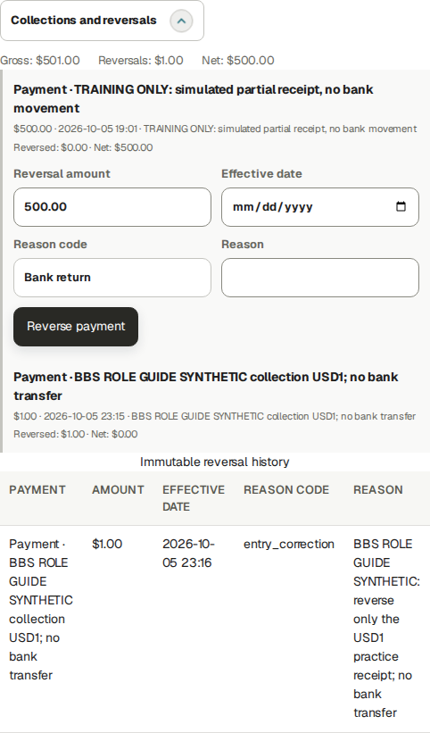

## Correct an issued amount without rewriting its master

Go here: Billing → Invoices → Manage → Create adjustment

Context: Worked example · actual Finance account created a separate synthetic USD 1 debit linked to JA-DEMO--2026-000003, approved it and issued JA-DEMO--2026-000004. Original three issued PDF hashes remain unchanged. Credit/correction types are reference procedures, not executed in this role lab.

Create adjustment offers Credit, Debit or Correction with a positive input amount and explicit reason. A credit creates a separate negative draft. Review, approve and issue that new document under the policy.

A linked credit is not a receipt of money. The original invoice total remains preserved. Finance does not have the Owner’s issued Void control; an invoice with collections also needs a reviewed collection remedy before permitted voiding.

### Do the task

1. Open the original final document, confirm its number and reason for correction, then Create adjustment.
2. Choose the correct type, enter Amount and an auditable reason. Inspect the newly saved linked draft and sign of the result.
3. Review → Approve → Issue invoice and verify its own number, state and final PDF.
4. Reconcile both documents and the ledger. Hand an Owner-only void or replacement decision to the Owner with exact document/payment IDs.

### Verify the result

- Both original and correction remain traceable. No original source amount, invoice number or native PDF is overwritten.

### If you get stuck

- The UI has no direct universal issued Replace operation. Do not promise Create for the same issued/voided period will create a replacement. A source-linked draft may require Owner discard; provide the reason and source IDs.

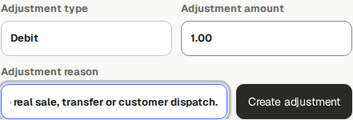

## Finalize a worker’s compensation period

Go here: Economic Review → BBS → Source records → Settlements

Context: Worked example · actual Finance account inspected the three existing finalized BBS settlements and independently tested payment/reversal on Technician 1. Finalize compensation and Save expected date here are source-checked reference procedures; no overlapping new settlement was created.

Before finalization, confirm full-period assignment coverage, dated pay rules, approved work, currency, active corrections and any existing finalized period. Choose the agreed worker period independently of the customer invoice cadence.

The BBS chief’s opening example is ten approved hours at USD 40/h = USD 400. Source duration is hours/minutes; it must never be read as currency. A fixed-period amount can have zero source duration and still be a valid agreed amount.

Future-ending periods in the earlier training example contain only work already recorded; they are not forecasts. Real payroll should wait until the agreed period is complete.

### Do the task

1. In Compensation settlements select Worker and enter Period start and Period end. Check the project heading and existing settlements.
2. After verifying completeness, click Finalize compensation once.
3. Confirm BBS remains selected. Reopen the saved worker/period and inspect Reviewed settlement, Actual paid and Remaining.
4. For a payment plan, enter Expected worker payment date and Save expected date.

### Verify the result

- Finalization creates a financial snapshot, not a bank transfer. An expected date is planning. No overlapping duplicate settlement should be created for the same work.

### If you get stuck

- Missing assignment/rule, active correction, currency conflict or already-finalized coverage needs investigation. Retain exact worker/project/period and hand a genuine rule/correction problem to the Owner/reviewer.

## Record and reverse an actual worker-side payment

Go here: Economic Review → Settlements → Actual worker or supplier payments

Context: Worked example · actual Finance account registered a synthetic USD 1 partial payment on the existing Technician 1 settlement, then fully reversed that exact payment. Native bank-transfer warnings were retained; no bank transfer occurred. The finalized compensation snapshot was not changed.

Use a finalized settlement and verified real transfer in actual operation. Authorized supplier payees depend on the existing worker/supplier relationship; do not select an arbitrary company.

Payment history is append-only. The tested isolated training payment/reversal does not prove a bank transfer. A corrected or reversed payment leaves the appropriate remaining obligation.

The existing Technician 1 reviewed settlement is USD 720 for October 1–31 with expected payment November 3. It was deliberately finalized early in training and contains the saved snapshot only; this is not a recommendation to close an incomplete real pay period. The practice payment gives USD 1 paid / USD 719 remaining; full reversal restores USD 0 paid / USD 720 remaining. The planned date and reviewed amount stay unchanged, and both payment events remain visible. No new worker work is settled or invoiced in this practice.

### Do the task

1. In the correct settlement choose Payee, Actual payment amount, Actual payment date and Payment reference; add Note if needed.
2. Click Register actual payment, then inspect Actual paid, Remaining and the new payment event.
3. For an erroneous posted event use its Reversal date and Reason and the offered reversal action.
4. After a reversal, check the restored remaining balance before recording any genuine replacement payment.

### Verify the result

- The selected project/worker remains correct after posting. Reviewed obligation and paid cash are separate. Each event retains its own recipient/reference/date.

### If you get stuck

- Do not delete a payment or weaken replay protection to retry it. Inspect payment/reversal history and use the supported remaining-payment action. A payment cannot exceed the remaining obligation.

## Record a verified expense reimbursement

Go here: Economic Review → Source records → Settlements → Worker reimbursement queue

Context: Worked example · actual Finance account verified visible USD 12 against hidden reviewed 1200 minor units at 1440/768/390 widths, then recorded the authorized synthetic reimbursement once. Saved Reimbursed state and actual timestamp were verified. No bank transfer occurred.

A Finance-reviewed worker-paid expense can create a reimbursement obligation under its dated treatment. Company-paid purchases do not automatically become money owed to the worker. Customer expense recovery is a different invoice amount.

The new fictional October 6 bench-supplies expense is USD 12. Finance recorded BBS-ROLE-SYNTHETIC-REIMBURSEMENT-12-USD only in the isolated lab; the native saved state is Reimbursed with actual timestamp October 5 23:21:28 UTC. This practice adds a reimbursement event separate from the original USD 180 checkpoint and does not bill the new worker source. The intended reviewed amount is visible before Mark reimbursed.

### Do the task

1. Select BBS and open Settlements. Find Worker reimbursement queue. Verify the exact worker, expense, reviewed amount, currency and receipt.
2. After an actual transfer in real operation, enter Payment reference and click Mark reimbursed for the reviewed remaining amount.
3. Reopen the register and expense. Verify reimbursement amount/reference/state and what remains owed.

### Verify the result

- Marking reimbursed records actual-state evidence; it is not a bank-transfer instruction. Customer invoices and purchase amount are unchanged.

### If you get stuck

- If no reimbursement is owed or a source is not ready, inspect payer, classification, receipt and Finance review. Do not pay the same purchase twice or treat invoice collection as reimbursement.

## Explain economics, cash and workbook exports

Go here: Economic Review → BBS; Projects → BBS → Billing → Invoices and advanced settings

Context: Worked example · actual Finance account inspected current BBS economics and downloaded the October 1–5 native project XLSX with status 200 and its semantic filename. It includes later practice events issued on the same UTC date; original workbook checkpoint totals are historical, not forced current totals.

Actual/approved/billable hours, potential customer charges or WIP, issued invoice totals, collections and receivables are different. Contribution is an economic calculation within the view’s scope, not cash or a complete statutory profit statement.

Internal loaded labor cost and worker compensation can overlap economically. Do not add the loaded cost and the separate compensation display twice. Planning/reference hours, forecasts and expected dates never create actual work or cash.

Download finance export produces native XLSX. Summary, Labor, Expenses, Unbilled WIP, Daily minimum, Invoices, Invoice expenses, Milestones and Alerts explain the source basis. Empty values are not automatically zero.

The current role-lab overview after additional approved practice work shows 50.75 actual hours, USD 4,673 invoiced, USD 1,888.25 direct cost and USD 2,795.75 contribution. These differ from the original checkpoint because later worker/chief/correction sources and the separate USD 1 debit exist. The practice debit was issued October 5 UTC during October 6 local training, so a fresh October 1–5 export can include it. Compare document/source identity and generation time as well as dates.

The displayed Direct project result uses Revenue candidate USD 4,684, including USD 11 approved unbilled WIP: USD 4,684 − USD 1,888.25 direct cost = USD 2,795.75. It does not subtract cost from USD 4,673 invoiced. Net receivable is USD 3,991 after the separate USD 1 debit; receivable and projected contribution are different measures.

The current overview also displays Finance records need review for incomplete projection data. Investigate those alerts before treating displayed cost/revenue as a complete reconciled contract result; missing configuration is not zero cost.

### Do the task

1. Select BBS and the intended dates. Follow an unexpected figure into its source records and dated rules.
2. Open Projects → BBS → Billing → Invoices and advanced settings → Download finance export.
3. Verify the semantic project/date filename, then open Summary and relevant source sheets.
4. Compare work dates, invoice issue dates and collection/reversal dates before comparing project workbook, ledger and Accounting period totals.

### Verify the result

- The original 1–5 October example excludes separately labelled 6 October role practice. Workbook export does not approve or issue anything. A portfolio file can contain other authorized projects and must stay with its financial audience.

### If you get stuck

- For a mismatch check scope, currency, approvals, cost model, source links, issue date and missing rules. Ask support with the exact record/code; do not edit an issued source to force a total.

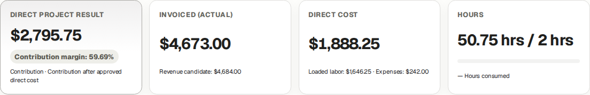

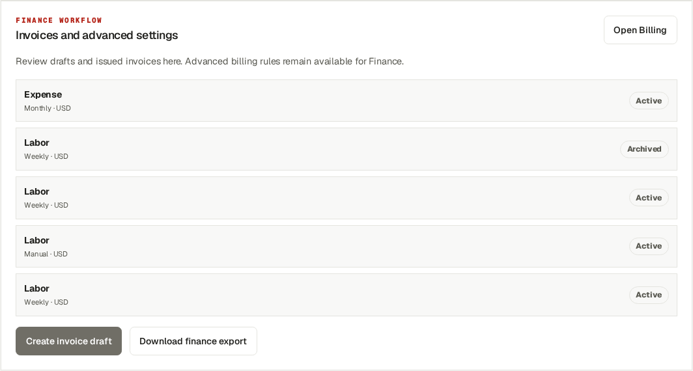

## Generate, review and finalize an Accounting Pack

Go here: Accounting → Generate monthly Accounting Pack

Context: Worked example · actual Finance account attempted October 1–5 Accounting generation in the original copied BBS portfolio and received the preserved issuer-history coverage blocker. Selected dates remained intact and Packs stayed 0. Review/finalization of a successful pack is a separately labelled Owner reference, not a Finance role-lab success.

Accounting is an authorized portfolio period, not a BBS-only workbook. Generate queues independent PDF, XLSX, Invoice CSV, Expense CSV and JSON artifacts. Normal Finance users wait for processing; they do not run deployment or job commands.

The copied BBS October 1–5 portfolio is blocked by preserved archived issuer QA-W48-EUR coverage ending October 5 exclusive. Its dates remain selected. Archiving again, inventing a successor revision or deleting sources is not a remedy.

A separately labelled all-synthetic Accounting portfolio successfully generated/finalized October 1–5 with zero review advisories in the Owner lab. That reference is a different database/issuer history and does not repair the BBS coverage gap.

### Do the task

1. Expand Generate monthly Accounting Pack and enter Period start, Period end and Report language; click Generate pack.
2. Wait for each format to show Ready, then download through the authenticated control. Queued/Failed are truthful separate states.
3. Open Review before finalizing. Investigate Pending records, Unclassified expenses, Missing documents, Reconciliation issues and Changes since generation.
4. Reconcile included figures and establish the legitimate reviewed cut with responsible accounting. Regenerate if sources changed, then Finalize reviewed version when permitted.

### Verify the result

- A zero reconciliation count does not prove every omitted operational record or receipt is complete. Final preserves the reviewed version; later source changes require another version. Older frozen invoice evidence follows its issue-date cut without moving old costs.

### If you get stuck

- For the actual BBS issuer gap retain the intended dates and use Contact support. Never fabricate accountant approval, issuer coverage or evidence to obtain Ready. Artifact failure/retry requires investigation of the stated artifact, not a manual production command.

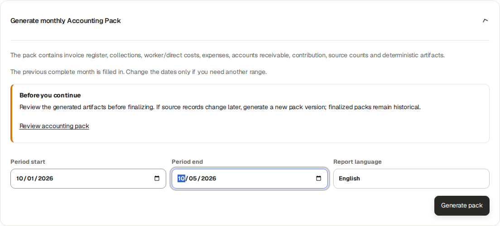

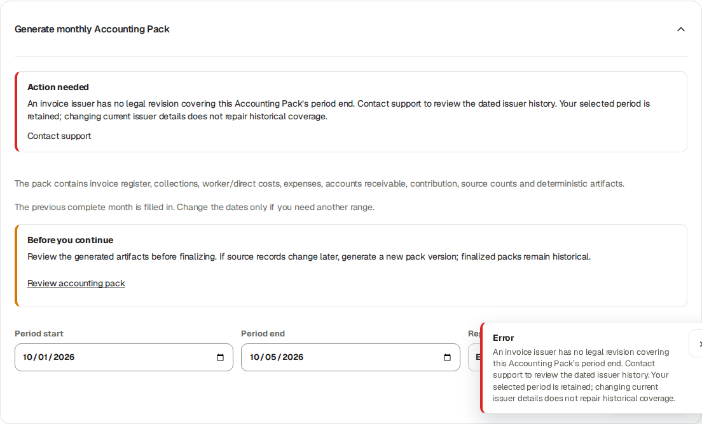

## Close a billing period and handle late work

Go here: Billing → Billing streams → Manage stream → Close sources

Context: Worked example · actual Finance account inspected the saved Weekly Labor stream and its Close sources date/language controls. No closing transition was executed in this role lab. Successful weekly close and late-source handling are a separately labelled Owner training reference.

Close sources is separate from invoice issuance, customer acceptance, worker payment and project closure. Required reports and acceptance must be genuinely satisfied for the selected snapshot.

For weekly cadence use the exact Monday–Sunday period. Closing locks eligible leftover approved sources and queues reports. Late operational work does not silently join an already issued invoice; customer treatment follows the actual agreement.

### Do the task

1. Select the correct BBS stream and inspect its open/closed period and readiness reasons.
2. In Close sources enter Close period start, Close period end and Report language, then use Close sources when ready.
3. Verify closed state and independently queued/Ready customer/internal report outputs.
4. For a late entry, complete its operational and Finance review, inspect whether it is unbilled/unlocked, and decide its correct contract treatment with the Owner.

### Verify the result

- The original issued number/total/PDF remains intact. A fixed/all-in additional-work source is not automatically an extra hourly charge.

### If you get stuck

- If dates/readiness or an existing closed period block the action, correct the supported prerequisite or inspect existing closure; do not create duplicate work/periods. The successful weekly-close/late-work lesson in the Owner manual uses a clearly separate synthetic Accounting project.

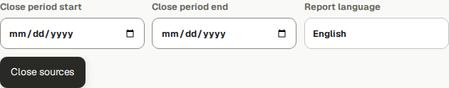

## Finish the cycle and hand off an exception

Go here: Finance Overview; Help; Profile

Context: Reference procedure · checked against current source; not yet executed in this role lab

Check actual obligations and balances after each workflow. A read notification is not business approval; a final invoice is not delivery or collection; a reviewed settlement is not paid cash; a Ready artifact is not acceptance.

Keep dates, references, source IDs and visible error codes in a restricted support handoff. Never send broad portfolio exports, credentials or unrelated worker payment information to a customer.

### Do the task

1. Check the selected project and financial audience before export or sharing.
2. For support give the exact role, project, record/number, intended dates, last successful state and visible message.
3. Use Profile for your own account/security preferences and Help for the relevant role/Owner reference; contact the workspace administrator for access.

### Verify the result

- The handoff explains what was blocked and what remained preserved. No claimed payment, email or customer acceptance exceeds observed evidence.

### If you get stuck

- An application/support boundary is not a universal self-service unlock. Preserve final history and stop the specific unsupported transaction while other independent tasks continue.
