# Finance · BBS operating cycle

Financial review, customer billing, collections, worker obligations, exports and closing

## Before practising · live and training access

The company portal https://j-aautomation.com/j-aautomation/app is LIVE. A link to it never enters a simulation. For practice obtain a separately provisioned training URL, your own account, the permitted fictional project and dates, a visible environment identifier and the trainer’s reset procedure. Without those, use this guide as a read-only demonstration and enter only authorized genuine work.

Original BBS examples include historical live-deployment records. Later financial training exercises used isolated copies or separate synthetic portfolios. Each chapter identifies its dataset and checkpoint. A later screenshot does not change an earlier saved workbook or issued document.

A role, project membership, review permission, supplier authorization and dated crew delegation are separate. Use your own credentials and follow the tasks assigned to your role. Check the selected project and person before recording work.

### Verify the result

- Confirm your displayed identity, the environment, project number and work dates before saving. For training/reset or lost access contact admin@j-aautomation.com; send the route, role, project/record reference, time and visible error. Keep passwords, activation links, recovery codes and cookies private.

### If you get stuck

- For an empty project selector, ask the Owner to check account status and assignment/authorization coverage. Do not create a duplicate project or borrow another account.

## Access · activate the invitation and sign in

Go here: Your trusted invitation → Activate your account → Return to sign in → Profile

### Do the task

1. Check the portal address and named account against the invitation provided by the Owner. There is no public sign-up. For an already provisioned account, use the sign-in method supplied to you; do not attempt to activate someone else’s invitation.
2. For a single-use activation link, open Activate your account. Enter Full name and choose a Password of at least 12 characters, then Activate account. Wait for Account activated. You can sign in now. Do not repeatedly submit while Activating… is displayed.
3. Choose Return to sign in. Enter your account Email and Password and select Continue to workspace. If you previously enabled MFA, complete Verify your identity with the current Six-digit code and Verify and continue. Use a recovery code only through the offered Use a recovery code control.
4. Open Profile and verify the own-account name/email/role in Account security. Check the navigation and assigned project. A newly activated account can have zero assignments; activation alone does not grant project access or supplier/chief authority.

### Verify the result

- The activation success message precedes the separate sign-in. The illustrated new Worker signed in and reached their own Profile; no assignment or financial permission was implied.

### If you get stuck

- An expired or already used link displays This invitation could not be activated. It may have expired or already been used. If activation already succeeded, return to sign in. Otherwise request a new invitation from the Owner; reloading does not renew the old link.
- For offline, temporarily unavailable or rate-limited activation, retain the entered name/password privately, restore connectivity or wait for the displayed retry interval, then retry. An unconfirmed response is not proof of an active account.
- For an incorrect password, inactive account or lost access, contact admin@j-aautomation.com from your verified account/contact channel. Supply identity and the visible error; never send the password. This guide does not promise a public password-reset form. The initial Owner is provisioned by the platform operator; an existing Owner provisions the remaining team.

## Trainer setup · prepare a normal cycle before exceptions

Ask the trainer to provide the following checkpoint sheet before reproducing a lesson. Reusing a shared historical BBS period does not reset it. A production URL is never a training switch.

| Checkpoint | Required starting condition |
| --- | --- |
| Identity and environment | Own correctly provisioned role/profile; isolated URL and visible environment identity. |
| Project and dates | Exact project number, timezone and unused eligible lesson dates; membership and relevant grants cover both current access and the work date. |
| Source state | Named source IDs and durations/amounts; ordinary starting drafts/submissions; no unrelated correction already open. |
| Financial/evidence locks | List issued/closed periods, finalized settlements and signed report versions. Teach ordinary correction on an unlocked scope first. |
| Expected outcome | Saved state, source count, actual total and appropriate own/customer/internal output. Include the receiving role and result. |
| Reset | Operator restores the prepared database AND private documents together to the named checkpoint while training is stopped. Trainees do not delete financial history to reset a lesson. |

### Verify the result

- The new normal Worker/Chief lesson uses BBS READINESS · normal work cycle (C-0050-P-2026100601) with initially unfinalized October work. Original BBS locked-period examples are exceptions. External/Supplier/PM October 13–19 and Finance October 26 demonstrations are separately labelled; Accounting can use a separate clean synthetic portfolio.

## Review authority · who receives each source

Review is determined by the actual source, base role and current dated grants. Chief delegation alone grants recording, not approval. A Worker with Can review checked does not become a Project Manager or Finance user. Send a factual correction reason with every return.

| Source / recorder | Operational reviewer and prerequisite | Next handoff |
| --- | --- | --- |
| Internal own or chief-delegated time | Owner or Finance; assigned PM with current active Can review membership for this project. | Owner/Finance records commercial Billable or Non-billable review separately. |
| External/supplier time, including coordinator own time | Authorized Owner. Supplier authorization/recorder provenance keeps these sources outside the ordinary PM time queue. | Finance review follows Owner approval. |
| Own/delegated expenses | Owner or Finance; assigned PM with current project review grant. Check factual purchase, payer and evidence. | Owner/Finance completes the required classification and reimbursement review. |
| Daily and Technical reports, including supplier profiles | Owner or Finance; assigned PM with current project review grant and permitted project scope. | Owner/Finance prepares the customer period report and version-bound acceptance where required. |
| PM’s own work | Route it to another authorized reviewer for an independent factual check. Do not infer a universal self-review prohibition solely from a job title. | Use the appropriate personal output and verify the review state. |

### If you get stuck

- If the intended source is absent, check source type, state, dates, assignment/review grant and supplier authorization before searching another queue. A review-enabled Worker Chief variant is not exposed by the current role model; Owner must provision the genuinely permitted reviewer role and grant. Never use a colleague’s credentials to bypass this boundary.

## Start with your Finance account

Go here: Sign in → Finance Overview

Context: Worked example · actual Finance account in the isolated BBS role lab; navigation and phone drawer verified. Later role practice is separate from the original October 1–5 checkpoint.

Use the individual Finance account issued by the Owner. The platform role is finance_admin. Sign in with your own credentials; the Owner is responsible for creating and activating access. The worked project is C-0050-P-20261005 — BBS · Ejemplo de manual. Original BBS Mexico and Junkers are outside this exercise.

Practice only in a separately authorized training environment. The native issued training invoices, numbering approval fixture and simulated money records are not production transactions. New 6 October role exercises are separate from the original 1–5 October calculation examples.

Finance Overview is the starting control view; Economic Review provides source records and settlements; Commercial Configuration holds dated commercial treatment; Billing creates and manages customer documents; Collections / Ledger records receipts and reversals; Accounting creates a portfolio period pack. Notifications, Profile and Help support your own account.

### Do the task

1. Check the active account and language. Select the BBS project before a project-specific action.
2. On a phone, open the navigation menu or More for destinations outside the bottom bar. Close the drawer to work in the page.
3. Follow an amount or alert into its underlying source rather than treating every displayed total as the same financial measure.

### Verify the result

- The project selector and heading agree. You see Finance navigation, not Owner administration or Audit.

### If you get stuck

- An absent project, inactive account or permission error requires an Owner/support handoff. Do not borrow another person’s account.

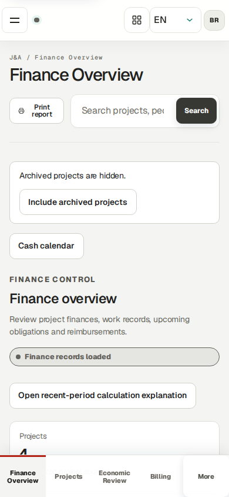

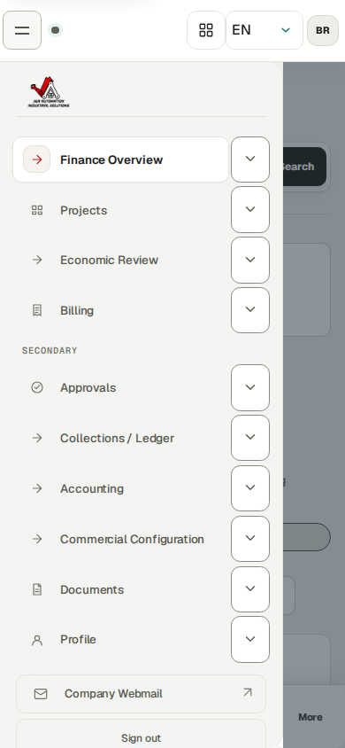

## Reconcile a work plan with actual source hours

Go here: Economic Review → select BBS → Source records → Time entries

Context: Worked example · separate isolated BBS assignment lab · synthetic October 20, 2026 · authenticated Finance browser session after operational approval

Project membership permits dated access; a published planning assignment is an operational reference. Expected working hours are a separate dated schedule. None of these creates actual time, Finance review, an invoice, a compensation settlement or a payment.

The isolated October 20 exercise published eight planned hours to each of three internal workers. Their separately saved and operationally approved sources contain six hours for Technician 1, seven for Technician 2 recorded by the delegated Chief, and eight for the Chief: 21 actual hours, not the 24 planned hours. This synthetic exercise is outside the original October 1–5 financial checkpoint.

The weekly timesheet compares Actual against the effective Expected schedule. Difference is Actual minus Expected; Needs note flags a mismatch and can coexist with an Approved source. It does not mean a finalized payment or a failed operational approval. A missing expected figure is not assumed to be zero.

There is no dedicated worker-goal acceptance or completion workflow. Daily/Technical reports describe completed tasks, problems and next steps. Project milestones and commercial budgets have separate lifecycles; meeting a hours target is not evidence that a milestone is approved.

### Do the task

1. Select C-0050-P-20261005 · BBS · Ejemplo de manual. Open Source records → Time entries.
2. Use Search: Source records to enter 2026-10-20. Read the filtered count, individual worker, actual hours, source state and billing state; the broader Time source records count still describes the full selected project.
3. Confirm the three Approved operational sources show six, seven and eight hours. Follow the exact source link when investigating a discrepancy; do not substitute planned hours for recorded time.

### Verify the result

- The three sources are Approved and retain 21 hours of actual work. Planning did not manufacture the missing three hours.
- Finance determines commercial treatment separately; do not finalize obligations from an hours target.

### If you get stuck

- For incorrect actual work, request the state-appropriate operational correction. For an incorrect plan or expected schedule, ask the Owner or authorized Project Manager. These are different records.
- Supplier time follows the J&A Owner operational-review handoff, whereas an authorized Project Manager may review the supplier Daily report. A missing supplier time item in the ordinary PM queue does not justify duplicate entry.

## Know your authority and the Owner handoffs

Go here: Billing → Configure billing; Projects → project → Billing

Context: Reference procedure · checked against current source; not yet executed in this role lab

Finance may review billability and expense treatment, maintain permitted commercial rules and billing streams, create/review customer invoices, issue an approved invoice under an existing numbering policy, record collections and worker-side payments, and generate/review/finalize Accounting Packs. Every operation is still checked on the server against a live account and the applicable record.

Owner-only tasks include legal invoice issuer/numbering policy setup and voiding an issued invoice. Finance does not gain Owner account management or the Audit workspace. A source-linked draft can also require Owner intervention to discard.

The original three issued BBS documents total USD 4,672: opening labor 2,230, expenses 182 and mixed hourly/daily/weekly labor 2,260. Preserve their numbered native PDFs. Practice adjustments are new linked documents; they never replace the original face amount.

### Do the task

1. Before invoice work, ask the Owner to confirm issuer/date coverage, the approved numbering policy, project assignments, dated person terms and required reporting/acceptance.
2. Review the real approved contract before choosing hourly, daily, weekly, all-in or capped treatment.
3. Hand the Owner the exact blocked invoice/stream/person ID, intended dates and visible message when Owner authority is required.

### Verify the result

- No invented accountant approval date, customer signature or bank transfer enters a real record. Issuing is separate from delivering or collecting.

### If you get stuck

- If no approved numbering policy exists, stop issuance and ask the Owner/accountant for prefix, digits, effective date and genuine approval timestamp. A proposed convention is not approval.

## Review actual work after operational approval

Go here: Approvals → Finance review

Context: Worked example · FN01 · actual Finance Record Finance review on a separate synthetic October 26 source; before and saved after states verified.

Operational approval and Finance billability are separate decisions. Internal time can be reviewed by Owner/Finance or a Project Manager with the applicable project grant; a Chief assignment alone does not authorize approval. Supplier TIME is an Owner review handoff. Finance review then determines commercial eligibility without changing actual hours.

The October 26 training source records one hour for Technician 1. Owner created/submitted/operationally approved the authorized on-behalf example; Finance selected Billable and recorded its Finance review. It was subsequently included in the normal USD 600 invoice under the existing full-day agreement. This is separate from the original October 1–5 checkpoint and the October 20 planning exercise.

### Do the task

1. Open Approvals and use Search Finance review to identify the exact BBS person/date/source. Review actual duration, operational Approved state, category, current version and correction links.
2. In that row choose Commercial treatment → Billable or Non-billable under the dated agreement. Click Record Finance review once.
3. Reload the exact source detail or Economic Review source row. Verify the saved billability and unchanged actual duration before invoice preparation.

### Verify the result

- Before review the one-hour source needed Finance classification; after review it is Billable and still one actual hour. An empty filtered queue alone does not establish a missing source’s state.

### If you get stuck

- If the source is absent, inspect operational state, person/project scope, search filters, dated rules, correction state and existing invoice links. Ask the operational reviewer to correct the real source; never duplicate it to make billing work.

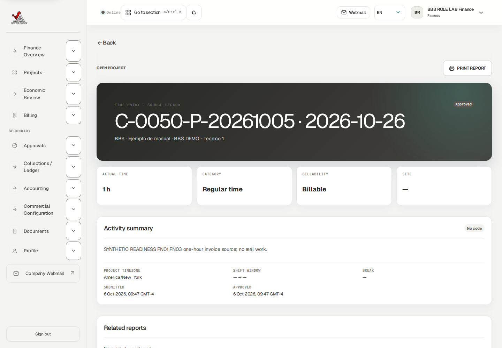

## Classify an expense before Finance review

Go here: Approvals → Finance review → Classify expense in Finance

Context: Worked example · actual Finance account classified the new fictional October 6 USD 12 worker expense using saved at-cost policy, then recorded Finance review. No purchase or reimbursement transfer occurred.

Review the exact expense record, its receipt and the approved instructions for this project.

Check receipt, currency, payer, work date and project before classifying. A document in quarantine or awaiting a scan is not usable verified evidence.

The role exercise uses the fictional USD 12 bench-supplies expense dated October 6. Finance saved its classification and completed review. No purchase or transfer occurred.

### Do the task

1. Open Classify expense in Finance for the exact expense. Review existing expense and reimbursement policy/date coverage.
2. Choose the offered commercial treatment and reimbursement classification using the approved agreement; enter only supported verified project-currency values. Save the classification.
3. Return to Approvals, inspect the classified expense and complete Finance review.
4. Reopen the source and verify the saved classification and Finance review state.

### Verify the result

- The purchase amount and operational evidence remain intact; the exact source shows the saved review state.

### If you get stuck

- An unclassified expense cannot bypass Finance review. If foreign-currency projection is missing, use the exact expense/currency message to request a supported verified remedy; do not invent an exchange rate or change the purchase currency.

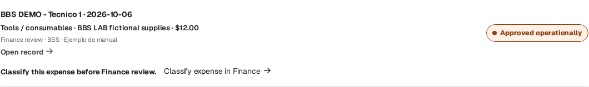

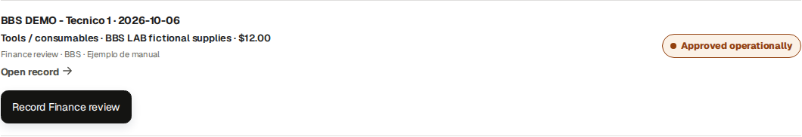

## Request the approved dated project setup

Go here: Owner handoff → project/person/effective date

Context: Reference procedure · project setup is documented in the Owner guide.

Before reviewing or invoicing a project, obtain the Owner’s approved setup and its applicable dates. Copying a form does not save it, and a future change does not update historical documents.

### Do the task

1. Send the Owner the project number, intended person, effective date and required agreement reference.
2. Check the Owner’s confirmation covers the intended source dates before continuing to Finance review or creating an invoice.
3. If a source reports missing or overlapping configuration, send the exact source, date and error to the Owner. Preserve the blocked source.

### Verify the result

- The approved setup covers the intended period, and the source passes its normal readiness checks.

### If you get stuck

- Wait for a documented authorized resolution. Do not move work dates, duplicate records or reverse payments to bypass a configuration guard.

## Create and review a billing stream

Go here: Billing → Billing streams → Configure billing

Context: Worked example · FN02 · Finance saved a new Manual Labor stream effective October 26 under the existing approved synthetic issuer/numbering fixture.

A billing stream chooses cadence, output template and invoice defaults. It uses configured project instructions and eligible approved sources. Saving the later Labor stream ended the previous Weekly stream on October 25; its historical invoice snapshots remain intact.

The tested stream uses Labor, Manual, effective October 26, JA-USA issuer, USD and Labor detailed template. Tax profile None requires the displayed review. Owner controls legal-issuer revisions and approved numbering; Finance uses an already authorized configuration.

### Do the task

1. Open Billing → Configure billing. In the billing-stream form select Project, Stream (Labor/Expenses/Milestone/Other), Cadence and Effective from.
2. Cadence options are Weekly, Every 14 days, Semi-monthly, Monthly, Custom, Milestone and Manual. Review Anchor date where shown; Every 14 days requires an anchor. Semi-monthly uses days 1–15 and 16–month end. Manual requires an explicit invoice/closing cut.
3. Set Invoice issuer (J&A Automation), Tax profile, Invoice template, Recipient email, Billing contact, Payment terms (days) and PO reference. Currency follows the project/issuer setup. Grouping follows the chosen template.
4. Choose Generate drafts when stream is due only when intended; click Save billing stream. Find the saved stream and verify its dates, cadence, issuer and historical predecessor.

### Verify the result

- Issuer coverage and approved numbering must cover actual issue dates. A populated proposed numbering convention is not genuine approval. A stream cannot override source readiness or customer acceptance requirements.

### If you get stuck

- For issuer/numbering gaps ask Owner with the intended stream and issue date. Preserve archived historical issuers and old invoice masters.

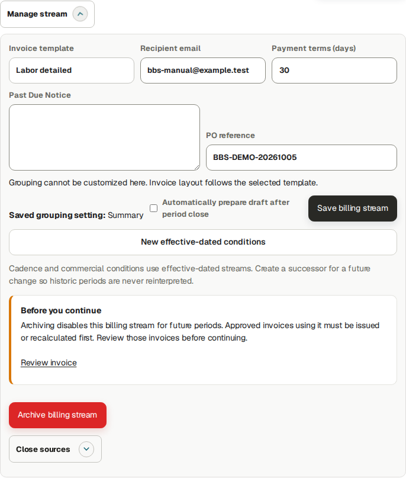

## Create and review the customer invoice draft

Go here: Billing → Invoices → Create invoice

Context: Worked example · FN03 · actual normal source-based invoice draft for October 26; the earlier USD 1 debit is a separate amount-only exercise.

Create invoice builds a draft snapshot from eligible approved, Finance-reviewed sources in the selected stream and cut. Save does not issue, number, send or collect the invoice. Review source inclusion and exclusions before saving.

The tested normal invoice includes one October 26 source with one actual hour. Its dated full-day customer rule charges one day × USD 600 = USD 600. Do not multiply the current hourly rate by actual hours when the applicable agreement uses a full-day unit.

### Do the task

1. Click Create invoice. Select Client / project and the exact Billing stream, then review Labor / expenses.
2. Set Period start and Period end; click Check selected period. Inspect Included records and Excluded / pending, following the exact source when investigating a blocker. The tested Manual cut is October 26–26.
3. Continue through Taxes, Invoice data, Banking / payment and Commercial adjustments. Verify authorized legal/customer details and currency, then Preview.
4. At Save / issue use Save invoice draft. Reopen the saved draft, reconcile its entire line table and source references, and resolve any discrepancies before approval.

### Verify the result

- The draft source line shows Actual recorded 1 h, Qty 1 day, Unit price USD 600 and line total USD 600. Dated source terms govern the invoice; planned hours do not create a charge.

### If you get stuck

- Correct the supported operational/commercial prerequisite and recheck the draft. Do not duplicate a source or modify historical invoices to force inclusion.

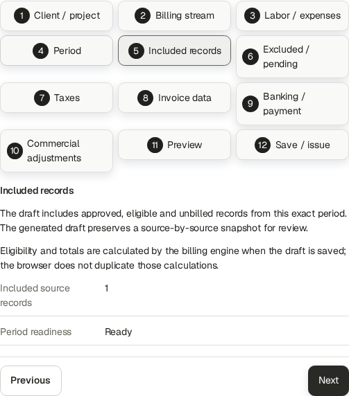

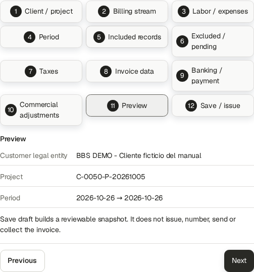

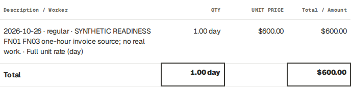

## Approve, issue and download a final invoice

Go here: Billing → Invoices → Manage → Approve → Issue invoice

Context: Worked example · FN03 · Finance approved and issued normal source-based JA-DEMO--2026-000005, USD 600; native final PDF downloaded privately.

Draft → Approved → Issued are distinct states. Issuing binds the invoice number and immutable native master under the existing issuer/numbering policy. PDF Ready is an artifact state, separate from invoice lifecycle and collection.

The actual training invoice JA-DEMO--2026-000005 is USD 600. It was issued October 6 for the October 26 training service cut under the approved synthetic fixture. This future-service training example is not a production recommendation or accountant approval. Public evidence shows the status and source table; the native PDF remains private because inherited issuer bank/contact details are confidential.

### Do the task

1. In Billing → Invoices locate the saved normal draft and open Manage. Review the entire source table, period, issuer, customer, totals and prerequisites.
2. Click Approve, then reopen and confirm Approved. Use Issue invoice with the intended supported language under the approved policy.
3. Reload Manage and verify final number, Issued, amount and PDF · Ready. Use Download PDF for the native issued master; compare number and total with the register.
4. Record delivery and collection separately only after the corresponding real event. A Ready PDF does not prove either event.

### Verify the result

- The native master download succeeded and its hash is retained in the readiness evidence. Cash reversal and separate adjustments do not alter this USD 600 face amount or its issued bytes.

### If you get stuck

- Queued means wait for normal processing; investigate an actual Failed message and permitted retry. For missing issuer coverage/numbering ask Owner with invoice ID and intended date. Optional language variants can be Not generated yet while the upper native issued master is Ready.

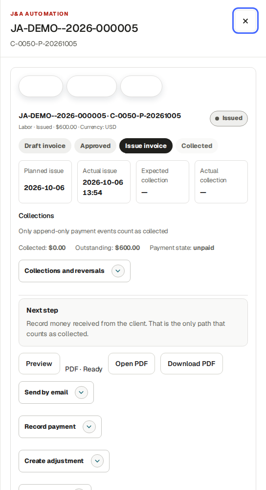

## Deliver an invoice and inspect the real result

Go here: Billing → Invoices → Manage → Send by email; More actions → Mark sent

Context: Reference procedure · checked against current source; not yet executed in this role lab

Downloading does not send a document. Mark sent records manual delivery; it does not invoke email. Use that control only after genuine delivery. Send by email requires an explicit recipient and Yes consent.

Training email is disabled. A previous bounded synthetic test verified queuing and failed automatic retry before network delivery. This guide does not claim customer email, SMTP acceptance or inbox arrival.

### Do the task

1. After reviewing the native final PDF, open Send by email. Enter the verified Invoice recipient email.
2. Choose No to decline, or Yes only when delivery is authorized and correctly configured. Inspect the per-recipient result.
3. Distinguish Queued, delivery error/automatic retry pending and SMTP acceptance from actual inbox confirmation.
4. While an invoice still shows Issued and More actions → Mark sent is offered, use it only after verified delivery by another channel. A partially paid/paid record may omit that manual action; do not invent a dispatch event or claim the absent control sent an email.

### Verify the result

- The recipient, consent and delivery state match what happened. A repeated identical invoice/recipient/PDF command is idempotent. Collection remains a separate process.

### If you get stuck

- The Owner panel has no manual Retry button here. A configured worker retries transient failures. Ask the administrator to investigate mail configuration or uncertain/terminal delivery before initiating another send. Training fixtures never prove real delivery.

## Record a collection and correct it with a reversal

Go here: Billing → Invoices → Manage → Record payment; Collections / Ledger

Context: Worked example · FN05 · actual USD 1 receipt and full reversal on the new USD 600 normal invoice. Both events are synthetic; no bank transfer or refund occurred.

Invoice face amount, invoice-specific cash and customer net position are separate measures. Record payment posts cash against the selected positive invoice. An issued credit is a separate customer balance; it does not automatically allocate to another invoice or represent a bank refund.

The tested USD 600 invoice becomes USD 1 net collected / USD 599 outstanding after the synthetic receipt. Reversing that exact USD 1 receipt restores gross USD 1, reversals USD 1, net USD 0 and invoice outstanding USD 600. Its separate USD 1 credit remains issued.

### Do the task

1. Open the exact invoice’s Manage → Record payment. Enter Payment amount, Received on and Payment reference / note; verify the displayed currency and real receipt evidence. Click Record payment.
2. Reload and check invoice-specific Collected, Outstanding and payment history before a retry.
3. Open Collections and reversals. Select the exact receipt and enter the offered Reversal amount, effective date, reason code and explicit reason; submit the reversal.
4. Reload both invoice and project/customer ledger. Reconcile gross receipt minus reversal to net collection, then compare the separate credit balance to customer net outstanding.

### Verify the result

- A reversal corrects recorded cash history and retains both events. It does not delete the receipt, cancel the credit, change issued totals, unlock a source or prove money was refunded.

### If you get stuck

- For duplicate/overpayment or a changed balance inspect the latest events and remaining amount; never delete posted history or use another invoice to hide an error.

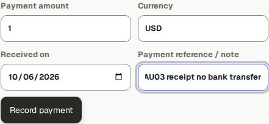

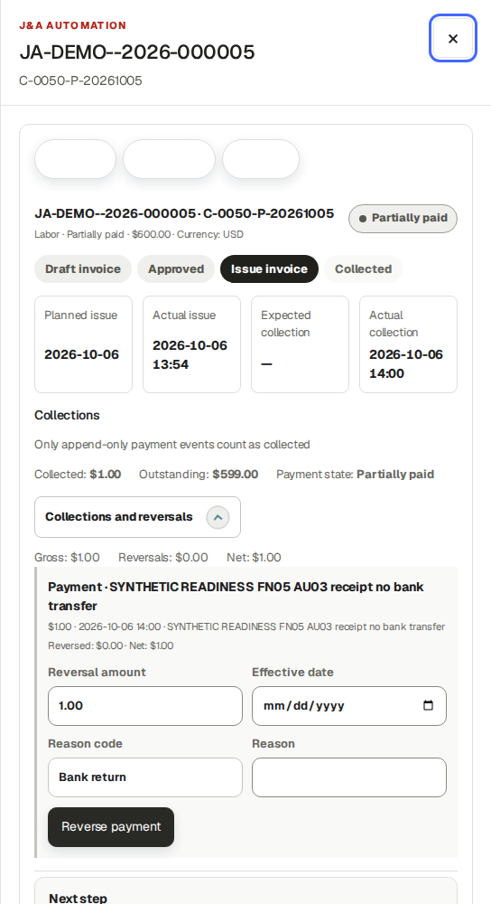

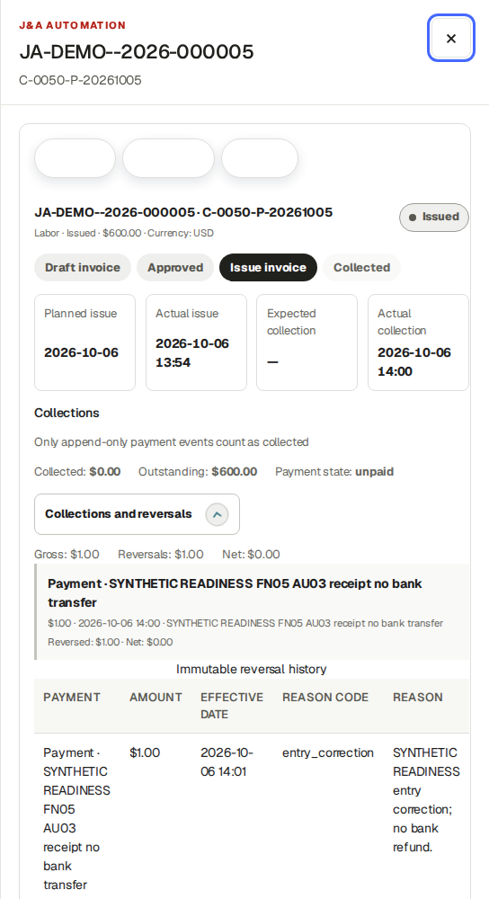

## Correct an issued amount without rewriting its master

Go here: Billing → Invoices → Manage → Create adjustment

Context: Worked examples · FN05 · earlier USD 1 debit preserved; new USD 1 credit linked to the normal USD 600 invoice, approved and issued by Finance.

Create adjustment offers Credit, Debit and Correction with Adjustment amount and Reason. The current form requires a positive amount. Credit creates a negative linked amount, Debit a positive linked amount, and Correction retains the entered sign; therefore a positive Correction in this UI increases the balance. It is not a full replacement invoice.

The original three BBS native invoices remain USD 4,672. The earlier amount-only debit JA-DEMO--2026-000004 remains USD 1. New source invoice 000005 is USD 600 and linked credit 000006 is −USD 1. The credit leaves the original face amount/PDF intact and creates a separate credit balance. No automatic allocation or refund is demonstrated.

### Do the task

1. Open the original final invoice → Manage → Create adjustment. Verify original number, currency and correction reason.
2. Choose Adjustment type, enter a positive Adjustment amount and a precise Reason. Click Create adjustment.
3. Reopen the new linked draft; verify its signed amount, original reference and reason. Approve and issue it under the existing authorized policy.
4. Reconcile original face amount, linked adjustment, invoice-specific receipts/reversals and customer net position separately.

### Verify the result

- Do not treat a credit’s positive displayed available balance as additional receivable. The application exposes no ordinary credit-to-invoice allocation or bank-refund workflow here.

### If you get stuck

- Escalate a required negative correction/replacement or credit allocation/refund that the displayed controls cannot express. Do not rewrite an issued document or record fictitious cash.

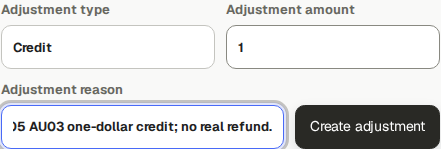

## Finalize a worker’s compensation period

Go here: Economic Review → BBS → Source records → Settlements

Context: Worked example · actual Finance account inspected the three existing finalized BBS settlements and independently tested payment/reversal on Technician 1. Finalize compensation and Save expected date here are source-checked reference procedures; no overlapping new settlement was created.

Before finalization, confirm full-period assignment coverage, dated pay rules, approved work, currency, active corrections and any existing finalized period. Choose the agreed worker period.

The BBS chief’s opening example is ten approved hours at USD 40/h = USD 400. Source duration is hours/minutes; it must never be read as currency. A fixed-period amount can have zero source duration and still be a valid agreed amount.

Future-ending periods in the earlier training example contain only work already recorded; they are not forecasts. Real payroll should wait until the agreed period is complete.

### Do the task

1. In Compensation settlements select Worker and enter Period start and Period end. Check the project heading and existing settlements.
2. After verifying completeness, click Finalize compensation once.
3. Confirm BBS remains selected. Reopen the saved worker/period and inspect Reviewed settlement, Actual paid and Remaining.
4. For a payment plan, enter Expected worker payment date and Save expected date.

### Verify the result

- Finalization creates a financial snapshot, not a bank transfer. An expected date is planning. No overlapping duplicate settlement should be created for the same work.

### If you get stuck

- Missing assignment/rule, active correction, currency conflict or already-finalized coverage needs investigation. Retain exact worker/project/period and hand a genuine rule/correction problem to the Owner/reviewer.

## Record and reverse an actual worker-side payment

Go here: Economic Review → Settlements → Actual worker or supplier payments

Context: Worked example · actual Finance account registered a synthetic USD 1 partial payment on the existing Technician 1 settlement, then fully reversed that exact payment. Native bank-transfer warnings were retained; no bank transfer occurred. The finalized compensation snapshot was not changed.

Use a finalized settlement and verified real transfer in actual operation. Authorized supplier payees depend on the existing worker/supplier relationship; do not select an arbitrary company.

Payment history is append-only. The tested isolated training payment/reversal does not prove a bank transfer. A corrected or reversed payment leaves the appropriate remaining obligation.

The existing Technician 1 reviewed settlement is USD 720 for October 1–31 with expected payment November 3. It was deliberately finalized early in training and contains the saved snapshot only; this is not a recommendation to close an incomplete real pay period. The practice payment gives USD 1 paid / USD 719 remaining; full reversal restores USD 0 paid / USD 720 remaining. The planned date and reviewed amount stay unchanged, and both payment events remain visible. No new worker work is settled or invoiced in this practice.

### Do the task

1. In the correct settlement choose Payee, Actual payment amount, Actual payment date and Payment reference; add Note if needed.
2. Click Register actual payment, then inspect Actual paid, Remaining and the new payment event.
3. For an erroneous posted event use its Reversal date and Reason and the offered reversal action.
4. After a reversal, check the restored remaining balance before recording any genuine replacement payment.

### Verify the result

- The selected project/worker remains correct after posting. Reviewed obligation and paid cash are separate. Each event retains its own recipient/reference/date.

### If you get stuck

- Do not delete a payment or weaken replay protection to retry it. Inspect payment/reversal history and use the supported remaining-payment action. A payment cannot exceed the remaining obligation.

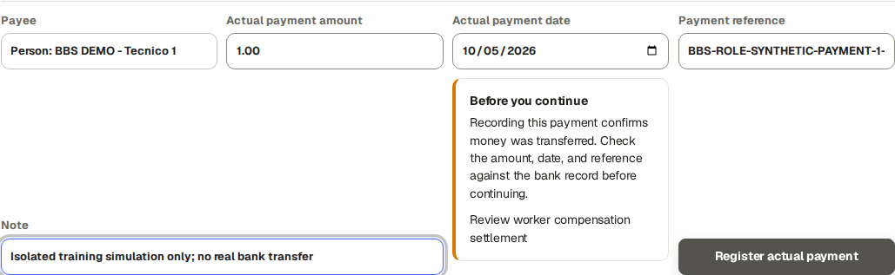

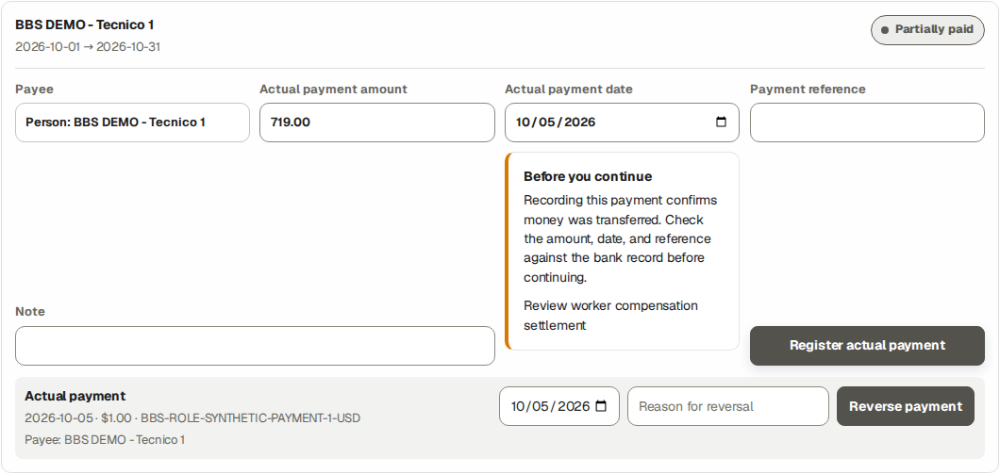

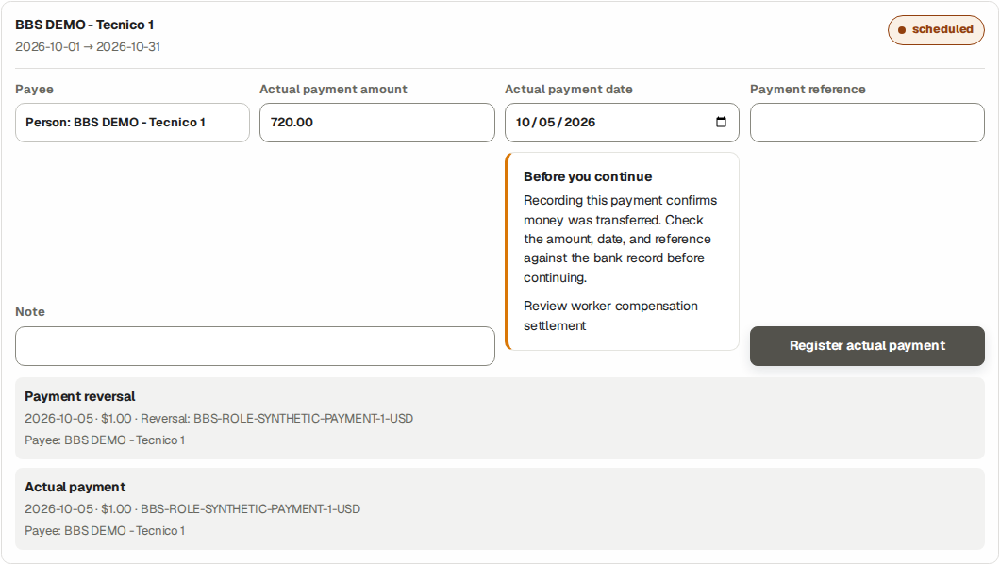

## Record a verified expense reimbursement

Go here: Economic Review → Source records → Settlements → Worker reimbursement queue

Context: Worked example · actual Finance account verified visible USD 12 against hidden reviewed 1200 minor units at 1440/768/390 widths, then recorded the authorized synthetic reimbursement once. Saved Reimbursed state and actual timestamp were verified. No bank transfer occurred.

A Finance-reviewed worker-paid expense can create a reimbursement obligation under its dated treatment. Company-paid purchases do not automatically become money owed to the worker.

The new fictional October 6 bench-supplies expense is USD 12. Finance recorded BBS-ROLE-SYNTHETIC-REIMBURSEMENT-12-USD only in the isolated lab; the native saved state is Reimbursed with actual timestamp October 5 23:21:28 UTC. This practice adds a reimbursement event separate from the original USD 180 checkpoint and does not bill the new worker source. The intended reviewed amount is visible before Mark reimbursed.

Mark reimbursed records the full reviewed worker reimbursement in one operation. The current UI supplies the displayed reviewed amount, a Payment reference and server recording timestamp; it offers no editable payment date, partial amount or reimbursement reversal control. Source validation rejects partial reimbursement and a different second final truth. An expected reimbursement date is planning, not the actual reimbursement timestamp.

### Do the task

1. Select BBS and open Settlements. Find Worker reimbursement queue. Verify the exact worker, expense, reviewed amount, currency and receipt.
2. After an actual transfer in real operation, enter Payment reference and click Mark reimbursed for the reviewed remaining amount.
3. Reopen the register and expense. Verify reimbursement amount/reference/state and what remains owed.

### Verify the result

- Marking reimbursed records actual-state evidence; it is not a bank-transfer instruction. Customer invoices and purchase amount are unchanged.

### If you get stuck

- If no reimbursement is owed or a source is not ready, inspect payer, classification, receipt and Finance review. Do not pay the same purchase twice or treat invoice collection as reimbursement.
- For a mistaken full reimbursement or backdated/partial requirement retain expense ID, reviewed amount/currency, reference and actual recorded timestamp and ask authorized Finance/Owner support. Do not record a compensation-payment reversal as an expense reimbursement reversal.

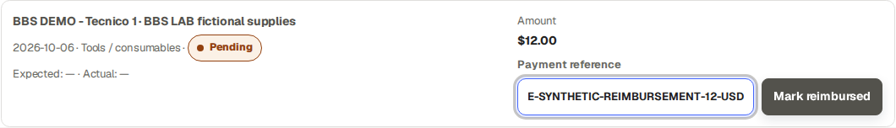

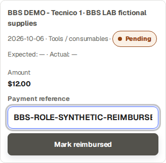

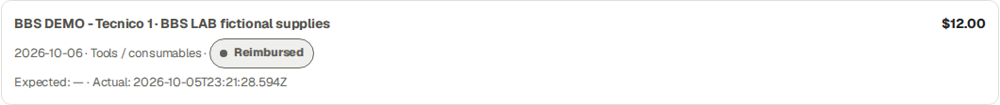

## Review invoice and collection totals

Go here: Collections / Ledger → project and currency filters

Context: Reference procedure · invoice and collection records within the selected scope.

Use the invoice register and collection history to investigate a specific document, receipt or outstanding balance. Keep the project, currency and date scope with your review.

### Do the task

1. Select the intended project and currency in Collections / Ledger.
2. Open the exact invoice and compare its face amount, recorded net collections, reversals and remaining balance.
3. Keep separate credit documents and their references with the review. Follow the collection and adjustment lessons for supported actions.
4. For an additional management report, send the Owner the requested project, date scope and purpose.

### Verify the result

- Invoice identity, currency, collection references and remaining balance reconcile for the selected document.

### If you get stuck

- Retain the document IDs and exact discrepancy. Use the supported correction lesson or ask the Owner for the required resolution; do not edit a downloaded file to force a total.

## Generate, review and finalize an Accounting Pack

Go here: Accounting → Generate monthly Accounting Pack

Context: Worked examples · FN09 · Finance generated a populated BBS-portfolio October 1–6 pack and reviewed its advisories. A separate all-synthetic portfolio completed Finance generation, zero-advisory review and finalization; Auditor downloaded all five outputs.

Accounting is a portfolio period, not a BBS-only project workbook. Generate queues independent PDF, XLSX, Invoice CSV, Expense CSV and JSON artifacts. A user waits for ordinary processing and refreshes the UI; private operator job commands are not part of this role procedure.

In the BBS copied portfolio, October 1–6 produced five Ready formats but Review showed Pending 35, Unclassified expenses 4, Missing documents 16 and Reconciliation issues 2. That pack was not finalized. The new October 26 source also conflicts with the pre-existing finalized monthly obligation for a later cut; keep that history for support.

The separate all-synthetic demo portfolio October 1–6 pack completed all five Ready outputs and zero review advisories with None detected under Changes since generation. Finance clicked Finalize reviewed version; the saved state is final. This demonstrates the role workflow without asserting that BBS blockers were repaired.

### Do the task

1. Expand Generate monthly Accounting Pack. Enter Period start, Period end and Report language; the default is the previous complete UTC month. Click Generate pack.
2. Wait for each format to show Ready. Download the needed authenticated formats and distinguish Queued/Failed for each output. A failed format does not make another Ready format unavailable.
3. Open Review before finalizing. Inspect Pending records, Unclassified expenses, Missing documents, Reconciliation issues and Changes since generation; follow each applicable review link and reconcile the legitimate cut.
4. For a current reconciled pack with legitimate issuer coverage and completed review, click Finalize reviewed version. Reload and verify final. If source truth later changes, preserve this historical pack and Generate new version.

### Verify the result

- Ready files are review artifacts, not finalization. A zero reconciliation count alone does not prove all operational work or receipt evidence is complete. The separate empty September cut correctly exposed Finalization unavailable because it had no confirmed issuer.

### If you get stuck

- Preserve intended dates, pack ID and error/advisories for Owner/support. Never fabricate issuer coverage, accountant approval, documents or remove sources to force finalization. Retry only the offered failed artifact after resolving its cause.

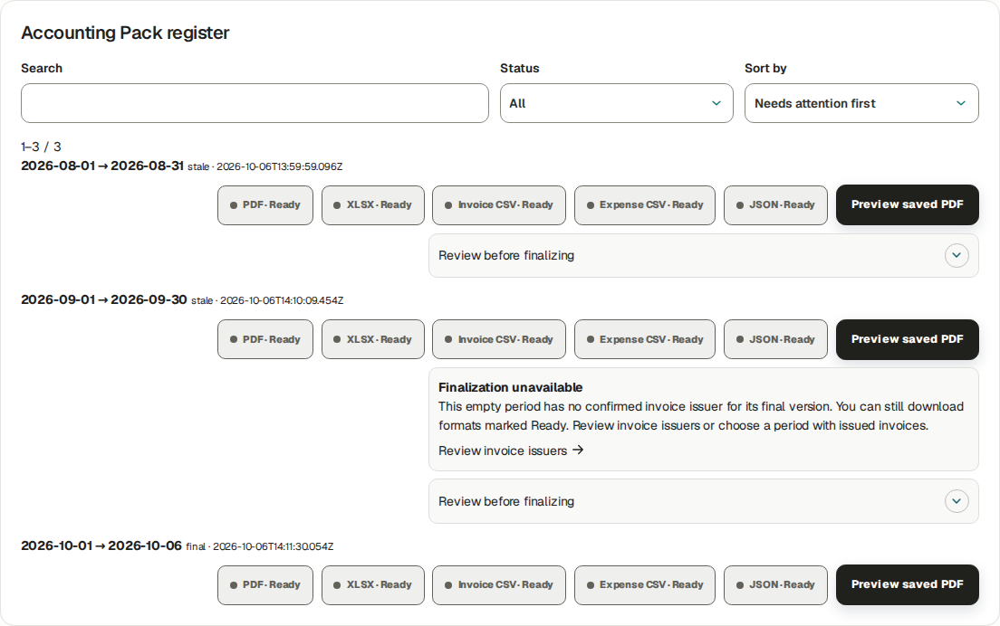

## Close a billing period and handle late work

Go here: Billing → Billing streams → Manage stream → Close sources

Context: Worked example · FN10 · actual Finance Close sources for the new Manual Labor stream October 26–26 after normal invoice issuance. Weekly/late-work behavior checked in source; project closure is separate.

Close sources records a billing-period closure and queues the required period reports. It does not issue invoices, collect cash, sign a customer report, amend a finalized worker obligation or close the project. At the billing-close capture BBS remained Active. A later separate Owner closeout finalized a historical package and closed the project, then supported Owner Reopen returned it to Active. Those transitions preserve the earlier final package and issued-source locks.

Use Monday–Sunday for a Weekly cut; Manual uses the explicit selected dates. Closing eligible leftover sources does not silently add later work to an issued invoice. A correction/late source needs its supported operational review, Finance treatment and subsequent document/period handling under the agreement.

### Do the task

1. Open Billing → Billing streams, locate the exact BBS stream and expand its management details. Verify cadence/effective dates and the intended invoice/source cut.
2. In Close sources enter Close period start, Close period end and Report language. Review readiness and click Close sources. The tested Manual cut was October 26–26.
3. Reload the stream and report register; inspect the saved closed period and separately queued/Ready customer and internal report artifacts.
4. For late work retain the original work date and source link. Review whether it belongs to a later eligible period or requires an explicit adjustment/support handoff. Never change dates merely to evade a closed period.

### Verify the result

- The tested billing period is closed and the original one-hour source remains locked by its issued USD 600 invoice. Invoice bytes, finalized compensation and project lifecycle are independent. No new late-work source was manufactured in this exercise.

### If you get stuck

- For a closed-period conflict give Owner/Finance/support the source ID/work date, stream ID/cadence, closed cut, invoice/settlement references and exact message. Project closeout is an Owner process with its own blockers.

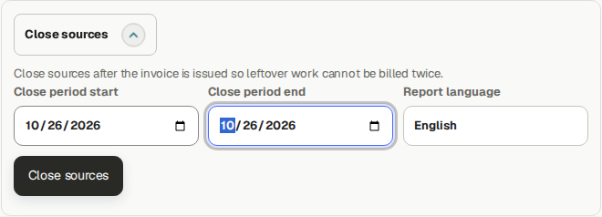

## Generate a customer-safe report and receive the PM handoff

Go here: Reports → Refresh period reports; Project period report → Reports / Client Sign-off

Context: Worked example · FN04 / S05–S06 · Finance generated the October 13–19 customer-safe snapshot; authorized PM approved exact version 2. Signed-copy capture and invalidation are source-checked procedures, not performed events.

Customer and internal period reports are separate artifacts. The customer-safe Hours and activity summary contains approved hours and Daily activities; technical content requires the selected supported content mode. Use the approved document for its intended audience.

Finance generated October 13–19 after the PM-approved coordinator Daily source. The PM approved exact version 2 / hash 85ba28d58be5c1f0c582266794df84fc491344508b23c63a33659b0ce98d6042: 3.8 approved hours, one Daily report and three Time sources. Finance reloaded CUSTOMER PRIVATE · APPROVED and Ready for signature. No signature, email delivery, staff dispatch or bank event was fabricated.

A separate October 13–18 exercise selected Hours, activity and selected technical reports plus the approved October 16 Technical record. Finance reviewed and approved the generated v2 snapshot. Its native two-page PDF includes the structured problem, diagnosis and change detail; it preserves the earlier PM-approved October 13–19 snapshot. No customer signing was recorded.

### Do the task

1. Open /j-aautomation/app/reports in your signed-in portal, expand Refresh period reports and select Open period refresh. Set Project, Period start, Period end, Report language and Customer report content; click Refresh reports. For Hours, activity and selected technical reports, explicitly check the approved Technical reports to include.
2. Wait for ordinary artifact processing. Open the Customer period report and verify its canonical Open PDF, audience, exact version/hash, approved source counts and selected content. The lower optional language panel is a separate artifact status.
3. Receive the PM’s approval for that exact snapshot; reload and verify Approved / Ready for signature. Operational follow-up records staff Shared/Exported/Awaiting named signatory/Returned/Disputed events with the required date/reference, not customer acceptance.
4. Only after genuine customer signing, use Capture verified signed-copy evidence: upload Signed PDF copy, enter Signer name, optional Signer identity and Customer signature date, then Record verified signed-copy evidence. The verified private PDF must bind to the exact snapshot version/hash; pending scan or changed version requires the stated recovery.

### Verify the result

- Operational approval is not a customer signature. A signature line printed in the report is not evidence. Use the approved report for its intended audience.
- An active sign-off binds its original report/PDF/evidence. Authorized Finance can use Invalidate sign-off → Reason for invalidation → Confirm invalidation before a changed snapshot/return/dispute; the old signed evidence and invalidation remain historical. Re-review and collect genuine new signed evidence for a new version.

### If you get stuck

- For returned/disputed or stale evidence receive the exact report ID/version/hash, PM review note and customer reason. Do not invent a signature or rebind old signed bytes to new content.

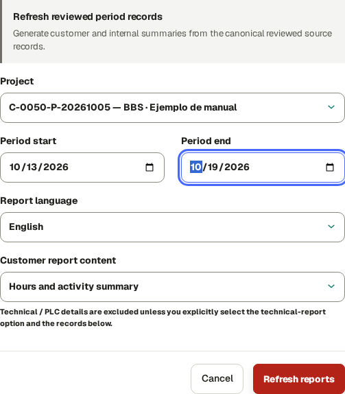

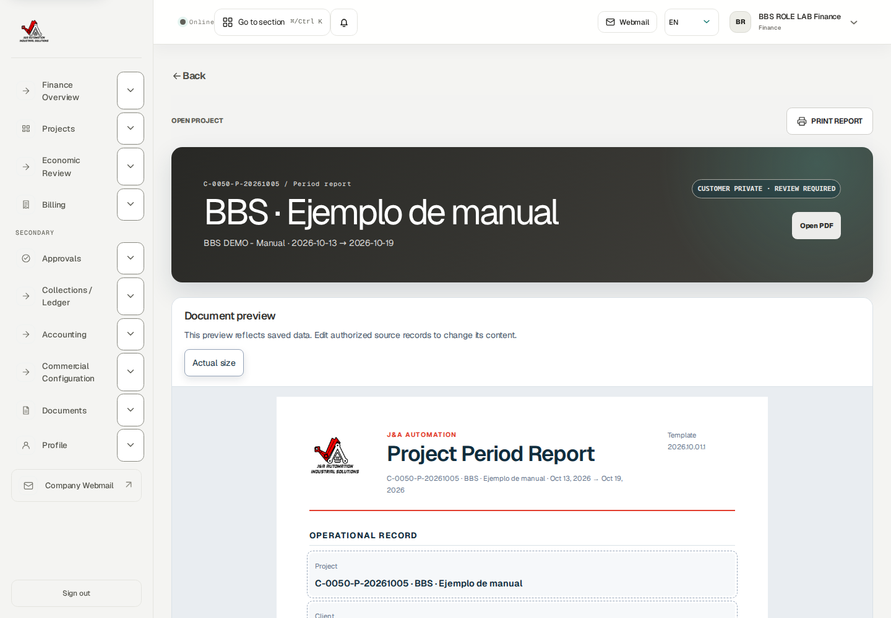

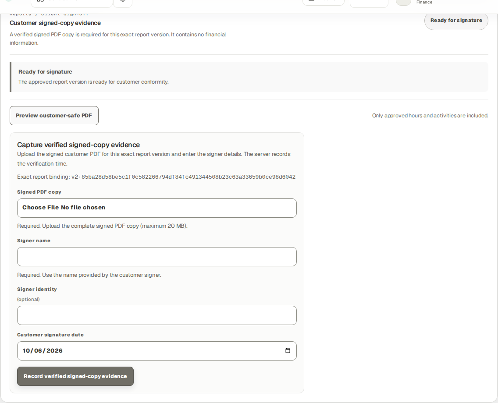

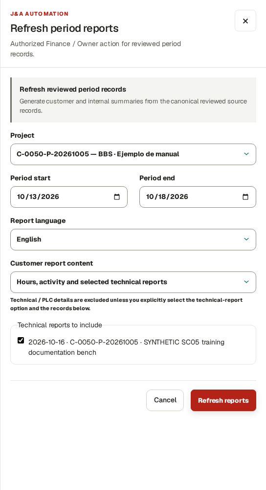

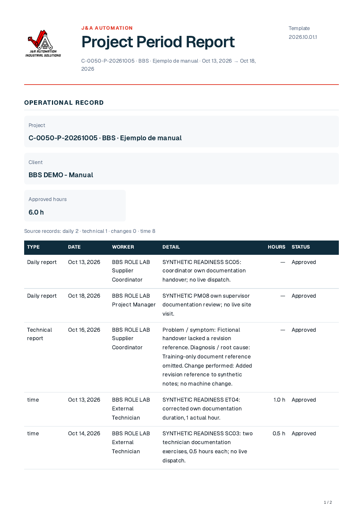

## Handle a finalized obligation correction without unlocking history

Go here: Economic Review → Settlements; Commercial Configuration → Compensation rules

Context: Source-checked boundary · FN06 / S07–S08 · native finalized-payment reversal history and dated-agreement overlap rejection verified; no obligation amendment or invented approval was posted.

A finalized worker settlement freezes its reviewed source amounts and terms. Cash payment/reversal changes net paid and remaining; it does not amend that obligation or unlock the original source. The existing USD 720 October settlement remains USD 720 after its synthetic USD 1 payment and reversal.

Commercial Configuration does offer Rule type → Custom approved adjustment, Approved adjustment amount and Save compensation rule. This creates a new scoped/datetime rule for an independently approved adjustment; it is not an ordinary edit of a previously finalized settlement. The current settlement UI offers no general Replace finalized obligation or Unlock source action.

### Do the task

1. Open the exact settlement and compare frozen period/amount/source snapshot with payment and reversal history. Keep the original obligation and cash events separate.
2. For an independently approved new adjustment, review the real approval and choose its Worker, Project scope, Currency, Rule type → Custom approved adjustment, Approved adjustment amount and Rate basis, Effective from, optional Effective to and Notes; save and verify the resulting rule through the supported procedure. Do not invent approval to populate the form.
3. If the required correction concerns an already finalized period and cannot be represented by the displayed supported flow, hand off to Owner/Finance support with project/person/settlement IDs, frozen/current source comparison, dated terms, reason and expected change.
4. Retain the support decision and any new append-only authorized evidence. Reconcile the resulting obligation and cash independently before a genuine remaining payment.

### Verify the result

- Reversing cash never unlocks issued work or historical obligations. New dated agreements avoid overlaps; database surgery and deletion are not user recovery procedures.

### If you get stuck

- Use the precise native overlap/finalized-source message. Support must assess an explicit authorized correction path; do not keep retrying finalization with altered dates or arbitrary rules.

## Finish the cycle and hand off an exception

Go here: Finance Overview; Help; Profile

Context: Reference procedure · checked against current source; not yet executed in this role lab

Check actual obligations and balances after each workflow. A read notification is not business approval; a final invoice is not delivery or collection; a reviewed settlement is not paid cash; a Ready artifact is not acceptance.

Keep dates, references, source IDs and visible error codes in a restricted support handoff. Never send broad portfolio exports, credentials or unrelated worker payment information to a customer.

### Do the task

1. Check the selected project and financial audience before export or sharing.
2. For support give the exact role, project, record/number, intended dates, last successful state and visible message.
3. Use Profile for your own account/security preferences and Help for the relevant role/Owner reference; contact the workspace administrator for access.

### Verify the result

- The handoff explains what was blocked and what remained preserved. No claimed payment, email or customer acceptance exceeds observed evidence.

### If you get stuck

- An application/support boundary is not a universal self-service unlock. Preserve final history and stop the specific unsupported transaction while other independent tasks continue.

## Recovery · sources, obligations and immutable history

Use the role’s worked correction lesson and the current record controls. A new purchase is different from a correction to an existing purchase. A payment reversal records a cash-entry correction; it does not amend a finalized compensation entitlement or unlock its time sources.

| State | Supported next action |
| --- | --- |
| Ordinary Draft | Use Edit/Save draft where present; attach the actual receipt/evidence before Submit. Inspect each saved draft after weekly table entry. |
| Submitted | Read current state and reviewer handoff. Do not create another source merely because review is pending. |
| Needs changes | Read the reason. Time uses Create corrected draft where available, then submit/review the linked replacement. A returned Daily/Technical report instead offers Edit and Save changes on the same report, then Submit for review; follow the exact role lesson. |
| Rejected | Inspect the reason and contact reviewer/Owner. The time detail does not offer the same linked-correction route as Needs changes; do not assume that route exists. |
| Approved, unlocked | Use the offered linked correction, preserving the original. Re-review the replacement and refresh affected unissued drafts/report versions through their supported controls. |
| Issued, financially locked or finalized compensation | Stop source editing. Send source ID/project/date, original/correct values, reason, affected invoice/settlement and payment references to Owner/Finance. If no authorized amendment control exists, escalate to platform support. |

### If you get stuck

- Finalized compensation has no ordinary Amend settlement or Unfinalize control in this release. Finance records the request and reconciles the preserved original obligation and actual payments; support must return a documented authorized financial resolution, resulting obligation/reference and explicit source-lock outcome. Until then the source remains blocked. A bank transfer, cash reversal or direct database edit is not an amendment procedure.

## Security · verify your own device and recovery options

Go here: Profile → Account security; Profile → Add availability

### Do the task

1. Check Account security identifies YOUR account even when an authorized workforce profile inspection shows another worker above it. Enroll only your own device. MFA is optional in this release.
2. For a passkey, enter Device name and choose Register passkey on the approved secure portal. Complete your device’s creation confirmation. Verify Passkey registered for this account, the registered count and named device row. Cancelled/failed registration is not enrollment.
3. To retire your own lost/obsolete passkey, first confirm you retain another working sign-in method. Select Revoke on the exact device and verify Passkey revoked and removal of its row. If you cannot sign in, use the verified support route rather than another person’s session.
4. For an authenticator, choose Enable MFA. Keep the setup URI and one-time recovery codes private in the approved password manager. Add the URI to your authenticator, enter its current six-digit Authenticator code and choose Verify MFA. Verify Enabled and Disable MFA appear; enabling without verification is not completed enrollment.
5. At a later MFA sign-in use Six-digit code → Verify and continue. If the authenticator is unavailable, choose Use a recovery code and enter one unused stored code. If neither method is available, contact admin@j-aautomation.com for identity-verified recovery. Do not send recovery codes or the setup URI to support.
6. To remove optional MFA while signed in, choose Disable MFA and verify Not enabled/Enable MFA. Confirm the intended own account before doing so. A successful settings change is separate from recovering a lost account.
7. Where Add availability is offered, fill Starts, Ends, Availability and Note using the displayed time basis, then Save availability. Verify the saved interval/status/note in the list; use Edit availability on that row and save the changed values. Availability is not project membership, a published shift or actual hours.

## Verification · current coverage and historical evidence

English readiness edition: 6 October 2026, based on repository abc12c0961b2 with the recorded readiness fixes. The publication receipt identifies the final commit and deployment. This edition teaches the permitted ordinary cycle and supported handoffs; it does not certify every contract, device or external service.

The current evidence lives in docs/evidence/bbs-readiness-20261006. Its correction register maps all 72 suite findings to tasks, browser evidence or precise reference/support boundaries. Role manifests identify source IDs, state transitions and downloaded artifacts. Historical 5 October outputs remain historical; new screenshots do not rewrite their totals or private bytes.

Recipient activation, actual authenticator verification and own passkey registration/revocation were exercised on a separate isolated recipient. The same account controls are shared, but enrollment was not repeated for every role or physical device. Offline/expired-link and lost-device paths remain precise references where not separately executed.

Weekly submission was exercised with one ordinary draft and one eligible linked correction for Worker, Chief, External Technician and Supplier Coordinator: two selected drafts became two Submitted sources and zero remaining drafts. This does not guarantee that locked, withdrawn, out-of-scope or ineligible corrections will submit.

A final Accounting cut succeeded in a separate clean Finance portfolio; an Auditor read and downloaded its outputs. Original BBS issuer-history and source-reconciliation blockers remain documented. Email transport, real bank movement, accountant approval and genuine customer acceptance are outside the synthetic tests.

### Verify the result

- For a task described as reference, follow the exact named controls and prerequisites; do not infer that an illustrated outcome was executed. For support-only recovery, preserve the blocked source and obtain the documented receiving result before proceeding.
