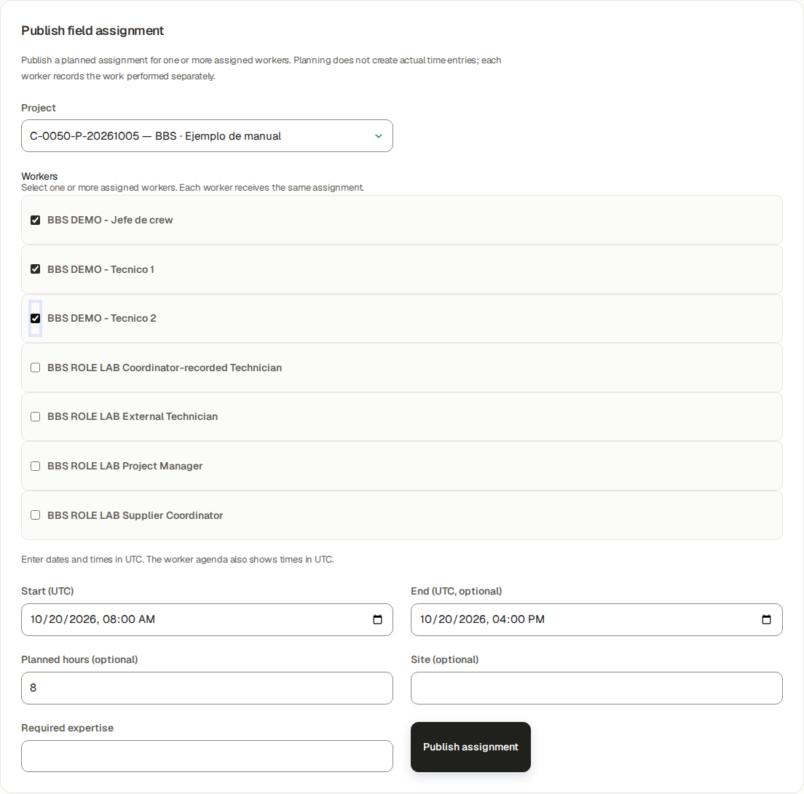
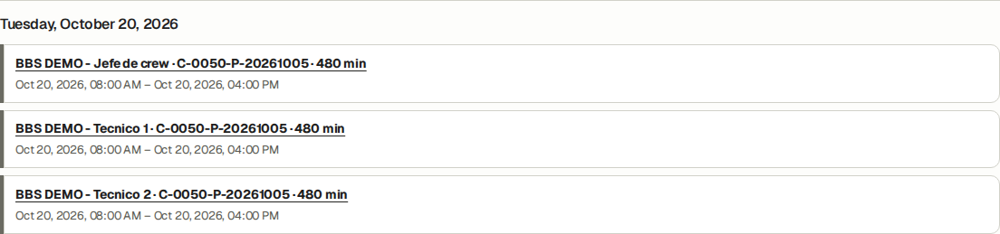
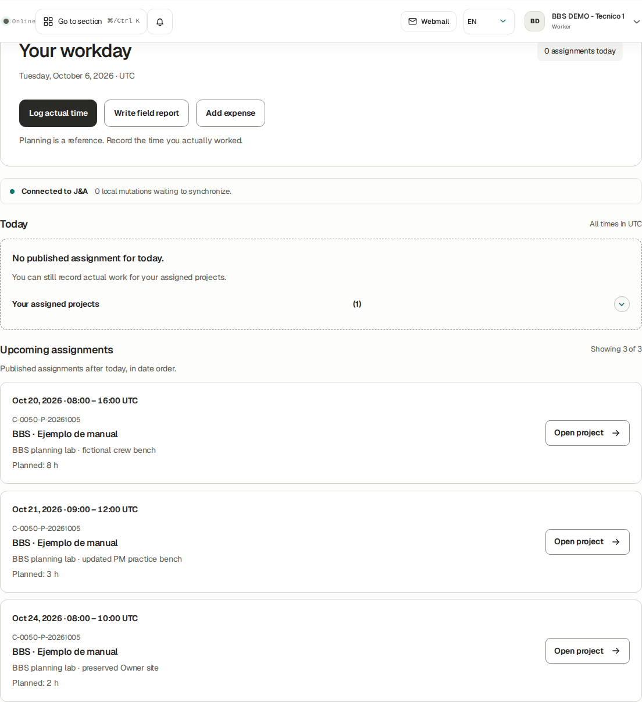
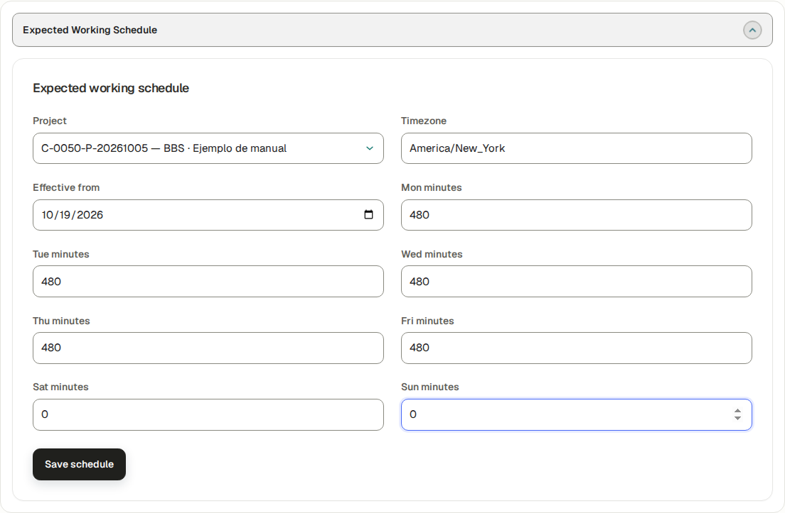
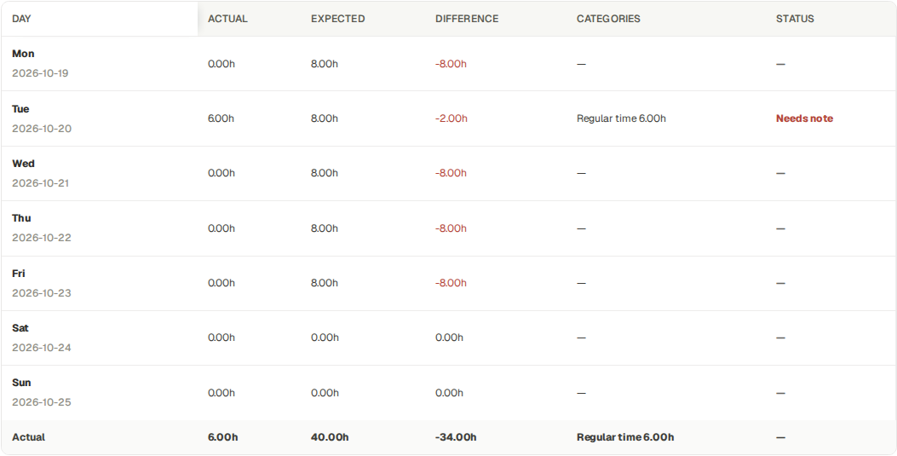
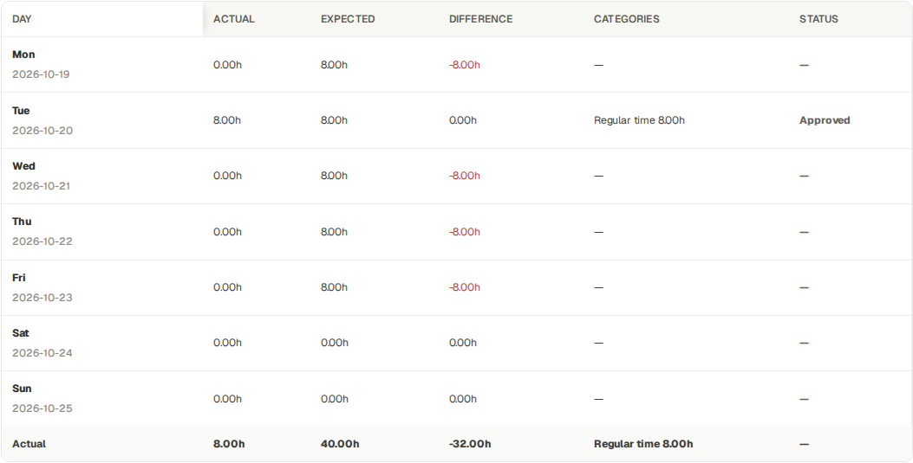
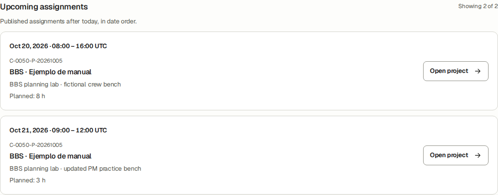
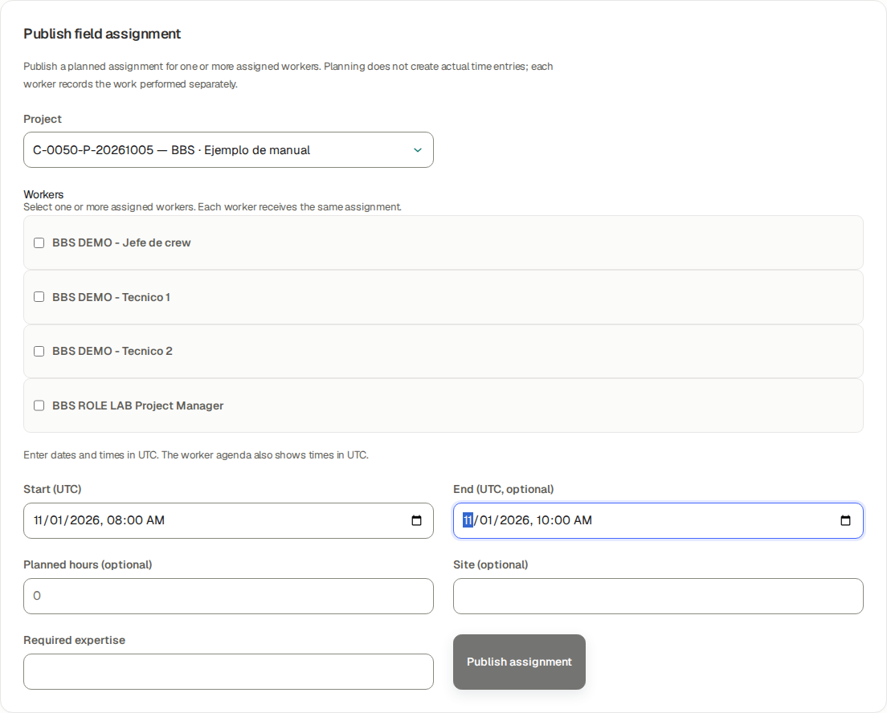
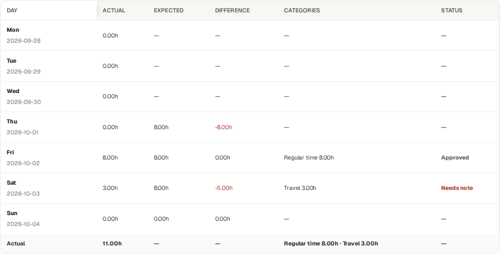

# Owner · BBS operating manual

Role responsibilities, team handoffs and the complete illustrated BBS course.

## Before you practise · access and scope

This English guide uses BBS · Ejemplo de manual, project C-0050-P-20261005. The screenshots were taken using the stated role in an isolated database running the application. Training entries, payments, approvals and documents are fictional. They do not prove a real bank transfer, accountant approval or customer acceptance.

The company portal at https://j-aautomation.com/j-aautomation/app is LIVE. Training uses a separate URL and database. Before practising, obtain the isolated URL, your own role account and permitted exercises from the company administrator; verify the BBS project number. Without isolated access, treat these screenshots as read-only demonstrations and perform only authorized real work.

Use your own credentials. Do not borrow an Owner, Finance or colleague account. A platform role, project assignment, review permission, supplier authorization and dated crew delegation are separate requirements. Changing one does not automatically grant the others.

Select English in the workspace language control to follow the labels used here. Some saved BBS record names remain in their original language. On a phone open the navigation drawer to see full workspace names. Recheck the selected project and date range after every navigation.

The eight Worker test accounts in the private credentials document use the same Worker workflow. Crew chief is a dated delegation attached to a Worker account. Supplier Coordinator and External Technician are restricted profiles attached to Worker accounts. This guide never includes account passwords.

Each screenshot is an exercise checkpoint. Later fictional role entries and financial events are additional to the original October 1–5 workbook totals. Reopening the project or selecting the same dates does not restore that checkpoint. Read captions before comparing amounts or states.

The assignment and expected-hours supplement uses a separate isolated October 20–23 synthetic exercise. Project access, a published work plan and a dated working-hours target are separate records. Workers record actual work and report progress independently; a plan never creates actual hours or a payment.

### Verify the result

- Confirm your displayed account, role or supplier profile, the project number and the dates before saving.
- For training access, scope or reset help, contact the company administrator at admin@j-aautomation.com. Include the role, route, project number, time and visible error; omit passwords, cookies and private customer or worker documents.

### If you get stuck

- An empty project selector often means missing or expired assignment or authorization. Ask the Owner to check coverage for the date you are entering; do not create a duplicate project.
- A form shown in a screenshot can depend on role, source state or effective date. Use the documented role handoff when a control is absent.

## Use this Owner manual

The detailed 203-page BBS course follows this role introduction in the PDF. It retains its own numbered contents, verified screenshots, original application-issued training invoice annex and six native attachments. Its internal page numbers start again at 1. Use the PDF outline to move between the role introduction and the course.

The course was verified against the 5 October release and explains the original BBS pre-issue checkpoint, the isolated BBS financial lifecycle, a separate onboarding correction lab and a clean Accounting reference. Each context is explicitly labelled. The new role guides use the same BBS project. Their later operational and financial practice records are separate exercises; the original course totals remain a historical checkpoint taken before those additions. Reconcile the saved scope and state, rather than assuming every screenshot is the current project total.

This is an operating reference and worked lab. The course marks source-checked procedures and known limits; a described control does not prove every optional contract, mail transport or account-security scenario was exercised.

### Verify the result

- Follow the course contents in order for first onboarding, or use the task titles for a specific job.
- Use the role-specific companion guide for the employee performing a task. Give them their own role account and scoped assignment.

## Owner account, assignments and delegation

Go here: Team → account and access controls; Projects → BBS → Team; Crew → select BBS

Owner is the platform administration role. Creating a person or account does not assign a project. Review permission, dated crew delegation and supplier authorization are additional scoped grants. A chief is a Worker with delegation; Supplier Coordinator and External Technician are restricted Worker profiles.

The private credentials document contains historical accounts that may be offboarded or suspended. For this edition, fresh fictional role accounts were created through the Owner interface in the isolated copy. No production account was reactivated. The account list in the private document is a role reference, not a promise that every old login remains usable.

### Do the task

1. Use the course first-access and Team chapters to create or locate the person. Select the permitted platform role or supplier profile and verify the saved active access.
2. Open the BBS project Team tab and assign the person with dates covering their work. For a project manager, also establish the project-management scope and operational review grant described in the manager guide.
3. For a crew chief, use Crew → Assign a crew chief and verify the saved delegation interval and affected crew. Configure review permission separately if that person should review.
4. For a supplier, create/link supplier personnel, authorize the supplier on the BBS project, and establish each technician assignment. Confirm the restricted profile before handing over access.

### Verify the result

- Sign in through a separate account context for each person. Verify their actual navigation and scoped project visibility.
- Do not use an Owner session to demonstrate a Worker, manager or supplier workflow.

### If you get stuck

- If a worker cannot select the project, inspect account status, assignment dates and effective authorization. If a chief cannot review, inspect the separate review permission.
- End access or assignment using the supported lifecycle control and required reason; preserve historical records.

## Give each person the right guide

Worker: BBS_Worker_Manual_EN.pdf covers their own actual hours, expenses, reports, corrections and My Pay. All ordinary Worker test accounts share this procedure.

Crew chief: BBS_Crew_Chief_Manual_EN.pdf covers dated delegation and team operations in addition to the Worker basics.

Project manager: BBS_Project_Manager_Manual_EN.pdf covers scoped operational oversight, review and reporting. Customer prices, commercial expense classification, internal cost and another worker’s pay belong to authorized financial roles.

Finance: BBS_Finance_Manual_EN.pdf covers commercial treatment, invoice lifecycle, collections, compensation and reconciliation. Genuine company/accountant inputs remain prerequisites for live legal issuance.

Auditor: BBS_Auditor_Manual_EN.pdf covers read-only financial and audit evidence. Read access does not grant mutation authority.

Supplier Coordinator: BBS_Supplier_Coordinator_Manual_EN.pdf covers authorized supplier personnel and operational team work. External Technician: BBS_External_Technician_Manual_EN.pdf covers the technician’s own assigned supplier work. Their restricted profiles take precedence over ordinary Worker navigation.

### Verify the result

- Open Help with each role and confirm the correct current English guide is available. Restricted role downloads use the same persisted persona decision as the Help list.
- The Owner may inspect the operational reference guides to supervise handoffs. Giving someone a PDF does not grant the corresponding application permission.

## Assign access, publish a crew plan and verify each worker

Go here: Projects → BBS → Team; Crew; Planning → Publish field assignment

Context: Isolated BBS planning and crew lab · October 20–25, 2026. Browser-verified synthetic operational records; no real dispatch, payment or customer acceptance. Historical financial-course totals retain their original date scope.

Project membership gives a person dated project access. A published plan supplies a work interval, optional planned hours and site. An expected working schedule supplies a weekday hours target. These are separate controls: assigning a person does not publish a shift, and publishing a shift does not create actual work.

The connected BBS exercise uses the existing Chief, Technician 1 and Technician 2. The Owner publishes the same October 20 08:00–16:00 UTC interval and eight planned hours to all three. The chief’s dated delegation is verified separately before team time entry.

### Do the task

1. Open BBS (C-0050-P-20261005) → Team. Confirm the three people are active and their project-assignment dates cover October 20. Do not recreate existing people or duplicate their membership.
2. Open Crew, select BBS and inspect the saved chief delegation. Its date range and the chief’s and colleague’s project assignments must all cover the work date. A chief can record delegated crew hours; this grant does not itself authorize approval.
3. Open Planning → Publish field assignment. Select BBS, set Start (UTC) to 2026-10-20 08:00 and End (UTC, optional) to 2026-10-20 16:00, then select the Chief, Technician 1 and Technician 2 checkboxes.
4. Enter 8 in Planned hours (optional) and a genuine operational site description. Required expertise is an operational planning field. Review every selected person, date and optional field before choosing Publish assignment.
5. Choose the October 20 calendar day. The agenda must contain three separate published records, each with 480 planned minutes. Open a published record to verify its worker and interval.
6. Ask each person to use their own Worker account → Today → Upcoming assignments. They should see their own eight-hour BBS card. Workers do not edit the Owner’s plan; they request a correction from the Owner or authorized Project Manager.

### Verify the result

- The Owner’s native multi-worker publication saved exactly three published records. A narrowly scoped read-only check found zero October 20 BBS actual-time entries immediately after publication.
- Separate Chief, Technician 1 and Technician 2 browser sessions displayed the plan. The later 6 / 7 / 8 actual hours were entered separately, submitted and approved; they were never generated from the eight-hour plans.

### If you get stuck

- If a checkbox is missing, compare the selected planning dates with the person’s active project-assignment interval and current authorization. Publishing does not grant access.
- If Today says No published assignment for today while an upcoming card exists, compare the card’s date with today in UTC. The person can still record authorized actual work for their assigned projects.
- If an interval error appears, correct End so it is after Start, then verify the retained workers, planned quantity, Site and Required expertise before choosing Publish assignment again.

## Set expected hours and interpret the weekly difference

Go here: Projects → More actions → Expected Working Schedule; Worker: Time → Weekly timesheet

Context: Isolated BBS planning and crew lab · October 20–25, 2026. Browser-verified synthetic operational records; no real dispatch, payment or customer acceptance. Historical financial-course totals retain their original date scope.

Expected hours are reference targets derived from the effective project working schedule and the worker’s dated assignment. They are not the sum of planned assignments and do not change actual recorded time, worker compensation or customer billing.

The BBS lab uses an expected schedule effective October 19: Monday–Friday 480 minutes (8 hours), Saturday–Sunday 0. The existing America/New_York timezone is retained. Saving this form also applies its timezone to the project; confirm the company’s correct IANA timezone before saving.

A later isolated checkpoint adds a second project membership for Technician 1 on October 23 only, in the existing fictional onboarding project. Both own memberships cover that Friday, so the application leaves Expected and Difference unknown (—) instead of adding or choosing project targets. The earlier tables precede this addition; they correctly show Friday eight hours. No actual work was entered for the second project.

### Do the task

1. Open Projects, choose BBS as the action context, open More actions and select Expected Working Schedule. Confirm the Project selector is C-0050-P-20261005.
2. Keep Timezone as America/New_York for this saved BBS exercise. Enter Effective from 2026-10-19. Enter 480 in Mon, Tue, Wed, Thu and Fri minutes, and 0 in Sat and Sun minutes. The inputs are minutes, not hours.
3. Choose Save schedule. Verify Expected schedule saved. Ask the worker to reopen Time and use Week of 2026-10-19 → Open week so the weekly table loads the new effective schedule.
4. Read Actual as time actually recorded, Expected as the weekday target, and Difference as Actual minus Expected. The reference schedule applies by effective date and project-assignment coverage.
5. After operational approval, compare October 20: Technician 1 has 6.00h Actual, 8.00h Expected, −2.00h Difference and Needs note; Technician 2 has 7.00h / 8.00h / −1.00h and Needs note; Chief has 8.00h / 8.00h / 0.00h and Approved.
6. Open the underlying source to verify its actual approval state. Needs note is the weekly difference indicator for approved time outside the expectation; it does not return or reject the approved source. Record the operational explanation through the appropriate activity/report workflow; there is no separate Mark goal completed control.

### Verify the result

- The native Owner save persisted the dated 480 / 0 schedule and retained the BBS project timezone. Separate Worker weekly tables displayed the expected values after reload.
- The three actual-time source rows remained Approved with their original 360 / 420 / 480 minutes. No hours were increased to force agreement with the eight-hour target.
- The later browser checkpoint showed October 23 Actual 0.00h, Expected — and Difference —, while October 20 retained Actual 6.00h / Expected 8.00h / Difference −2.00h. The future-only second project was absent from the current Worker project selector; only the target comparison counted its dated membership.

### If you get stuck

- A dash (—) means the application cannot determine an effective target for that day; it does not mean zero hours or a failed time submission. Check assignment dates and the dated schedule.
- If several project assignments cover the same day, the application does not add their targets together without an allocation rule. Resolve the schedule with the Owner; continue recording truthful actual time. The later October 23 checkpoint demonstrates this rule through a saved one-day second assignment.
- Zero is a valid target, such as the configured BBS weekend. A negative difference without actual records is planning context, not a missing bank payment or invoice.

## Keep planned hours, local time and work goals distinct

Go here: Planning → Published assignments; Worker: Today and Time; Reports

Context: Isolated BBS planning and crew lab · October 20–25, 2026. Browser-verified synthetic operational records; no real dispatch, payment or customer acceptance. Historical financial-course totals retain their original date scope.

The Project Manager’s separate October 21 practice plan was edited from two hours to three hours, 09:00–12:00 UTC. Worker 1’s agenda shows Planned: 3 h, while the Wednesday timesheet expectation remains 8.00h from the project schedule. Editing a plan does not rewrite that schedule.

Planning and worker agendas display UTC explicitly. On October 20, 08:00–16:00 UTC is 10:00–18:00 in Europe/Madrid and 04:00–12:00 in America/New_York. These conversions apply to that date; daylight-saving transitions can change the offset. Enter the intended UTC interval rather than assuming the form uses the browser or project timezone.

There is no generic worker-goal module with Accept, Reject or Mark completed actions. Use published assignments for coordination, the expected schedule for reference hours, actual time for work performed and Daily / Technical reports for progress and deliverables. Project milestones are separate project checkpoints with their own permitted workflow; they are not personal hours targets.

### Do the task

1. To change a published plan, open its Published assignments record, change the worker, UTC interval, Planned minutes, Site or Required expertise as needed, and choose Save assignment. Creation uses planned hours; editing uses planned minutes: three hours equals 180 minutes.
2. Reopen the record and ask the affected worker to reload Today. Verify the changed interval and planned quantity in both views.
3. To cancel a plan, open the correct record and choose Cancel assignment. Check its date, project and worker before saving. Verify the calendar and worker agenda no longer show it as an upcoming published assignment.
4. Use Daily / Technical reports to describe completed work and blockers. Submit truthful actual hours separately. Operational review, Finance classification and money records remain later, distinct steps.

### Verify the result

- Native PM editing persisted October 21 09:00–12:00 UTC, 180 minutes and the updated fictional site. Worker 1 saw the changed three-hour card; that day still showed Expected 8.00h and Actual 0.00h.
- A separate October 22 Technician 2 practice plan was cancelled through the PM browser. It disappeared from the worker’s upcoming agenda while its database record retained cancelled status. No actual time was created for that cancelled plan.

### If you get stuck

- If the plan and weekly expectation differ, inspect both controls before changing anything. A short assignment within a full working day can legitimately have different planned and expected hours.
- Cancelling planning does not void approved actual work. Correct an actual source through its supported correction workflow if the recorded facts are wrong.

## Troubleshoot missing plans, expired coverage and unknown targets

Go here: Projects → BBS → Team; Planning; Worker: Today and Time

Context: Isolated BBS planning and crew lab · October 20–25, 2026. Browser-verified synthetic operational records; no real dispatch, payment or customer acceptance. Historical financial-course totals retain their original date scope.

Use the person, project and work date as the diagnostic key. Account status, project membership, published planning, expected schedule and crew delegation answer different questions. An empty calendar is not proof that the account lacks project access.

Supplier profiles have a further visibility restriction: an Owner can publish a plan for an eligible External Technician, but that profile currently opens its restricted Time / Expenses / Reports workspace and has no internal Worker Today agenda or Planning calendar. Give the technician the agreed schedule through the company’s operational handoff; the restricted profile still records its own actual work.

### Do the task

1. No plan for today: confirm the UTC day shown in Your workday. Expand Your assigned projects and compare Upcoming assignments. Ask the Owner or PM to publish or correct a plan if one is required.
2. Worker missing from Publish field assignment: inspect the selected start/end and the worker’s active project-assignment interval. In the BBS lab, the supplier-personnel coverage ends October 31; those profiles are absent from November 1 worker choices.
3. Expected shows —: open the intended week and compare each day with assignment and schedule effective dates. Worker 1’s September 28–30 precede the October 1 assignment, so Actual is 0.00h and Expected / Difference are —. From October 1, the saved effective target appears.
4. Needs note after approval: inspect the Actual / Expected difference and open the source. Request an explanation or a genuine source correction as appropriate; do not replace actual hours with the target.
5. A restricted external account lacks Today / Planning: use its documented Time, Reports and supplier handoff. Changing the account to an unrestricted role solely to expose planning would change its privacy and permissions.

### Verify the result

- The missing-today-plan and upcoming-plan states were shown together in an actual Worker session. The pre-assignment weekly dashes and the dated eligibility change were checked in the browser.
- The separate External Technician exercise verified that a published two-hour plan does not grant internal planning navigation; its own actual-time workflow remains available.

## Supervise the financial cycle

Go here: Finance → Commercial Configuration; Approvals; Billing; Collections / Ledger; compensation and reimbursement registers

Invoice cadence and worker payment cadence are separate contracts. Select the project and worker settlement period explicitly; an issued invoice is neither a worker payment nor a bank receipt. The BBS lab verifies independent invoice and compensation periods in the detailed course.

The original BBS before/after workbook figures retain their historical scope: USD 4,672 issued, USD 682 collected and USD 3,990 receivable. Configured labor cost USD 1,520 plus direct expenses USD 230 produces USD 1,750 configured company cost. Contractual compensation USD 2,100 is USD 580 above the configured labor estimate. Contribution USD 2,922 uses the configured cost basis; it is not proof of final cash profit. Do not add both labor cost and compensation as if they were independent expenses.

### Do the task

1. Complete operational review before Finance classification. Reconcile approved source quantities and commercial treatments before draft approval.
2. For live invoices, obtain genuine legal issuer and accountant-approved numbering values. The training policy and training approval timestamps in the course are simulations.
3. Approve and issue with the named controls, then verify the numbered immutable PDF and lifecycle state. Downloading, sending, recording dispatch and collecting money are separate events.
4. Review and finalize compensation for the selected worker and dates. Record actual payment only after a real transfer; expected payment date is scheduling information. Record expense reimbursement separately.
5. Reconcile native source, billing, ledger, compensation and project exports using the course landscape workbook examples. Investigate date/costing differences before interpreting contribution.

### If you get stuck

- Correct issued documents through the permitted void, credit, debit or replacement relationship. Preserve issued masters and payment history.
- A disabled training email transport can queue or fail a delivery attempt. It does not establish a delivered customer email.

## Accounting coverage and period close

Go here: Accounting → selected project/entity and dates → Generate pack

The Accounting failure formerly on page 169 is preserved in the detailed course as the historical blocked BBS example. ACCOUNTING_PACK_ISSUER_EFFECTIVE_DATE_GAP means the requested dates are not fully covered by an effective legal issuer revision. The failed generation is blocked; no finalized pack is created.

The selected dates remain in the form after this failure so that the Owner can inspect the missing issuer/date coverage. Retained dates are a recovery behavior, not a claim that generation succeeded. Review the displayed issuer and missing interval, correct genuinely authorized coverage or select the intended supported interval, and regenerate. Do not rewrite archived issuer history merely to pass the example.

The course also includes a successful clean-scope Accounting Pack with independent ready downloads and reconciliation. That clean demonstration is explicitly separate from the historically blocked BBS configuration. A finalized pack describes its selected cut; later work or documents can require a new pack.

### Verify the result

- Wait for the independent outputs to reach Ready. Download and reconcile each artifact before finalization. Queued and failed are not ready.
- Use weekly/project closure only after its operational prerequisites are satisfied. Closure and archiving are distinct states; a late source must use the supported recovery path.

### If you get stuck

- Send the exact coverage error, dates, project/entity and time to admin@j-aautomation.com if the Owner cannot resolve authorized issuer coverage. Never send session tokens or private files.
