# Project Manager · BBS operational course

Assigned projects, planning, operational review, corrections, reports and precise role handoffs

## Before practising · live and training access

The company portal https://j-aautomation.com/j-aautomation/app is LIVE. A link to it never enters a simulation. For practice obtain a separately provisioned training URL, your own account, the permitted fictional project and dates, a visible environment identifier and the trainer’s reset procedure. Without those, use this guide as a read-only demonstration and enter only authorized genuine work.

Original BBS examples include historical live-deployment records. Later training exercises used isolated copies. Each chapter identifies its dataset and checkpoint. Follow the dates and saved states shown for that exercise.

A role, project membership, review permission, supplier authorization and dated crew delegation are separate. Use your own credentials and follow the tasks assigned to your role. Check the selected project and person before recording work.

### Verify the result

- Confirm your displayed identity, the environment, project number and work dates before saving. For training/reset or lost access contact admin@j-aautomation.com; send the route, role, project/record reference, time and visible error. Keep passwords, activation links, recovery codes and cookies private.

### If you get stuck

- For an empty project selector, ask the Owner to check account status and assignment/authorization coverage. Do not create a duplicate project or borrow another account.

## Access · activate the invitation and sign in

Go here: Your trusted invitation → Activate your account → Return to sign in → Profile

### Do the task

1. Check the portal address and named account against the invitation provided by the Owner. There is no public sign-up. For an already provisioned account, use the sign-in method supplied to you; do not attempt to activate someone else’s invitation.
2. For a single-use activation link, open Activate your account. Enter Full name and choose a Password of at least 12 characters, then Activate account. Wait for Account activated. You can sign in now. Do not repeatedly submit while Activating… is displayed.
3. Choose Return to sign in. Enter your account Email and Password and select Continue to workspace. If you previously enabled MFA, complete Verify your identity with the current Six-digit code and Verify and continue. Use a recovery code only through the offered Use a recovery code control.
4. Open Profile and verify the own-account name/email/role in Account security. Check the navigation and assigned project. A newly activated account can have zero assignments; activation alone does not grant project access or supplier/chief authority.

### Verify the result

- The activation success message precedes the separate sign-in. Verify your own Profile and assigned projects after signing in.

### If you get stuck

- An expired or already used link displays This invitation could not be activated. It may have expired or already been used. If activation already succeeded, return to sign in. Otherwise request a new invitation from the Owner; reloading does not renew the old link.
- For offline, temporarily unavailable or rate-limited activation, retain the entered name/password privately, restore connectivity or wait for the displayed retry interval, then retry. An unconfirmed response is not proof of an active account.
- For an incorrect password, inactive account or lost access, contact admin@j-aautomation.com from your verified account/contact channel. Supply identity and the visible error; never send the password. This guide does not promise a public password-reset form. The initial Owner is provisioned by the platform operator; an existing Owner provisions the remaining team.

## Practice setup · your account and starting records

Obtain your own training account, isolated environment, authorized project and lesson dates from the trainer. Confirm the named starting records and expected result before saving. Ask the trainer to restore the checkpoint when needed.

| Checkpoint | Required starting condition |
| --- | --- |
| Identity and environment | Own correctly provisioned role/profile; isolated URL and visible environment identity. |
| Project and dates | Exact project number, timezone and unused eligible lesson dates; membership and relevant grants cover both current access and the work date. |
| Source state | Named source IDs and durations/amounts; ordinary starting drafts/submissions; no unrelated correction already open. |
| Expected outcome | Expected saved state, source count, actual total and permitted output; named receiving reviewer where needed. |

### Verify the result

- Confirm that the visible starting records match this lesson. If they differ or an action is unavailable, stop and ask the trainer for the correct checkpoint.

## Review authority · who receives each source

Review is determined by the source, base role and current dated grants. Chief delegation grants recording, not approval. A Worker with Can review checked does not become a Project Manager. Send a factual reason with every requested correction.

| Source / recorder | Operational reviewer and prerequisite | Next handoff |
| --- | --- | --- |
| Internal own or chief-delegated time | Owner or Finance; assigned PM with current active Can review membership for this project. | Submit the checked work to the authorized reviewer and verify the resulting state. |
| External/supplier time, including coordinator own time | Authorized Owner. Supplier authorization/recorder provenance keeps these sources outside the ordinary PM time queue. | Verify the resulting review state. |
| Own/delegated expenses | Owner or Finance; assigned PM with current project review grant. Check factual purchase, payer and evidence. | Verify the expense review state. Direct reimbursement questions to the Owner. |
| Daily and Technical reports, including supplier profiles | Owner or Finance; assigned PM with current project review grant and permitted project scope. | Owner/Finance prepares the customer period report and version-bound acceptance where required. |
| PM’s own work | Route it to another authorized reviewer for an independent factual check. Do not infer a universal self-review prohibition solely from a job title. | Use the appropriate personal output and verify the review state. |

### If you get stuck

- If the intended source is absent, check source type, state, dates, assignment/review grant and supplier authorization before searching another queue. A review-enabled Worker Chief variant is not exposed by the current role model; Owner must provision the genuinely permitted reviewer role and grant. Never use a colleague’s credentials to bypass this boundary.

## Start with your account and assigned scope

Go here: Sign in → Dashboard

Context: Browser-verified isolated BBS project C-0050-P-20261005. All ROLE LAB records are synthetic training; they are not real dispatch, customer acceptance, purchase or payment.

The Project Manager coordinates assigned projects and reviews operational facts. Account access, project membership, review permission and crew delegation are separate records. Having the Project Manager role does not automatically assign every project.

This guide uses the same saved BBS project as the Owner and other role guides. The fictional Project Manager account was created through Owner Team, signed in normally, assigned to BBS and granted Can review. The Owner completed the required dated project setup. Those setup actions belong to the Owner; this guide never asks you to create a duplicate BBS project.

### Do the task

1. Use your own invitation or company account. Open the portal sign-in screen, enter the account email and password, and choose Continue to workspace.
2. Check that the account shown in Profile is yours and the role is Project manager. Never use the Owner or another worker’s credentials to reach a missing control.
3. Open Dashboard and confirm BBS is in your authorized project scope. Open Projects and identify C-0050-P-20261005 before recording or reviewing anything.
4. Ask the Owner to verify active account status, dated project membership and Can review before starting this exercise. Assignment coverage must include the work date; current access also depends on the current application date.

### Verify the result

- Native login succeeded as the fictional Project Manager. Dashboard showed one authorized active project after the Owner completed dated membership.
- An assignment starting the following UTC day initially showed no current project. The Owner added genuine coverage for the current day through native controls; no role or session was fabricated.

### If you get stuck

- If BBS is missing, stop recording and give the Owner the project reference, your account and intended work dates. Do not create a replacement project.
- If a review control is missing, check membership dates and Can review separately from the role label.

## Find the right workspace on desktop and phone

Go here: Dashboard → primary navigation / More

Context: Browser-verified isolated BBS project C-0050-P-20261005. All ROLE LAB records are synthetic training; they are not real dispatch, customer acceptance, purchase or payment.

Dashboard highlights operational activity. Projects holds project identity and scope; Approvals is the actionable review queue; Reports holds Daily, Technical / PLC and customer-follow-up views.

Time and Expenses are source registers. My Pay always concerns your own compensation. Team here is the operational directory and assignments, not Owner account administration. Planning publishes future assignments. Documents holds private project files; Profile holds expertise, availability and your security settings. Notifications and Help are separate destinations.

### Do the task

1. On desktop select the named workspace in the sidebar. Keep the BBS project filter when changing registers.
2. On a phone use Dashboard, Projects, Approvals and Reports in the bottom navigation. Open More for the secondary workspaces.
3. Use the workspace filters rather than assuming every total concerns your own work. Time can show people across authorized projects; My Pay remains personal.
4. Use horizontal scrolling where the screen says Scroll horizontally to review all columns. Open a record to see its full facts before taking action.

### Verify the result

- Actual PM navigation and Approvals were opened at 1440 desktop and 390 phone widths; the More drawer was captured.
- Planning was opened at 768 tablet width. These checks verify navigation and visible controls, not every device or browser.

### If you get stuck

- If a drawer covers your content, close it or select a destination. Recheck the project and dates after navigation.
- Access restricted means the role cannot use that destination; return through Open my workspace and ask the Owner about the business handoff.

## Use Dashboard to decide where to act

Go here: Dashboard → authorized project

Context: Browser-verified isolated BBS project C-0050-P-20261005. All ROLE LAB records are synthetic training; they are not real dispatch, customer acceptance, purchase or payment.

Dashboard provides operational oversight. Recorded hours and activity counts describe the displayed operational scope. Open the underlying register to inspect its dates and state.

### Do the task

1. Open Dashboard and identify the BBS project card and visible operational totals.
2. Choose the project or workspace behind an attention item. In Approvals use the BBS project and the work-date range to isolate the pending source.
3. Inspect the record and its history before deciding whether the facts are complete. Review daily work, expenses and reports in their own queues.

### Verify the result

- The fictional PM dashboard displayed only authorized BBS project oversight.
- A cleared queue is a completion check; it does not replace inspecting an actionable record first.

### If you get stuck

- If the number differs from a register, compare date range, workers, state filters and whether the dashboard figure means recorded or reviewed activity.
- Escalate questions outside the displayed operational scope to the Owner with the relevant project and source IDs.

## Inspect the project before changing its team

Go here: Projects → BBS → Overview

Context: Browser-verified isolated BBS project C-0050-P-20261005. All ROLE LAB records are synthetic training; they are not real dispatch, customer acceptance, purchase or payment.

Project identity includes reference, client, status, schedule and timezone. BBS uses America/New_York for source work context, while Planning explicitly uses UTC. Your project Overview, Team and Reports / files views expose operational information.

### Do the task

1. Open Projects. Use Search projects or Status, then Apply filters to find C-0050-P-20261005.
2. Open BBS and confirm the client, active status, planned start and timezone in Overview.
3. Open Team to inspect who is assigned and use Reports / files to reach project outputs and evidence.
4. Before making an assignment change, compare the intended work dates with existing coverage and the worker’s availability.

### Verify the result

- Native PM project detail and Team were opened. The project was scoped to BBS.
- Existing BBS records were preserved; this PM packet created no duplicate project.

### If you get stuck

- Include archived projects only when looking for historical work. Do not reopen or duplicate archived work to circumvent a blocked source.
- Seek the Owner’s handoff for project closing or other actions unavailable in your authorized workspace.

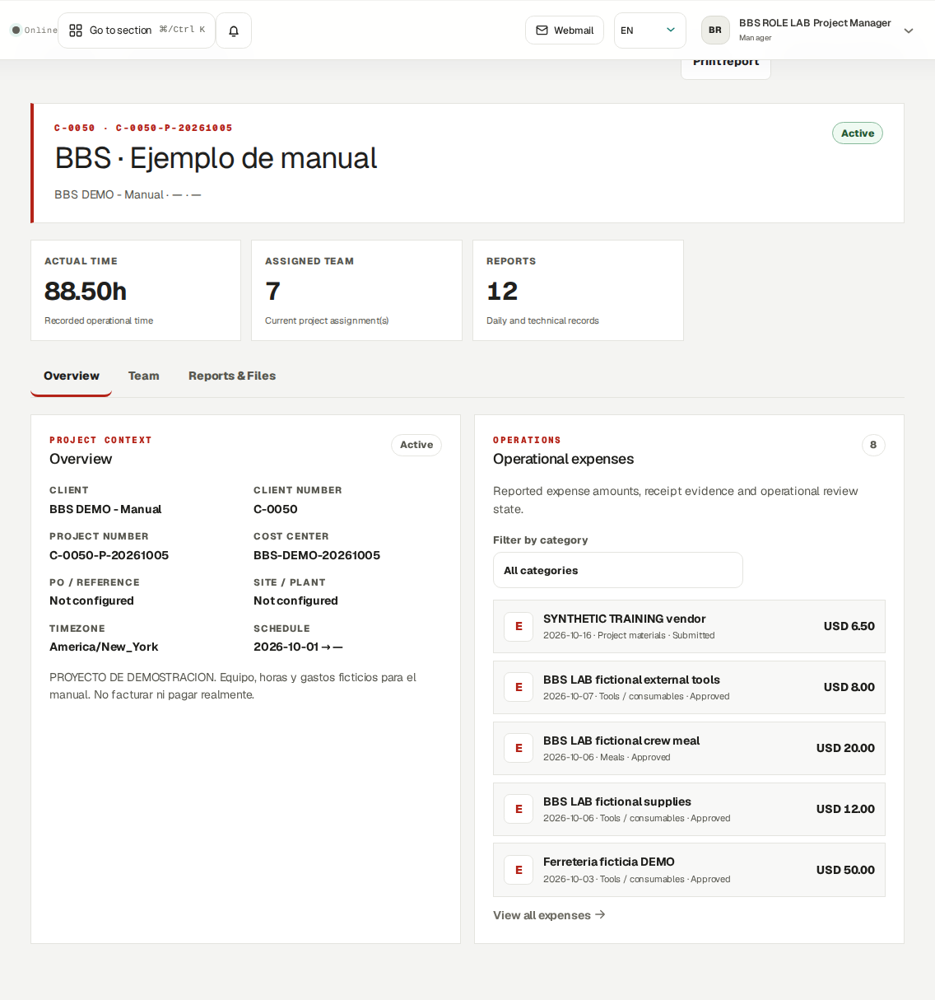

## Assign workers and verify saved membership dates

Go here: Team / Projects → assignments

Context: Native isolated BBS role exercise · C-0050-P-20261005 · synthetic October 2026 work only

Project membership and Can review are separate permissions. Assign only people whose work and dated coverage are authorized; the Owner completes the required project setup.

### Do the task

1. Inspect the project and current membership dates. To add membership, open Assign worker and use Project, Expertise filter, Search workers, Worker, Starts on and optional Ends on, then Assign.
2. For an existing membership, open Update assignment, inspect Starts on and Ends on, choose Update and reload the membership to verify persistence.
3. The native exercise updated Worker 2’s BBS membership from October 1/open-ended to October 1–31, verified the saved dates, then restored the open end through Update and verified it again.

### Verify the result

- Update assignment was executed successfully and restored. Assign worker fields were inspected; a new assignment was not executed because available people already had overlapping membership.
- Native supplier membership date changes were rejected by the dated coverage guard. The attempted changes did not save. Ask the Owner to resolve coverage.

### If you get stuck

- If a date change is blocked, read the validation and check saved membership before retrying. Do not bypass the guard or assume a directory record is membership.

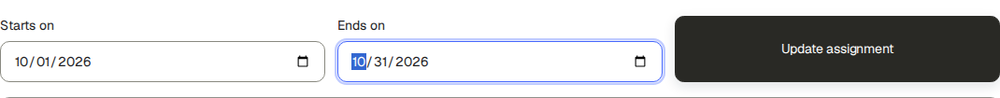

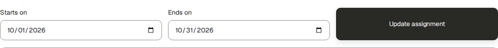

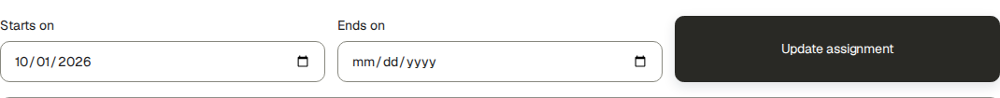

## Review a submitted source using the correct decision

Go here: Approvals → submitted source

Context: Native isolated BBS role exercise · C-0050-P-20261005 · synthetic October 2026 work only

Open the source and inspect author, project/date, duration or receipt, work facts and existing history. Review authority is source-specific. Supplier technician time is Owner-only; authorized PM operational report review is separate. See Review authority · who receives each source (review-authority) and Recovery · correct a source or request help (recovery-matrix).

Approve accepts the submitted operational facts. Needs changes requests a linked corrected draft while preserving the source. Reject records that the source is rejected; it is not the normal correction route.

### Do the task

1. Choose Needs changes when the activity occurred but facts need correction. Enter a clear actionable reason, then verify Needs changes on the source.
2. Choose Reject for a source that should not count as submitted work, and record the reason. Reopen it to verify Rejected.
3. In the October 17 exercise PM rejected the fictional duplicate 15-minute source 01a11182-241b-74a7-8ad1-fc97a79e39ee. PM returned the separate 30-minute source 01a11182-2cc0-7526-9344-32c28151b219 because actual duration was 15 minutes.

### Verify the result

- Both native decisions persisted on their exact sources. Needs changes permitted author correction; Rejected did not expose Create corrected draft.

### If you get stuck

- A worker should read a rejection reason and avoid re-entering the rejected duplicate. If rejection was mistaken, escalate to the reviewer/Owner; do not promise a correction action absent from the source.

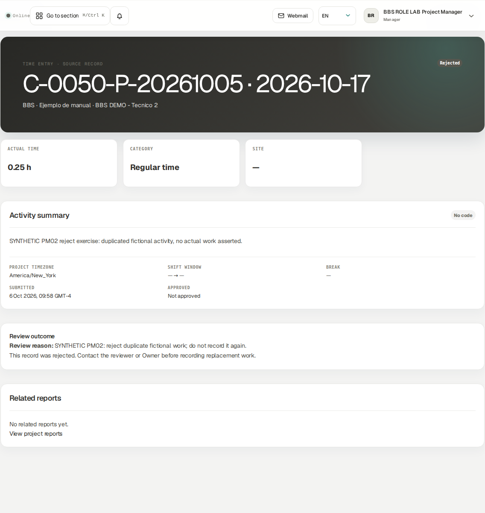

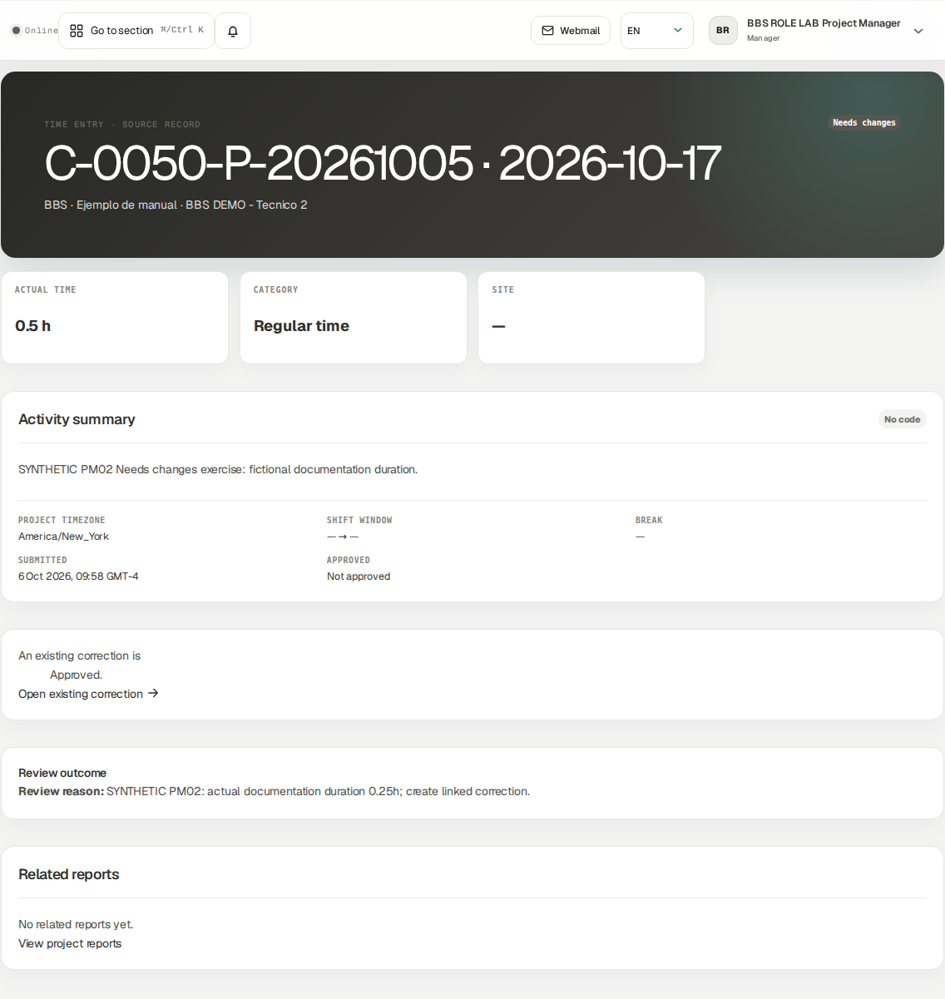

## Verify author recovery and approve the linked replacement

Go here: Returned source → linked correction → review

Context: Native isolated BBS role exercise · C-0050-P-20261005 · synthetic October 2026 work only

Needs changes is an author-recovery workflow. The recorded worker creates the linked corrected draft and submits it; PM verifies the replacement against the reviewer reason.

Rejected history is preserved separately and does not offer the same author correction action. See Review authority · who receives each source (review-authority) and Recovery · correct a source or request help (recovery-matrix).

### Do the task

1. Open the returned October 17 Worker 2 source and verify the reason requests 15 actual minutes.
2. The worker opens Create corrected draft, enters the corrected duration/activity/reason, saves and submits the linked replacement.
3. PM opens replacement 01a11183-46a0-743e-92fc-e0760db21f77, compares the original link and reason, then Approves and reopens the saved source.

### Verify the result

- The native author recovery and PM review were completed. Replacement is Approved at 15 minutes; original remains Needs changes. No duplicate rejected activity was recreated.

### If you get stuck

- When a replacement does not address the reason, return it with specific remaining facts. Preserve all original/replacement links.

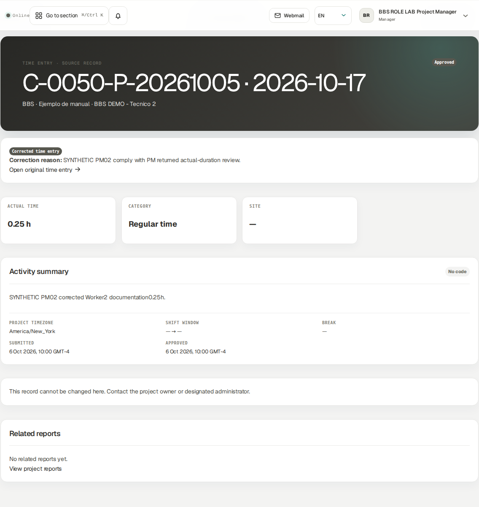

## Review authored Daily and Technical facts with attribution

Go here: Reports → source record

Context: Native isolated BBS role exercise · C-0050-P-20261005 · synthetic October 2026 work only

Daily and Technical reviews accept operational narratives. They do not approve supplier time, authorize customer acceptance or certify a clean attachment scan.

Work performed by, Report created by and Reviewed by identify distinct responsibilities. Verify the actual attribution after review.

### Do the task

1. Open the submitted report and inspect project/date, narrative, evidence metadata and source version.
2. For Technical / PLC inspect context, diagnosis/change, validation result, production impact, risks and rollback. Read the saved native preview.
3. Use Approve or Needs changes with a reason as appropriate. Reopen the source and inspect Approved, reviewer, author and version.

### Verify the result

- Native coordinator Technical source 01a1117d-a645-738f-adae-f60c4e5a3f4a reached Approved v3. Work performed by and Report created by show the coordinator; Reviewed by shows the PM. The October 13 coordinator Daily was also approved.

### If you get stuck

- Check a private attachment’s exact Storage and Scan status; Saved/Not scanned is not proof of clean scanning.

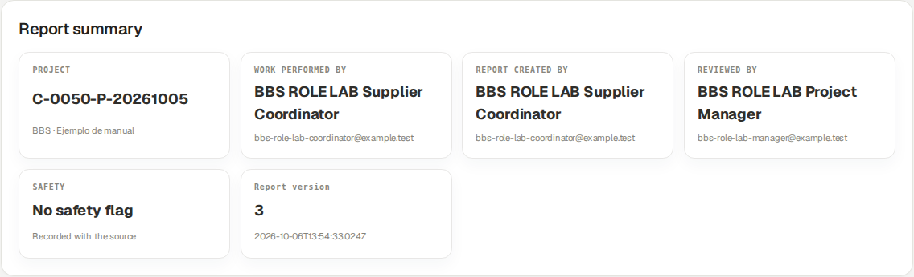

## Review the ready customer version and acceptance queue

Go here: Reports → customer period report → Customer follow-up

Context: Native isolated BBS role exercise · C-0050-P-20261005 · synthetic October 2026 work only

Approved time and reports are period inputs. Finance or Owner refreshes period reports and creates the customer artifact. PM then reads the exact customer version permitted by project scope.

The October 13–19 customer snapshot is v2 with content hash 85ba28d58be5c1f0c582266794df84fc491344508b23c63a33659b0ce98d6042. It contains the approved period inputs present at generation, including the coordinator Daily and 3.75 internal time hours displayed as 3.8 h. Later records do not silently rewrite this snapshot.

### Do the task

1. After Finance prepares the period, open the Ready customer report PDF and inspect period, project, source identity, version and activity content.
2. For report 01a11179-da79-7298-baa2-074d02192e78 PM used the native Approve customer report action bound to that exact v2/hash.
3. Open the customer follow-up/acceptance queue for BBS, From October 13 to To October 19. Verify the row is Ready for signature and open the exact current report.
4. Hand the version to the authorized customer process. Record actual acceptance only when it occurs; a Ready for signature row is not a signed copy.

### Verify the result

- Native Finance generation, PM exact-version approval and the Ready acceptance queue were verified. No customer signature, acceptance event or payment was invented. PM saw the approved operational hours and activity.

### If you get stuck

- If later source corrections affect the period, ask Finance/Owner to create and review the new current version before requesting acceptance.

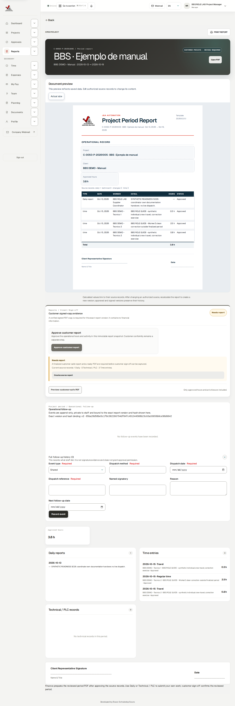

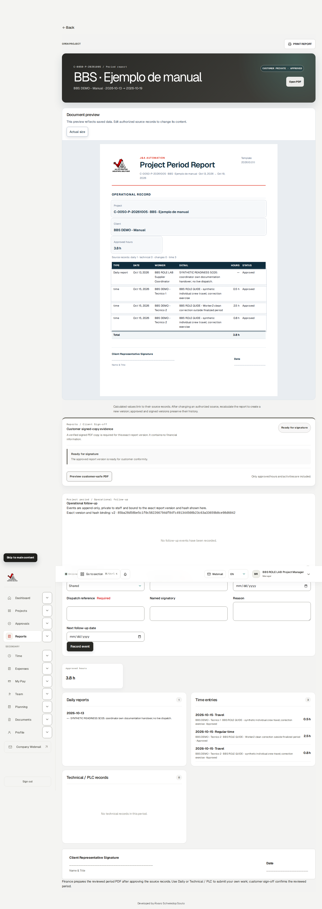

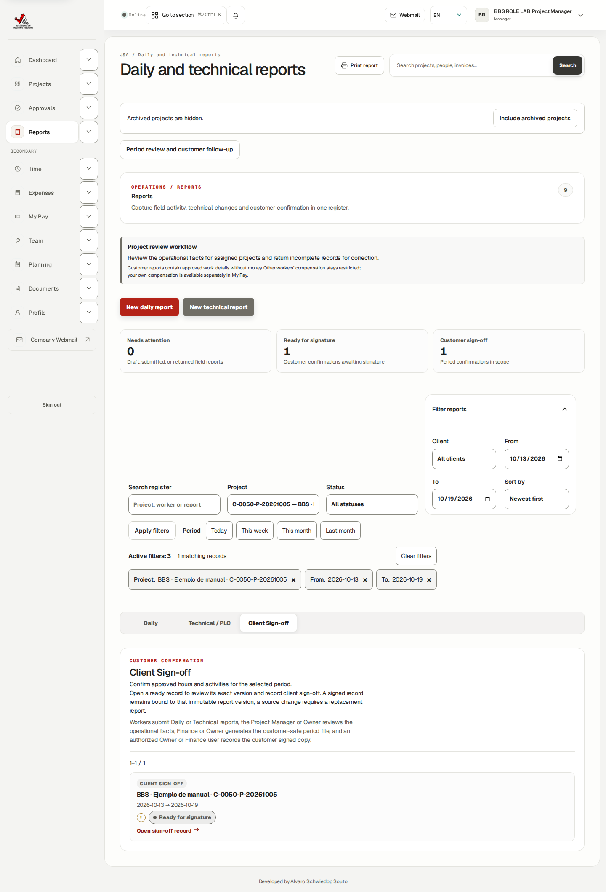

## Publish a future plan without creating actual time

Go here: Planning → Publish field assignment

Context: Browser-verified isolated BBS project C-0050-P-20261005. All ROLE LAB records are synthetic training; they are not real dispatch, customer acceptance, purchase or payment.

Planning is an expectation and coordination tool. It does not create recorded work or approvals. Planning and worker agendas explicitly display UTC.

The positive BBS exercise published a future October 16 08:00–10:00 UTC assignment for Worker 2, planned 2 hours, fictional bench site and required expertise.

### Do the task

1. Open Planning and select BBS in Publish field assignment.
2. Select the existing assigned worker(s). Verify availability and assignment coverage for the intended date.
3. Enter Start (UTC), optional End (UTC), optional Planned hours, Site and Required expertise. Use the actual agreed schedule; do not convert site-local time silently.
4. Choose Publish assignment. Open the October 16 day and the Published schedule record.
5. Confirm the selected worker, UTC start/end and 120 planned minutes. Ask the worker to verify their agenda; they still record actual work independently afterward.

### Verify the result

- Native PM Publish assignment succeeded. Worker 2’s separate role session saw the published plan.
- A read-only database check found zero BBS actual time entries on October 16 after publication and update.

### If you get stuck

- If the worker is absent, verify dated project assignment and availability with Owner/Team. Publishing is not a substitute for project membership.
- If dates are wrong, use the published record’s update workflow rather than creating an overlapping duplicate plan.

## Change a published assignment and verify persistence

Go here: Planning → Published schedule → Open record

Context: Browser-verified isolated BBS project C-0050-P-20261005. All ROLE LAB records are synthetic training; they are not real dispatch, customer acceptance, purchase or payment.

A published assignment can be edited through its own record. Updating the plan does not correct an actual source that a worker has already submitted.

### Do the task

1. Open Published schedule and choose Open record for the correct BBS worker/date.
2. Inspect Worker, Start, End, Planned minutes, Site and Required expertise.
3. Change the intended planning value and choose Save assignment. Reopen the same record to verify the new value.
4. If the assignment should be canceled, use Cancel assignment on that record, then verify its state and tell the affected worker. The separate October 22 cancellation was executed in the historical planning checkpoint; the original positive assignment example remains separate.

### Verify the result

- PM changed only the fictional bench site note and Save assignment succeeded; the original worker, date and 2-hour plan remained.
- No October 16 actual time source was created by either publish or update.

### If you get stuck

- Check that you opened a planning record, not a time-entry source. Actual submitted work requires the reviewed correction path.
- Coordinate a genuine cancellation with the worker; do not assume a changed plan deletes recorded history.

## Follow a shared plan through crew work and review

Go here: Planning → October 20; Worker / Chief: Today; Approvals

Context: Isolated BBS planning and crew lab · October 20–25, 2026. Browser-verified synthetic operational records; no real dispatch, payment or customer acceptance. Earlier examples retain their original date scope.

The Owner published one common October 20 08:00–16:00 UTC plan to the Chief and two existing technicians. This created three planning records, one per person. Their separate Worker-role agendas each showed an eight-hour BBS plan. Project membership and dated chief delegation remained separate prerequisites.

Actual work differed: Technician 1 personally recorded six hours; the Chief recorded seven hours for Technician 2 through the delegated Crew workspace; the Chief personally recorded eight hours. Each source was submitted individually and reviewed by a separate Project Manager account.

### Do the task

1. Open Planning, choose October 20 and inspect the three BBS agenda records. Confirm project, worker, UTC interval and 480 planned minutes for each.
2. Ask each worker to check Today → Upcoming assignments using their own account. They do not accept or complete the plan with a task button; they record and report actual work separately.
3. For delegated crew entry, have the Chief check project, date and managed worker before saving individual actual hours. Avoid duplicating a crew-entered source through a worker’s own time form.
4. Open Approvals for BBS and October 20. Review the submitted 6 / 7 / 8 hours and operational notes. Choose the supported Approve control for each truthful source.
5. Ask the workers to reopen Time → Week of 2026-10-19. Technician 1 shows Actual 6.00h, Expected 8.00h, Difference −2.00h and Needs note; Technician 2 shows 7.00h / 8.00h / −1.00h and Needs note; Chief shows 8.00h / 8.00h / 0.00h and Approved.

### Verify the result

- Native multi-worker publication created no actual time. Later separately authored sources persisted Approved with 360 / 420 / 480 minutes and the correct creator identities.
- Needs note is a weekly comparison indicator for approved time differing from its expectation. The underlying source remains Approved. Explain the work difference in operational notes/reports; never force actual hours to match a target.

### If you get stuck

- A chief’s ability to record crew time does not automatically grant review authority. Ask the Owner to verify the separate review permission.
- If a worker reports a missing plan, compare today in UTC, project membership and the published plan date. If the actual source is wrong, use the correction chapter rather than editing planning.

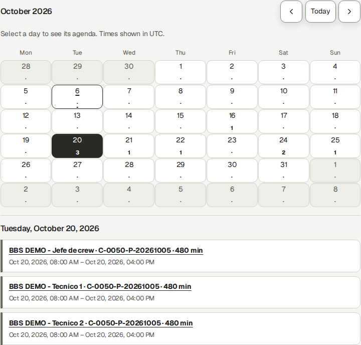

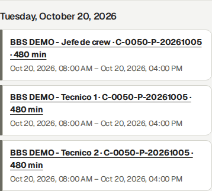

## Distinguish planned hours, expected hours and work goals

Go here: Planning; Worker: Today and Time; Owner: Projects → Expected Working Schedule

Context: Isolated BBS planning and crew lab · October 20–25, 2026. Browser-verified synthetic operational records; no real dispatch, payment or customer acceptance. Earlier examples retain their original date scope.

The Owner configures Expected Working Schedule through Projects → More actions. It has an effective date, IANA timezone and a minutes value for each weekday. The BBS lab’s October 19 schedule is 480 minutes Monday–Friday and zero on weekends. This reference is separate from published planning and never creates actual work.

The October 21 practice plan was edited to three hours, 09:00–12:00 UTC. Worker 1 sees Planned: 3 h, while the Wednesday timesheet still expects 8.00h and records 0.00h until actual work is entered. Creation displays Planned hours; the edit form displays Planned minutes, so three hours is 180 minutes.

Planning and worker agendas display UTC. On October 20, 08:00–16:00 UTC means 10:00–18:00 Europe/Madrid or 04:00–12:00 America/New_York. Convert for the actual date, because daylight-saving changes can alter the offset.

There is no generic worker-goal Accept / Reject / Mark completed workflow. Use assignments for coordination, expected hours for comparison and Daily / Technical reports for actual progress and blockers. Project milestones are separate project checkpoints; ask the Owner to establish any required milestone configuration.

After the earlier planning tables, the Owner added an explicitly synthetic October 23-only membership for Technician 1 in the existing fictional onboarding project. The later Worker weekly table shows Friday Expected and Difference as — because two own projects cover that day. Earlier screenshots still correctly show Friday eight hours and weekly forty before that extra assignment. No actual work was entered in the second project.

The earlier cancellation screenshots are a historical checkpoint, not the final published-plan count. After later synthetic schedules, the final isolated BBS planning summary contains nine Published assignments and one Cancelled assignment. Cancellation removes that assignment from current published coverage while retaining its history; it creates no actual time.

### Do the task

1. Open an existing Published assignments record, edit the interval, Planned minutes and optional site, and choose Save assignment. Reopen it to verify persistence and ask the worker to reload Today.
2. To cancel a plan, identify the correct project, person and dates and choose Cancel assignment. Check the calendar and the worker’s upcoming agenda. Cancellation does not erase or correct an actual-time source.
3. If Today has no plan but lists Your assigned projects, check whether the plan is future or has not been published. Membership alone does not publish a shift.
4. If the worker is unavailable in the publish form, ask the Owner to check active account status and project-assignment coverage for the selected interval. Supplier personnel with coverage ending October 31 are not eligible on November 1.
5. If Expected is —, ask the Owner to check membership and effective schedule dates. Zero is a valid target; — means unknown. Worker 1’s September 28–30 precede their October 1 membership and therefore show unknown expectations.
6. If multiple projects cover the day, do not add their targets together yourself. The application leaves the expectation unknown where it lacks a single effective project/schedule. Resolve the planning allocation with the Owner; the later October 23 one-day second-assignment checkpoint demonstrates the unknown target.

### Verify the result

- Native PM edit saved 180 minutes, updated UTC dates and site; the Worker agenda reflected those values after reload. The weekly expected eight hours did not change.
- A separate October 22 Worker 2 plan was cancelled natively and disappeared from the Worker agenda. Its retained record has cancelled status and no actual-time source was generated.
- The later separate Worker session showed October 23 Actual 0.00h / Expected — / Difference — while the main October 20 six actual and eight expected hours stayed unchanged. Counting a future own membership for ambiguity did not expose that project in the current selector or add actual records.

### If you get stuck

- The External Technician profile has restricted Time / Expenses / Reports access and currently no internal Today agenda or Planning calendar, even when the Owner publishes a plan. Confirm its schedule through the authorized operational handoff.
- Use screenshots and hours comparisons to explain operational issues within your authorized project. Send questions outside that scope to the Owner.
- After a publish-field validation message, correct the highlighted field and recheck the retained person, UTC interval, planned quantity, Site and Required expertise before retrying.

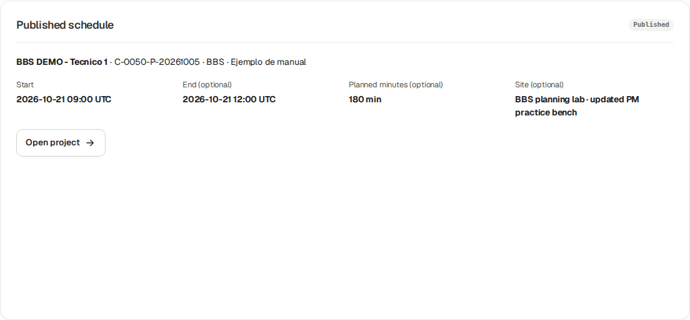

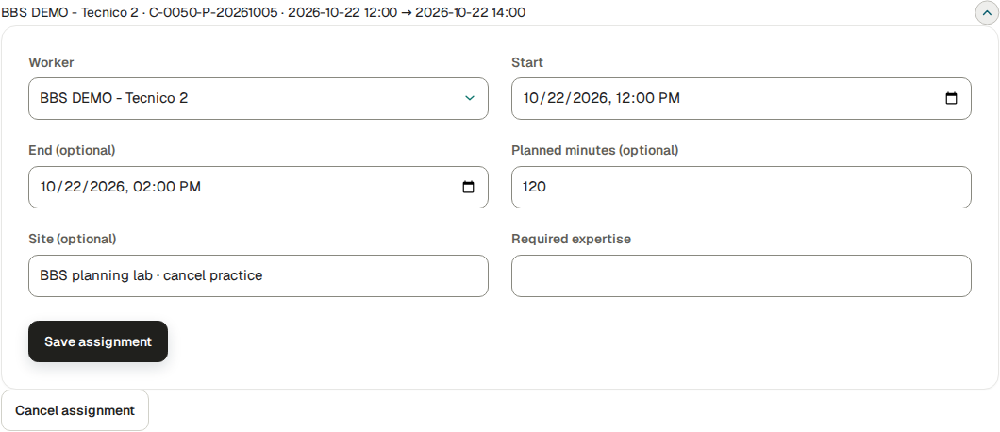

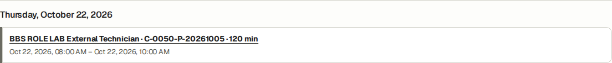

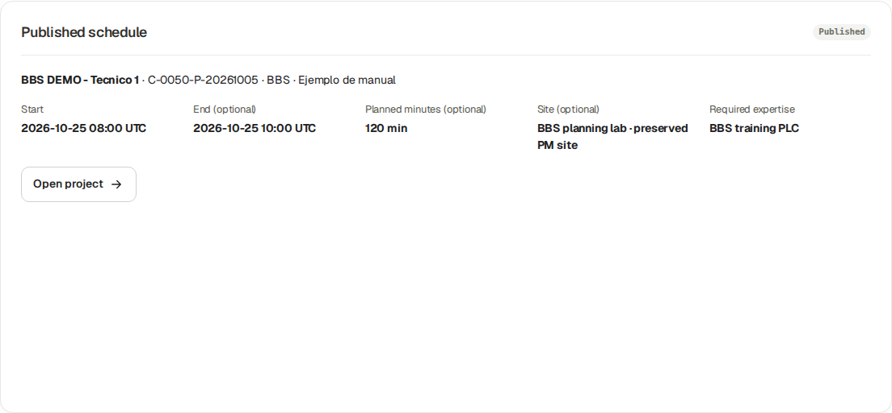

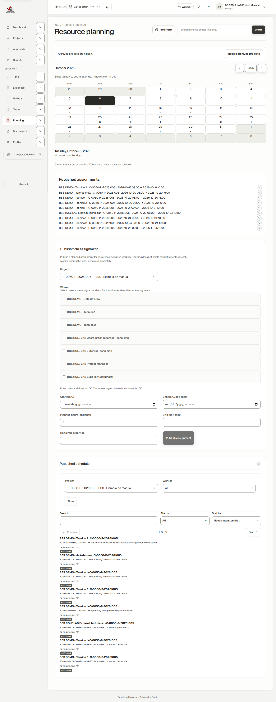

## Maintain expertise and availability in the correct scope

Go here: Profile → Expertise and availability

Context: Browser-verified isolated BBS project C-0050-P-20261005. All ROLE LAB records are synthetic training; they are not real dispatch, customer acceptance, purchase or payment.

Profile lets the PM inspect authorized workforce expertise and availability. Availability windows and Planning use UTC. Account security below the workforce profile concerns your own signed-in account.

The positive exercise saved only the fictional PM’s own available October 16 08:00–10:00 UTC window. No other person’s real availability was changed.

### Do the task

1. Open Profile. Use Inspect worker and View worker profile to confirm whose workforce information is displayed.
2. Choose Add availability. Enter Starts and Ends in UTC, select Available/appropriate status, add the operational note, and choose Save availability.
3. Reopen Profile and inspect the availability window table and calendar day. Check person, dates, times and status.
4. For expertise, use Add expertise, select the appropriate existing skill and proficiency, save, and recheck the table. Skill editing was inspected, not executed in this packet.

### Verify the result

- Native PM availability Save succeeded and the reopened table showed the exact fictional October 16 window.
- The separate planning record remained Worker 2’s future assignment; availability alone did not publish a plan or create hours.

### If you get stuck

- Before changing a workforce record verify the selected person; changing Inspect worker does not switch your authenticated account.
- If the required expertise is absent, ask the Owner to maintain the expertise catalog. Avoid using an unrelated skill as a placeholder.

## Record your own operational time and hand it off

Go here: Time → Log time → Save draft → Submit

Context: Browser-verified isolated BBS project C-0050-P-20261005. All ROLE LAB records are synthetic training; they are not real dispatch, customer acceptance, purchase or payment.

The PM can record personal operational work separately from reviewing crew facts. The Time register can include authorized people; your source must name the intended worker. My Pay remains personal.

The positive exercise saved 0.50 actual hour on October 8 for the fictional PM’s documentation work, then submitted it. It remains pending another authorized reviewer; this packet did not self-approve it.

### Do the task

1. Open Time, filter BBS and the intended dates, then choose Log time.
2. Select Assigned project BBS, enter the actual Date, Operational category, Actual hours and Activity summary. Add start/end times only if known.
3. Choose Save draft. Open the saved source and verify the person, date, duration and summary.
4. Choose Submit for the reviewed draft. Confirm Submitted and give its source to another authorized reviewer.
5. For weekly entry, inspect every draft included before Submit all week drafts. Copy previous week layout copies layout; it is not a statement that the work happened. Weekly copy/bulk submission were inspected, not executed in this PM packet.

### Verify the result

- The PM source was genuinely saved and Submitted with 30 minutes.
- The source was not approved. Personal My Pay showed a pending estimate rather than proof of payment.

### If you get stuck

- Correct an ordinary draft before submission. Once submitted, follow a returned linked correction and explicit resubmission.
- If a source is locked or its correction action is unavailable, send the Owner its ID, project, work date, requested correction and reason.

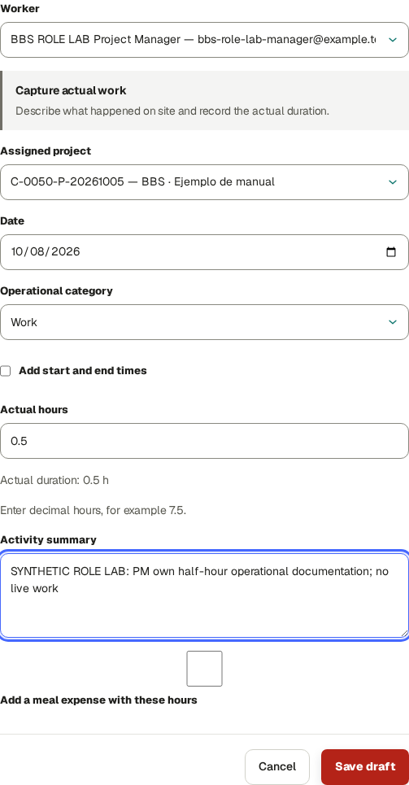

## Inspect receipts and distinguish operational review from repayment

Go here: Expenses → Record expense / Approvals Expenses

Context: Browser-verified isolated BBS project C-0050-P-20261005. All ROLE LAB records are synthetic training; they are not real dispatch, customer acceptance, purchase or payment.

Expenses records receipt evidence and operational facts: project, date, category, vendor, currency, amount and who paid. Record the actual purchase facts; reimbursement is a later separate step. The PM operationally approved existing synthetic receipts; PM own expense creation was not executed here.

### Do the task

1. Open Expenses and filter BBS, date range, worker, category, currency or Receipt evidence as needed.
2. Open the receipt/source and check the event, amount, currency, payer and any linked logged hours. Required receipt missing needs supporting evidence before submission or review.
3. For your own permitted new expense choose Record expense, enter the factual fields and attach the receipt, then Save draft and inspect it before Submit. This is an inspected reference path in the PM packet.
4. For another submitted expense, go to Approvals → Expenses and Approve correct operational facts or return a specific Required change.
5. Send Finance the approved source for the later reimbursement review and payment process.

### Verify the result

- PM operational approvals succeeded for the fictional USD 12 worker supply receipt, USD 20 allocated shared meal and USD 8 external expense.
- No reimbursement date, payee or actual payment was recorded by the PM packet.

### If you get stuck

- Never change currency merely to make an amount resemble another view. Check receipt evidence and the actual original spending currency.
- An Approved receipt is not proof of reimbursement; the authorized Finance process and the worker’s own payment status provide that check.

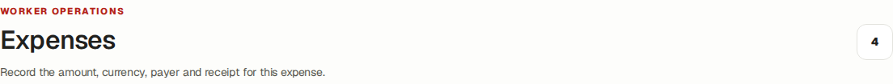

## Read only your own compensation and payment status

Go here: My Pay → From / Through → Apply period

Context: Browser-verified isolated BBS project C-0050-P-20261005. All ROLE LAB records are synthetic training; they are not real dispatch, customer acceptance, purchase or payment.

My Pay identifies your signed-in account’s own activity, compensation and reimbursement. Confirm that identity and the selected period before reading the statement.

Estimated compensation, approved compensation, finalized settlement, expected payment date and recorded actual payment mean different things. A settlement is not a bank transfer.

### Do the task

1. Open My Pay and select From and Through; choose Apply period.
2. Review approved and pending estimates, Own activity detail, Settlement status and Reimbursement status for that period.
3. Compare the source state with your own estimate. For the PM October 8 half-hour Submitted source, the October 1–31 view showed a pending estimate; it did not prove that payment occurred.
4. For your own statement, confirm From and Through, choose Apply period, then Generate report in Worker statement. If preparing, use Check statement status where offered or refresh after processing. Download PDF and CSV separately only when each is Ready; open each and verify your own identity, selected period and included activity. This sequence is source checked; PM statement generation was not executed in this packet.
5. If an amount or expected payment is wrong, give Finance the source/project/period and the observed difference.

### Verify the result

- Native My Pay opened within the signed-in PM’s own scope and selected period. A URL query naming a different person did not change that scope.
- The PM packet created no settlement or actual payment.

### If you get stuck

- Check period first: the default view ended on the current day, excluding future October 8 training activity.
- Do not assume an estimate is money owed today or money received. Ask Finance about settlement and payment evidence separately.

## Register and retrieve a private project document

Go here: Documents → Upload document

Context: Native isolated BBS role exercise · C-0050-P-20261005 · synthetic October 2026 work only

Sensitivity labels describe content handling. Document audience/access is a separate scope decision. The PM Upload document form exposes Project, Artifact type, Sensitivity, Description and File; it does not expose the Owner’s Document access selector.

Register only permitted operational project documents. Ask the Owner to register material needing an audience or access control unavailable in your upload form.

### Do the task

1. Select your permitted project, Artifact type, Sensitivity (Internal, Sensitive or Customer private), Description and File. Choose Upload and register hash.
2. Inspect the saved filename, project, sensitivity, byte size, hash and exact scan status. Saved is not the same as scanned clean.
3. Open the native private document link. Compare the retrieved file with the registered content/hash and retain its source identity.

### Verify the result

- Native PM document 01a11186-4194-7524-a61a-dcd5a4deb734 was registered within BBS. It is a synthetic operational project note, with no claimed business event. Native private retrieval was executed.

### If you get stuck

- If retrieval is denied, verify project scope and document audience with the Owner. Never widen sensitivity or audience to bypass access.

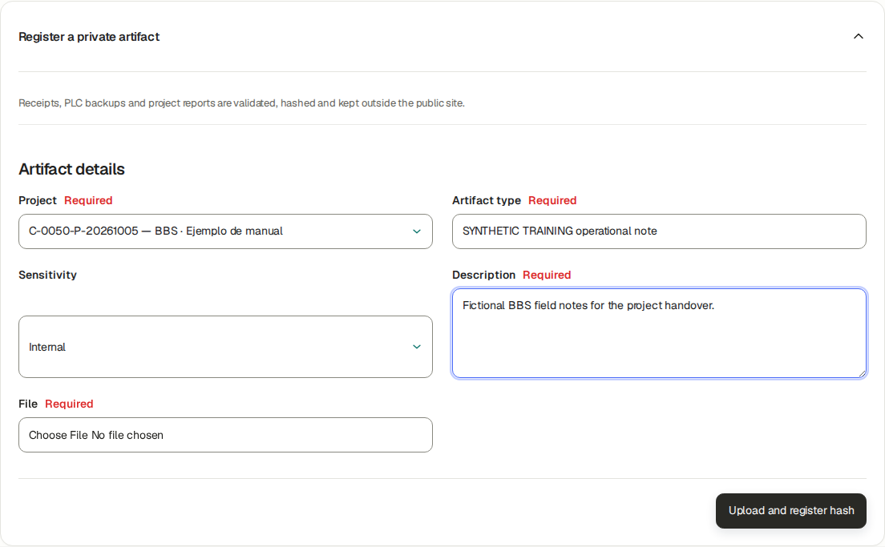

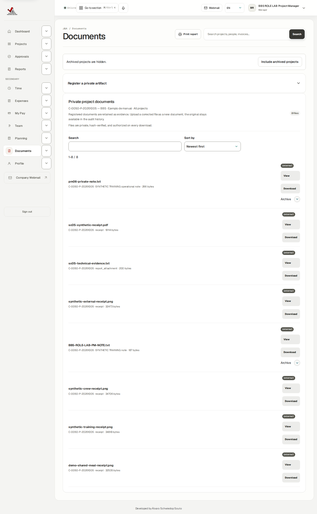

## Follow a notification to the current permitted source

Go here: Notifications → source link

Context: Native isolated BBS role exercise · C-0050-P-20261005 · synthetic October 2026 work only

A notification is a pointer to an event. It does not approve a source, create a PDF, pay an expense or certify that the source still has the same state. Mark read only changes inbox acknowledgement.

### Do the task

1. Open Notifications and read the project/event. Follow the report link rather than assuming the notification text is the current source.
2. In the native exercise Owner approval of PM own Daily 01a11185-3b39-770f-91e5-29cc4809f223 produced a Report approved notification.
3. Follow its link and verify the source is currently Approved. Use a permitted source action: PM generated the own saved report PDF, then refreshed to Ready and downloaded it.

### Verify the result

- A populated native notification and its current Approved source were verified. The exercise used Generate report; it did not treat Mark read as a business-state action.

### If you get stuck

- If a link is unavailable, verify current project/source scope. Do not borrow an account to follow an old notification.

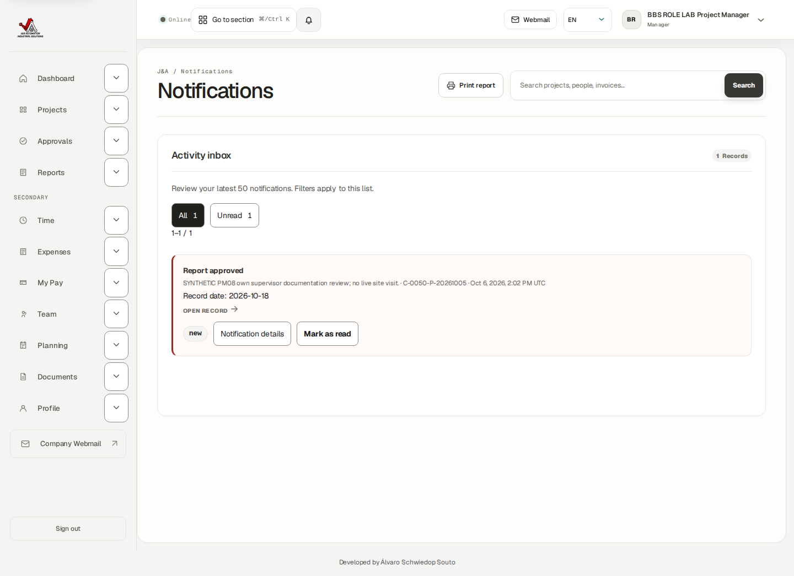

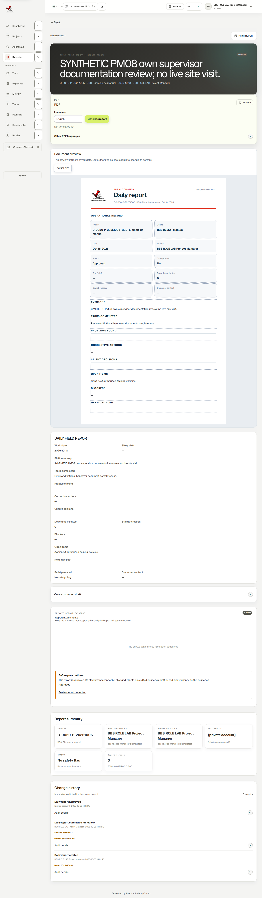

## Complete own reports and use the shared access/security procedures

Go here: Own Reports / Expenses / My Pay / Profile / Help

Context: Native isolated BBS role exercise · C-0050-P-20261005 · synthetic October 2026 work only

PM own work remains an authored worker source. In the native October 18 exercise PM selected their own Worker, BBS and report date, completed summary/tasks/open items/next-day plan, saved, submitted, and Owner approved the Daily v3.

For invitation and sign-in use Access · activate the invitation and sign in (access). For MFA, devices and recovery use Security · verify your own device and recovery options (security).

For own expenses use Category, Date, Amount, Currency, Who paid, Description, Payment method and private receipt; verify the saved receipt before Submit. Operational approval is distinct from reimbursement. The own-expense procedure is source-checked here, not claimed newly executed.

Use My Pay for your own statement. Check your identity, period, included sources, currency and actual payout state. No new PM payout was created in this exercise.

### Do the task

1. For an own report choose yourself in Worker where the form requests it, complete the facts and Save draft. Submit and verify the receiving reviewer and source state.
2. On the approved own Daily select language, Generate report, Refresh until Ready, then Download and compare v3/source identity.
3. Use the shared access/security chapters for actual invitation, MFA, device and recovery procedures. Use Completion check · your permitted role cycle (verification) to distinguish native execution from source-checked references.

### Verify the result

- PM own Daily was approved by Owner, generated Ready in English and downloaded natively. This exercised a separate reviewer; it does not assert that every source has a universal self-review denial.

### If you get stuck

- For current access or recovery problems follow the shared security recovery instructions and contact the Owner using the approved company channel.

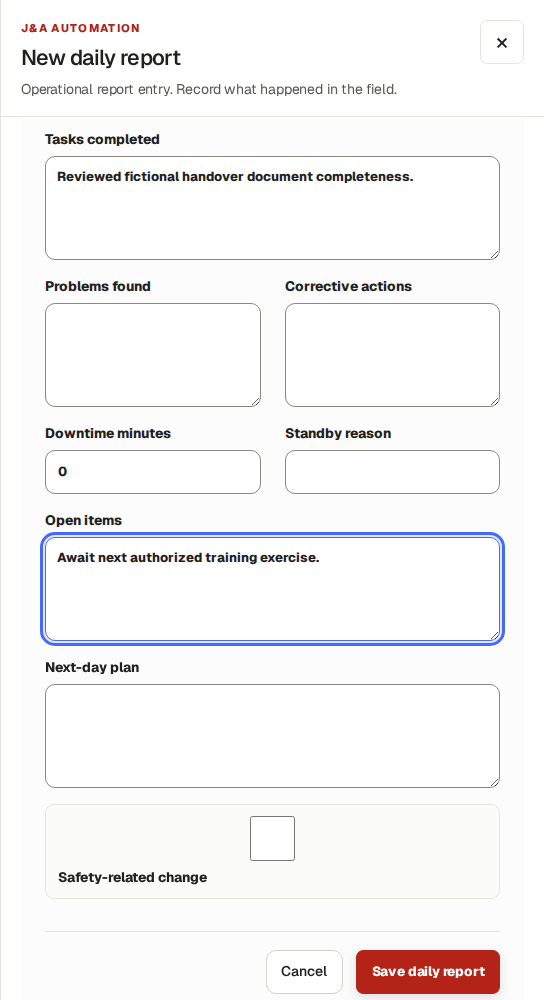

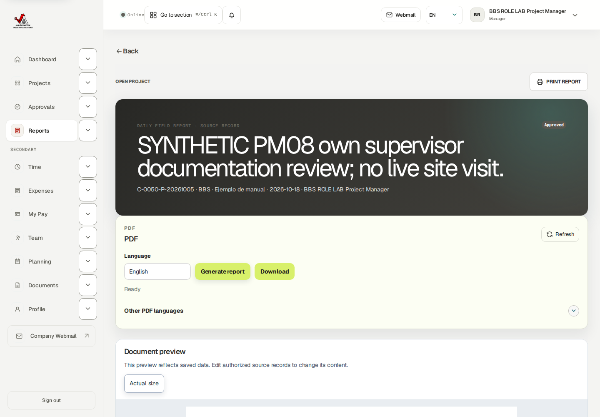

## Complete the PM operational cycle and hand off

Go here: Dashboard → Planning → Approvals → Reports

Context: Browser-verified isolated BBS project C-0050-P-20261005. All ROLE LAB records are synthetic training; they are not real dispatch, customer acceptance, purchase or payment.

A practical PM day starts with authorized scope and future plans, moves through actual-source review and correction, and ends with report and reimbursement handoffs. Finance handles the reimbursement/payment lifecycle; Owner maintains company access and policy.

Native coverage includes saved/restored membership dates, Reject and Needs changes decisions, author linked recovery and PM approval, actual Approved Technical attribution, Finance-created customer v2 followed by PM approval and Ready signature queue, private document registration and matching retrieval, populated notification to current source, own Daily approval by Owner and Ready PDF download. New Assign worker, own expense and statement generation remain source-checked references. See Completion check · your permitted role cycle (verification).

### Do the task

1. Confirm BBS project identity, timezone and your active membership. Check future Planning against availability.
2. Review submitted sources in the correct Approvals tab. Return incorrect facts with precise reasons and re-review submitted linked corrections.
3. Check approved Daily/Technical narratives and the exact customer period queue. Send Finance/Owner the approved source/period handoff.
4. Record personal work under your own source and send it to another reviewer. Check your own My Pay separately.
5. Retain authorized project evidence, investigate processing/access errors, and report unresolved issues with exact source references.

### Verify the result

- No live email, customer signature, dispatch, purchase, bank payment or production business mutation occurred in this training packet.
- Earlier BBS records remained unchanged.

### If you get stuck

- Do not solve a locked history problem by duplicating a project or time source. Use the supported correction or Owner handoff.
- When a task belongs to another role, send a clear handoff: source, project, period, state, required result and reason.

## Recovery · correct a source or request help

Use your role’s worked correction lesson and the controls offered on the current record. Preserve the original. A new purchase is different from correcting an existing purchase.

| State | Supported next action |
| --- | --- |
| Ordinary Draft | Use Edit/Save draft where present; attach the actual receipt/evidence before Submit. Inspect each saved draft after weekly table entry. |
| Submitted | Read current state and reviewer handoff. Do not create another source merely because review is pending. |
| Needs changes | Read the reason. Time uses Create corrected draft where available, then submit/review the linked replacement. A returned Daily/Technical report instead offers Edit and Save changes on the same report, then Submit for review; follow the exact role lesson. |
| Rejected | Inspect the reason and contact reviewer/Owner. The time detail does not offer the same linked-correction route as Needs changes; do not assume that route exists. |
| Approved, correction available | Use the offered linked correction and review every value before creating it. Submit the replacement for the authorized reviewer and verify its resulting state. |
| Locked or correction unavailable | Send the source ID, project, work date, visible state, requested correction and reason to the designated administrator. Do not create a duplicate. Wait for instructions before changing the record. |

### If you get stuck

- If an action is unavailable to your account, return to your workspace and contact the designated administrator with the record reference and requested action. Do not change dates or people to work around a restriction.

## Security · verify your own device and recovery options

Go here: Profile → Account security; Profile → Add availability

### Do the task

1. Check Account security identifies YOUR account even when an authorized workforce profile inspection shows another worker above it. Enroll only your own device. MFA is optional in this release.
2. For a passkey, enter Device name and choose Register passkey on the approved secure portal. Complete your device’s creation confirmation. Verify Passkey registered for this account, the registered count and named device row. Cancelled/failed registration is not enrollment.
3. To retire your own lost/obsolete passkey, first confirm you retain another working sign-in method. Select Revoke on the exact device and verify Passkey revoked and removal of its row. If you cannot sign in, use the verified support route rather than another person’s session.
4. For an authenticator, choose Enable MFA. Keep the setup URI and one-time recovery codes private in the approved password manager. Add the URI to your authenticator, enter its current six-digit Authenticator code and choose Verify MFA. Verify Enabled and Disable MFA appear; enabling without verification is not completed enrollment.
5. At a later MFA sign-in use Six-digit code → Verify and continue. If the authenticator is unavailable, choose Use a recovery code and enter one unused stored code. If neither method is available, contact admin@j-aautomation.com for identity-verified recovery. Do not send recovery codes or the setup URI to support.
6. To remove optional MFA while signed in, choose Disable MFA and verify Not enabled/Enable MFA. Confirm the intended own account before doing so. A successful settings change is separate from recovering a lost account.
7. Where Add availability is offered, fill Starts, Ends, Availability and Note using the displayed time basis, then Save availability. Verify the saved interval/status/note in the list; use Edit availability on that row and save the changed values. Availability is not project membership, a published shift or actual hours.

## Completion check · your permitted role cycle

Use the worked lessons for your own role. Historical examples retain their stated dates and states. A procedure labelled reference was checked against the controls; its outcome was not necessarily executed in the illustrated session.

### Verify the result

- Confirm your identity, project and dates. Verify the saved and submitted source, its review state, supported correction or administrator handoff and each permitted Ready output. Submission, review and download are separate checkpoints.
