# Project Manager · BBS operational course

Assigned projects, planning, operational review, corrections, reports and precise role handoffs

## Before you practise · access and scope

This English guide uses BBS · Ejemplo de manual, project C-0050-P-20261005. The screenshots were taken using the stated role in an isolated database running the application. Training entries, payments, approvals and documents are fictional. They do not prove a real bank transfer, accountant approval or customer acceptance.

The company portal at https://j-aautomation.com/j-aautomation/app is LIVE. Training uses a separate URL and database. Before practising, obtain the isolated URL, your own role account and permitted exercises from the company administrator; verify the BBS project number. Without isolated access, treat these screenshots as read-only demonstrations and perform only authorized real work.

Use your own credentials. Do not borrow an Owner, Finance or colleague account. A platform role, project assignment, review permission, supplier authorization and dated crew delegation are separate requirements. Changing one does not automatically grant the others.

Select English in the workspace language control to follow the labels used here. Some saved BBS record names remain in their original language. On a phone open the navigation drawer to see full workspace names. Recheck the selected project and date range after every navigation.

The eight Worker test accounts in the private credentials document use the same Worker workflow. Crew chief is a dated delegation attached to a Worker account. Supplier Coordinator and External Technician are restricted profiles attached to Worker accounts. This guide never includes account passwords.

Each screenshot is an exercise checkpoint. Later fictional role entries and financial events are additional to the original October 1–5 workbook totals. Reopening the project or selecting the same dates does not restore that checkpoint. Read captions before comparing amounts or states.

### Verify the result

- Confirm your displayed account, role or supplier profile, the project number and the dates before saving.
- For training access, scope or reset help, contact the company administrator at admin@j-aautomation.com. Include the role, route, project number, time and visible error; omit passwords, cookies and private customer or worker documents.

### If you get stuck

- An empty project selector often means missing or expired assignment or authorization. Ask the Owner to check coverage for the date you are entering; do not create a duplicate project.
- A form shown in a screenshot can depend on role, source state or effective date. Use the documented role handoff when a control is absent.

## Start with your account and assigned scope

Go here: Sign in → Dashboard

Context: Browser-verified isolated BBS project C-0050-P-20261005. All ROLE LAB records are synthetic training; they are not real dispatch, customer acceptance, purchase or payment.

The Project Manager coordinates assigned projects and reviews operational facts. Account access, project membership, review permission and crew delegation are separate records. Having the Project Manager role does not automatically assign every project or authorize financial decisions.

This guide uses the same saved BBS project as the Owner and other role guides. The fictional Project Manager account was created through Owner Team, signed in normally, assigned to BBS and granted Can review. The Owner configured the required dated internal-cost and compensation coverage. Those setup actions belong to the Owner; this guide never asks you to create a duplicate BBS project.

### Do the task

1. Use your own invitation or company account. Open the portal sign-in screen, enter the account email and password, and choose Continue to workspace.
2. Check that the account shown in Profile is yours and the role is Project manager. Never use the Owner or another worker’s credentials to reach a missing control.
3. Open Dashboard and confirm BBS is in your authorized project scope. Open Projects and identify C-0050-P-20261005 before recording or reviewing anything.
4. Ask the Owner to verify active account status, dated project membership and Can review before starting this exercise. Assignment and commercial coverage must include the work date; current access also depends on the current application date.

### Verify the result

- Native login succeeded as the fictional Project Manager. Dashboard showed one authorized active project after the Owner completed dated membership.
- An assignment starting the following UTC day initially showed no current project. The Owner added genuine coverage for the current day through native controls; no role or session was fabricated.

### If you get stuck

- If BBS is missing, stop recording and give the Owner the project reference, your account and intended work dates. Do not create a replacement project.
- If a review control is missing, check membership dates and Can review separately from the role label.

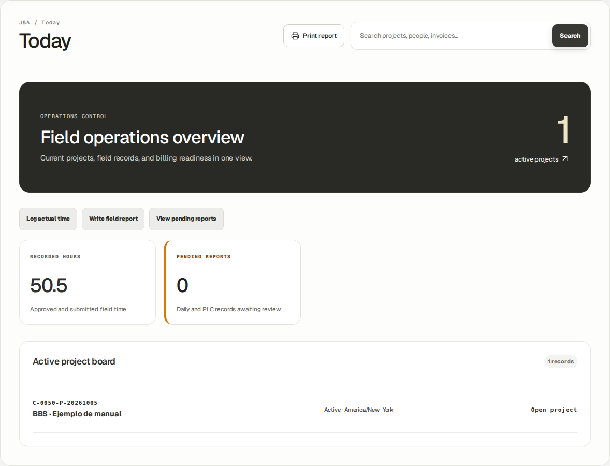

## Find the right workspace on desktop and phone

Go here: Dashboard → primary navigation / More

Context: Browser-verified isolated BBS project C-0050-P-20261005. All ROLE LAB records are synthetic training; they are not real dispatch, customer acceptance, purchase or payment.

Dashboard highlights operational activity. Projects holds project identity and scope; Approvals is the actionable review queue; Reports holds Daily, Technical / PLC and customer-follow-up views.

Time and Expenses are source registers. My Pay always concerns your own compensation. Team here is the operational directory and assignments, not Owner account administration. Planning publishes future assignments. Documents holds private project files; Profile holds expertise, availability and your security settings. Notifications and Help are separate destinations.

### Do the task

1. On desktop select the named workspace in the sidebar. Keep the BBS project filter when changing registers.
2. On a phone use Dashboard, Projects, Approvals and Reports in the bottom navigation. Open More for the secondary workspaces.
3. Use the workspace filters rather than assuming every total concerns your own work. Time can show people across authorized projects; My Pay remains personal.
4. Use horizontal scrolling where the screen says Scroll horizontally to review all columns. Open a record to see its full facts before taking action.

### Verify the result

- Actual PM navigation and Approvals were opened at 1440 desktop and 390 phone widths; the More drawer was captured.
- Planning was opened at 768 tablet width. These checks verify navigation and visible controls, not every device or browser.

### If you get stuck

- If a drawer covers your content, close it or select a destination. Recheck the project and dates after navigation.
- Access restricted means the role cannot use that destination; return through Open my workspace and ask the Owner about the business handoff.

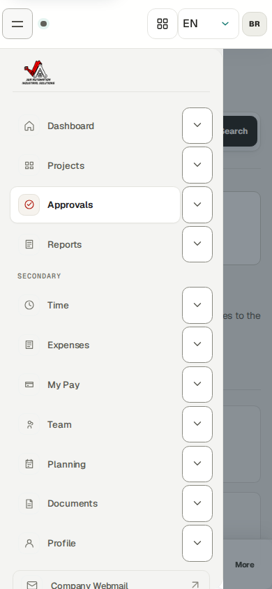

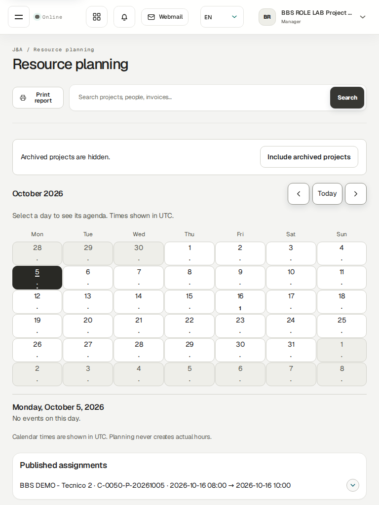

## Use Dashboard to decide where to act

Go here: Dashboard → authorized project

Context: Browser-verified isolated BBS project C-0050-P-20261005. All ROLE LAB records are synthetic training; they are not real dispatch, customer acceptance, purchase or payment.

Dashboard provides operational oversight. Recorded hours and activity counts are not invoice revenue, compensation settlements or cash collected. Open the underlying register to inspect its scope and state.

### Do the task

1. Open Dashboard and identify the BBS project card and visible operational totals.
2. Choose the project or workspace behind an attention item. In Approvals use the BBS project and the work-date range to isolate the pending source.
3. Inspect the record and its history before deciding whether the facts are complete. Review daily work, expenses and reports in their own queues.

### Verify the result

- The fictional PM dashboard displayed only authorized BBS project oversight. Financial portfolio workspaces were absent.
- A cleared queue is a completion check; it does not replace inspecting an actionable record first.

### If you get stuck

- If the number differs from a register, compare date range, workers, state filters and whether the dashboard figure means recorded or reviewed activity.
- Escalate economic or billing questions to Finance or the Owner rather than interpreting operational hours as money.

## Inspect the project before changing its team

Go here: Projects → BBS → Overview

Context: Browser-verified isolated BBS project C-0050-P-20261005. All ROLE LAB records are synthetic training; they are not real dispatch, customer acceptance, purchase or payment.

Project identity includes reference, client, status, schedule and timezone. BBS uses America/New_York for source work context, while Planning explicitly uses UTC. Your project Overview, Team and Reports / files views expose operational information.

### Do the task

1. Open Projects. Use Search projects or Status, then Apply filters to find C-0050-P-20261005.
2. Open BBS and confirm the client, active status, planned start and timezone in Overview.
3. Open Team to inspect who is assigned and use Reports / files to reach project outputs and evidence.
4. Before making an assignment change, compare the intended work dates with existing coverage and the worker’s availability.

### Verify the result

- Native PM project detail and Team were opened. The project was scoped to BBS.
- The three canonical BBS invoice records were preserved; this PM packet created no project duplicate or invoice.

### If you get stuck

- Include archived projects only when looking for historical work. Do not reopen or duplicate archived work to circumvent a blocked source.
- Project closing, commercial contracts and company billing belong to the authorized Owner/Finance process. Seek that handoff when those controls are unavailable.

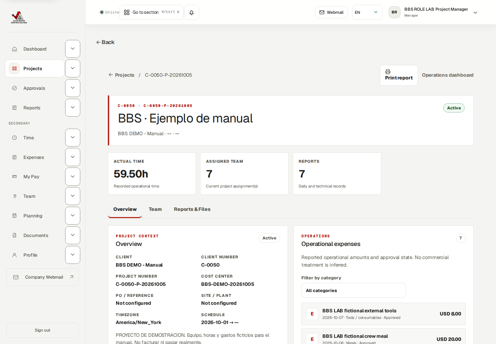

## Understand Team, assignments and review authority

Go here: Team → Project assignments

Context: Browser-verified isolated BBS project C-0050-P-20261005. All ROLE LAB records are synthetic training; they are not real dispatch, customer acceptance, purchase or payment.

Team shows specialists in operational scope, availability, assignments and activity. An account can be Active yet lack dated project access. An assignment can exist without review permission. Chief delegation is another dated authorization and does not grant operational approval.

The PM browser exposed Assign worker, Update assignment and Remove assignment controls with dates. Owner-only commercial and review-permission fields were not shown in those PM forms. Existing historical assignments were inspected and left unchanged.

### Do the task

1. Open Team and search the person by name or email. Confirm that this is the existing person record, avoiding a duplicate.
2. Open the Project assignments count. Identify the BBS assignment and inspect Starts on and Ends on.
3. For a genuinely authorized new assignment, open Assign worker, select BBS and the existing worker, enter dates, and choose Assign. This assignment mutation is a reference procedure here; this packet did not change another worker’s historical membership.
4. For a date change use Update assignment on the correct person/project, then re-open and verify persistence. If removing access is required, use Remove assignment with a reason and coordinate the effects on future work.
5. Ask the Owner for Can review or chief delegation changes; do not assume changing project dates grants these permissions.

### Verify the result

- Native PM Team listed BBS people and the actual assignment controls. The guide distinguishes inspected controls from executed assignment changes.
- All shared account/assignment/supplier bootstrap in this exercise was performed by the Owner through native forms.

### If you get stuck

- If Assign returns a coverage or state error, preserve the record and send the Owner the dates and intended person. Required commercial coverage is an Owner prerequisite.
- If a supplier technician lacks login access, an operational directory record is not enough: the Owner must create/link the permitted access profile.

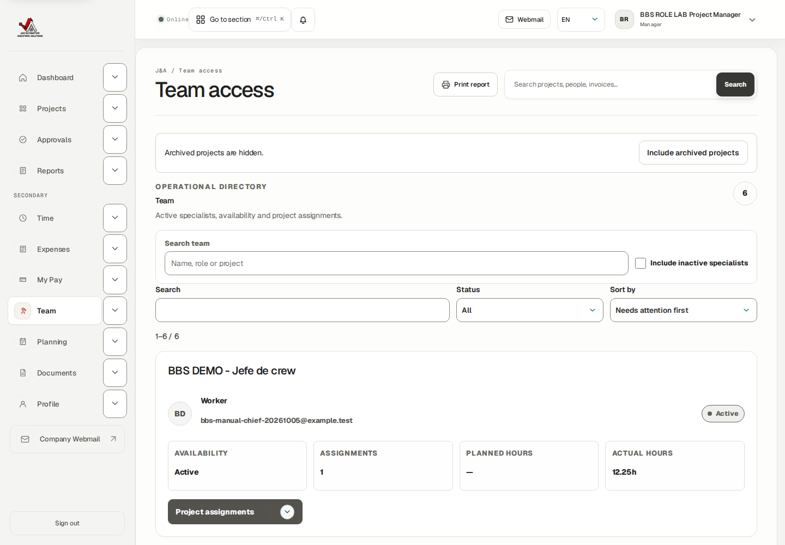

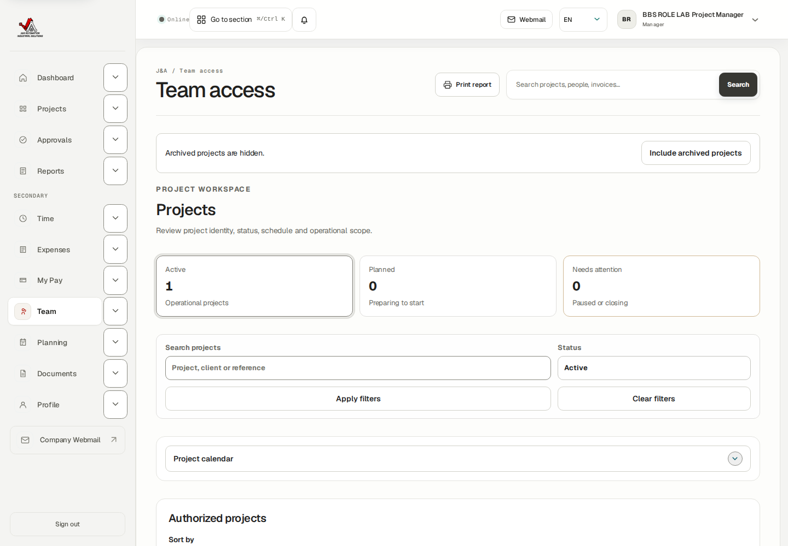

## Review submitted time and expenses operationally

Go here: Approvals → Time / Expenses

Context: Browser-verified isolated BBS project C-0050-P-20261005. All ROLE LAB records are synthetic training; they are not real dispatch, customer acceptance, purchase or payment.

Operational approval confirms the work or expense facts. Finance review later determines customer billing and expense treatment. Approving does not invoice the client, settle pay or reimburse a worker.

The queue remembers its selected tab. Always check Time, Expenses or Reports visibly; a saved Expenses tab can hide the time item you expected.

### Do the task

1. Open Approvals. Select BBS, enter From and To, select the intended tab and choose Apply filters.
2. Use Needs attention or Status Submitted. Open the source record to inspect date, person, actual duration or receipt, activity and any correction history.
3. For correct time or expense facts, choose Approve on that source’s card. Confirm the resulting state is Approved and it moves to completed follow-up/Finance review.
4. For incorrect facts, open Review actions, enter the Required change reason, and choose Needs changes. State exactly what the author should correct.
5. Use Reject only for a justified rejection with the required reason. This rejection path was not executed in the training packet.

### Verify the result

- Genuine PM approval succeeded for submitted worker/chief time, Daily and Technical reports, the synthetic USD 12 worker expense, USD 20 shared meal and USD 8 external expense.
- PM review did not change customer billability, reimbursement entitlement, invoice state or recorded payments.

### If you get stuck

- If a source is missing, check the tab, dates, project, worker and status. Refresh after new account/assignment creation and open the exact source from its author’s handoff.
- If the permitted review still does not appear, send its ID and scope to the Owner. The coordinator’s own Oct 8 time was not displayed in this PM queue; it remains submitted for an authorized handoff.

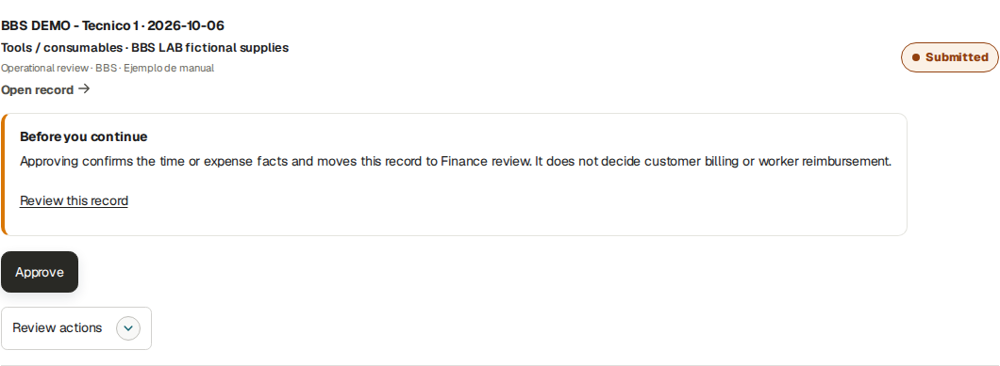

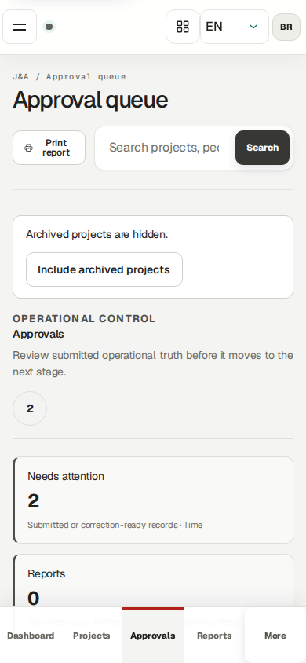

## Return a source and verify its linked replacement

Go here: Approvals → Time → Review actions

Context: Browser-verified isolated BBS project C-0050-P-20261005. All ROLE LAB records are synthetic training; they are not real dispatch, customer acceptance, purchase or payment.

Submitted or returned sources are not silently edited in place. The author creates a linked correction draft with changed operational facts and a reason, explicitly submits it, and the PM reviews the replacement. The original remains in history.

The positive exercise used Worker 2 on October 15, outside that worker’s finalized October 1–14 settlement. A Worker 1 October 6 correction was correctly blocked by the worker’s finalized October 1–31 settlement; an audited Finance adjustment is a separate handoff.

### Do the task

1. Find Worker 2’s submitted October 15 3-hour source. Open Review actions, enter that actual training work was 2.5 hours, and choose Needs changes.
2. Give the source and reason to the worker. The worker uses Create corrected draft and Submit through their own account.
3. Find the submitted 2.5-hour replacement, open its correction reason and original link, then choose Approve if the changed facts are correct.
4. Repeat for the chief-recorded Worker 2 1-hour source: return it for 0.75 hour; the chief creates and submits the linked correction in the delegated workflow.
5. Approve the submitted 0.75-hour replacement. Verify the author’s current October 15 activity is 3.25 hours: 2.5 own +0.75 delegated. The original 3+1 hours must not both count again.

### Verify the result

- Both genuine PM replacements were Approved: 150 and 45 minutes. Both originals remained Needs changes.
- Worker and Chief guide captures verify the current 3.25-hour total. No finalized settlement or original invoice was modified.

### If you get stuck

- If correction creation is blocked by finalized coverage or billing, stop and refer the exact source and error to Finance/Owner. Do not add an unrelated new time entry as a substitute.
- If the correction has not been submitted, tell its author to use the linked detail’s Submit. A draft alone is not ready for operational approval.

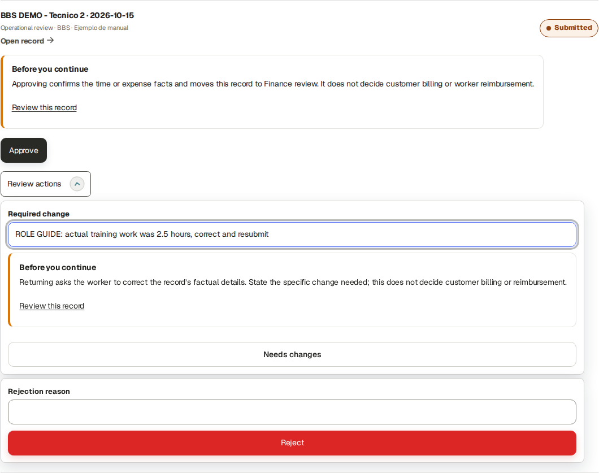

## Review Daily and Technical / PLC reports

Go here: Reports → Daily / Technical / PLC → Approvals Reports

Context: Browser-verified isolated BBS project C-0050-P-20261005. All ROLE LAB records are synthetic training; they are not real dispatch, customer acceptance, purchase or payment.

Daily reports capture shift summary, completed tasks, problems, corrective action and next-day plan. Technical / PLC reports capture technical changes and rationale. These narratives complement actual hours; neither creates time or proves customer acceptance.

A worker or chief submits the report. The PM reviews assigned-project operational facts; Finance or Owner subsequently creates customer period outputs and records genuine signed evidence.

### Do the task

1. Open Reports, filter BBS and the work dates, and select Daily or Technical / PLC.
2. Open the submitted report. Check who performed work, who created it, its version, date, narrative and private attachments.
3. Open Approvals and select Reports. Choose Approve report for a complete source, or return it with a specific reason through the available review action.
4. Reopen Reports and verify Approved and Reviewed by your PM account. Approved report content can then contribute to authorized customer-safe period output.
5. For your own operational reporting, New daily report or New technical report opens the source form. Save the draft and explicitly Submit for review; another authorized reviewer performs your review. Own PM report creation was not executed in this packet.

### Verify the result

- PM Approved worker, chief, external technician and coordinator Daily reports, plus worker/chief/external Technical reports, using their real submitted source IDs.
- The report register displayed the actual PM reviewer attribution. No real equipment change or live dispatch is asserted by these synthetic narratives.

### If you get stuck

- Return incomplete narratives rather than approving a blank or ambiguous report. The author must change the supported draft/correction and resubmit.
- If a preview or attachment fails, inspect the preserved source fields, report the exact failure, and avoid treating a missing preview as customer acceptance. The restricted supplier own-report preview defect found during testing was fixed; their own object is permitted and another worker’s remains denied.

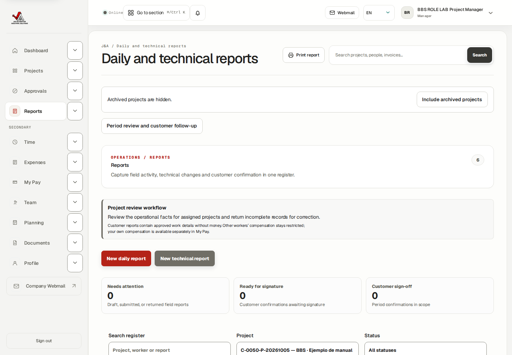

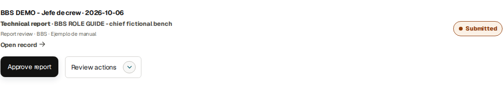

## Check period readiness and hand off customer sign-off

Go here: Reports → Period review and customer follow-up / Client Sign-off

Context: Browser-verified isolated BBS project C-0050-P-20261005. All ROLE LAB records are synthetic training; they are not real dispatch, customer acceptance, purchase or payment.

Customer acceptance applies to an exact report version and signed evidence, not an entire date range or all project work. A replacement report is required when a signed report’s underlying content changes.

The PM interface explicitly assigns customer-safe period file generation to Finance/Owner and recording the customer’s signed copy to an authorized Owner/Finance user. Operational review is your handoff.

### Do the task

1. Open Reports and choose Period review and customer follow-up.
2. Select BBS, enter Period start and Period end, and choose Review period.
3. Inspect the Customer report queue for version, period and readiness. Use Client Sign-off to locate Needs report, Ready for signature, Signed or Invalid / superseded records in the same project/date scope.
4. If no customer report covers the period, send Finance/Owner the approved sources and intended dates. Do not mark operational approval as customer consent.
5. After Finance/Owner prepares a report, compare its exact version with the genuine signed evidence and ask the authorized user to complete the evidence-bound sign-off workflow.

### Verify the result

- Native PM Review period for BBS October 6–31 showed no customer report; no acceptance was invented.
- Customer-follow-up and sign-off screens were opened as PM and displayed the explicit Owner/Finance handoff without financial amounts.

### If you get stuck

- If a report was superseded or its sign-off invalidated, use the replacement version and obtain the required genuine evidence. Preserve the old record and PDF.
- PM customer sign-off mutation was not executed and is not claimed as a permitted shortcut.

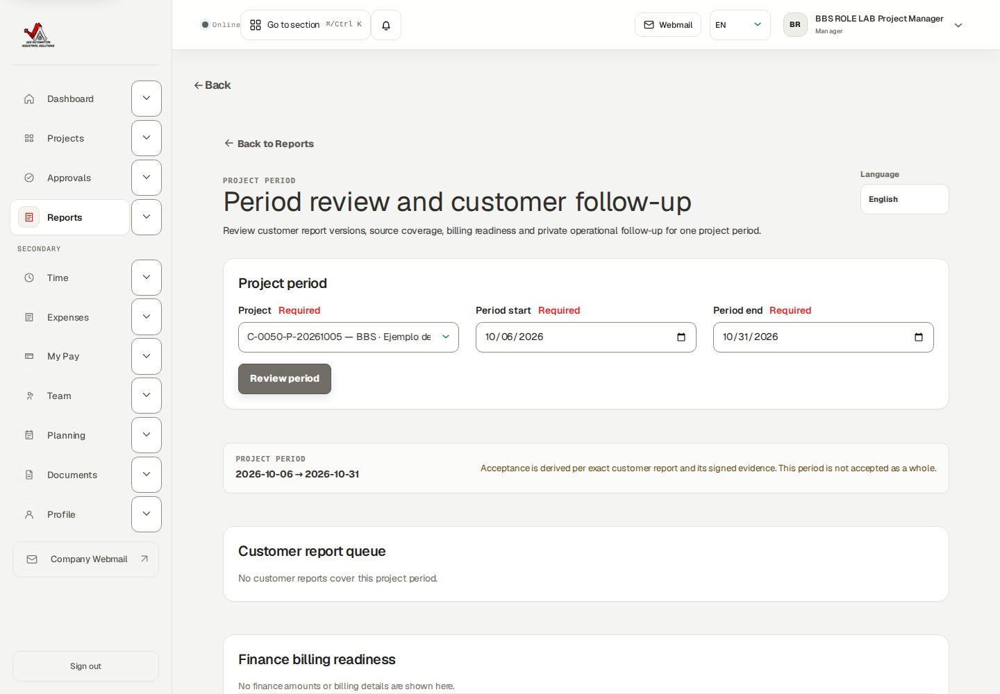

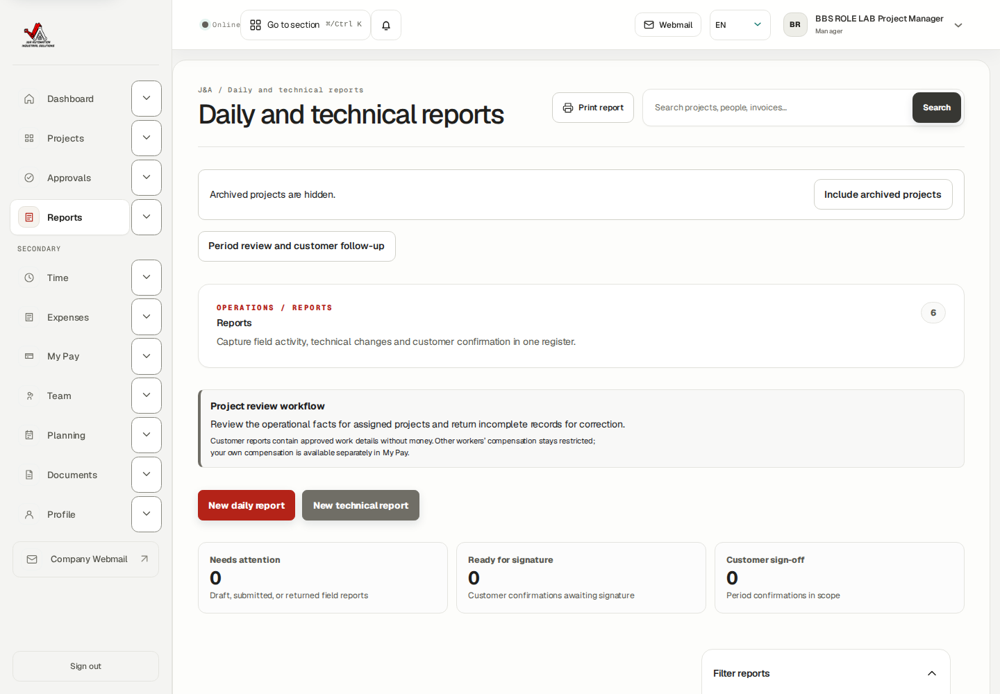

## Publish a future plan without creating actual time

Go here: Planning → Publish field assignment

Context: Browser-verified isolated BBS project C-0050-P-20261005. All ROLE LAB records are synthetic training; they are not real dispatch, customer acceptance, purchase or payment.

Planning is an expectation and coordination tool. It does not create recorded work, approvals, invoice units or worker pay. Planning and worker agendas explicitly display UTC.

The positive BBS exercise published a future October 16 08:00–10:00 UTC assignment for Worker 2, planned 2 hours, fictional bench site and required expertise.

### Do the task

1. Open Planning and select BBS in Publish field assignment.
2. Select the existing assigned worker(s). Verify availability and assignment coverage for the intended date.
3. Enter Start (UTC), optional End (UTC), optional Planned hours, Site and Required expertise. Use the actual agreed schedule; do not convert site-local time silently.
4. Choose Publish assignment. Open the October 16 day and the Published schedule record.
5. Confirm the selected worker, UTC start/end and 120 planned minutes. Ask the worker to verify their agenda; they still record actual work independently afterward.

### Verify the result

- Native PM Publish assignment succeeded. Worker 2’s separate role session saw the published plan.
- A read-only database check found zero BBS actual time entries on October 16 after publication and update.

### If you get stuck

- If the worker is absent, verify dated project assignment and availability with Owner/Team. Publishing is not a substitute for project membership.
- If dates are wrong, use the published record’s update workflow rather than creating an overlapping duplicate plan.

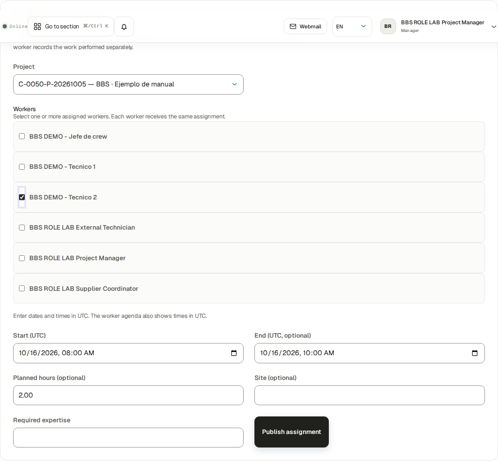

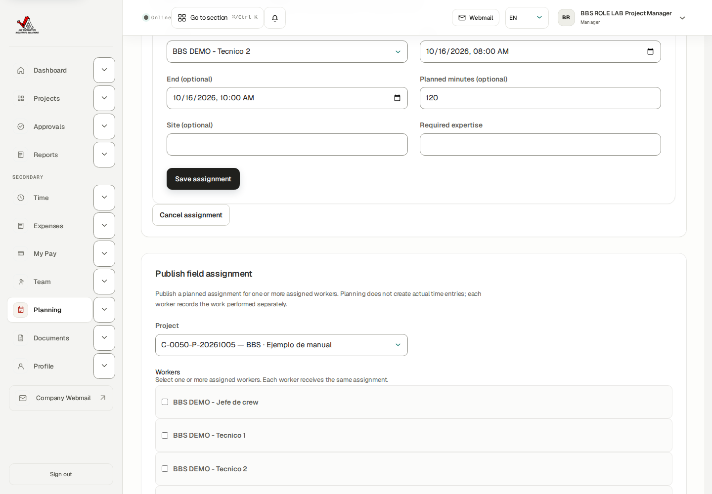

## Change a published assignment and verify persistence

Go here: Planning → Published schedule → Open record

Context: Browser-verified isolated BBS project C-0050-P-20261005. All ROLE LAB records are synthetic training; they are not real dispatch, customer acceptance, purchase or payment.

A published assignment can be edited through its own record. Updating the plan does not correct an actual source that a worker has already submitted.

### Do the task

1. Open Published schedule and choose Open record for the correct BBS worker/date.
2. Inspect Worker, Start, End, Planned minutes, Site and Required expertise.
3. Change the intended planning value and choose Save assignment. Reopen the same record to verify the new value.
4. If the assignment should be canceled, use Cancel assignment on that record, then verify its state and tell the affected worker. Cancellation was inspected but not executed here, preserving the positive worker agenda example.

### Verify the result

- PM changed only the fictional bench site note and Save assignment succeeded; the original worker, date and 2-hour plan remained.
- No October 16 actual time source was created by either publish or update.

### If you get stuck

- Check that you opened a planning record, not a time-entry source. Actual submitted work requires the reviewed correction path.
- Coordinate a genuine cancellation with the worker; do not assume a changed plan deletes recorded history.

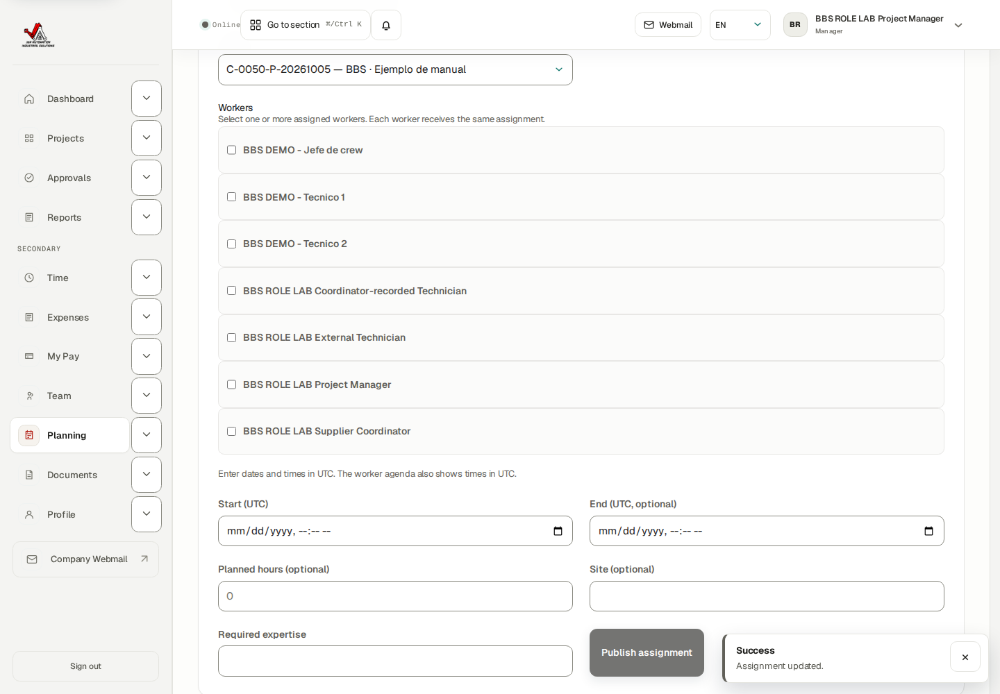

## Maintain expertise and availability in the correct scope

Go here: Profile → Expertise and availability

Context: Browser-verified isolated BBS project C-0050-P-20261005. All ROLE LAB records are synthetic training; they are not real dispatch, customer acceptance, purchase or payment.

Profile lets the PM inspect authorized workforce expertise and availability without exposing other workers’ compensation. Availability windows and Planning use UTC. Account security below the workforce profile concerns your own signed-in account.

The positive exercise saved only the fictional PM’s own available October 16 08:00–10:00 UTC window. No other person’s real availability was changed.

### Do the task

1. Open Profile. Use Inspect worker and View worker profile to confirm whose workforce information is displayed.
2. Choose Add availability. Enter Starts and Ends in UTC, select Available/appropriate status, add the operational note, and choose Save availability.
3. Reopen Profile and inspect the availability window table and calendar day. Check person, dates, times and status.
4. For expertise, use Add expertise, select the appropriate existing skill and proficiency, save, and recheck the table. Skill editing was inspected, not executed in this packet.

### Verify the result

- Native PM availability Save succeeded and the reopened table showed the exact fictional October 16 window.
- The separate planning record remained Worker 2’s future assignment; availability alone did not publish a plan or create hours.

### If you get stuck

- Before changing a workforce record verify the selected person; changing Inspect worker does not switch your authenticated account.
- If the required expertise is absent, ask the Owner to maintain the expertise catalog. Avoid using an unrelated skill as a placeholder.

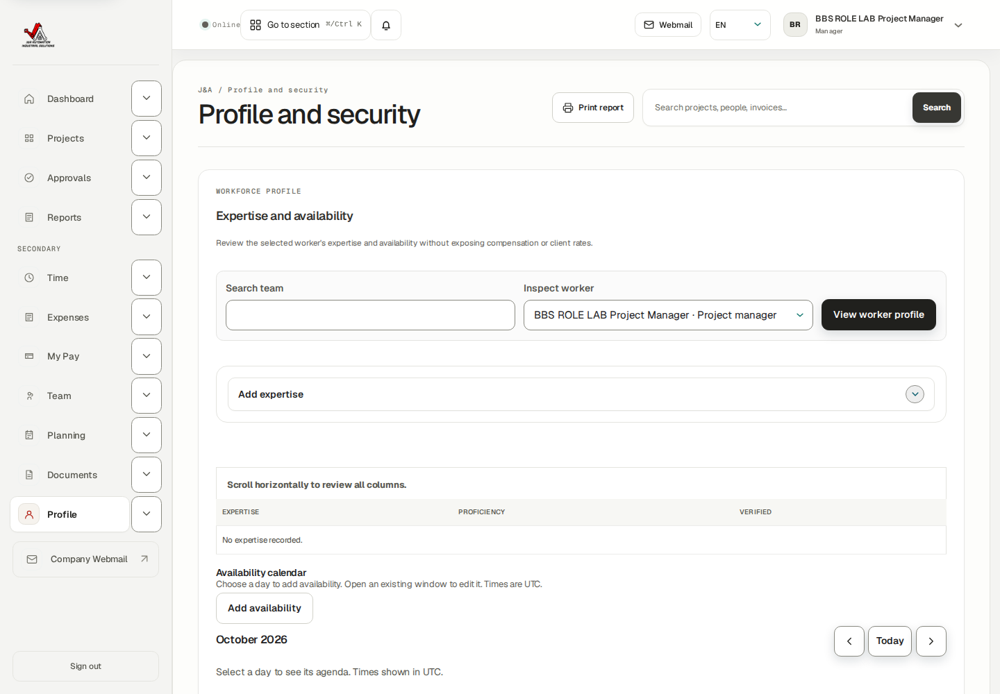

## Record your own operational time and hand it off

Go here: Time → Log time → Save draft → Submit

Context: Browser-verified isolated BBS project C-0050-P-20261005. All ROLE LAB records are synthetic training; they are not real dispatch, customer acceptance, purchase or payment.

The PM can record personal operational work separately from reviewing crew facts. The Time register can include authorized people; your source must name the intended worker. My Pay remains personal.

The positive exercise saved 0.50 actual hour on October 8 for the fictional PM’s documentation work, then submitted it. It remains pending another authorized reviewer; this packet did not self-approve it.

### Do the task

1. Open Time, filter BBS and the intended dates, then choose Log time.
2. Select Assigned project BBS, enter the actual Date, Operational category, Actual hours and Activity summary. Add start/end times only if known.
3. Choose Save draft. Open the saved source and verify the person, date, duration and summary.
4. Choose Submit for the reviewed draft. Confirm Submitted and give its source to another authorized reviewer.
5. For weekly entry, inspect every draft included before Submit all week drafts. Copy previous week layout copies layout; it is not a statement that the work happened. Weekly copy/bulk submission were inspected, not executed in this PM packet.

### Verify the result

- The PM source was genuinely saved and Submitted with 30 minutes.
- The source was not approved, financially classified or invoiced. Personal pay showed a pending estimate rather than proof of payment.

### If you get stuck

- Correct an ordinary draft before submission. Once submitted, follow a returned linked correction and explicit resubmission.
- If finalized settlement or billing coverage blocks a correction, hand off to Finance/Owner with the exact error.

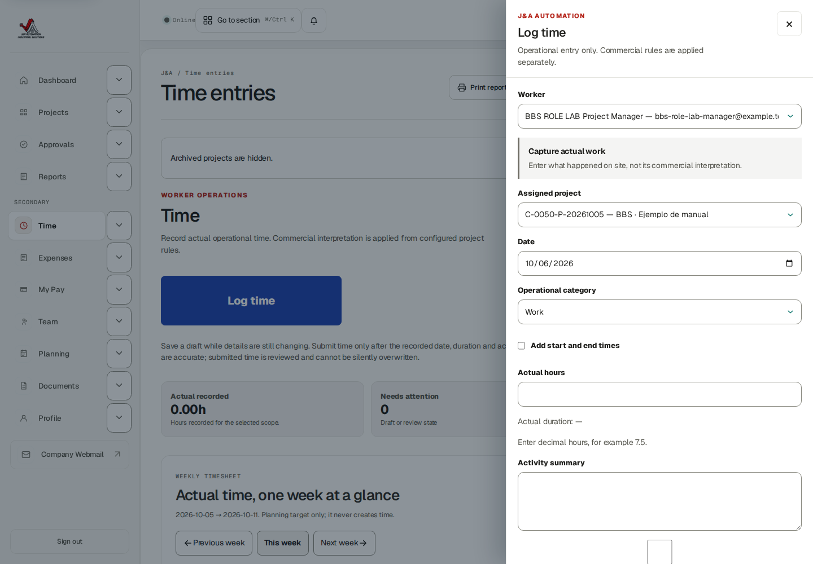

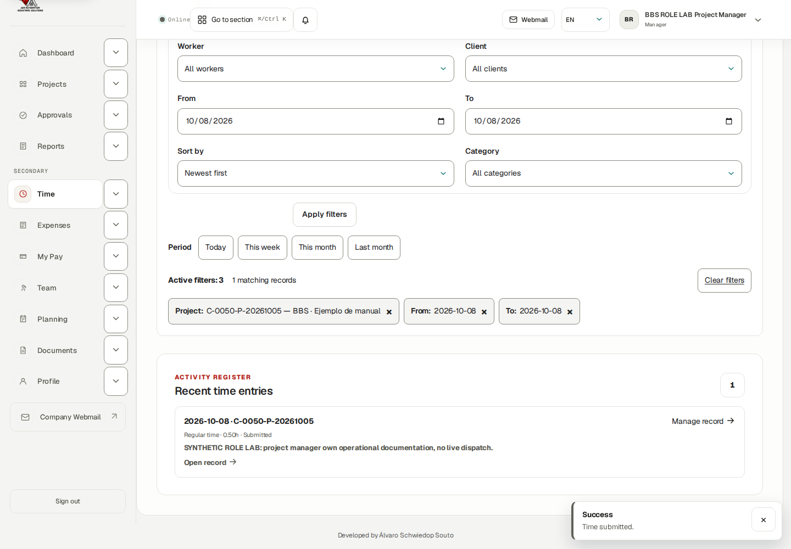

## Inspect receipts and distinguish operational review from repayment

Go here: Expenses → Record expense / Approvals Expenses

Context: Browser-verified isolated BBS project C-0050-P-20261005. All ROLE LAB records are synthetic training; they are not real dispatch, customer acceptance, purchase or payment.

Expenses records receipt evidence and operational facts: project, date, category, vendor, currency, amount and who paid. The amount spent, customer recovery and worker reimbursement are separate decisions. The PM operationally approved existing synthetic receipts; PM own expense creation was not executed here.

### Do the task

1. Open Expenses and filter BBS, date range, worker, category, currency or Receipt evidence as needed.
2. Open the receipt/source and check the event, amount, currency, payer and any linked logged hours. Required receipt missing needs supporting evidence before submission or review.
3. For your own permitted new expense choose Record expense, enter the factual fields and attach the receipt, then Save draft and inspect it before Submit. This is an inspected reference path in the PM packet.
4. For another submitted expense, go to Approvals → Expenses and Approve correct operational facts or return a specific Required change.
5. Send Finance the approved source for commercial classification and the later reimbursement/payment process.

### Verify the result

- PM operational approvals succeeded for the fictional USD 12 worker supply receipt, USD 20 allocated shared meal and USD 8 external expense.
- No reimbursement date, payee, customer markup or actual payment was recorded by the PM packet.

### If you get stuck

- Never change currency merely to make an amount resemble another view. Check receipt evidence and the actual original spending currency.
- An Approved receipt is not proof of reimbursement; the authorized Finance process and the worker’s own payment status provide that check.

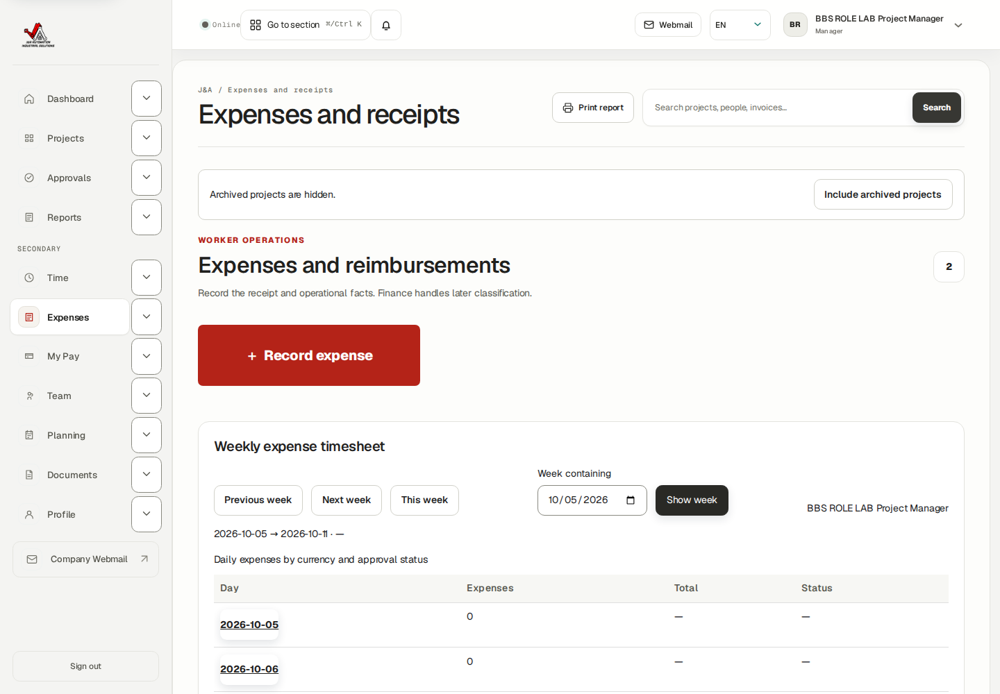

## Read only your own compensation and payment status

Go here: My Pay → From / Through → Apply period

Context: Browser-verified isolated BBS project C-0050-P-20261005. All ROLE LAB records are synthetic training; they are not real dispatch, customer acceptance, purchase or payment.

My Pay is always limited to your signed-in account’s activity, compensation and reimbursement. Reviewing another worker’s operational record does not permit seeing their compensation.

Estimated compensation, approved compensation, finalized settlement, expected payment date and recorded actual payment mean different things. A settlement is not a bank transfer.

### Do the task

1. Open My Pay and select From and Through; choose Apply period.
2. Review approved and pending estimates, Own activity detail, Settlement status and Reimbursement status for that period.
3. Compare the source state with the estimate. For the PM October 8 half-hour Submitted source, the October 1–31 view showed USD 30 pending estimate under the fictional USD 60/hour rule.
4. Use Generate report for your own worker statement if needed. Statement generation was not executed in this PM packet.
5. If an amount or expected payment is wrong, give Finance the source/project/period and the observed difference.

### Verify the result

- Native My Pay opened. Even a URL query naming Worker 2 kept the PM’s own 0.5-hour/ USD 30 pending scope; it exposed no other worker’s compensation.
- The PM packet created no settlement or actual payment.

### If you get stuck

- Check period first: the default view ended on the current day, excluding future October 8 training activity.
- Do not assume an estimate is money owed today or money received. Ask Finance about settlement and payment evidence separately.

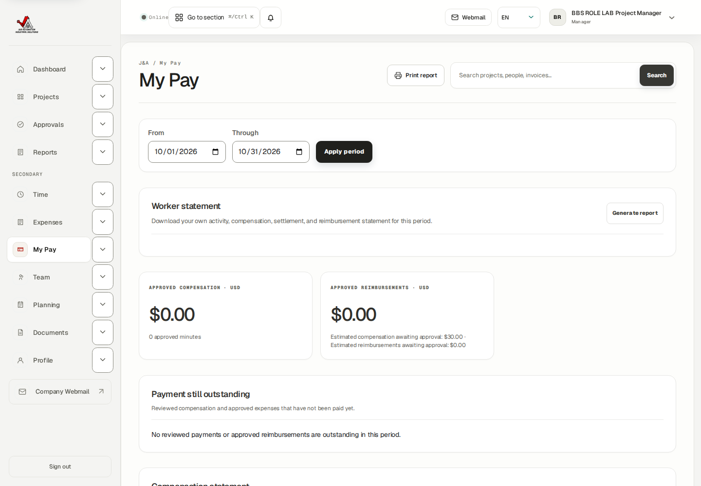

## Upload and retrieve private project evidence

Go here: Documents → Register a private artifact

Context: Browser-verified isolated BBS project C-0050-P-20261005. All ROLE LAB records are synthetic training; they are not real dispatch, customer acceptance, purchase or payment.

Private documents are authorized at access time and retained as evidence. A changed file is registered as a new document, preserving the original. Sensitivity must match the actual content; Internal is not the same as customer-ready.

The PM exercise uploaded a 187-byte UTF-8 file labelled SYNTHETIC TRAINING ONLY to BBS, then downloaded the native registered bytes.

### Do the task

1. Open Documents and select BBS. Expand Register a private artifact.
2. Confirm the project, enter Artifact type and Description, select the correct Sensitivity, and choose the intended file.
3. Choose Upload and register hash. Check the new filename, project, type, size and available View/Download controls.
4. Use Download on the exact document. Confirm the returned file is the expected content, not an error page or another project’s artifact.
5. For a correction upload a new file with a clear description. Archive only the intended document when authorized; archive mutation was not executed here.

### Verify the result

- Native upload and Download succeeded as PM. Original and downloaded SHA-256 both equal 847e4e65d78b721f04fe089beb4edfe82b7440fc7046a02ca52bcd65c0d71934.
- Only the synthetic new document was added; existing private receipts and invoice masters were preserved.

### If you get stuck

- If scanning or processing is pending, wait for the authorized artifact process and use its normal retry/status controls. Do not mark a file safe yourself or substitute a public link.
- If download is denied, check current project scope, document sensitivity/state and your account; give the Owner the document reference.

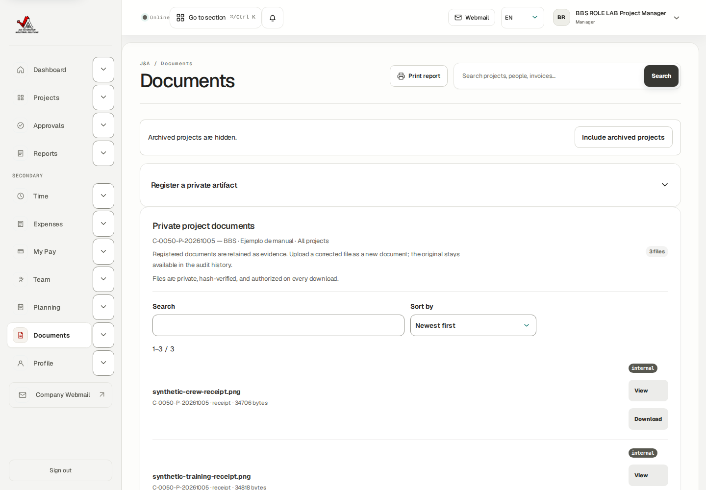

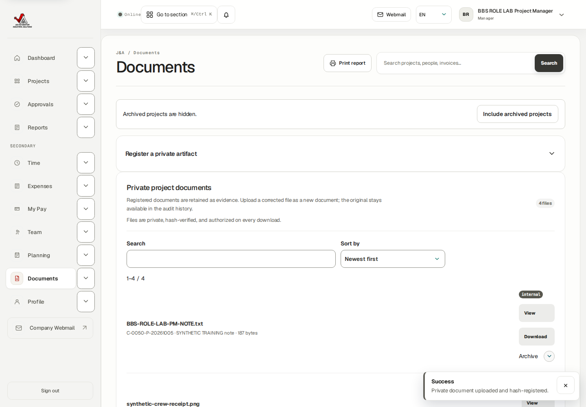

## Read notifications without confusing them with approvals

Go here: Notifications → All / Unread

Context: Browser-verified isolated BBS project C-0050-P-20261005. All ROLE LAB records are synthetic training; they are not real dispatch, customer acceptance, purchase or payment.

Notifications point to work requiring attention. Marking an item read is an inbox action; it does not approve a source, accept a customer report or pay a worker.

### Do the task

1. Open Notifications through the navigation or More menu.
2. Use All or Unread and open the referenced record to understand what changed.
3. Perform the actual business action in Approvals, Reports or the relevant source page; return to the inbox afterward.
4. If a Mark read action is offered, use it only to clear the notification after reviewing it. The training PM inbox was empty, so no Mark read transition was claimed.

### Verify the result

- Native PM Notifications loaded with zero records. This verifies the route and empty state, not delivery of every event type.

### If you get stuck

- If a notification link is no longer accessible, give the Owner the record reference and current role. Do not use another account to bypass scope.
- Check the actual source state even when an inbox count is zero.

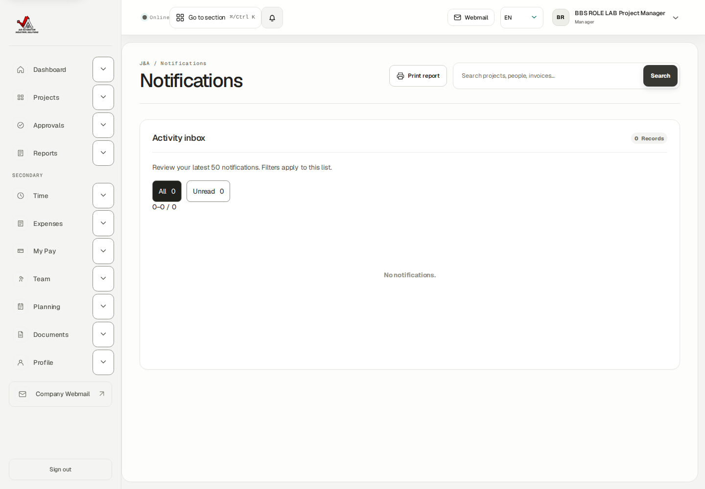

## Manage your account and find the correct guide

Go here: Profile → Account security / Help

Context: Browser-verified isolated BBS project C-0050-P-20261005. All ROLE LAB records are synthetic training; they are not real dispatch, customer acceptance, purchase or payment.

Profile security refers to your signed-in account. Passkeys and optional authenticator MFA require your own device and secure storage of recovery material. This packet inspected the controls without registering a device or exposing recovery codes.

Help identifies role-specific starting points and guide language. The screenshot reflects the catalog available during browser capture; publication of this new guide updates that reading path.

### Do the task

1. Open Profile and verify your account email and Project manager role in Account security.
2. For a passkey, enter a descriptive Device name and choose Register passkey on your own supported device. Complete its device prompt and verify registration. This is a reference procedure, not an executed credential change.
3. For MFA, choose Enable MFA only when ready to complete the authenticator setup and securely store recovery codes. Never put the setup secret in a project report.
4. Open Help, choose the guide language and the Project Manager reading path. Use the Owner guide for delegated Owner prerequisites; do not treat Owner-only instructions as your own permissions.
5. Sign out when finished, especially on shared devices.

### Verify the result

- Native PM Profile and Help loaded; workforce inspection did not switch the authenticated account.
- Finance and Audit direct routes returned 403 Access restricted; these actions remain outside the PM role.

### If you get stuck

- For lost access or an incorrect role ask the Owner through the organization’s approved contact path. There is no public sign-up.
- When reporting a UI error, include role, project reference, date range, record state, exact action and error text; exclude passwords, tokens and private customer data.

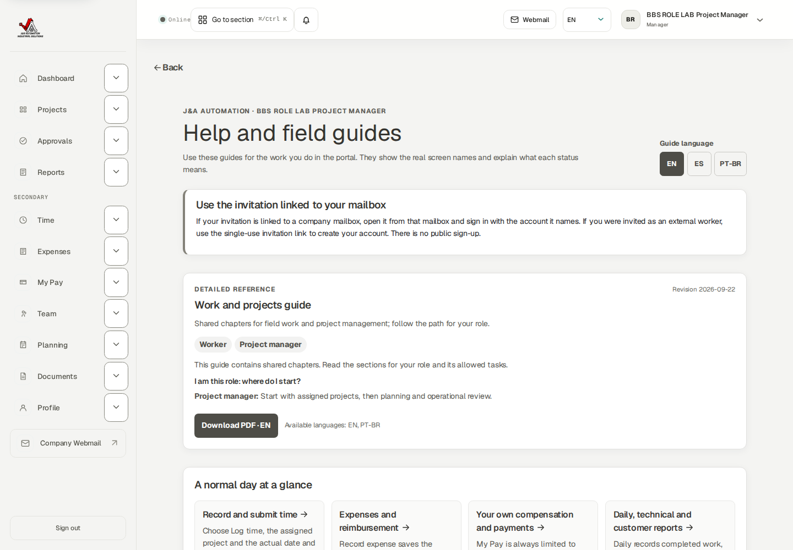

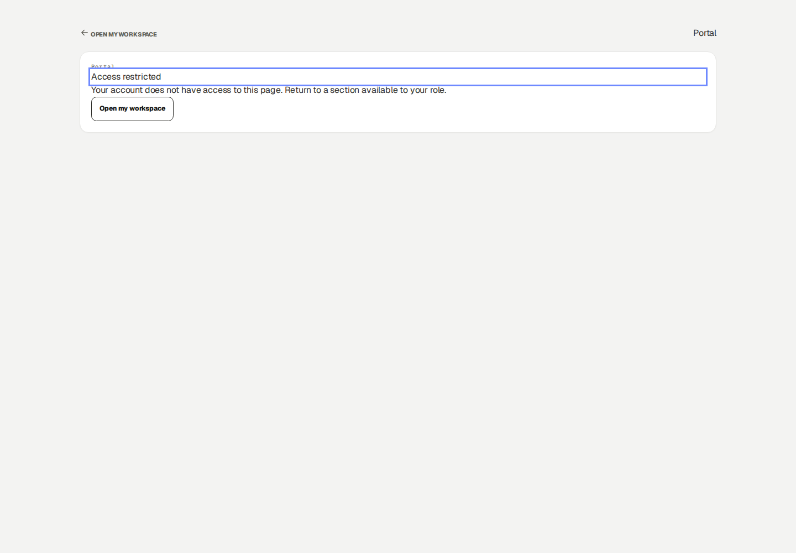

## Complete the PM operational cycle and hand off

Go here: Dashboard → Planning → Approvals → Reports

Context: Browser-verified isolated BBS project C-0050-P-20261005. All ROLE LAB records are synthetic training; they are not real dispatch, customer acceptance, purchase or payment.

A practical PM day starts with authorized scope and future plans, moves through actual-source review and correction, and ends with report and finance handoffs. Finance remains responsible for commercial treatment and payment lifecycle; Owner remains responsible for company access and policy.

Coverage is explicit: browser-executed native approvals/returns, linked correction re-review, planning publish/update, own time submission, availability save, private document upload/download, scoped My Pay and navigation. Inspected reference controls include assignment edits/removal, own expense/report creation, plan cancellation, notifications read mutation, statement generation and device security enrollment.

### Do the task

1. Confirm BBS project identity, timezone and your active membership. Check future Planning against availability.
2. Review submitted sources in the correct Approvals tab. Return incorrect facts with precise reasons and re-review submitted linked corrections.
3. Check approved Daily/Technical narratives and the exact customer period queue. Send Finance/Owner the approved source/period handoff.
4. Record personal work under your own source and send it to another reviewer. Check My Pay independently of crew economics.
5. Retain authorized project evidence, investigate processing/access errors, and report unresolved issues with exact source references.

### Verify the result

- No live email, customer signature, dispatch, purchase, bank payment or production business mutation occurred in this training packet.
- The BBS original invoice and finalized compensation history remained unchanged.

### If you get stuck

- Do not solve a locked history problem by duplicating a project, time source or invoice. Use the supported correction or audited financial adjustment.
- When a task belongs to another role, send a clear handoff: source, project, period, state, required result and reason.
