# Supplier Coordinator · BBS operational course

Authorized supplier personnel, actual team hours, corrections and operational reporting

## Before you practise · access and scope

This English guide uses BBS · Ejemplo de manual, project C-0050-P-20261005. The screenshots were taken using the stated role in an isolated database running the application. Training entries, payments, approvals and documents are fictional. They do not prove a real bank transfer, accountant approval or customer acceptance.

The company portal at https://j-aautomation.com/j-aautomation/app is LIVE. Training uses a separate URL and database. Before practising, obtain the isolated URL, your own role account and permitted exercises from the company administrator; verify the BBS project number. Without isolated access, treat these screenshots as read-only demonstrations and perform only authorized real work.

Use your own credentials. Do not borrow an Owner, Finance or colleague account. A platform role, project assignment, review permission, supplier authorization and dated crew delegation are separate requirements. Changing one does not automatically grant the others.

Select English in the workspace language control to follow the labels used here. Some saved BBS record names remain in their original language. On a phone open the navigation drawer to see full workspace names. Recheck the selected project and date range after every navigation.

The eight Worker test accounts in the private credentials document use the same Worker workflow. Crew chief is a dated delegation attached to a Worker account. Supplier Coordinator and External Technician are restricted profiles attached to Worker accounts. This guide never includes account passwords.

Each screenshot is an exercise checkpoint. Later fictional role entries and financial events are additional to the original October 1–5 workbook totals. Reopening the project or selecting the same dates does not restore that checkpoint. Read captions before comparing amounts or states.

### Verify the result

- Confirm your displayed account, role or supplier profile, the project number and the dates before saving.
- For training access, scope or reset help, contact the company administrator at admin@j-aautomation.com. Include the role, route, project number, time and visible error; omit passwords, cookies and private customer or worker documents.

### If you get stuck

- An empty project selector often means missing or expired assignment or authorization. Ask the Owner to check coverage for the date you are entering; do not create a duplicate project.
- A form shown in a screenshot can depend on role, source state or effective date. Use the documented role handoff when a control is absent.

## Start with a supplier access profile, not an Owner account

Go here: Sign in → Supplier team

Context: Browser-verified isolated BBS project C-0050-P-20261005. All ROLE LAB records are synthetic training; they are not real dispatch, customer acceptance, purchase or payment.

The Supplier Coordinator is an operational supplier profile linked to a supplier company and dated project authorization. Its underlying account can display Worker in Profile; the supplier access profile determines the restricted supplier workspace. It does not grant Finance, invoices, employee pay or J&A approval rights.

This exercise uses fictional BBS ROLE LAB Training Supplier on the SAME BBS project C-0050-P-20261005. The Owner created the supplier and accounts, authorized this coordinator for BBS October 5–31, and assigned the external technician. All work narratives and receipts are synthetic training.

### Do the task

1. Use your own single-use invitation or assigned sign-in credentials. Enter email and password and choose Continue to workspace.
2. Open Supplier team. Confirm BBS in Installation / project and verify the project/date scope before recording technicians or hours.
3. Open Profile and confirm your own account. A Worker base-role label does not mean you have internal employee finance privileges.
4. Ask the Owner to verify supplier linkage, active account status, authorization dates and the correct coordinator when a project is absent.

### Verify the result

- Native Owner onboarding and actual coordinator login succeeded; no role or session was fabricated.
- The coordinator project selector contained only the authorized BBS installation.

### If you get stuck

- If no installation is offered, stop and request dated authorization from the Owner. Do not create an unrelated supplier or project.
- Never share the Owner’s login with the supplier team. An operational directory record is not a login account.

## Use the coordinator’s restricted navigation

Go here: Supplier team → Time / Expenses / Reports / Operational report

Context: Browser-verified isolated BBS project C-0050-P-20261005. All ROLE LAB records are synthetic training; they are not real dispatch, customer acceptance, purchase or payment.

Supplier team handles authorized personnel and team-hour drafts. Time, Expenses and Reports handle your own operational sources. Operational report shows permitted supplier work and approval state. Profile and Help support your own account and role guidance.

Finance, Billing and Approvals are restricted to other authorized roles. The coordinator can submit work to J&A; it cannot approve those sources or certify client acceptance.

### Do the task

1. Use Personnel, Record team hours and Operational report tabs in Supplier team.
2. Select BBS, From, To and Language in Project and reporting period; choose Apply filters before interpreting a list or total.
3. On a phone use the visible primary navigation and More where offered. Scroll within long tables rather than assuming hidden columns are absent.
4. Use Profile for your own expertise, availability and security; use Help for the Supplier Coordinator path.

### Verify the result

- Coordinator desktop, 390-phone and 768-tablet views were captured.
- Direct Finance and Billing requests returned 403 Access restricted; Approvals also returned 403.

### If you get stuck

- Contact an owner is the handoff from a restricted screen. Returning to Supplier team does not grant the denied action.
- Recheck filters after a successful save: the resulting route may retain project/dates but change the active workspace tab.

## Inspect supplier technicians and assignment dates

Go here: Supplier team → Personnel

Context: Browser-verified isolated BBS project C-0050-P-20261005. All ROLE LAB records are synthetic training; they are not real dispatch, customer acceptance, purchase or payment.

Personnel lists technicians in the authorized supplier installation. An external technician with an Owner-created login and a coordinator-created directory-only technician are different. Adding a person here does not issue credentials or grant platform roles.

Eligibility for team entry depends on dated assignment covering the work date. Set the intended date before selecting the roster; a technician starting October 6 must not be recorded for October 5.

### Do the task

1. Select BBS and the relevant reporting period, choose Apply filters, then open Personnel.
2. Inspect the technician name, supplier/company, contact and assignment start/end. Confirm the existing person before adding another.
3. For a technician who needs login access, ask the Owner to create/link the proper external technician profile; do not send them the coordinator’s password.
4. For a date or supplier mismatch, ask the Owner to correct the authorization/linkage before entering work.

### Verify the result

- BBS showed the Owner-linked external technician October 5–31 and the later coordinator-added directory technician October 6–31.
- The native add-person screen explicitly distinguishes directory creation from Owner-managed login access.

### If you get stuck

- If a person is missing from Record team hours, compare their dated assignment with Work date and current project.
- If you see a similarly named existing person, reuse it through the authorized linkage rather than creating a duplicate directory entry.

## Add a directory technician to the authorized installation

Go here: Personnel → Add technician

Context: Browser-verified isolated BBS project C-0050-P-20261005. All ROLE LAB records are synthetic training; they are not real dispatch, customer acceptance, purchase or payment.

The coordinator can add a technician directory record to an installation they are authorized to coordinate. The saved record supports operational hours; it does not create a password, invitation or J&A Finance account.

The exercise added BBS ROLE LAB Coordinator-recorded Technician with a reserved example.test contact, explicit synthetic notes and assignment October 6–31.

### Do the task

1. Open Add technician in Personnel after selecting BBS.
2. Enter the person’s Name, Email, Company and Notes. Use the actual supplier relationship and make the intended directory-only nature clear.
3. Enter Starts on and Ends on covering the permitted work dates. Check these against installation authorization.
4. Choose Save. Reopen Personnel and verify the name and date range persisted.
5. If this person needs their own portal, hand the existing person/supplier/project reference to the Owner for access provisioning.

### Verify the result

- Native coordinator Save succeeded and Changes saved appeared. Personnel showed the new fictional technician October 6–31.
- No credentials were created or emailed by this directory action.

### If you get stuck

- If authorization dates do not cover the proposed assignment, resolve authorization with Owner first.
- Do not repeatedly press Save after a timeout without checking Personnel for the existing record.

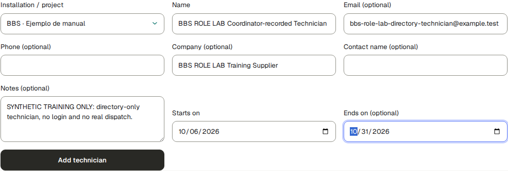

## Record shared actual hours for selected technicians

Go here: Supplier team → Record team hours

Context: Browser-verified isolated BBS project C-0050-P-20261005. All ROLE LAB records are synthetic training; they are not real dispatch, customer acceptance, purchase or payment.

Team entry creates separate traceable draft sources per selected technician. The same-hours mode is appropriate only when everyone actually worked that duration; different-hours mode is available for different actual durations. Planning is not evidence of actual work.

The positive exercise selected two eligible technicians on October 6, saved 2 actual hours each and produced 4 team hours in two drafts. No live field activity is asserted.

### Do the task

1. Open Record team hours. Select BBS and set Work date October 6 before selecting the eligible roster.
2. Use Find technician or Add visible to selection. Check each selected person and assignment dates; Clear selection resets the roster.
3. Choose Same hours for everyone when accurate, or Different hours for each person when needed. Select Work or Travel as appropriate.
4. Enter Actual hours and Work performed. Add start/end times only when known and check that they agree with the duration.
5. Choose Save selected drafts. Read the saved batch summary and review each person/date/duration in the resulting Operational report list.

### Verify the result

- Native coordinator batch save reported 2 drafts, BBS, October 6 and 4 team hours. Each source identified Recorded by the coordinator.
- Different-hours mode and clock-time entry were inspected but not executed in this packet.

### If you get stuck

- If eligibility changes after selecting a different date, recheck the selected roster. Do not record a technician outside assignment coverage.
- If a save fails, inspect the visible error and the current drafts before retrying; do not create a second batch for the same actual event.

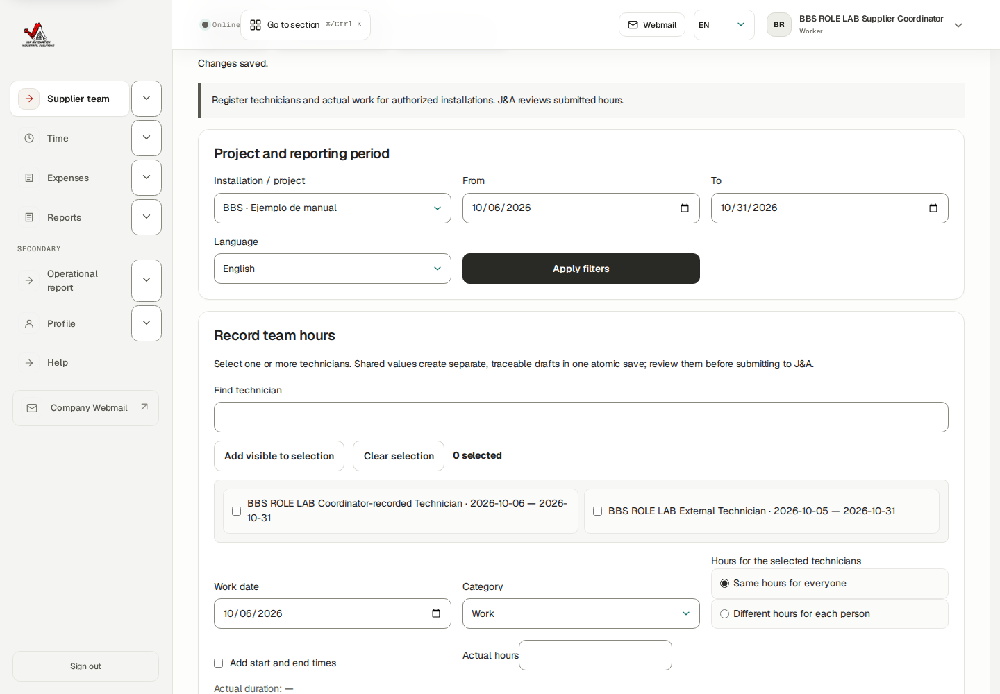

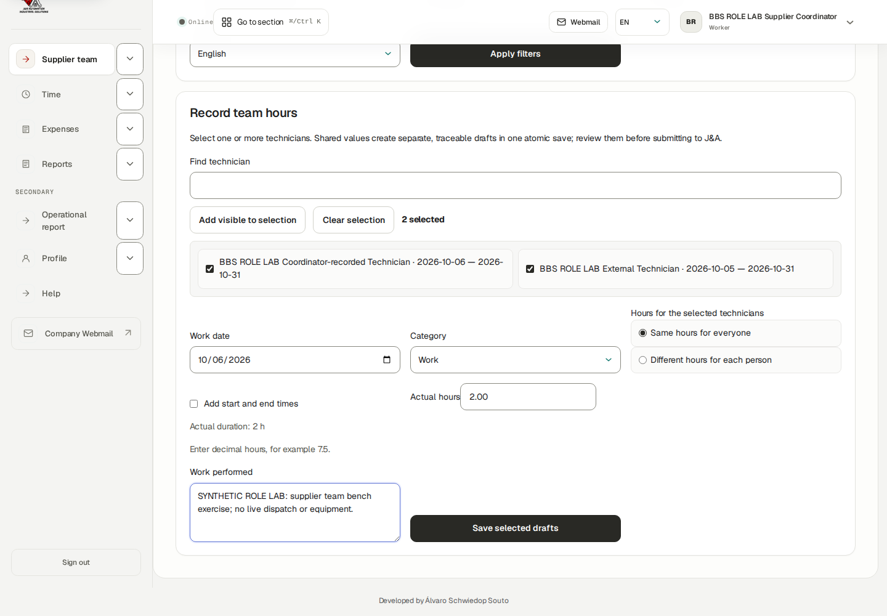

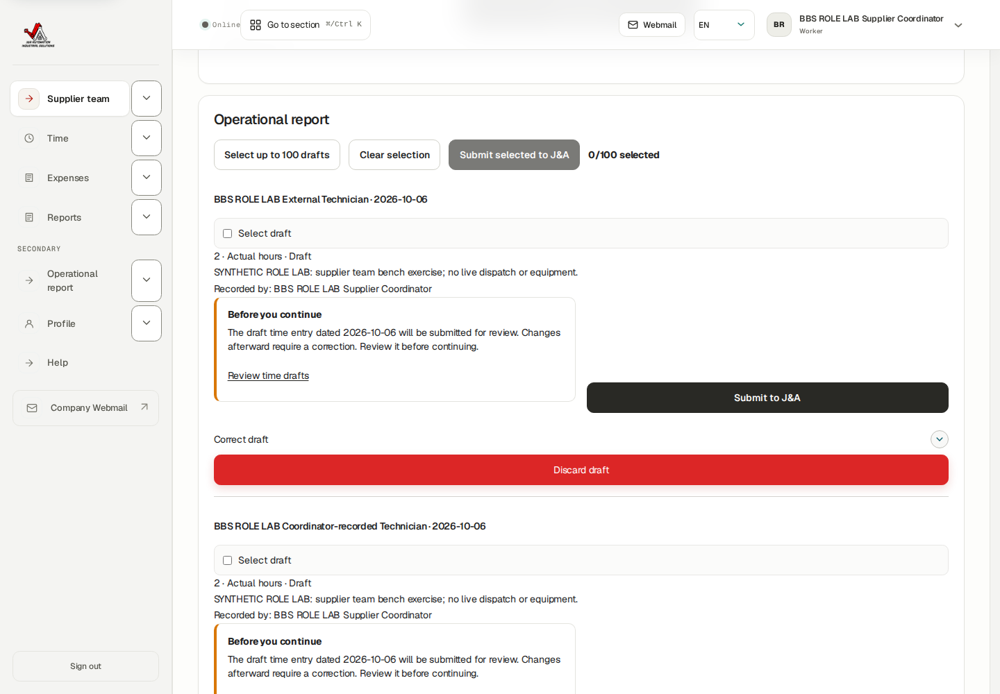

## Review and submit drafts to J&A

Go here: Supplier team → Operational report → Submit selected to J&A

Context: Browser-verified isolated BBS project C-0050-P-20261005. All ROLE LAB records are synthetic training; they are not real dispatch, customer acceptance, purchase or payment.

A saved draft has not entered J&A review. Correct draft or Discard draft is offered only in the supported ordinary draft state. Submitting ends silent direct editing; later changes use the correction workflow.

The selection action selects up to 100 drafts. Its exact scope depends on the current installation/date filter; read the person/date of every selected draft.

### Do the task

1. Open Operational report within Supplier team and inspect each Draft row, duration, summary and Recorded by attribution.
2. For one source choose Submit to J&A after review. For the intended filtered batch use Select up to 100 drafts, check the selected count, then Submit selected to J&A.
3. Confirm the resulting message says the intended drafts were submitted and each row shows Submitted.
4. Send the project/date/source handoff to the J&A reviewer. Wait for Approved or Needs changes; do not enter the same work again while waiting.
5. If an ordinary draft is wrong, use Correct draft or Discard draft with the offered controls before submission. Those draft-edit/discard transitions were inspected, not executed here.

### Verify the result

- Native coordinator submission reported 2 drafts submitted to J&A, and both original 2-hour rows became Submitted.
- The coordinator had no J&A Approvals action; actual review was performed through Owner/PM role sessions.

### If you get stuck

- If one record blocks batch submission, fix the required draft facts/evidence and retry the supported batch after rechecking state.
- If submitted work is wrong, ask the reviewer to return it and follow the linked correction procedure instead of overwriting it.

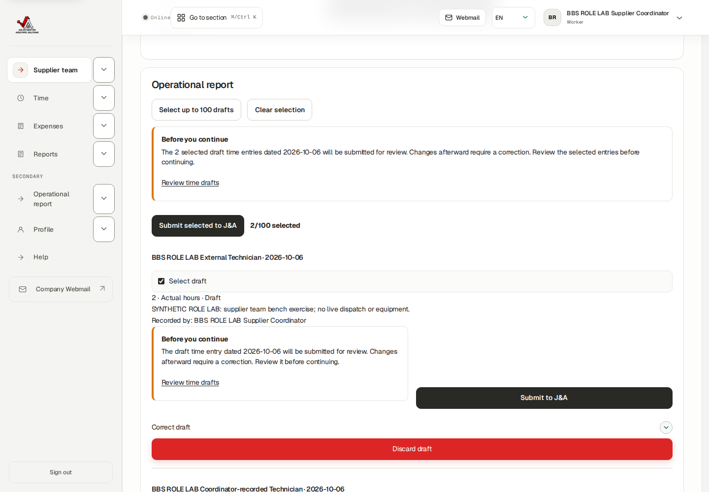

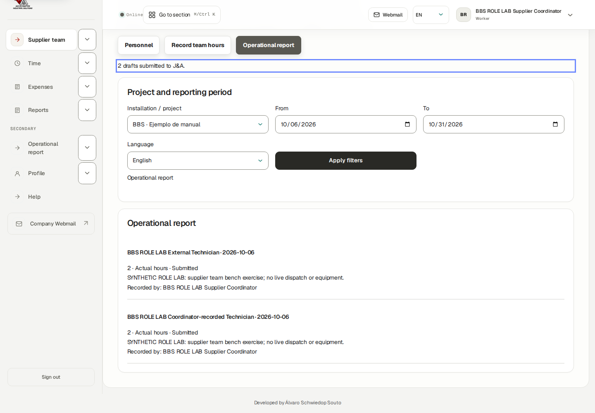

## Correct returned team work and preserve the original

Go here: Supplier team → Operational report → Create correction draft

Context: Browser-verified isolated BBS project C-0050-P-20261005. All ROLE LAB records are synthetic training; they are not real dispatch, customer acceptance, purchase or payment.

The supported correction creates a linked new source and preserves the returned original. A reason and at least one changed operational fact are required. The replacement must be submitted and reviewed again.

The exercise corrected the directory technician from 2 to 1.5 actual hours. The external technician’s separate 2-hour source remained intact.

### Do the task

1. Ask the J&A reviewer to return the incorrect source with a specific reason. Refresh the filtered Supplier team report and verify Needs changes.
2. In that source’s Create correction draft form check Work date and Category; change Duration in hours to the confirmed actual value, update Work performed and enter Reason for correction.
3. Choose Create correction draft. Verify the new 1.5-hour Draft, its recorded-by attribution and the preserved 2-hour original.
4. Choose Submit to J&A on the linked draft. Confirm Submitted and hand the replacement reference to the reviewer.
5. After J&A approval, open the native Operational report and verify 3.5 total actual hours: 2 external +1.5 directory technician. The original 2-hour directory source must be excluded.

### Verify the result

- Native correction, direct resubmission and Owner operational approval succeeded. The Supplier team source history explicitly showed Superseded — excluded from total.
- Native Operational report showed only the active 2 h and 1.5 h Approved sources with 3.5 h total.

### If you get stuck

- If the source is locked by billing or finalized settlement, preserve it and contact Owner/Finance for the supported adjustment. Do not create an unrelated replacement source.
- A linked correction draft is not an ordinary editable draft. Review all facts before creation; use permitted withdrawal/recreation if offered for an unsubmitted error.

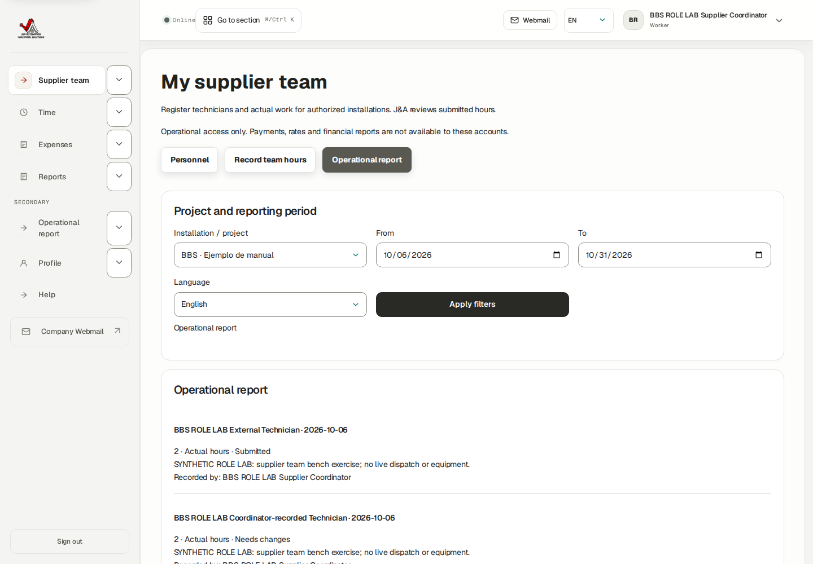

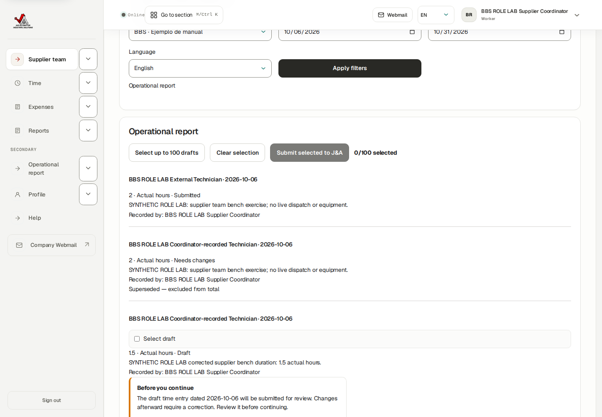

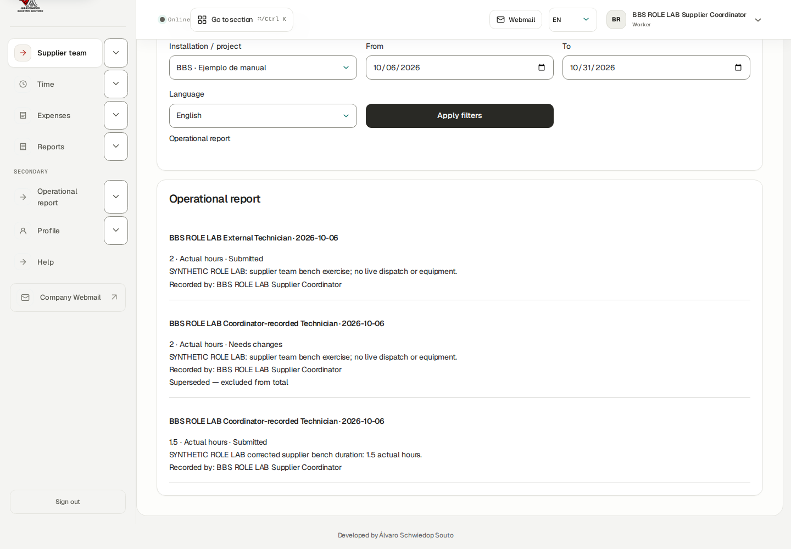

## Export an operational report with the right meaning

Go here: Operational report → Apply filters → Download CSV

Context: Browser-verified isolated BBS project C-0050-P-20261005. All ROLE LAB records are synthetic training; they are not real dispatch, customer acceptance, purchase or payment.

The supplier Operational report contains work and approval status. It does not certify payment, customer acceptance, client rates, internal cost or compensation. The coordinator sees permitted team activity; the external technician’s own report sees only that technician’s activity.

CSV is a native data download. Print / save PDF invokes the browser print flow; it is distinct from an issued invoice or generated customer-acceptance report.

### Do the task

1. Open Operational report. Select BBS, From, To and Language; choose Apply filters.
2. Compare Total actual hours with the listed active sources and their states. After correction use the 3.5-hour active total, not the earlier 4-hour original batch.
3. Choose Download CSV and open the returned file in a spreadsheet. Check project, period, people, durations, states and recorded-by attribution.
4. For a printable copy choose Print / save PDF and review the browser preview before saving. This print action was visible but not executed in the packet.
5. Retain the filtered export with its period and purpose; do not send it as proof that a customer accepted work or a worker was paid.

### Verify the result

- Actual coordinator Download CSV succeeded with native filename operational-report-2026-10-06-2026-10-31.csv.
- The export captured at submission stage contains the original 4-hour submitted batch; later approved report screenshots demonstrate the corrected 3.5-hour state. The old export was not rewritten as if generated later.

### If you get stuck

- If an export differs from the screen, check when it was downloaded and whether the report was refreshed after correction/approval.
- If a download fails, preserve the error and give Owner the role/project/filter details; do not export another person’s unrelated records.

## Record your own work separately from technician team hours

Go here: Time → Log time

Context: Browser-verified isolated BBS project C-0050-P-20261005. All ROLE LAB records are synthetic training; they are not real dispatch, customer acceptance, purchase or payment.

Time concerns your own operational source. Supplier team batch hours concern the selected technicians. Do not log the same actual event in both places for the same person.

The coordinator exercise saved and submitted a separate 0.25-hour October 8 documentation activity under the coordinator account. It remains Submitted; this packet did not approve or financially classify it.

### Do the task

1. Open Time and filter BBS and the intended dates. Choose Log time.
2. Confirm Assigned project, Date, Operational category, Actual hours and Activity summary name your own actual activity.
3. Choose Save draft, inspect the saved source, then Submit after checking its facts.
4. For a weekly submission inspect every included draft before Submit all week drafts. Linked corrections need their supported individual Submit path.
5. Wait for J&A review. If returned, use Create corrected draft with a reason and explicitly submit the linked replacement.

### Verify the result

- Native own-source save and submission succeeded with 15 minutes, distinct from the technician batch.
- The PM Time queue did not display this coordinator source in the final check; it remains submitted for an authorized Owner review handoff.

### If you get stuck

- If a reviewer cannot find the source, send its exact ID, project, date and Submitted state; do not enter another quarter-hour to force attention.
- If a date/form change is unsaved, Cancel or leaving may request confirmation. Discard only when you intend to abandon those unsaved values.

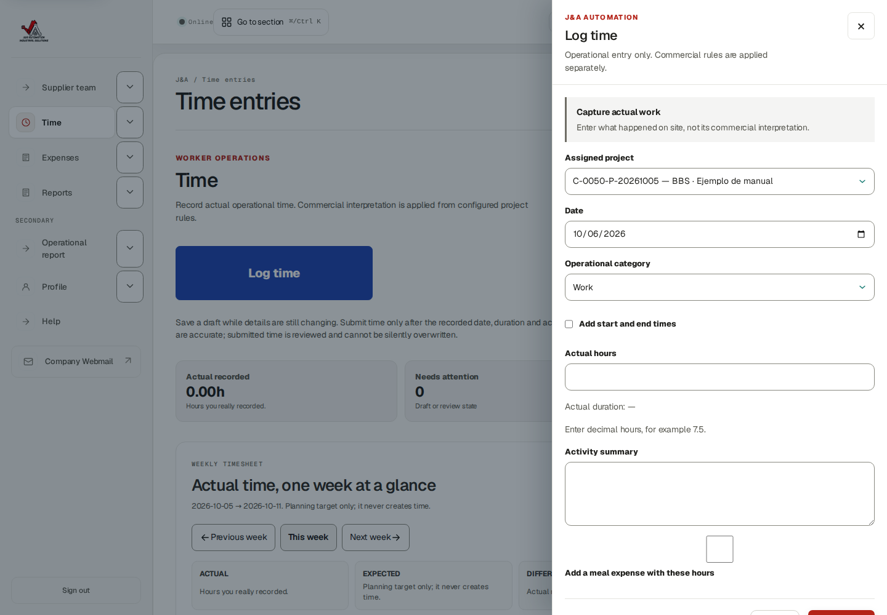

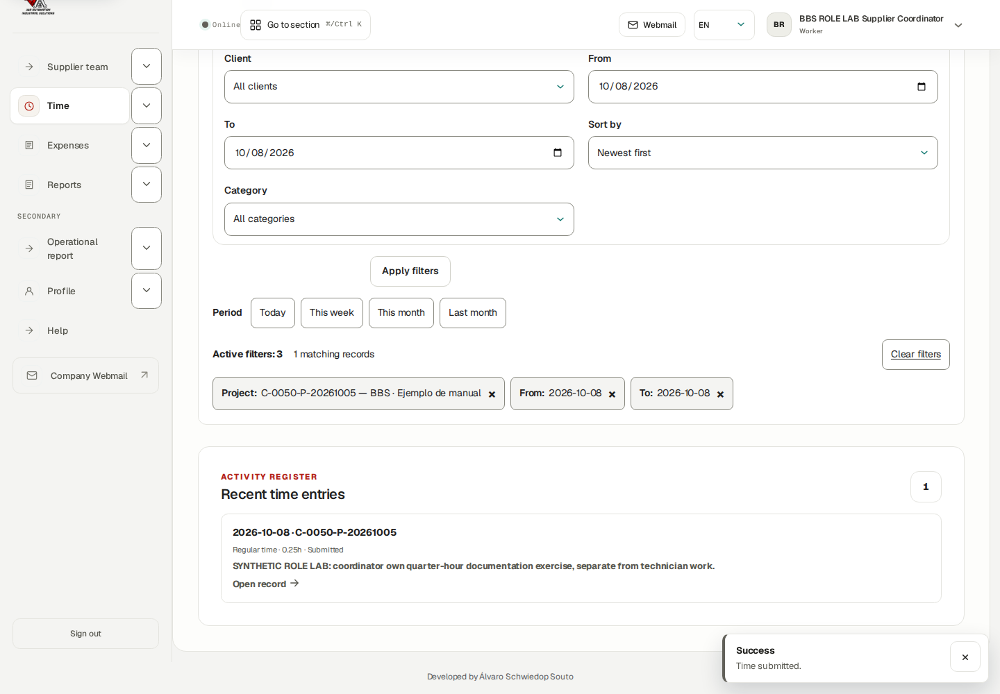

## Record your own receipt facts without financial classification

Go here: Expenses → Record expense

Context: Browser-verified isolated BBS project C-0050-P-20261005. All ROLE LAB records are synthetic training; they are not real dispatch, customer acceptance, purchase or payment.

The coordinator Expenses screen is limited to their own expense sources. Supplier team coordination does not grant access to J&A commercial classification or other workers’ reimbursement amounts.

The native own expense form was opened and inspected, then its unsaved values were deliberately abandoned. No coordinator purchase, expense submission or repayment was recorded by this packet.

### Do the task

1. Open Expenses and choose Record expense. Confirm BBS and the actual Date.
2. Choose Category and optionally Time expense occurred in the project site’s local time. Link Related logged hours only when the expense belongs to that source.
3. Enter Vendor, Amount, Currency, Who paid, Description and Payment method; attach the receipt image or PDF.
4. Choose Save draft, open and inspect the saved source and receipt, then Submit through the supported source/weekly flow. These save/submission steps are reference here, not executed coordinator evidence.
5. J&A reviews the facts; Finance determines customer recovery, reimbursement and actual payment afterward.

### Verify the result

- Actual coordinator form fields and own-register scope were inspected. No rates or Finance treatment controls were present.
- The native receipt hint accepted JPG, PNG, HEIC or PDF up to 10 MB. Required evidence must exist before the supported submission succeeds.

### If you get stuck

- If required receipt evidence is missing, attach the correct receipt to the draft; do not classify it yourself to bypass the requirement.
- If Who paid or Currency is wrong after submission, request the supported correction rather than changing the amount to compensate.

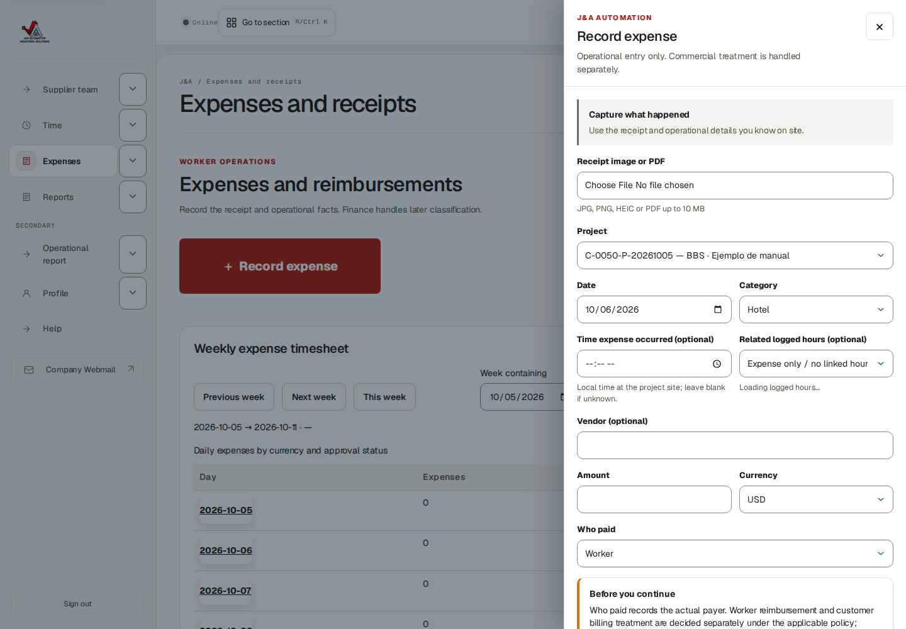

## Create and submit your own Daily report

Go here: Reports → New daily report

Context: Browser-verified isolated BBS project C-0050-P-20261005. All ROLE LAB records are synthetic training; they are not real dispatch, customer acceptance, purchase or payment.

A Daily report records narrative context, not actual time or client acceptance. The coordinator’s own report does not impersonate the technician who performed another source’s work.

The exercise saved an October 8 fictional coordinator documentation handover, submitted it and obtained genuine PM operational approval.

### Do the task

1. Open Reports, filter BBS and October 8, and choose New daily report.
2. Enter Work date, optional Site / shift, Shift summary and Tasks completed. Add Problems found, Corrective actions, downtime/standby/open items and Next-day plan as applicable.
3. Choose Save daily report. Open the new source, confirm Work performed by and Report created by are correct, and inspect the saved narrative.
4. Choose Submit for review. Verify Submitted and send the source to J&A.
5. After operational review, verify Approved and the reviewer attribution. Do not equate that state with customer signature or payment.

### Verify the result

- Native coordinator draft save and Submit for review succeeded. Genuine PM Approve report succeeded afterward.
- Own report source text and native embedded preview are accessible after the scoped authorization fix. Authenticated own preview returned 200; an exact known other-worker preview returned 404. No broader report scope was granted.

### If you get stuck

- If the preview says it could not load, retain the source, give Owner the exact report and error, and avoid uploading an invented replacement PDF.
- If returned, change the permitted draft/correction facts and explicitly resubmit; mere saving is not a review handoff.

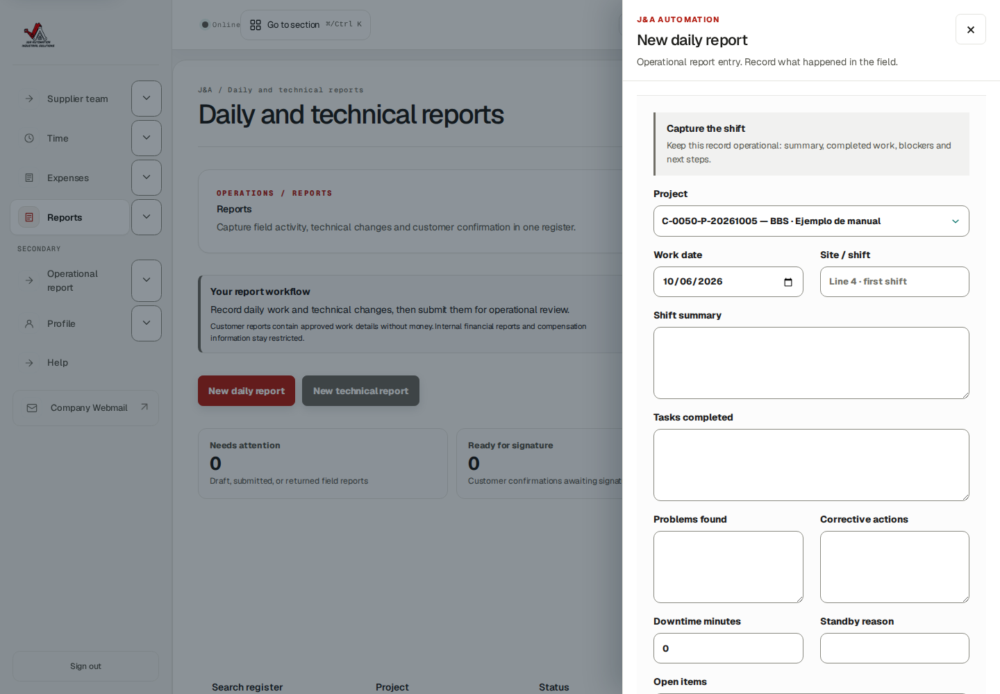

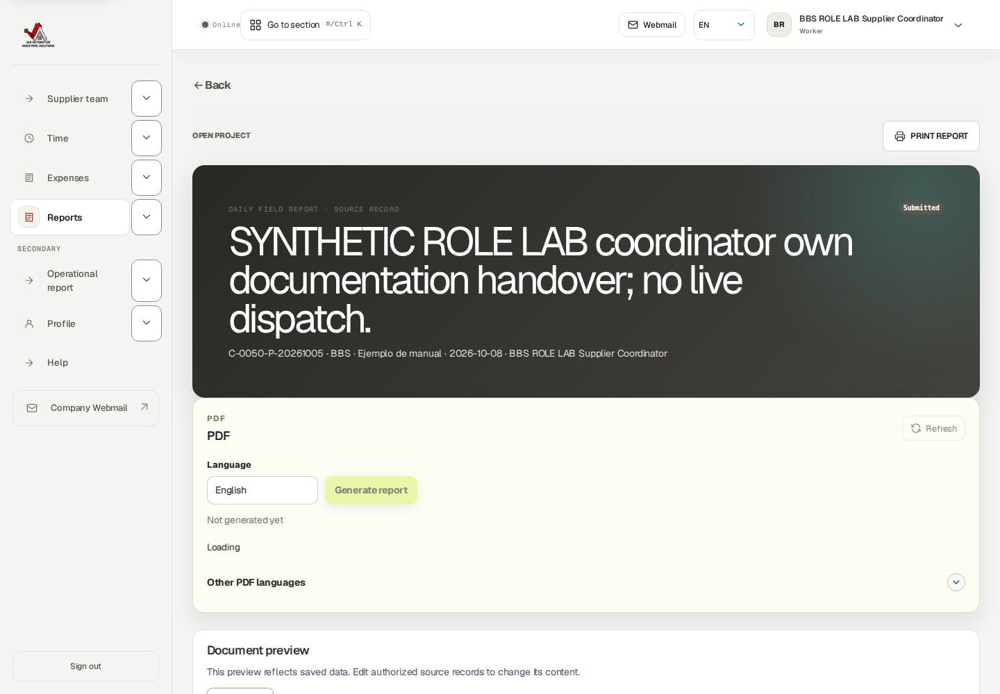

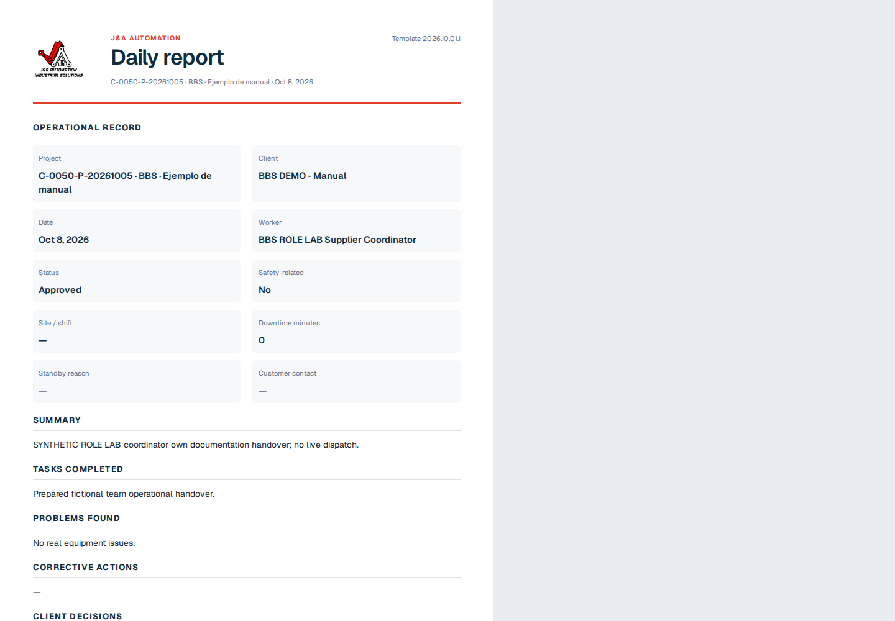

## Use Technical / PLC reports for traceable change narratives

Go here: Reports → New technical report / Technical / PLC

Context: Browser-verified isolated BBS project C-0050-P-20261005. All ROLE LAB records are synthetic training; they are not real dispatch, customer acceptance, purchase or payment.

Technical reports explain before/after behavior, reason and change context. They do not prove a production machine was changed or authorize unsafe work. Use actual evidence and the technician/author relationship permitted by the app.

This coordinator packet did not create a Technical source; its exact native report workflow is shared with the separately verified External Technician and Worker guides. Follow that role’s real creation lesson for your own permitted source and state.

### Do the task

1. Open Reports and choose Technical / PLC to inspect your permitted technical register.
2. For a genuine new source choose New technical report, identify BBS and the correct work date, title and equipment/change context.
3. Complete the visible technical fields and narratives before saving: describe behavior before, behavior after and why the change was made.
4. Save the draft, reopen to inspect the structured human-readable content and source attribution, then Submit for review.
5. J&A reviews the technical facts; Finance/Owner generates the customer-safe period output and records the exact signed copy when required.

### Verify the result

- Coordinator Reports provides the own operational reporting navigation. Coordinator Technical creation/review/generation is explicitly NOT RUN in this packet.
- External Technician guide provides a positive synthetic Technical save→submit→PM review example on the same BBS project.

### If you get stuck

- Preserve technical snapshots and evidence when corrected. Do not overwrite a previously accepted native PDF.
- If a required change field or evidence is unknown, leave the source as draft and ask the responsible person; do not invent an equipment result.

## Maintain your own availability and secure access

Go here: Profile → Expertise and availability / Account security → Help

Context: Browser-verified isolated BBS project C-0050-P-20261005. All ROLE LAB records are synthetic training; they are not real dispatch, customer acceptance, purchase or payment.

Coordinator Profile holds own expertise and availability without exposing compensation or client rates. Availability uses UTC. Security settings concern your own signed-in account, not an inspected supplier technician.

The Help screenshot includes the new English Supplier Coordinator BBS course and the broader supplier operations reference. Choose the role-specific course first, then consult the reference for shared tasks.

### Do the task

1. Open Profile and verify your own name/email. Inspect expertise and availability before recording or arranging work.
2. For an actual availability change choose Add availability, enter UTC Starts/Ends, select the status and Note, save and reopen. This mutation was not executed for the coordinator packet.
3. Use Register passkey or Enable MFA only on your own device with secure recovery storage. These controls were inspected; no credential/device mutation was performed.
4. Open Help, choose the desired language and Supplier Coordinator starting path. English role guides may be linked as a language fallback.
5. Sign out after use. Use the organization’s approved contact path for an access problem rather than sharing another role’s credentials.

### Verify the result

- Actual coordinator Profile and Help loaded, including own workforce scope and role-specific starting guidance.
- No passwords, cookies, tokens or MFA recovery material were included in screenshots or manuals.

### If you get stuck

- An account labelled Worker in Profile may still carry a supplier restriction; request the correct profile/linkage from Owner rather than trying Finance routes.
- Report UI problems with role, BBS reference, date, source state and exact action/error; omit private credentials.

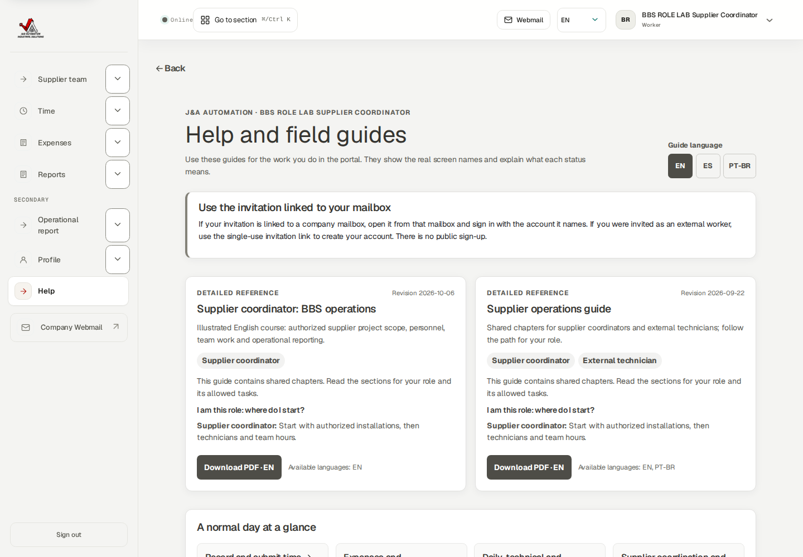

## Finish the supplier operational cycle

Go here: Personnel → Drafts → J&A review → Operational report

Context: Browser-verified isolated BBS project C-0050-P-20261005. All ROLE LAB records are synthetic training; they are not real dispatch, customer acceptance, purchase or payment.

The coordinator’s cycle is authorized personnel, accurate actual team drafts, explicit submission, returned correction when needed and an operational status export. J&A operational approval, Finance payment and customer acceptance are separate handoffs.

Browser-executed coverage: native login and dated supplier scope, directory technician Save, same-hour batch Save/Submit, 2→1.5 h linked correction/Submit→Owner approval, active 3.5 h report, native CSV, own 0.25 h Time submission, own Daily save/submit→PM approval, own-report preview 200 with other-worker 404, navigation/responsive views and Finance/Billing/Approvals 403. Own expense save/submit, Technical mutation, print-to-PDF, security enrollment and ordinary draft discard/edit remain inspected/reference or NOT RUN as stated.

### Do the task

1. Confirm BBS authorization and each technician’s work-date coverage before entering actual hours.
2. Review saved sources and submit the intended batch only once. Send the reviewer a clear project/date/source handoff.
3. Follow Needs changes through a linked correction and re-review; compare active totals with the retained original history.
4. Export the operational report with the correct period/state and describe its meaning. Hand financial and customer-acceptance questions to authorized J&A users.
5. Keep your own Time, Expenses and Reports distinct from technician team sources and report unresolved access/preview problems.

### Verify the result

- No production data, real equipment, live dispatch, customer consent, outward mail or bank payment was changed or asserted by this training packet.
- Original BBS invoices and finalized financial history were preserved.

### If you get stuck

- Do not duplicate work to fix a locked source or substitute an operational CSV for an issued invoice.
- If access ends or assignment dates expire, ask Owner to review the genuine authorization. A directory record alone cannot restore login.
