# Supplier Coordinator · BBS operational course

Authorized supplier personnel, actual team hours, corrections and operational reporting

## Before practising · live and training access

The company portal https://j-aautomation.com/j-aautomation/app is LIVE. A link to it never enters a simulation. For practice obtain a separately provisioned training URL, your own account, the permitted fictional project and dates, a visible environment identifier and the trainer’s reset procedure. Without those, use this guide as a read-only demonstration and enter only authorized genuine work.

Original BBS examples include historical live-deployment records. Later training exercises used isolated copies. Each chapter identifies its dataset and checkpoint. Follow the dates and saved states shown for that exercise.

A role, project membership, review permission, supplier authorization and dated crew delegation are separate. Use your own credentials and follow the tasks assigned to your role. Check the selected project and person before recording work.

### Verify the result

- Confirm your displayed identity, the environment, project number and work dates before saving. For training/reset or lost access contact admin@j-aautomation.com; send the route, role, project/record reference, time and visible error. Keep passwords, activation links, recovery codes and cookies private.

### If you get stuck

- For an empty project selector, ask the Owner to check account status and assignment/authorization coverage. Do not create a duplicate project or borrow another account.

## Access · activate the invitation and sign in

Go here: Your trusted invitation → Activate your account → Return to sign in → Profile

### Do the task

1. Check the portal address and named account against the invitation provided by the Owner. There is no public sign-up. For an already provisioned account, use the sign-in method supplied to you; do not attempt to activate someone else’s invitation.
2. For a single-use activation link, open Activate your account. Enter Full name and choose a Password of at least 12 characters, then Activate account. Wait for Account activated. You can sign in now. Do not repeatedly submit while Activating… is displayed.
3. Choose Return to sign in. Enter your account Email and Password and select Continue to workspace. If you previously enabled MFA, complete Verify your identity with the current Six-digit code and Verify and continue. Use a recovery code only through the offered Use a recovery code control.
4. Open Profile and verify the own-account name/email/role in Account security. Check the navigation and assigned project. A newly activated account can have zero assignments; activation alone does not grant project access or supplier/chief authority.

### Verify the result

- The activation success message precedes the separate sign-in. Verify your own Profile and assigned projects after signing in.

### If you get stuck

- An expired or already used link displays This invitation could not be activated. It may have expired or already been used. If activation already succeeded, return to sign in. Otherwise request a new invitation from the Owner; reloading does not renew the old link.
- For offline, temporarily unavailable or rate-limited activation, retain the entered name/password privately, restore connectivity or wait for the displayed retry interval, then retry. An unconfirmed response is not proof of an active account.
- For an incorrect password, inactive account or lost access, contact admin@j-aautomation.com from your verified account/contact channel. Supply identity and the visible error; never send the password. This guide does not promise a public password-reset form. The initial Owner is provisioned by the platform operator; an existing Owner provisions the remaining team.

## Practice setup · your account and starting records

Obtain your own training account, isolated environment, authorized project and lesson dates from the trainer. Confirm the named starting records and expected result before saving. Ask the trainer to restore the checkpoint when needed.

| Checkpoint | Required starting condition |
| --- | --- |
| Identity and environment | Own correctly provisioned role/profile; isolated URL and visible environment identity. |
| Project and dates | Exact project number, timezone and unused eligible lesson dates; membership and relevant grants cover both current access and the work date. |
| Source state | Named source IDs and durations/amounts; ordinary starting drafts/submissions; no unrelated correction already open. |
| Expected outcome | Expected saved state, source count, actual total and permitted output; named receiving reviewer where needed. |

### Verify the result

- Confirm that the visible starting records match this lesson. If they differ or an action is unavailable, stop and ask the trainer for the correct checkpoint.

## Review authority · who receives each source

Review is determined by the source, base role and current dated grants. Chief delegation grants recording, not approval. A Worker with Can review checked does not become a Project Manager. Send a factual reason with every requested correction.

| Source / recorder | Operational reviewer and prerequisite | Next handoff |
| --- | --- | --- |
| Internal own or chief-delegated time | Owner or Finance; assigned PM with current active Can review membership for this project. | Submit the checked work to the authorized reviewer and verify the resulting state. |
| External/supplier time, including coordinator own time | Authorized Owner. Supplier authorization/recorder provenance keeps these sources outside the ordinary PM time queue. | Verify the resulting review state. |
| Own/delegated expenses | Owner or Finance; assigned PM with current project review grant. Check factual purchase, payer and evidence. | Verify the expense review state. Direct reimbursement questions to the Owner. |
| Daily and Technical reports, including supplier profiles | Owner or Finance; assigned PM with current project review grant and permitted project scope. | Owner/Finance prepares the customer period report and version-bound acceptance where required. |
| PM’s own work | Route it to another authorized reviewer for an independent factual check. Do not infer a universal self-review prohibition solely from a job title. | Use the appropriate personal output and verify the review state. |

### If you get stuck

- If the intended source is absent, check source type, state, dates, assignment/review grant and supplier authorization before searching another queue. A review-enabled Worker Chief variant is not exposed by the current role model; Owner must provision the genuinely permitted reviewer role and grant. Never use a colleague’s credentials to bypass this boundary.

## Start with a supplier access profile, not an Owner account

Go here: Sign in → Supplier team

Context: Browser-verified isolated BBS project C-0050-P-20261005. All ROLE LAB records are synthetic training; they are not real dispatch, customer acceptance, purchase or payment.

The Supplier Coordinator is an operational supplier profile linked to a supplier company and dated project authorization. Its underlying account can display Worker in Profile; the supplier access profile determines the restricted supplier workspace. It does not grant J&A approval rights.

This exercise uses fictional BBS ROLE LAB Training Supplier on the SAME BBS project C-0050-P-20261005. The Owner created the supplier and accounts, authorized this coordinator for BBS October 5–31, and assigned the external technician. All work narratives and receipts are synthetic training.

### Do the task

1. Use your own single-use invitation or assigned sign-in credentials. Enter email and password and choose Continue to workspace.
2. Open Profile and confirm your own account. A Worker base-role label does not change your supplier access profile.
3. Open Supplier team and select the authorized BBS Installation / project. Confirm that the intended project is available before recording personnel or team work.
4. Ask the Owner to verify supplier linkage, active account status, authorization dates and the correct coordinator when a project is absent.

### Verify the result

- Native Owner onboarding and actual coordinator login succeeded; no role or session was fabricated.
- The coordinator project selector contained only the authorized BBS installation.

### If you get stuck

- If no installation is offered, stop and request dated authorization from the Owner. Do not create an unrelated supplier or project.
- Never share the Owner’s login with the supplier team. An operational directory record is not a login account.

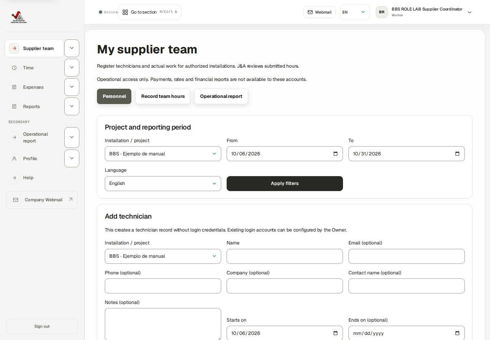

## Use the coordinator’s restricted navigation

Go here: Supplier team → Time / Expenses / Reports / Operational report

Context: Browser-verified isolated BBS project C-0050-P-20261005. All ROLE LAB records are synthetic training; they are not real dispatch, customer acceptance, purchase or payment.

Supplier team handles authorized personnel and team-hour drafts. Time, Expenses and Reports handle your own operational sources. Operational report shows permitted supplier work and approval state. Profile and Help support your own account and role guidance.

The coordinator can submit work to J&A; it cannot approve those sources or certify client acceptance. Use the authorized operational workspaces shown in your navigation.

### Do the task

1. Use Personnel, Record team hours and Operational report tabs in Supplier team.
2. Select BBS, From, To and Language in Project and reporting period; choose Apply filters before interpreting a list or total.
3. On a phone use the visible primary navigation and More where offered. Scroll within long tables rather than assuming hidden columns are absent.
4. Use Profile for your own expertise, availability and security; use Help for the Supplier Coordinator path.

### Verify the result

- Coordinator desktop, 390-phone and 768-tablet views were captured.
- Requests outside the coordinator’s authorized workspace returned 403 Access restricted.

### If you get stuck

- Contact an owner is the handoff from a restricted screen. Returning to Supplier team does not grant the denied action.
- Recheck filters after a successful save: the resulting route may retain project/dates but change the active workspace tab.

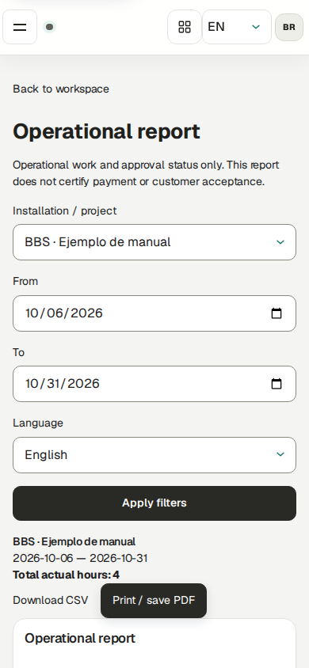

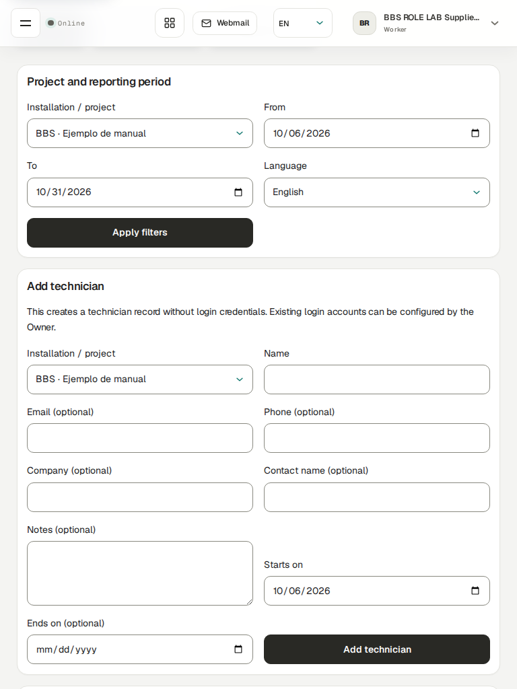

## Verify the saved supplier roster and dates

Go here: Supplier team → Personnel

Context: Native isolated BBS role exercise · C-0050-P-20261005 · synthetic October 2026 work only

Personnel lists technicians within your supplier authorization. A directory technician and a login-enabled External Technician are different records. Directory creation does not activate an account.

### Do the task

1. Select the authorized BBS Installation / project and inspect each name and Starts on / Ends on.
2. For this saved roster, the external technician is assigned October 5–31 and the directory technician October 6–31. Confirm the actual work date lies within both supplier authorization and technician assignment.
3. Ask the Owner to resolve missing supplier authorization or expired coverage before entering team work.

### Verify the result

- The native saved roster and dated assignments were inspected.

### If you get stuck

- A missing technician can reflect scope or dates. Do not add a duplicate directory entry to bypass an expired assignment.

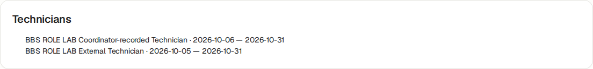

## Add a directory technician with the exact fields

Go here: Supplier team → Add technician

Context: Native isolated BBS role exercise · C-0050-P-20261005 · synthetic October 2026 work only

Add technician creates an operational directory entry in the authorized installation. Account invitation, activation and login belong to the Owner.

### Do the task

1. Choose Add technician. Required fields are Installation / project, Name and Starts on.
2. Optional fields are Email, Phone, Company, Contact name, Notes and Ends on (optional). Supply only accurate information; set end coverage when known.
3. Choose Add technician and verify the saved name and assignment dates in Personnel before recording hours.

### Verify the result

- The native form labels and existing saved roster were inspected. A new duplicate technician was not created during this remediation.

### If you get stuck

- An email in this directory form is contact information, not proof that a sign-in account exists.

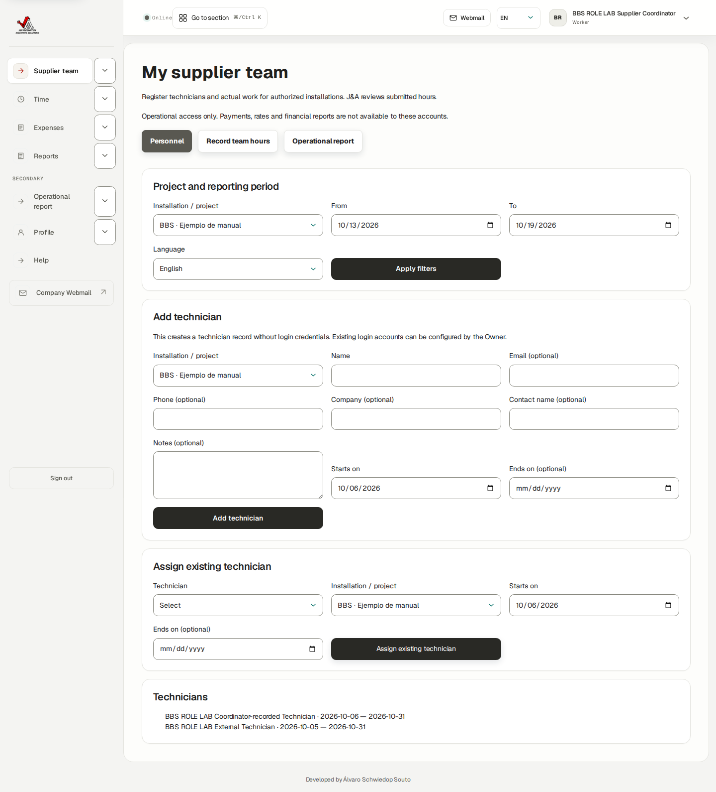

## Record actual duration for selected technicians

Go here: Supplier team → Record team hours

Context: Native isolated BBS role exercise · C-0050-P-20261005 · synthetic October 2026 work only

Actual hours applies to each selected technician. Two selected people at 0.5 h each create two drafts totaling 1 team hour. Do not enter a combined team total as each person’s duration.

### Do the task

1. Select BBS and Work date 2026-10-14. Choose only the two technicians who performed the synthetic documentation activity.
2. Enter Category, Actual hours 0.5 and precise Work performed. Check the selected names, count 2, work date and per-person duration.
3. Choose Save selected drafts. Verify the success result reports two saved drafts, then inspect both individual sources before submission.

### Verify the result

- Native saved drafts: external technician 01a11178-7915-7759-aec3-4df5406c5e2e and directory technician 01a11178-7918-765b-9139-1e242d1409a0, 30 minutes each.

### If you get stuck

- If only some technicians are eligible, correct assignment/date scope before saving. Never assume the selected count proves every intended person was saved.

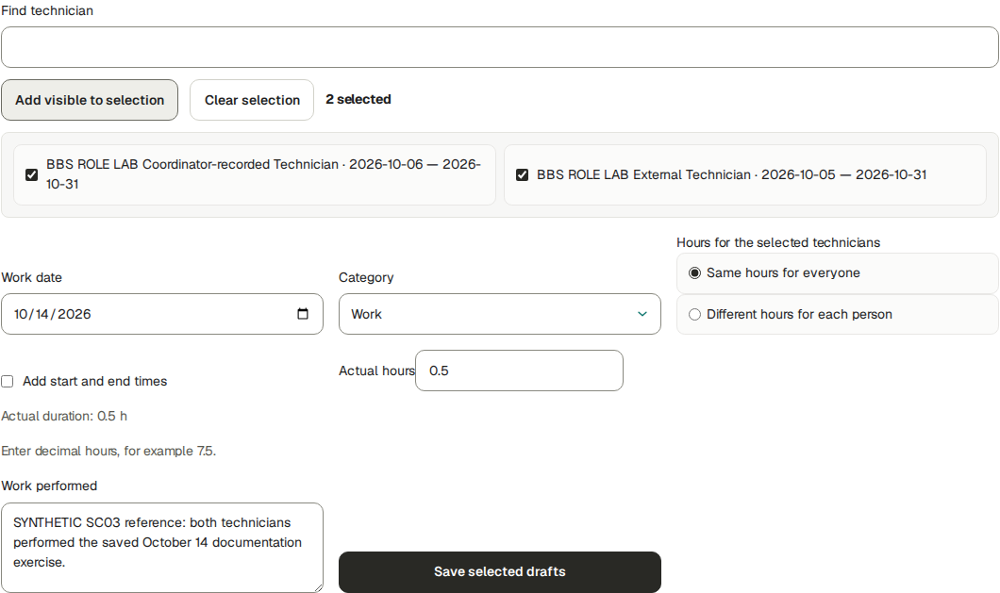

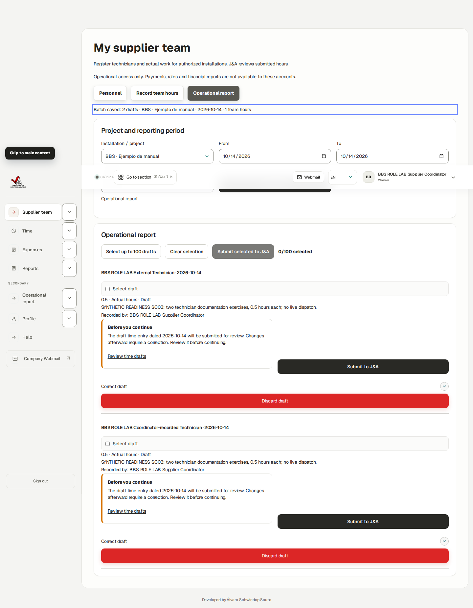

## Inspect each saved team draft and submit to J&A

Go here: Supplier team → Review drafts

Context: Native isolated BBS role exercise · C-0050-P-20261005 · synthetic October 2026 work only

Team submission is operational handoff. Supplier time is reviewed by the Owner. PM review of Daily or Technical reports is a separate workflow. See Review authority · who receives each source (review-authority) and Recovery · correct a source or request help (recovery-matrix).

### Do the task

1. Open the saved drafts and compare name, work date, category, duration and activity for each person.
2. Select the intended drafts and choose Submit selected drafts. Verify the native success result and the exact sources now Submitted.
3. Check later review on each source. In the October 14 example Owner approved the external technician’s 0.5 h and returned the directory technician’s 0.5 h.

### Verify the result

- Native two-draft submission succeeded. Later mixed review states were inspected, rather than inferred from a submitted count.

### If you get stuck

- Keep unsent drafts separate from sources already submitted. An unavailable submit action requires checking source state and coverage.

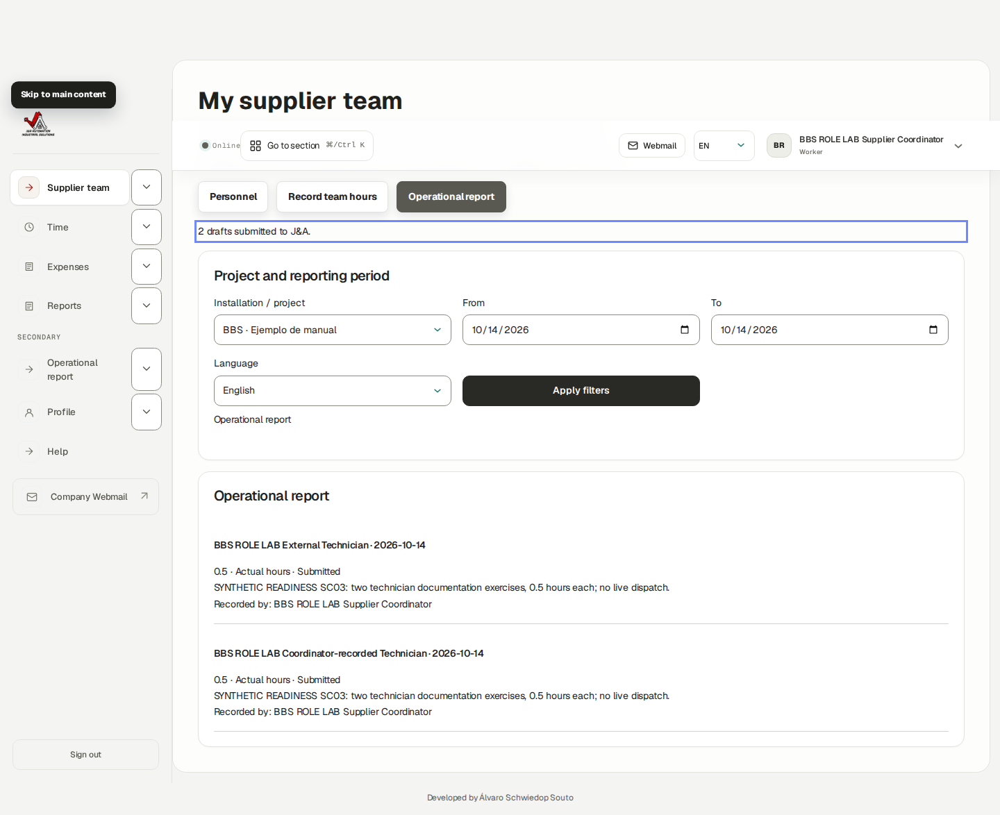

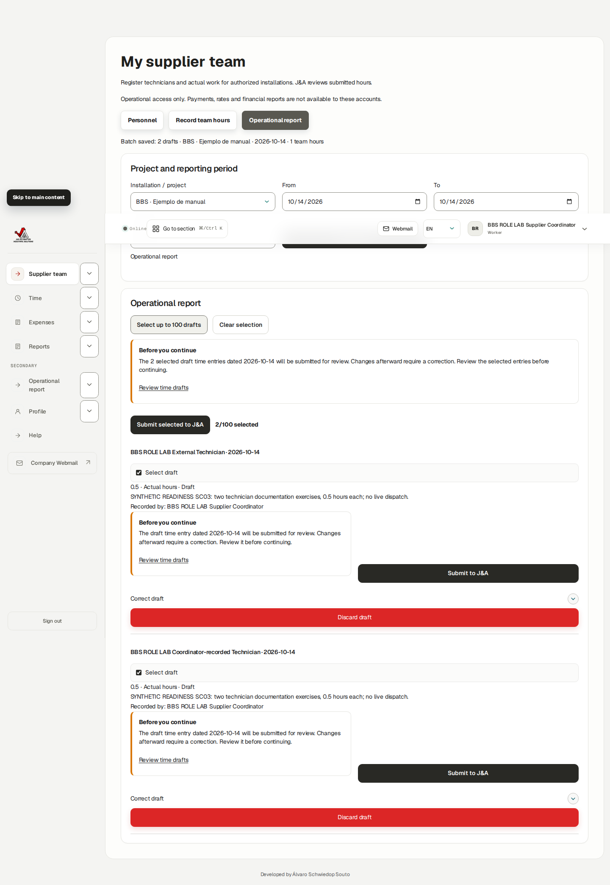

## Create a linked correction for returned team work

Go here: Supplier team → returned row → Create correction

Context: Native isolated BBS role exercise · C-0050-P-20261005 · synthetic October 2026 work only

A returned row remains Needs changes. The linked replacement carries the corrected facts and reason; it does not erase the original.

### Do the task

1. Open the returned technician source and read the Owner reason. In the correction form inspect Work date, Category, Duration in hours, Work performed and Reason for correction.
2. Enter the actual corrected duration and choose Create correction draft. Review the link to the original.
3. Submit the corrected draft to J&A, then reopen it after Owner review. Verify its state and exclude the returned original from approved totals.

### Verify the result

- The October 14 duration correction 01a11189-198d-731d-9f8d-9e124aba990e first reached Submitted at 15 minutes. Owner then requested clearer offline activity wording without changing duration. The coordinator created and submitted linked replacement 01a11197-6484-75a6-8c75-dd7a30b82764; Owner approved the final 15-minute source. The final native report retains the original 30-minute source as Needs changes/superseded and the intermediate 15-minute source as Rejected; the latest 15-minute source is Approved.
- The historical October 6 correction 01a10e50-5f09-7290-8a50-92767e39e3f0 is Approved at 90 minutes; its returned 120-minute original remains historical.

### If you get stuck

- Do not change the old source or count original and replacement together. Ask the Owner if the reason does not identify the actual correction needed.

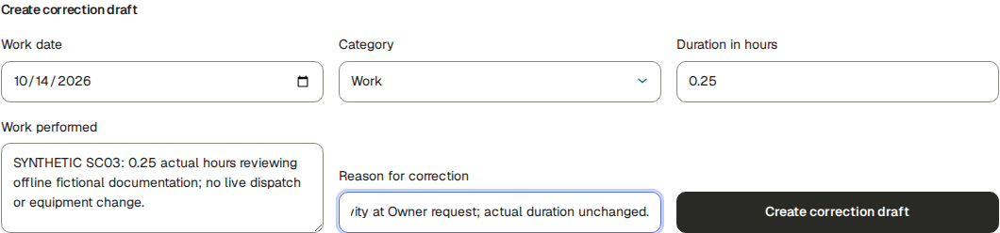

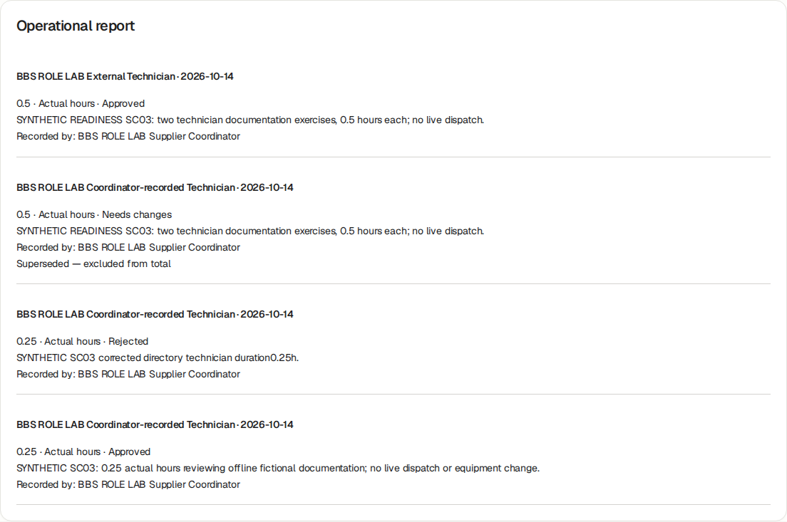

## Keep the before checkpoint and export the final filtered totals

Go here: Operational report → Download CSV

Context: Native isolated BBS role exercise · C-0050-P-20261005 · synthetic October 2026 work only

The earlier October 6 screenshot and CSV show two Submitted rows totaling 4 h. They document the before-review checkpoint. They cannot substantiate the later approved total.

The final October 6 filter shows 120 Approved minutes for the external technician and the directory technician’s 90-minute Approved correction: 210 minutes = 3.5 h. Returned 120-minute directory source 01a10e4b-c344-754a-969c-73b0bcae1a1e is not counted twice. Later October work requires its own filters.

### Do the task

1. Open Operational report, choose BBS, From 2026-10-06 and To 2026-10-06.
2. Compare both technician rows and Approved states. Choose Download CSV and verify two rows, 210 actual minutes and 3.5 actual hours against the filtered screen.
3. Retain the earlier 4 h Submitted export as before history; use supplier-final-oct06.csv for the final 3.5 h Approved evidence.

### Verify the result

- Final native CSV matches Approved sources 01a10e4b-c33e-7033-a065-d3980b92c94d and 01a10e50-5f09-7290-8a50-92767e39e3f0. It contains operational activity and recorder attribution.

### If you get stuck

- Compare the same dates, technician scope and review states before reporting a discrepancy.

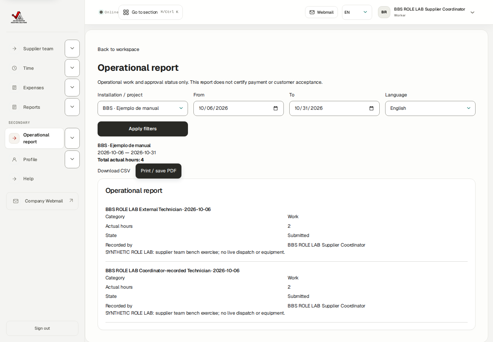

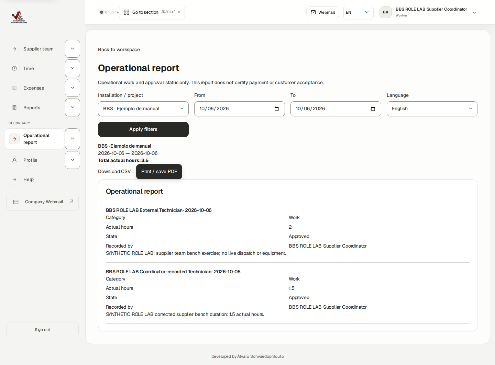

## Keep your own work separate and submit eligible weekly drafts

Go here: Time → Weekly timesheet

Context: Native isolated BBS role exercise · C-0050-P-20261005 · synthetic October 2026 work only

Your own time is a worker source, separate from technician team rows. Never record the same activity as both your own and a technician’s work.

### Do the task

1. Save truthful own time on the assigned BBS project. Submit an individual draft when ready.
2. For the week of October 12, inspect eligible ordinary draft 01a11181-d654-7628-afb8-8a4ea00b4539 and correction draft 01a11181-c862-75f1-a8a7-96688534e4c6, both version 1 and 15 minutes.
3. Choose Submit this week and verify both exact sources became Submitted. The returned October 17 original 01a11180-fb49-755b-b108-b0d6d641978c remains Needs changes.

### Verify the result

- Native weekly submission included both ordinary and eligible linked correction drafts, count 2, and succeeded for both sources. These Submitted states do not prove approval or payment.

### If you get stuck

- Copy previous week layout is a source-checked draft convenience, not proof of worked hours. Check dates and actual work before using it.

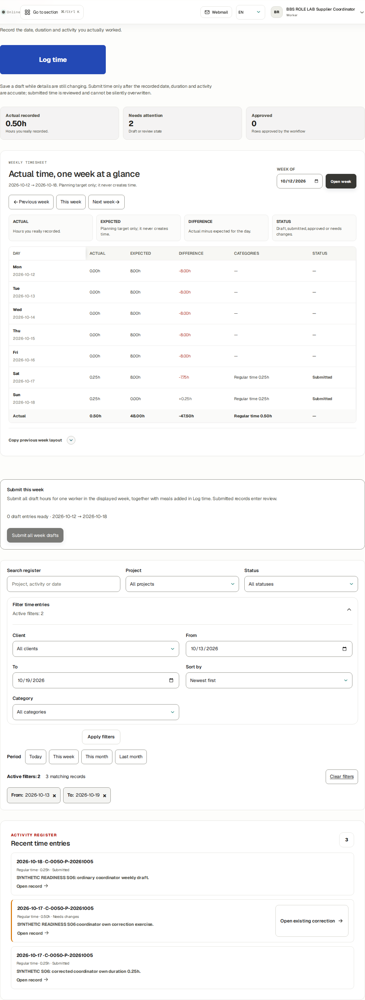

## Save your own expense receipt and submit the facts

Go here: Expenses → New expense

Context: Native isolated BBS role exercise · C-0050-P-20261005 · synthetic October 2026 work only

An own expense belongs to the person who actually incurred it. Submission records operational facts; it does not prove reimbursement.

### Do the task

1. Choose BBS, Category, Date, Amount, Currency, Who paid, Description and Payment method. Vendor, occurrence time and related logged hours are optional where shown.
2. Choose a private receipt image or PDF. Save draft, then inspect amount/currency/payer, receipt filename and the saved receipt before Submit.
3. Choose Submit and reopen the own source. Verify Submitted and the registered private receipt link.

### Verify the result

- Native October 16 source 01a11180-9dbf-7543-bdc9-f851e7de886a records USD 6.50, Project materials, Worker paid, a clearly fictional vendor and training cash. A unique synthetic receipt PDF was saved; Submit succeeded. No purchase or payment occurred.

### If you get stuck

- If a receipt hash is already registered, inspect the existing private content. Do not repeatedly upload a duplicate or invent a new purchase to bypass the duplicate guard.

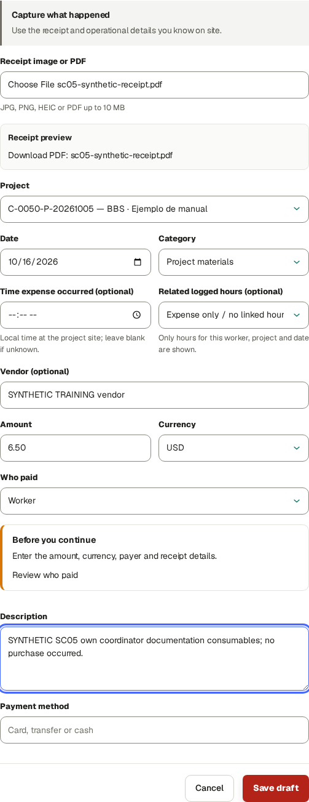

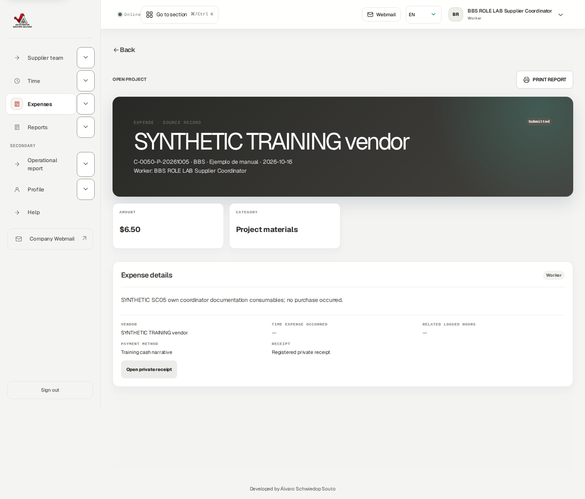

## Create, submit and download your own Daily report

Go here: Reports → New report → Daily

Context: Native isolated BBS role exercise · C-0050-P-20261005 · synthetic October 2026 work only

This is your own authored operational report, separate from supplier technician time. It contains synthetic training facts and no live equipment change. PM review of the report does not approve supplier time.

The saved preview and generated PDF reflect source facts. Queued is pending; Ready enables the native download.

### Do the task

1. Create your own Daily report with BBS and Report date 2026-10-13. Enter actual facts and Save draft.
2. Complete site/shift, summary, tasks completed, open items and next-day plan. A next-day plan is a proposal, not a published dispatch.
3. Submit the saved source for authorized operational review. Reopen it after PM review and verify Approved and source v3.
4. Select a PDF language and Generate report. Use Refresh until Ready. Download and check the source identity, version, language and content.

### Verify the result

- Native source 01a11177-1c99-725d-a2e9-0f36830cea4e reached Approved v3, then English PDF Ready and native Download. The Daily artifact was checked against its saved source.

### If you get stuck

- Correct the authorized source and generate the new saved version when facts change; preserve prior source/PDF history.

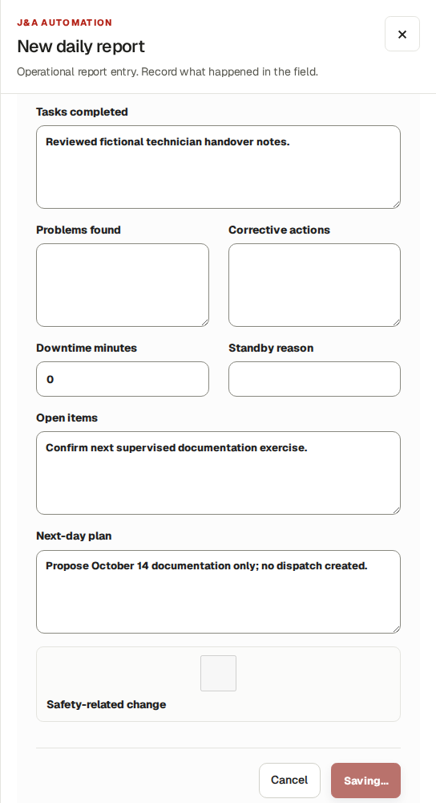

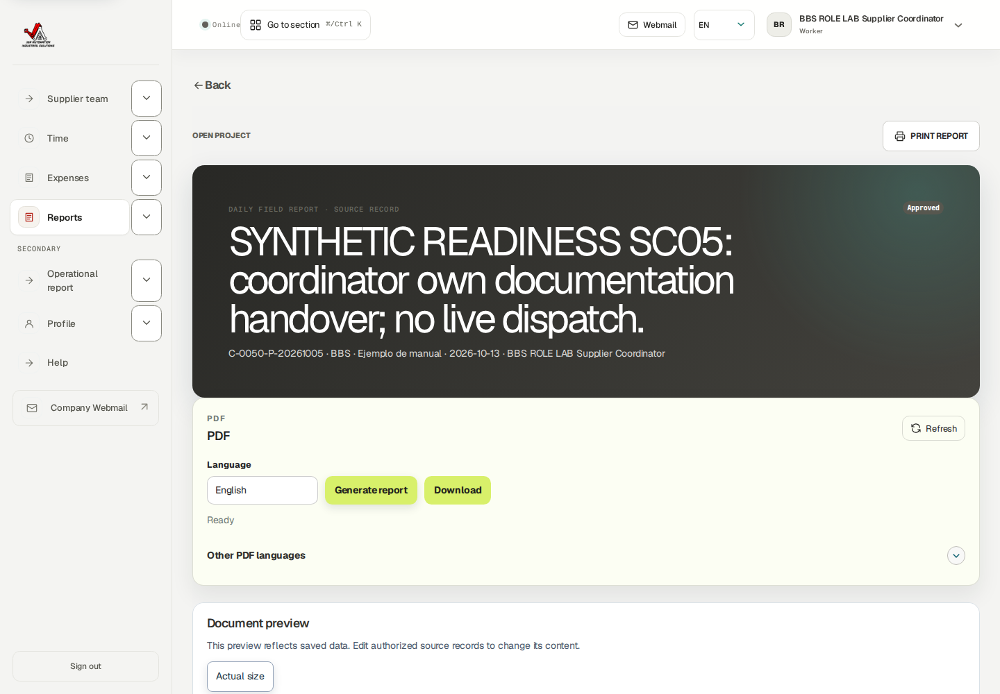

## Create, submit and download your own Technical / PLC report

Go here: Reports → New report → Technical / PLC

Context: Native isolated BBS role exercise · C-0050-P-20261005 · synthetic October 2026 work only

This is your own authored operational report, separate from supplier technician time. It contains synthetic training facts and no live equipment change. PM review of the report does not approve supplier time.

The saved preview and generated PDF reflect source facts. Queued is pending; Ready enables the native download.

### Do the task

1. Create your own Technical / PLC report with BBS and Report date 2026-10-16. Enter actual facts and choose Save PLC report.
2. Complete system/context, observed issue, diagnosis, change, validation/result, production impact, risk and rollback. For evidence choose Evidence type Technical attachment, File and Notes, then Upload private evidence. Verify saved metadata before Submit.
3. Submit the saved source for authorized operational review. Reopen it after PM review and verify Approved and source v3.
4. Select a PDF language and Generate report. Use Refresh until Ready. Download and check the source identity, version, language and content.

### Verify the result

- Native source 01a1117d-a645-738f-adae-f60c4e5a3f4a reached Approved v3, then English PDF Ready and native Download. The Technical / PLC artifact was checked against its saved source.

### If you get stuck

- Correct the authorized source and generate the new saved version when facts change; preserve prior source/PDF history.

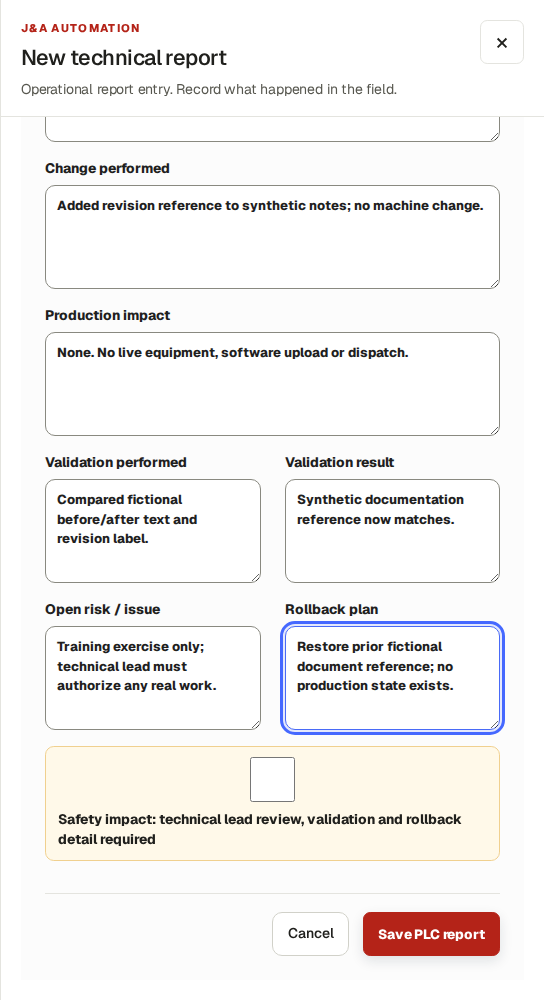

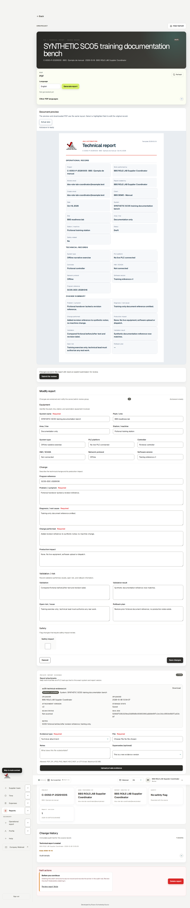

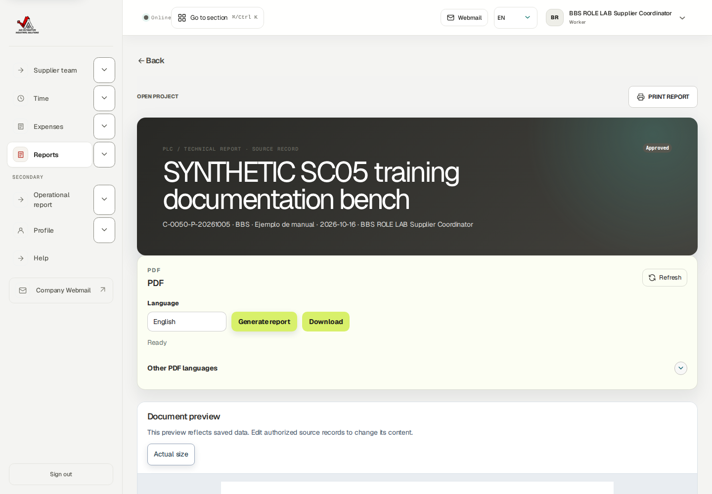

## Maintain your own availability and secure access

Go here: Profile → Expertise and availability / Account security → Help

Context: Browser-verified isolated BBS project C-0050-P-20261005. All ROLE LAB records are synthetic training; they are not real dispatch, customer acceptance, purchase or payment.

Coordinator Profile holds your own expertise and availability. Availability uses UTC. Security settings concern your own signed-in account, not an inspected supplier technician.

Help provides the English Supplier Coordinator BBS course. Use its role-specific procedures and the shared access, security and recovery sections included in this course.

For invitation and sign-in use Access · activate the invitation and sign in (access). For MFA, devices and recovery use Security · verify your own device and recovery options (security).

### Do the task

1. Open Profile and verify your own name/email. Inspect expertise and availability before recording or arranging work.
2. For an actual availability change choose Add availability, enter UTC Starts/Ends, select the status and Note, save and reopen. This mutation was not executed for the coordinator packet.
3. Use Register passkey or Enable MFA only on your own device with secure recovery storage. These controls were inspected; no credential/device mutation was performed.
4. Open Help, choose the desired language and Supplier Coordinator starting path. English role guides may be linked as a language fallback.
5. Sign out after use. Use the organization’s approved contact path for an access problem rather than sharing another role’s credentials.

### Verify the result

- Actual coordinator Profile and Help loaded, including own workforce scope and role-specific starting guidance.
- No passwords, cookies, tokens or MFA recovery material were included in screenshots or manuals.

### If you get stuck

- An account labelled Worker in Profile may still carry a supplier restriction; ask the Owner to verify its profile/linkage and the authorized project.
- Report UI problems with role, BBS reference, date, source state and exact action/error; omit private credentials.

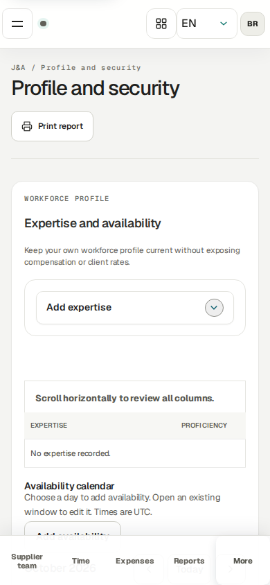

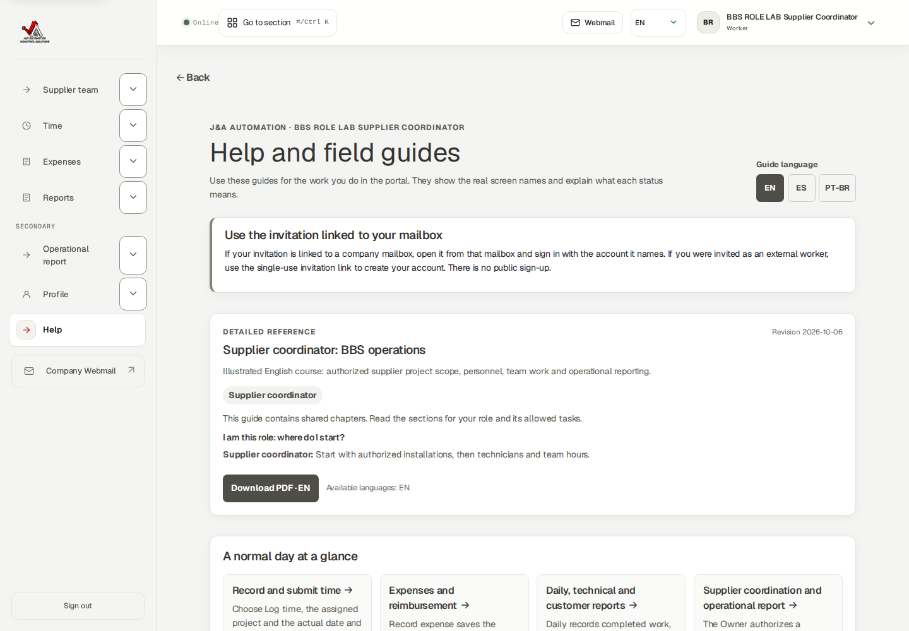

## Finish the supplier operational cycle

Go here: Personnel → Drafts → J&A review → Operational report

Context: Browser-verified isolated BBS project C-0050-P-20261005. All ROLE LAB records are synthetic training; they are not real dispatch, customer acceptance, purchase or payment.

The coordinator’s cycle is authorized personnel, accurate actual team drafts, explicit submission, returned correction when needed and an operational status export. Source review and customer acceptance are separate handoffs.

Native coverage includes saved roster inspection, selected team draft save/submission, Owner review and linked correction, exact final 3.5 h Approved CSV, own ordinary/correction weekly submission, own receipt expense submission, own Daily/Technical approval by PM, private Technical evidence upload, Ready PDF generation and downloads. Historical screenshots retain their checkpoint dates. See Completion check · your permitted role cycle (verification).

### Do the task

1. Confirm BBS authorization and each technician’s work-date coverage before entering actual hours.
2. Review saved sources and submit the intended batch only once. Send the reviewer a clear project/date/source handoff.
3. Follow Needs changes through a linked correction and re-review; compare active totals with the retained original history.
4. Export the operational report with the correct period/state and describe its meaning. Hand customer-acceptance and other out-of-scope questions to the designated J&A contact.
5. Keep your own Time, Expenses and Reports distinct from technician team sources and report unresolved access/preview problems.

### Verify the result

- No production data, real equipment, live dispatch, customer consent, outward mail or bank payment was changed or asserted by this training packet.
- Earlier BBS operational records were preserved.

### If you get stuck

- Do not duplicate work to fix a locked source. Explain the source ID, period and exact message to the designated contact.
- If access ends or assignment dates expire, ask Owner to review the genuine authorization. A directory record alone cannot restore login.

## Planning appendix · turn work instructions into actual team facts

Go here: Supplier team → Record team hours → Operational report

Context: Isolated BBS planning lab · real role browser sessions · fictional October 22–23, 2026 work · no production changes

Supplier project authorization and personnel assignment establish who may work and on which dates. Internal published planning is separate. Supplier Coordinator navigation opens Supplier team and does not expose Today or Planning; the direct Planning route returns Access restricted. Arrange operational instructions through the Owner’s approved coordination process.

The native October 23 exercise selected two existing fictional supplier technicians, used Same hours for everyone and entered one actual hour. Save selected drafts created two individual sources totaling two team hours, attributed to their respective technicians and Recorded by the coordinator. Shared entry is not one combined person record.

The actual work form records completed work; it has no goal-acceptance action. A technician can inspect their own coordinator-recorded hour; other technicians’ sources remain outside their authorized scope.

### Do the task

1. Open Supplier team. Choose BBS under Installation / project and Record team hours. Confirm each technician’s displayed assignment dates cover 2026-10-23.
2. Choose Add visible to selection or select the intended technicians individually. Verify two selected. Set Work date 2026-10-23, Same hours for everyone, Actual hours 1 and the fictional Work performed summary.
3. Choose Save selected drafts. Confirm Batch saved: 2 drafts and 2 team hours. Saving alone does not submit them.
4. Set From and To to 2026-10-23 and choose Apply filters. Inspect both separate drafts, then Select up to 100 drafts. Verify the selection is exactly the intended two before Submit selected to J&A.
5. Open Operational report with the same project/date filter. Verify total two hours, individual one-hour rows and Recorded by attribution. Authorized J&A Owner review subsequently changes both sources to Approved.

### Verify the result

- Native two-person batch save, explicit submission and Owner operational approval succeeded. Both source IDs retained 60 minutes and the correct person attribution.
- Coordinator report totals 2; External Technician report totals only their own 1. Native desktop, tablet and phone report views loaded without application errors.

### If you get stuck

- If drafts are absent immediately after saving, inspect the selected report period: a successful October 23 save is outside an October 1–6 filter. Update From/To before considering another save.
- Supplier hours are excluded from the ordinary PM Time approval queue. Hand their project/date/source IDs to an authorized J&A Owner; PM report review is a different workflow.
- Preserve the source and request a linked correction for reviewed facts. Do not enter another hour to attract review.

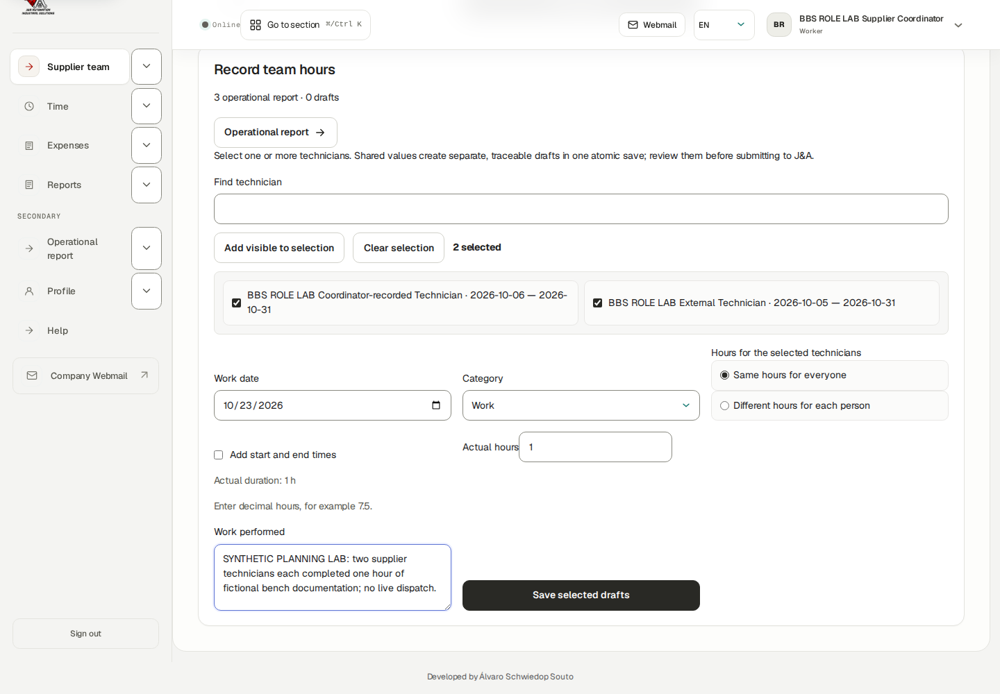

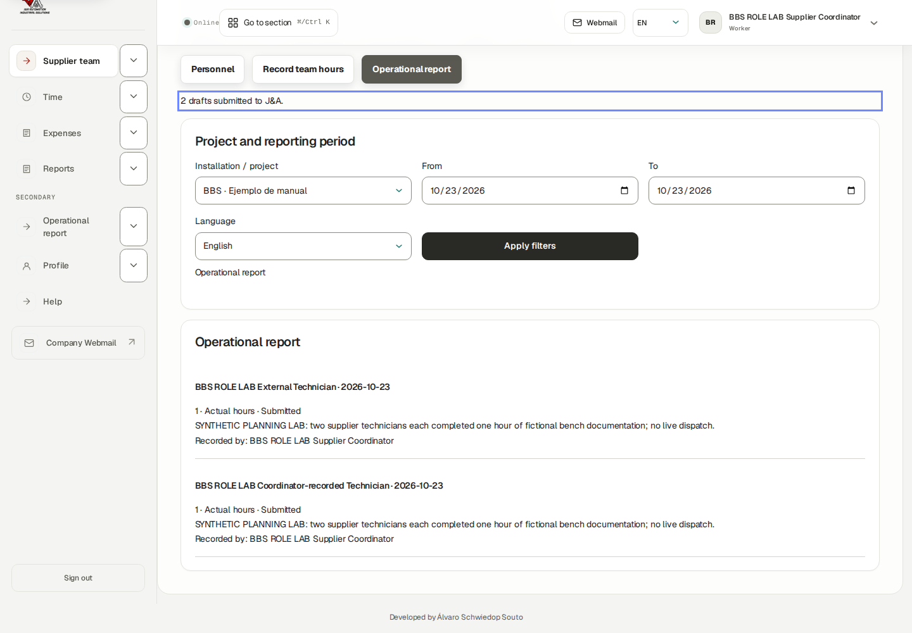

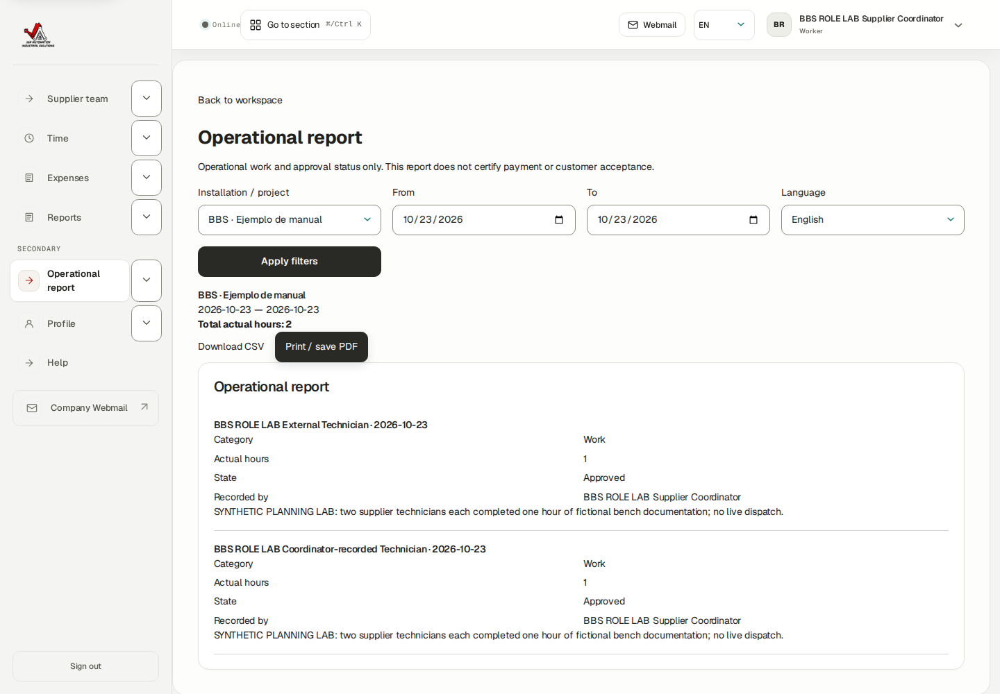

## Coverage appendix · missing people, dates and work goals

Go here: Supplier team → Record team hours; own Reports → Daily

Context: Isolated BBS planning lab · real role browser sessions · fictional October 22–23, 2026 work · no production changes

The worked supplier authorization and technician assignments end October 31. Moving Work date to November 1 removed both eligible technicians, cleared the selection and disabled Save selected drafts. The app’s No matching records hint mentions search/status generically; in this exercise the actual reason was date coverage. No November 1 source was saved.

An assigned project and a published plan are not interchangeable. This coordinator profile cannot inspect an internal agenda, publish plans or accept goals. A current supplier grant still does not enable the internal Planning calendar.

Use your own Daily report’s Tasks completed, Open items and Next-day plan for truthful coordination notes. Those fields record narrative progress rather than a task status, a published shift, actual hours or customer acceptance. The External Technician chapter demonstrates the same native narrative fields through save, submission and PM operational approval.

### Do the task

1. When personnel disappear, first verify Work date and the displayed assignment interval. Clear an accidental search and confirm BBS before requesting scope changes.
2. For November 1 in this exercise, stop: coverage ended October 31. Ask the Owner to confirm a genuinely authorized extension and supplier/project relationship. Do not shift the date to make a prohibited work entry save.
3. When a plan is missing, obtain the instructions from the authorized Owner/coordinator channel; return to Supplier team instead of repeatedly opening the denied Planning route.
4. For your own coordination narrative open Reports → New daily report. Describe your own completed tasks, unresolved items and proposed next-day steps, then follow Save daily report → Submit for review and the permitted review handoff.
5. For technician time inspect individual attribution and active totals. A goal description or future plan does not supply actual work evidence.

### Verify the result

- Changing the native team form to an uncovered date removed eligible personnel and disabled saving. Read-only database verification confirmed zero exercise sources on November 1.
- Native restricted Planning showed Access restricted and a Supplier recovery link. The coordinator returned to the authorized operational workspace.

### If you get stuck

- Include role, supplier, project, intended work date and exact missing/disabled control in an access request. Never include passwords or session material.
- A directory technician may have no login. Ask the Owner to distinguish personnel creation, individual account activation, supplier authorization and dated project assignment.
- For expected-hour discrepancies in your own Time screen, use the effective schedule target and Actual minus Expected; do not interpret a plan duration as the schedule target. Ask the Owner to investigate an unavailable — expectation.

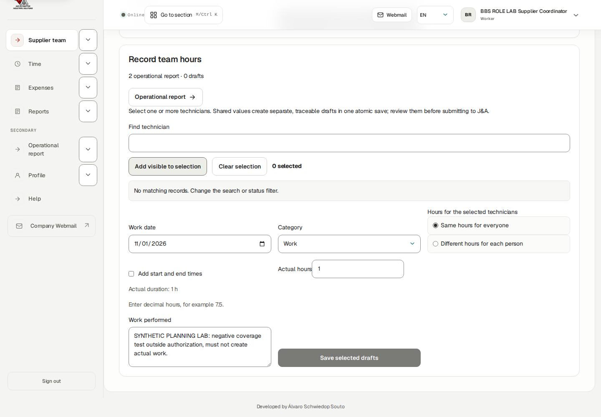

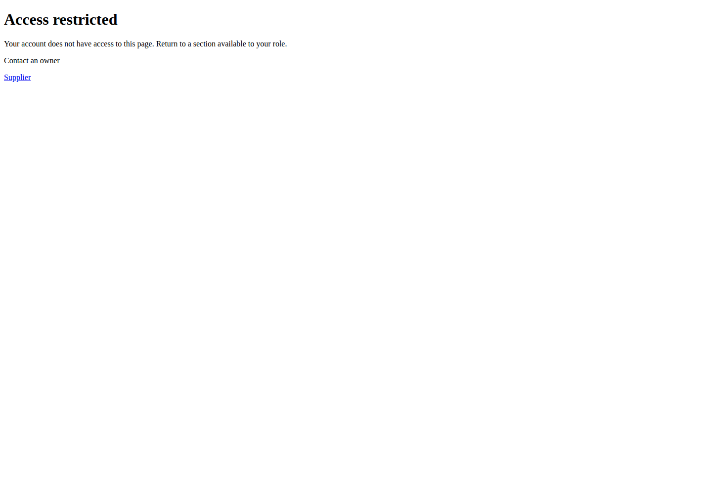

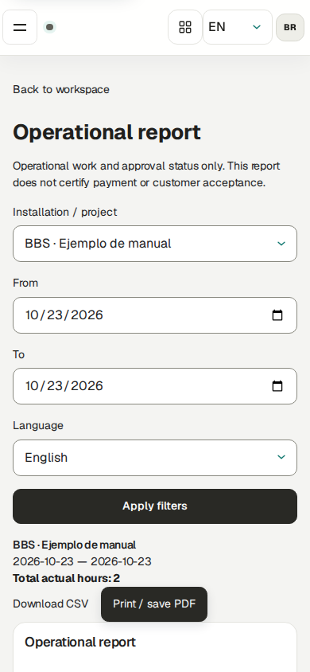

## Recovery · correct a source or request help

Use your role’s worked correction lesson and the controls offered on the current record. Preserve the original. A new purchase is different from correcting an existing purchase.

| State | Supported next action |
| --- | --- |
| Ordinary Draft | Use Edit/Save draft where present; attach the actual receipt/evidence before Submit. Inspect each saved draft after weekly table entry. |
| Submitted | Read current state and reviewer handoff. Do not create another source merely because review is pending. |
| Needs changes | Read the reason. Time uses Create corrected draft where available, then submit/review the linked replacement. A returned Daily/Technical report instead offers Edit and Save changes on the same report, then Submit for review; follow the exact role lesson. |
| Rejected | Inspect the reason and contact reviewer/Owner. The time detail does not offer the same linked-correction route as Needs changes; do not assume that route exists. |
| Approved, correction available | Use the offered linked correction and review every value before creating it. Submit the replacement for the authorized reviewer and verify its resulting state. |
| Locked or correction unavailable | Send the source ID, project, work date, visible state, requested correction and reason to the designated administrator. Do not create a duplicate. Wait for instructions before changing the record. |

### If you get stuck

- If an action is unavailable to your account, return to your workspace and contact the designated administrator with the record reference and requested action. Do not change dates or people to work around a restriction.

## Security · verify your own device and recovery options

Go here: Profile → Account security; Profile → Add availability

### Do the task

1. Check Account security identifies YOUR account even when an authorized workforce profile inspection shows another worker above it. Enroll only your own device. MFA is optional in this release.
2. For a passkey, enter Device name and choose Register passkey on the approved secure portal. Complete your device’s creation confirmation. Verify Passkey registered for this account, the registered count and named device row. Cancelled/failed registration is not enrollment.
3. To retire your own lost/obsolete passkey, first confirm you retain another working sign-in method. Select Revoke on the exact device and verify Passkey revoked and removal of its row. If you cannot sign in, use the verified support route rather than another person’s session.
4. For an authenticator, choose Enable MFA. Keep the setup URI and one-time recovery codes private in the approved password manager. Add the URI to your authenticator, enter its current six-digit Authenticator code and choose Verify MFA. Verify Enabled and Disable MFA appear; enabling without verification is not completed enrollment.
5. At a later MFA sign-in use Six-digit code → Verify and continue. If the authenticator is unavailable, choose Use a recovery code and enter one unused stored code. If neither method is available, contact admin@j-aautomation.com for identity-verified recovery. Do not send recovery codes or the setup URI to support.
6. To remove optional MFA while signed in, choose Disable MFA and verify Not enabled/Enable MFA. Confirm the intended own account before doing so. A successful settings change is separate from recovering a lost account.
7. Where Add availability is offered, fill Starts, Ends, Availability and Note using the displayed time basis, then Save availability. Verify the saved interval/status/note in the list; use Edit availability on that row and save the changed values. Availability is not project membership, a published shift or actual hours.

## Completion check · your permitted role cycle

Use the worked lessons for your own role. Historical examples retain their stated dates and states. A procedure labelled reference was checked against the controls; its outcome was not necessarily executed in the illustrated session.

### Verify the result

- Confirm your identity, project and dates. Verify the saved and submitted source, its review state, supported correction or administrator handoff and each permitted Ready output. Submission, review and download are separate checkpoints.
