# Worker · BBS field operations

Own actual hours, expenses, reports, corrections, compensation and secure handoffs

## Before practising · live and training access

The company portal https://j-aautomation.com/j-aautomation/app is LIVE. A link to it never enters a simulation. For practice obtain a separately provisioned training URL, your own account, the permitted fictional project and dates, a visible environment identifier and the trainer’s reset procedure. Without those, use this guide as a read-only demonstration and enter only authorized genuine work.

Original BBS operational examples and some historical unpaid settlements were saved on the live deployment; their original exports were downloaded there. Later fictional issuance, payment, acceptance, correction and readiness exercises used isolated copies or separate synthetic portfolios. Each chapter identifies its dataset and checkpoint. A later screenshot does not change an earlier saved workbook or issued master.

A role, project membership, review permission, supplier authorization and dated crew delegation are separate. Use your own credentials. Inspect another person’s permitted operational record without signing in as them. Ordinary workers and project managers do not receive customer prices, internal cost, margins or another worker’s compensation.

### Verify the result

- Confirm your displayed identity, the environment, project number and work dates before saving. For training/reset or lost access contact admin@j-aautomation.com; send the route, role, project/record reference, time and visible error. Keep passwords, activation links, recovery codes and cookies private.

### If you get stuck

- For an empty project selector, ask the Owner to check account status and assignment/authorization coverage. Do not create a duplicate project or borrow another account.

## Access · activate the invitation and sign in

Go here: Your trusted invitation → Activate your account → Return to sign in → Profile

### Do the task

1. Check the portal address and named account against the invitation provided by the Owner. There is no public sign-up. For an already provisioned account, use the sign-in method supplied to you; do not attempt to activate someone else’s invitation.
2. For a single-use activation link, open Activate your account. Enter Full name and choose a Password of at least 12 characters, then Activate account. Wait for Account activated. You can sign in now. Do not repeatedly submit while Activating… is displayed.
3. Choose Return to sign in. Enter your account Email and Password and select Continue to workspace. If you previously enabled MFA, complete Verify your identity with the current Six-digit code and Verify and continue. Use a recovery code only through the offered Use a recovery code control.
4. Open Profile and verify the own-account name/email/role in Account security. Check the navigation and assigned project. A newly activated account can have zero assignments; activation alone does not grant project access or supplier/chief authority.

### Verify the result

- The activation success message precedes the separate sign-in. The illustrated new Worker signed in and reached their own Profile; no assignment or financial permission was implied.

### If you get stuck

- An expired or already used link displays This invitation could not be activated. It may have expired or already been used. If activation already succeeded, return to sign in. Otherwise request a new invitation from the Owner; reloading does not renew the old link.
- For offline, temporarily unavailable or rate-limited activation, retain the entered name/password privately, restore connectivity or wait for the displayed retry interval, then retry. An unconfirmed response is not proof of an active account.
- For an incorrect password, inactive account or lost access, contact admin@j-aautomation.com from your verified account/contact channel. Supply identity and the visible error; never send the password. This guide does not promise a public password-reset form. The initial Owner is provisioned by the platform operator; an existing Owner provisions the remaining team.

## Trainer setup · prepare a normal cycle before exceptions

Ask the trainer to provide the following checkpoint sheet before reproducing a lesson. Reusing a shared historical BBS period does not reset it. A production URL is never a training switch.

| Checkpoint | Required starting condition |
| --- | --- |
| Identity and environment | Own correctly provisioned role/profile; isolated URL and visible environment identity. |
| Project and dates | Exact project number, timezone and unused eligible lesson dates; membership and relevant grants cover both current access and the work date. |
| Source state | Named source IDs and durations/amounts; ordinary starting drafts/submissions; no unrelated correction already open. |
| Financial/evidence locks | List issued/closed periods, finalized settlements and signed report versions. Teach ordinary correction on an unlocked scope first. |
| Expected outcome | Saved state, source count, actual total and appropriate own/customer/internal output. Include the receiving role and result. |
| Reset | Operator restores the prepared database AND private documents together to the named checkpoint while training is stopped. Trainees do not delete financial history to reset a lesson. |

### Verify the result

- The new normal Worker/Chief lesson uses BBS READINESS · normal work cycle (C-0050-P-2026100601) with initially unfinalized October work. Original BBS locked-period examples are exceptions. External/Supplier/PM October 13–19 and Finance October 26 demonstrations are separately labelled; Accounting can use a separate clean synthetic portfolio.

## Review authority · who receives each source

Review is determined by the actual source, base role and current dated grants. Chief delegation alone grants recording, not approval. A Worker with Can review checked does not become a Project Manager or Finance user. Send a factual correction reason with every return.

| Source / recorder | Operational reviewer and prerequisite | Next handoff |
| --- | --- | --- |
| Internal own or chief-delegated time | Owner or Finance; assigned PM with current active Can review membership for this project. | Owner/Finance records commercial Billable or Non-billable review separately. |
| External/supplier time, including coordinator own time | Authorized Owner. Supplier authorization/recorder provenance keeps these sources outside the ordinary PM time queue. | Finance review follows Owner approval. |
| Own/delegated expenses | Owner or Finance; assigned PM with current project review grant. Check factual purchase, payer and evidence. | Owner/Finance classifies customer recovery and worker reimbursement separately. |
| Daily and Technical reports, including supplier profiles | Owner or Finance; assigned PM with current project review grant and permitted project scope. | Owner/Finance prepares the customer period report and version-bound acceptance where required. |
| PM’s own work | Route it to another authorized reviewer for an independent factual check. Do not infer a universal self-review prohibition solely from a job title. | Personal reports/pay outputs remain own scope; financial treatment belongs to Owner/Finance. |

### If you get stuck

- If the intended source is absent, check source type, state, dates, assignment/review grant and supplier authorization before searching another queue. A review-enabled Worker Chief variant is not exposed by the current role model; Owner must provision the genuinely permitted reviewer role and grant. Never use a colleague’s credentials to bypass this boundary.

## Start with your own account

Go here: Sign in → Today

Context: Isolated BBS role lab · genuine Worker account · fictional October 2026 records

Use the individual active Worker account provisioned by your Owner. Person, account, project assignment and approval permission are separate. An invitation or password does not itself assign a project. The first-shift and normal correction exercise uses BBS DEMO - Tecnico 2 in C-0050-P-2026100601 · BBS READINESS · normal work cycle, with synthetic October 7–12, 2026 records in the isolated lab. Earlier C-0050-P-20261005 records are historical examples.

Before practising, obtain an operator-provided training URL, your own training account, a visible deployment identifier, permitted scope and reset instructions. This guide does not supply a shared training login. Live company portal links open the live company service; they never enter the isolated demonstration. Do not enter simulated work, expenses or payments in the live portal.

Today is your landing page. Time records actual work; Expenses records purchases and evidence; Reports records daily and technical facts; My Pay shows your own compensation and reimbursements; Profile manages your workforce profile and security. Notifications and Help are in the navigation. Crew hours is useful only when the Owner has granted applicable delegation.

For account access and recovery, use the common Access (access), Security (security), Review authority (review-authority) and Trainer setup (trainer-setup) sections. Those controls are shared across roles; a job title does not grant access.

### Do the task

1. Sign in with your own account. Confirm the account, language and environment before entering data.
2. On Today inspect assigned projects and published plans. Open the BBS project or use Log actual time, Write field report or Add expense.
3. On a phone use More for additional destinations; close the navigation drawer before entering a form.

### Verify the result

- The active project and person agree with your intended work. No other person’s credentials are needed.

### If you get stuck

- Ask the Owner to activate the account or correct project assignment if your project is missing. Do not create duplicate people or share accounts.

## Save and inspect actual time

Go here: Time → Log time

Context: Isolated readiness lab · own Worker 2 account · unlocked new project · synthetic October 7, 2026

Record the work you actually performed. The isolated first shift saved two hours on October 7 for Worker 2 in the new training project, then submitted it separately for review. The Owner returned that source; the normal linked correction below changes it to 1.5 hours while preserving its history. Decimal hours are duration: 3.5 means three hours thirty minutes.

Category describes operational activity. Selecting Overtime does not by itself promise a premium; approved compensation rules determine money. Add start/end times is optional; do not invent clock times from duration. Add meal expense with these hours is a separate expense input.

### Do the task

1. Open Log time. Select Project and Date; choose the operational category and enter Actual hours and Activity summary. Fill offered site/detail fields with facts.
2. Use Save draft. Open the saved row and check person, date, project, category and actual duration before submitting.
3. Use individual Submit on the time detail. Confirm Submitted; saving a draft alone does not send it for review.

### Verify the result

- The saved own source showed Draft, then Submitted after the explicit Submit action. The returned original remains Needs changes; saving or submitting does not approve the source.

### If you get stuck

- Edit an unsent draft through its permitted draft controls. If uncertain whether Save succeeded, reload the date-filtered register and open the existing row before trying again.

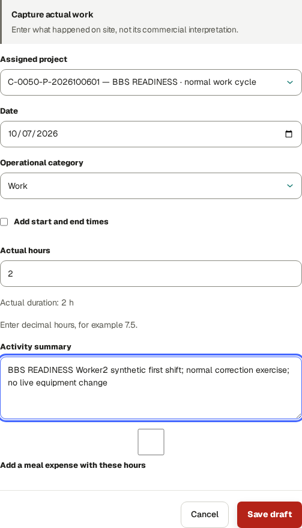

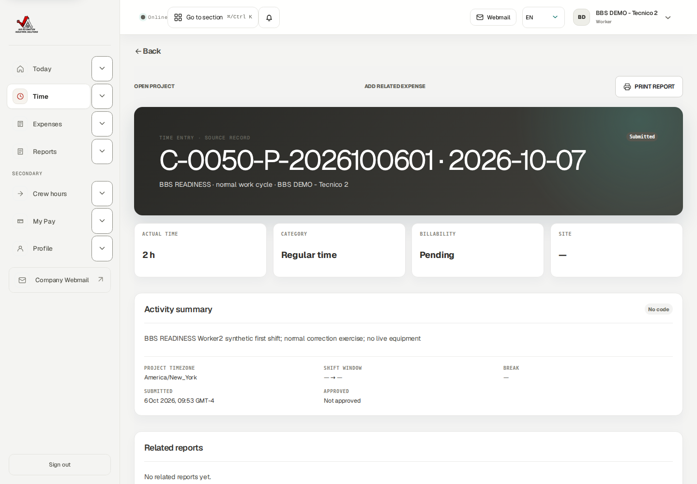

## Record one expense with private receipt evidence

Go here: Expenses → Record expense

Context: Isolated readiness lab · same Worker 2 persona · synthetic October 12, 2026 purchase

The worked receipt is a synthetic USD 3 tools purchase by Worker 2 on October 12 in the unlocked readiness project. It explicitly says training only and no real purchase. Saving and submitting are operational steps; reimbursement and bank payment remain separate.

The native form accepts JPG, PNG, HEIC or PDF receipts up to 10 MB. Operational purchase amount, who paid, worker reimbursement and customer recovery are separate. Preserve the actual receipt currency and payer.

### Do the task

1. Choose Record expense. Attach Receipt image or PDF, select Project, Date and Category, and fill Amount, Currency, Who paid and Description. Vendor/payment method and local time/related hours are offered contextual fields.
2. Check the full Save draft control, then use it. Reopen the exact saved expense and inspect worker, date, payer, USD 3 amount and attached private receipt.
3. Use Submit on the expense detail. Verify Submitted and hand the record ID to the permitted operational reviewer. Finance later decides applicable treatment; no reimbursement or bank payment is claimed.

### Verify the result

- One own Worker 2 receipt-backed USD 3 tools expense is Submitted. The separate weekly exercise attaches receipts to each saved draft before selected-week submission.

### If you get stuck

- If receipt processing or permission prevents access, use the precise document status/message and ask support. Uploading/registered does not universally mean antivirus-clean. Do not duplicate a purchase while checking a failed submission.

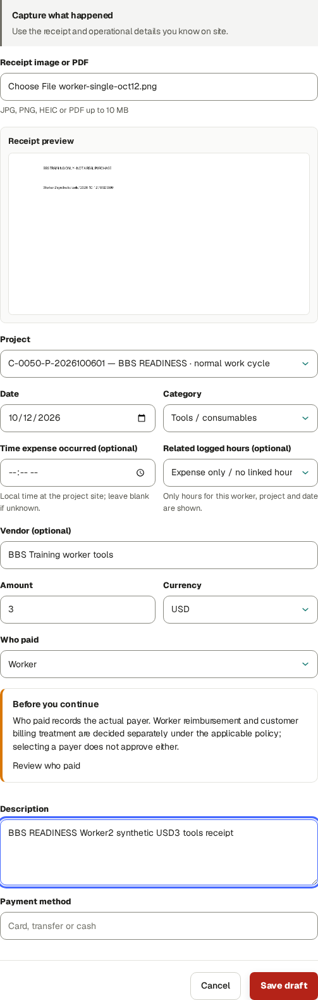

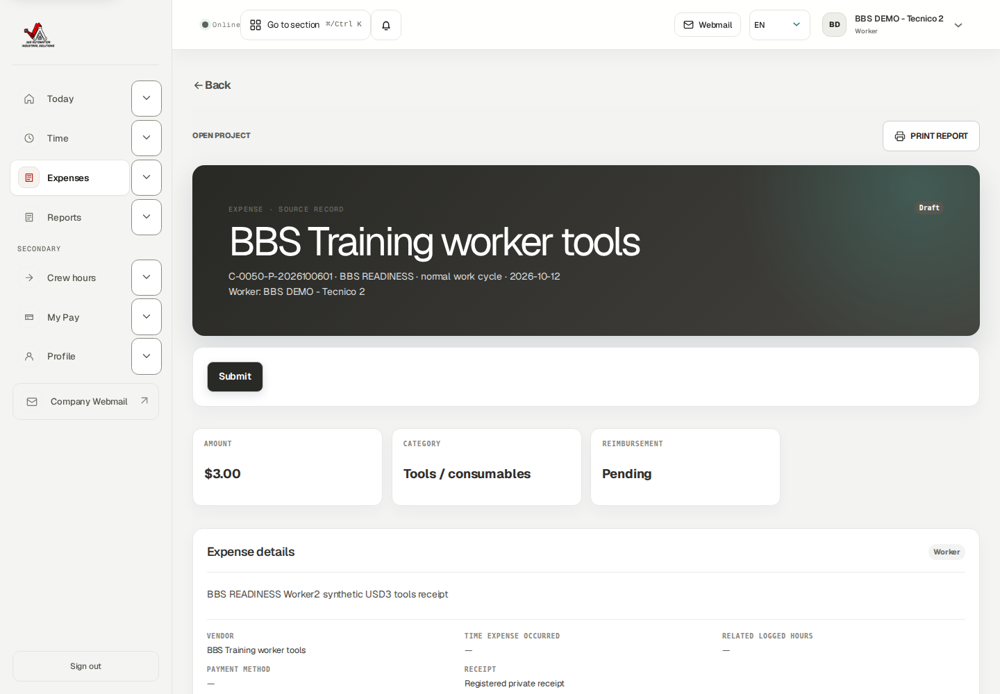

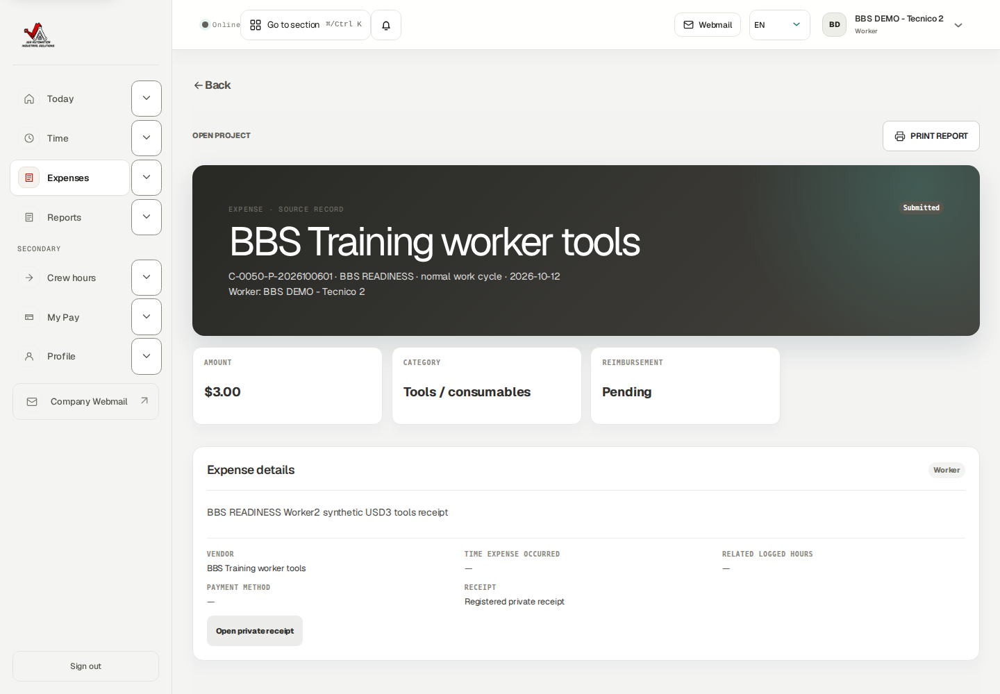

## Save and submit a daily field report

Go here: Reports → New daily report

Context: Isolated readiness lab · own Worker 2 report · synthetic October 12, 2026

A daily report tells the operational story. It does not create actual hours, technical approval, customer acceptance or an invoice. The Worker exercise describes a fictional bench inspection and has its own report ID.

The actual form begins with Project, Work date, Site / shift, Shift summary and Tasks completed. It also offers Problems found, Corrective actions, Downtime minutes, Standby reason, Open items, Next day plan and a safety flag. Report actual conditions, including genuine risks; this training bench had no live production change.

The readiness exercise saved an own Draft, generated its English source PDF, checked Ready with Refresh and downloaded the readable native file before Submit for review. The PDF panel’s Language selects English, Spanish or Portuguese independently of the navigation language.

### Do the task

1. Choose New daily report. Complete Project, Work date and the factual summary/tasks; fill applicable problems/actions/downtime/next-step fields.
2. Use Save daily report. Open the Draft report and inspect its header and content. Saving/autosaving content does not submit it.
3. Use Submit for review. Confirm Submitted. The genuine PM approved this source in the role lab.

### Verify the result

- Own Daily Draft → Ready source PDF → native download → Submitted was tested in the readiness project. A readable pre-submission PDF is a snapshot of that draft; it is not operational approval or customer acceptance.

### If you get stuck

- Correct an unsent draft using its available edit controls. For submitted/returned/approved reports, use the offered correction flow or hand the specific record to the reviewer; do not overwrite approved history.

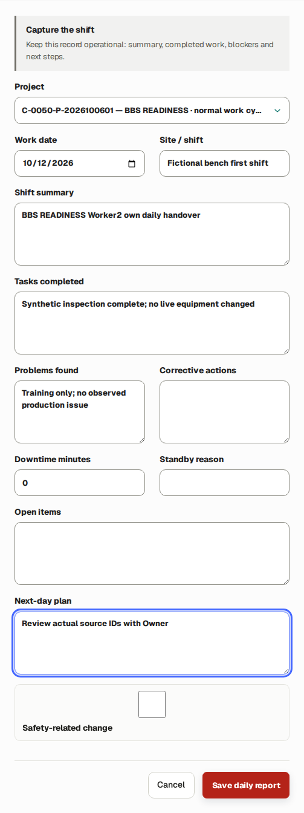

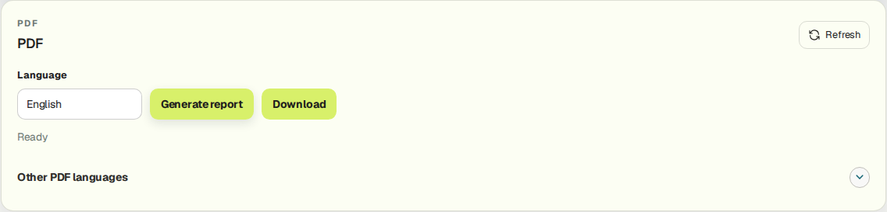

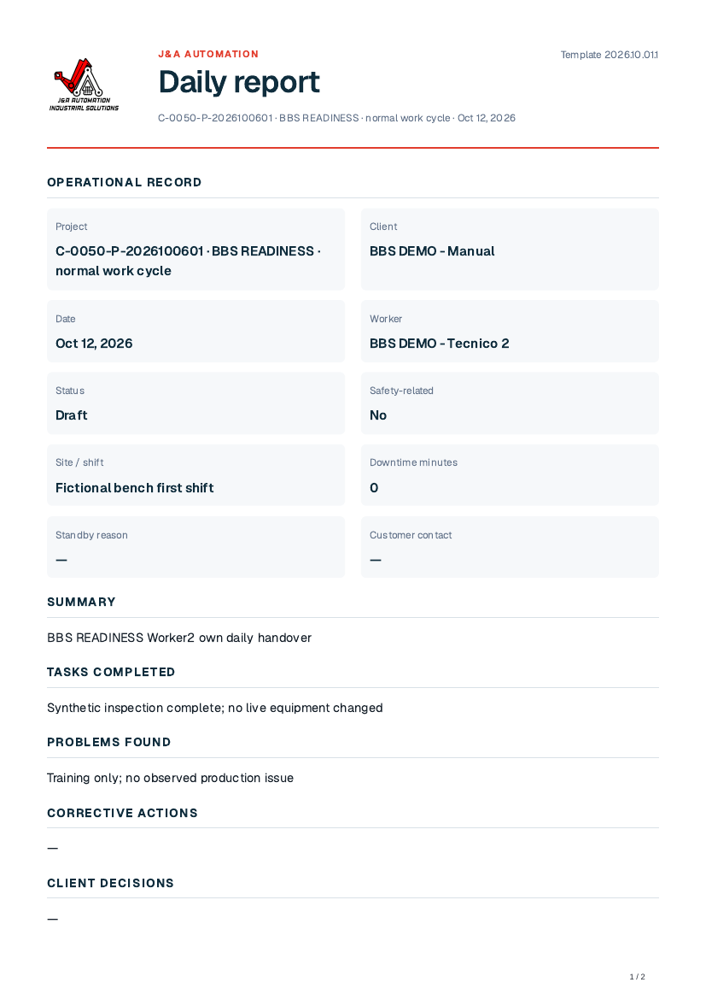

## Describe a technical change without treating it as permission

Go here: Reports → New technical report

Context: Isolated readiness lab · own Worker 2 report · synthetic October 12, 2026

Technical reports identify a system and document Problem / symptom, Diagnosis / root cause, Change performed, validation, remaining risk and rollback. Submitting a report does not authorize a live PLC change or substitute for your employer’s safety/change-control procedure.

The exercised report is explicitly a fictional bench. Offered fields include System / machine, Plant / site, Area / line, Station / machine, System type, PLC platform, Controller, HMI / SCADA, Network / protocol, Software version and Program / project reference. The actual save label is Save PLC report.

The readiness exercise saved an own Draft, generated its English source PDF, checked Ready with Refresh and downloaded the readable native file before Submit for review. The PDF panel’s Language selects English, Spanish or Portuguese independently of the navigation language.

### Do the task

1. Choose New technical report. Identify the equipment and write the problem, diagnosis and change in readable factual language.
2. Fill Production impact, Validation performed/result, Open risk / issue, Rollback plan and safety impact where applicable. Use Save PLC report.
3. Open the Draft and inspect the details; use Submit for review, then verify the reviewer’s resulting state.

### Verify the result

- Own Technical Draft → Ready source PDF → native download → Submitted was tested in the readiness project. A readable pre-submission PDF is a snapshot of that draft; it is not operational approval or customer acceptance.

### If you get stuck

- A missing validation or safety decision needs a real responsible-person handoff. Do not invent a successful validation to make the report look complete.

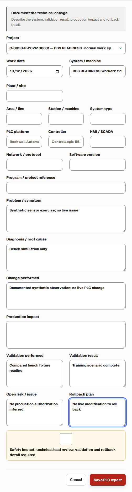

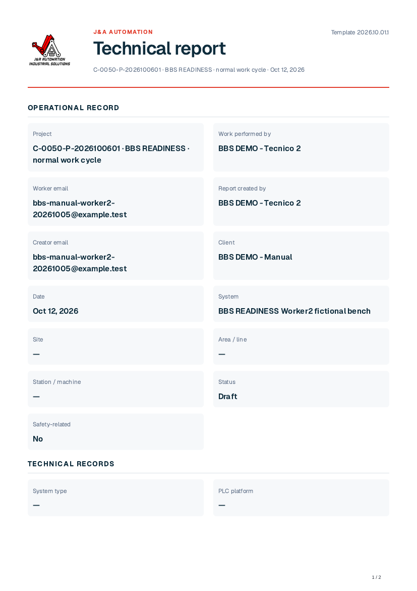

## Submit your own displayed week and verify every source

Go here: Time → Log time; Week of → Open week → Submit all week drafts

Context: Isolated readiness lab · actual own Worker 2 weekly submission · October 5–11, 2026

For your own Worker account, enter each worked day through Log time and Save draft. The deployed Enter a week in a table time-entry form is an Owner control; it is not present in this Worker screen. Inspect existing sources before adding another day.

Use Week of → Open week to choose the displayed submission week. The own weekly action can include an eligible active linked correction as well as an ordinary draft. In this test, the October 7 corrected 1.5-hour draft and October 8 ordinary 0.5-hour draft were both submitted together.

Copy previous week layout is a separate reference control. It copies layout with zero hours, not an assertion that last week’s work happened again. Inspect the displayed Previous week and This week before Add this week’s layout; do not treat a zero-hour layout as completed actual work.

### Do the task

1. Save accurate own daily work with Log time → Save draft, then open every intended source and verify its current state.
2. Select Week of → Open week. Read the displayed date range and draft count; review ordinary sources and any correction’s original link.
3. Choose Submit all week drafts. Refresh the page, open each source and verify Submitted plus the remaining draft count. A count alone is not evidence that a specific source was sent.

### Verify the result

- Actual own Worker 2 result: two eligible drafts before submission, both named source records Submitted afterwards, zero remaining drafts. The original two-hour returned source and withdrawn wrong correction were preserved.

### If you get stuck

- A blocked or changed draft must be reviewed through its exact record. Do not repeatedly resubmit the whole week to force a guarded source.

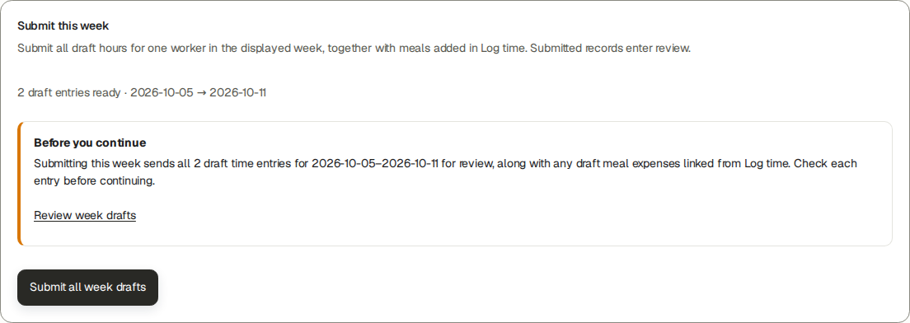

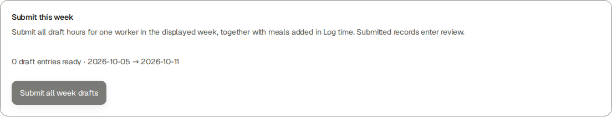

## Use expense batch tools and corrections carefully

Go here: Expenses → Enter a week in a table → Save weekly expense drafts → Edit → Submit this week

Context: Isolated readiness lab · actual own weekly expenses, receipt attachment and returned expense correction

The weekly table saves up to one purchase per worked day for one project and your own account. Choose the project and week first; changing either can clear unsaved rows after confirmation. Enter actual category, amount, currency, payer, vendor and description. The exact save button is Save weekly expense drafts.

The tested October 10 and 11 purchases were USD 5 and USD 7. Each saved draft was opened with Edit, its own matching receipt was attached with Save changes, and the displayed October 5–11 week was then submitted. Two drafts became Submitted and zero remained.

Missing receipt rules are state-specific. The deployed weekly table creates receipt-optional drafts; an earlier USD 5 + USD 7 set therefore submitted without receipts. Where a saved draft requires a receipt, the weekly UI disables Submit this week and the repository validates the whole set. That required-missing saved-draft branch was source-checked, but was not created through a supported native control in this lab. Attach the required evidence rather than assuming every receipt-free draft is blocked.

### Do the task

1. Open Enter a week in a table. Set Project, Week containing, Currency and Who paid before entering rows; use Save weekly expense drafts.
2. Open each saved draft through Edit, use Attach receipt (optional), select the correct date/amount receipt and Save changes. Reopen the exact expense to verify Registered private receipt.
3. Choose the intended Week containing → Show week. Inspect every included draft and use Submit this week. Confirm each record’s Submitted state and the remaining count.
4. For a returned expense, read Review reason and use Create corrected draft when offered. Review all values and the receipt: leave the attachment empty to retain the original receipt, or attach its genuine replacement. Create the linked draft, inspect it, then Submit.

### Verify the result

- Actual October 10/11 receipt-backed submission: exactly two expense IDs, USD 5 + USD 7, each with its own registered receipt, both Submitted and zero remaining drafts.
- The USD 5 source was subsequently returned for clearer description. A linked corrected draft retained the same receipt, date, currency and purchase amount and was Submitted; the original remains Needs changes.

### If you get stuck

- A linked correction does not offer unrestricted editing after creation. Use Withdraw correction draft only while offered and unsubmitted; reviewed, allocated, billed or reimbursed sources can require the reviewer/Finance handoff. No purchase amount is multiplied by creating its linked correction.

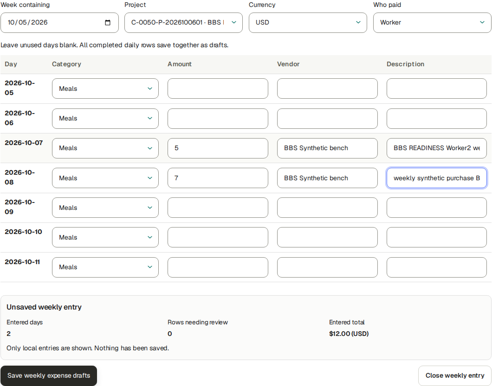

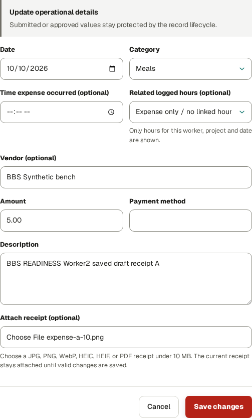

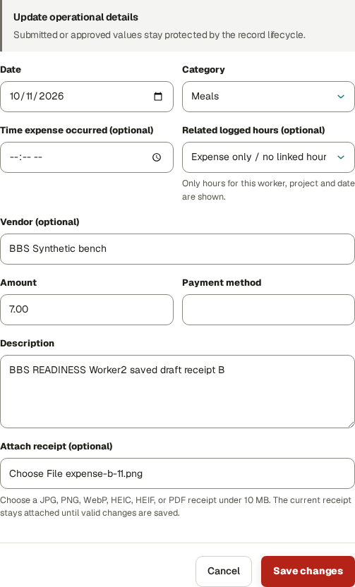

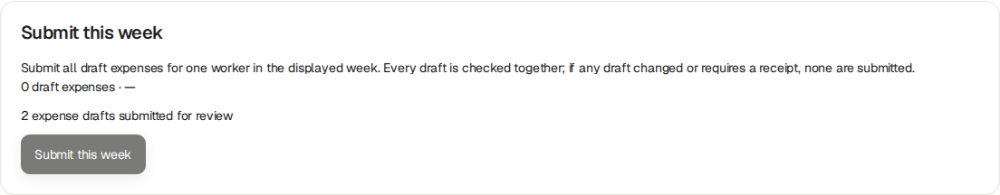

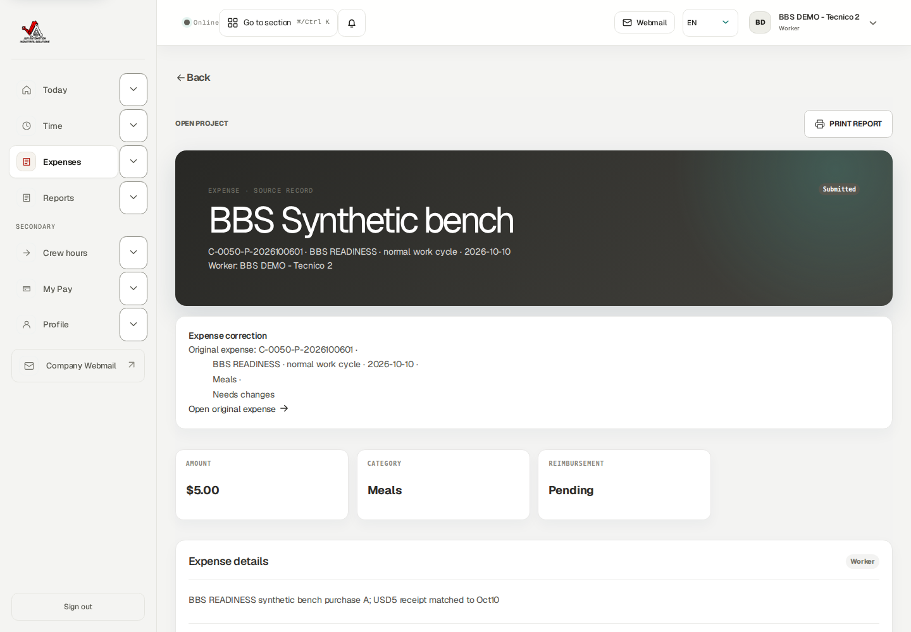

## Correct returned time and retain history

Go here: Time → returned source → Create corrected draft

Context: Isolated readiness lab · own Worker 2 normal correction · unlocked October 7, 2026

The Owner returned Worker 2’s two-hour readiness-project source with a reason requesting 1.5 actual hours. The source is outside any finalized obligation in this new project. Create corrected draft creates an audited linked replacement and preserves the original.

Review every value before creating the correction: a linked time correction has no Edit draft control after creation. If an unsubmitted correction is wrong, use Withdraw correction draft with a reason, return to the original and create the correct replacement. This exercise actually withdrew a wrong 1.75-hour draft and recreated a 1.5-hour draft.

### Do the task

1. Open the Needs changes source and read Review reason. Use Create corrected draft.
2. Enter the correct Actual hours, date/category/activity and a concrete Correction reason; create the draft and inspect its original link.
3. For an incorrect unsubmitted linked draft, enter Why withdraw this draft? and use Withdraw correction draft. Confirm the original is available again, then create the accurate replacement.
4. Submit individually or through the eligible own displayed week. This exercise used weekly submission for the corrected 1.5-hour source alongside a separate ordinary draft.

### Verify the result

- The original remains Needs changes. The wrong correction is withdrawn in audit history (stored as rejected), and the current linked 90-minute correction is Submitted. Operational approval remains the reviewer’s next action.
- The older October 15–16 statement with 195 approved minutes is a historical verified example; it is not the status or total of this new correction exercise.

### If you get stuck

- If a correction is already submitted, use its current state and the reviewer’s next offered control. Finalized compensation, shared receipt or billing guards require the responsible Finance/Owner handoff; do not create an unlinked duplicate.

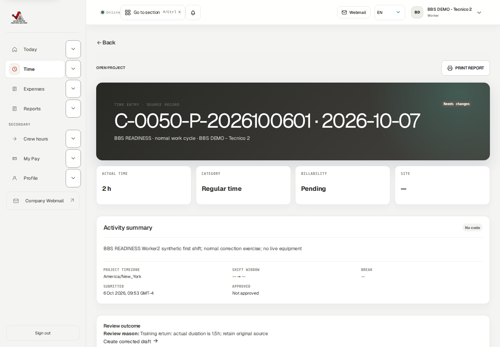

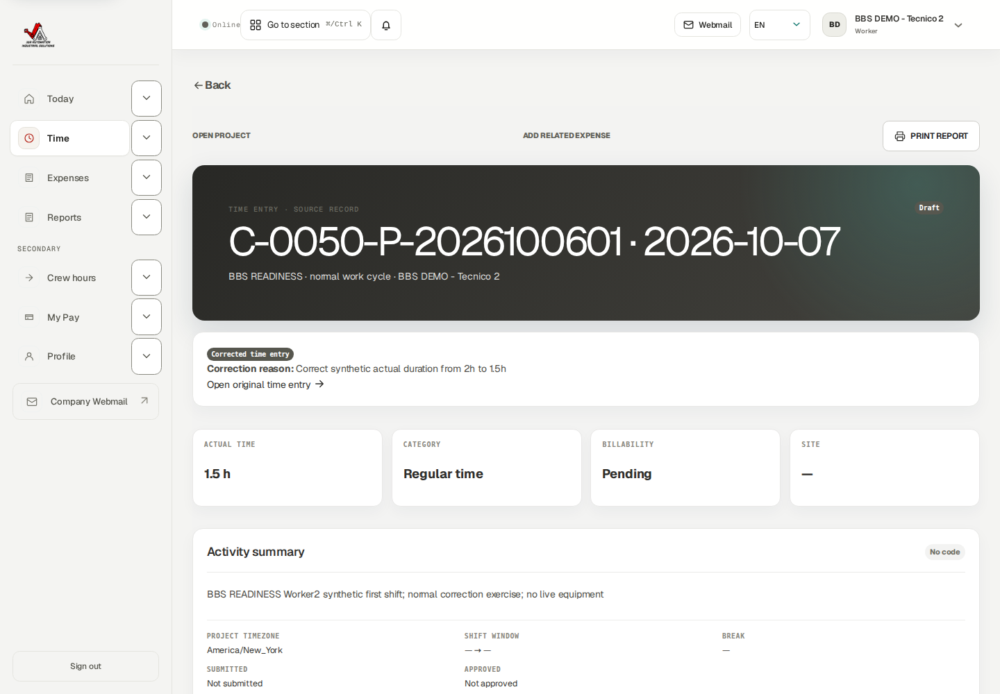

## Understand report PDFs, attachments and customer acceptance

Go here: Reports → your report detail

Context: Isolated readiness lab · native own PDF, attachment and returned Daily edit

Use the own report PDF panel: choose Language, Generate report, then Refresh to check preparation. Download appears for the selected current Ready variant. Queued is not a finished file. A later source edit requires a fresh current PDF; the earlier downloaded snapshot remains earlier evidence.

An own Worker 2 Daily text attachment was actually uploaded as private supporting evidence while Draft. Allowed types include PDF, ZIP, common images and UTF-8 text, with the displayed 50 MB limit. Registered evidence and an available native download are separate from antivirus status; read the current status before relying on a file.

Report recovery differs from time and expenses. An ordinary Draft or Needs changes report can be edited through Modify report / Save changes and resubmitted as the same versioned source. This was actually tested for the returned Daily report. An Approved report offers Create corrected draft when unlocked; the resulting linked correction is not an unrestricted editable draft. A report included in a finalized period can require the authorized review/Owner handoff.

Customer period PDFs and customer acceptance are separate authorized workflows. Own source approval does not record a signature. The lab created no customer signature or acceptance.

### Do the task

1. Before Submit for review, inspect saved report facts and authorized attachments. Generate and open the current own PDF when needed.
2. If returned, read the reviewer reason, edit only the offered fields, use Save changes and Submit for review; verify the same ID’s new version and state.
3. For an Approved source, use the offered linked correction flow and review every value before creation. For a finalized-period guard, send source ID, period/version, exact message and intended change to the Owner/PM.

### Verify the result

- Worker 2 returned Daily was edited and resubmitted as the same source. A fresh Spanish variant of the changed source reached Ready and was downloaded as version 5; the earlier English version 1 remains the pre-submission snapshot.

### If you get stuck

- Do not promise Edit on a linked report correction or a finalized source. Do not fabricate signer evidence or claim a downloaded report was delivered to a customer.

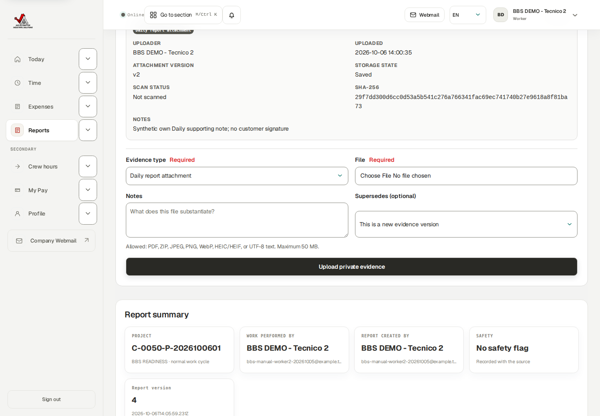

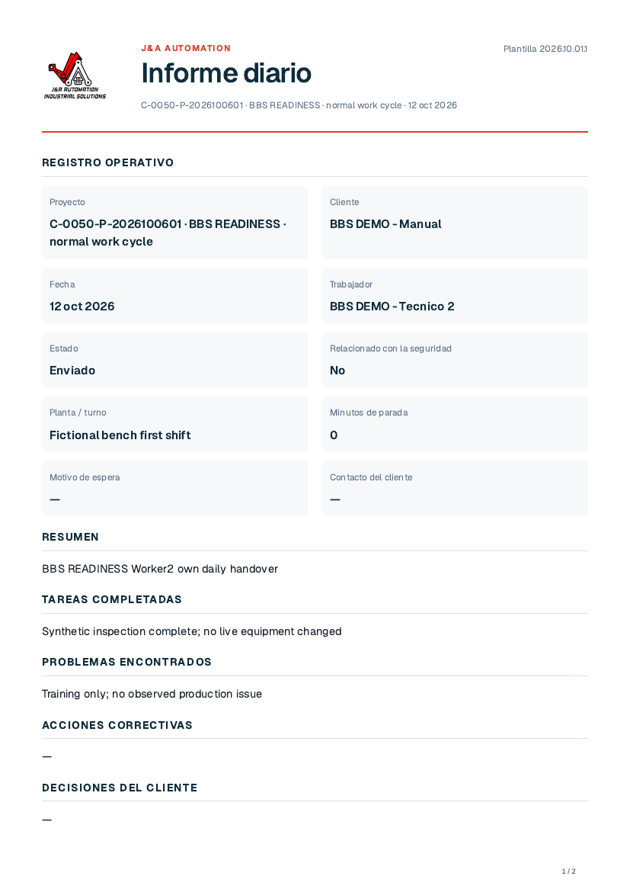

## Read your own compensation and reimbursement

Go here: My Pay → From / Through → Apply period

Context: Isolated BBS role lab · genuine Worker account · fictional October 2026 records

My Pay displays your own activity and governed compensation estimates, reviewed settlements, expected dates, actual recorded payments and reimbursement information. Customer invoice frequency and worker payment frequency are independent. Owner/Finance choose settlement periods and expected payment dates; there is no automatic worker payroll cadence demonstrated here.

Worker 1’s historical monthly settlement is USD 720, scheduled November 3, actual paid zero. Daily compensation can differ from actual hours and customer billing units. Worker 2’s October 15–16 approved 195 minutes shows a USD 900 Fixed Per Billing Period estimate; it is not an hourly prorated amount or proof that USD 900 was paid.

Exact activity is 2.5 h + 0.75 h = 3.25 h. My Pay summary rounds to one decimal (3.3 h and 0.8 h travel); rounding is not extra work. “No reviewed payments outstanding” can coexist with an estimate that has not yet become a reviewed settlement. A recorded payment is a business entry, not independent proof of a bank transfer.

### Do the task

1. Select From and Through, then Apply period. Read approved and pending amounts separately by currency.
2. Open the compensation statement/activity detail and compare exact time records. Read reviewed settlement period, scheduled date, paid and remaining balances independently.
3. Check reimbursement obligations separately from compensation and customer charges.

### Verify the result

- You see your own pay, not another worker’s or customer invoice economics. Selected source dates may differ from a settlement’s wider period.

### If you get stuck

- Ask Finance about missing rules, period coverage, reimbursement classification, payment references or discrepancies. Do not infer worker pay from a customer invoice or a planned date.

## Generate your own statement and check readiness

Go here: My Pay → Worker statement

Context: Isolated BBS role lab · genuine Worker account · fictional October 2026 records

Generate report queues an own-worker PDF and CSV for the selected period. It does not expose Finance’s project workbook. Queued, Ready and failed/preparation states must be checked before downloading.

The historical October 15–16 own Worker 2 request became Ready in both PDF and CSV. Its downloaded statement contains 195 approved minutes across two current linked sources. The selected From / Through dates determine the requested statement period.

### Do the task

1. Set From October15 and Through October16 for the historical example, choose Apply period and confirm the dates, then Generate report. Use your real intended period during ordinary work.
2. If queued, use Check statement status after processing. Use the offered PDF/CSV downloads only when Ready.
3. Check your identity, period, activity and currency in the downloaded output.

### Verify the result

- PDF and CSV Ready were observed in the native UI. Both own downloads succeeded. The artifact contains 195 approved minutes, two linked current sources, the selected October 15–16 period and the Worker 2 identity. The statement is scoped to the own account.

### If you get stuck

- For a failed or indefinitely queued statement, ask the Owner/support to inspect the artifact job using the period and exact status. Do not repeatedly submit the same request or claim that Queued means a delivered file.

## Hand settled compensation changes to Finance

Go here: Time → returned source → Create corrected draft

Context: Isolated BBS role lab · genuine Worker account · fictional October 2026 records

The Worker 1 October 6 source was fresh and unbilled, yet its worker compensation period was already covered by a finalized October 1–31 settlement. Attempting the returned 4 h → 3.5 h correction was refused.

The exact message was: “This time has settled or paid worker compensation. Contact Finance for an explicit adjustment before any new correction.” A fresh work date or absence of an invoice does not override a finalized worker-side settlement.

A recorded payment reversal changes payment history; it does not automatically unlock the finalized compensation obligation or make operational replacement available. Finance owns the explicit adjustment/revision lifecycle; the Owner coordinates missing authority or support. Provide the source ID, project, work date, obligation period and exact guard. See common Recovery matrix (recovery-matrix).

For a correction to an already-finalized entitlement, hand the original source, settlement ID, period, reason and intended facts to Finance/Owner. The supported response is a support-controlled historical adjustment. A prospective rule change or Custom approved adjustment for a later period does not rewrite that finalized obligation, and cash payment reversal does not unlock it. See common Recovery matrix (recovery-matrix).

### Do the task

1. Read the guard and keep the existing returned source intact.
2. Send Finance/Owner the source ID, worker, project, date, current/desired hours and correction reason. Wait for their supported explicit adjustment process.

### Verify the result

- No replacement draft was created by the refused operation. The finalized USD 720 settlement was not changed.

### If you get stuck

- Do not add an unlinked replacement, shift the work date, change the worker or ask someone to erase settlement history to bypass the guard.

## Read a plan without creating actual hours

Go here: Today → Upcoming assignments

Context: Isolated BBS role lab · genuine Worker account · fictional October 2026 records

Planning is a reference. The PM published a fictional October 16 assignment from 08:00 to 10:00 UTC with two planned hours. The Worker sees it under Upcoming assignments. Publishing this plan did not create a timesheet, compensation settlement or customer invoice.

Check the timezone displayed by the page and the work date on the source. The isolated runtime Today date is October 5 UTC; later dated role exercises are explicit training examples.

### Do the task

1. Read project, start/end and Planned hours. Open project for the assigned project context.
2. After the work, use Time and record the actual duration and activity independently.

### Verify the result

- A two-hour plan can coexist with zero actual hours for that date. Actual time appears only after it is saved.

### If you get stuck

- Ask the PM/Owner to correct an incorrect or missing published plan. Record genuine authorized actual work rather than copying a plan into fictitious hours.

## Follow a published assignment through actual work and review

Go here: Today → Upcoming assignments → Time → Submit this week

Context: Isolated BBS planning lab · synthetic October 20, 2026 work · genuine role sessions · no production hours

Three controls have different purposes. A dated project assignment gives you project access. A published planning assignment describes intended work. The effective working schedule supplies the Expected hours in your weekly Time view. None records the work for you.

In this connected training exercise, the Owner published October 20, 08:00–16:00 UTC with eight planned hours for the fictional Chief and Technicians 1 and 2. Each person saw their own assignment card. Before anyone saved time, there were zero actual hours for that date.

Technician 1 then recorded six actual hours personally. The Chief recorded seven hours for Technician 2 through dated crew delegation and recorded eight Chief hours separately. These are synthetic future-dated training records in an isolated copy; do not copy them into the live portal.

### Do the task

1. Open Today → Upcoming assignments. Read the project, date, UTC interval, site and Planned hours. Open project displays your permitted project context.
2. After genuine work, open Time → Log time. Select Assigned project and Date, enter Actual duration and Activity summary, then Save draft. In the illustrated exercise, Technician 1 saved six hours rather than copying the eight-hour plan.
3. Check the saved register and weekly row. Select the correct week with Week of → Open week. Use Submit or Submit all week drafts only after checking every draft in that displayed week.
4. An authorized Owner or Project Manager reviews the submitted internal-worker source in Approvals. Refresh your own Time view to see the resulting state; submitting or receiving a plan does not approve it.
5. If the Chief already recorded your hours, inspect the existing source before adding another. The seven-hour delegated source belongs to Technician 2 and is visible in that worker’s own Time view; it is not seven Chief hours.

### Verify the result

- The connected browser test ended with one approved source per person: Technician 1 six hours, Technician 2 seven hours, Chief eight hours. No time was created by publishing the plan.
- Your operational screens do not disclose client charge rates, internal labor costs, margins or colleagues’ compensation. Own pay remains a separate personal view.

### If you get stuck

- Ask the Owner/PM to correct an inaccurate published plan. You do not edit it from the assignment card.
- Explain real progress and a shorter or longer shift in your Activity summary and Daily/Technical report. Record actual work rather than padding hours to match a target.

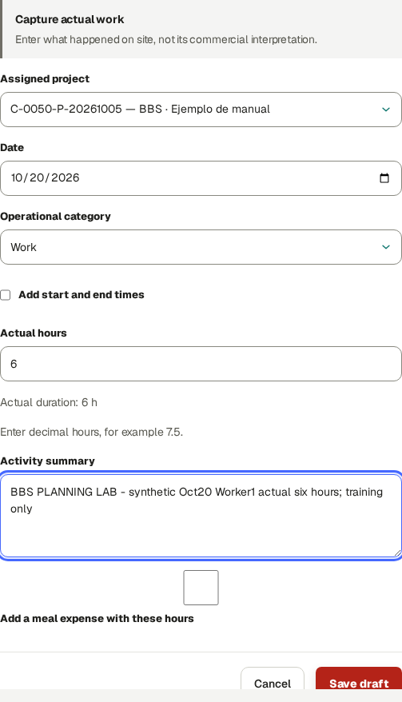

## Read Expected, Difference and Needs note correctly

Go here: Time → Week of → Open week

Context: Isolated BBS planning lab · synthetic October 20, 2026 work · genuine role sessions · no production hours

The Owner configures the project’s effective working schedule in minutes for each weekday. In this training scope, the schedule is effective October 19 with 480 minutes on Monday–Friday and zero on Saturday/Sunday. Eight expected hours are a planning target; they do not create hours, compensation settlements or invoice lines.

Expected is determined from dated project membership and its effective schedule, rather than by adding published plans. A three-hour published plan can therefore coexist with an eight-hour daily Expected figure. Where the application cannot determine an unambiguous target, it displays a dash instead of inventing one.

Difference means actual minus expected for that day. After operational approval, Technician 1 shows 6.00h Actual, 8.00h Expected and −2.00h Difference; Technician 2 shows 7.00h, 8.00h and −1.00h. Both weekly rows say Needs note because approved actual work differs from the target. The underlying time sources remain Approved.

Needs note is an explanatory comparison status. This exercise found no dedicated Add note or Clear Needs note control and it did not block the PM from approving accurate time. A report explaining the difference does not automatically remove this comparison label.

The final additional training checkpoint is later than the earlier weekly screenshots. The Owner gave Technician 1 another project membership covering October 23 only. Two own project assignments now cover that Friday, so Expected and Difference are —. This means an unambiguous target is unavailable; it does not mean a zero-hour schedule, missing actual source or missing saved BBS plan. The earlier tables correctly show Friday eight expected hours and a forty-hour week before this extra membership.

### Do the task

1. Open Time, select the week containing the work date, and click Open week.
2. Read the daily row, not just the weekly total. A partly completed week can show a large negative weekly Difference because future or unworked scheduled days have zero actual hours.
3. Check the source record’s own approval state separately from the weekly comparison status.
4. On a phone, use the daily card with its labelled Actual, Expected, Difference and Status fields. Open day entries opens the matching actual sources.

### Verify the result

- Technician 1: 6 − 8 = −2 hours. Technician 2: 7 − 8 = −1 hour. Chief: 8 − 8 = zero hours, with an Approved weekly status.
- Approval records operational truth; it does not redefine the working schedule or turn a planning target into a contractual pay or customer charge rule.
- In the later browser test, Friday October 23 showed Actual 0.00h, Expected — and Difference —; October 20 remained six actual versus eight expected hours, −2.00h and Needs note. No second-project actual hours were created. The current project selector still showed only the permitted BBS project.

### If you get stuck

- If Expected is a dash, ask the Owner to check dated project membership and effective schedule coverage. Before the October 1 membership in this example, September 28–30 have no Expected figure.
- If multiple project assignments make the target ambiguous, ask the Owner to investigate the allocation. Do not pick a target by adding plans or duplicating time.

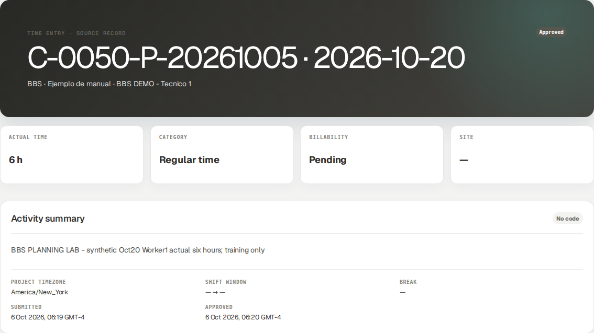

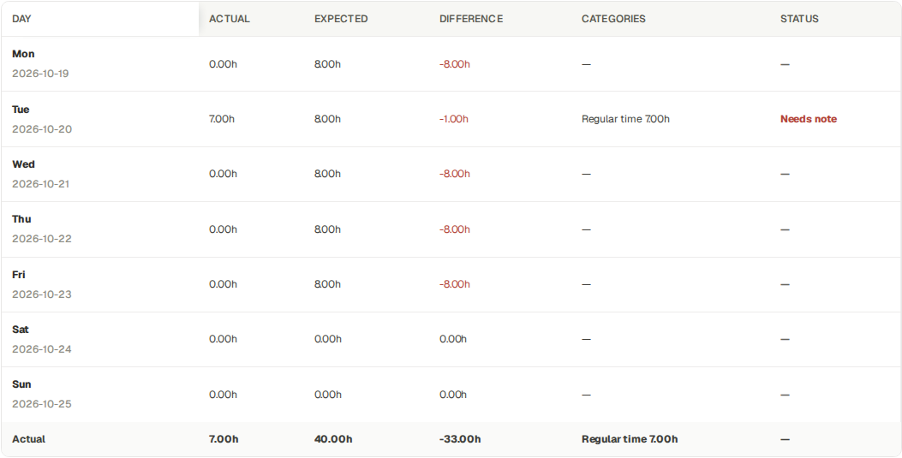

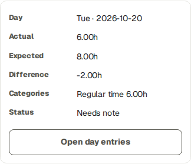

## Handle a missing plan and understand what a work goal means

Go here: Today → Your assigned projects; Time; Reports

Context: Isolated BBS planning lab · synthetic October 20, 2026 work · genuine role sessions · no production hours

A project assignment and a published plan are separate. The Today screen can say No published assignment for today while Your assigned projects contains the project. The page explicitly allows actual work to be recorded for authorized projects; absence of a planning card is not evidence that project access was removed.

There is no worker task-goal lifecycle with Accept, Reject or Mark completed buttons on these cards. The work target is planning context. Record progress and outcomes in Activity summary and Daily/Technical reports, then submit through the normal review workflow. Project milestones are separate project checkpoints.

Crew delegation adds dated permission for a Chief to record selected colleagues’ actual work. It does not publish plans, create a team-wide agenda, expose colleagues’ compensation or grant operational approval authority.

### Do the task

1. If no plan is shown, inspect Your assigned projects and confirm the work date. Ask the Owner/PM whether they intended to publish a plan for that date.
2. If a permitted project is missing from Log time, ask the Owner to check account status, assignment dates and project availability before entering work elsewhere.
3. If the card’s dates, site or hours are incorrect, ask the plan manager to Save assignment changes. Continue to record accurate actual work within valid authorization.
4. Use your Daily report for completed tasks, remaining work, issues and handover; use a Technical report for specific technical findings or changes.

### Verify the result

- No assignment-card acceptance or completion click is required or available. Saving/submitting actual records and reports provides the operational handoff.
- Desktop, tablet and phone native screens were checked. The phone work card and weekly daily card retain their labels without horizontal page overflow.

### If you get stuck

- An expired project assignment or crew delegation is different from a missing plan. Ask the Owner to review the appropriate dated access record; a plan alone does not grant permission.
- Escalate with the project, work date and record state. Keep credentials, client prices, costs and other workers’ pay out of reports and screenshots.

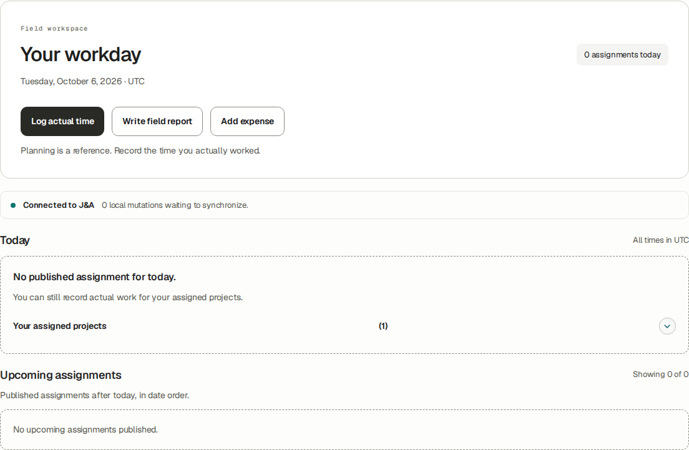

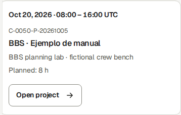

## Use phone and tablet views

Go here: Time; Expenses; Reports; More

Context: Isolated BBS role lab · genuine Worker account · fictional October 2026 records

Use a narrow screen’s navigation rather than searching for the full desktop sidebar. The form may occupy a sheet; close it to return to the register. Wide tables can have an intentional internal horizontal scroll hint; the page itself should fit the viewport.

### Do the task

1. Open Time on your phone and filter the intended project/date. Use More for My Pay, Profile, Notifications or Help.
2. Enter a short draft only when the environment and person are confirmed. Inspect the saved result before leaving the form.

### Verify the result

- Worker Time was checked at 1440, 768 and 390 pixels: no page-level horizontal overflow.

### If you get stuck

- If a control or row is clipped, report the page, screen width, exact action and screenshot without credentials. Do not compensate by saving the same record twice.

## Maintain expertise, availability and account security

Go here: Profile → Expertise and availability; Account security

Context: Reference procedure · current controls/source checked; mutations not exercised in this role lab

Your workforce profile is separate from account role, project assignment and compensation. The Worker 2 profile was inspected natively; security and availability mutations were not performed in this role exercise.

Add expertise offers the expertise choice and proficiency. Add availability opens a dated UTC availability window; availability is a planning signal, not published assignment or actual work. Passkeys use Device name and Register passkey. Authenticator setup can return a setup URI and one-time recovery codes; keep them private.

### Do the task

1. Inspect your expertise and availability calendar. Use the offered own-profile add/edit controls for genuine skill or availability information.
2. For an authorized security change use your own account’s passkey/MFA controls, follow device/authenticator prompts and verify completion before signing out.
3. Store recovery material in an approved password manager. Never paste credentials or recovery codes into a report or support screenshot.

### Verify the result

- Expertise/availability changes do not grant review authority or create hours. No MFA/passkey success is claimed from this read-only inspection.

### If you get stuck

- Ask the Owner/support about unavailable expertise, incorrect timezone, access recovery or a lost device. Do not use another person’s account as a recovery shortcut.

## Use notifications and escalate the right record

Go here: Notifications; Help

Context: Reference procedure · current controls/source checked; mutations not exercised in this role lab

Opening a notification or marking it read is not operational approval, Finance review, payment or customer acceptance. Follow the underlying record and verify its current state.

Help provides role guides and Contact support. The verified support address is admin@j-aautomation.com. A live portal/webmail link is a live company service, not a training switch. No support email was sent in this exercise.

### Do the task

1. Open the notification and follow its record link. Check current state; old notifications can refer to a state that has since changed.
2. For help include role, environment identity, project/record ID, date, intended action and exact error; include a safe screenshot if useful.
3. Send operational corrections to the PM/reviewer, settlement/reimbursement questions to Finance and access/assignment issues to the Owner.

### Verify the result

- Authenticated Worker GETs returned 403 for Finance, Billing and another worker’s time; own receipt returned 200. An archived Finance-only document returned 404, which alone does not prove the active-document access rule.

### If you get stuck

- Never include session cookies, passwords, recovery codes or another worker’s private pay. Permission denial is a handoff signal, not a reason to switch credentials.

## Finish a workday and verify the handoff

Go here: Today → Time → Expenses → Reports → My Pay

Context: Isolated BBS role lab · genuine Worker account · fictional October 2026 records

Use this task checklist on your own project. A saved draft is not a completed workday, and a submitted source still needs the appropriate review.

The October 6 readiness audit adds explicit native-browser outcomes and state-specific limits. Per-ID status and source IDs are recorded under docs/evidence/bbs-readiness-20261006/worker-chief. Earlier planning/role-lab screenshots retain their original historical scope; they are not the state of the new readiness sources.

### Do the task

1. Confirm account/environment/project/date; inspect plans without treating them as actual work.
2. Record actual hours once; inspect and submit the intended drafts.
3. Record each purchase once, preserve payer/currency and attach its real authorized receipt.
4. Save and submit the required Daily and Technical reports with genuine factual evidence.
5. Read returned reasons; create linked corrections where permitted, or hand settlement locks to Finance.
6. Check approved/pending sources and own My Pay; follow reimbursement/settlement questions separately from client billing.

### Verify the result

- Lab passes: native time/expense/report saving and submission, successful linked correction and PM approval, expected finalized-settlement guard, own receipt access, denied unrelated financial access and responsive views.
- Readiness native results: own ordinary and current linked time correction Submitted together, count 2→0; receipt-backed weekly expenses and returned expense recovery, own Daily/Technical Ready PDF downloads before submission, and own statement PDF/CSV downloads. See the readiness per-ID audit for exact current states.

### If you get stuck

- Reference-only: account onboarding/security recovery, layout copying, customer acceptance, own expertise/availability/security changes, and real bank/email delivery. A required missing receipt weekly guard was source checked; the native weekly form creates receipt-optional drafts, so this lab does not claim a missing-required-receipt runtime test.

## What was verified and what remains a reference

Go here: Verification appendix

Context: Isolated BBS role lab · actual browser outcomes and explicit limits

Native authenticated browser records, synthetic receipt fixtures and SHA-256 capture manifests are maintained with the guide. Account secrets are excluded. Original billed October 2–5 history and finalized worker settlements were preserved.

Actual saved/submitted/returned/approved states are distinguished from controls merely inspected. The Owner/PM/Finance handoffs used their own genuine role sessions. This evidence does not claim real bank transfers, live equipment changes or production transactions.

Historical runner exception: the first October 15 statement attempt failed because the isolated operator handler was unavailable. That failed job remains in history. A fresh October 15–16 request subsequently produced the verified Ready PDF and CSV; this setup failure is not the ordinary statement procedure.

The October 6 readiness audit adds explicit native-browser outcomes and state-specific limits. Per-ID status and source IDs are recorded under docs/evidence/bbs-readiness-20261006/worker-chief. Earlier planning/role-lab screenshots retain their original historical scope; they are not the state of the new readiness sources.

### Do the task

1. Own time saved and submitted; the PM returned it, and the finalized-settlement correction was refused without creating a replacement.
2. Worker 2 own three-hour source corrected through a linked 2.5-hour replacement, submitted and PM approved; original history retained.
3. Own synthetic USD 12 expense saved with receipt, submitted, PM approved and Finance classified/reviewed.
4. Own Daily and Technical reports saved, submitted and PM approved.
5. October 15 current approved activity 195 minutes=3.25 hours; old 3-hour and 1-hour sources excluded from current totals.
6. A published October 16 two-hour plan appeared under Upcoming assignments without creating actual time.
7. Own October 15–16 PDF and CSV statements Ready, native downloads 200, exact stored hash and length match.
8. Another Worker’s statement downloads returned 404; Finance/Billing/other-worker Time denied; own private receipt accessible.
9. Desktop 1440, tablet 768 and phone 390 Time pages fit their viewports.
10. Additional connected planning lab: Owner published October 20 eight-hour plans to all three original workers; each saw their own card with zero actual time before native entry. Technician 1 saved/submitted six hours, the Chief saved/submitted seven for Technician 2 plus eight of its own; PM approved all three.
11. Additional weekly comparison: 6/8/−2 and 7/8/−1 displayed Needs note after approval; Chief 8/8/0 displayed Approved. Before membership coverage Expected was a dash. Native desktop/tablet/phone agenda and crew views fit 1440/768/390 viewports.

### Verify the result

- See the adjacent task checklist and role capture manifest for source IDs, screen widths, artifact integrity and expected permission denials.

### If you get stuck

- The historical labs above retain their own scope. This readiness audit additionally tested weekly ordinary/linked correction submission, weekly receipt attachment/submission and returned expense recovery, own report PDF generation/download and returned ordinary report editing, and own Ready statement downloads. Customer acceptance, live email/bank delivery and profile/security changes remain unperformed. Required missing receipt weekly rejection remains source checked.

## Recovery · sources, obligations and immutable history

Use the role’s worked correction lesson and the current record controls. A new purchase is different from a correction to an existing purchase. A payment reversal records a cash-entry correction; it does not amend a finalized compensation entitlement or unlock its time sources.

| State | Supported next action |
| --- | --- |
| Ordinary Draft | Use Edit/Save draft where present; attach the actual receipt/evidence before Submit. Inspect each saved draft after weekly table entry. |
| Submitted | Read current state and reviewer handoff. Do not create another source merely because review is pending. |
| Needs changes | Read the reason. Time uses Create corrected draft where available, then submit/review the linked replacement. A returned Daily/Technical report instead offers Edit and Save changes on the same report, then Submit for review; follow the exact role lesson. |
| Rejected | Inspect the reason and contact reviewer/Owner. The time detail does not offer the same linked-correction route as Needs changes; do not assume that route exists. |
| Approved, unlocked | Use the offered linked correction, preserving the original. Re-review the replacement and refresh affected unissued drafts/report versions through their supported controls. |
| Issued, financially locked or finalized compensation | Stop source editing. Send source ID/project/date, original/correct values, reason, affected invoice/settlement and payment references to Owner/Finance. If no authorized amendment control exists, escalate to platform support. |

### If you get stuck

- For a finalized-compensation guard, send the exact source/date/reason and requested factual correction to Finance/Owner. Wait for a documented authorized resolution and explicit instruction about the source lock. Do not reverse a payment, change work dates or duplicate hours to evade the guard.

## Security · verify your own device and recovery options

Go here: Profile → Account security; Profile → Add availability

### Do the task

1. Check Account security identifies YOUR account even when an authorized workforce profile inspection shows another worker above it. Enroll only your own device. MFA is optional in this release.
2. For a passkey, enter Device name and choose Register passkey on the approved secure portal. Complete your device’s creation confirmation. Verify Passkey registered for this account, the registered count and named device row. Cancelled/failed registration is not enrollment.
3. To retire your own lost/obsolete passkey, first confirm you retain another working sign-in method. Select Revoke on the exact device and verify Passkey revoked and removal of its row. If you cannot sign in, use the verified support route rather than another person’s session.
4. For an authenticator, choose Enable MFA. Keep the setup URI and one-time recovery codes private in the approved password manager. Add the URI to your authenticator, enter its current six-digit Authenticator code and choose Verify MFA. Verify Enabled and Disable MFA appear; enabling without verification is not completed enrollment.
5. At a later MFA sign-in use Six-digit code → Verify and continue. If the authenticator is unavailable, choose Use a recovery code and enter one unused stored code. If neither method is available, contact admin@j-aautomation.com for identity-verified recovery. Do not send recovery codes or the setup URI to support.
6. To remove optional MFA while signed in, choose Disable MFA and verify Not enabled/Enable MFA. Confirm the intended own account before doing so. A successful settings change is separate from recovering a lost account.
7. Where Add availability is offered, fill Starts, Ends, Availability and Note using the displayed time basis, then Save availability. Verify the saved interval/status/note in the list; use Edit availability on that row and save the changed values. Availability is not project membership, a published shift or actual hours.

## Verification · current coverage and historical evidence

English readiness edition: 6 October 2026, based on repository abc12c0961b2 with the recorded readiness fixes. The publication receipt identifies the final commit and deployment. This edition teaches the permitted ordinary cycle and supported handoffs; it does not certify every contract, device or external service.

The current evidence lives in docs/evidence/bbs-readiness-20261006. Its correction register maps all 72 suite findings to tasks, browser evidence or precise reference/support boundaries. Role manifests identify source IDs, state transitions and downloaded artifacts. Historical 5 October outputs remain historical; new screenshots do not rewrite their totals or private bytes.

Recipient activation, actual authenticator verification and own passkey registration/revocation were exercised on a separate isolated recipient. The same account controls are shared, but enrollment was not repeated for every role or physical device. Offline/expired-link and lost-device paths remain precise references where not separately executed.

Weekly submission was exercised with one ordinary draft and one eligible linked correction for Worker, Chief, External Technician and Supplier Coordinator: two selected drafts became two Submitted sources and zero remaining drafts. This does not guarantee that locked, withdrawn, out-of-scope or ineligible corrections will submit.

A final Accounting cut succeeded in a separate clean Finance portfolio; an Auditor read and downloaded its outputs. Original BBS issuer-history and source-reconciliation blockers remain documented. Email transport, real bank movement, accountant approval and genuine customer acceptance are outside the synthetic tests.

### Verify the result

- For a task described as reference, follow the exact named controls and prerequisites; do not infer that an illustrated outcome was executed. For support-only recovery, preserve the blocked source and obtain the documented receiving result before proceeding. Out-of-role financial information is intentionally excluded from operational guides.
