# Worker · BBS field operations

Own actual hours, expenses, reports, corrections, compensation and secure handoffs

## Before you practise · access and scope

This English guide uses BBS · Ejemplo de manual, project C-0050-P-20261005. The screenshots were taken using the stated role in an isolated database running the application. Training entries, payments, approvals and documents are fictional. They do not prove a real bank transfer, accountant approval or customer acceptance.

The company portal at https://j-aautomation.com/j-aautomation/app is LIVE. Training uses a separate URL and database. Before practising, obtain the isolated URL, your own role account and permitted exercises from the company administrator; verify the BBS project number. Without isolated access, treat these screenshots as read-only demonstrations and perform only authorized real work.

Use your own credentials. Do not borrow an Owner, Finance or colleague account. A platform role, project assignment, review permission, supplier authorization and dated crew delegation are separate requirements. Changing one does not automatically grant the others.

Select English in the workspace language control to follow the labels used here. Some saved BBS record names remain in their original language. On a phone open the navigation drawer to see full workspace names. Recheck the selected project and date range after every navigation.

The eight Worker test accounts in the private credentials document use the same Worker workflow. Crew chief is a dated delegation attached to a Worker account. Supplier Coordinator and External Technician are restricted profiles attached to Worker accounts. This guide never includes account passwords.

Each screenshot is an exercise checkpoint. Later fictional role entries and financial events are additional to the original October 1–5 workbook totals. Reopening the project or selecting the same dates does not restore that checkpoint. Read captions before comparing amounts or states.

### Verify the result

- Confirm your displayed account, role or supplier profile, the project number and the dates before saving.
- For training access, scope or reset help, contact the company administrator at admin@j-aautomation.com. Include the role, route, project number, time and visible error; omit passwords, cookies and private customer or worker documents.

### If you get stuck

- An empty project selector often means missing or expired assignment or authorization. Ask the Owner to check coverage for the date you are entering; do not create a duplicate project.
- A form shown in a screenshot can depend on role, source state or effective date. Use the documented role handoff when a control is absent.

## Start with your own account

Go here: Sign in → Today

Context: Isolated BBS role lab · genuine Worker account · fictional October 2026 records

Use the individual active Worker account provisioned by your Owner. Person, account, project assignment and approval permission are separate. An invitation or password does not itself assign a project. This course uses BBS DEMO - Tecnico 1 and Tecnico 2 in C-0050-P-20261005 · BBS · Ejemplo de manual.

Before practising, obtain an operator-provided training URL, your own training account, a visible deployment identifier, permitted scope and reset instructions. This guide does not supply a shared training login. Live company portal links open the live company service; they never enter the isolated demonstration. Do not enter simulated work, expenses or payments in the live portal.

Today is your landing page. Time records actual work; Expenses records purchases and evidence; Reports records daily and technical facts; My Pay shows your own compensation and reimbursements; Profile manages your workforce profile and security. Notifications and Help are in the navigation. Crew hours is useful only when the Owner has granted applicable delegation.

### Do the task

1. Sign in with your own account. Confirm the account, language and environment before entering data.
2. On Today inspect assigned projects and published plans. Open the BBS project or use Log actual time, Write field report or Add expense.
3. On a phone use More for additional destinations; close the navigation drawer before entering a form.

### Verify the result

- The active project and person agree with your intended work. No other person’s credentials are needed.

### If you get stuck

- Ask the Owner to activate the account or correct project assignment if your project is missing. Do not create duplicate people or share accounts.

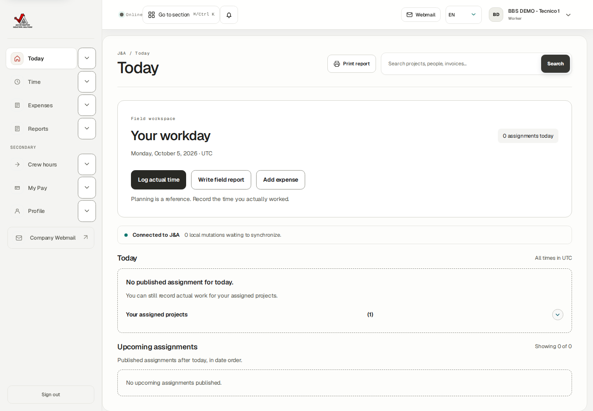

## Read a plan without creating actual hours

Go here: Today → Upcoming assignments

Context: Isolated BBS role lab · genuine Worker account · fictional October 2026 records

Planning is a reference. The PM published a fictional October 16 assignment from 08:00 to 10:00 UTC with two planned hours. The Worker sees it under Upcoming assignments. Publishing this plan did not create a timesheet, compensation settlement or customer invoice.

Check the timezone displayed by the page and the work date on the source. The isolated runtime Today date is October 5 UTC; later dated role exercises are explicit training examples.

### Do the task

1. Read project, start/end and Planned hours. Open project for the assigned project context.
2. After the work, use Time and record the actual duration and activity independently.

### Verify the result

- A two-hour plan can coexist with zero actual hours for that date. Actual time appears only after it is saved.

### If you get stuck

- Ask the PM/Owner to correct an incorrect or missing published plan. Record genuine authorized actual work rather than copying a plan into fictitious hours.

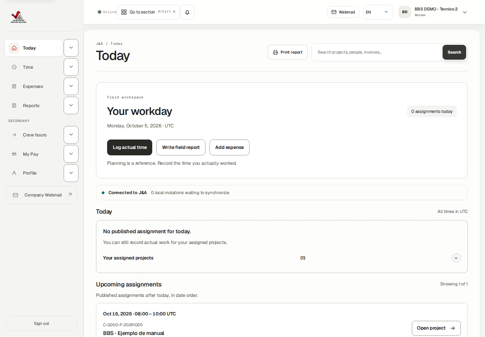

## Save and inspect actual time

Go here: Time → Log time

Context: Isolated BBS role lab · genuine Worker account · fictional October 2026 records

The first exercise saved four actual hours on October 6 for Worker 1. The fictional activity states that no live equipment was changed. Decimal hours represent duration: 3.5 means three hours thirty minutes, not three hours five minutes.

Category describes operational activity. Selecting Overtime does not by itself promise a premium; approved compensation rules determine money. Add start/end times is optional; do not invent clock times from duration. Add meal expense with these hours is a separate expense input.

### Do the task

1. Open Log time. Select Project and Date; choose the operational category and enter Actual hours and Activity summary. Fill offered site/detail fields with facts.
2. Use Save draft. Open the saved row and check person, date, project, category and actual duration before submitting.
3. Use individual Submit on the time detail. Confirm Submitted; saving a draft alone does not send it for review.

### Verify the result

- Native saved row and detail showed 4 h, first Draft then Submitted. The source has its own record ID.

### If you get stuck

- Edit an unsent draft through its permitted draft controls. If uncertain whether Save succeeded, reload the date-filtered register and open the existing row before trying again.

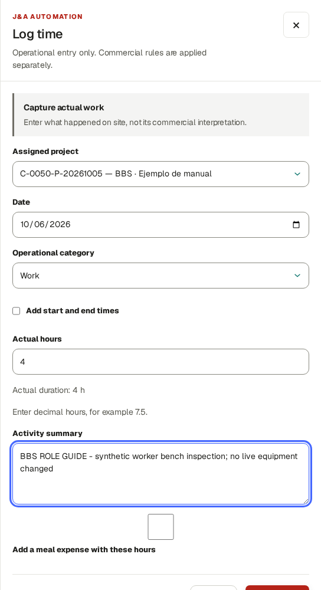

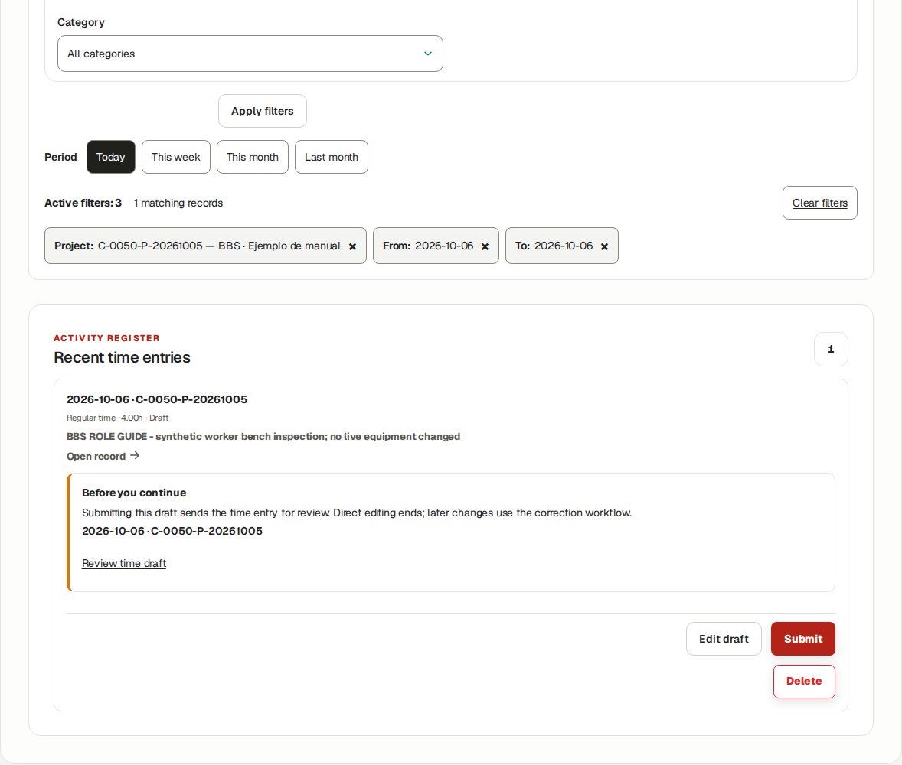

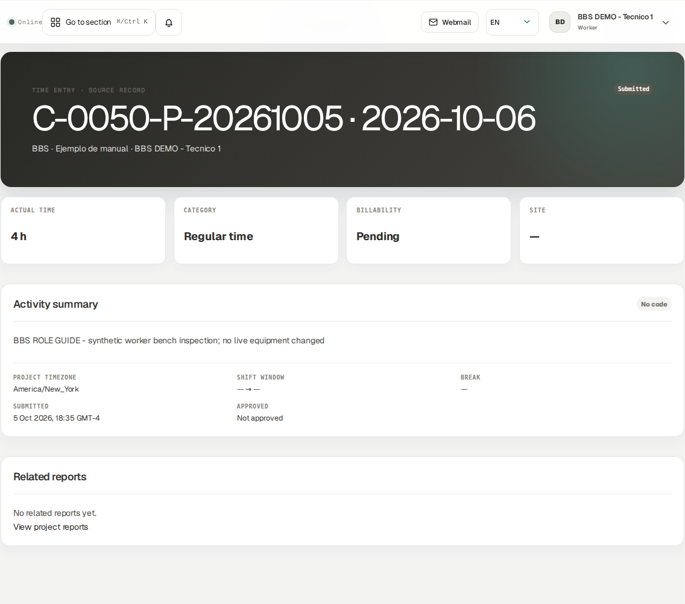

## Enter a week and submit eligible drafts

Go here: Time → Enter a week in a table; Submit this week

Context: Reference procedure · current controls/source checked; mutations not exercised in this role lab

The weekly table is a faster entry tool for your own actual daily work. Blank days are skipped. Planned hours remain separate. Review existing rows first so a second table save does not duplicate a day already entered.

Copy previous week layout copies layout with zero hours. It does not assert that last week’s work happened again. Select the destination Week of, choose Copy previous week layout, inspect displayed Previous week and This week, then Add this week’s layout. There are no editable Source/Destination date fields in that flow.

Submit all week drafts handles eligible drafts for your own selected week. A linked correction may appear in the draft count; do not assume weekly submission universally excludes corrections. This lab used individual Submit for the correction so its original link could be inspected. Chief’s own ordinary weekly submission was separately exercised.

### Do the task

1. Open Enter a week in a table; set Week of and Project, then enter actual hours and activities on worked days. Use Save daily drafts.
2. Open Submit this week. Select the week, read the draft count and inspect each relevant draft before Submit all week drafts.
3. Refresh the register and inspect resulting states. For a correction, individual detail Submit makes the original/replacement link easy to verify.

### Verify the result

- Draft is distinct from Submitted. A zero-hour copied layout is incomplete until actual work is entered.

### If you get stuck

- A blocked or changed draft must be reviewed through its exact record. Do not repeatedly resubmit the whole week to force a guarded source.

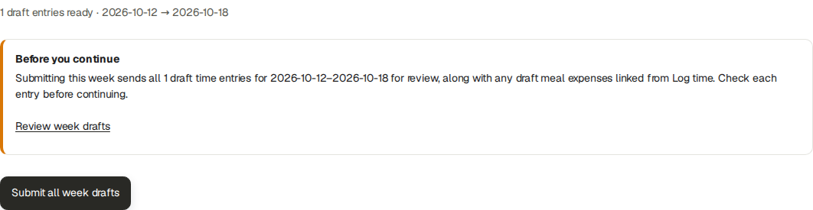

## Correct returned time and retain history

Go here: Time → returned source → Create corrected draft

Context: Isolated BBS role lab · genuine Worker account · fictional October 2026 records

Worker 2 recorded three hours on October 15, outside their finalized October 1–14 settlement. The genuine PM returned it for a correction to 2.5 hours. A correction creates a linked replacement and preserves the original record.

After a corrected draft is created, inspect all values and the original link before submission; the detail does not offer an unrestricted edit of that correction. An unsubmitted correction may offer Withdraw correction draft with a required reason; withdrawal was observed as a control but not exercised here.

### Do the task

1. Open the Needs changes source and read the reviewer’s reason. Use Create corrected draft.
2. Set Actual hours to 2.5, review date/category/activity and enter a concrete Correction reason. Create the draft.
3. Open the linked Draft and use individual Submit. The permitted reviewer then operationally approves it.
4. Filter October 15 and inspect the current register. Do not add the old and replacement durations together.

### Verify the result

- The original 3 h remains Needs changes; the linked 2.5 h is Approved. Together with the separately corrected delegated travel entry of 0.75 h, current approved activity is 195 minutes = 3.25 h.

### If you get stuck

- If the reason or values are wrong, contact the reviewer before creating another version. No duplicate unlinked row should be used as a correction.

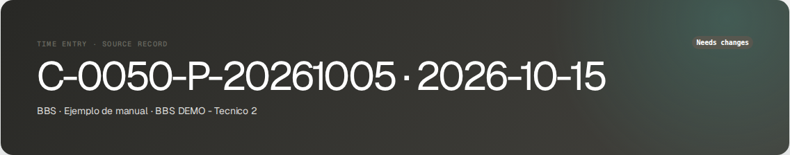

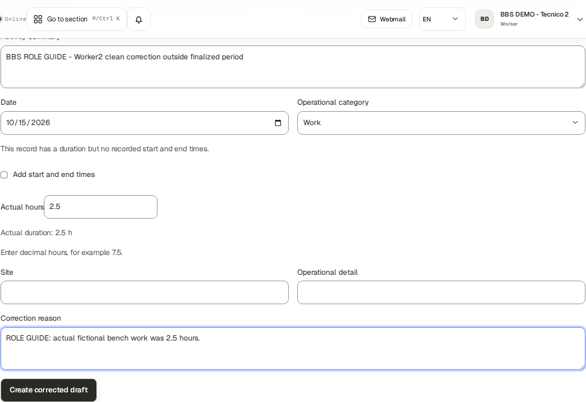

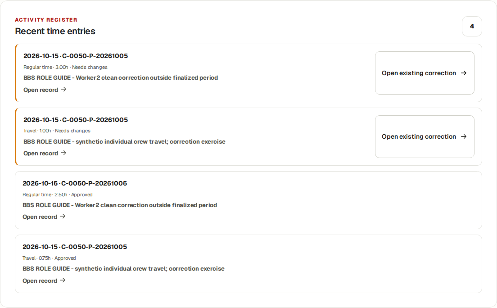

## Hand settled compensation changes to Finance

Go here: Time → returned source → Create corrected draft

Context: Isolated BBS role lab · genuine Worker account · fictional October 2026 records

The Worker 1 October 6 source was fresh and unbilled, yet its worker compensation period was already covered by a finalized October 1–31 settlement. Attempting the returned 4 h → 3.5 h correction was refused.

The exact message was: “This time has settled or paid worker compensation. Contact Finance for an explicit adjustment before any new correction.” A fresh work date or absence of an invoice does not override a finalized worker-side settlement.

### Do the task

1. Read the guard and keep the existing returned source intact.
2. Send Finance/Owner the source ID, worker, project, date, current/desired hours and correction reason. Wait for their supported explicit adjustment process.

### Verify the result

- No replacement draft was created by the refused operation. The finalized USD 720 settlement was not changed.

### If you get stuck

- Do not add an unlinked replacement, shift the work date, change the worker or ask someone to erase settlement history to bypass the guard.

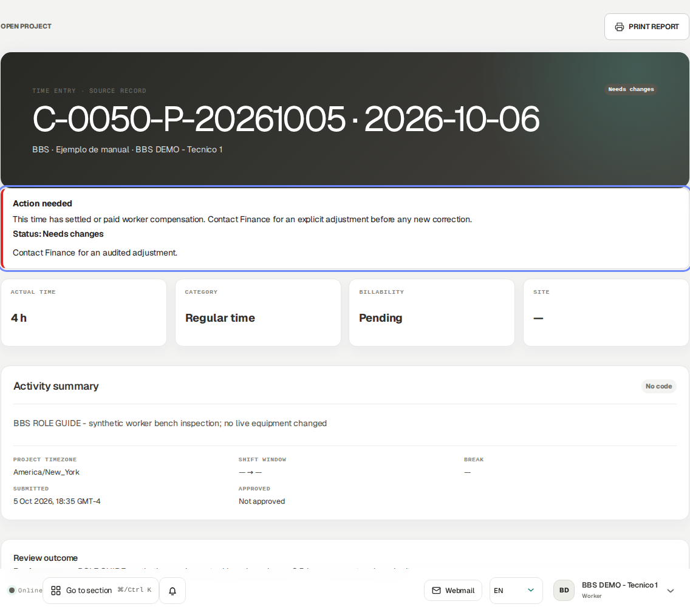

## Record one expense with private receipt evidence

Go here: Expenses → Record expense

Context: Isolated BBS role lab · genuine Worker account · fictional October 2026 records

The worked expense is an explicitly synthetic USD 12 tools/consumables purchase on October 6, paid by Worker 1. Its image says training only and no real purchase. A receipt upload is private evidence, not proof that Finance has approved reimbursement or that a bank transfer happened.

The native form accepts JPG, PNG, HEIC or PDF receipts up to 10 MB. Operational purchase amount, who paid, worker reimbursement and customer recovery are separate. Preserve the actual receipt currency and payer.

### Do the task

1. Choose Record expense. Attach Receipt image or PDF, select Project, Date and Category, and fill Amount, Currency, Who paid and Description. Vendor/payment method and local time/related hours are offered contextual fields.
2. Use Save draft. Open the saved expense and inspect the registered private receipt and all purchase values.
3. Use Submit on the detail. The genuine PM operationally approved the expense; Finance then saved Reimburse at cost / Bill at cost and recorded Finance review.

### Verify the result

- Exactly one expense exists for USD 12, Worker payer, with its registered receipt. Own receipt download returned HTTP 200. Financial eligibility does not itself record reimbursement.

### If you get stuck

- If receipt processing or permission prevents access, use the precise document status/message and ask support. Uploading/registered does not universally mean antivirus-clean. Do not duplicate a purchase while checking a failed submission.

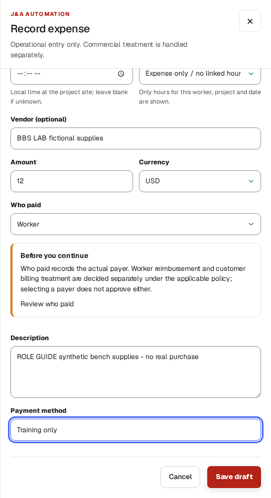

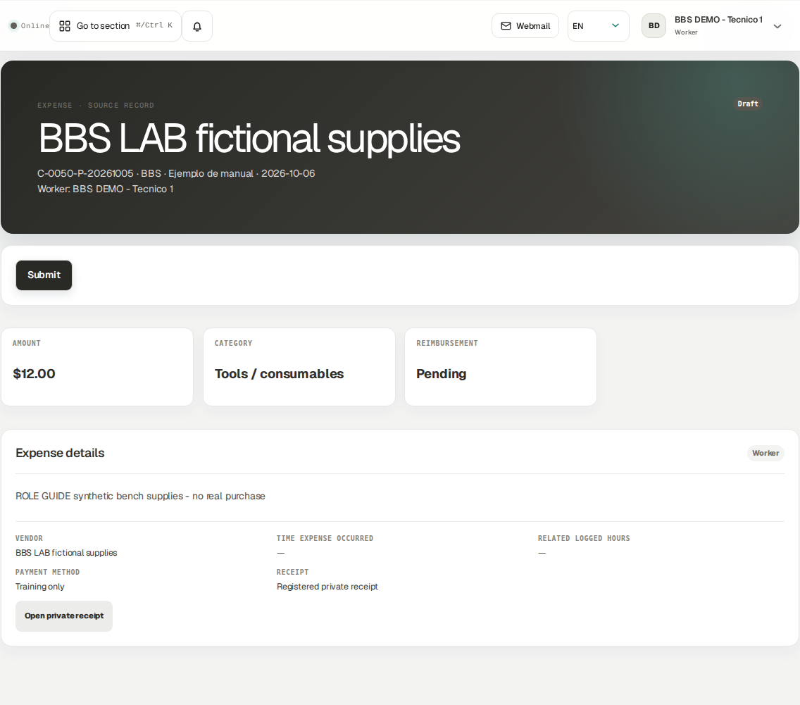

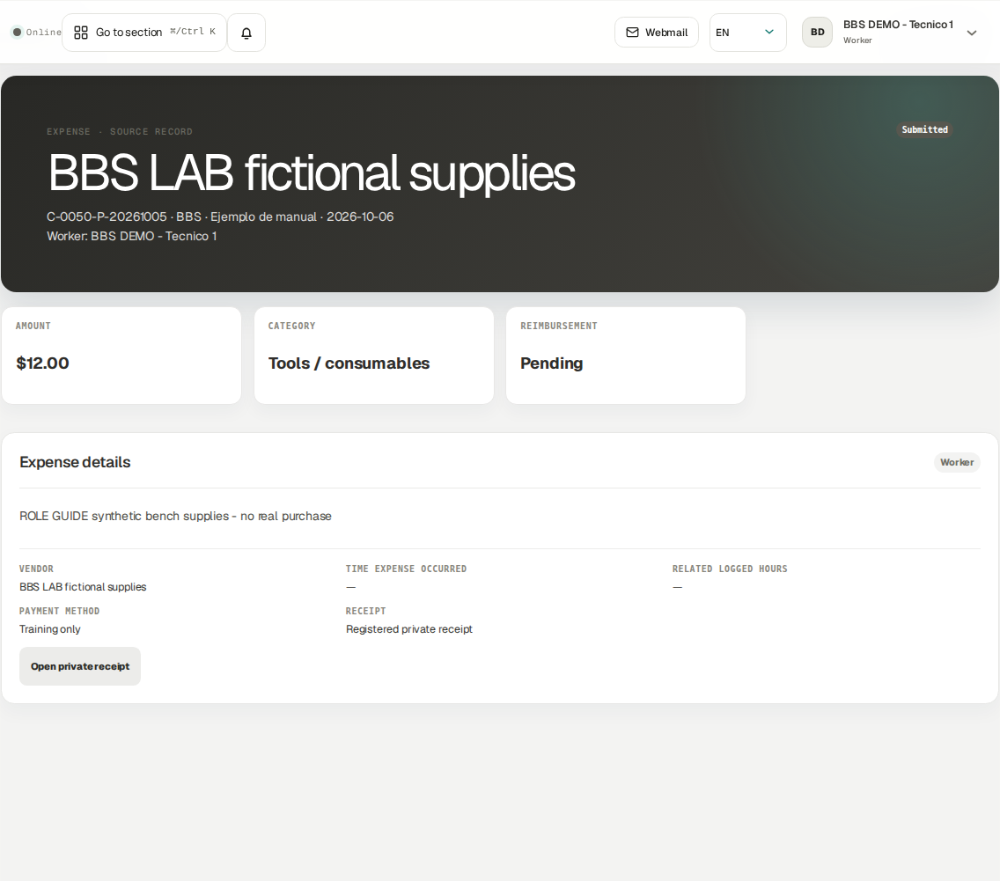

## Use expense batch tools and corrections carefully

Go here: Expenses → Enter a week in a table; Submit this week

Context: Reference procedure · current controls/source checked; mutations not exercised in this role lab

The weekly expense table records actual purchases, not planned budgets. Save daily drafts creates the offered day/project/person rows; attach each required receipt through the saved draft’s permitted edit flow. A worker-paid cost may be non-reimbursable or non-billable under its dated policy.

Expense weekly submission checks the selected own draft set. A changed row or missing required evidence can block the set; resolve the named record rather than creating replacements. A returned or financially linked expense follows its permitted state-specific correction process.

### Do the task

1. Inspect existing expense rows and period before using the weekly table. Enter actual category, amount, currency, payer and description, then Save daily drafts.
2. Open each draft and attach/verify its receipt before submission.
3. Read the draft count under Submit this week and inspect results after submitting. For an already submitted/reviewed expense, open its detail and use only controls actually offered for that state.

### Verify the result

- Purchase totals agree with the receipts. A worker cannot make an expense reimbursable simply by selecting Worker as payer.

### If you get stuck

- Hand reviewed, paid or billed expense corrections to the applicable reviewer/Finance with original evidence. Never change a real purchase currency to avoid a missing conversion rule.

## Save and submit a daily field report

Go here: Reports → New daily report

Context: Isolated BBS role lab · genuine Worker account · fictional October 2026 records

A daily report tells the operational story. It does not create actual hours, technical approval, customer acceptance or an invoice. The Worker exercise describes a fictional bench inspection and has its own report ID.

The actual form begins with Project, Work date, Site / shift, Shift summary and Tasks completed. It also offers Problems found, Corrective actions, Downtime minutes, Standby reason, Open items, Next day plan and a safety flag. Report actual conditions, including genuine risks; this training bench had no live production change.

### Do the task

1. Choose New daily report. Complete Project, Work date and the factual summary/tasks; fill applicable problems/actions/downtime/next-step fields.
2. Use Save daily report. Open the Draft report and inspect its header and content. Saving/autosaving content does not submit it.
3. Use Submit for review. Confirm Submitted. The genuine PM approved this source in the role lab.

### Verify the result

- Saved report progressed Draft → Submitted → Approved without adding hours. Submitted attachments/content are read-only in this account.

### If you get stuck

- Correct an unsent draft using its available edit controls. For submitted/returned/approved reports, use the offered correction flow or hand the specific record to the reviewer; do not overwrite approved history.

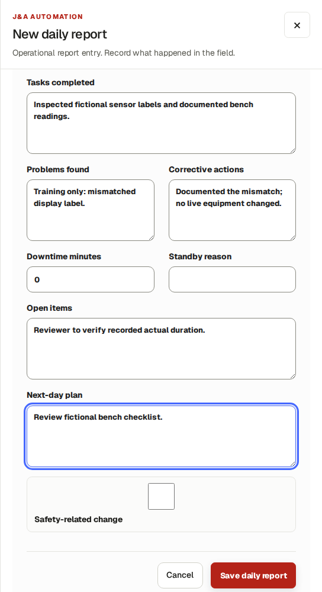

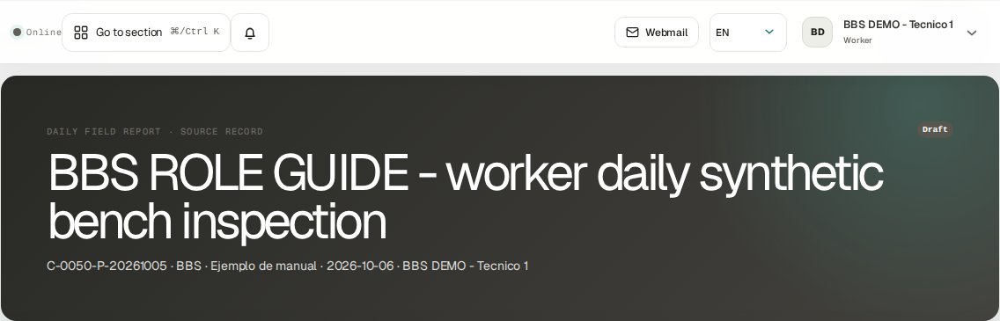

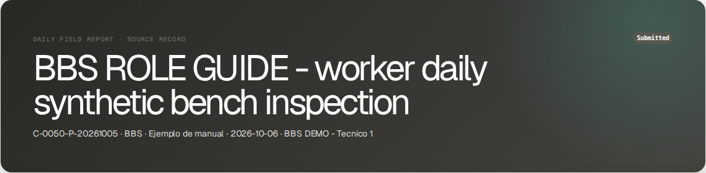

## Describe a technical change without treating it as permission

Go here: Reports → New technical report

Context: Isolated BBS role lab · genuine Worker account · fictional October 2026 records

Technical reports identify a system and document Problem / symptom, Diagnosis / root cause, Change performed, validation, remaining risk and rollback. Submitting a report does not authorize a live PLC change or substitute for your employer’s safety/change-control procedure.

The exercised report is explicitly a fictional bench. Offered fields include System / machine, Plant / site, Area / line, Station / machine, System type, PLC platform, Controller, HMI / SCADA, Network / protocol, Software version and Program / project reference. The actual save label is Save PLC report.

### Do the task

1. Choose New technical report. Identify the equipment and write the problem, diagnosis and change in readable factual language.
2. Fill Production impact, Validation performed/result, Open risk / issue, Rollback plan and safety impact where applicable. Use Save PLC report.
3. Open the Draft and inspect the details; use Submit for review, then verify the reviewer’s resulting state.

### Verify the result

- The Worker report reached Submitted and was operationally approved by the genuine PM. No real PLC or live equipment was modified.

### If you get stuck

- A missing validation or safety decision needs a real responsible-person handoff. Do not invent a successful validation to make the report look complete.

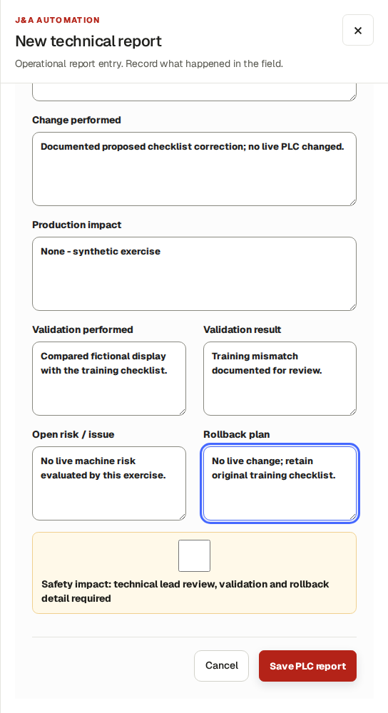

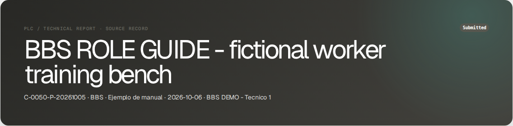

## Understand report PDFs, attachments and customer acceptance

Go here: Reports → your report detail

Context: Reference procedure · current controls/source checked; mutations not exercised in this role lab

Permitted private attachments are evidence associated with a report. The offered upload types include PDF, ZIP, common images and UTF-8 text, with the displayed 50 MB limit. Use the actual type/note fields and current draft controls; do not upload unrelated personal or financial records.

A customer period PDF is a separate versioned report assembled by an authorized role. Customer acceptance binds genuine signer/evidence to the prepared version. Your own Daily or Technical approval does not itself establish customer sign-off. If underlying content changes, an authorized refresh creates a later version; it must not silently rewrite a signed snapshot.

### Do the task

1. Before submitting a report, attach the required authorized evidence through its attachment controls and verify the registered status.
2. Where Download is offered, wait for the artifact’s ready state and open the native file. Hand missing/failed artifacts to the named responsible role.
3. Give the PM/Owner the report ID when its contents must be included in a period report or customer acceptance workflow.

### Verify the result

- Content, audience and report version are known. A downloaded report is not a recorded customer signature.

### If you get stuck

- Do not attach fabricated signed evidence, share private attachment links, or assume a saved draft has been delivered. Attachment/PDF/signature actions were not performed for these role reports.

## Read your own compensation and reimbursement

Go here: My Pay → From / Through → Apply period

Context: Isolated BBS role lab · genuine Worker account · fictional October 2026 records

My Pay displays your own activity and governed compensation estimates, reviewed settlements, expected dates, actual recorded payments and reimbursement information. Customer invoice frequency and worker payment frequency are independent. Owner/Finance choose settlement periods and expected payment dates; there is no automatic worker payroll cadence demonstrated here.

Worker 1’s historical monthly settlement is USD 720, scheduled November 3, actual paid zero. Daily compensation can differ from actual hours and customer billing units. Worker 2’s October 15–16 approved 195 minutes shows a USD 900 Fixed Per Billing Period estimate; it is not an hourly prorated amount or proof that USD 900 was paid.

Exact activity is 2.5 h + 0.75 h = 3.25 h. My Pay summary rounds to one decimal (3.3 h and 0.8 h travel); rounding is not extra work. “No reviewed payments outstanding” can coexist with an estimate that has not yet become a reviewed settlement. A recorded payment is a business entry, not independent proof of a bank transfer.

### Do the task

1. Select From and Through, then Apply period. Read approved and pending amounts separately by currency.
2. Open the compensation statement/activity detail and compare exact time records. Read reviewed settlement period, scheduled date, paid and remaining balances independently.
3. Check reimbursement obligations separately from compensation and customer charges.

### Verify the result

- You see your own pay, not another worker’s or customer invoice economics. Selected source dates may differ from a settlement’s wider period.

### If you get stuck

- Ask Finance about missing rules, period coverage, reimbursement classification, payment references or discrepancies. Do not infer worker pay from a customer invoice or a planned date.

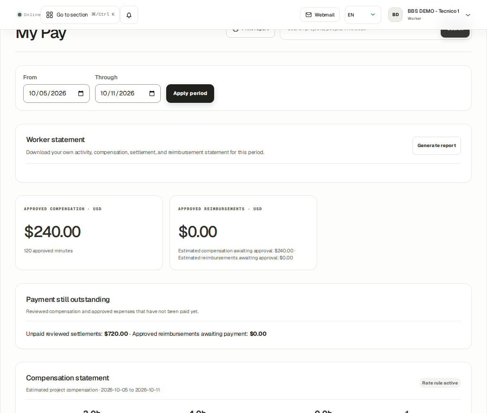

## Generate your own statement and check readiness

Go here: My Pay → Worker statement

Context: Isolated BBS role lab · genuine Worker account · fictional October 2026 records

Generate report queues an own-worker PDF and CSV for the selected period. It does not expose Finance’s project workbook. Queued, Ready and failed/preparation states must be checked before downloading.

The first October 15 attempt encountered an isolated operator-runner configuration error: its handler was unavailable. Its failed job history was preserved. A fresh October 15–16 native request was processed by the ordinary Worker Statement handler. Both PDF and CSV became Ready and were downloaded through the own Worker account; the receipt records their canonical hash checks.

### Do the task

1. Apply the intended From / Through dates and choose Generate report.
2. If queued, use Check statement status after processing. Use the offered PDF/CSV downloads only when Ready.
3. Check your identity, period, activity and currency in the downloaded output.

### Verify the result

- PDF and CSV Ready were observed in the native UI. Both own downloads succeeded. The artifact contains 195 approved minutes, two linked current sources, the selected October 15–16 period and the Worker 2 identity. The statement is scoped to the own account.

### If you get stuck

- For a failed or indefinitely queued statement, ask the Owner/support to inspect the artifact job using the period and exact status. Do not repeatedly submit the same request or claim that Queued means a delivered file.

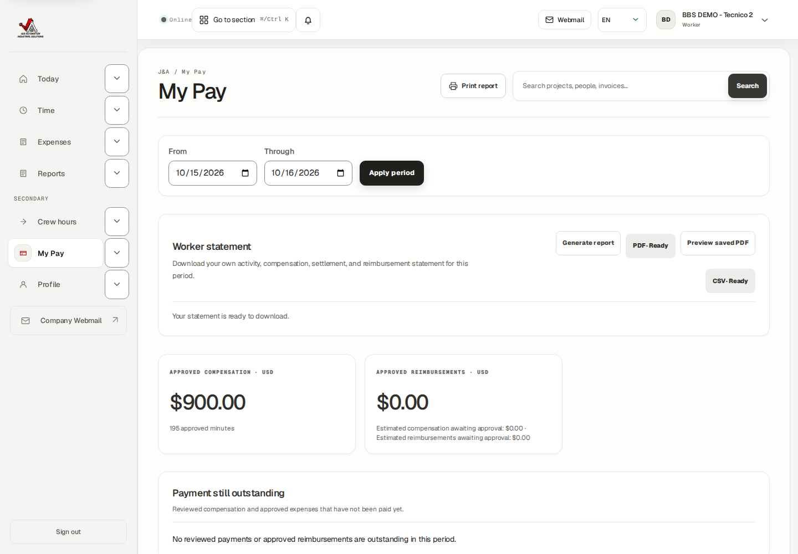

## Use phone and tablet views

Go here: Time; Expenses; Reports; More

Context: Isolated BBS role lab · genuine Worker account · fictional October 2026 records

Use a narrow screen’s navigation rather than searching for the full desktop sidebar. The form may occupy a sheet; close it to return to the register. Wide tables can have an intentional internal horizontal scroll hint; the page itself should fit the viewport.

### Do the task

1. Open Time on your phone and filter the intended project/date. Use More for My Pay, Profile, Notifications or Help.
2. Enter a short draft only when the environment and person are confirmed. Inspect the saved result before leaving the form.

### Verify the result

- Worker Time was checked at 1440, 768 and 390 pixels: no page-level horizontal overflow.

### If you get stuck

- If a control or row is clipped, report the page, screen width, exact action and screenshot without credentials. Do not compensate by saving the same record twice.

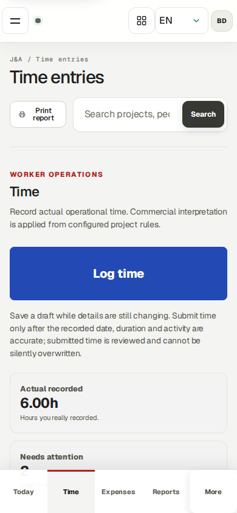

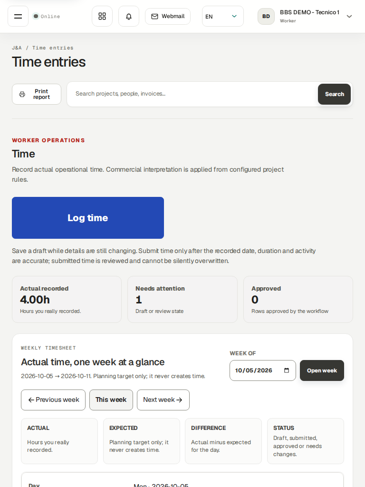

## Maintain expertise, availability and account security

Go here: Profile → Expertise and availability; Account security

Context: Reference procedure · current controls/source checked; mutations not exercised in this role lab

Your workforce profile is separate from account role, project assignment and compensation. The Worker 2 profile was inspected natively; security and availability mutations were not performed in this role exercise.

Add expertise offers the expertise choice and proficiency. Add availability opens a dated UTC availability window; availability is a planning signal, not published assignment or actual work. Passkeys use Device name and Register passkey. Authenticator setup can return a setup URI and one-time recovery codes; keep them private.

### Do the task

1. Inspect your expertise and availability calendar. Use the offered own-profile add/edit controls for genuine skill or availability information.
2. For an authorized security change use your own account’s passkey/MFA controls, follow device/authenticator prompts and verify completion before signing out.
3. Store recovery material in an approved password manager. Never paste credentials or recovery codes into a report or support screenshot.

### Verify the result

- Expertise/availability changes do not grant review authority or create hours. No MFA/passkey success is claimed from this read-only inspection.

### If you get stuck

- Ask the Owner/support about unavailable expertise, incorrect timezone, access recovery or a lost device. Do not use another person’s account as a recovery shortcut.

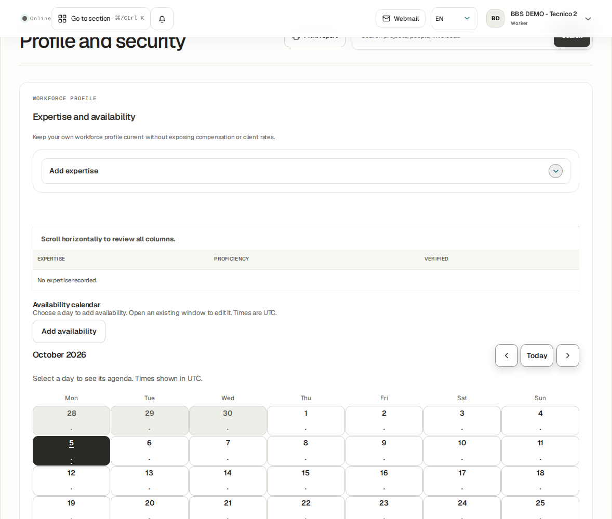

## Use notifications and escalate the right record

Go here: Notifications; Help

Context: Reference procedure · current controls/source checked; mutations not exercised in this role lab

Opening a notification or marking it read is not operational approval, Finance review, payment or customer acceptance. Follow the underlying record and verify its current state.

Help provides role guides and Contact support. The verified support address is admin@j-aautomation.com. A live portal/webmail link is a live company service, not a training switch. No support email was sent in this exercise.

### Do the task

1. Open the notification and follow its record link. Check current state; old notifications can refer to a state that has since changed.
2. For help include role, environment identity, project/record ID, date, intended action and exact error; include a safe screenshot if useful.
3. Send operational corrections to the PM/reviewer, settlement/reimbursement questions to Finance and access/assignment issues to the Owner.

### Verify the result

- Authenticated Worker GETs returned 403 for Finance, Billing and another worker’s time; own receipt returned 200. An archived Finance-only document returned 404, which alone does not prove the active-document access rule.

### If you get stuck

- Never include session cookies, passwords, recovery codes or another worker’s private pay. Permission denial is a handoff signal, not a reason to switch credentials.

## Finish a workday and verify the handoff

Go here: Today → Time → Expenses → Reports → My Pay

Context: Isolated BBS role lab · genuine Worker account · fictional October 2026 records

Use this task checklist on your own project. A saved draft is not a completed workday, and a submitted source still needs the appropriate review.

### Do the task

1. Confirm account/environment/project/date; inspect plans without treating them as actual work.
2. Record actual hours once; inspect and submit the intended drafts.
3. Record each purchase once, preserve payer/currency and attach its real authorized receipt.
4. Save and submit the required Daily and Technical reports with genuine factual evidence.
5. Read returned reasons; create linked corrections where permitted, or hand settlement locks to Finance.
6. Check approved/pending sources and own My Pay; follow reimbursement/settlement questions separately from client billing.

### Verify the result

- Lab passes: native time/expense/report saving and submission, successful linked correction and PM approval, expected finalized-settlement guard, own receipt access, denied unrelated financial access and responsive views.

### If you get stuck

- Reference-only here: account onboarding/sign-in reset, weekly table/layout-copy mutations, bulk expense submission, report attachments/customer acceptance, expertise/availability/security mutations and real bank/email delivery. Native statement result is documented in the evidence appendix.

## What was verified and what remains a reference

Go here: Verification appendix

Context: Isolated BBS role lab · actual browser outcomes and explicit limits

Native authenticated browser records, synthetic receipt fixtures and SHA-256 capture manifests are maintained with the guide. Account secrets are excluded. Original billed October 2–5 history and finalized worker settlements were preserved.

Actual saved/submitted/returned/approved states are distinguished from controls merely inspected. The Owner/PM/Finance handoffs used their own genuine role sessions. This evidence does not claim real bank transfers, live equipment changes or production transactions.

### Do the task

1. Own time saved and submitted; the PM returned it, and the finalized-settlement correction was refused without creating a replacement.
2. Worker 2 own three-hour source corrected through a linked 2.5-hour replacement, submitted and PM approved; original history retained.
3. Own synthetic USD 12 expense saved with receipt, submitted, PM approved and Finance classified/reviewed.
4. Own Daily and Technical reports saved, submitted and PM approved.
5. October 15 current approved activity 195 minutes=3.25 hours; old 3-hour and 1-hour sources excluded from current totals.
6. A published October 16 two-hour plan appeared under Upcoming assignments without creating actual time.
7. Own October 15–16 PDF and CSV statements Ready, native downloads 200, exact stored hash and length match.
8. Another Worker’s statement downloads returned 404; Finance/Billing/other-worker Time denied; own private receipt accessible.
9. Desktop 1440, tablet 768 and phone 390 Time pages fit their viewports.

### Verify the result

- See the adjacent task checklist and role capture manifest for source IDs, screen widths, artifact integrity and expected permission denials.

### If you get stuck

- Reference-only or unperformed here: Account invitation/security recovery; Weekly table/layout copy mutations; Bulk expense and bulk linked correction submission; Report attachments/customer acceptance; Own skills/availability/security mutations; Actual bank transfer/email delivery.
