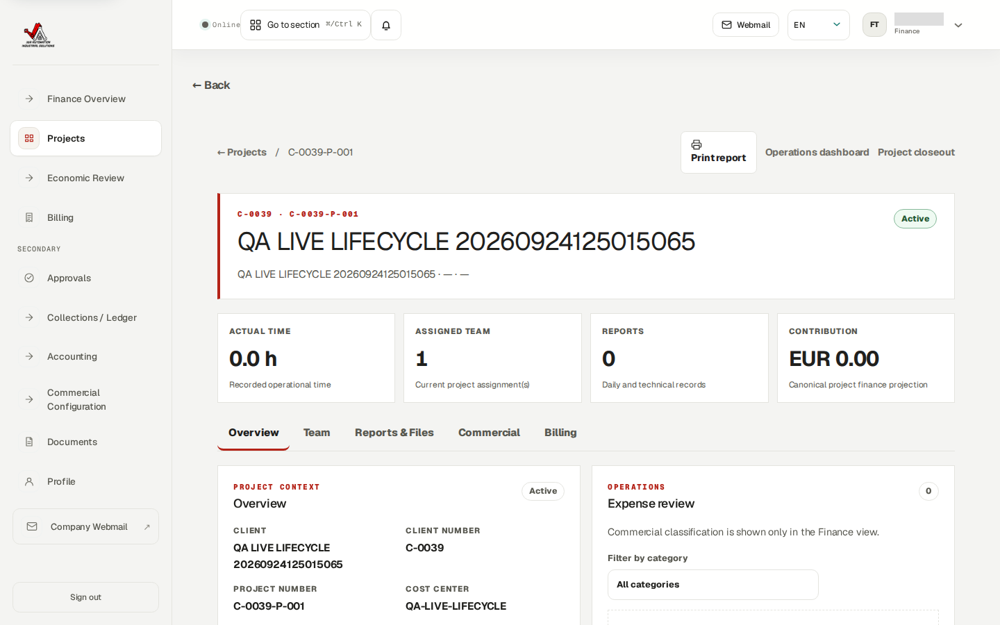
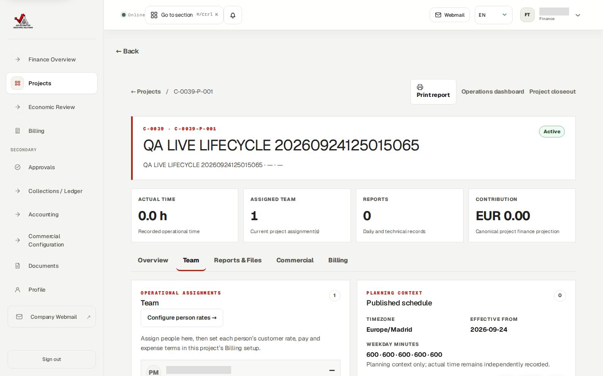
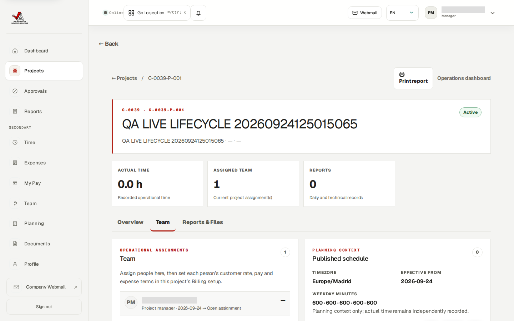
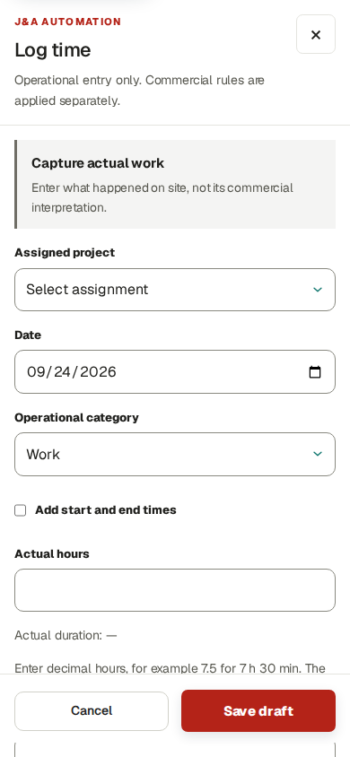
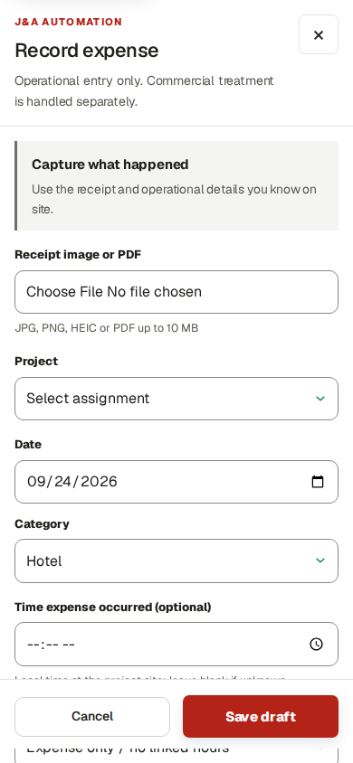
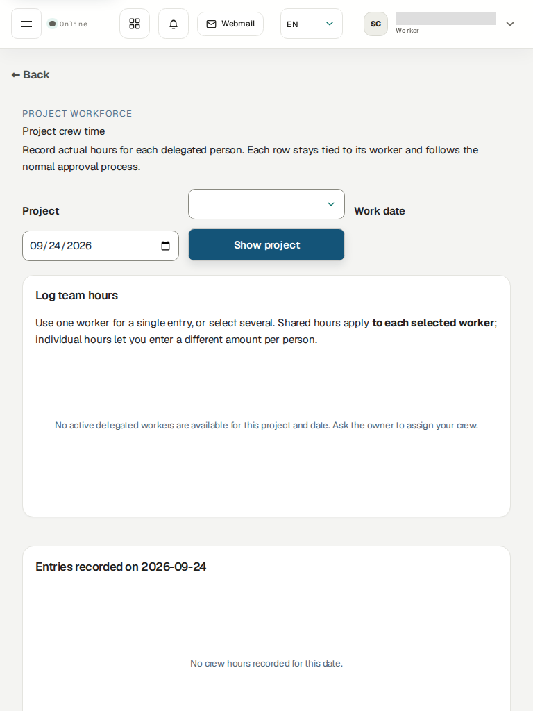

# J&A Automation portal: current work guide

**Observed on the deployed site:** 24 September 2026, release `zip-d215671b99323d6d8c4ce34b74b4f8e0`, at `https://j-aautomation.com/j-aautomation/app`. This is the current English guide for project, crew, time, expense, report and invoice work. All screenshots below were captured in a real authenticated browser using existing **test accounts** and the synthetic `QA LIVE LIFECYCLE` project. No records were changed while preparing the screenshots. [Capture manifest](assets/deployed-2026-09-24/capture-manifest.json) gives the role, route pattern, viewport, capture time and SHA-256 of every image; the raw project UUID is withheld from this public guide.

The synthetic project displayed as `C-0039-P-001`, cost center `QA-LIVE-LIFECYCLE`, is active. At capture it had **one assigned project manager, zero recorded hours, zero reports, zero invoices and no billing stream**. These numbers describe that test project at the capture time, not all business work. Screenshots deliberately exclude real worker compensation, private receipts, mailbox content and credentials. The separate test-account credential manual is private and must never be included in a public PDF or screenshot.

This guide describes the intended normal sequence and the controls visible in this deployed release. A visible form is not proof that submission succeeds. The QA project has not completed a live people → time → expense → invoice cycle; issue, email delivery and payment have not been proven on the clean production data. Local fixes in the worktree are not included in the deployed screenshots.

## Role map

| Role | Normal work | Important boundary |
| --- | --- | --- |
| Owner | Maintain clients, users, projects, project team and chief delegation; approve sensitive setup and evidence | Keep issuer and invoice-number decisions tied to genuine business approval; do not invent accounting approval. |
| Project manager | Coordinate only assigned projects, plan work, inspect reports and review permitted operational submissions | The deployed test-manager project screen does **not** provide a worker-assignment control. Ask Owner to bootstrap workers. A local UI repair exists but is not deployed. |
| Worker | Record own actual hours, receipts/expenses and factual daily or technical reports | Use a real assignment and work date. Workers cannot see another person's pay or customer rates. |
| Chief / delegated team lead | Record actual time for explicitly delegated workers, one person or many; allocate a shared receipt | The Owner must first grant project-specific delegation. A role label alone gives no crew access. |
| Finance administrator | Set project commercial terms and invoice arrangement; review approved sources; draft, approve, issue and collect within granted authority | The deployed Finance test account sees **New legal entity** but a live save returned HTTP 403. Owner-only issuer setup is needed. Issuance also requires a genuinely accountant-approved numbering policy. |
| Auditor | Read only authorized evidence and history | No create, edit, approve, issue or payment action. |

### 1. Owner: create and configure a project

1. Confirm or create the client in **Projects → Clients**. Give the project a clear name and a **required cost center**. Alias, planned end and budgets may remain empty. Confirm currency and timezone before assigning people. The QA project shows the cost center and project number on its Overview.
2. Open the project **Team** tab. Assign workers to the project with effective dates, then configure each person's commercial terms in the project's **Billing** setup. A project can charge one person's customer hours at a different rate from another's; worker pay and expense reimbursement are independent decisions. Do not copy an assumed global labor price into every assignment.
3. Choose each worker's expertise, assignment dates and permitted work categories. Review any planned shifts separately: a published plan does not create actual time.
4. If a lead must enter crew time, grant that person a **project-specific chief delegation** covering the intended workers. Then confirm the Chief's Crew hours page lists only those workers. The captured test chief has no active delegation yet, so the page correctly says to ask Owner to assign the crew.
5. In the project's **Billing** tab, select a saved template or configure from scratch. Choose **one invoice with labor and expenses in separate sections**, or **two separate invoices**. Continue through the later steps to review cadence, source treatment, each person's charge/pay/expense policies and readiness. A saved template supplies defaults; review every person before saving.
6. Establish the issuing legal entity, valid tax profile, project issuer assignment and approved numbering policy through the authorized Owner/Finance workflow. Finance's visible issuer form currently returns 403 on save; do not treat it as a completed setup.

### 2. Project manager: plan, check and review work

Open an assigned project from **Projects**. The **Overview**, **Team** and **Reports & Files** tabs provide operational context. Use **Planning** for future work, **Time** and **Expenses** for actual records, **Approvals** for permitted submitted records, and **Reports** for daily and technical evidence. Always check the project, worker and service date before acting. Submitted time or expense still needs its normal review; a manager must not infer approval from a planning shift.

The deployed QA project manager can see the Team tab but has no **Assign worker** action. Owner must add new workers for this project until the UI repair is released and verified. Commercial rates, worker compensation and invoice issuance are outside this screen.

### 3. Worker: record personal time, expense and report

In **Time → Log time**, select an *assigned* project and actual date. The default entry is **Actual hours**: enter a duration such as `7.5` for 7 hours 30 minutes. Tick **Add start and end times** only when the actual interval is known. Choose the operational category and factual activity; save a draft while incomplete or submit for review when accurate. An interval is not fabricated from a duration. If the project selector is empty, ask Owner or manager to correct the dated assignment.

In **Expenses → Record expense**, attach the permitted receipt, choose the same project, actual date and category, and optionally enter **Time expense occurred**. Enter the amount and real payer in the remainder of the form. An expense can also be entered alongside a time/shift workflow when the project permits it. A receipt or expense submission does not by itself decide worker reimbursement or customer recovery: the project-person policy controls those separately.

In **Reports**, create a factual Daily or Technical / PLC report for the correct project and work date. Submit it for internal review. Internal approval is not customer signature. Review only your own pay in **My Pay**; a scheduled or finalized amount is not proof of a bank transfer.

### 4. Chief: enter a crew's actual activity

Open **Crew hours** after Owner grants a dated delegation on the project. Choose the project and work date, then **Show project**. Select one worker for a single entry, or several workers for a crew entry. **Shared hours** apply the entered duration to each selected person; **individual hours** let the chief enter a different duration for each. Check every worker row before submitting. The saved records belong to each actual worker and retain the chief as the submitting actor. The normal approval rules still apply; chief access does not grant pay visibility or self-approval.

For one shared receipt, record one expense and use **Allocate one crew receipt** to split that amount across selected workers. The allocations must total the receipt; do not upload or reimburse the same receipt once per person. The captured tablet view is an honest blocked state: the test chief currently has no active delegated workers for a selected project/date. The crew submission itself has **not** been re-proven on this cleaned live app.

### 5. Finance: calculate, invoice and collect

Open the project's **Commercial** and **Billing** tabs. Check customer hourly charge, worker pay, expense reimbursement, expense recovery, effective dates, budget/cap and source-readiness warnings **per person**. A project can have seven people charged at €55/hour and one at €70/hour, with separate worker pay and expense policies. These are example terms, **not** the actual QA project's saved rates. Never assume blank means zero or that an expense the worker paid is automatically billable to the client.

Choose the project invoice arrangement in the four-step project-local setup: **one invoice with labor and expenses in two sections** is available, as are **two separate invoices**. A saved template only pre-fills fields. After approved time and classified expenses exist, open **Billing → Create invoice** and inspect the exact period, included/excluded source rows, customer, rates, taxes and totals. Review the draft/PDF, then approve and issue only through the authorized workflow and a genuine accountant-approved numbering policy. Issued documents are historical snapshots; correct them through void/credit/replacement, not editing.

**Mark sent** only records a manual sending action. **Send by email** queues actual delivery and requires a ready PDF and permitted recipient; SMTP acceptance is not inbox receipt. Record a collection only from real payment evidence. On the captured clean QA state the Billing register has **0 invoices**, so no issued, emailed or paid live invoice can be shown as completed.

### 6. Auditor and all roles: follow the evidence

Open only the project/report/invoice records granted to your role. A visible figure should link back to approved time, expense, report and rule evidence. Treat draft, submitted, approved, invoiced, sent, collected and paid as different states. If an error appears, keep the record reference and error text for the Owner or support contact; do not retry a money action blindly. Do not use another person's account or private data to bypass a missing permission.

## What was and was not checked for this edition

The nine screenshots are direct browser captures of public-origin HTTP 200 pages in Chromium at desktop, 390-pixel phone and 768-pixel tablet viewports. They prove the named controls and current QA empty state were displayed to those test roles on the identified release. They do **not** prove that all actions save, that PDF/email jobs complete, or that physical iPhone/iPad Safari works. Browser WebKit emulation and separate isolated acceptance tests exist, but are not physical-device or clean-live invoice evidence. The [implementation and acceptance evidence](../evidence/project-finance-20260923/) records those results separately.
