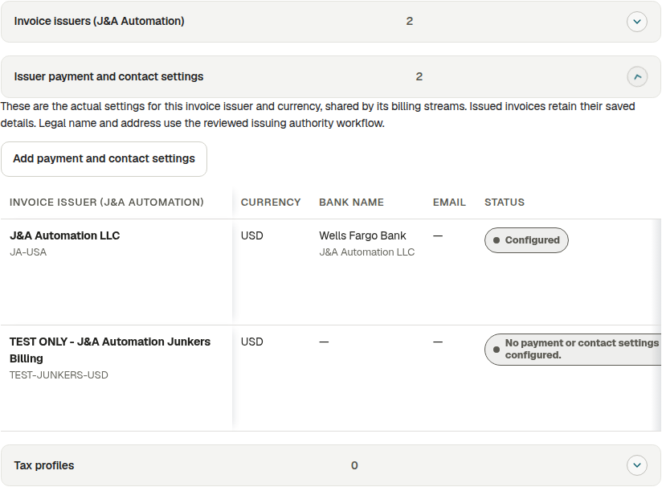
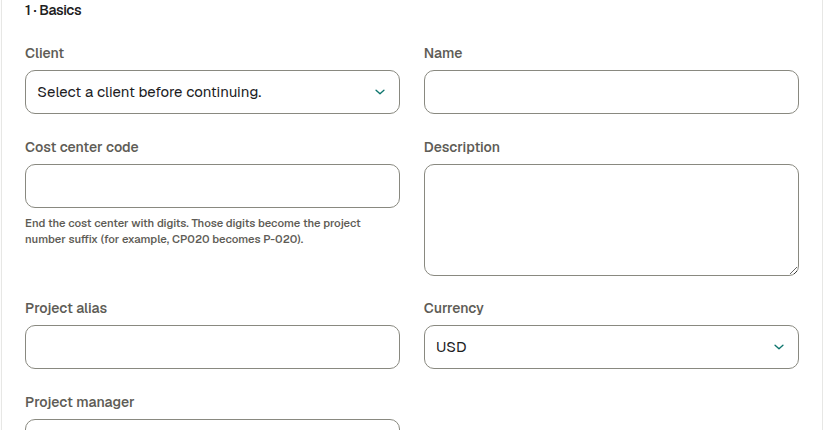
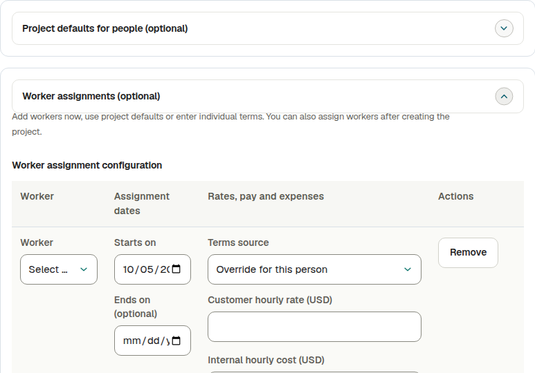
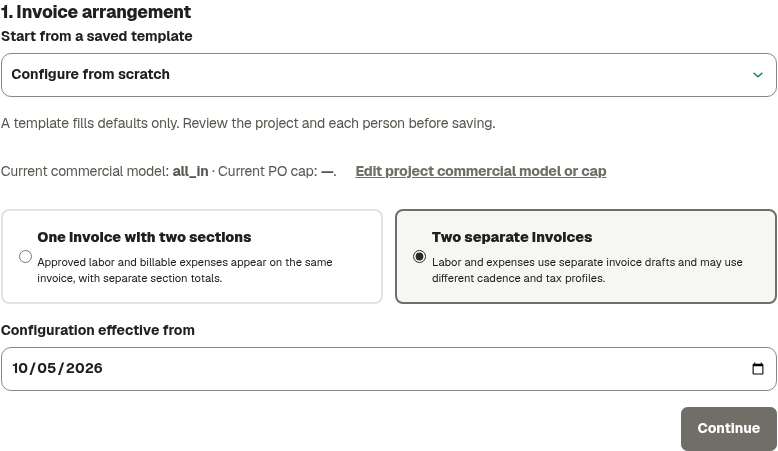
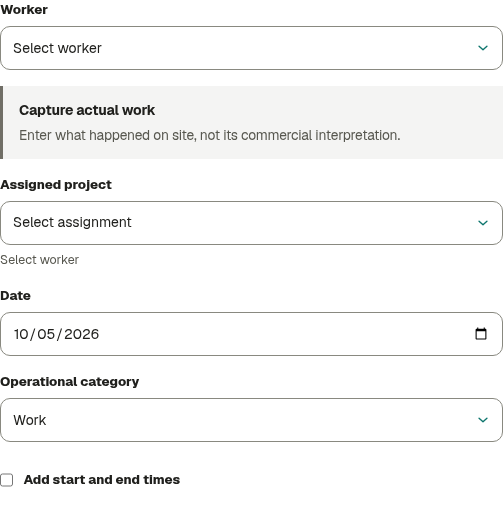
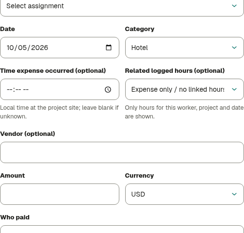
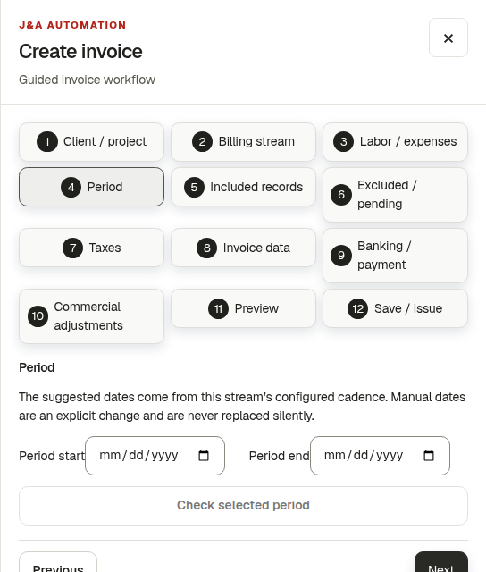

# Project to invoice

**J&A Automation · Quick guide · English · 5 October 2026**

Eight steps from a new customer and project to a saved invoice PDF. Existing projects can start at the first unfinished step.

Actual app screenshots from an isolated verification copy; example forms, English UI. Captures illustrate the controls without changing production records.

<!-- page: 1 -->

## 1. Set up the customer and invoice issuer

**Who:** Owner for administration; Owner/Finance for permitted billing settings.

1. Open **Projects → Clients → Create client** when the customer is missing. Set its name, billing address/email, currency, payment terms and optional PO reference. Add its billing contact.
2. Open **Billing → Configure billing → New invoice issuer**. The Owner enters the issuing company's actual legal name, currency, address and registration/tax identifiers.
3. Expand **Issuer payment and contact settings**. Choose **Add payment and contact settings** or **Edit**, then save the bank instructions and company contacts. These settings are shared by streams using that issuer and currency.
4. Use **New tax profile** for the agreed component, percentage, currency, issuer and effective date. An explicit 0% profile is available when appropriate.

**Numbering:** before final issue, the Owner configures **Invoice numbering policy** using the approved business numbering arrangement.

**Existing records:** use Edit or Add. Archiving an issuer/tax profile removes it from active setup and retains history. **Clear payment and contact settings** empties those fields without deleting the issuer. Tax editing renames the profile; changed rates/dates require a new profile.

<!-- page: 2 -->

## 2. Create the project and assign workers

**Who:** Owner/Finance for permitted project creation; Owner for assignments.

1. Open **Projects → New Project**. Choose the customer, name, currency, timezone, start date and manager. The required **Cost center code** ends in digits: CP020 gives project suffix P-020.
2. In **2 · People**, optionally save **Project defaults for people** and use **Add worker assignment**. Choose default or individual terms for each person. You can also add workers later.
3. In **3 · Commercial defaults**, choose **Time & materials**, **T&M · daily minimum**, **Hourly labor with included expenses (all-in)** or **Capped T&M** as agreed. Enter a cap only when the contract requires one; optional budgets may remain empty.
4. Choose **Create project**. Reopen **Overview** and check the identifiers. Use the project editor for its PO number. Open **Team → Assign worker** for remaining active workers and their assignment dates.

**No workers listed?** Owner first creates/activates the appropriate workforce account. Ending an assignment preserves past work.

Expected hours and planned shifts are planning context. Customer minimums and worker pay are separate rules. All-in generally keeps labor hourly while including selected expenses. None of these settings creates actual time.

<!-- page: 3 -->

## 3. Review each person's rates and pay

**Who:** Owner/Finance.

In the project's **Billing** setup, open **3. Review each person**. Choose the person and **Terms effective from** date.

| Setting                         | Meaning                                                                                                                      |
| ------------------------------- | ---------------------------------------------------------------------------------------------------------------------------- |
| Customer hourly rate            | Customer charge for eligible labor.                                                                                          |
| Worker compensation method/rate | Worker pay: Hourly, Daily, Fixed per billing period, Fixed project amount or Percentage of eligible client labor, as agreed. |
| Internal hourly cost            | Internal project labor cost.                                                                                                 |
| Percentage basis                | Percentage pay only: eligible labor before tax, after approved discount, issued or collected.                                |

Review the expense policy described in step 6, then choose **Save person terms** for each required person.

**Defaults versus overrides:** **Use project defaults in this draft** fills the draft. Review the date and save to apply it. Changed rates become person overrides. **Save these rates as explicit person overrides** also pins rates currently equal to a default. Later defaults/templates do not silently replace existing person agreements.

Bulk controls can copy one person's draft to selected people. Review their individual dates before saving; people can keep different rates and pay.

Use the project's commercial/Finance configuration for agreed minimums, travel, standby and overtime. Customer billing and worker compensation can differ.

<!-- page: 4 -->

## 4. Configure the project's invoice arrangement

**Who:** Owner/Finance.

Open the project's **Billing** tab. Start from a saved template or **Configure from scratch**; a template supplies defaults to review.

1. **Invoice arrangement:** choose **One invoice with two sections** for labor and expenses together, or **Two separate invoices**. Enter the configuration's effective date.
2. **Billing details:** select the issuer matching project currency, tax profile(s), cadence, layout, grouping, contact, recipient email and payment terms.
3. **Review each person:** finish and save their charge/pay/expense terms.
4. **Review and save:** check the summary and missing terms. Optionally save a reusable template, then choose **Save billing setup**.

| Cadence       | Period                              |
| ------------- | ----------------------------------- |
| Weekly        | Weekly.                             |
| Every 14 days | Two weeks; requires an anchor date. |
| Semi-monthly  | Days 1–15 and 16–month end.         |
| Monthly       | Monthly.                            |
| Manual        | Period selected deliberately.       |

Separate invoices can have different labor/expense cadence and taxes. Layout offers **Standard**, **Detailed** or **Summary**; grouping offers worker, day, category, detailed or summary. Automatic preparation creates drafts for review, never automatic issue or sending.

**Project issuing authority:** in **Commercial Configuration**, select the project and **Project issuing authority**. Review/create the verified legal entity revision and dated assignment. It must agree with the stream's issuer; selecting a stream issuer does not replace this authority.

<!-- page: 5 -->

## 5. Record actual time and submit it

**Who:** Worker records; authorized reviewer approves.

1. Open **Time → Log time**. Select an assigned project and the actual date. A missing project usually needs an assignment check.
2. Enter **Actual hours**, such as `7.5` for seven hours thirty minutes, category and factual activity.
3. Use **Add start and end times** when the actual clocks are known. Enter the project's local clocks and real break; duration-only entries can remain duration-only.
4. Choose **Save draft**. Review the saved entry in the register and choose **Submit**, or review the week and use **Submit all week drafts**.
5. The responsible reviewer checks **Approvals** and approves or requests changes. Correct returned entries and submit again.

Approved sources and configured rules determine billable time. Drafts, submitted records, expected hours and planned shifts are distinct states.

Submit Daily or Technical / PLC reports when required. If customer sign-off is required before billing, complete the signed/conformed period report before final issue; internal approval is separate.

An authorized chief may enter shared or individual crew hours within their project/date delegation. Each worker's records follow normal review.

<!-- page: 6 -->

## 6. Record expenses and review their treatment

**Who:** Worker records; authorized reviewer checks evidence; Owner/Finance sets treatment.

1. Open **Expenses → Record expense**. Enter project, date, category, description, amount/currency and real payer. Attach the required receipt; occurrence time is optional.
2. **Save draft**, then review the saved record and use **Submit**. For expenses saved with time, follow the notice to submit the pair with weekly time entries.
3. In the person's project **Billing** terms, choose **Expense payer**: Worker, Company card, Company direct, Client or Third party. Policies are separate for each payer.
4. Review the independent decisions below, save the person terms and resolve any remaining commercial classification in Finance.

| Decision                    | Choices                                                                                              |
| --------------------------- | ---------------------------------------------------------------------------------------------------- |
| Worker reimbursement source | Use project reimbursement default, or Override for this person; check the effective date.            |
| Reimburse worker            | At cost or No reimbursement for worker-paid expenses.                                                |
| Charge customer for expense | At cost, Cost plus markup, Included in labor price, Do not charge customer, or Client pays directly. |

For example, J&A can reimburse a worker 100 while charging the customer 0. Included/all-in expenses affect project cost without a separate customer expense charge. Receipt approval does not itself decide these treatments.

Only approved, eligible customer-chargeable expenses enter the invoice. Allocate a shared crew receipt once; allocations must equal its total.

<!-- page: 7 -->

## 7. Create the invoice draft for its period

**Who:** Owner/Finance.

Open **Billing → Create invoice**. Choose the project and active stream. A stream defines sources, cadence, tax and template; saving it does not create an invoice.

1. Check the suggested service period against the agreement. Manual dates are a deliberate change.
2. Review **Included records** and **Excluded / pending**. Use the offered links to resolve approvals, missing rates, dates, issuer/tax or sign-off issues.
3. Check customer/project/cost center, PO, currency, tax, recipient, terms, bank details and calculated totals against the sources.
4. Review the preview, choose **Save invoice draft**, wait for confirmation and find it in **Invoices**.

**No stream yet?** Finish the project Billing setup, or use **Configure billing → New billing stream**. That form fills project currency/PO, client terms/email and a uniquely identifiable billing contact. Review them; issuer and tax remain choices. Missing client terms show a 30-day starting value to review.

The direct form offers labor, expense, milestone/other streams; detailed/summary/fixed-milestone templates; effective/anchor dates; additional Custom/Milestone cadence and draft automation. Use the choices applicable to your agreement. Line grouping is configured in project Billing.

**Zero-source warning:** no eligible hours/expenses, zero billable total or an existing invoice for the period needs review. Check dates, approvals and terms before continuing. Customer sign-off may still block final issue.

<!-- page: 8 -->

## 8. Review the saved draft and download the PDF

**Who:** Owner/Finance edits permitted drafts; Auditor reads authorized evidence.

1. Open the saved **Draft** in **Billing → Invoices**. Check its preview, identifiers, service period, lines, taxes and total.
2. Select an underlined field or **Edit Invoice Details**. Review dates, payment terms, Purchase No., notice and bank/contact fields. Choose **Save Details** and wait for confirmation.
3. Choose **Download PDF · Preview**. This unissued draft PDF is for review; compare it with the saved preview after edits.

| Edited detail           | Saved to                                                             |
| ----------------------- | -------------------------------------------------------------------- |
| Invoice/due date        | This draft; an empty explicit due date uses invoice date plus terms. |
| Terms / past-due notice | Actual stream and current draft.                                     |
| Purchase No.            | Existing stream PO override, or project PO when no override exists.  |
| Bank / company contacts | Shared issuer settings for that currency.                            |

Hours, rates, expenses, discounts, tax and totals use their source/calculation workflows. Follow source links, correct/reapprove as required and rebuild/recalculate the draft. A source conflict preserves entered values for reconciliation.

**Final issue:** when ready, resolve sign-off/readiness and numbering requirements, then use authorized approval and issue. Issue assigns the number and preserves the historical snapshot. Issuing is unnecessary for a draft review PDF.

Issued invoices provide ready **Open PDF / Download PDF** controls. Wait/retry queued, running or failed generation. Corrections use void, credit/adjustment or replacement. **Earlier layout → Generate current layout** retains the previous artifact under **Previous PDF layouts**.

Keep the invoice reference and PDF. Downloading does not send the invoice or record customer payment.

