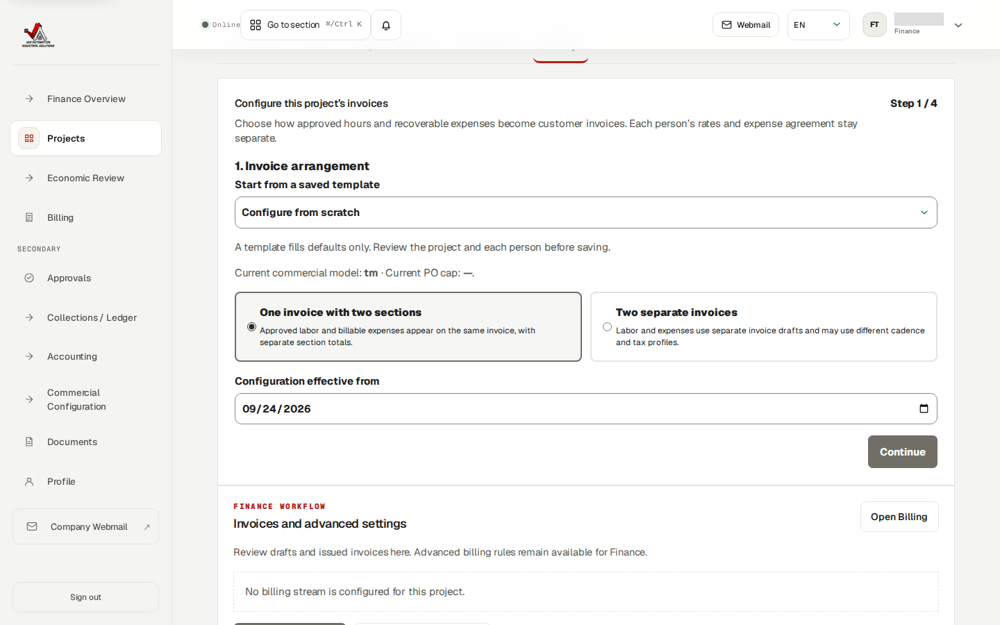
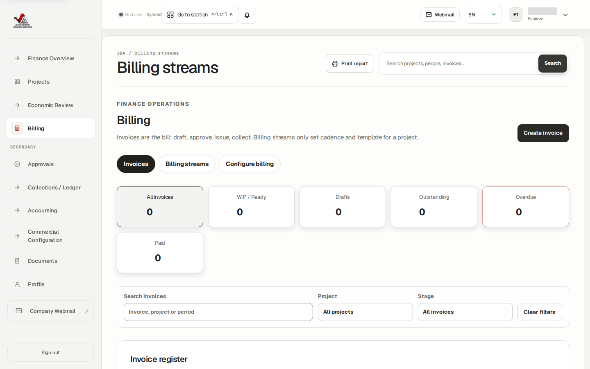

# Finance administrator: current billing guide

**Deployed edition, 24 September 2026.** See the [full current guide](Current_Deployed_Workflows_2026-09-24.md) and [role-flow diagram](Role_Workflows.pdf). The images below came from an authenticated Finance test account on the deployed app.

1. Open the project's **Commercial** and **Billing** tabs. Check effective per-person customer rates, worker compensation, expense policy, currency and any cap. A blank budget is not a zero budget or an invoice blocker unless an explicit cap needs a value.
2. In project **Billing**, start from a template or from scratch. Choose **one invoice with two sections** or **two separate invoices**, then review project cadence, invoice source treatment and each person's configuration. Changes to current rules must not rewrite an issued historical invoice.
3. Review submitted and approved time, expenses and reports. Resolve any missing-rate, source, tax or issuer readiness warning before drafting. A preview is a calculation review, not an issued invoice.
4. In **Billing → Create invoice**, select the project and period; check included and excluded source rows, labor and expense amounts, tax and recipient. Review the draft and its PDF before authorized approval and issue. Sending email requires a ready PDF and a permitted address; **Mark sent** records manual sending only. Record collection only from actual payment evidence.

**Current deployed limitation:** the Finance test account sees a New legal entity form, but its save returned HTTP 403. Owner setup is required before this QA project can complete invoice readiness; an actual accountant-approved numbering policy is also required. No live invoice was issued, emailed or paid in this capture.
