# J&A Automation V3 — Diagramas UML Completos

Generados a partir de la revisión del código implementado y la especificación V3.

> [!NOTE]
> Todos los diagramas reflejan el **código realmente implementado** en el repositorio (966 líneas de schema Drizzle, 50+ tablas SQLite, billing-engine, money, domain, portal SvelteKit, website Next.js) cruzado con la especificación V3 de 5.395 líneas.

---

## 1. Diagrama de Componentes (Arquitectura del Monorepo)

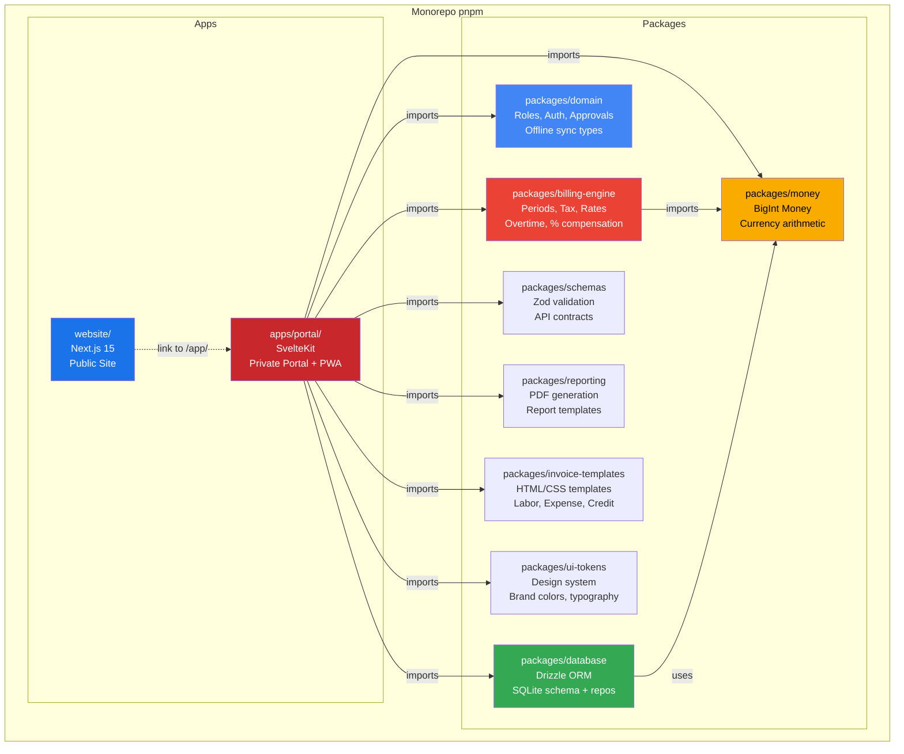

---

## 2. Diagrama de Clases del Dominio (Entidades Principales)

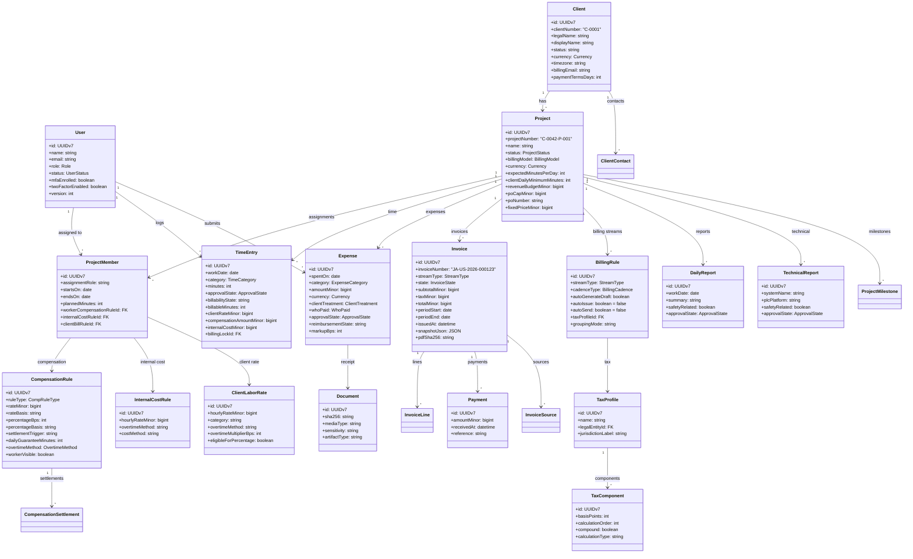

---

## 3. Diagrama ER de la Base de Datos (50+ tablas SQLite)

```mermaid
erDiagram
    user ||--o{ session : has
    user ||--o{ account : authenticates
    user ||--o{ passkey : registers
    user ||--o| two_factor : configures
    user ||--o{ invitation : invited_by
    user ||--o{ project_member : assigned
    user ||--o{ time_entry : logs
    user ||--o{ expense : submits
    user ||--o{ daily_report : writes
    user ||--o{ technical_report : authors
    user ||--o{ notification : receives
    user ||--o{ worker_skill : has

    client ||--o{ project : has
    client ||--o{ client_contact : contacts

    project ||--o{ project_member : assignments
    project ||--o{ time_entry : time
    project ||--o{ expense : expenses
    project ||--o{ invoice : invoices
    project ||--o{ billing_rule : streams
    project ||--o{ daily_report : reports
    project ||--o{ technical_report : technical
    project ||--o{ technical_change : changes
    project ||--o{ document : documents
    project ||--o{ project_milestone : milestones
    project ||--o{ schedule : schedules
    project ||--o{ planning_assignment : planning
    project ||--o{ client_labor_rate : rates
    project ||--o{ billing_lock : locks
    project ||--o{ finance_snapshot : snapshots
    project ||--o| project_closeout : closeout

    project_member ||--o{ assignment_rate_override : overrides

    invoice ||--o{ invoice_line : lines
    invoice ||--o{ invoice_source : sources
    invoice ||--o{ payment : payments
    invoice ||--o{ invoice_event : events
    invoice ||--o{ invoice_adjustment : adjustments

    billing_rule ||--o{ billing_period : periods
    billing_rule }o--|| tax_profile : uses
    tax_profile ||--o{ tax_component : components

    compensation_rule ||--o{ compensation_settlement : settlements

    legal_entity ||--o{ invoice_number_policy : policies
    legal_entity ||--o{ tax_profile : profiles

    accounting_period ||--o{ accounting_pack_run : packs
    accounting_pack_run ||--o{ accounting_pack_export : exports

    technical_report ||--o{ technical_change : changes

    period_report ||--o{ report_source : sources
```

---

## 4. Diagrama de Estados — Time Entry

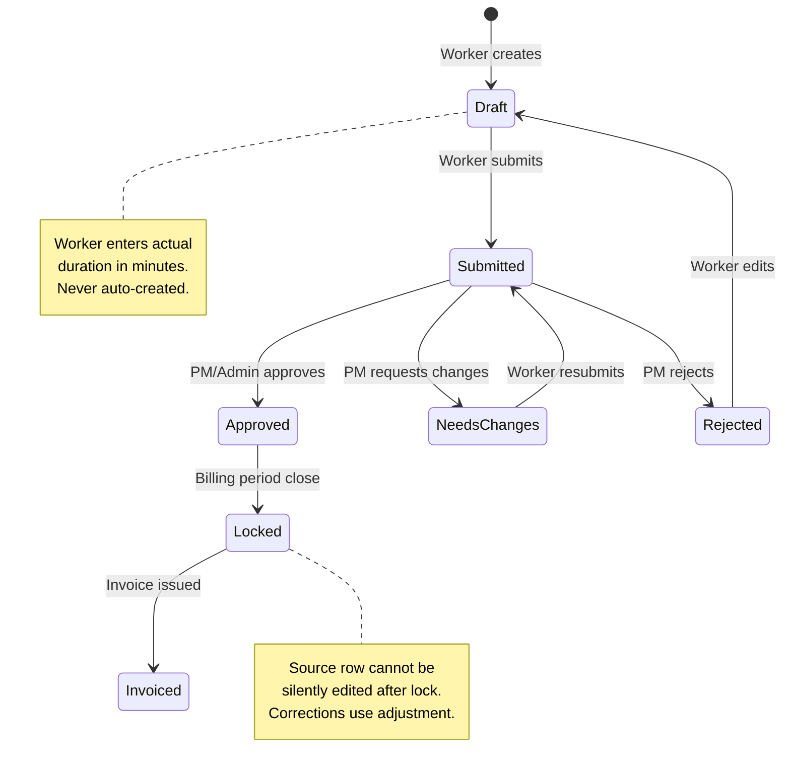

---

## 5. Diagrama de Estados — Invoice

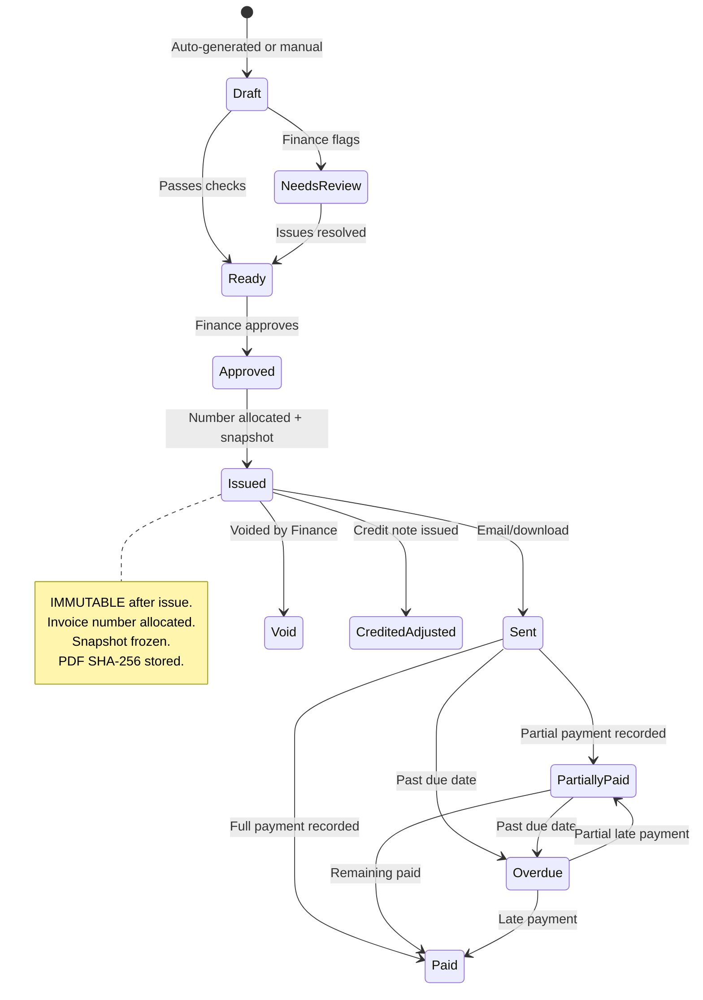

---

## 6. Diagrama de Estados — Expense

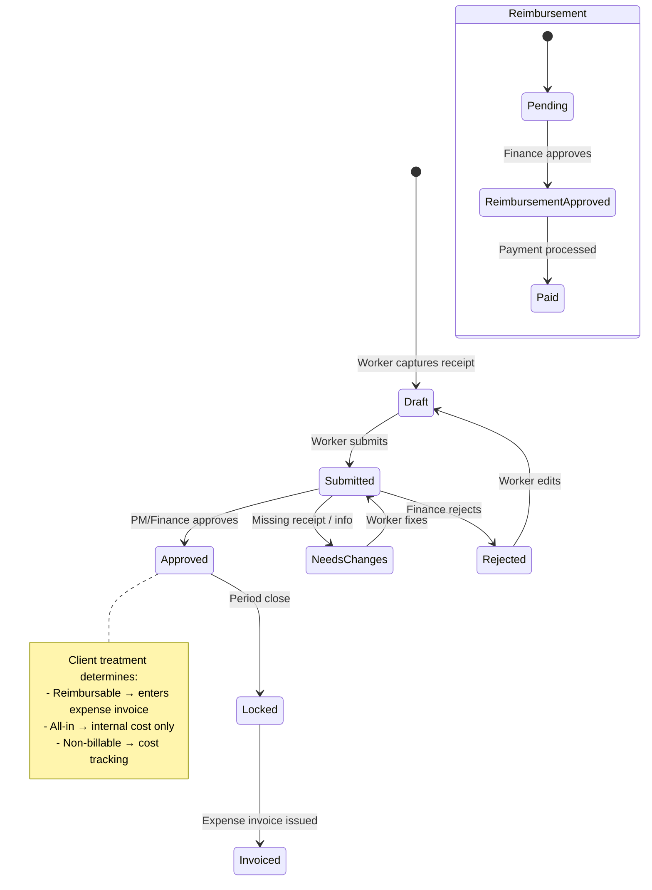

---

## 7. Diagrama de Estados — Project

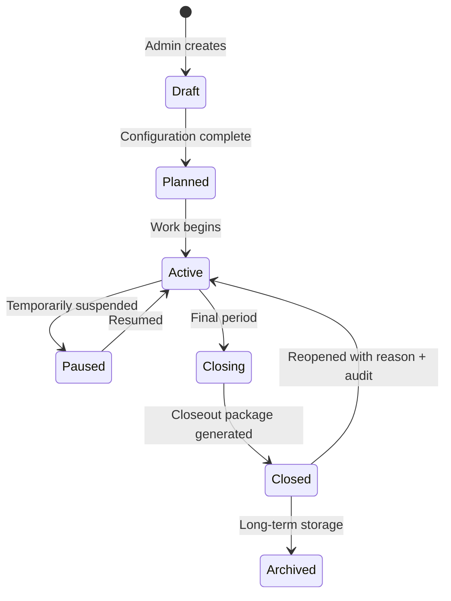

---

## 8. Diagrama de Secuencia — Billing Period Close → Invoice Issue

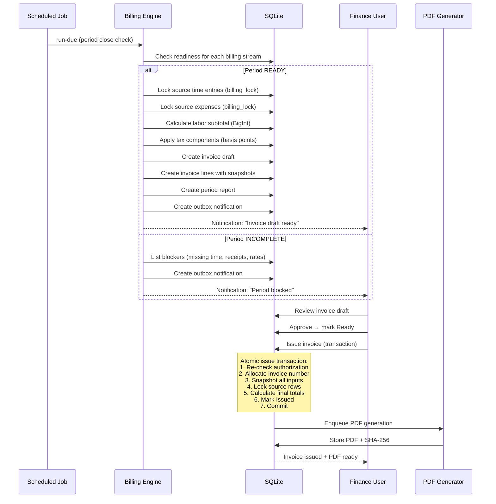

---

## 9. Diagrama de Secuencia — Worker Offline Sync

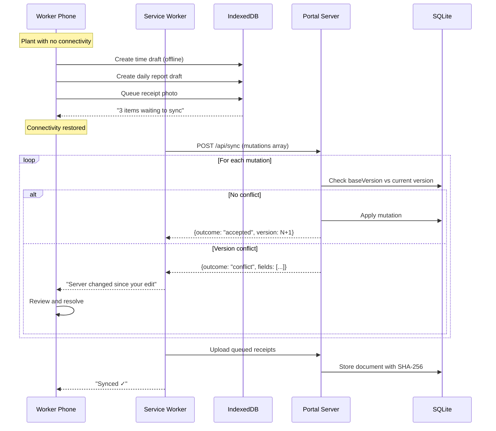

---

## 10. Diagrama de Actividad — Worker Daily Flow

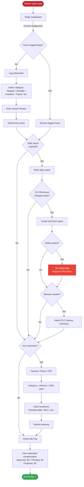

---

## 11. Diagrama de Deployment (Producción VPS)

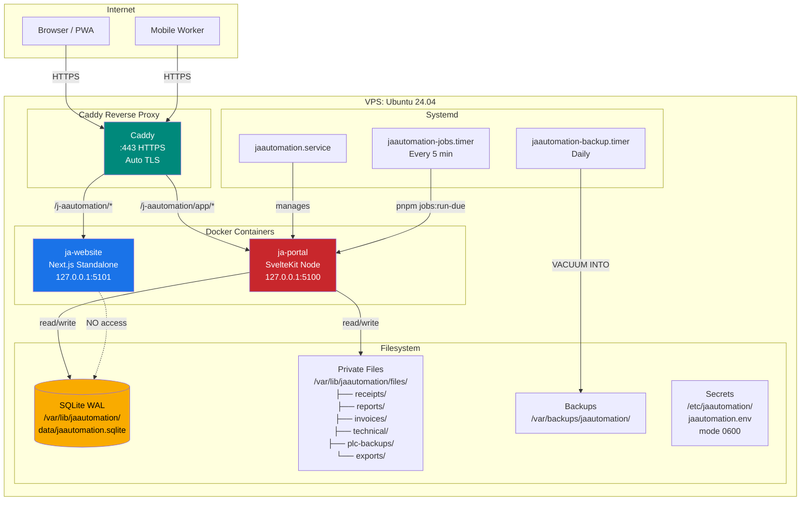

---

## 12. Diagrama de Secuencia — Finance Time Economics Review

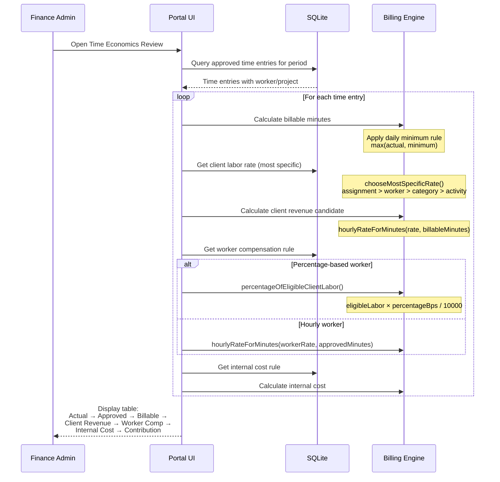

---

## 13. Diagrama de Paquetes — Value Objects y Types

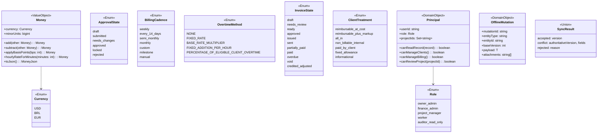

---

## Resumen de cobertura Código ↔ V3

| Capa | Tablas/Archivos implementados | V3 Secciones cubiertas |
|------|-------------------------------|------------------------|
| **Identity** | user, session, account, passkey, two_factor, invitation | §6, §36 |
| **Clients** | client, client_contact | §7.1 |
| **Projects** | project, project_member, project_milestone, schedule, planning_assignment | §7.2–7.3, §8, §30 |
| **Time** | time_entry | §9–11 |
| **Reports** | daily_report, technical_report, technical_change, period_report, report_source | §13–14 |
| **Expenses** | expense, document | §15 |
| **Compensation** | compensation_rule, compensation_settlement, internal_cost_rule, assignment_rate_override | §12 |
| **Billing** | client_labor_rate, billing_rule, billing_period, billing_lock | §16–18 |
| **Tax** | tax_profile, tax_component, legal_entity | §19 |
| **Invoices** | invoice, invoice_line, invoice_source, invoice_event, invoice_adjustment, invoice_number_policy, payment | §21–23 |
| **Finance** | finance_snapshot, accounting_period, accounting_pack_run, accounting_pack_export | §26–27, §32, §67 |
| **Notifications** | notification, outbox_event | §33 |
| **Audit** | audit_event, approval_event, document_access_event | §38 |
| **Jobs** | job, job_run, scheduled_job | §24, §42 |
| **Offline** | offline_mutation, mutation_receipt | §34 |
| **Skills** | skill, worker_skill, worker_availability | §31 |
| **Closeout** | project_closeout | §65 |
| **Domain** | Principal, Role, ApprovalState, OfflineMutation, SyncResult | §6, §25, §34 |
| **Money** | Money, Currency, add, subtract, applyBasisPoints, hourlyRateForMinutes | §20 |
| **Billing Engine** | periods, dailyMinimum, laborSubtotal, taxComponents, overtimeRate, percentageOfEligibleClientLabor, chooseMostSpecificRate | §16–19, §12.2, §12.4, §12.6 |
